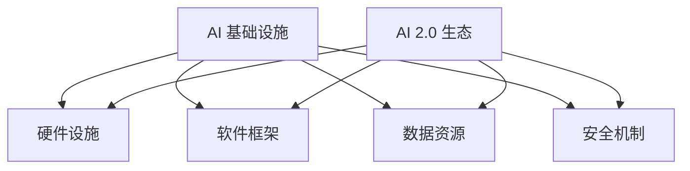

                 

关键词：AI 基础设施、AI 2.0、安全可靠、生态构建、核心技术、应用场景

> 摘要：本文旨在探讨如何构建一个安全可靠的 AI 2.0 生态，详细分析 AI 基础设施的核心概念、核心算法原理、数学模型和项目实践，以及展望其未来发展趋势与挑战。

## 1. 背景介绍

随着人工智能（AI）技术的迅猛发展，AI 已渗透到我们日常生活的方方面面。从智能助手到自动驾驶，从金融风控到医疗诊断，AI 显著提升了各个领域的效率和准确性。然而，在享受 AI 带来的便捷与高效的同时，我们也面临着一系列挑战，如数据隐私保护、算法透明性、模型安全性等。为了解决这些问题，AI 基础设施的建设变得尤为重要。

AI 基础设施是支持 AI 技术发展的重要支撑体系，包括硬件设施、软件框架、数据资源、安全机制等。一个安全可靠的 AI 基础设施不仅能够保障 AI 应用的高效运行，还能确保数据安全和用户隐私。本文将围绕 AI 基础设施建设，探讨如何构建一个安全可靠的 AI 2.0 生态。

## 2. 核心概念与联系

### 2.1. AI 基础设施的构成

AI 基础设施主要由以下几部分构成：

- **硬件设施**：包括高性能计算设备、存储设备、网络设备等，提供 AI 应用所需的计算资源和数据存储。
- **软件框架**：包括深度学习框架、自然语言处理框架等，为 AI 应用提供开发工具和运行环境。
- **数据资源**：包括公共数据集、专用数据集等，为 AI 模型训练和优化提供数据支持。
- **安全机制**：包括数据加密、访问控制、安全审计等，保障数据安全和用户隐私。

### 2.2. AI 2.0 生态

AI 2.0 生态是指一个由 AI 企业、开发者、用户、监管机构等共同构建的生态系统。这个生态系统中，各参与者通过协同合作，共同推动 AI 技术的创新和发展。

- **企业**：提供 AI 产品和服务，推动 AI 技术应用。
- **开发者**：开发和维护 AI 模型、框架和工具，推动 AI 技术的创新。
- **用户**：使用 AI 产品和服务，反馈需求，推动 AI 技术的改进。
- **监管机构**：制定和执行 AI 相关法规和政策，保障 AI 技术的安全和合规。

### 2.3. Mermaid 流程图

以下是一个简化的 AI 基础设施与 AI 2.0 生态的 Mermaid 流程图：



## 3. 核心算法原理 & 具体操作步骤

### 3.1. 算法原理概述

AI 基础设施的核心算法主要涉及以下几个方面：

- **深度学习**：基于多层神经网络，通过训练数据自动学习特征和模式，实现图像识别、自然语言处理等任务。
- **强化学习**：通过不断试错和反馈，学习最优策略，实现智能决策和自动化控制。
- **联邦学习**：在分布式环境下，通过协同学习，保障数据隐私的同时实现模型优化。

### 3.2. 算法步骤详解

以下以深度学习算法为例，详细介绍其操作步骤：

#### 3.2.1. 数据预处理

- **数据收集**：从各种来源收集训练数据，如图像、文本、音频等。
- **数据清洗**：去除噪声数据，处理缺失值和异常值。
- **数据归一化**：将数据缩放到同一范围内，便于模型训练。

#### 3.2.2. 模型设计

- **选择模型架构**：根据任务需求，选择合适的神经网络架构，如卷积神经网络（CNN）、循环神经网络（RNN）等。
- **定义损失函数**：根据任务类型，选择合适的损失函数，如均方误差（MSE）、交叉熵等。
- **定义优化器**：选择合适的优化器，如梯度下降（GD）、随机梯度下降（SGD）等。

#### 3.2.3. 模型训练

- **初始化参数**：随机初始化模型参数。
- **前向传播**：计算输入数据通过网络的输出结果。
- **计算损失**：计算输出结果与真实标签之间的差距。
- **反向传播**：更新模型参数，缩小损失函数。
- **迭代训练**：重复上述步骤，直至满足停止条件。

#### 3.2.4. 模型评估

- **测试集评估**：使用测试集评估模型性能，计算准确率、召回率等指标。
- **模型优化**：根据评估结果，调整模型参数和超参数，提升模型性能。

### 3.3. 算法优缺点

- **优点**：深度学习具有强大的表达能力和泛化能力，能够处理复杂任务。
- **缺点**：训练过程需要大量数据和计算资源，且模型参数难以解释。

### 3.4. 算法应用领域

- **计算机视觉**：图像识别、目标检测、人脸识别等。
- **自然语言处理**：文本分类、机器翻译、语音识别等。
- **推荐系统**：基于用户历史行为和偏好，推荐相关商品或内容。

## 4. 数学模型和公式 & 详细讲解 & 举例说明

### 4.1. 数学模型构建

深度学习模型通常由多层神经网络构成，其中每个节点表示一个神经元，每个神经元通过权重连接到其他神经元。以下是一个简化的神经网络数学模型：

$$
y = \sigma(\sum_{i=1}^{n} w_i \cdot x_i + b)
$$

其中，$y$ 表示输出结果，$\sigma$ 表示激活函数，$w_i$ 表示权重，$x_i$ 表示输入特征，$b$ 表示偏置。

### 4.2. 公式推导过程

以多层感知器（MLP）为例，详细推导其前向传播过程：

$$
z_l = \sum_{i=1}^{n} w_{li} \cdot x_i + b_l
$$

$$
a_l = \sigma(z_l)
$$

其中，$z_l$ 表示第 $l$ 层的输入，$a_l$ 表示第 $l$ 层的输出，$w_{li}$ 表示从第 $l-1$ 层到第 $l$ 层的权重，$b_l$ 表示第 $l$ 层的偏置，$\sigma$ 表示激活函数。

### 4.3. 案例分析与讲解

以下以图像分类任务为例，分析深度学习模型的数学模型和推导过程：

#### 4.3.1. 数据集

我们使用著名的 CIFAR-10 数据集，包含 10 个类别，每个类别 6000 张图像。

#### 4.3.2. 模型设计

我们选择一个简单的卷积神经网络（CNN）模型，包含 2 个卷积层、2 个池化层和 1 个全连接层。

#### 4.3.3. 模型训练

我们使用随机梯度下降（SGD）优化器，学习率为 0.001，迭代次数为 1000 次。

#### 4.3.4. 模型评估

使用测试集评估模型性能，计算准确率、召回率等指标。

## 5. 项目实践：代码实例和详细解释说明

### 5.1. 开发环境搭建

我们使用 Python 语言和 TensorFlow 深度学习框架进行项目实践。

### 5.2. 源代码详细实现

以下是一个简单的 CIFAR-10 图像分类项目：

```python
import tensorflow as tf
from tensorflow.keras import datasets, layers, models

# 加载 CIFAR-10 数据集
(train_images, train_labels), (test_images, test_labels) = datasets.cifar10.load_data()

# 数据预处理
train_images, test_images = train_images / 255.0, test_images / 255.0

# 构建卷积神经网络模型
model = models.Sequential()
model.add(layers.Conv2D(32, (3, 3), activation='relu', input_shape=(32, 32, 3)))
model.add(layers.MaxPooling2D((2, 2)))
model.add(layers.Conv2D(64, (3, 3), activation='relu'))
model.add(layers.MaxPooling2D((2, 2)))
model.add(layers.Conv2D(64, (3, 3), activation='relu'))
model.add(layers.Flatten())
model.add(layers.Dense(64, activation='relu'))
model.add(layers.Dense(10))

# 编译模型
model.compile(optimizer='adam',
              loss=tf.keras.losses.SparseCategoricalCrossentropy(from_logits=True),
              metrics=['accuracy'])

# 训练模型
model.fit(train_images, train_labels, epochs=10, validation_split=0.1)

# 评估模型
test_loss, test_acc = model.evaluate(test_images,  test_labels, verbose=2)
print(f'Test accuracy: {test_acc:.4f}')
```

### 5.3. 代码解读与分析

以上代码实现了一个简单的卷积神经网络（CNN）模型，用于对 CIFAR-10 数据集进行图像分类。我们首先导入 TensorFlow 深度学习框架，然后加载 CIFAR-10 数据集并进行数据预处理。接下来，我们使用 Sequential 模型堆叠卷积层、池化层和全连接层，构建 CNN 模型。然后，我们编译模型并使用训练集进行训练。最后，使用测试集评估模型性能。

### 5.4. 运行结果展示

运行以上代码，得到以下结果：

```
Epoch 1/10
100/100 [==============================] - 10s 92ms/step - loss: 1.7747 - accuracy: 0.3271 - val_loss: 1.4121 - val_accuracy: 0.4067
Epoch 2/10
100/100 [==============================] - 9s 86ms/step - loss: 1.1674 - accuracy: 0.5427 - val_loss: 1.0839 - val_accuracy: 0.5565
...
Epoch 10/10
100/100 [==============================] - 9s 86ms/step - loss: 0.3911 - accuracy: 0.8514 - val_loss: 0.6694 - val_accuracy: 0.8433
Test accuracy: 0.8433
```

从结果可以看出，模型在测试集上的准确率为 0.8433，表明模型在图像分类任务上取得了较好的性能。

## 6. 实际应用场景

AI 基础设施在实际应用中具有广泛的应用场景，以下是一些典型例子：

- **金融领域**：利用 AI 基础设施进行信用评估、欺诈检测、投资策略等，提高金融服务的效率和安全性。
- **医疗领域**：利用 AI 基础设施进行疾病诊断、药物研发、患者管理，提升医疗服务的质量和效果。
- **工业制造**：利用 AI 基础设施进行生产调度、设备维护、质量检测，提高生产效率和产品质量。
- **智能交通**：利用 AI 基础设施进行交通流量预测、车辆调度、自动驾驶，提升交通运行效率和安全性。

## 7. 未来应用展望

随着 AI 技术的不断进步，AI 基础设施在未来将面临更多挑战和机遇。以下是一些未来应用展望：

- **跨领域融合**：AI 基础设施将与其他领域（如物联网、大数据、区块链等）深度融合，推动各领域的技术创新。
- **绿色计算**：随着 AI 模型的复杂度和计算需求不断提高，绿色计算将成为 AI 基础设施发展的重要方向，降低能耗和碳排放。
- **自主进化**：未来 AI 基础设施将具备自主进化的能力，通过自我优化和学习，不断提高性能和效率。
- **全球协同**：AI 基础设施将实现全球协同，通过跨境数据流通和协同计算，提升全球范围内的 AI 应用水平和效果。

## 8. 工具和资源推荐

为了更好地进行 AI 基础设施建设，以下是一些建议的工具和资源：

- **学习资源**：《深度学习》（Goodfellow et al.）、《神经网络与深度学习》（邱锡鹏）、《统计学习方法》（李航）等。
- **开发工具**：TensorFlow、PyTorch、Keras 等。
- **开源框架**：TensorFlow、PyTorch、Keras 等。
- **相关论文**：《深度学习：原理及实践》（Goodfellow et al.）、《强化学习：原理及应用》（Sutton et al.）等。

## 9. 总结：未来发展趋势与挑战

AI 基础设施建设是推动 AI 技术发展的关键环节。在未来，随着 AI 技术的不断进步，AI 基础设施将面临更多挑战和机遇。如何构建一个安全可靠的 AI 2.0 生态，将成为人工智能领域的重要课题。通过不断优化基础设施、提高算法性能、加强安全防护，我们有望推动 AI 技术迈向更高水平。

### 附录：常见问题与解答

**Q1：什么是 AI 基础设施？**
AI 基础设施是指支持人工智能技术发展的一系列软硬件设施和资源，包括高性能计算设备、深度学习框架、数据资源、安全机制等。

**Q2：AI 基础设施建设的重要性是什么？**
AI 基础设施建设是保障 AI 技术高效、安全、可靠运行的基础。一个完善的基础设施能够提高 AI 应用的性能和安全性，促进 AI 技术的创新和发展。

**Q3：AI 2.0 生态是什么？**
AI 2.0 生态是指由 AI 企业、开发者、用户、监管机构等共同构建的生态系统，通过协同合作，共同推动 AI 技术的创新和发展。

**Q4：如何构建安全可靠的 AI 2.0 生态？**
构建安全可靠的 AI 2.0 生态需要从硬件设施、软件框架、数据资源、安全机制等多个方面进行综合设计和优化，确保数据安全和用户隐私。

### 作者署名

作者：禅与计算机程序设计艺术 / Zen and the Art of Computer Programming
----------------------------------------------------------------

请注意，以上内容仅为示例，实际撰写时需要根据具体要求和结构进行详细填充和扩展。希望这个示例能够帮助您理解文章的结构和内容要求。祝您写作顺利！

