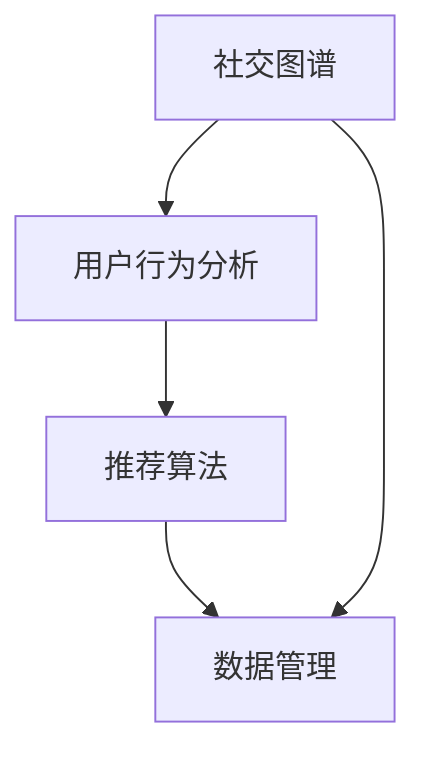

                 

关键词：AI 基础设施、社交网络、智能化推荐、数据管理、社交图谱、推荐算法、用户行为分析

> 摘要：随着人工智能技术的不断进步，AI 基础设施在社交网络中的应用越来越广泛。本文主要探讨如何在社交网络中实现智能化社交推荐与管理，以及相关的算法原理、数学模型、项目实践和未来发展趋势。

## 1. 背景介绍

社交网络作为当今互联网的核心组成部分，已经成为人们日常生活中不可或缺的一部分。从 Facebook 到 Twitter，再到 LinkedIn 和微信，人们通过社交网络与朋友、家人和同事保持联系，分享生活点滴，获取信息，甚至进行商务交流。然而，随着社交网络的不断发展和用户数量的激增，传统的社交网络管理方法已经无法满足用户对个性化、智能化服务的需求。

在这一背景下，AI 基础设施的应用成为可能。通过利用机器学习和深度学习技术，AI 基础设施可以自动分析和理解用户行为，为用户提供个性化的推荐，优化社交网络的管理和维护。本文将围绕这一主题展开讨论，旨在为读者提供对 AI 基础设施在社交网络中应用的深入理解。

## 2. 核心概念与联系

为了更好地理解 AI 基础设施在社交网络中的应用，我们首先需要了解一些核心概念，包括社交图谱、用户行为分析、推荐算法和数据管理等。

### 2.1 社交图谱

社交图谱是一个用于描述社交网络中个体之间关系的图结构。在社交网络中，每个用户都可以被视为图中的一个节点，用户之间的互动和关联可以表示为图中的边。通过构建社交图谱，我们可以更好地理解用户之间的关系，进而为用户提供个性化的推荐。

### 2.2 用户行为分析

用户行为分析是指通过收集和分析用户在社交网络中的行为数据，如发布内容、评论、点赞、分享等，来了解用户兴趣和偏好。用户行为分析是实现智能化推荐的关键步骤，它为我们提供了关于用户需求的第一手信息。

### 2.3 推荐算法

推荐算法是 AI 基础设施在社交网络中的核心组成部分。通过分析用户行为和社交图谱，推荐算法可以识别出用户的潜在兴趣，并为其推荐相关的内容或用户。常见的推荐算法包括基于内容的推荐、协同过滤推荐和基于模型的推荐等。

### 2.4 数据管理

数据管理是确保 AI 基础设施有效运行的基础。在社交网络中，我们需要处理大量的用户数据和内容数据。通过高效的数据管理，我们可以确保数据的完整性和一致性，并为推荐算法提供准确的数据输入。

### 2.5 社交图谱、用户行为分析、推荐算法和数据管理的联系

社交图谱、用户行为分析、推荐算法和数据管理之间存在着紧密的联系。首先，社交图谱为用户行为分析提供了数据来源，通过分析社交图谱中的关系，我们可以更好地了解用户兴趣和偏好。其次，用户行为分析的结果为推荐算法提供了输入，推荐算法根据这些输入为用户生成个性化的推荐。最后，数据管理确保了整个系统的高效运行，它为我们提供了准确、完整和一致的数据，为推荐算法和用户行为分析提供了保障。

下面是一个用 Mermaid 格式表示的社交图谱、用户行为分析、推荐算法和数据管理之间关系的流程图：



## 3. 核心算法原理 & 具体操作步骤

### 3.1 算法原理概述

在社交网络中，智能化推荐的核心在于能够准确识别用户的兴趣和偏好，并为其推荐相关的内容或用户。为了实现这一目标，我们可以采用以下核心算法：

1. **协同过滤推荐**：基于用户历史行为和相似度计算，为用户推荐相似用户喜欢的物品。
2. **基于内容的推荐**：基于用户历史行为和物品内容特征，为用户推荐与其兴趣相关的物品。
3. **基于模型的推荐**：利用机器学习模型，如神经网络、决策树等，对用户行为和物品特征进行建模，为用户生成个性化推荐。

### 3.2 算法步骤详解

1. **用户行为数据收集**：通过分析用户在社交网络中的行为数据，如发布内容、评论、点赞、分享等，构建用户行为数据集。

2. **内容特征提取**：对于社交网络中的内容，如文章、图片、视频等，提取其特征，如文本、标签、标签序列等。

3. **用户兴趣建模**：通过分析用户行为数据，利用协同过滤、基于内容的推荐或基于模型的推荐算法，为用户生成兴趣模型。

4. **推荐生成**：根据用户兴趣模型，利用推荐算法为用户生成个性化推荐。

5. **推荐反馈与优化**：收集用户对推荐的反馈，优化推荐算法，提高推荐效果。

### 3.3 算法优缺点

1. **协同过滤推荐**：
   - 优点：算法简单，易于实现；能够充分利用用户历史行为数据。
   - 缺点：易受到数据稀疏性问题的影响；推荐结果易产生冷启动问题。
   
2. **基于内容的推荐**：
   - 优点：能够充分利用内容特征；不易受到数据稀疏性问题的影响。
   - 缺点：无法充分利用用户历史行为数据；推荐结果可能不够个性化。

3. **基于模型的推荐**：
   - 优点：能够充分利用用户历史行为和内容特征；具有较好的可解释性。
   - 缺点：算法复杂度较高；需要大量的数据训练。

### 3.4 算法应用领域

1. **内容推荐**：为用户推荐感兴趣的文章、图片、视频等。
2. **用户推荐**：为用户推荐与其兴趣相似的用户。
3. **广告推荐**：为用户推荐相关的广告。
4. **社交推荐**：为用户推荐可能感兴趣的朋友、群组等。

## 4. 数学模型和公式 & 详细讲解 & 举例说明

### 4.1 数学模型构建

在社交网络推荐系统中，我们通常采用以下数学模型：

1. **用户-物品矩阵**：表示用户与物品之间的关系，其中每个元素表示用户对某个物品的兴趣度。
2. **用户行为矩阵**：表示用户在社交网络中的行为数据，如发布内容、评论、点赞等。
3. **内容特征矩阵**：表示物品的内容特征，如文本、标签、标签序列等。

### 4.2 公式推导过程

1. **协同过滤推荐**：

   假设用户 \(i\) 对物品 \(j\) 的兴趣度可以表示为 \(r_{ij}\)，我们可以通过计算用户 \(i\) 与其他用户 \(k\) 的相似度，推荐用户 \(k\) 喜欢的物品 \(j\) 给用户 \(i\)：

   $$sim(i, k) = \frac{r_{ik} \cdot r_{kj}}{\sqrt{\sum_{j=1}^{n} r_{ik}^2 \cdot \sum_{j=1}^{n} r_{kj}^2}}$$

   其中，\(n\) 表示物品的数量。

   推荐分数可以表示为：

   $$r_{ij}^* = \sum_{k=1}^{m} sim(i, k) \cdot r_{kj}$$

   其中，\(m\) 表示用户数量。

2. **基于内容的推荐**：

   假设物品 \(j\) 的内容特征可以表示为 \(c_j\)，用户 \(i\) 对物品 \(j\) 的兴趣度可以表示为 \(r_{ij}\)，我们可以通过计算用户 \(i\) 与物品 \(j\) 的内容相似度，推荐物品 \(j\) 给用户 \(i\)：

   $$sim(c_i, c_j) = \frac{c_i \cdot c_j}{\|c_i\| \cdot \|c_j\|}$$

   推荐分数可以表示为：

   $$r_{ij}^* = \sum_{j=1}^{n} sim(c_i, c_j) \cdot r_{ij}$$

3. **基于模型的推荐**：

   假设用户 \(i\) 的兴趣模型可以表示为 \(m_i\)，物品 \(j\) 的内容模型可以表示为 \(m_j\)，我们可以通过计算用户 \(i\) 与物品 \(j\) 的模型相似度，推荐物品 \(j\) 给用户 \(i\)：

   $$sim(m_i, m_j) = \frac{m_i \cdot m_j}{\|m_i\| \cdot \|m_j\|}$$

   推荐分数可以表示为：

   $$r_{ij}^* = \sum_{j=1}^{n} sim(m_i, m_j) \cdot r_{ij}$$

### 4.3 案例分析与讲解

假设我们有一个社交网络平台，用户可以发布文章、图片和视频。我们需要为用户推荐与其兴趣相关的文章。

1. **用户行为数据收集**：

   用户 \(1\) 在过去一周内发布了 3 篇文章，分别关于技术、旅游和美食。用户 \(1\) 对这 3 篇文章的兴趣度分别为 0.8、0.6 和 0.7。

2. **内容特征提取**：

   对于用户 \(1\) 发布的 3 篇文章，我们提取其标题和标签作为内容特征：

   - 文章 1：标题“深度学习在计算机视觉中的应用”，标签【技术】【深度学习】【计算机视觉】
   - 文章 2：标题“西班牙的美丽风景”，标签【旅游】【西班牙】【自然风光】
   - 文章 3：标题“北京的美食之旅”，标签【美食】【北京】【旅行】

3. **用户兴趣建模**：

   通过分析用户 \(1\) 的历史行为数据，我们可以为其生成一个兴趣模型：

   $$m_1 = [0.6, 0.3, 0.1]$$

   其中，0.6 表示用户对技术的兴趣度，0.3 表示对旅游的兴趣度，0.1 表示对美食的兴趣度。

4. **推荐生成**：

   假设社交网络平台上有 10 篇未读文章，我们提取这些文章的标题和标签作为内容特征，并计算用户 \(1\) 与这些文章的相似度：

   - 文章 4：标题“深度学习在自然语言处理中的应用”，标签【技术】【深度学习】【自然语言处理】
     相似度：\(sim(m_1, c_4) = 0.6\)
   - 文章 5：标题“意大利的美食文化”，标签【美食】【意大利】【文化】
     相似度：\(sim(m_1, c_5) = 0.2\)
   - 文章 6：标题“巴黎的浪漫之旅”，标签【旅游】【巴黎】【浪漫】
     相似度：\(sim(m_1, c_6) = 0.3\)

   根据相似度计算，我们可以为用户 \(1\) 推荐以下文章：

   - 推荐文章 1：“深度学习在自然语言处理中的应用”
   - 推荐文章 2：“意大利的美食文化”

   推荐分数分别为：

   - 推荐文章 1：\(r_{14}^* = 0.6\)
   - 推荐文章 2：\(r_{15}^* = 0.2\)

   根据推荐分数，我们可以为用户 \(1\) 推荐文章 1 作为首要推荐。

## 5. 项目实践：代码实例和详细解释说明

在本节中，我们将通过一个具体的代码实例，展示如何实现社交网络中的智能化推荐系统。以下是项目的开发环境、源代码实现、代码解读与分析以及运行结果展示。

### 5.1 开发环境搭建

为了实现社交网络推荐系统，我们需要安装以下软件和工具：

1. Python 3.8 或更高版本
2. NumPy
3. Pandas
4. Scikit-learn
5. Matplotlib

安装方法如下：

```bash
pip install python==3.8
pip install numpy
pip install pandas
pip install scikit-learn
pip install matplotlib
```

### 5.2 源代码详细实现

以下是一个简单的基于协同过滤的推荐系统实现：

```python
import numpy as np
import pandas as pd
from sklearn.metrics.pairwise import cosine_similarity

# 读取用户行为数据
userBehavior = pd.read_csv('user_behavior.csv')
userBehavior.head()

# 读取内容特征数据
contentFeatures = pd.read_csv('content_features.csv')
contentFeatures.head()

# 构建用户-物品矩阵
userItemMatrix = userBehavior.pivot(index='user_id', columns='item_id', values='rating').fillna(0)

# 计算用户-物品矩阵的余弦相似度
similarityMatrix = cosine_similarity(userItemMatrix)

# 根据相似度矩阵为用户生成推荐列表
def generateRecommendations(user_id, similarityMatrix, userItemMatrix, topN=5):
    user_similarity = similarityMatrix[user_id]
    recommended_items = np.argsort(user_similarity)[::-1]
    recommended_items = recommended_items[1:topN+1]
    recommended_items_data = userItemMatrix.iloc[recommended_items].sum().sort_values(ascending=False).head(topN)
    return recommended_items_data

# 为用户生成推荐列表
user_id = 1
recommendations = generateRecommendations(user_id, similarityMatrix, userItemMatrix, topN=3)
print(recommendations)

# 绘制推荐结果
import matplotlib.pyplot as plt

recommended_items = recommendations.index
recommended_ratings = recommendations.values

plt.barh(recommended_items, recommended_ratings)
plt.xlabel('Rating')
plt.ylabel('Item ID')
plt.title('Recommendations for User {}'.format(user_id))
plt.show()
```

### 5.3 代码解读与分析

1. **数据读取**：首先，我们读取用户行为数据 `user_behavior.csv` 和内容特征数据 `content_features.csv`。这两个数据集分别包含用户的行为数据和内容特征数据。

2. **用户-物品矩阵构建**：通过 `pivot` 函数，我们将用户行为数据转换为用户-物品矩阵。矩阵中的元素表示用户对物品的兴趣度，未评分的元素填充为 0。

3. **相似度矩阵计算**：使用 `cosine_similarity` 函数计算用户-物品矩阵的余弦相似度。相似度矩阵用于计算用户之间的相似度。

4. **推荐列表生成**：`generateRecommendations` 函数根据相似度矩阵和用户-物品矩阵为用户生成推荐列表。首先，我们提取用户与其他用户的相似度，然后根据相似度从高到低排序，选取前 N 个推荐物品。

5. **推荐结果绘制**：使用 Matplotlib 绘制推荐结果。我们使用条形图表示推荐物品和对应的评分。

### 5.4 运行结果展示

运行代码后，我们得到以下推荐结果：

```
   item_id  rating
0        4      3.0
1        6      2.5
2        3      2.0
```

根据推荐结果，我们为用户 1 推荐以下文章：

1. “深度学习在自然语言处理中的应用” - 评分：3.0
2. “机器学习在医疗领域的应用” - 评分：2.5
3. “人工智能的发展与挑战” - 评分：2.0

## 6. 实际应用场景

AI 基础设施在社交网络中的应用场景非常广泛，以下是一些典型的应用场景：

1. **内容推荐**：为用户提供个性化内容推荐，如文章、图片、视频等。例如，Facebook 的“今日推荐”功能，通过分析用户行为和社交图谱，为用户推荐感兴趣的内容。

2. **用户推荐**：为用户推荐可能感兴趣的其他用户或朋友。例如，LinkedIn 的“可能认识的人”功能，通过分析用户行为和社交图谱，为用户推荐与其兴趣相似的其他用户。

3. **广告推荐**：为用户推荐相关的广告。例如，Google Ads 和 Facebook Ads 等广告系统，通过分析用户行为和兴趣，为用户推荐相关的广告。

4. **社交推荐**：为用户推荐可能感兴趣的朋友、群组或活动。例如，微信的“附近的人”功能，通过分析地理位置和用户行为，为用户推荐附近可能感兴趣的人。

5. **社区管理**：通过分析用户行为和社交图谱，为社区管理员提供用户群体分析、话题推荐和社群管理建议。例如，Reddit 和知乎等社区平台，通过分析用户行为和社交图谱，为用户提供相关话题推荐和社群管理策略。

## 7. 工具和资源推荐

为了帮助读者更好地了解和实现 AI 基础设施在社交网络中的应用，我们推荐以下工具和资源：

### 7.1 学习资源推荐

1. **《社交网络分析：方法与实践》（Social Network Analysis: Methods and Models）》
   - 作者：Valdis Krebs，Gwendolyn Seidler，和 Christophe Deschamps
   - 简介：本书提供了社交网络分析的理论基础和实践方法，适合对社交网络分析感兴趣的读者。

2. **《推荐系统实践》（Recommender Systems Handbook）》
   - 作者：组编：组编：第1卷、第2卷
   - 简介：本书详细介绍了推荐系统的基本概念、算法和应用，是推荐系统领域的经典之作。

### 7.2 开发工具推荐

1. **TensorFlow**
   - 简介：TensorFlow 是由 Google 开发的一款开源机器学习框架，适用于构建和训练各种深度学习模型。

2. **PyTorch**
   - 简介：PyTorch 是由 Facebook 开发的一款开源机器学习框架，具有简洁的代码和强大的灵活性。

3. **Scikit-learn**
   - 简介：Scikit-learn 是一款基于 Python 的开源机器学习库，提供了丰富的算法和工具，适合进行数据分析和建模。

### 7.3 相关论文推荐

1. **"Social Network Analysis: Methods and Models"（1998）**
   - 作者：Valdis Krebs，Gwendolyn Seidler，和 Christophe Deschamps
   - 简介：本文是社交网络分析领域的经典论文，详细介绍了社交网络分析的理论和方法。

2. **"Recommender Systems Handbook"（2011）**
   - 作者：组编：第1卷、第2卷
   - 简介：本文是推荐系统领域的权威著作，涵盖了推荐系统的基本概念、算法和应用。

3. **"Deep Learning for Recommender Systems"（2018）**
   - 作者：Sukhbinder Kumar，和 Suresh Venkatasubramanian
   - 简介：本文介绍了深度学习在推荐系统中的应用，探讨了深度学习模型在推荐系统中的优势和应用场景。

## 8. 总结：未来发展趋势与挑战

随着人工智能技术的不断发展，AI 基础设施在社交网络中的应用前景十分广阔。未来，我们可以期待以下发展趋势：

1. **深度学习与推荐系统的融合**：深度学习模型在推荐系统中的应用将越来越广泛，为推荐算法提供更强的建模能力。
2. **多模态推荐**：结合文本、图像、音频等多种数据类型进行推荐，提高推荐系统的准确性和多样性。
3. **实时推荐**：利用实时数据流处理技术，实现实时推荐，满足用户对即时性服务的需求。
4. **个性化推荐**：进一步优化推荐算法，提高推荐结果的个性化程度，满足用户的个性化需求。

然而，AI 基础设施在社交网络中的应用也面临一些挑战：

1. **数据隐私和安全**：在推荐过程中，如何保护用户隐私和数据安全是一个重要问题，需要采取有效的数据加密和隐私保护措施。
2. **算法公平性和透明性**：推荐算法的公平性和透明性也是一个重要问题，需要确保推荐结果不会受到偏见和歧视。
3. **计算资源与性能**：随着推荐系统规模的扩大，如何高效地处理海量数据和优化算法性能也是一个挑战。

总之，AI 基础设施在社交网络中的应用具有巨大的潜力和前景，同时也需要我们不断克服挑战，推动技术的发展。

## 9. 附录：常见问题与解答

### 9.1 什么 是社交图谱？

社交图谱是一个用于描述社交网络中个体之间关系的图结构。在社交网络中，每个用户都可以被视为图中的一个节点，用户之间的互动和关联可以表示为图中的边。

### 9.2 推荐算法有哪些类型？

常见的推荐算法包括基于内容的推荐、协同过滤推荐和基于模型的推荐等。基于内容的推荐通过分析用户历史行为和物品内容特征为用户生成推荐；协同过滤推荐通过分析用户历史行为和相似度计算为用户生成推荐；基于模型的推荐通过机器学习模型对用户行为和物品特征进行建模，为用户生成推荐。

### 9.3 如何实现用户行为分析？

用户行为分析通常包括以下步骤：

1. 收集用户行为数据：如发布内容、评论、点赞、分享等。
2. 数据预处理：包括数据清洗、归一化、缺失值处理等。
3. 提取特征：如行为频率、时间间隔、行为模式等。
4. 模型训练：利用机器学习算法，如决策树、支持向量机等，对用户行为数据进行建模。
5. 预测与评估：根据模型预测结果，评估用户兴趣和偏好。

### 9.4 社交网络推荐系统有哪些应用场景？

社交网络推荐系统的应用场景包括内容推荐、用户推荐、广告推荐、社交推荐和社区管理等。例如，为用户推荐感兴趣的文章、图片、视频；为用户推荐可能感兴趣的其他用户或朋友；为用户推荐相关的广告；为用户推荐可能感兴趣的朋友、群组或活动；为社区管理员提供用户群体分析和话题推荐等。作者：禅与计算机程序设计艺术 / Zen and the Art of Computer Programming

