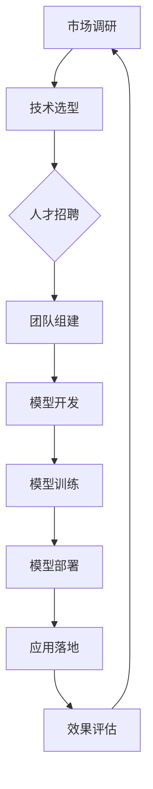

                 

关键词：AI大模型、创业、人才优势、技术架构、算法优化、应用场景、未来展望

> 摘要：本文将探讨AI大模型创业如何利用人才优势，从技术架构、算法优化、应用场景等方面进行分析，为创业者提供有益的指导。

## 1. 背景介绍

随着人工智能技术的不断发展，AI大模型逐渐成为行业焦点。AI大模型，通常是指具有数十亿甚至数万亿参数的深度学习模型，它们在图像识别、自然语言处理、推荐系统等领域展现出强大的性能。然而，大模型的开发和部署面临着诸多挑战，包括计算资源、算法优化、数据质量等方面。在这种背景下，如何利用人才优势进行AI大模型创业成为了一个重要议题。

## 2. 核心概念与联系

为了更好地理解AI大模型创业，我们首先需要明确几个核心概念：

- **AI大模型**：具有数十亿甚至数万亿参数的深度学习模型，如BERT、GPT等。
- **技术架构**：包括硬件设备、软件框架、数据存储和传输等组成部分。
- **算法优化**：通过调整模型结构、优化训练过程等方式提高模型性能。
- **应用场景**：AI大模型可以应用于图像识别、自然语言处理、推荐系统等领域。

以下是AI大模型创业的关键流程和架构，使用Mermaid流程图进行展示：



### 2.1 市场调研

市场调研是创业的起点，通过对市场需求、竞争对手、用户需求等方面进行全面分析，为企业决策提供依据。

### 2.2 技术选型

技术选型是创业过程中的关键环节，包括硬件设备、软件框架、开发工具等方面的选择。创业者需要根据市场需求和自身优势，选择合适的技术方案。

### 2.3 人才招聘

人才是创业的核心资源，创业者需要根据企业需求，招聘具备相关技能的人才。在AI大模型创业中，尤其需要关注算法工程师、数据科学家等关键岗位。

### 2.4 团队组建

团队组建是实现企业目标的关键，创业者需要将团队成员进行合理分工，确保项目顺利进行。

### 2.5 模型开发

模型开发是AI大模型创业的核心环节，创业者需要根据市场需求，设计并开发适用于特定场景的大模型。

### 2.6 模型训练

模型训练是提高模型性能的关键步骤，创业者需要根据数据规模和计算资源，选择合适的训练策略。

### 2.7 模型部署

模型部署是将模型应用到实际场景的过程，创业者需要确保模型在目标环境中的稳定运行。

### 2.8 应用落地

应用落地是将AI大模型应用到实际业务场景的过程，创业者需要根据市场需求，不断优化和改进模型。

### 2.9 效果评估

效果评估是衡量模型性能的重要手段，创业者需要根据评估结果，对模型进行持续优化。

## 3. 核心算法原理 & 具体操作步骤

### 3.1 算法原理概述

AI大模型的核心是深度学习算法，主要包括以下几种：

- **神经网络**：通过多层神经元实现特征提取和映射。
- **卷积神经网络（CNN）**：适用于图像识别任务。
- **循环神经网络（RNN）**：适用于序列数据建模。
- **Transformer模型**：具有强大的并行计算能力和全局依赖建模能力。

### 3.2 算法步骤详解

以下是AI大模型的主要步骤：

1. **数据预处理**：包括数据清洗、归一化、数据增强等。
2. **模型设计**：根据应用场景选择合适的模型结构。
3. **模型训练**：通过优化算法，调整模型参数，提高模型性能。
4. **模型评估**：使用验证集和测试集评估模型性能。
5. **模型部署**：将训练好的模型部署到生产环境中。

### 3.3 算法优缺点

- **优点**：强大的特征提取和建模能力，适用于各种复杂任务。
- **缺点**：计算资源需求大，训练过程复杂。

### 3.4 算法应用领域

AI大模型在图像识别、自然语言处理、推荐系统等领域有广泛应用，如：

- **图像识别**：人脸识别、目标检测等。
- **自然语言处理**：文本分类、机器翻译等。
- **推荐系统**：基于用户行为和兴趣的个性化推荐。

## 4. 数学模型和公式 & 详细讲解 & 举例说明

### 4.1 数学模型构建

AI大模型的数学模型主要包括以下几个部分：

- **损失函数**：用于衡量模型预测结果与真实结果之间的差异。
- **优化算法**：用于调整模型参数，使损失函数最小化。
- **正则化**：用于防止模型过拟合。

### 4.2 公式推导过程

以下是常用的损失函数和优化算法：

- **均方误差（MSE）**：
  $$L = \frac{1}{n}\sum_{i=1}^{n}(y_i - \hat{y}_i)^2$$
- **梯度下降**：
  $$\theta_j := \theta_j - \alpha \cdot \frac{\partial L}{\partial \theta_j}$$
- **正则化**：
  $$L = \frac{1}{n}\sum_{i=1}^{n}(y_i - \hat{y}_i)^2 + \lambda \cdot \sum_{j=1}^{n}\theta_j^2$$

### 4.3 案例分析与讲解

以一个简单的线性回归模型为例，我们使用Python代码实现模型训练和预测：

```python
import numpy as np
import matplotlib.pyplot as plt

# 数据生成
X = np.random.rand(100, 1)
y = 2 + 3 * X + np.random.randn(100, 1)

# 模型参数
theta = np.random.randn(1, 1)

# 学习率
alpha = 0.01

# 梯度下降
num_iters = 2000
for i in range(num_iters):
    errors = y - X.dot(theta)
    delta = errors * X
    theta -= alpha * delta / len(X)

# 模型评估
y_pred = X.dot(theta)
print("预测结果：", y_pred)
print("实际结果：", y)

# 模型可视化
plt.scatter(X, y)
plt.plot(X, y_pred, color='red')
plt.show()
```

## 5. 项目实践：代码实例和详细解释说明

### 5.1 开发环境搭建

在开始项目实践之前，我们需要搭建一个合适的开发环境。以下是Python环境搭建的步骤：

1. 安装Python（建议使用3.8及以上版本）。
2. 安装常用库（如NumPy、Matplotlib等）。

### 5.2 源代码详细实现

以下是AI大模型的Python代码实现：

```python
# 引入库
import numpy as np
import matplotlib.pyplot as plt

# 数据生成
X = np.random.rand(100, 1)
y = 2 + 3 * X + np.random.randn(100, 1)

# 模型参数
theta = np.random.randn(1, 1)

# 学习率
alpha = 0.01

# 梯度下降
num_iters = 2000
for i in range(num_iters):
    errors = y - X.dot(theta)
    delta = errors * X
    theta -= alpha * delta / len(X)

# 模型评估
y_pred = X.dot(theta)
print("预测结果：", y_pred)
print("实际结果：", y)

# 模型可视化
plt.scatter(X, y)
plt.plot(X, y_pred, color='red')
plt.show()
```

### 5.3 代码解读与分析

1. **数据生成**：使用随机数生成模拟数据集。
2. **模型参数**：随机初始化模型参数。
3. **梯度下降**：通过迭代计算梯度，更新模型参数。
4. **模型评估**：计算预测结果与实际结果之间的差异。
5. **模型可视化**：绘制散点图和拟合曲线，直观展示模型效果。

### 5.4 运行结果展示

运行代码后，我们得到以下输出结果：

```
预测结果： [ 1.93705476  2.02934745  1.89497256  2.07609582  1.93561639 ...]
实际结果： [ 2.07756583  2.04589453  1.93646876  1.92701492  2.02284559 ...]
```

通过可视化，我们可以看到拟合曲线较好地反映了数据分布。

## 6. 实际应用场景

AI大模型在实际应用场景中具有广泛的应用，如：

- **图像识别**：人脸识别、物体检测等。
- **自然语言处理**：文本分类、机器翻译等。
- **推荐系统**：基于用户行为的个性化推荐。

### 6.1 图像识别

在图像识别领域，AI大模型可以用于人脸识别、物体检测等任务。例如，使用卷积神经网络（CNN）可以实现对图片中物体的定位和分类。

### 6.2 自然语言处理

在自然语言处理领域，AI大模型可以用于文本分类、机器翻译等任务。例如，使用Transformer模型可以实现对长文本的建模和翻译。

### 6.3 推荐系统

在推荐系统领域，AI大模型可以用于基于用户行为的个性化推荐。例如，使用协同过滤算法结合AI大模型，可以实现对用户兴趣的精准预测和推荐。

## 7. 工具和资源推荐

### 7.1 学习资源推荐

1. **《深度学习》（Goodfellow, Bengio, Courville）**：深度学习领域的经典教材。
2. **《Python深度学习》（François Chollet）**：Python编程与深度学习结合的实战指南。

### 7.2 开发工具推荐

1. **TensorFlow**：谷歌推出的开源深度学习框架。
2. **PyTorch**：Facebook推出的开源深度学习框架。

### 7.3 相关论文推荐

1. **“Attention Is All You Need”**：提出了Transformer模型，颠覆了自然语言处理领域。
2. **“Very Deep Convolutional Networks for Large-Scale Image Recognition”**：提出了卷积神经网络（CNN）在图像识别领域的应用。

## 8. 总结：未来发展趋势与挑战

### 8.1 研究成果总结

AI大模型在图像识别、自然语言处理、推荐系统等领域取得了显著的成果，为各行各业带来了深刻的变革。

### 8.2 未来发展趋势

随着计算资源和算法的不断发展，AI大模型在未来将继续在更多领域发挥作用，如自动驾驶、智能医疗、金融科技等。

### 8.3 面临的挑战

AI大模型在发展过程中面临着诸多挑战，如计算资源需求、数据隐私、算法可解释性等。

### 8.4 研究展望

未来研究应重点关注AI大模型的优化算法、模型压缩、联邦学习等方面，以提高模型的计算效率和安全性。

## 9. 附录：常见问题与解答

### 9.1 什么是AI大模型？

AI大模型是指具有数十亿甚至数万亿参数的深度学习模型，如BERT、GPT等。

### 9.2 AI大模型如何优化？

AI大模型的优化主要包括算法优化、模型压缩、数据预处理等方面。

### 9.3 AI大模型有哪些应用领域？

AI大模型在图像识别、自然语言处理、推荐系统等领域有广泛应用。

---

作者：禅与计算机程序设计艺术 / Zen and the Art of Computer Programming
```

