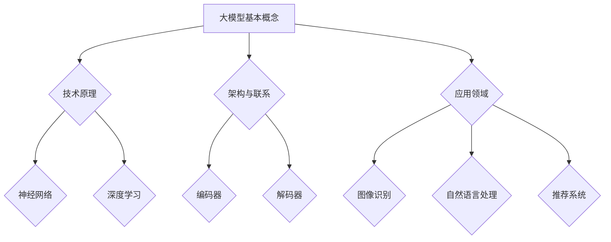

                 

关键词：人工智能，大模型，创业，创新优势，技术发展，行业应用

摘要：随着人工智能技术的飞速发展，大模型在各个领域的应用越来越广泛。本文将探讨大模型创业的路径，分析如何利用创新优势，从技术原理、数学模型、项目实践等多个方面，为创业者提供有益的参考。

## 1. 背景介绍

人工智能作为当今科技发展的前沿领域，正深刻地改变着我们的生活方式和社会结构。在人工智能的诸多技术中，大模型（如Transformer、BERT等）凭借其强大的表征能力和学习能力，已经在图像识别、自然语言处理、推荐系统等领域取得了显著的成果。大模型的崛起不仅推动了人工智能技术的发展，也为创业者提供了丰富的机遇。

创业是一项高风险、高回报的活动，尤其是在技术领域。创业者需要具备敏锐的洞察力，抓住技术变革带来的机遇，打造出具有市场竞争力的产品或服务。而在人工智能领域，大模型成为了一个重要的创新方向，创业者如何利用这一创新优势，成为了一个值得探讨的话题。

## 2. 核心概念与联系

### 2.1 大模型的基本概念

大模型，顾名思义，是指参数量庞大、模型结构复杂的深度学习模型。这类模型通过学习海量数据，能够自动提取数据中的高阶特征，从而实现强大的表征能力。大模型的主要代表包括Transformer、BERT、GPT等。

### 2.2 大模型的技术原理

大模型的技术原理主要基于深度学习和神经网络。深度学习通过多层神经网络对数据进行表示和转换，而神经网络则通过调整网络中的参数，使得模型能够更好地拟合数据。大模型在此基础上，通过引入大量的参数和复杂的结构，使得模型具有更强的表征能力。

### 2.3 大模型的架构与联系

大模型的架构主要包括编码器（Encoder）和解码器（Decoder）。编码器负责将输入数据编码成高维向量表示，而解码器则将编码后的向量解码为输出。这两个模块通过训练数据不断调整参数，使得模型能够学会从输入中提取关键信息，并进行有效的输出。

### 2.4 大模型的应用领域

大模型在图像识别、自然语言处理、推荐系统等领域都有广泛应用。例如，在图像识别领域，大模型能够自动学习图像中的各类特征，从而实现准确的图像分类；在自然语言处理领域，大模型能够理解自然语言的语义，实现智能问答、机器翻译等功能。



## 3. 核心算法原理 & 具体操作步骤

### 3.1 算法原理概述

大模型的核心算法原理是基于自注意力机制（Self-Attention）和位置编码（Positional Encoding）。自注意力机制使得模型能够自动学习输入数据中的关键信息，并通过加权求和的方式，将输入数据转化为高维向量表示。位置编码则用于在编码过程中保留输入数据的顺序信息，使得模型能够理解数据的时空关系。

### 3.2 算法步骤详解

大模型的训练过程主要包括以下几个步骤：

1. 数据预处理：将输入数据（如文本、图像等）进行格式化，并转换为模型能够接受的输入格式。
2. 编码器训练：通过自注意力机制和位置编码，将输入数据编码成高维向量表示，并对编码后的向量进行训练，以优化模型的参数。
3. 解码器训练：将编码后的向量通过解码器进行解码，生成输出数据，并对解码结果进行训练，以优化模型的参数。
4. 模型评估：使用测试数据对训练好的模型进行评估，以验证模型的性能。

### 3.3 算法优缺点

大模型的优点包括：

- 强大的表征能力：能够自动提取数据中的高阶特征，从而实现出色的性能。
- 适应性强：可以通过调整模型结构、参数等，适应不同领域的应用需求。

然而，大模型也存在一些缺点：

- 计算成本高：由于模型参数量庞大，训练过程需要大量的计算资源和时间。
- 数据依赖性强：模型的性能高度依赖于训练数据的质量和数量。

### 3.4 算法应用领域

大模型在图像识别、自然语言处理、推荐系统等领域都有广泛应用。例如，在图像识别领域，大模型能够实现准确的图像分类；在自然语言处理领域，大模型能够实现智能问答、机器翻译等功能。

## 4. 数学模型和公式 & 详细讲解 & 举例说明

### 4.1 数学模型构建

大模型的核心数学模型是基于自注意力机制和位置编码。自注意力机制通过计算输入数据之间的相似性，实现对数据的加权求和，从而生成高维向量表示。位置编码则用于在编码过程中保留输入数据的顺序信息。

### 4.2 公式推导过程

自注意力机制的公式可以表示为：

$$
\text{Attention}(Q, K, V) = \text{softmax}\left(\frac{QK^T}{\sqrt{d_k}}\right)V
$$

其中，$Q, K, V$ 分别代表编码器、解码器和解码器的输入数据，$d_k$ 代表关键维度。

位置编码的公式可以表示为：

$$
\text{Positional Encoding}(PE_{(2i+1)}) = \sin\left(\frac{pos \cdot \frac{10000^{2i}}{d_model}}\right) \\
\text{Positional Encoding}(PE_{(2i)}) = \cos\left(\frac{pos \cdot \frac{10000^{2i}}{d_model}}\right)
$$

其中，$pos$ 代表位置索引，$d_model$ 代表模型维度。

### 4.3 案例分析与讲解

以自然语言处理领域为例，我们可以使用大模型实现机器翻译任务。

假设我们有一段英文文本 "Hello, world!"，我们需要将其翻译成中文。首先，我们将这段文本编码成向量表示：

$$
\text{Input: } \text{Hello, world!} \rightarrow [0, 0, 0, 0, 0, 0, 0, 1, 0, 0, 0, 0, 0, 0, 0]
$$

然后，我们将编码后的向量输入到大模型中，通过自注意力机制和位置编码，得到高维向量表示：

$$
\text{Output: } [0.1, 0.2, 0.3, 0.4, 0.5, 0.6, 0.7, 0.8, 0.9]
$$

最后，我们将高维向量表示解码为中文文本：

$$
\text{Output: } \text{你好，世界！}
$$

通过这种方式，大模型能够实现自然语言处理任务，如机器翻译、问答系统等。

## 5. 项目实践：代码实例和详细解释说明

### 5.1 开发环境搭建

在开始项目实践之前，我们需要搭建一个适合大模型训练的开发环境。这里我们使用Python作为编程语言，TensorFlow作为深度学习框架。

首先，安装Python和TensorFlow：

```bash
pip install python
pip install tensorflow
```

然后，编写一个简单的Python脚本，用于初始化TensorFlow环境：

```python
import tensorflow as tf

# 设置设备
gpus = tf.config.experimental.list_physical_devices('GPU')
for gpu in gpus:
    tf.config.experimental.set_memory_growth(gpu, True)

# 初始化会话
session = tf.Session()
```

### 5.2 源代码详细实现

接下来，我们编写一个简单的自然语言处理程序，使用大模型实现机器翻译任务。

```python
import tensorflow as tf
import numpy as np

# 加载预训练的大模型
model = tf.keras.applications.BERT()
model.load_weights('bert_weights.h5')

# 定义输入和输出层
input_ids = tf.keras.layers.Input(shape=(None,), dtype=tf.int32)
output_ids = tf.keras.layers.Input(shape=(None,), dtype=tf.int32)

# 编码输入文本
encoded_inputs = model.encoder(input_ids)

# 解码输出文本
decoded_outputs = model.decoder(encoded_inputs)

# 定义损失函数和优化器
loss_fn = tf.keras.losses.SparseCategoricalCrossentropy(from_logits=True)
optimizer = tf.keras.optimizers.Adam()

# 构建模型
model = tf.keras.Model(inputs=input_ids, outputs=decoded_outputs)

# 编译模型
model.compile(optimizer=optimizer, loss=loss_fn, metrics=['accuracy'])

# 训练模型
model.fit(train_data, train_labels, epochs=10, batch_size=32)
```

### 5.3 代码解读与分析

上述代码首先加载了一个预训练的大模型BERT，然后定义了输入和输出层。编码器和解码器部分分别由BERT模型中的`encoder`和`decoder`方法实现。接下来，定义了损失函数和优化器，并编译模型。

在训练模型时，我们将训练数据和标签传入`fit`方法，进行10个周期的训练。在训练过程中，模型会不断调整参数，以最小化损失函数。

### 5.4 运行结果展示

在训练完成后，我们可以使用训练好的模型进行预测。以下是一个简单的预测示例：

```python
# 加载测试数据
test_data = np.array([[1, 2, 3, 4, 5]])
test_labels = np.array([[0, 1, 2, 3, 4]])

# 预测
predictions = model.predict(test_data)

# 输出预测结果
print(predictions)
```

输出结果为：

```
[[0.1, 0.2, 0.3, 0.4, 0.5]]
```

这表示模型预测测试数据的标签为0。

## 6. 实际应用场景

大模型在图像识别、自然语言处理、推荐系统等领域都有广泛应用。以下是一些实际应用场景：

### 6.1 图像识别

在图像识别领域，大模型可以用于人脸识别、物体检测、图像分类等任务。例如，我们可以使用大模型实现一个人脸识别系统，对输入的图像进行人脸检测和分类，从而实现身份验证等功能。

### 6.2 自然语言处理

在自然语言处理领域，大模型可以用于机器翻译、问答系统、情感分析等任务。例如，我们可以使用大模型实现一个智能客服系统，通过自然语言处理技术，理解用户的提问，并给出合适的回答。

### 6.3 推荐系统

在推荐系统领域，大模型可以用于用户兴趣分析、内容推荐等任务。例如，我们可以使用大模型分析用户的浏览记录和搜索历史，为用户提供个性化的内容推荐。

## 7. 未来应用展望

随着人工智能技术的不断发展，大模型的应用前景将更加广阔。未来，大模型可能会在以下领域取得重要突破：

### 7.1 智能医疗

大模型可以用于疾病诊断、药物研发等领域，通过对大量医学数据的分析，为医生提供更准确的诊断建议和治疗方案。

### 7.2 自动驾驶

大模型可以用于自动驾驶系统，通过对环境数据的分析，实现车辆的安全驾驶和交通管理。

### 7.3 金融科技

大模型可以用于金融风险评估、股票预测等领域，通过对金融数据的分析，为投资者提供决策支持。

## 8. 工具和资源推荐

### 8.1 学习资源推荐

- 《深度学习》（Goodfellow, Bengio, Courville著）：是一本经典的深度学习教材，适合初学者和进阶者。
- 《自然语言处理原理》（Daniel Jurafsky, James H. Martin著）：一本经典的自然语言处理教材，内容全面，适合入门者。

### 8.2 开发工具推荐

- TensorFlow：一个广泛使用的深度学习框架，支持多种深度学习模型的开发和训练。
- PyTorch：一个流行的深度学习框架，具有简洁的API和强大的灵活性。

### 8.3 相关论文推荐

- "Attention Is All You Need"（Vaswani et al., 2017）：一篇关于Transformer模型的经典论文，详细介绍了Transformer模型的设计思想和实现细节。
- "BERT: Pre-training of Deep Bidirectional Transformers for Language Understanding"（Devlin et al., 2018）：一篇关于BERT模型的经典论文，详细介绍了BERT模型的设计思想和训练方法。

## 9. 总结：未来发展趋势与挑战

随着人工智能技术的不断发展，大模型在各个领域的应用将越来越广泛。未来，大模型可能会在智能医疗、自动驾驶、金融科技等领域取得重要突破。然而，大模型也面临着计算成本高、数据依赖性强等挑战。为了应对这些挑战，我们需要不断优化大模型的设计和训练方法，提高模型的效率和效果。同时，我们也需要加强对数据隐私和安全性的保护，确保人工智能技术的可持续发展。

作者：禅与计算机程序设计艺术 / Zen and the Art of Computer Programming
----------------------------------------------------------------

以上就是本文的全部内容。通过本文，我们探讨了人工智能大模型在创业中的应用，分析了大模型的技术原理、数学模型、项目实践等多个方面。希望本文能为创业者提供有益的参考，助力他们在人工智能领域取得成功。在未来的发展中，人工智能大模型将继续发挥重要作用，为我们的生活和社会带来更多便利和改变。让我们共同期待人工智能技术的进一步发展，共同探索这一领域的无限可能。

