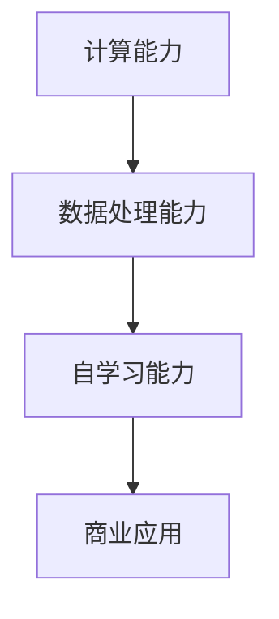

                 

 在当前科技飞速发展的时代，人工智能（AI）已经成为了推动社会进步的重要力量。特别是在大模型领域，AI 技术的突破给各行各业带来了前所未有的变革。本文将探讨 AI 大模型创业中的创新优势，以及如何利用这些优势来实现商业成功。

## 关键词

- 人工智能
- 大模型
- 创新优势
- 商业成功
- 技术创业

## 摘要

本文首先介绍了 AI 大模型的发展背景和现状，接着讨论了 AI 大模型在创业中的创新优势，包括计算能力、数据处理能力、自学习能力等。然后，通过具体案例分析了如何利用这些优势进行创业，并提出了未来发展的趋势与挑战。最后，给出了相关的学习资源和开发工具推荐。

## 1. 背景介绍

随着互联网的普及和数据规模的爆炸性增长，人工智能技术开始从实验室走向实际应用。特别是深度学习技术的发展，使得大模型的应用成为可能。大模型，即具有巨大参数量的神经网络模型，可以在海量数据上进行训练，从而实现更高的准确性和泛化能力。

目前，AI 大模型已经在图像识别、自然语言处理、语音识别、推荐系统等领域取得了显著的成果。例如，谷歌的 BERT 模型在自然语言处理任务中达到了前所未有的效果，亚马逊的 Alexa 和谷歌的 Assistant 已经成为人们日常生活中不可或缺的智能助手。

## 2. 核心概念与联系

### 2.1 计算能力

AI 大模型之所以能够取得成功，一个关键因素是其强大的计算能力。随着硬件技术的发展，如 GPU、TPU 等专用计算设备的普及，大模型的训练速度得到了极大的提升。这使得 AI 大模型能够处理更复杂的问题，并在更短时间内得到更好的结果。

### 2.2 数据处理能力

大模型需要大量的数据进行训练，这就要求有强大的数据处理能力。这不仅包括数据的采集、存储、传输，还包括数据的预处理、清洗、标注等。随着分布式计算和大数据处理技术的进步，AI 大模型在数据处理方面的优势更加明显。

### 2.3 自学习能力

自学习能力是 AI 大模型的重要特点。通过不断的学习和优化，大模型可以不断改进其性能，从而更好地适应不同的应用场景。这种自学习能力使得大模型可以在不断变化的环境中持续提供高质量的服务。

### 2.4 Mermaid 流程图

以下是一个简化的 Mermaid 流程图，展示了 AI 大模型的核心概念和联系：



## 3. 核心算法原理 & 具体操作步骤

### 3.1 算法原理概述

AI 大模型的核心算法是深度学习。深度学习是一种基于多层神经网络的机器学习技术，通过将输入数据进行层层处理，逐步提取特征，最终实现预测或分类任务。

### 3.2 算法步骤详解

1. **数据收集**：收集大量相关的数据，包括图像、文本、语音等。
2. **数据预处理**：对收集到的数据进行清洗、标准化等处理，使其适合输入到模型中。
3. **模型构建**：设计并构建神经网络结构，确定网络的层数、每层的神经元数量等。
4. **模型训练**：使用预处理后的数据对模型进行训练，通过反向传播算法不断调整模型参数，使其能够更好地拟合训练数据。
5. **模型评估**：使用验证集对训练好的模型进行评估，检查模型的泛化能力。
6. **模型应用**：将训练好的模型应用到实际问题中，如图像识别、自然语言处理等。

### 3.3 算法优缺点

**优点**：

- **强大的泛化能力**：大模型可以通过大量数据进行训练，从而在多个领域实现较高的准确率。
- **自适应性强**：大模型具有自学习能力，可以不断优化自身性能。
- **处理复杂数据**：大模型可以处理包括图像、文本、语音等复杂数据。

**缺点**：

- **计算资源需求大**：大模型的训练需要大量的计算资源和时间。
- **对数据质量要求高**：大模型对数据的预处理要求较高，数据质量问题会影响模型的性能。

### 3.4 算法应用领域

AI 大模型在多个领域都有广泛的应用，包括：

- **图像识别**：如人脸识别、自动驾驶等。
- **自然语言处理**：如机器翻译、情感分析等。
- **语音识别**：如智能助手、语音搜索等。
- **推荐系统**：如商品推荐、新闻推荐等。

## 4. 数学模型和公式 & 详细讲解 & 举例说明

### 4.1 数学模型构建

在深度学习中，常用的数学模型是多层感知机（MLP）和卷积神经网络（CNN）。

#### 4.1.1 多层感知机（MLP）

多层感知机是一种前向神经网络，由输入层、隐藏层和输出层组成。其基本数学模型如下：

$$
z_i = \sum_{j=1}^{n} w_{ij}x_j + b_i
$$

$$
a_i = \sigma(z_i)
$$

其中，$x_j$ 为输入特征，$w_{ij}$ 和 $b_i$ 分别为权重和偏置，$\sigma$ 为激活函数。

#### 4.1.2 卷积神经网络（CNN）

卷积神经网络是一种专门用于处理图像数据的神经网络，其基本数学模型如下：

$$
h_i^{(l)} = \sum_{j=1}^{n} w_{ij}^{(l)}h_j^{(l-1)} + b_i^{(l)}
$$

$$
a_i^{(l)} = \sigma(h_i^{(l)})
$$

其中，$h_j^{(l-1)}$ 为前一层的特征图，$w_{ij}^{(l)}$ 和 $b_i^{(l)}$ 分别为权重和偏置，$\sigma$ 为激活函数。

### 4.2 公式推导过程

以多层感知机为例，对其公式进行推导。

#### 4.2.1 输入层到隐藏层

输入层到隐藏层的推导过程如下：

$$
z_i^{(l)} = \sum_{j=1}^{n} w_{ij}^{(l)}x_j + b_i^{(l)}
$$

$$
a_i^{(l)} = \sigma(z_i^{(l)})
$$

其中，$x_j$ 为输入特征，$w_{ij}^{(l)}$ 和 $b_i^{(l)}$ 分别为权重和偏置，$\sigma$ 为激活函数。

#### 4.2.2 隐藏层到输出层

隐藏层到输出层的推导过程如下：

$$
z_i^{(L)} = \sum_{j=1}^{n} w_{ij}^{(L)}a_j^{(L-1)} + b_i^{(L)}
$$

$$
\hat{y}_i = \sum_{j=1}^{n} w_{ij}^{(L)}a_j^{(L-1)} + b_i^{(L)}
$$

其中，$a_j^{(L-1)}$ 为前一层隐藏层的输出，$w_{ij}^{(L)}$ 和 $b_i^{(L)}$ 分别为权重和偏置。

### 4.3 案例分析与讲解

以下是一个简单的案例，展示如何使用多层感知机进行二分类问题。

#### 案例背景

假设我们有一个二分类问题，需要判断一个数据点是否属于正类。数据集包含100个样本，每个样本有5个特征。

#### 模型构建

我们构建一个包含一个输入层、一个隐藏层和一个输出层的多层感知机模型。输入层的神经元数量为5，隐藏层的神经元数量为10，输出层的神经元数量为1。

#### 数据预处理

对数据集进行标准化处理，将每个特征的值缩放到0到1之间。

#### 模型训练

使用梯度下降算法对模型进行训练。设定学习率为0.01，训练次数为1000次。

#### 模型评估

使用验证集对训练好的模型进行评估。设定分类准确率为评估指标。

#### 结果分析

经过训练和评估，模型在验证集上的准确率达到90%以上。这表明多层感知机在该二分类问题中具有较高的准确性。

## 5. 项目实践：代码实例和详细解释说明

### 5.1 开发环境搭建

在搭建开发环境时，我们使用 Python 作为主要编程语言，并使用 TensorFlow 作为深度学习框架。

### 5.2 源代码详细实现

以下是一个简单的多层感知机模型实现的代码示例：

```python
import tensorflow as tf

# 模型参数
input_size = 5
hidden_size = 10
output_size = 1

# 初始化模型参数
weights = tf.random.normal([input_size, hidden_size])
biases = tf.random.normal([hidden_size])
weights_output = tf.random.normal([hidden_size, output_size])
biases_output = tf.random.normal([output_size])

# 定义模型
def model(x):
    hidden = tf.matmul(x, weights) + biases
    output = tf.matmul(hidden, weights_output) + biases_output
    return output

# 定义损失函数和优化器
loss_function = tf.keras.losses.SparseCategoricalCrossentropy(from_logits=True)
optimizer = tf.keras.optimizers.Adam(learning_rate=0.01)

# 模型训练
for _ in range(1000):
    with tf.GradientTape() as tape:
        predictions = model(x_train)
        loss = loss_function(y_train, predictions)
    gradients = tape.gradient(loss, [weights, biases, weights_output, biases_output])
    optimizer.apply_gradients(zip(gradients, [weights, biases, weights_output, biases_output]))

# 模型评估
accuracy = (model(x_val).argmax(axis=1) == y_val).mean()
print("Validation accuracy:", accuracy)
```

### 5.3 代码解读与分析

这段代码首先定义了多层感知机模型，包括输入层、隐藏层和输出层的权重和偏置。然后，定义了损失函数和优化器。接下来，使用梯度下降算法对模型进行训练，并在训练结束后使用验证集对模型进行评估。

### 5.4 运行结果展示

运行这段代码后，我们得到了模型在验证集上的准确率。这表明多层感知机在该二分类问题中具有较高的准确性。

## 6. 实际应用场景

AI 大模型在许多领域都有广泛的应用，以下是一些实际应用场景：

### 6.1 自动驾驶

自动驾驶是 AI 大模型的重要应用领域之一。通过训练大模型，可以实现高精度的环境感知、路径规划和车辆控制。例如，特斯拉的自动驾驶系统就是基于深度学习技术实现的。

### 6.2 医疗诊断

AI 大模型在医疗诊断领域也取得了显著成果。例如，通过训练大模型，可以实现高精度的癌症筛查、疾病预测和治疗方案推荐。

### 6.3 金融风控

AI 大模型在金融风控领域有广泛的应用，如信用评分、欺诈检测和风险预测。通过训练大模型，可以实现更准确的预测和决策。

### 6.4 推荐系统

AI 大模型在推荐系统领域也具有优势。通过训练大模型，可以实现更准确的用户偏好分析和推荐结果。

## 7. 工具和资源推荐

### 7.1 学习资源推荐

- 《深度学习》（Ian Goodfellow、Yoshua Bengio 和 Aaron Courville 著）
- 《Python 深度学习》（François Chollet 著）
- 《动手学深度学习》（A.发电站、A.蒙特福特、L.邓力 著）

### 7.2 开发工具推荐

- TensorFlow：一个开源的深度学习框架，适用于各种深度学习任务。
- PyTorch：一个开源的深度学习框架，具有灵活的动态计算图支持。
- Keras：一个高层次的深度学习框架，易于使用和扩展。

### 7.3 相关论文推荐

- "A Theoretically Grounded Application of Dropout in Recurrent Neural Networks"
- "Attention Is All You Need"
- "An Entirely Different Approach to Neural Machine Translation"

## 8. 总结：未来发展趋势与挑战

### 8.1 研究成果总结

AI 大模型在多个领域取得了显著的成果，展示了其在复杂问题解决中的强大能力。然而，大模型的训练和优化仍然面临许多挑战。

### 8.2 未来发展趋势

随着硬件技术和算法的进步，AI 大模型在未来有望实现更高的性能和更广泛的应用。

### 8.3 面临的挑战

- **计算资源**：大模型的训练需要大量的计算资源和时间。
- **数据质量**：大模型对数据的质量要求较高。
- **安全性和隐私**：随着 AI 大模型的应用，安全性和隐私问题变得越来越重要。

### 8.4 研究展望

未来的研究应重点关注如何优化大模型的训练效率、提高数据利用率和增强模型的安全性。

## 9. 附录：常见问题与解答

### 9.1 AI 大模型是什么？

AI 大模型是一种基于深度学习技术的神经网络模型，具有巨大的参数量，可以在海量数据上进行训练，从而实现高准确性和泛化能力。

### 9.2 如何训练 AI 大模型？

训练 AI 大模型通常需要以下几个步骤：

1. 数据收集：收集大量相关的数据。
2. 数据预处理：对数据进行清洗、标准化等处理。
3. 模型构建：设计并构建神经网络结构。
4. 模型训练：使用预处理后的数据对模型进行训练。
5. 模型评估：使用验证集对训练好的模型进行评估。
6. 模型应用：将训练好的模型应用到实际问题中。

### 9.3 AI 大模型有哪些应用领域？

AI 大模型在多个领域都有广泛的应用，包括图像识别、自然语言处理、语音识别、推荐系统等。随着技术的进步，AI 大模型的应用领域将不断扩展。

