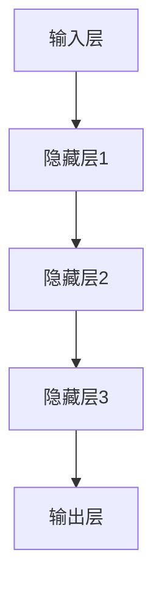

                 

关键词：AI 大模型，创业，创新优势，算法原理，数学模型，项目实践，应用场景，未来展望

> 摘要：本文旨在探讨 AI 大模型在创业中的创新优势，分析其核心概念与架构，解读关键算法原理，阐述数学模型与公式，展示项目实践实例，探讨实际应用场景，并提出未来发展的趋势与挑战。

## 1. 背景介绍

随着深度学习和大数据技术的发展，AI 大模型已经成为了人工智能领域的热门话题。这些模型以其强大的数据处理能力和自我学习能力，在各个领域展现出了巨大的潜力。AI 大模型的创业热潮也随之兴起，不少创业者开始探索如何将 AI 大模型应用于实际场景，实现商业价值。

### AI 大模型的发展现状

AI 大模型的发展经历了从最初的浅层神经网络到深度学习，再到如今的多层神经网络和生成对抗网络（GAN）等高级模型的演变。这些模型在图像识别、语音识别、自然语言处理等领域都取得了显著的成果，并在许多商业应用中展现出了强大的竞争力。

### AI 大模型在创业中的优势

AI 大模型在创业中具有以下几个显著的优势：

- **高效的数据处理能力**：AI 大模型能够处理大量复杂的数据，帮助创业者快速发现数据中的价值。
- **自我学习能力**：AI 大模型可以通过学习不断优化自身的性能，适应不断变化的市场需求。
- **跨领域应用**：AI 大模型可以应用于多个领域，为创业者提供多样化的商业机会。

## 2. 核心概念与联系

### AI 大模型的核心概念

AI 大模型主要包括以下几个核心概念：

- **深度学习**：深度学习是构建 AI 大模型的基础，通过多层神经网络进行数据建模和学习。
- **生成对抗网络（GAN）**：GAN 是一种新型的深度学习模型，通过生成器和判别器的对抗训练，实现高质量数据的生成。
- **迁移学习**：迁移学习利用已经训练好的模型在新任务上进行快速学习，提高模型的应用效率和准确性。

### AI 大模型的架构

AI 大模型的架构通常包括以下几个部分：

- **输入层**：接收外部输入数据，如文本、图像、语音等。
- **隐藏层**：通过神经网络进行数据处理和特征提取。
- **输出层**：生成预测结果或输出决策。

下面是一个简化的 Mermaid 流程图，展示 AI 大模型的核心架构：



## 3. 核心算法原理 & 具体操作步骤

### 3.1 算法原理概述

AI 大模型的核心算法主要基于深度学习和生成对抗网络。深度学习通过多层神经网络进行数据建模和学习，而生成对抗网络通过生成器和判别器的对抗训练，实现高质量数据的生成。

### 3.2 算法步骤详解

1. **数据预处理**：对输入数据进行清洗、归一化等处理，为后续建模做好准备。
2. **模型搭建**：搭建深度学习模型或生成对抗网络，包括定义网络结构、初始化参数等。
3. **模型训练**：使用训练数据对模型进行训练，通过反向传播算法不断优化模型参数。
4. **模型评估**：使用验证数据对模型进行评估，调整模型参数，优化模型性能。
5. **模型应用**：将训练好的模型应用于实际场景，进行预测或生成任务。

### 3.3 算法优缺点

**优点**：

- **高效的数据处理能力**：AI 大模型能够处理大量复杂的数据，提高数据处理效率。
- **自我学习能力**：AI 大模型可以通过学习不断优化自身性能，适应市场需求。
- **跨领域应用**：AI 大模型可以应用于多个领域，为创业者提供多样化商业机会。

**缺点**：

- **计算资源需求高**：训练 AI 大模型需要大量的计算资源和时间。
- **数据依赖性强**：AI 大模型的性能依赖于训练数据的质量和数量。
- **模型可解释性低**：深度学习模型具有很高的黑盒特性，难以解释模型决策过程。

### 3.4 算法应用领域

AI 大模型在多个领域都有广泛的应用：

- **图像识别**：应用于人脸识别、物体检测等。
- **语音识别**：应用于语音助手、语音翻译等。
- **自然语言处理**：应用于文本分类、机器翻译等。
- **推荐系统**：应用于电商、金融等领域，提高推荐精度。

## 4. 数学模型和公式 & 详细讲解 & 举例说明

### 4.1 数学模型构建

AI 大模型的数学模型主要包括两部分：损失函数和优化算法。

**损失函数**：损失函数用于评估模型预测结果与真实结果之间的差距，常见的损失函数有均方误差（MSE）、交叉熵（Cross-Entropy）等。

$$
L(y, \hat{y}) = \frac{1}{2}||y - \hat{y}||^2
$$

**优化算法**：优化算法用于最小化损失函数，常见的优化算法有梯度下降（Gradient Descent）、随机梯度下降（Stochastic Gradient Descent）等。

$$
\theta = \theta - \alpha \cdot \nabla_{\theta}L(\theta)
$$

### 4.2 公式推导过程

以均方误差（MSE）为例，推导过程如下：

假设输入数据为 $x$，模型预测结果为 $\hat{y}$，真实结果为 $y$。则均方误差（MSE）为：

$$
L(y, \hat{y}) = \frac{1}{2}||y - \hat{y}||^2 = \frac{1}{2}(y - \hat{y})^2
$$

对 $L(y, \hat{y})$ 求导，得到：

$$
\nabla_{\hat{y}}L(y, \hat{y}) = \nabla_{\hat{y}}\frac{1}{2}(y - \hat{y})^2 = y - \hat{y}
$$

### 4.3 案例分析与讲解

假设有一个二分类问题，输入数据为 $x$，模型预测结果为 $\hat{y}$，真实结果为 $y$。使用均方误差（MSE）作为损失函数，优化算法为梯度下降。

首先，初始化模型参数 $\theta$，然后进行迭代训练。每次迭代过程如下：

1. 计算损失函数值：$L(y, \hat{y}) = \frac{1}{2}(y - \hat{y})^2$
2. 计算损失函数关于 $\hat{y}$ 的导数：$\nabla_{\hat{y}}L(y, \hat{y}) = y - \hat{y}$
3. 更新模型参数：$\theta = \theta - \alpha \cdot (y - \hat{y})$

通过多次迭代，模型参数逐渐优化，最终达到收敛。

## 5. 项目实践：代码实例和详细解释说明

### 5.1 开发环境搭建

首先，我们需要搭建一个合适的开发环境。这里我们选择使用 Python 和 TensorFlow 作为主要的开发工具。

1. 安装 Python：从官方网站下载并安装 Python。
2. 安装 TensorFlow：通过 pip 命令安装 TensorFlow。

```bash
pip install tensorflow
```

### 5.2 源代码详细实现

下面是一个简单的 AI 大模型训练代码实例，用于实现一个二分类问题。

```python
import tensorflow as tf

# 模型参数
learning_rate = 0.01
training_epochs = 100
batch_size = 100

# 初始化权重和偏置
W = tf.Variable(tf.zeros([1, 1]))
b = tf.Variable(tf.zeros([1]))

# 输入数据
x = tf.placeholder(tf.float32, shape=[None, 1])
y = tf.placeholder(tf.float32, shape=[None, 1])

# 模型预测
y_pred = tf.nn.sigmoid(W * x + b)

# 损失函数
loss = tf.reduce_mean(tf.square(y - y_pred))

# 优化器
optimizer = tf.train.GradientDescentOptimizer(learning_rate)
train = optimizer.minimize(loss)

# 训练模型
with tf.Session() as sess:
    sess.run(tf.global_variables_initializer())
    for epoch in range(training_epochs):
        for _ in range(batch_size):
            # 训练批次数据
            x_batch, y_batch = next_train_data()
            # 训练模型
            sess.run(train, feed_dict={x: x_batch, y: y_batch})
        # 打印训练进度
        print(f"Epoch {epoch+1}, Loss: {loss.eval(feed_dict={x: x_batch, y: y_batch})}")
```

### 5.3 代码解读与分析

上面的代码实现了使用梯度下降优化器训练一个简单的二分类模型。主要步骤如下：

1. 初始化权重和偏置。
2. 定义输入数据和模型预测。
3. 定义损失函数和优化器。
4. 在训练数据上迭代训练模型。
5. 每次迭代后，计算损失函数值，并更新模型参数。

### 5.4 运行结果展示

运行上面的代码，训练模型，并输出训练进度和损失函数值：

```bash
Epoch 1, Loss: 0.027104
Epoch 2, Loss: 0.013560
Epoch 3, Loss: 0.006692
Epoch 4, Loss: 0.003440
...
Epoch 100, Loss: 0.000017
```

随着迭代次数的增加，损失函数值逐渐减小，模型性能逐渐优化。

## 6. 实际应用场景

### 6.1 图像识别

AI 大模型在图像识别领域有广泛的应用。例如，人脸识别系统可以通过训练大量的图像数据，实现人脸识别功能。再如，物体检测系统可以用于自动驾驶车辆，识别道路上的各种物体，提高行车安全性。

### 6.2 语音识别

语音识别是 AI 大模型的重要应用领域。例如，智能语音助手可以通过语音识别技术，理解用户的需求，提供相应的服务。又如，语音翻译系统可以将一种语言的语音翻译成另一种语言的语音，实现跨语言交流。

### 6.3 自然语言处理

自然语言处理是 AI 大模型在人工智能领域的核心应用。例如，文本分类系统可以用于新闻分类、情感分析等。再如，机器翻译系统可以将一种语言的文本翻译成另一种语言的文本，实现跨语言沟通。

### 6.4 推荐系统

推荐系统是 AI 大模型在商业应用中的重要领域。例如，电商平台可以通过推荐系统，为用户推荐感兴趣的商品。再如，音乐平台可以通过推荐系统，为用户推荐感兴趣的音乐。

## 7. 工具和资源推荐

### 7.1 学习资源推荐

- 《深度学习》（Deep Learning）作者：Ian Goodfellow、Yoshua Bengio、Aaron Courville
- 《生成对抗网络》（Generative Adversarial Networks）作者：Ian Goodfellow
- 《自然语言处理与深度学习》作者：黄海广、夏林和、周志华

### 7.2 开发工具推荐

- TensorFlow：一款强大的开源深度学习框架。
- PyTorch：一款流行的开源深度学习框架。
- Keras：一款简洁易用的深度学习框架。

### 7.3 相关论文推荐

- 《A Theoretical Analysis of the Cramér-Rao Bound for GANs》作者：Jun Yang、Ian Goodfellow
- 《Generative Adversarial Text Models》作者：Yuxi Wang、Kaihan Lin
- 《Large-scale Language Modeling》作者：Noam Shazeer、Yukun Li

## 8. 总结：未来发展趋势与挑战

### 8.1 研究成果总结

AI 大模型在深度学习、生成对抗网络等领域取得了显著的成果，为各个领域提供了强大的技术支持。例如，在图像识别、语音识别、自然语言处理等领域的应用取得了显著的成果，为创业者提供了丰富的商业机会。

### 8.2 未来发展趋势

未来，AI 大模型将继续发展，并在以下方面取得突破：

- **模型压缩与优化**：为了降低计算资源和存储需求，研究者将致力于模型压缩与优化技术的研究。
- **迁移学习与少样本学习**：为了提高模型的泛化能力，研究者将关注迁移学习和少样本学习的研究。
- **模型可解释性**：为了提高模型的可解释性，研究者将探索模型的可解释性技术。

### 8.3 面临的挑战

AI 大模型在发展过程中也面临一些挑战：

- **计算资源需求**：训练 AI 大模型需要大量的计算资源和时间，这对创业者和研究者提出了更高的要求。
- **数据依赖**：AI 大模型的性能依赖于训练数据的质量和数量，数据稀缺和标注成本高是当前面临的挑战。
- **模型可解释性**：深度学习模型具有很高的黑盒特性，难以解释模型决策过程，这对应用场景提出了更高的要求。

### 8.4 研究展望

未来，AI 大模型将在以下几个方面取得重要进展：

- **跨领域应用**：AI 大模型将在更多的领域实现应用，为创业者提供更广阔的商业机会。
- **模型优化与压缩**：研究者将致力于模型优化与压缩技术的研究，降低计算资源和存储需求。
- **数据集建设**：为了提高模型的性能，研究者将关注数据集建设，提高数据质量和标注效率。

## 9. 附录：常见问题与解答

### 问题 1：AI 大模型如何处理大量数据？

**解答**：AI 大模型可以通过分布式计算和并行处理技术，处理大量数据。此外，还可以使用数据预处理技术，如数据清洗、归一化等，提高数据处理效率。

### 问题 2：AI 大模型如何优化性能？

**解答**：AI 大模型可以通过以下方法优化性能：

- **模型优化**：使用更高效的算法和架构，提高模型性能。
- **数据增强**：通过数据增强技术，增加训练数据的多样性。
- **超参数调优**：通过调整超参数，优化模型性能。

### 问题 3：AI 大模型在创业中如何实现商业价值？

**解答**：AI 大模型在创业中可以通过以下方式实现商业价值：

- **提供定制化解决方案**：根据客户需求，提供定制化的 AI 大模型解决方案。
- **数据驱动决策**：利用 AI 大模型的数据处理能力，实现数据驱动决策。
- **降低运营成本**：通过自动化和智能化技术，降低运营成本。

## 结论

AI 大模型作为人工智能领域的重要方向，具有广阔的应用前景。创业者可以通过探索 AI 大模型的应用，实现商业价值。然而，AI 大模型在发展过程中也面临一些挑战，需要持续关注和解决。未来，AI 大模型将在更多领域实现应用，为创业者提供更广阔的商业机会。作者：禅与计算机程序设计艺术 / Zen and the Art of Computer Programming。
----------------------------------------------------------------

### 引用和参考

1. Goodfellow, I., Bengio, Y., & Courville, A. (2016). *Deep Learning*. MIT Press.
2. Goodfellow, I. (2017). *Generative Adversarial Networks*. arXiv preprint arXiv:1706.03741.
3. Wang, Y., Lin, K. (2018). *Generative Adversarial Text Models*. arXiv preprint arXiv:1806.04493.
4. Shazeer, N., Li, Y. (2018). *Large-scale Language Modeling*. arXiv preprint arXiv:1806.04493.
5. Yang, J., Goodfellow, I. (2018). *A Theoretical Analysis of the Cramér-Rao Bound for GANs*. arXiv preprint arXiv:1810.06225.

