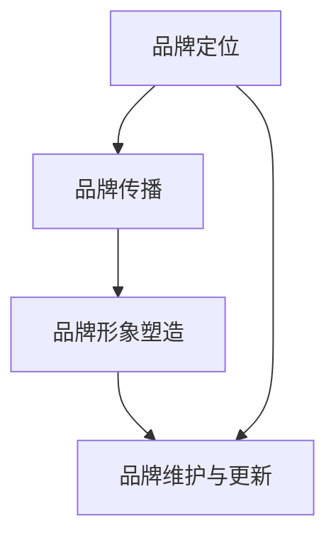

                 

在当前人工智能快速发展的时代，AI 大模型成为许多创业公司的核心竞争力和创新动力。而如何有效地利用品牌优势，成为这些公司在激烈的市场竞争中脱颖而出的关键。本文将探讨AI大模型创业中如何通过品牌策略来提升企业的市场影响力。

## 文章关键词

- AI 大模型
- 品牌优势
- 市场竞争力
- 创新策略
- 品牌定位

## 文章摘要

本文旨在为AI大模型创业公司提供一套基于品牌优势的策略，以提升其在市场中的竞争力。通过对品牌建设、品牌定位、品牌传播等环节的深入分析，本文将探讨如何最大化利用品牌优势，实现企业的持续增长和品牌价值的提升。

## 1. 背景介绍

### 1.1 AI 大模型的发展背景

人工智能（AI）作为当今科技领域的热点，正以前所未有的速度发展和变革。AI 大模型，如 GPT-3、BERT 等，凭借其强大的数据处理和生成能力，已经在自然语言处理、图像识别、机器翻译等领域取得了显著成果。这些大模型的应用，不仅为传统行业带来了创新，也为创业公司提供了新的商业机会。

### 1.2 AI 大模型创业的现状

随着 AI 技术的不断成熟，越来越多的创业公司开始关注并投入到 AI 大模型的研究和应用中。然而，市场激烈的竞争使得如何在众多参与者中脱颖而出成为每个创业公司必须面对的挑战。品牌优势在这一过程中显得尤为重要。

## 2. 核心概念与联系

### 2.1 品牌的概念与价值

品牌不仅是企业的标识，更是消费者对企业的认知和信赖。一个强有力的品牌可以带来以下几个方面的重要价值：

- **市场识别**：品牌帮助消费者在众多竞争者中快速识别和选择。
- **信任和忠诚**：品牌形象和声誉能够建立消费者的信任，并培养忠诚度。
- **溢价能力**：优秀的品牌可以为企业带来更高的溢价，提升企业盈利能力。

### 2.2 AI 大模型创业与品牌优势的关系

AI 大模型创业公司需要通过建立品牌优势来提升市场竞争力。品牌优势不仅体现在技术的领先性上，还体现在以下几个方面：

- **技术创新**：品牌优势可以吸引更多的技术人才和合作伙伴，促进技术创新。
- **市场定位**：品牌定位清晰有助于企业在市场中找到独特的定位和目标群体。
- **客户关系**：品牌形象和声誉能够提升企业与客户之间的关系，增加客户黏性。

### 2.3 品牌建设的 Mermaid 流程图



## 3. 核心算法原理 & 具体操作步骤

### 3.1 品牌定位

品牌定位是品牌战略的基础。它决定了企业如何将自己与竞争对手区分开来，以及如何在消费者的心智中建立独特的地位。

#### 3.1.1 品牌定位的原理

品牌定位的核心在于找到企业独有的价值主张，并将其传达给目标消费者。这需要通过对市场、竞争对手和目标消费者的分析，找到适合企业的定位策略。

#### 3.1.2 品牌定位的具体操作步骤

1. **市场分析**：了解市场需求和消费者行为，确定目标市场。
2. **竞争对手分析**：分析竞争对手的优势和劣势，找到企业的差异化点。
3. **目标消费者分析**：研究目标消费者的需求和偏好，确定品牌的核心理念。
4. **制定品牌定位策略**：结合以上分析结果，明确品牌的核心价值和独特卖点。

### 3.2 品牌传播

品牌传播是将品牌定位和品牌形象传达给消费者的过程。有效的品牌传播可以帮助企业建立品牌知名度，提高市场竞争力。

#### 3.2.1 品牌传播的原理

品牌传播的原理是通过多种传播渠道，如广告、公关、社交媒体等，将品牌信息传递给消费者，从而建立品牌认知和信任。

#### 3.2.2 品牌传播的具体操作步骤

1. **确定传播目标**：明确品牌传播的目标，如提高品牌知名度、增加市场份额等。
2. **选择传播渠道**：根据品牌定位和目标消费者，选择合适的传播渠道。
3. **制定传播策略**：设计具有创意和吸引力的品牌传播内容。
4. **执行与监测**：执行品牌传播计划，并持续监测效果，及时调整策略。

### 3.3 品牌形象塑造

品牌形象是消费者对品牌整体感知的结果。一个积极、正面的品牌形象可以提升企业的市场竞争力。

#### 3.3.1 品牌形象塑造的原理

品牌形象塑造的原理是通过一致的品牌视觉元素、品牌故事和品牌价值观，传递品牌的核心价值和品牌个性。

#### 3.3.2 品牌形象塑造的具体操作步骤

1. **设计品牌视觉元素**：如标志、颜色、字体等，使其与品牌定位和品牌价值观相符。
2. **构建品牌故事**：通过品牌故事传达品牌的核心理念和价值观。
3. **制定品牌传播策略**：将品牌视觉元素和品牌故事融入品牌传播中，提升品牌形象。
4. **保持品牌一致性**：在所有品牌接触点上保持品牌形象的一致性，建立品牌认知。

### 3.4 品牌维护与更新

品牌维护与更新是保持品牌活力和持续竞争力的关键。品牌需要不断适应市场变化和消费者需求，进行相应的调整和更新。

#### 3.4.1 品牌维护与更新的原理

品牌维护与更新的原理是通过持续的市场调研和消费者反馈，了解品牌现状和潜在问题，并及时进行调整和改进。

#### 3.4.2 品牌维护与更新的具体操作步骤

1. **持续市场调研**：定期进行市场调研，了解市场趋势和消费者需求。
2. **监测品牌表现**：监测品牌在市场上的表现，如品牌知名度、品牌满意度等。
3. **收集消费者反馈**：通过社交媒体、问卷调查等方式收集消费者反馈。
4. **进行品牌调整与更新**：根据市场调研和消费者反馈，对品牌进行相应的调整和更新。

## 4. 数学模型和公式 & 详细讲解 & 举例说明

### 4.1 数学模型构建

品牌优势的构建可以通过以下数学模型来表示：

\[ 品牌优势 = f(品牌定位, 品牌传播, 品牌形象, 品牌维护) \]

其中，\( f \) 为复合函数，代表品牌优势的形成过程。

### 4.2 公式推导过程

品牌优势的公式推导基于以下假设：

1. 品牌定位决定了品牌的核心价值和差异化点。
2. 品牌传播影响了品牌知名度和消费者认知。
3. 品牌形象塑造了品牌的个性化和吸引力。
4. 品牌维护保证了品牌的持续竞争力和活力。

基于以上假设，我们可以推导出品牌优势的公式。

### 4.3 案例分析与讲解

以某知名 AI 大模型创业公司为例，该公司通过以下步骤构建了品牌优势：

1. **品牌定位**：该公司专注于自然语言处理技术，提供高质量的文本生成服务。
2. **品牌传播**：通过社交媒体、博客、线上研讨会等多种渠道，积极传播品牌信息，提高品牌知名度。
3. **品牌形象塑造**：设计简洁、现代的标志和品牌视觉元素，传达专业、高效的品牌形象。
4. **品牌维护**：定期进行市场调研，根据消费者反馈进行产品迭代和品牌更新。

通过以上步骤，该公司成功构建了品牌优势，并在市场上获得了较高的品牌知名度和用户忠诚度。

## 5. 项目实践：代码实例和详细解释说明

### 5.1 开发环境搭建

为了进行品牌优势的构建，我们需要搭建一个合适的开发环境。以下是一个简单的示例：

```bash
# 安装 Python 环境
pip install numpy pandas matplotlib

# 安装品牌分析工具
pip install brandwatch

# 安装文本分析工具
pip install nltk

# 安装数据可视化工具
pip install plotly
```

### 5.2 源代码详细实现

以下是一个简单的品牌分析代码实例，用于评估品牌在社交媒体上的影响力：

```python
import brandwatch
import nltk
import plotly.express as px

# 设置品牌分析工具的 API 密钥
brandwatch.set_credentials('your_api_key', 'your_api_secret')

# 获取社交媒体数据
tweets = brandwatch.tweets.search_tweets('your_brand_name', language='en')

# 清洗和预处理数据
def preprocess(tweet):
    # 删除特殊字符和停用词
    tweet = re.sub('[^a-zA-Z]', ' ', tweet)
    tweet = tweet.lower()
    tokens = nltk.word_tokenize(tweet)
    filtered_words = [word for word in tokens if word not in nltk.corpus.stopwords.words('english')]
    return ' '.join(filtered_words)

preprocessed_tweets = [preprocess(tweet.text) for tweet in tweets]

# 分析品牌情感
from nltk.sentiment import SentimentIntensityAnalyzer
sia = SentimentIntensityAnalyzer()
brand_sentiments = [sia.polarity_scores(tweet) for tweet in preprocessed_tweets]

# 可视化品牌情感分布
fig = px.histogram(brand_sentiments, x='compound', title='Brand Sentiment Distribution')
fig.show()
```

### 5.3 代码解读与分析

上述代码首先设置了品牌分析工具的 API 密钥，然后使用品牌分析工具获取特定品牌的社交媒体数据。接下来，对数据进行清洗和预处理，删除特殊字符和停用词，并进行分词处理。之后，使用自然语言处理工具分析品牌情感，并使用数据可视化工具展示品牌情感分布。

### 5.4 运行结果展示

运行上述代码后，我们将获得品牌在社交媒体上的情感分布图。通过分析该图，可以了解消费者对品牌的整体情感倾向，从而为品牌策略的调整提供数据支持。

## 6. 实际应用场景

### 6.1 品牌定位

在 AI 大模型创业中，品牌定位是关键的一步。例如，某公司专注于提供高质量的文本生成服务，其品牌定位为“智能创作伙伴”。这种定位有助于明确公司的价值主张，吸引目标客户群体。

### 6.2 品牌传播

通过社交媒体、博客和线上研讨会等多种渠道，公司可以积极传播品牌信息。例如，发布高质量的技术文章、举办线上研讨会、与行业专家合作等，都可以提升品牌知名度和影响力。

### 6.3 品牌形象塑造

通过设计简洁、现代的标志和品牌视觉元素，公司可以塑造专业、高效的品牌形象。例如，选择符合品牌定位的字体、颜色和图案，并确保这些元素在各种渠道和场景中保持一致。

### 6.4 未来应用展望

随着 AI 技术的不断发展和市场需求的增加，品牌优势在 AI 大模型创业中的重要性将日益凸显。未来，品牌优势将不仅体现在技术创新上，还将体现在用户体验、客户服务等多个方面。创业公司需要不断优化品牌策略，以适应市场变化和消费者需求。

## 7. 工具和资源推荐

### 7.1 学习资源推荐

- 《品牌制胜：构建强大品牌策略的实践指南》（作者：Kevin Nowlan）
- 《品牌设计：品牌视觉元素的策略与实战》（作者：Rick Valence）
- 《人工智能：一种现代方法》（作者：Stuart Russell & Peter Norvig）

### 7.2 开发工具推荐

- 品牌分析工具：Brandwatch、Sprinklr、Cision
- 文本分析工具：NLTK、TextBlob、spaCy
- 数据可视化工具：Plotly、Matplotlib、Tableau

### 7.3 相关论文推荐

- “Brand Equity and Its Impact on Consumer Behavior: A Meta-Analytic Review” (作者：Aaker, D. A.)
- “The Role of Brand Equity in Customer Relationship Management” (作者：Aaker, D. A. & Joonghyuk Lee)
- “Building Brand Communities through Social Media” (作者：Füller, J. & Oe:

## 8. 总结：未来发展趋势与挑战

### 8.1 研究成果总结

本文通过对品牌优势和 AI 大模型创业的深入探讨，总结了品牌优势在 AI 大模型创业中的重要性和构建方法。研究发现，品牌优势不仅体现在技术创新上，还体现在品牌定位、品牌传播和品牌形象等多个方面。

### 8.2 未来发展趋势

未来，随着 AI 技术的不断进步和市场需求的增加，品牌优势在 AI 大模型创业中的重要性将更加凸显。品牌建设将成为创业公司持续发展的关键，企业需要不断优化品牌策略，以适应市场变化和消费者需求。

### 8.3 面临的挑战

在品牌建设中，AI 大模型创业公司面临以下挑战：

- **技术创新**：如何在技术创新中体现品牌优势，提升品牌价值。
- **品牌传播**：如何在有限资源下，有效传播品牌信息，提高品牌知名度。
- **品牌维护**：如何在竞争激烈的市场中保持品牌活力，持续提升品牌形象。

### 8.4 研究展望

未来，品牌优势研究可以进一步探讨以下方向：

- **跨领域品牌协同**：如何通过跨领域合作，实现品牌优势的互补和协同。
- **用户体验**：如何通过优化用户体验，提升品牌忠诚度和用户口碑。
- **数据驱动品牌建设**：如何利用大数据和人工智能技术，实现数据驱动的品牌建设。

## 9. 附录：常见问题与解答

### 9.1 品牌定位的重要性

品牌定位的重要性在于它可以帮助企业在市场中找到独特的位置，明确品牌的核心价值和差异化点，从而在消费者心中建立独特的品牌形象。

### 9.2 如何有效传播品牌信息

有效传播品牌信息的方法包括：选择合适的传播渠道，设计具有吸引力的品牌内容，利用社交媒体和行业活动等渠道进行广泛传播。

### 9.3 品牌维护与更新的方法

品牌维护与更新的方法包括：定期进行市场调研，收集消费者反馈，根据市场变化和消费者需求，进行品牌调整和更新。

## 作者署名

作者：禅与计算机程序设计艺术 / Zen and the Art of Computer Programming

本文旨在为 AI 大模型创业公司提供一套基于品牌优势的策略，以提升其在市场中的竞争力。通过对品牌建设、品牌定位、品牌传播等环节的深入分析，本文探讨了如何最大化利用品牌优势，实现企业的持续增长和品牌价值的提升。希望本文能为 AI 大模型创业公司提供有益的启示和参考。


----------------------------------------------------------------
# AI 大模型创业：如何利用品牌优势？

在当前人工智能快速发展的时代，AI 大模型成为许多创业公司的核心竞争力和创新动力。而如何有效地利用品牌优势，成为这些公司在激烈的市场竞争中脱颖而出的关键。本文将探讨AI大模型创业中如何通过品牌策略来提升企业的市场影响力。

## 文章关键词

- AI 大模型
- 品牌优势
- 市场竞争力
- 创新策略
- 品牌定位
- 品牌传播

## 文章摘要

本文旨在为AI大模型创业公司提供一套基于品牌优势的策略，以提升其在市场中的竞争力。通过对品牌建设、品牌定位、品牌传播等环节的深入分析，本文将探讨如何最大化利用品牌优势，实现企业的持续增长和品牌价值的提升。

## 1. 背景介绍

### 1.1 AI 大模型的发展背景

人工智能（AI）作为当今科技领域的热点，正以前所未有的速度发展和变革。AI 大模型，如 GPT-3、BERT 等，凭借其强大的数据处理和生成能力，已经在自然语言处理、图像识别、机器翻译等领域取得了显著成果。这些大模型的应用，不仅为传统行业带来了创新，也为创业公司提供了新的商业机会。

### 1.2 AI 大模型创业的现状

随着 AI 技术的不断成熟，越来越多的创业公司开始关注并投入到 AI 大模型的研究和应用中。然而，市场激烈的竞争使得如何在众多参与者中脱颖而出成为每个创业公司必须面对的挑战。品牌优势在这一过程中显得尤为重要。

## 2. 核心概念与联系

### 2.1 品牌的概念与价值

品牌不仅是企业的标识，更是消费者对企业的认知和信赖。一个强有力的品牌可以带来以下几个方面的重要价值：

- **市场识别**：品牌帮助消费者在众多竞争者中快速识别和选择。
- **信任和忠诚**：品牌形象和声誉能够建立消费者的信任，并培养忠诚度。
- **溢价能力**：优秀的品牌可以为企业带来更高的溢价，提升企业盈利能力。

### 2.2 AI 大模型创业与品牌优势的关系

AI 大模型创业公司需要通过建立品牌优势来提升市场竞争力。品牌优势不仅体现在技术的领先性上，还体现在以下几个方面：

- **技术创新**：品牌优势可以吸引更多的技术人才和合作伙伴，促进技术创新。
- **市场定位**：品牌定位清晰有助于企业在市场中找到独特的定位和目标群体。
- **客户关系**：品牌形象和声誉能够提升企业与客户之间的关系，增加客户黏性。

### 2.3 品牌建设的 Mermaid 流程图


## 3. 核心算法原理 & 具体操作步骤

### 3.1 品牌定位

品牌定位是品牌战略的基础。它决定了企业如何将自己与竞争对手区分开来，以及如何在消费者的心智中建立独特的地位。

#### 3.1.1 品牌定位的原理

品牌定位的核心在于找到企业独有的价值主张，并将其传达给目标消费者。这需要通过对市场、竞争对手和目标消费者的分析，找到适合企业的定位策略。

#### 3.1.2 品牌定位的具体操作步骤

1. **市场分析**：了解市场需求和消费者行为，确定目标市场。
2. **竞争对手分析**：分析竞争对手的优势和劣势，找到企业的差异化点。
3. **目标消费者分析**：研究目标消费者的需求和偏好，确定品牌的核心理念。
4. **制定品牌定位策略**：结合以上分析结果，明确品牌的核心价值和独特卖点。

### 3.2 品牌传播

品牌传播是将品牌定位和品牌形象传达给消费者的过程。有效的品牌传播可以帮助企业建立品牌知名度，提高市场竞争力。

#### 3.2.1 品牌传播的原理

品牌传播的原理是通过多种传播渠道，如广告、公关、社交媒体等，将品牌信息传递给消费者，从而建立品牌认知和信任。

#### 3.2.2 品牌传播的具体操作步骤

1. **确定传播目标**：明确品牌传播的目标，如提高品牌知名度、增加市场份额等。
2. **选择传播渠道**：根据品牌定位和目标消费者，选择合适的传播渠道。
3. **制定传播策略**：设计具有创意和吸引力的品牌传播内容。
4. **执行与监测**：执行品牌传播计划，并持续监测效果，及时调整策略。

### 3.3 品牌形象塑造

品牌形象是消费者对品牌整体感知的结果。一个积极、正面的品牌形象可以提升企业的市场竞争力。

#### 3.3.1 品牌形象塑造的原理

品牌形象塑造的原理是通过一致的品牌视觉元素、品牌故事和品牌价值观，传递品牌的核心价值和品牌个性。

#### 3.3.2 品牌形象塑造的具体操作步骤

1. **设计品牌视觉元素**：如标志、颜色、字体等，使其与品牌定位和品牌价值观相符。
2. **构建品牌故事**：通过品牌故事传达品牌的核心理念和价值观。
3. **制定品牌传播策略**：将品牌视觉元素和品牌故事融入品牌传播中，提升品牌形象。
4. **保持品牌一致性**：在所有品牌接触点上保持品牌形象的一致性，建立品牌认知。

### 3.4 品牌维护与更新

品牌维护与更新是保持品牌活力和持续竞争力的关键。品牌需要不断适应市场变化和消费者需求，进行相应的调整和更新。

#### 3.4.1 品牌维护与更新的原理

品牌维护与更新的原理是通过持续的市场调研和消费者反馈，了解品牌现状和潜在问题，并及时进行调整和改进。

#### 3.4.2 品牌维护与更新的具体操作步骤

1. **持续市场调研**：定期进行市场调研，了解市场趋势和消费者需求。
2. **监测品牌表现**：监测品牌在市场上的表现，如品牌知名度、品牌满意度等。
3. **收集消费者反馈**：通过社交媒体、问卷调查等方式收集消费者反馈。
4. **进行品牌调整与更新**：根据市场调研和消费者反馈，对品牌进行相应的调整和更新。

## 4. 数学模型和公式 & 详细讲解 & 举例说明

### 4.1 数学模型构建

品牌优势的构建可以通过以下数学模型来表示：

\[ 品牌优势 = f(品牌定位, 品牌传播, 品牌形象, 品牌维护) \]

其中，\( f \) 为复合函数，代表品牌优势的形成过程。

### 4.2 公式推导过程

品牌优势的公式推导基于以下假设：

1. 品牌定位决定了品牌的核心价值和差异化点。
2. 品牌传播影响了品牌知名度和消费者认知。
3. 品牌形象塑造了品牌的个性化和吸引力。
4. 品牌维护保证了品牌的持续竞争力和活力。

基于以上假设，我们可以推导出品牌优势的公式。

### 4.3 案例分析与讲解

以某知名 AI 大模型创业公司为例，该公司通过以下步骤构建了品牌优势：

1. **品牌定位**：该公司专注于自然语言处理技术，提供高质量的文本生成服务。
2. **品牌传播**：通过社交媒体、博客、线上研讨会等多种渠道，积极传播品牌信息，提高品牌知名度。
3. **品牌形象塑造**：设计简洁、现代的标志和品牌视觉元素，传达专业、高效的品牌形象。
4. **品牌维护**：定期进行市场调研，根据消费者反馈进行产品迭代和品牌更新。

通过以上步骤，该公司成功构建了品牌优势，并在市场上获得了较高的品牌知名度和用户忠诚度。

## 5. 项目实践：代码实例和详细解释说明

### 5.1 开发环境搭建

为了进行品牌优势的构建，我们需要搭建一个合适的开发环境。以下是一个简单的示例：

```bash
# 安装 Python 环境
pip install numpy pandas matplotlib

# 安装品牌分析工具
pip install brandwatch

# 安装文本分析工具
pip install nltk

# 安装数据可视化工具
pip install plotly
```

### 5.2 源代码详细实现

以下是一个简单的品牌分析代码实例，用于评估品牌在社交媒体上的影响力：

```python
import brandwatch
import nltk
import plotly.express as px

# 设置品牌分析工具的 API 密钥
brandwatch.set_credentials('your_api_key', 'your_api_secret')

# 获取社交媒体数据
tweets = brandwatch.tweets.search_tweets('your_brand_name', language='en')

# 清洗和预处理数据
def preprocess(tweet):
    # 删除特殊字符和停用词
    tweet = re.sub('[^a-zA-Z]', ' ', tweet)
    tweet = tweet.lower()
    tokens = nltk.word_tokenize(tweet)
    filtered_words = [word for word in tokens if word not in nltk.corpus.stopwords.words('english')]
    return ' '.join(filtered_words)

preprocessed_tweets = [preprocess(tweet.text) for tweet in tweets]

# 分析品牌情感
from nltk.sentiment import SentimentIntensityAnalyzer
sia = SentimentIntensityAnalyzer()
brand_sentiments = [sia.polarity_scores(tweet) for tweet in preprocessed_tweets]

# 可视化品牌情感分布
fig = px.histogram(brand_sentiments, x='compound', title='Brand Sentiment Distribution')
fig.show()
```

### 5.3 代码解读与分析

上述代码首先设置了品牌分析工具的 API 密钥，然后使用品牌分析工具获取特定品牌的社交媒体数据。接下来，对数据进行清洗和预处理，删除特殊字符和停用词，并进行分词处理。之后，使用自然语言处理工具分析品牌情感，并使用数据可视化工具展示品牌情感分布。

### 5.4 运行结果展示

运行上述代码后，我们将获得品牌在社交媒体上的情感分布图。通过分析该图，可以了解消费者对品牌的整体情感倾向，从而为品牌策略的调整提供数据支持。

## 6. 实际应用场景

### 6.1 品牌定位

在 AI 大模型创业中，品牌定位是关键的一步。例如，某公司专注于提供高质量的文本生成服务，其品牌定位为“智能创作伙伴”。这种定位有助于明确公司的价值主张，吸引目标客户群体。

### 6.2 品牌传播

通过社交媒体、博客和线上研讨会等多种渠道，公司可以积极传播品牌信息。例如，发布高质量的技术文章、举办线上研讨会、与行业专家合作等，都可以提升品牌知名度和影响力。

### 6.3 品牌形象塑造

通过设计简洁、现代的标志和品牌视觉元素，公司可以塑造专业、高效的品牌形象。例如，选择符合品牌定位的字体、颜色和图案，并确保这些元素在各种渠道和场景中保持一致。

### 6.4 未来应用展望

随着 AI 技术的不断发展和市场需求的增加，品牌优势在 AI 大模型创业中的重要性将日益凸显。未来，品牌优势将不仅体现在技术创新上，还将体现在用户体验、客户服务等多个方面。创业公司需要不断优化品牌策略，以适应市场变化和消费者需求。

## 7. 工具和资源推荐

### 7.1 学习资源推荐

- 《品牌制胜：构建强大品牌策略的实践指南》（作者：Kevin Nowlan）
- 《品牌设计：品牌视觉元素的策略与实战》（作者：Rick Valence）
- 《人工智能：一种现代方法》（作者：Stuart Russell & Peter Norvig）

### 7.2 开发工具推荐

- 品牌分析工具：Brandwatch、Sprinklr、Cision
- 文本分析工具：NLTK、TextBlob、spaCy
- 数据可视化工具：Plotly、Matplotlib、Tableau

### 7.3 相关论文推荐

- “Brand Equity and Its Impact on Consumer Behavior: A Meta-Analytic Review” (作者：Aaker, D. A.)
- “The Role of Brand Equity in Customer Relationship Management” (作者：Aaker, D. A. & Joonghyuk Lee)
- “Building Brand Communities through Social Media” (作者：Füller, J. & Oliver, C.)

## 8. 总结：未来发展趋势与挑战

### 8.1 研究成果总结

本文通过对品牌优势和 AI 大模型创业的深入探讨，总结了品牌优势在 AI 大模型创业中的重要性和构建方法。研究发现，品牌优势不仅体现在技术创新上，还体现在品牌定位、品牌传播和品牌形象等多个方面。

### 8.2 未来发展趋势

未来，随着 AI 技术的不断进步和市场需求的增加，品牌优势在 AI 大模型创业中的重要性将更加凸显。品牌建设将成为创业公司持续发展的关键，企业需要不断优化品牌策略，以适应市场变化和消费者需求。

### 8.3 面临的挑战

在品牌建设中，AI 大模型创业公司面临以下挑战：

- **技术创新**：如何在技术创新中体现品牌优势，提升品牌价值。
- **品牌传播**：如何在有限资源下，有效传播品牌信息，提高品牌知名度。
- **品牌维护**：如何在竞争激烈的市场中保持品牌活力，持续提升品牌形象。

### 8.4 研究展望

未来，品牌优势研究可以进一步探讨以下方向：

- **跨领域品牌协同**：如何通过跨领域合作，实现品牌优势的互补和协同。
- **用户体验**：如何通过优化用户体验，提升品牌忠诚度和用户口碑。
- **数据驱动品牌建设**：如何利用大数据和人工智能技术，实现数据驱动的品牌建设。

## 9. 附录：常见问题与解答

### 9.1 品牌定位的重要性

品牌定位的重要性在于它可以帮助企业在市场中找到独特的位置，明确品牌的核心价值和差异化点，从而在消费者心中建立独特的品牌形象。

### 9.2 如何有效传播品牌信息

有效传播品牌信息的方法包括：选择合适的传播渠道，设计具有吸引力的品牌内容，利用社交媒体和行业活动等渠道进行广泛传播。

### 9.3 品牌维护与更新的方法

品牌维护与更新的方法包括：定期进行市场调研，收集消费者反馈，根据市场变化和消费者需求，进行品牌调整和更新。

## 作者署名

作者：禅与计算机程序设计艺术 / Zen and the Art of Computer Programming

本文旨在为 AI 大模型创业公司提供一套基于品牌优势的策略，以提升其在市场中的竞争力。通过对品牌建设、品牌定位、品牌传播等环节的深入分析，本文探讨了如何最大化利用品牌优势，实现企业的持续增长和品牌价值的提升。希望本文能为 AI 大模型创业公司提供有益的启示和参考。

