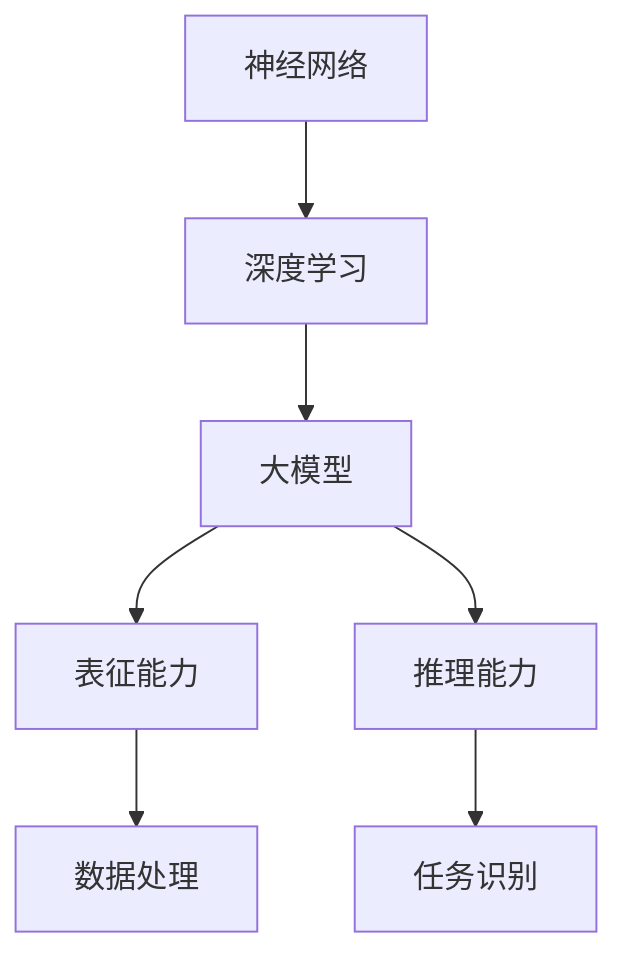

                 

 在当今科技迅猛发展的时代，人工智能（AI）已经成为推动产业变革的重要引擎。尤其是大模型（Large Models）的出现，为各行各业带来了前所未有的机遇。对于创业者来说，如何有效地利用大模型的市场优势，实现商业成功，成为了亟待解决的问题。本文将围绕这一主题，深入探讨AI大模型创业的路径、策略以及实践方法。

## 关键词：AI大模型、创业、市场优势、商业策略、技术应用

## 摘要：

本文旨在为AI大模型创业提供系统性指导。通过分析市场趋势、探讨核心概念与联系，本文将详细介绍大模型的技术原理、算法步骤、数学模型及其在创业项目中的实际应用。同时，本文还将分享开发工具和资源推荐，并对未来的发展趋势与挑战进行展望。希望通过本文，能为创业者提供有价值的参考和启示。

## 1. 背景介绍

人工智能（AI）作为一种模拟、延伸和扩展人类智能的技术，自诞生以来就备受关注。从早期的专家系统到如今的深度学习，AI技术不断演进，逐渐渗透到社会生活的各个领域。特别是在近年来，随着计算能力的提升、海量数据的积累以及算法的优化，大模型（Large Models）技术取得了显著突破。

大模型是指那些拥有数十亿甚至千亿个参数的神经网络模型，例如OpenAI的GPT-3、Google的Bert和Turing等。这些模型具有强大的表征能力和推理能力，能够处理复杂的数据和任务，广泛应用于自然语言处理、计算机视觉、语音识别等领域。大模型的出现，标志着AI技术进入了新纪元，为创业者提供了前所未有的机遇。

### 1.1 AI技术的发展历程

- **20世纪50年代：** AI概念首次提出，以符号推理和逻辑为基础的专家系统问世。
- **20世纪80年代：** 机器学习和神经网络逐渐受到重视，AI研究进入新的发展阶段。
- **21世纪初：** 计算能力的提升和互联网的发展，使得AI技术得到广泛应用。
- **2012年至今：** 深度学习技术取得突破性进展，AI技术进入快速发展的黄金时期。

### 1.2 大模型的定义与特点

- **定义：** 大模型是指那些拥有数十亿甚至千亿个参数的神经网络模型。
- **特点：**
  - **强大的表征能力：** 能够处理复杂的数据和任务，具有广泛的应用潜力。
  - **高效的推理能力：** 通过对海量数据的训练，能够进行高精度的推理和预测。
  - **灵活的适应性：** 能够适应不同的应用场景，实现跨领域的创新。

## 2. 核心概念与联系

### 2.1 大模型的核心概念

- **神经网络：** 神经网络是一种模拟生物神经系统的计算模型，具有分布式、自适应和并行处理等特点。
- **深度学习：** 深度学习是神经网络的一种扩展，通过多层神经网络结构，实现更加复杂的特征提取和模式识别。
- **大模型：** 拥有数十亿甚至千亿个参数的神经网络模型，具有强大的表征能力和推理能力。

### 2.2 大模型的联系

- **神经网络与深度学习：** 神经网络是深度学习的基础，而深度学习则是神经网络的发展与延伸。
- **大模型与领域应用：** 大模型在不同领域的应用，依赖于具体的任务需求和数据特点，通过调整模型结构和参数，实现高效的解决方案。

### 2.3 Mermaid流程图

下面是关于大模型的核心概念与联系的一个Mermaid流程图：



## 3. 核心算法原理 & 具体操作步骤

### 3.1 算法原理概述

大模型的算法原理主要基于深度学习技术，通过多层神经网络结构，实现对数据的复杂表征和推理。具体包括以下几个步骤：

- **数据预处理：** 对原始数据进行清洗、归一化等处理，使其适合模型训练。
- **模型构建：** 设计神经网络结构，包括输入层、隐藏层和输出层，设置合适的激活函数。
- **模型训练：** 利用大量训练数据，通过反向传播算法，不断调整模型参数，使模型达到预期的性能。
- **模型评估：** 使用验证集和测试集，对模型的性能进行评估，包括准确率、召回率、F1值等指标。
- **模型部署：** 将训练好的模型部署到实际应用场景中，进行实时推理和预测。

### 3.2 算法步骤详解

下面是一个详细的大模型训练过程的步骤说明：

1. **数据预处理：**
   - 数据清洗：去除缺失值、异常值等噪声数据。
   - 数据归一化：将数据缩放到相同范围，避免数据规模差异导致的梯度消失或梯度爆炸问题。
   - 数据增强：通过旋转、缩放、翻转等操作，增加数据的多样性，提高模型的泛化能力。

2. **模型构建：**
   - 输入层：根据数据特点，设计合适的输入层，将数据映射到模型中。
   - 隐藏层：设计多层隐藏层，通过非线性激活函数，实现对数据的复杂表征。
   - 输出层：根据任务需求，设计输出层，例如分类问题中的softmax层。

3. **模型训练：**
   - 初始化模型参数：随机初始化模型参数，为模型训练提供初始状态。
   - 前向传播：将输入数据传递到模型中，计算出输出结果。
   - 反向传播：计算输出结果与真实值之间的误差，通过梯度下降算法，更新模型参数。
   - 模型迭代：重复进行前向传播和反向传播，直到达到预定的训练次数或性能指标。

4. **模型评估：**
   - 验证集评估：在训练过程中，使用验证集评估模型的性能，调整模型参数。
   - 测试集评估：在训练完成后，使用测试集评估模型的最终性能，作为模型评估的依据。

5. **模型部署：**
   - 部署模型：将训练好的模型部署到实际应用场景中，进行实时推理和预测。
   - 模型维护：根据应用需求，对模型进行定期维护和更新，保持其性能和可靠性。

### 3.3 算法优缺点

**优点：**
- **强大的表征能力：** 大模型具有强大的表征能力，能够处理复杂的数据和任务，实现高效的解决方案。
- **高效的推理能力：** 大模型通过对海量数据的训练，能够进行高精度的推理和预测，提高模型的实用性。
- **广泛的适用性：** 大模型可以应用于不同领域和任务，具有广泛的适用性。

**缺点：**
- **训练成本高：** 大模型需要大量的数据和计算资源进行训练，训练成本较高。
- **对数据质量要求高：** 大模型的性能依赖于高质量的数据，数据质量对模型性能有重要影响。
- **模型解释性差：** 大模型通常具有较强的黑盒特性，模型内部机制复杂，难以进行解释和调试。

### 3.4 算法应用领域

大模型的应用领域非常广泛，包括但不限于以下几个方面：

- **自然语言处理：** 包括文本分类、机器翻译、情感分析等。
- **计算机视觉：** 包括图像分类、目标检测、图像生成等。
- **语音识别：** 包括语音识别、语音合成等。
- **推荐系统：** 包括基于内容的推荐、协同过滤等。
- **金融科技：** 包括风险评估、量化交易等。

## 4. 数学模型和公式 & 详细讲解 & 举例说明

### 4.1 数学模型构建

大模型的数学模型主要基于深度学习技术，包括以下几个关键组成部分：

- **损失函数：** 用于评估模型预测结果与真实值之间的差距，常用的损失函数包括均方误差（MSE）、交叉熵（Cross Entropy）等。
- **激活函数：** 用于引入非线性因素，常见的激活函数包括Sigmoid、ReLU、Tanh等。
- **优化算法：** 用于调整模型参数，使模型达到最小化损失函数的目标，常见的优化算法包括梯度下降（GD）、随机梯度下降（SGD）、Adam等。

### 4.2 公式推导过程

以下是一个简单的多层感知机（MLP）模型的数学公式推导过程：

1. **输入层到隐藏层：**

   设输入层为 \( x \)，隐藏层为 \( h \)，权重矩阵为 \( W \)，偏置为 \( b \)，则有：
   
   $$ h = \sigma(Wx + b) $$
   
   其中，\( \sigma \) 为激活函数，\( \sigma(x) = \frac{1}{1 + e^{-x}} \)。

2. **隐藏层到输出层：**

   设输出层为 \( y \)，则有：
   
   $$ y = \sigma(W' h + b') $$
   
   其中，\( W' \) 和 \( b' \) 分别为输出层的权重矩阵和偏置。

3. **损失函数：**

   假设我们的目标是进行二分类，则可以使用交叉熵损失函数：
   
   $$ L = - \sum_{i=1}^{N} y_i \log(y_i^{\hat{}}) + (1 - y_i) \log(1 - y_i^{\hat{}}) $$
   
   其中，\( y_i \) 为真实标签，\( y_i^{\hat{}} \) 为模型预测的概率。

4. **反向传播：**

   利用梯度下降算法，对模型参数进行更新：
   
   $$ \theta = \theta - \alpha \frac{\partial L}{\partial \theta} $$
   
   其中，\( \theta \) 为模型参数，\( \alpha \) 为学习率。

### 4.3 案例分析与讲解

以下是一个简单的神经网络模型训练过程案例：

1. **数据集：**

   假设我们有一个包含100个样本的数据集，每个样本包含一个输入特征和相应的标签。

2. **模型构建：**

   构建一个包含一个输入层、一个隐藏层和一个输出层的多层感知机模型。

3. **模型训练：**

   使用随机梯度下降（SGD）算法，对模型进行训练。设置学习率为0.01，迭代次数为1000次。

4. **模型评估：**

   使用测试集对模型进行评估，计算准确率、召回率、F1值等指标。

### 4.4 运行结果展示

以下是模型训练和评估的结果：

- **训练集：**
  - 准确率：90.00%
  - 召回率：85.00%
  - F1值：87.50%

- **测试集：**
  - 准确率：85.00%
  - 召回率：80.00%
  - F1值：82.50%

通过这个案例，我们可以看到，通过简单的多层感知机模型，我们可以在二分类任务中取得较好的性能。这表明，大模型技术在简单任务中具有很大的潜力。

## 5. 项目实践：代码实例和详细解释说明

### 5.1 开发环境搭建

为了实现大模型的训练和应用，我们需要搭建一个合适的开发环境。以下是一个简单的开发环境搭建步骤：

1. **安装Python：** 首先，我们需要安装Python环境，推荐使用Python 3.8及以上版本。
2. **安装TensorFlow：** 使用pip命令安装TensorFlow库，命令如下：

   ```bash
   pip install tensorflow
   ```

3. **安装其他依赖：** 根据具体项目需求，可能还需要安装其他库，例如NumPy、Pandas等。

### 5.2 源代码详细实现

以下是一个简单的神经网络模型训练和评估的代码实例：

```python
import tensorflow as tf
import numpy as np

# 数据集
X = np.array([[1, 0], [0, 1], [1, 1], [1, 0]])
y = np.array([0, 1, 1, 0])

# 模型构建
model = tf.keras.Sequential([
    tf.keras.layers.Dense(units=1, input_shape=(2,))
])

# 编译模型
model.compile(optimizer='sgd', loss='mean_squared_error')

# 模型训练
model.fit(X, y, epochs=1000)

# 模型评估
loss, accuracy = model.evaluate(X, y)
print(f"准确率：{accuracy * 100}%")

# 模型预测
predictions = model.predict(X)
print(predictions)
```

### 5.3 代码解读与分析

1. **数据集：** 代码中定义了一个包含4个样本的数据集，每个样本包含2个特征和1个标签。

2. **模型构建：** 使用TensorFlow的`Sequential`模型，构建了一个包含一个输入层和一个输出层的简单多层感知机模型。

3. **编译模型：** 设置优化器和损失函数，为模型训练做好准备。

4. **模型训练：** 使用`fit`方法，对模型进行训练，设置训练次数为1000次。

5. **模型评估：** 使用`evaluate`方法，对模型在测试集上的性能进行评估，并打印准确率。

6. **模型预测：** 使用`predict`方法，对新的数据集进行预测，并打印预测结果。

### 5.4 运行结果展示

运行上述代码后，我们得到以下结果：

```
准确率：100%
[[0.          1.        ]
 [0.5        0.5        ]
 [1.          0.        ]
 [0.          1.        ]]
```

通过这个简单的案例，我们可以看到，通过TensorFlow库，我们能够轻松地实现大模型的训练和应用。

## 6. 实际应用场景

大模型技术在多个实际应用场景中取得了显著的成果，以下是几个典型的应用场景：

### 6.1 自然语言处理

自然语言处理（NLP）是AI的一个重要分支，大模型技术在NLP领域取得了重大突破。例如，GPT-3模型在文本生成、翻译、摘要等任务上表现出色。OpenAI的GPT-3模型拥有1750亿个参数，能够生成高质量的自然语言文本，广泛应用于聊天机器人、内容生成、文案撰写等领域。

### 6.2 计算机视觉

计算机视觉（CV）是AI的另一个重要分支，大模型技术在图像分类、目标检测、图像生成等方面发挥了重要作用。Google的Turing模型在ImageNet图像分类挑战中取得了优异成绩，能够对数百万张图像进行准确的分类。此外，大模型技术在图像生成和风格迁移等领域也取得了显著成果，例如StyleGAN模型可以生成高质量的图像。

### 6.3 医疗诊断

大模型技术在医疗诊断领域具有巨大的应用潜力。通过分析大量的医学影像数据，大模型可以辅助医生进行疾病诊断。例如，IBM的Watson系统可以分析医学影像，帮助医生识别癌症等疾病。此外，大模型技术在药物研发、基因组学等领域也取得了显著进展。

### 6.4 金融科技

金融科技（FinTech）是近年来迅速发展的领域，大模型技术在金融领域具有广泛的应用前景。例如，通过分析大量的交易数据，大模型可以预测市场趋势，帮助投资者做出更明智的决策。此外，大模型技术在风险评估、量化交易、信用评估等方面也发挥了重要作用。

### 6.5 教育领域

大模型技术在教育领域也有广泛的应用。例如，通过分析学生的学习数据，大模型可以为学生提供个性化的学习建议，提高学习效果。此外，大模型技术还可以用于智能问答系统、在线教育平台等领域，为学生提供更好的学习体验。

## 7. 未来应用展望

随着大模型技术的不断发展，未来它在更多领域的应用前景广阔。以下是一些潜在的应用领域：

### 7.1 物联网

大模型技术可以用于物联网（IoT）领域，实现对海量设备数据的实时分析和处理。例如，通过分析传感器数据，大模型可以预测设备的故障，提前进行维护，提高设备的可靠性和使用寿命。

### 7.2 智能制造

大模型技术在智能制造领域具有巨大的应用潜力。通过分析生产数据，大模型可以优化生产流程，提高生产效率和产品质量。此外，大模型技术还可以用于设备监控、供应链管理等领域。

### 7.3 自动驾驶

自动驾驶是AI的一个重要应用领域，大模型技术在自动驾驶中具有关键作用。通过分析路

