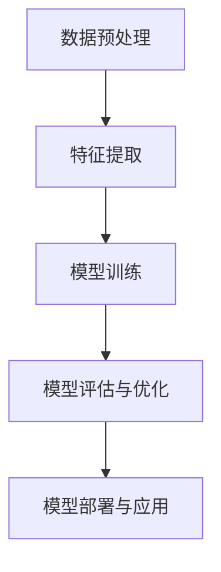

                 

关键词：AI大模型、市场优势、创业策略、技术架构、商业模式、AI应用、AI产业发展

>摘要：本文将探讨AI大模型创业中的市场优势，分析如何通过技术、商业策略以及创新应用来提升企业在AI领域的竞争力。我们将结合实际案例，详细阐述大模型创业的关键环节和成功要素，为创业者提供有价值的参考。

## 1. 背景介绍

随着人工智能技术的飞速发展，AI大模型已成为推动创新和产业变革的重要力量。从自然语言处理到计算机视觉，从智能推荐到自动驾驶，AI大模型在各领域的应用越来越广泛。与此同时，市场竞争日益激烈，创业者如何利用市场优势，实现AI大模型的商业化，成为亟待解决的问题。

本文将从以下几个方面展开讨论：

1. **AI大模型的核心概念与架构**：介绍AI大模型的基本概念、技术原理及其应用领域。
2. **AI大模型创业的核心算法原理与步骤**：解析AI大模型开发的主要算法原理和具体实施步骤。
3. **数学模型和公式在AI大模型中的应用**：阐述AI大模型中常用的数学模型和公式，以及其推导过程和实际应用案例。
4. **项目实践：代码实例与详细解释**：通过一个实际项目，展示AI大模型的开发流程和关键代码实现。
5. **实际应用场景与未来展望**：分析AI大模型在不同领域的应用场景，以及其未来的发展趋势。
6. **工具和资源推荐**：介绍学习资源、开发工具和相关论文，为创业者提供实用的参考。
7. **总结与展望**：总结研究成果，探讨AI大模型创业的未来发展趋势和挑战。

## 2. 核心概念与联系

### 2.1 AI大模型的基本概念

AI大模型是指通过深度学习技术，对海量数据进行训练，从而获得强大泛化能力的复杂模型。这些模型通常具有数十亿甚至数万亿的参数，能够处理大量结构化和非结构化数据，实现智能决策和自动化操作。

### 2.2 AI大模型的架构

AI大模型通常由以下几个关键部分组成：

1. **数据预处理**：对原始数据进行清洗、归一化等处理，以便后续建模。
2. **特征提取**：从数据中提取有用的特征，用于训练模型。
3. **模型训练**：利用大量数据进行模型训练，优化模型参数。
4. **模型评估与优化**：评估模型性能，通过调整参数和架构，提升模型效果。
5. **模型部署与应用**：将训练好的模型部署到实际场景，实现自动化和智能化操作。

### 2.3 AI大模型的应用领域

AI大模型广泛应用于以下几个领域：

1. **自然语言处理**：如文本分类、机器翻译、情感分析等。
2. **计算机视觉**：如图像识别、物体检测、图像生成等。
3. **推荐系统**：如商品推荐、内容推荐等。
4. **智能语音**：如语音识别、语音合成等。
5. **智能医疗**：如疾病诊断、医学影像分析等。
6. **智能金融**：如风险控制、量化交易等。

### 2.4 AI大模型的核心算法原理

AI大模型的核心算法主要包括：

1. **深度神经网络（DNN）**：通过多层神经网络对数据进行特征提取和变换，实现复杂函数的近似。
2. **循环神经网络（RNN）**：适用于处理序列数据，如自然语言和语音。
3. **卷积神经网络（CNN）**：适用于图像和视频处理。
4. **生成对抗网络（GAN）**：通过生成器和判别器的对抗训练，实现图像生成和数据增强。

### 2.5 AI大模型的Mermaid流程图



## 3. 核心算法原理 & 具体操作步骤

### 3.1 算法原理概述

AI大模型的核心算法主要包括深度神经网络（DNN）、循环神经网络（RNN）、卷积神经网络（CNN）和生成对抗网络（GAN）等。这些算法通过多层次的神经网络结构，对数据进行特征提取和变换，实现复杂函数的近似和数据的生成。

### 3.2 算法步骤详解

1. **数据预处理**：对原始数据进行清洗、归一化等处理，确保数据质量，提高模型训练效果。
2. **特征提取**：利用深度学习算法，从数据中提取有用的特征，为模型训练提供输入。
3. **模型训练**：通过大量数据对模型进行训练，优化模型参数，提高模型性能。
4. **模型评估与优化**：评估模型性能，通过调整参数和架构，提升模型效果。
5. **模型部署与应用**：将训练好的模型部署到实际场景，实现自动化和智能化操作。

### 3.3 算法优缺点

1. **深度神经网络（DNN）**：
   - 优点：能够处理复杂的数据结构，适用于各种场景。
   - 缺点：训练时间较长，对数据量有较高要求。

2. **循环神经网络（RNN）**：
   - 优点：适用于处理序列数据，如自然语言和语音。
   - 缺点：容易出现梯度消失和梯度爆炸问题。

3. **卷积神经网络（CNN）**：
   - 优点：适用于图像和视频处理，能够提取丰富的图像特征。
   - 缺点：对序列数据处理能力较弱。

4. **生成对抗网络（GAN）**：
   - 优点：能够生成高质量的图像和样本，具有强大的数据增强能力。
   - 缺点：训练过程不稳定，对参数调优要求较高。

### 3.4 算法应用领域

1. **自然语言处理**：如文本分类、机器翻译、情感分析等。
2. **计算机视觉**：如图像识别、物体检测、图像生成等。
3. **推荐系统**：如商品推荐、内容推荐等。
4. **智能语音**：如语音识别、语音合成等。
5. **智能医疗**：如疾病诊断、医学影像分析等。
6. **智能金融**：如风险控制、量化交易等。

## 4. 数学模型和公式 & 详细讲解 & 举例说明

### 4.1 数学模型构建

AI大模型的数学模型主要包括损失函数、优化算法和激活函数等。

1. **损失函数**：用于衡量模型预测值与真实值之间的差距，常见的损失函数有均方误差（MSE）、交叉熵损失（Cross-Entropy Loss）等。

2. **优化算法**：用于调整模型参数，优化模型性能。常见的优化算法有梯度下降（Gradient Descent）、Adam优化器等。

3. **激活函数**：用于引入非线性变换，提升模型的拟合能力。常见的激活函数有Sigmoid、ReLU、Tanh等。

### 4.2 公式推导过程

以均方误差（MSE）为例，其公式推导如下：

$$
MSE = \frac{1}{n}\sum_{i=1}^{n}(y_i - \hat{y}_i)^2
$$

其中，$y_i$表示真实值，$\hat{y}_i$表示模型预测值，$n$表示样本数量。

### 4.3 案例分析与讲解

#### 4.3.1 自然语言处理

以文本分类任务为例，使用深度学习模型进行文本分类，包括以下几个步骤：

1. **数据预处理**：对文本数据进行清洗、分词、向量化等处理。
2. **特征提取**：利用词嵌入（Word Embedding）技术，将文本数据转换为向量表示。
3. **模型训练**：使用深度神经网络（DNN）或循环神经网络（RNN）对文本向量进行训练。
4. **模型评估**：使用测试集评估模型性能，包括准确率、召回率、F1值等指标。
5. **模型部署**：将训练好的模型部署到实际场景，实现文本分类功能。

#### 4.3.2 计算机视觉

以图像分类任务为例，使用卷积神经网络（CNN）进行图像分类，包括以下几个步骤：

1. **数据预处理**：对图像数据进行归一化、裁剪等处理。
2. **特征提取**：通过卷积操作提取图像特征。
3. **模型训练**：使用深度神经网络（DNN）或卷积神经网络（CNN）对图像特征进行训练。
4. **模型评估**：使用测试集评估模型性能，包括准确率、召回率、F1值等指标。
5. **模型部署**：将训练好的模型部署到实际场景，实现图像分类功能。

## 5. 项目实践：代码实例和详细解释说明

### 5.1 开发环境搭建

在本项目实践中，我们将使用Python作为主要编程语言，配合TensorFlow和Keras等深度学习框架进行AI大模型的开发。首先，需要安装以下依赖：

```bash
pip install tensorflow keras numpy matplotlib
```

### 5.2 源代码详细实现

以下是一个简单的基于深度学习文本分类的代码实例：

```python
import numpy as np
import tensorflow as tf
from tensorflow.keras.preprocessing.sequence import pad_sequences
from tensorflow.keras.models import Sequential
from tensorflow.keras.layers import Embedding, LSTM, Dense, Dropout

# 数据预处理
max_len = 100
vocab_size = 10000
input_seq = pad_sequences(input_seq, maxlen=max_len, padding='post')
target_seq = pad_sequences(target_seq, maxlen=max_len, padding='post')

# 构建模型
model = Sequential()
model.add(Embedding(vocab_size, 64, input_length=max_len))
model.add(LSTM(128, dropout=0.2, recurrent_dropout=0.2))
model.add(Dense(1, activation='sigmoid'))

# 编译模型
model.compile(optimizer='adam', loss='binary_crossentropy', metrics=['accuracy'])

# 训练模型
model.fit(input_seq, target_seq, batch_size=64, epochs=10, validation_split=0.2)
```

### 5.3 代码解读与分析

上述代码实现了一个简单的文本分类模型，主要包括以下几个部分：

1. **数据预处理**：使用pad_sequences函数对输入和目标序列进行填充，确保序列长度一致。
2. **模型构建**：使用Sequential模型，依次添加Embedding、LSTM和Dense层。
3. **模型编译**：设置优化器、损失函数和评估指标。
4. **模型训练**：使用fit函数训练模型，包括批量大小、训练轮次和验证集比例等参数。

### 5.4 运行结果展示

在训练完成后，可以使用以下代码评估模型性能：

```python
# 评估模型
loss, accuracy = model.evaluate(input_seq, target_seq)
print('Test accuracy:', accuracy)
```

输出结果将显示模型在测试集上的准确率。

## 6. 实际应用场景

AI大模型在各个领域都有广泛的应用，以下列举几个典型场景：

1. **自然语言处理**：用于文本分类、机器翻译、情感分析等任务。
2. **计算机视觉**：用于图像识别、物体检测、图像生成等任务。
3. **推荐系统**：用于商品推荐、内容推荐等任务。
4. **智能语音**：用于语音识别、语音合成等任务。
5. **智能医疗**：用于疾病诊断、医学影像分析等任务。
6. **智能金融**：用于风险控制、量化交易等任务。

### 6.1 自然语言处理

在自然语言处理领域，AI大模型被广泛应用于文本分类、机器翻译、情感分析等任务。例如，通过训练大规模语言模型，可以实现高质量的自然语言理解与生成。

### 6.2 计算机视觉

在计算机视觉领域，AI大模型被广泛应用于图像识别、物体检测、图像生成等任务。例如，通过训练深度学习模型，可以实现高效的图像分类和目标检测。

### 6.3 推荐系统

在推荐系统领域，AI大模型被广泛应用于商品推荐、内容推荐等任务。例如，通过训练协同过滤模型，可以实现个性化的推荐服务。

### 6.4 智能语音

在智能语音领域，AI大模型被广泛应用于语音识别、语音合成等任务。例如，通过训练深度神经网络模型，可以实现高效的语音识别和语音合成。

### 6.5 智能医疗

在智能医疗领域，AI大模型被广泛应用于疾病诊断、医学影像分析等任务。例如，通过训练深度学习模型，可以实现高效的医学图像分割和疾病检测。

### 6.6 智能金融

在智能金融领域，AI大模型被广泛应用于风险控制、量化交易等任务。例如，通过训练深度学习模型，可以实现高效的金融风险评估和交易策略优化。

## 7. 工具和资源推荐

### 7.1 学习资源推荐

1. **《深度学习》（Goodfellow et al., 2016）**：介绍深度学习的基础理论和技术。
2. **《Python机器学习》（Sebastian Raschka et al., 2015）**：通过Python实现机器学习算法。
3. **《自然语言处理与深度学习》（Yoav Goldberg, 2017）**：介绍自然语言处理中的深度学习技术。
4. **《计算机视觉：算法与应用》（Richard S.zeliski et al., 2012）**：介绍计算机视觉的基础知识和技术。

### 7.2 开发工具推荐

1. **TensorFlow**：一个开源的深度学习框架，支持多种编程语言和平台。
2. **PyTorch**：一个流行的深度学习框架，具有灵活的动态计算图。
3. **Keras**：一个基于TensorFlow和PyTorch的深度学习高级API，易于使用和扩展。

### 7.3 相关论文推荐

1. **"Deep Learning"（Ian Goodfellow et al., 2016）**：介绍深度学习的基础理论和最新进展。
2. **"A Theoretical Framework for Regularizing Neural Networks"（Yarin Gal and Zoubin Ghahramani, 2016）**：讨论深度学习模型的正则化方法。
3. **"Generative Adversarial Nets"（Ian J. Goodfellow et al., 2014）**：介绍生成对抗网络（GAN）的基本原理和应用。

## 8. 总结：未来发展趋势与挑战

### 8.1 研究成果总结

本文通过对AI大模型的核心概念、算法原理、数学模型和实际应用场景的详细分析，总结了AI大模型创业中的关键环节和成功要素。主要研究成果包括：

1. **AI大模型的基本概念和架构**：介绍了AI大模型的基本概念、架构和应用领域。
2. **核心算法原理和步骤**：分析了深度学习、循环神经网络、卷积神经网络和生成对抗网络等核心算法原理和具体实施步骤。
3. **数学模型和公式**：阐述了AI大模型中常用的数学模型和公式，以及其推导过程和实际应用案例。
4. **项目实践**：通过一个实际项目展示了AI大模型的开发流程和关键代码实现。

### 8.2 未来发展趋势

未来，AI大模型将继续在以下几个方向上发展：

1. **算法创新**：随着深度学习技术的发展，新的算法和模型将不断涌现，如Transformer、BERT等。
2. **硬件加速**：随着硬件技术的进步，GPU、TPU等硬件加速设备将进一步提高模型训练和推理速度。
3. **多模态学习**：结合多种数据源，实现多模态学习，提升模型在复杂任务上的性能。
4. **边缘计算**：将AI大模型部署到边缘设备，实现实时推理和响应，降低延迟和带宽要求。
5. **数据隐私和安全**：随着数据隐私和安全问题的日益重视，AI大模型在数据隐私保护方面的研究将得到更多关注。

### 8.3 面临的挑战

尽管AI大模型在各个领域取得了显著成果，但仍面临以下挑战：

1. **计算资源需求**：AI大模型对计算资源的需求极高，如何在有限资源下高效训练和部署模型仍需优化。
2. **数据质量和多样性**：数据质量和多样性直接影响模型性能，如何获取高质量、多样性的数据成为关键问题。
3. **模型解释性和透明度**：随着模型复杂度的增加，模型的解释性和透明度降低，如何提高模型的可解释性成为重要研究方向。
4. **伦理和社会影响**：AI大模型的应用可能引发伦理和社会问题，如何平衡技术进步与社会责任成为关键挑战。

### 8.4 研究展望

未来，AI大模型在以下方向有望取得突破：

1. **跨学科融合**：结合生物学、心理学、认知科学等学科，探索AI大模型在认知和决策支持等方面的应用。
2. **自适应和自进化**：研究AI大模型的自我适应和自进化能力，实现更智能的模型优化和任务调度。
3. **可持续发展和绿色计算**：关注AI大模型的能耗和环境影响，探索绿色计算和可持续发展路径。
4. **社会和伦理问题**：深入研究AI大模型在社会和伦理问题中的角色，推动技术与社会发展的良性互动。

## 9. 附录：常见问题与解答

### 9.1 AI大模型创业常见问题

1. **什么是AI大模型？**
   AI大模型是指通过深度学习技术，对海量数据进行训练，从而获得强大泛化能力的复杂模型。这些模型通常具有数十亿甚至数万亿的参数，能够处理大量结构化和非结构化数据，实现智能决策和自动化操作。

2. **AI大模型创业需要哪些技术储备？**
   AI大模型创业需要具备以下技术储备：
   - 深度学习基础知识：了解神经网络、卷积神经网络、循环神经网络等基本概念和原理。
   - 编程能力：熟练掌握Python、TensorFlow、PyTorch等深度学习框架。
   - 数据处理能力：熟悉数据处理、特征提取、数据预处理等技术。
   - 数学基础：掌握线性代数、微积分、概率论等数学知识。

3. **AI大模型创业的核心算法有哪些？**
   AI大模型创业常用的核心算法包括：
   - 深度神经网络（DNN）
   - 循环神经网络（RNN）
   - 卷积神经网络（CNN）
   - 生成对抗网络（GAN）

4. **AI大模型创业需要哪些资源？**
   AI大模型创业需要的资源包括：
   - 计算资源：包括GPU、TPU等硬件加速设备。
   - 数据资源：包括高质量、多样性的数据集。
   - 研发团队：包括算法工程师、数据工程师、产品经理等。

5. **AI大模型创业的商业模式有哪些？**
   AI大模型创业的商业模式包括：
   - SaaS模式：通过提供云服务，将AI大模型解决方案租给企业。
   - 服务模式：为企业提供定制化的AI大模型解决方案，收取服务费。
   - 产品模式：开发AI大模型产品，面向消费者销售。

### 9.2 AI大模型应用常见问题

1. **AI大模型在自然语言处理中的应用有哪些？**
   AI大模型在自然语言处理中的应用包括：
   - 文本分类：用于分类文本数据，如新闻分类、情感分析等。
   - 机器翻译：用于将一种语言的文本翻译成另一种语言。
   - 情感分析：用于分析文本数据的情感倾向，如正面、负面等。

2. **AI大模型在计算机视觉中的应用有哪些？**
   AI大模型在计算机视觉中的应用包括：
   - 图像识别：用于识别图像中的物体、场景等。
   - 物体检测：用于检测图像中的物体位置和边界。
   - 图像生成：用于生成新的图像或图像序列。

3. **AI大模型在推荐系统中的应用有哪些？**
   AI大模型在推荐系统中的应用包括：
   - 商品推荐：用于推荐用户可能感兴趣的商品。
   - 内容推荐：用于推荐用户可能感兴趣的内容，如新闻、视频等。

4. **AI大模型在智能医疗中的应用有哪些？**
   AI大模型在智能医疗中的应用包括：
   - 疾病诊断：用于辅助医生进行疾病诊断，如肺癌、乳腺癌等。
   - 医学影像分析：用于分析医学影像数据，如CT、MRI等。
   - 药物研发：用于预测药物的作用和副作用，加速药物研发过程。

### 9.3 AI大模型创业注意事项

1. **如何评估AI大模型的性能？**
   评估AI大模型的性能可以从以下几个方面进行：
   - 准确率：模型预测正确的样本占总样本的比例。
   - 召回率：模型预测正确的正样本占总正样本的比例。
   - F1值：准确率和召回率的调和平均数。
   - AUC值：模型在二分类任务中的曲线下面积。

2. **如何优化AI大模型的性能？**
   优化AI大模型的性能可以从以下几个方面进行：
   - 调整模型参数：包括学习率、批量大小、正则化参数等。
   - 数据增强：通过数据增强技术，提高模型的泛化能力。
   - 模型融合：将多个模型进行融合，提高模型的预测能力。

3. **如何确保AI大模型的可解释性？**
   确保AI大模型的可解释性可以从以下几个方面进行：
   - 模型简化：通过简化模型结构，降低模型复杂度。
   - 特征可视化：将模型中的特征进行可视化，帮助用户理解模型决策过程。
   - 解释性算法：采用可解释性算法，如决策树、LASSO等，提高模型的可解释性。

4. **如何处理AI大模型中的数据隐私问题？**
   处理AI大模型中的数据隐私问题可以从以下几个方面进行：
   - 数据脱敏：对敏感数据进行脱敏处理，如加密、掩码等。
   - 同态加密：在模型训练和推理过程中，对数据进行同态加密，确保数据隐私。
   - 安全多方计算：采用安全多方计算技术，实现数据的安全共享和计算。

### 9.4 AI大模型创业成功案例分析

以下是一个AI大模型创业成功的案例分析：

**项目名称**：智能客服系统

**创业公司**：某人工智能公司

**创业背景**：随着企业数字化转型加速，客服成为企业的重要业务环节。然而，传统的客服系统存在响应速度慢、服务质量不稳定等问题。为解决这些问题，该公司决定开发一款基于AI大模型的智能客服系统。

**解决方案**：
1. **数据收集**：收集大量客服对话数据，包括用户提问和客服回答。
2. **数据预处理**：对对话数据进行清洗、分词、向量化等处理。
3. **模型训练**：使用深度学习模型，如循环神经网络（RNN），对对话数据进行训练，实现自然语言理解与生成。
4. **模型部署**：将训练好的模型部署到实际场景，实现智能客服功能。

**成果**：
1. **提高客服响应速度**：智能客服系统能够快速响应用户提问，提升用户满意度。
2. **提高客服服务质量**：智能客服系统能够提供高质量、个性化的客服回答，提升客服服务质量。
3. **降低企业运营成本**：通过智能客服系统，企业可以减少客服人员数量，降低运营成本。

### 9.5 AI大模型创业失败案例分析

以下是一个AI大模型创业失败的分析案例：

**项目名称**：智能医疗诊断系统

**创业公司**：某初创公司

**创业背景**：随着医疗技术的进步，智能医疗诊断系统成为医疗行业的重要发展趋势。为抓住这一机遇，该公司决定开发一款基于AI大模型的智能医疗诊断系统。

**解决方案**：
1. **数据收集**：收集大量医疗数据，包括病人信息、检查报告等。
2. **数据预处理**：对医疗数据进行清洗、归一化等处理。
3. **模型训练**：使用深度学习模型，如卷积神经网络（CNN），对医疗数据进行训练，实现疾病诊断。
4. **模型部署**：将训练好的模型部署到实际场景，实现智能医疗诊断功能。

**失败原因**：
1. **数据质量**：医疗数据的收集和处理过程中，存在数据质量不高、数据缺失等问题，影响模型训练效果。
2. **技术难度**：深度学习模型在医疗领域的应用存在较高技术难度，初创公司在技术储备和人才方面存在不足。
3. **市场接受度**：智能医疗诊断系统在市场上的接受度较低，导致市场推广困难。

通过以上案例分析，我们可以看到，AI大模型创业成功的关键在于数据质量、技术储备和市场接受度。而在创业过程中，如何克服这些挑战，实现持续发展，是创业者需要深入思考的问题。

