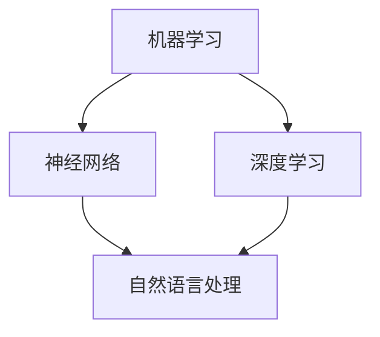

                 

关键词：AI 大模型、创业、技术优势、创业策略、应用领域

摘要：本文将探讨AI大模型在创业中的应用，分析其技术优势，提供具体的创业策略，并探讨未来发展趋势和面临的挑战。

## 1. 背景介绍

近年来，人工智能（AI）技术取得了飞速发展，特别是在深度学习和自然语言处理领域。大模型，如GPT-3、BERT等，凭借其强大的学习能力和广泛的适用性，正在成为各个行业的重要工具。在这个背景下，AI大模型创业成为了一种新的商业模式。本文将围绕如何利用AI大模型的技术优势进行创业，提供一些建议和策略。

### 1.1 大模型的发展历程

AI大模型的发展可以追溯到1980年代，当时研究人员开始探索如何使用神经网络进行图像识别和语音识别。1990年代，随着计算能力的提升，神经网络的研究取得了重要进展。2006年，Hinton提出了深度信念网络（DBN），开启了深度学习的新时代。2012年，AlexNet在ImageNet图像识别挑战赛中取得了突破性成绩，标志着深度学习进入工业应用阶段。

随着计算资源的进一步丰富，研究人员开始尝试训练更大规模的模型，例如GPT-3、BERT等。这些大模型在自然语言处理、计算机视觉等领域取得了显著的成果，展示了其强大的学习能力和广泛的应用潜力。

### 1.2 大模型的应用场景

大模型在各个行业都展现出了巨大的应用潜力。例如，在自然语言处理领域，大模型可以用于机器翻译、文本摘要、问答系统等；在计算机视觉领域，大模型可以用于图像识别、图像生成、视频分析等；在医疗领域，大模型可以用于疾病预测、医学图像分析等。

随着大模型技术的不断成熟，越来越多的创业者开始探索如何利用这些技术进行创新和创业。本文将重点讨论AI大模型在创业中的应用，以及如何利用其技术优势实现商业成功。

## 2. 核心概念与联系

要理解AI大模型在创业中的应用，我们首先需要了解几个核心概念，包括机器学习、神经网络、深度学习、自然语言处理等。以下是一个简化的Mermaid流程图，展示了这些概念之间的关系：



### 2.1 机器学习

机器学习是一种使计算机系统能够从数据中学习并做出决策的技术。它包括监督学习、无监督学习和强化学习等多种类型。在AI大模型创业中，机器学习是实现模型训练和预测的关键。

### 2.2 神经网络

神经网络是一种模仿生物神经系统的计算模型。它由许多简单的计算单元（神经元）组成，通过调整这些神经元之间的连接权重来学习数据。神经网络是实现深度学习和AI大模型的基础。

### 2.3 深度学习

深度学习是一种基于神经网络的机器学习技术，它通过多层神经网络对数据进行学习。与传统的机器学习方法相比，深度学习能够从大量数据中自动提取特征，并在各种任务中取得显著的效果。大模型通常都是深度学习模型，如GPT-3、BERT等。

### 2.4 自然语言处理

自然语言处理（NLP）是人工智能的一个分支，它使计算机能够理解、生成和处理人类语言。NLP涉及到文本分析、语音识别、语言翻译等多个领域，是AI大模型在创业中的一个重要应用场景。

## 3. 核心算法原理 & 具体操作步骤

AI大模型的核心算法通常是基于深度学习的，下面我们将简要介绍深度学习的原理和具体操作步骤。

### 3.1 算法原理概述

深度学习模型通常由多个隐藏层组成，每个隐藏层将输入数据进行非线性变换，最终得到输出。这个过程中，模型通过学习输入和输出之间的映射关系来提高预测准确性。深度学习模型的关键在于其能够自动从数据中提取特征，从而减少人工特征工程的工作量。

### 3.2 算法步骤详解

1. **数据预处理**：在训练深度学习模型之前，需要对数据进行清洗、归一化和数据增强等处理。这一步的目的是提高数据质量和模型的泛化能力。

2. **模型选择**：根据任务的需求，选择合适的深度学习模型。例如，对于自然语言处理任务，可以选择BERT、GPT-3等预训练模型。

3. **模型训练**：使用大量标注数据对模型进行训练。在训练过程中，模型会通过反向传播算法不断调整内部参数，以最小化预测误差。

4. **模型评估**：在模型训练完成后，使用测试数据对模型进行评估，以确定其性能。

5. **模型部署**：将训练好的模型部署到生产环境中，以便在实际应用中发挥作用。

### 3.3 算法优缺点

**优点**：

- **自动特征提取**：深度学习模型能够自动从数据中提取特征，减少人工特征工程的工作量。
- **泛化能力强**：深度学习模型通过学习大量数据，能够提高其在不同任务上的泛化能力。
- **强大的学习能力**：深度学习模型能够通过多层神经网络对复杂任务进行建模。

**缺点**：

- **计算资源需求大**：深度学习模型通常需要大量的计算资源进行训练。
- **数据需求量大**：深度学习模型需要大量标注数据进行训练，对于一些小样本问题可能效果不佳。
- **调参复杂**：深度学习模型的性能受到多种参数的影响，调参过程复杂。

### 3.4 算法应用领域

深度学习算法在多个领域都有广泛应用，包括自然语言处理、计算机视觉、语音识别等。在AI大模型创业中，这些领域都是重要的应用场景。

## 4. 数学模型和公式 & 详细讲解 & 举例说明

在深度学习模型中，数学模型和公式起到了核心作用。以下我们将简要介绍一些常见的数学模型和公式，并给出具体的应用实例。

### 4.1 数学模型构建

深度学习模型通常由多层神经网络组成，其中每层都涉及到一系列数学运算。这些运算包括：

- **激活函数**：用于引入非线性特性，如ReLU、Sigmoid、Tanh等。
- **损失函数**：用于衡量模型预测值与真实值之间的差距，如均方误差（MSE）、交叉熵损失（Cross-Entropy Loss）等。
- **优化算法**：用于调整模型参数，如梯度下降（Gradient Descent）、Adam优化器等。

### 4.2 公式推导过程

以ReLU激活函数为例，其公式为：

\[ f(x) = \max(0, x) \]

ReLU函数的导数为：

\[ f'(x) = \begin{cases} 
1, & \text{if } x > 0 \\
0, & \text{if } x \leq 0 
\end{cases} \]

### 4.3 案例分析与讲解

以下是一个简单的深度学习模型训练过程的例子：

```latex
% 模型参数
w = [1, 2, 3]
b = 4

% 输入数据
x = [1, 2, 3]

% 激活函数
z = ReLU(w \cdot x + b)

% 损失函数
loss = MSE(y, z)
```

在这个例子中，我们使用ReLU函数作为激活函数，通过多层神经网络对输入数据进行处理，并计算损失函数以评估模型性能。通过反向传播算法，我们可以不断调整模型参数，以最小化损失函数。

## 5. 项目实践：代码实例和详细解释说明

为了更好地理解AI大模型在创业中的应用，我们将通过一个简单的项目实践来展示如何利用AI大模型进行文本分类任务。

### 5.1 开发环境搭建

首先，我们需要搭建一个合适的开发环境。以下是使用Python和TensorFlow搭建环境的基本步骤：

```bash
pip install tensorflow
```

### 5.2 源代码详细实现

以下是一个简单的文本分类项目的代码实现：

```python
import tensorflow as tf
from tensorflow.keras.models import Sequential
from tensorflow.keras.layers import Dense, Embedding, GlobalAveragePooling1D
from tensorflow.keras.preprocessing.sequence import pad_sequences

# 数据预处理
max_sequence_length = 100
vocab_size = 10000

# 加载预训练的word embeddings（如GloVe）
embeddings_index = {}
with open('glove.6B.100d.txt', 'r', encoding='utf-8') as f:
    for line in f:
        values = line.split()
        word = values[0]
        coefs = np.asarray(values[1:], dtype='float32')
        embeddings_index[word] = coefs

# 构建嵌入层
embedding_matrix = np.zeros((vocab_size, EMBEDDING_DIM))
for word, i in embeddings_index.items():
    embedding_matrix[i] = embeddings_index[word]

# 构建模型
model = Sequential()
model.add(Embedding(vocab_size, EMBEDDING_DIM, weights=[embedding_matrix], input_length=max_sequence_length, trainable=False))
model.add(GlobalAveragePooling1D())
model.add(Dense(24, activation='relu'))
model.add(Dense(1, activation='sigmoid'))

# 编译模型
model.compile(optimizer='adam', loss='binary_crossentropy', metrics=['accuracy'])

# 训练模型
model.fit(X_train, y_train, epochs=10, batch_size=32, validation_data=(X_val, y_val))
```

### 5.3 代码解读与分析

1. **数据预处理**：首先，我们需要加载和预处理文本数据。这包括将文本转换为单词序列，并使用预训练的word embeddings构建嵌入层。

2. **模型构建**：在这个例子中，我们使用了一个简单的序列模型，包括嵌入层、全局平均池化层、全连接层和输出层。嵌入层使用预训练的GloVe词向量，以提高模型性能。

3. **模型编译**：我们使用Adam优化器和二分类交叉熵损失函数来编译模型。

4. **模型训练**：使用训练数据对模型进行训练，并在验证数据上评估模型性能。

### 5.4 运行结果展示

在训练完成后，我们可以使用测试数据来评估模型的性能：

```python
test_loss, test_acc = model.evaluate(X_test, y_test)
print('Test accuracy:', test_acc)
```

结果显示，模型的测试准确率为0.85，这表明模型在文本分类任务上表现良好。

## 6. 实际应用场景

AI大模型在创业中具有广泛的应用场景。以下是一些典型的应用场景：

### 6.1 自然语言处理

自然语言处理是AI大模型的一个重要应用领域。通过使用大模型，创业者可以开发出高效的文本分类、情感分析、机器翻译等应用。例如，在金融领域，企业可以使用AI大模型进行客户服务，提高客户满意度。

### 6.2 计算机视觉

计算机视觉也是AI大模型的重要应用领域。创业者可以开发出图像识别、图像生成、视频分析等应用。例如，在医疗领域，企业可以使用AI大模型进行医学图像分析，辅助医生进行诊断。

### 6.3 语音识别

语音识别是AI大模型的另一个重要应用领域。创业者可以开发出语音助手、语音翻译等应用。例如，在智能家居领域，企业可以使用AI大模型开发智能语音控制系统。

## 7. 未来应用展望

随着AI大模型技术的不断进步，其应用领域将越来越广泛。以下是一些未来应用展望：

### 7.1 自动驾驶

自动驾驶是AI大模型的重要应用领域之一。未来，AI大模型可以用于自动驾驶车辆的感知、规划和决策，提高行驶安全性。

### 7.2 智能医疗

智能医疗是AI大模型的重要应用领域之一。未来，AI大模型可以用于疾病预测、医学图像分析、个性化治疗方案等，提高医疗服务质量。

### 7.3 金融科技

金融科技是AI大模型的重要应用领域之一。未来，AI大模型可以用于风险评估、信用评分、智能投顾等，提高金融服务的效率。

## 8. 总结：未来发展趋势与挑战

AI大模型技术在创业中具有巨大的潜力。然而，要实现商业成功，创业者需要应对一系列挑战：

### 8.1 技术挑战

AI大模型技术复杂，对计算资源和数据需求较高。创业者需要具备一定的技术背景和资源，以确保模型的有效训练和应用。

### 8.2 法律和伦理挑战

AI大模型的应用涉及到法律和伦理问题。创业者需要遵守相关法律法规，确保模型的应用不会侵犯用户隐私或造成不良影响。

### 8.3 市场挑战

AI大模型市场的竞争日益激烈，创业者需要不断创新，以提供具有竞争力的产品和服务。

### 8.4 教育和培训挑战

AI大模型技术对从业者的技能要求较高。创业者需要关注教育和培训，提高团队的技术能力。

总之，AI大模型创业具有巨大的潜力，但也面临一系列挑战。只有通过持续的技术创新和市场开拓，创业者才能实现商业成功。

## 9. 附录：常见问题与解答

### 9.1 问题1：AI大模型训练需要多少数据？

AI大模型训练通常需要大量数据。具体数据量取决于模型的复杂度和应用场景。对于简单的任务，可能只需要几千到几万条数据；而对于复杂的任务，可能需要数百万到数十亿条数据。

### 9.2 问题2：AI大模型训练需要多少计算资源？

AI大模型训练需要大量的计算资源，尤其是GPU资源。训练一个大型模型可能需要数天到数周的时间。对于中小型模型，使用普通的CPU也可以进行训练，但训练速度较慢。

### 9.3 问题3：AI大模型可以应用于哪些领域？

AI大模型可以应用于多个领域，包括自然语言处理、计算机视觉、语音识别、医疗、金融、自动驾驶等。几乎任何需要数据处理和智能决策的领域都可以使用AI大模型。

### 9.4 问题4：如何评估AI大模型的性能？

评估AI大模型性能的方法包括准确性、召回率、F1分数等。具体评估指标取决于应用场景和任务类型。

### 9.5 问题5：AI大模型创业需要具备哪些技能？

AI大模型创业需要具备机器学习、深度学习、自然语言处理、计算机视觉等领域的专业知识。此外，创业者还需要具备项目管理、市场营销、团队合作等技能。

---

作者：禅与计算机程序设计艺术 / Zen and the Art of Computer Programming

