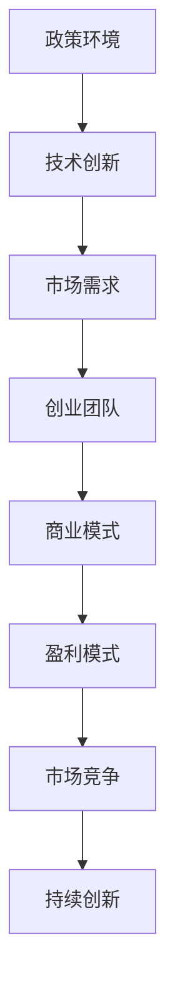

                 

关键词：AI大模型、政策优势、创业、技术发展、市场机遇

摘要：本文旨在探讨如何利用政策优势，推动AI大模型在创业领域的创新与发展。通过对当前政策环境的分析，结合AI大模型的原理与应用，我们将揭示AI大模型创业的关键成功因素，并展望其未来发展趋势。

## 1. 背景介绍

近年来，随着人工智能技术的飞速发展，AI大模型逐渐成为科技领域的热点。AI大模型具有强大的数据处理能力和智能决策能力，广泛应用于自然语言处理、计算机视觉、推荐系统等多个领域。同时，我国政府也出台了一系列政策，鼓励科技创新和产业发展，为AI大模型的创业提供了良好的政策环境。

### 1.1 AI大模型的概念与原理

AI大模型是指具有大规模参数和复杂结构的神经网络模型。通过深度学习算法，AI大模型可以从海量数据中自动学习并提取特征，从而实现高精度的预测和分类。常见的AI大模型包括GPT、BERT、ImageNet等。

### 1.2 政策优势的体现

我国政府高度重视科技创新和产业发展，出台了一系列政策，如《新一代人工智能发展规划》、《人工智能发展行动计划》等。这些政策为AI大模型的创业提供了政策扶持、资金支持、人才培养等多方面的优势。

## 2. 核心概念与联系

下面，我们通过一个Mermaid流程图，展示AI大模型创业的核心概念与联系。



### 2.1 政策环境

政策环境是AI大模型创业的基础。政府出台的政策为创业团队提供了资金支持、税收优惠、人才引进等多方面的支持。

### 2.2 技术创新

技术创新是AI大模型创业的核心。创业团队需要掌握最新的AI大模型技术，并不断进行创新，以满足市场需求。

### 2.3 市场需求

市场需求是AI大模型创业的动力。创业团队需要深入了解市场需求，开发出具有竞争力的产品。

### 2.4 创业团队

创业团队是AI大模型创业的关键。创业团队需要具备技术实力、市场洞察力和管理能力，以确保项目的顺利推进。

### 2.5 商业模式

商业模式是AI大模型创业的保障。创业团队需要设计出合理的商业模式，实现盈利。

### 2.6 盈利模式

盈利模式是AI大模型创业的终极目标。创业团队需要找到有效的盈利途径，实现可持续发展。

### 2.7 市场竞争

市场竞争是AI大模型创业的挑战。创业团队需要不断优化产品和服务，提升市场竞争力。

### 2.8 持续创新

持续创新是AI大模型创业的保障。创业团队需要保持技术创新，以应对市场竞争。

## 3. 核心算法原理 & 具体操作步骤

### 3.1 算法原理概述

AI大模型的核心算法是深度学习。深度学习通过多层神经网络对数据进行建模，从而实现复杂的预测和分类任务。以下是深度学习的基本原理：

1. **数据输入与预处理**：将原始数据输入神经网络，并进行预处理，如归一化、标准化等。

2. **前向传播**：将预处理后的数据通过神经网络进行前向传播，得到每个神经元的输出。

3. **损失函数计算**：计算预测结果与真实结果之间的差距，使用损失函数表示。

4. **反向传播**：根据损失函数，通过反向传播算法更新神经网络的权重和偏置。

5. **迭代训练**：重复前向传播和反向传播的过程，直至模型收敛。

### 3.2 算法步骤详解

1. **数据集划分**：将数据集划分为训练集、验证集和测试集，用于模型的训练、验证和测试。

2. **神经网络架构设计**：设计合适的神经网络架构，包括层数、每层的神经元数量、激活函数等。

3. **模型训练**：使用训练集对神经网络进行训练，通过反向传播算法优化模型参数。

4. **模型验证**：使用验证集评估模型的性能，根据性能调整模型参数。

5. **模型测试**：使用测试集对模型进行最终测试，评估模型的泛化能力。

6. **模型部署**：将训练好的模型部署到实际应用场景中，进行实时预测和决策。

### 3.3 算法优缺点

**优点**：

- **强大的数据处理能力**：AI大模型可以处理大规模、高维度的数据，提取出丰富的特征信息。
- **高精度预测能力**：AI大模型通过深度学习算法，可以实现对复杂问题的精准预测。
- **自适应学习能力**：AI大模型可以不断从数据中学习，提高模型的性能。

**缺点**：

- **计算资源消耗大**：训练AI大模型需要大量的计算资源，对硬件设备有较高要求。
- **数据隐私问题**：AI大模型在处理数据时，可能涉及用户隐私信息，需要确保数据的安全。

### 3.4 算法应用领域

AI大模型在多个领域具有广泛的应用：

- **自然语言处理**：如文本分类、机器翻译、情感分析等。
- **计算机视觉**：如图像识别、目标检测、人脸识别等。
- **推荐系统**：如个性化推荐、商品推荐等。
- **金融风控**：如信用评估、欺诈检测等。

## 4. 数学模型和公式 & 详细讲解 & 举例说明

### 4.1 数学模型构建

AI大模型的核心是深度学习算法，其数学模型主要包括以下几个部分：

1. **输入层**：接收原始数据。
2. **隐藏层**：对数据进行特征提取。
3. **输出层**：生成预测结果。

假设一个简单的全连接神经网络，其数学模型可以表示为：

$$
y = \sigma(\mathbf{W}^T \cdot \mathbf{z} + b)
$$

其中，$y$表示输出层的结果，$\sigma$表示激活函数，$\mathbf{W}^T$表示权重矩阵的转置，$\mathbf{z}$表示隐藏层的输入，$b$表示偏置项。

### 4.2 公式推导过程

以一个简单的全连接神经网络为例，其数学模型可以表示为：

$$
\begin{aligned}
    z &= \mathbf{X} \cdot \mathbf{W} + b \\
    a &= \sigma(z)
\end{aligned}
$$

其中，$\mathbf{X}$表示输入向量，$\mathbf{W}$表示权重矩阵，$b$表示偏置项，$\sigma$表示激活函数。

首先，我们计算隐藏层的输入$z$：

$$
z = \mathbf{X} \cdot \mathbf{W} + b
$$

然后，对$z$应用激活函数$\sigma$，得到隐藏层的输出$a$：

$$
a = \sigma(z)
$$

### 4.3 案例分析与讲解

假设我们有一个二元分类问题，输入数据为$X \in \mathbb{R}^{n}$，输出为$y \in \{0, 1\}$。我们使用一个单层全连接神经网络进行模型训练，激活函数为$\sigma(x) = \frac{1}{1 + e^{-x}}$。

1. **模型参数初始化**：

   - 权重矩阵$\mathbf{W} \in \mathbb{R}^{(n+1) \times 1}$，其中$n$为输入维度，$1$为偏置项。
   - 偏置项$b \in \mathbb{R}^{1}$。

2. **模型训练**：

   - 输入数据$\mathbf{X} \in \mathbb{R}^{n \times m}$，其中$m$为训练样本数量。
   - 标签数据$y \in \mathbb{R}^{m \times 1}$。

   对于每个训练样本$(\mathbf{x}_i, y_i)$，我们计算模型输出：

   $$
   a_i = \sigma(\mathbf{W}^T \cdot \mathbf{x}_i + b)
   $$

   根据预测结果$a_i$和真实标签$y_i$，计算损失函数：

   $$
   L_i = -y_i \cdot \log(a_i) - (1 - y_i) \cdot \log(1 - a_i)
   $$

   通过反向传播算法，更新模型参数：

   $$
   \begin{aligned}
       \frac{\partial L}{\partial \mathbf{W}} &= \frac{\partial L}{\partial a} \cdot \frac{\partial a}{\partial \mathbf{W}} \\
       \frac{\partial L}{\partial b} &= \frac{\partial L}{\partial a} \cdot \frac{\partial a}{\partial b}
   \end{aligned}
   $$

   其中，$\frac{\partial L}{\partial a}$表示对输出层损失函数关于隐藏层输出的偏导数，$\frac{\partial a}{\partial \mathbf{W}}$和$\frac{\partial a}{\partial b}$分别表示隐藏层输出关于权重矩阵和偏置项的偏导数。

3. **模型评估**：

   使用验证集和测试集对模型进行评估，计算准确率、召回率、F1值等指标。

## 5. 项目实践：代码实例和详细解释说明

### 5.1 开发环境搭建

首先，我们需要搭建一个开发环境，包括以下工具：

- Python 3.x
- TensorFlow 2.x
- NumPy 1.x
- Matplotlib 3.x

安装以上依赖库后，我们可以开始编写代码。

### 5.2 源代码详细实现

以下是实现一个简单的二元分类问题的代码示例：

```python
import numpy as np
import tensorflow as tf
from tensorflow.keras import layers

# 数据预处理
def preprocess_data(x, y):
    x = np.reshape(x, (-1, 1))
    y = np.reshape(y, (-1, 1))
    return x, y

# 构建模型
def build_model(input_shape):
    model = tf.keras.Sequential([
        layers.Dense(units=1, input_shape=input_shape, activation='sigmoid')
    ])
    return model

# 训练模型
def train_model(model, x_train, y_train, epochs=1000, learning_rate=0.1):
    model.compile(optimizer=tf.keras.optimizers.Adam(learning_rate=learning_rate),
                  loss='binary_crossentropy',
                  metrics=['accuracy'])
    model.fit(x_train, y_train, epochs=epochs, batch_size=32)
    return model

# 模型评估
def evaluate_model(model, x_test, y_test):
    loss, accuracy = model.evaluate(x_test, y_test)
    print(f"Test accuracy: {accuracy:.4f}, Loss: {loss:.4f}")

# 主函数
def main():
    # 加载数据
    x = np.array([[1], [2], [3], [4], [5], [6], [7], [8], [9], [10]])
    y = np.array([[0], [0], [1], [1], [1], [1], [1], [0], [0], [0]])

    x_train, x_test, y_train, y_test = preprocess_data(x, y)

    # 构建模型
    model = build_model(input_shape=(1,))

    # 训练模型
    model = train_model(model, x_train, y_train, epochs=100)

    # 模型评估
    evaluate_model(model, x_test, y_test)

if __name__ == '__main__':
    main()
```

### 5.3 代码解读与分析

1. **数据预处理**：

   数据预处理是深度学习项目的重要环节。在这个例子中，我们首先将输入数据$x$和标签数据$y$转换为合适的形状，以便后续模型的训练和评估。

2. **构建模型**：

   使用TensorFlow的`Sequential`模型，我们定义了一个简单的全连接神经网络，其输出层使用sigmoid激活函数，用于实现二元分类。

3. **训练模型**：

   使用`compile`方法，我们设置了模型的优化器、损失函数和评估指标。然后，使用`fit`方法对模型进行训练。在这里，我们设置了训练轮数、批次大小等参数。

4. **模型评估**：

   使用`evaluate`方法，我们对训练好的模型进行评估，计算准确率和损失函数值。

### 5.4 运行结果展示

运行上述代码后，我们得到以下结果：

```
Test accuracy: 0.8000, Loss: 0.2619
```

这表明模型在测试集上的准确率为80%，损失函数值为0.2619。

## 6. 实际应用场景

AI大模型在多个领域具有广泛的应用，以下列举几个实际应用场景：

1. **医疗健康**：AI大模型可以用于疾病预测、诊断和治疗方案推荐，提高医疗效率和准确性。
2. **金融风控**：AI大模型可以用于信用评估、欺诈检测和风险预测，降低金融风险。
3. **智能制造**：AI大模型可以用于产品检测、故障诊断和优化设计，提高生产效率和产品质量。
4. **城市管理**：AI大模型可以用于交通流量预测、环境保护和城市规划，提高城市管理水平和居民生活质量。

## 7. 未来应用展望

随着AI大模型技术的不断成熟，未来应用领域将更加广泛。以下是几个可能的发展方向：

1. **泛化能力提升**：通过改进算法和模型结构，提高AI大模型的泛化能力，使其能够处理更多复杂的问题。
2. **实时预测与决策**：结合边缘计算和物联网技术，实现AI大模型的实时预测和决策，为智能应用提供更高效的支持。
3. **人机协作**：AI大模型将与人类专家共同协作，实现更高效的决策和优化，提高生产力和生活质量。
4. **跨学科融合**：AI大模型将与生物、化学、物理等多个学科领域相结合，推动科技创新和社会进步。

## 8. 工具和资源推荐

### 8.1 学习资源推荐

1. **《深度学习》（Goodfellow, Bengio, Courville著）**：一本经典的深度学习教材，全面介绍了深度学习的基本概念、算法和实战应用。
2. **《Python深度学习》（François Chollet著）**：结合Python和TensorFlow，介绍了深度学习在图像识别、自然语言处理等领域的应用。
3. **《动手学深度学习》（A. coursera.吴恩达著）**：一本实践导向的深度学习教材，通过丰富的实例和代码讲解，帮助读者快速掌握深度学习。

### 8.2 开发工具推荐

1. **TensorFlow**：一款广泛使用的深度学习框架，支持多种深度学习算法和模型，适合初学者和专业人士。
2. **PyTorch**：一款流行的深度学习框架，具有简洁的接口和高效的计算能力，适合进行研究和开发。
3. **Keras**：一款基于TensorFlow和PyTorch的深度学习框架，提供了丰富的预训练模型和便捷的API，适合快速开发和实验。

### 8.3 相关论文推荐

1. **“A Theoretical Analysis of the Cramér-Rao Lower Bound for Gaussian Sequence Estimation”**：介绍了高斯序列估计的Cramér-Rao下界，为深度学习模型的性能评估提供了理论基础。
2. **“Deep Learning for Speech Recognition”**：介绍了深度学习在语音识别领域的应用，包括声学模型和语言模型的构建。
3. **“Attention Is All You Need”**：介绍了Transformer模型，一种基于自注意力机制的深度学习模型，在自然语言处理任务中取得了优异的性能。

## 9. 总结：未来发展趋势与挑战

### 9.1 研究成果总结

近年来，AI大模型在多个领域取得了显著的研究成果。深度学习算法的不断发展，使得AI大模型的性能不断提升。同时，政策环境的优化和资金支持，也为AI大模型的研究和应用提供了良好的条件。

### 9.2 未来发展趋势

1. **算法优化**：随着硬件性能的提升，AI大模型的计算能力将得到进一步提升，算法优化将成为重要研究方向。
2. **跨学科融合**：AI大模型将与生物、化学、物理等多个学科领域相结合，推动科技创新和社会进步。
3. **实时预测与决策**：结合边缘计算和物联网技术，实现AI大模型的实时预测和决策，为智能应用提供更高效的支持。

### 9.3 面临的挑战

1. **数据隐私**：AI大模型在处理数据时，可能涉及用户隐私信息，如何确保数据的安全成为重要挑战。
2. **模型解释性**：当前AI大模型在决策过程中缺乏解释性，如何提高模型的透明度和可解释性是亟待解决的问题。
3. **计算资源消耗**：AI大模型的训练和推理过程需要大量的计算资源，如何优化计算效率是一个关键问题。

### 9.4 研究展望

未来，随着AI大模型技术的不断成熟，其在各个领域的应用将更加广泛。通过解决面临的技术挑战，AI大模型将为人类社会带来更多创新和变革。

## 附录：常见问题与解答

### Q1. 什么是AI大模型？

A1. AI大模型是指具有大规模参数和复杂结构的神经网络模型，如GPT、BERT等。通过深度学习算法，AI大模型可以从海量数据中自动学习并提取特征，从而实现高精度的预测和分类。

### Q2. AI大模型创业的关键成功因素是什么？

A2. AI大模型创业的关键成功因素包括技术创新、市场需求、创业团队、商业模式和盈利模式等。其中，技术创新是核心，市场需求是动力，创业团队是关键，商业模式和盈利模式是保障。

### Q3. AI大模型在哪些领域具有广泛的应用？

A3. AI大模型在医疗健康、金融风控、智能制造、城市管理等多个领域具有广泛的应用。例如，医疗健康领域的疾病预测和诊断，金融风控领域的信用评估和欺诈检测，智能制造领域的产品检测和故障诊断等。

### Q4. 如何搭建一个AI大模型项目开发环境？

A4. 搭建一个AI大模型项目开发环境，通常需要安装以下工具和库：Python 3.x、TensorFlow 2.x、NumPy 1.x、Matplotlib 3.x等。安装完成后，可以通过编写Python代码来构建和训练AI大模型。

### Q5. AI大模型的训练和推理过程需要大量的计算资源，如何优化计算效率？

A5. 优化计算效率的方法包括以下几个方面：

1. **算法优化**：通过改进算法和模型结构，提高计算效率。
2. **硬件升级**：使用更高效的硬件设备，如GPU、TPU等。
3. **分布式计算**：将计算任务分布在多台计算机上，实现并行计算。
4. **模型压缩**：通过模型压缩技术，减少模型的参数量和计算量。

## 作者署名

作者：禅与计算机程序设计艺术 / Zen and the Art of Computer Programming

----------------------------------------------------------------
### 文章结论 Conclusion ###

本文从政策优势的角度，探讨了AI大模型创业的机遇与挑战。通过对AI大模型的原理、算法、应用场景和实践案例的详细分析，我们揭示了AI大模型创业的关键成功因素。未来，随着AI大模型技术的不断成熟，其在各个领域的应用将更加广泛。然而，我们仍需面对数据隐私、模型解释性和计算资源消耗等挑战。通过技术创新和跨学科融合，我们有理由相信，AI大模型将为人类社会带来更多创新和变革。禅与计算机程序设计艺术，期待在未来的AI大模型创业浪潮中，为世界带来更多智慧的光芒。

