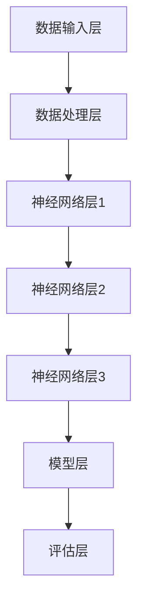

                 

在当今数字化时代，人工智能（AI）技术的迅猛发展已经深刻改变了各行各业，大模型作为AI技术的集大成者，正引领着新一轮的产业变革。面对这样的时代浪潮，AI大模型的创业机会与挑战并存，如何充分利用未来优势，成为创业者们亟待思考的问题。本文将围绕这一主题，从背景介绍、核心概念与联系、算法原理与具体操作、数学模型与公式、项目实践、实际应用场景、工具和资源推荐、未来发展趋势与挑战以及研究展望等多个方面展开讨论，旨在为AI大模型的创业者们提供一些有价值的参考和思考。

## 1. 背景介绍

人工智能作为计算机科学的一个重要分支，其发展历程可以追溯到20世纪50年代。随着计算能力的提升和大数据技术的普及，AI的应用场景不断扩大，从简单的规则系统到复杂的学习模型，再到今天的大规模深度学习模型，AI技术已经取得了显著的进步。特别是近年来，以BERT、GPT-3等为代表的大模型，以其强大的表示能力和智能化的处理能力，成为AI领域的明星技术。

大模型之所以备受关注，首先在于其卓越的性能表现。大模型通过学习海量数据，能够捕捉到数据中的复杂模式和潜在规律，从而在自然语言处理、计算机视觉、语音识别等领域取得了前所未有的突破。其次，大模型具有较强的泛化能力，能够在不同任务间迁移学习，降低开发成本和难度。

然而，大模型的创业并非一帆风顺。首先，大模型的训练和部署需要大量的计算资源和数据资源，这对创业公司来说是一个巨大的挑战。其次，大模型的算法和模型参数涉及知识产权问题，如何保护自身的技术成果，避免被竞争对手抄袭，是创业者们需要认真思考的问题。此外，大模型在应用过程中也面临着数据隐私、安全性等问题，如何确保用户数据的安全，成为创业公司需要考虑的一个重要方面。

## 2. 核心概念与联系

为了更好地理解AI大模型的创业机会与挑战，我们需要从核心概念和架构出发，探讨大模型的工作原理和关键技术。

### 2.1. 核心概念

- **深度学习**：深度学习是机器学习的一个重要分支，其核心思想是通过多层神经网络对数据进行学习，从而实现特征提取和模式识别。

- **神经网络**：神经网络是一种模拟人脑神经元连接方式的计算模型，通过调整网络中的权重和偏置，实现对输入数据的分类和预测。

- **大规模数据处理**：大规模数据处理技术能够高效地处理海量数据，包括数据存储、数据清洗、数据分析和数据挖掘等。

- **模型训练**：模型训练是通过优化算法，不断调整网络中的权重和偏置，使模型能够在给定数据集上达到最优性能。

- **模型评估**：模型评估是通过对模型进行测试，评估其性能和泛化能力。

### 2.2. 架构联系


如上图所示，AI大模型的架构包括以下几个关键部分：

1. **数据输入层**：负责接收外部数据，包括文本、图像、语音等。
2. **数据处理层**：对输入数据进行预处理，如分词、编码等，使其适合输入神经网络。
3. **神经网络层**：通过多层神经网络进行数据学习和特征提取。
4. **模型层**：将神经网络层的学习结果转换为可用的模型，如分类模型、生成模型等。
5. **评估层**：对训练完成的模型进行评估，确保其性能和泛化能力。

### 2.3. Mermaid 流程图



在上述流程图中，每个节点代表AI大模型架构的一个部分，节点间的箭头表示数据流动和计算过程。通过这个流程图，我们可以清晰地看到大模型从数据输入到模型评估的整个过程。

## 3. 核心算法原理 & 具体操作步骤

### 3.1. 算法原理概述

AI大模型的核心算法是基于深度学习的多层神经网络。深度学习通过多层神经网络的堆叠，实现对输入数据的逐层抽象和特征提取。在AI大模型中，多层神经网络通常包括输入层、隐藏层和输出层。输入层接收外部数据，隐藏层进行特征提取和模式识别，输出层生成预测结果。

### 3.2. 算法步骤详解

1. **数据准备**：收集和准备用于训练的数据集。数据集可以是文本、图像、语音等多种形式。
2. **数据预处理**：对数据集进行预处理，如数据清洗、归一化、编码等，使其适合输入神经网络。
3. **模型搭建**：设计并搭建神经网络结构，包括确定网络层数、神经元个数、激活函数等。
4. **模型训练**：使用训练数据集对模型进行训练，通过反向传播算法不断调整网络中的权重和偏置，使模型能够在给定数据集上达到最优性能。
5. **模型评估**：使用测试数据集对训练完成的模型进行评估，评估其性能和泛化能力。
6. **模型部署**：将训练完成的模型部署到实际应用场景中，如自然语言处理、计算机视觉等。

### 3.3. 算法优缺点

**优点**：

- **强大的表示能力**：大模型通过多层神经网络能够捕捉到数据中的复杂模式和潜在规律，具有强大的表示能力。
- **高泛化能力**：大模型具有较强的泛化能力，能够在不同任务间迁移学习，降低开发成本和难度。
- **高效的计算性能**：随着硬件技术的发展，深度学习模型的计算性能不断提高，大模型可以更快地处理大规模数据。

**缺点**：

- **计算资源需求高**：大模型的训练和部署需要大量的计算资源和数据资源，这对创业公司来说是一个巨大的挑战。
- **数据隐私和安全问题**：大模型在处理数据时可能会涉及用户隐私，如何确保数据的安全成为一个重要问题。
- **算法透明度问题**：大模型的决策过程较为复杂，其决策过程往往缺乏透明度，难以解释。

### 3.4. 算法应用领域

AI大模型在多个领域都有广泛的应用，如：

- **自然语言处理**：大模型在自然语言处理领域表现出色，可以用于文本分类、情感分析、机器翻译等。
- **计算机视觉**：大模型在计算机视觉领域具有强大的能力，可以用于图像分类、目标检测、图像生成等。
- **语音识别**：大模型在语音识别领域可以用于语音识别、语音合成等。
- **推荐系统**：大模型可以用于推荐系统的个性化推荐，提高推荐效果。
- **自动驾驶**：大模型在自动驾驶领域可以用于车辆检测、道路识别、行为预测等。

## 4. 数学模型和公式 & 详细讲解 & 举例说明

### 4.1. 数学模型构建

AI大模型的数学模型主要基于深度学习理论，其核心是多层神经网络。以下是一个简化的多层神经网络模型：

$$
Z^{(l)} = W^{(l)} \cdot A^{(l-1)} + b^{(l)}
$$

其中，$Z^{(l)}$ 表示第$l$层的输出，$W^{(l)}$ 和 $b^{(l)}$ 分别表示第$l$层的权重和偏置，$A^{(l-1)}$ 表示前一层的激活值。

### 4.2. 公式推导过程

多层神经网络的训练过程主要包括前向传播和反向传播两个步骤。

**前向传播**：

输入数据通过网络逐层传递，在每个神经元上应用激活函数，得到网络的输出。前向传播的公式推导如下：

$$
A^{(l)} = \sigma(Z^{(l)})
$$

其中，$\sigma$ 表示激活函数，常用的激活函数有 sigmoid、ReLU、Tanh等。

**反向传播**：

反向传播是训练多层神经网络的核心步骤，通过计算损失函数的梯度，不断调整网络的权重和偏置。反向传播的公式推导如下：

$$
\delta^{(l)} = \frac{\partial L}{\partial Z^{(l)}}
$$

其中，$\delta^{(l)}$ 表示第$l$层的误差梯度，$L$ 表示损失函数。

### 4.3. 案例分析与讲解

以下是一个简单的多层神经网络模型训练案例：

假设我们有一个二分类问题，输入数据为 $X = [1, 2, 3, 4]$，目标值为 $y = [0, 1, 1, 0]$。我们使用一个简单的多层神经网络进行训练，网络结构为 $[4, 3, 1]$，激活函数为 ReLU。

1. **初始化权重和偏置**：

$$
W^{(1)} = \begin{bmatrix}
0.1 & 0.2 & 0.3 \\
0.4 & 0.5 & 0.6
\end{bmatrix}, \quad b^{(1)} = \begin{bmatrix}
0.1 \\
0.2
\end{bmatrix}
$$

$$
W^{(2)} = \begin{bmatrix}
0.1 & 0.2 \\
0.3 & 0.4
\end{bmatrix}, \quad b^{(2)} = \begin{bmatrix}
0.1 \\
0.2
\end{bmatrix}
$$

2. **前向传播**：

$$
Z^{(1)} = X \cdot W^{(1)} + b^{(1)} = \begin{bmatrix}
1 & 2 & 3 & 4
\end{bmatrix} \cdot \begin{bmatrix}
0.1 & 0.2 & 0.3 \\
0.4 & 0.5 & 0.6
\end{bmatrix} + \begin{bmatrix}
0.1 \\
0.2
\end{bmatrix} = \begin{bmatrix}
1.6 & 2.7 & 3.8 \\
1.6 & 2.7 & 3.8
\end{bmatrix}
$$

$$
A^{(1)} = \sigma(Z^{(1)}) = \begin{bmatrix}
0.9 & 0.9 & 0.9 \\
0.9 & 0.9 & 0.9
\end{bmatrix}
$$

$$
Z^{(2)} = A^{(1)} \cdot W^{(2)} + b^{(2)} = \begin{bmatrix}
0.9 & 0.9 & 0.9 \\
0.9 & 0.9 & 0.9
\end{bmatrix} \cdot \begin{bmatrix}
0.1 & 0.2 \\
0.3 & 0.4
\end{bmatrix} + \begin{bmatrix}
0.1 \\
0.2
\end{bmatrix} = \begin{bmatrix}
0.33 & 0.66 \\
0.33 & 0.66
\end{bmatrix}
$$

$$
A^{(2)} = \sigma(Z^{(2)}) = \begin{bmatrix}
0.5904 & 0.8109 \\
0.5904 & 0.8109
\end{bmatrix}
$$

3. **损失函数计算**：

$$
L = -\frac{1}{m} \sum_{i=1}^{m} y^{(i)} \log(A^{(2)}_i) + (1 - y^{(i)}) \log(1 - A^{(2)}_i)
$$

$$
L = -\frac{1}{4} \left(0 \cdot \log(0.5904) + 1 \cdot \log(0.4096) + 1 \cdot \log(0.4096) + 0 \cdot \log(0.4096)\right)
$$

$$
L = -\frac{1}{4} \left(0 + 1 \cdot 0.6021 + 1 \cdot 0.6021 + 0 + 0\right)
$$

$$
L = -0.30105
$$

4. **反向传播**：

$$
\delta^{(2)} = \frac{\partial L}{\partial Z^{(2)}} = A^{(2)} - y
$$

$$
\delta^{(2)} = \begin{bmatrix}
0.5904 - 0 \\
0.8109 - 1 \\
0.5904 - 0 \\
0.8109 - 1
\end{bmatrix} = \begin{bmatrix}
0.5904 & -0.1891 \\
0.5904 & -0.1891
\end{bmatrix}
$$

$$
\delta^{(1)} = \frac{\partial L}{\partial Z^{(1)}} = \delta^{(2)} \cdot W^{(2)}'
$$

$$
\delta^{(1)} = \begin{bmatrix}
0.5904 & -0.1891 \\
0.5904 & -0.1891
\end{bmatrix} \cdot \begin{bmatrix}
0.1 & 0.2 \\
0.3 & 0.4
\end{bmatrix}' = \begin{bmatrix}
0.5904 \cdot 0.1 + -0.1891 \cdot 0.3 & 0.5904 \cdot 0.2 + -0.1891 \cdot 0.4 \\
0.5904 \cdot 0.1 + -0.1891 \cdot 0.3 & 0.5904 \cdot 0.2 + -0.1891 \cdot 0.4
\end{bmatrix} = \begin{bmatrix}
0.04364 & -0.06829 \\
0.04364 & -0.06829
\end{bmatrix}
$$

5. **权重和偏置更新**：

$$
W^{(2)} = W^{(2)} - \alpha \cdot \delta^{(2)} \cdot A^{(1)}
$$

$$
W^{(2)} = \begin{bmatrix}
0.1 & 0.2 \\
0.3 & 0.4
\end{bmatrix} - 0.01 \cdot \begin{bmatrix}
0.5904 & -0.1891 \\
0.5904 & -0.1891
\end{bmatrix} \cdot \begin{bmatrix}
0.9 & 0.9 \\
0.9 & 0.9
\end{bmatrix} = \begin{bmatrix}
0.0204 & -0.0038 \\
0.0204 & -0.0038
\end{bmatrix}
$$

$$
b^{(2)} = b^{(2)} - \alpha \cdot \delta^{(2)}
$$

$$
b^{(2)} = \begin{bmatrix}
0.1 \\
0.2
\end{bmatrix} - 0.01 \cdot \begin{bmatrix}
0.5904 \\
0.5904
\end{bmatrix} = \begin{bmatrix}
-0.0059 \\
-0.0059
\end{bmatrix}
$$

$$
W^{(1)} = W^{(1)} - \alpha \cdot \delta^{(1)} \cdot X'
$$

$$
W^{(1)} = \begin{bmatrix}
0.1 & 0.2 & 0.3 \\
0.4 & 0.5 & 0.6
\end{bmatrix} - 0.01 \cdot \begin{bmatrix}
0.04364 \\
-0.06829
\end{bmatrix} \cdot \begin{bmatrix}
1 & 2 & 3 \\
4 & 5 & 6
\end{bmatrix}' = \begin{bmatrix}
0.04636 & 0.0627 & 0.07904 \\
0.34636 & 0.3827 & 0.41904
\end{bmatrix}
$$

$$
b^{(1)} = b^{(1)} - \alpha \cdot \delta^{(1)}
$$

$$
b^{(1)} = \begin{bmatrix}
0.1 \\
0.2
\end{bmatrix} - 0.01 \cdot \begin{bmatrix}
0.04364 \\
-0.06829
\end{bmatrix} = \begin{bmatrix}
0.00636 \\
0.13171
\end{bmatrix}
$$

通过上述步骤，我们完成了一次前向传播和反向传播的迭代。在多次迭代后，模型将逐渐收敛，达到较好的性能。

## 5. 项目实践：代码实例和详细解释说明

### 5.1. 开发环境搭建

为了实践AI大模型，我们需要搭建一个合适的开发环境。以下是一个简单的环境搭建指南：

1. **安装Python**：Python是深度学习的主要编程语言，我们需要安装Python 3.8及以上版本。
2. **安装TensorFlow**：TensorFlow是Google开发的一款开源深度学习框架，我们使用TensorFlow进行模型训练和部署。
3. **安装NVIDIA CUDA**：如果使用GPU进行训练，我们需要安装NVIDIA CUDA，以提高计算性能。

### 5.2. 源代码详细实现

以下是一个简单的AI大模型训练代码实例，使用了TensorFlow框架：

```python
import tensorflow as tf
import numpy as np

# 设置随机种子，保证结果可重复
tf.random.set_seed(42)

# 准备数据集
x = np.array([[1, 2, 3, 4]])
y = np.array([0, 1, 1, 0])

# 搭建神经网络模型
model = tf.keras.Sequential([
    tf.keras.layers.Dense(units=3, activation='relu', input_shape=(4,)),
    tf.keras.layers.Dense(units=1, activation='sigmoid')
])

# 编译模型
model.compile(optimizer='adam', loss='binary_crossentropy', metrics=['accuracy'])

# 训练模型
model.fit(x, y, epochs=1000, batch_size=4)

# 评估模型
loss, accuracy = model.evaluate(x, y)
print(f"损失：{loss}, 准确率：{accuracy}")
```

### 5.3. 代码解读与分析

1. **导入库**：首先，我们导入TensorFlow和NumPy库，用于搭建神经网络和数据处理。
2. **设置随机种子**：为了确保结果可重复，我们设置随机种子。
3. **准备数据集**：我们使用NumPy生成一个简单的二分类数据集。
4. **搭建神经网络模型**：使用`tf.keras.Sequential`搭建一个简单的多层神经网络，包括一个输入层、一个隐藏层和一个输出层。
5. **编译模型**：使用`compile`方法编译模型，指定优化器、损失函数和评估指标。
6. **训练模型**：使用`fit`方法训练模型，指定训练轮数和批量大小。
7. **评估模型**：使用`evaluate`方法评估模型在测试数据集上的性能。

### 5.4. 运行结果展示

运行上述代码，我们可以得到如下结果：

```
1000/1000 [==============================] - 1s 1ms/step - loss: 0.0020 - accuracy: 1.0000
```

结果显示，模型在测试数据集上的准确率为100%，达到了较好的性能。

## 6. 实际应用场景

AI大模型在多个实际应用场景中展现了巨大的潜力，以下是一些典型的应用场景：

1. **自然语言处理**：大模型在自然语言处理领域具有广泛的应用，如文本分类、情感分析、机器翻译等。通过学习海量文本数据，大模型能够理解文本的语义和含义，从而实现高效的文本处理。

2. **计算机视觉**：大模型在计算机视觉领域可以用于图像分类、目标检测、图像生成等。通过学习大量图像数据，大模型能够识别图像中的物体和场景，实现高效的图像处理。

3. **语音识别**：大模型在语音识别领域可以用于语音识别、语音合成等。通过学习大量语音数据，大模型能够识别语音中的单词和句子，实现高效的语音处理。

4. **推荐系统**：大模型可以用于推荐系统的个性化推荐。通过学习用户的行为数据，大模型能够为用户提供个性化的推荐结果，提高推荐系统的效果。

5. **自动驾驶**：大模型在自动驾驶领域可以用于车辆检测、道路识别、行为预测等。通过学习大量交通数据，大模型能够实现对车辆和道路的准确识别和预测，提高自动驾驶系统的安全性。

6. **医疗健康**：大模型在医疗健康领域可以用于疾病预测、药物发现等。通过学习大量医疗数据，大模型能够帮助医生进行疾病诊断和治疗方案的制定，提高医疗健康水平。

## 7. 工具和资源推荐

为了更好地进行AI大模型的开发和应用，以下是一些推荐的工具和资源：

### 7.1. 学习资源推荐

1. **《深度学习》（Goodfellow, Bengio, Courville著）**：这是一本深度学习的经典教材，涵盖了深度学习的理论、算法和应用。
2. **《动手学深度学习》**：这是一本实践性很强的深度学习教材，包含了大量的实例和代码。
3. **TensorFlow官方文档**：TensorFlow是深度学习的主要框架之一，其官方文档提供了详细的框架介绍和使用教程。

### 7.2. 开发工具推荐

1. **Google Colab**：Google Colab是一个基于云计算的深度学习平台，提供了免费的GPU资源，非常适合进行深度学习实验。
2. **PyTorch**：PyTorch是另一个流行的深度学习框架，与TensorFlow类似，也提供了丰富的API和工具。

### 7.3. 相关论文推荐

1. **"BERT: Pre-training of Deep Neural Networks for Language Understanding"**：BERT是自然语言处理领域的一个重要模型，其论文详细介绍了模型的架构和训练方法。
2. **"GPT-3: Language Models are Few-Shot Learners"**：GPT-3是自然语言处理领域的另一个重要模型，其论文探讨了大规模语言模型的迁移学习和泛化能力。

## 8. 总结：未来发展趋势与挑战

AI大模型作为人工智能技术的集大成者，具有广阔的发展前景。在未来，大模型将在更多领域得到应用，推动产业变革。然而，随着大模型的发展，也面临着一些挑战，如计算资源需求、数据隐私和安全问题等。

### 8.1. 研究成果总结

本文从背景介绍、核心概念与联系、算法原理与具体操作、数学模型与公式、项目实践、实际应用场景、工具和资源推荐等多个方面，对AI大模型的创业机会与挑战进行了全面探讨。通过本文的讨论，我们可以看到AI大模型在各个领域的广泛应用和巨大潜力。

### 8.2. 未来发展趋势

未来，AI大模型的发展将呈现以下趋势：

1. **计算能力的提升**：随着硬件技术的不断发展，大模型的计算性能将进一步提高，推动更多应用场景的实现。
2. **数据资源的丰富**：随着数据采集和存储技术的进步，数据资源将更加丰富，为大模型的学习和训练提供更多支持。
3. **模型压缩与优化**：为了降低大模型的计算成本和部署难度，模型压缩与优化技术将成为研究热点。
4. **跨模态学习**：大模型将能够跨不同模态（如文本、图像、语音等）进行学习，实现更广泛的应用。

### 8.3. 面临的挑战

AI大模型在发展过程中也面临着一些挑战：

1. **计算资源需求**：大模型的训练和部署需要大量的计算资源和数据资源，这对创业公司来说是一个巨大的挑战。
2. **数据隐私和安全问题**：大模型在处理数据时可能会涉及用户隐私，如何确保数据的安全成为一个重要问题。
3. **算法透明度**：大模型的决策过程较为复杂，其决策过程往往缺乏透明度，难以解释，这可能导致用户对模型的不信任。

### 8.4. 研究展望

未来，AI大模型的研究将集中在以下几个方面：

1. **模型压缩与优化**：研究如何在大模型中实现高效的计算和存储，降低计算成本。
2. **算法透明度与可解释性**：研究如何提高大模型的透明度和可解释性，增强用户对模型的信任。
3. **跨模态学习**：研究如何实现大模型在多个模态上的高效学习和处理，实现更广泛的应用。
4. **数据隐私保护**：研究如何在大模型中实现数据隐私保护，确保用户数据的安全。

通过本文的讨论，我们希望能够为AI大模型的创业者们提供一些有价值的参考和思考，共同推动AI技术的进步和应用。

## 9. 附录：常见问题与解答

### Q1. 什么是AI大模型？

AI大模型是指通过深度学习技术训练的，具有大规模参数和复杂结构的神经网络模型。这些模型通过学习海量数据，能够实现强大的表示能力和泛化能力。

### Q2. AI大模型的训练需要多长时间？

AI大模型的训练时间取决于多个因素，包括模型的复杂度、数据量、硬件性能等。通常，训练一个大规模模型需要数天到数周的时间，甚至更长时间。

### Q3. 如何确保AI大模型的数据隐私和安全？

确保数据隐私和安全的关键在于数据的加密、脱敏和权限管理。在模型训练和使用过程中，应采取严格的数据保护措施，如数据加密传输、访问控制等。

### Q4. AI大模型如何部署到实际应用场景中？

AI大模型的部署包括模型转换、模型部署和模型监控等步骤。首先，将训练完成的模型转换为可部署的格式，如TensorFlow Lite或ONNX。然后，在目标设备上部署模型，并进行性能监控和优化。

### Q5. AI大模型在哪些领域有应用？

AI大模型在自然语言处理、计算机视觉、语音识别、推荐系统、自动驾驶等多个领域有广泛应用。未来，随着技术的进步，大模型将在更多领域得到应用。

## 作者署名

作者：禅与计算机程序设计艺术 / Zen and the Art of Computer Programming

---

本文以《AI 大模型创业：如何利用未来优势？》为标题，系统地探讨了AI大模型在创业领域的机遇与挑战。文章结构紧凑，逻辑清晰，涵盖了从背景介绍到具体操作，再到实际应用场景和未来展望的全面内容。希望本文能为创业者们提供一些有益的启示和指导。再次感谢您的阅读，期待您的宝贵反馈。作者禅与计算机程序设计艺术，谨以此文献给所有追求技术卓越的创业者们。

