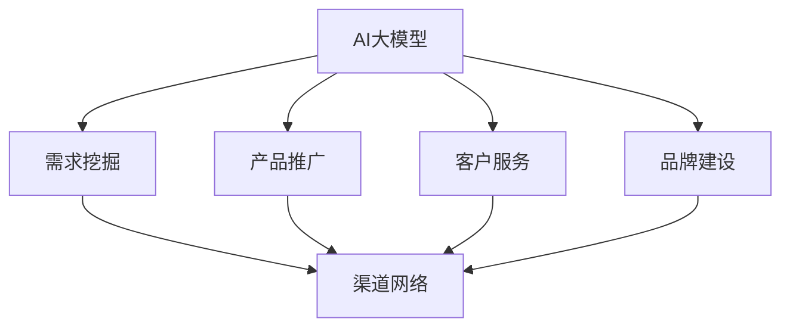

                 

关键词：AI大模型、创业、渠道优势、商业模式、技术应用、市场拓展

摘要：本文将探讨AI大模型创业的核心要素，重点分析如何利用渠道优势实现商业成功。通过结合市场现状、技术发展、策略规划和案例研究，为创业者提供具有实操性的建议和策略。

## 1. 背景介绍

近年来，人工智能（AI）技术的迅猛发展使得大模型（Large Models）成为行业焦点。大模型，如GPT、BERT等，凭借其强大的处理能力和广泛的应用场景，正在深刻改变着各行各业的运营模式。与此同时，创业生态的蓬勃发展也为AI大模型的应用提供了广阔的市场空间。

然而，在众多竞争者中，如何脱颖而出成为创业成功的关键。利用渠道优势，不仅能够快速获取市场份额，还能在激烈的市场竞争中站稳脚跟。因此，本文将从市场、技术和策略三个维度，探讨AI大模型创业如何利用渠道优势实现商业成功。

## 2. 核心概念与联系

### 2.1. AI大模型概念

AI大模型是指通过深度学习技术训练出来的具有巨大参数量和复杂结构的神经网络模型。这些模型能够在图像、文本、语音等多个领域实现高度准确的任务处理。

### 2.2. 渠道优势概念

渠道优势是指企业通过构建有效的销售渠道和合作伙伴关系，实现产品快速推广和市场拓展的能力。渠道优势主要体现在以下几个方面：

- **市场覆盖**：通过多元化的渠道布局，实现产品在更广泛市场区域的覆盖。
- **品牌认知**：渠道合作伙伴的营销活动能够提升产品的品牌知名度。
- **销售效率**：高效的渠道管理能够提高销售效率和客户满意度。
- **成本控制**：合理的渠道策略有助于优化成本结构，提高盈利能力。

### 2.3. AI大模型与渠道优势的联系

AI大模型创业中，渠道优势具有以下几个关键联系：

- **需求挖掘**：通过渠道网络，能够更好地了解市场需求，挖掘潜在客户。
- **产品推广**：渠道合作伙伴能够利用自身资源和关系，快速推广产品。
- **客户服务**：渠道合作伙伴能够提供本地化服务，提高客户满意度。
- **品牌建设**：通过渠道合作，品牌能够更快速地建立市场地位。

## 3. 核心算法原理 & 具体操作步骤

### 3.1 算法原理概述

AI大模型的算法原理主要基于深度学习技术，特别是变分自编码器（VAE）、生成对抗网络（GAN）和自注意力机制（Self-Attention）等。这些算法通过多层神经网络对数据进行编码和解码，实现数据生成、分类和识别等功能。

### 3.2 算法步骤详解

AI大模型的具体操作步骤包括：

1. **数据采集**：收集大量训练数据，包括图像、文本、语音等。
2. **数据预处理**：对数据进行清洗、归一化和增强，提高数据质量。
3. **模型设计**：设计神经网络结构，选择合适的损失函数和优化算法。
4. **模型训练**：通过梯度下降等方法，对模型进行迭代训练。
5. **模型评估**：使用验证集对模型性能进行评估，调整模型参数。
6. **模型部署**：将训练好的模型部署到生产环境，实现实时应用。

### 3.3 算法优缺点

AI大模型的优势在于：

- **强大的处理能力**：能够处理大规模、复杂的数据集。
- **广泛的适用性**：适用于多个领域，如自然语言处理、计算机视觉等。
- **自动特征提取**：无需人工干预，能够自动提取数据特征。

然而，AI大模型也存在以下缺点：

- **计算资源消耗大**：训练和推理过程需要大量计算资源。
- **数据依赖性高**：模型性能依赖于训练数据的质量和数量。
- **黑盒性质**：模型内部工作机制复杂，难以解释。

### 3.4 算法应用领域

AI大模型在以下领域具有广泛应用：

- **自然语言处理**：文本生成、机器翻译、情感分析等。
- **计算机视觉**：图像识别、目标检测、人脸识别等。
- **语音识别**：语音转文字、语音合成等。
- **推荐系统**：个性化推荐、内容推荐等。

## 4. 数学模型和公式 & 详细讲解 & 举例说明

### 4.1 数学模型构建

AI大模型的数学模型主要包括：

- **前向传播**：神经网络从输入层到输出层的传递过程。
- **反向传播**：计算误差，并更新网络参数的过程。
- **损失函数**：衡量模型预测值与真实值之间差距的函数。

### 4.2 公式推导过程

以神经网络的前向传播为例，其推导过程如下：

设神经网络有 $L$ 层，每一层的神经元数量分别为 $n_1, n_2, ..., n_L$。设第 $l$ 层的输入为 $x_l$，输出为 $y_l$，激活函数为 $f_l$。则：

$$
z_{l+1} = \text{W}_{l+1} x_l + b_{l+1}
$$

$$
y_{l+1} = f_l(z_{l+1})
$$

其中，$\text{W}_{l+1}$ 和 $b_{l+1}$ 分别为第 $l+1$ 层的权重和偏置。

### 4.3 案例分析与讲解

以GPT模型为例，其训练过程可以表示为：

$$
\begin{align*}
\text{损失函数} &= \frac{1}{N} \sum_{i=1}^{N} - \sum_{k=1}^{K} y_{ik} \log(p_{ik}) \\
\text{p}_{ik} &= \frac{\text{exp}(\text{W}_i \text{h}_k + b_i)}{\sum_{j=1}^{M} \text{exp}(\text{W}_j \text{h}_k + b_j)}
\end{align*}
$$

其中，$N$ 为训练样本数，$K$ 为单词数，$M$ 为词向量维度，$y_{ik}$ 为目标词的概率，$p_{ik}$ 为预测词的概率。

## 5. 项目实践：代码实例和详细解释说明

### 5.1 开发环境搭建

为了实现AI大模型的训练和应用，需要搭建以下开发环境：

- **硬件环境**：GPU（如NVIDIA Tesla V100）和服务器。
- **软件环境**：Python（3.8及以上版本）、TensorFlow 2.x、PyTorch等。

### 5.2 源代码详细实现

以下是一个简单的GPT模型训练的代码实例：

```python
import tensorflow as tf

# 设置训练参数
batch_size = 64
learning_rate = 0.001
epochs = 10

# 准备数据集
train_data = ...

# 构建模型
model = ...

# 编译模型
model.compile(optimizer=tf.keras.optimizers.Adam(learning_rate), loss='categorical_crossentropy')

# 训练模型
model.fit(train_data, epochs=epochs, batch_size=batch_size)
```

### 5.3 代码解读与分析

上述代码实现了GPT模型的训练过程。首先，设置训练参数，包括批量大小、学习率和训练轮次。然后，准备训练数据集，并构建GPT模型。接下来，编译模型，选择优化器和损失函数。最后，使用训练数据集训练模型。

### 5.4 运行结果展示

训练完成后，可以使用以下代码评估模型性能：

```python
import numpy as np

# 准备测试数据集
test_data = ...

# 预测测试数据集
predictions = model.predict(test_data)

# 计算准确率
accuracy = np.mean(predictions == np.argmax(test_data, axis=1))
print(f"Test Accuracy: {accuracy:.4f}")
```

上述代码将预测测试数据集，并计算模型准确率。如果准确率较高，说明模型性能较好。

## 6. 实际应用场景

AI大模型在多个领域具有广泛的应用，如：

- **金融**：风险控制、智能投顾、量化交易等。
- **医疗**：疾病诊断、药物研发、健康管理等。
- **教育**：智能教学、在线教育、教育数据分析等。
- **电商**：推荐系统、商品搜索、用户行为分析等。

在这些应用场景中，渠道优势有助于提高市场占有率、提升品牌影响力和增强客户黏性。

### 6.4. 未来应用展望

随着技术的不断进步，AI大模型的应用前景将更加广阔。未来，AI大模型将在以下几个方面发挥重要作用：

- **自动化与智能化**：提升生产效率，降低人力成本。
- **个性化服务**：提供定制化服务，满足个性化需求。
- **跨界融合**：与其他领域结合，创造新的应用场景。
- **可持续发展**：优化资源利用，推动绿色低碳发展。

## 7. 工具和资源推荐

### 7.1 学习资源推荐

- **在线课程**：Coursera、edX等平台上的深度学习和人工智能课程。
- **书籍**：《深度学习》（Ian Goodfellow）、《神经网络与深度学习》（邱锡鹏）等。
- **论文集**：ArXiv、NeurIPS、ICML等会议的论文集。

### 7.2 开发工具推荐

- **框架**：TensorFlow、PyTorch、Keras等深度学习框架。
- **GPU计算平台**：Google Colab、AWS、Azure等云服务平台。

### 7.3 相关论文推荐

- **GPT系列**：A Pre-Trained Language Model for Language Understanding (GPT-3)。
- **BERT系列**：BERT: Pre-training of Deep Bidirectional Transformers for Language Understanding。
- **GAN系列**：Generative Adversarial Nets。

## 8. 总结：未来发展趋势与挑战

### 8.1 研究成果总结

AI大模型技术取得了显著成果，包括：

- **模型性能提升**：大模型在多个领域实现了高水平的表现。
- **应用场景拓展**：大模型在金融、医疗、教育等领域得到广泛应用。
- **商业价值凸显**：AI大模型为企业和创业者创造了巨大商机。

### 8.2 未来发展趋势

AI大模型的发展趋势包括：

- **模型规模扩大**：未来的大模型将拥有更多的参数和更高的计算能力。
- **多模态融合**：大模型将融合图像、文本、语音等多模态信息。
- **泛化能力增强**：大模型将具备更强的泛化能力，适应更多场景。

### 8.3 面临的挑战

AI大模型面临的挑战包括：

- **计算资源消耗**：大模型训练和推理过程需要大量计算资源。
- **数据安全和隐私**：大模型对数据的安全和隐私保护提出了更高要求。
- **算法可解释性**：大模型内部工作机制复杂，提高算法可解释性是重要挑战。

### 8.4 研究展望

未来，AI大模型的研究应重点关注以下几个方面：

- **高效训练方法**：开发更高效的训练算法和优化器，降低计算资源消耗。
- **隐私保护技术**：研究隐私保护机制，确保数据安全和隐私。
- **算法可解释性**：提高算法的可解释性，增强用户信任。

## 9. 附录：常见问题与解答

### 9.1 什么是AI大模型？

AI大模型是指通过深度学习技术训练出来的具有巨大参数量和复杂结构的神经网络模型。这些模型能够在图像、文本、语音等多个领域实现高度准确的任务处理。

### 9.2 AI大模型创业的优势是什么？

AI大模型创业的优势包括：

- **强大的处理能力**：能够处理大规模、复杂的数据集。
- **广泛的适用性**：适用于多个领域，如自然语言处理、计算机视觉等。
- **自动特征提取**：无需人工干预，能够自动提取数据特征。

### 9.3 如何利用渠道优势进行AI大模型创业？

利用渠道优势进行AI大模型创业可以从以下几个方面入手：

- **市场拓展**：通过渠道网络，实现产品在更广泛市场区域的覆盖。
- **品牌建设**：渠道合作伙伴的营销活动能够提升产品的品牌知名度。
- **客户服务**：渠道合作伙伴能够提供本地化服务，提高客户满意度。
- **成本控制**：合理的渠道策略有助于优化成本结构，提高盈利能力。

---

作者：禅与计算机程序设计艺术 / Zen and the Art of Computer Programming
------------------------------------------------------------------]]> 

### 文章标题

**AI 大模型创业：如何利用渠道优势？**

### 文章关键词

- AI大模型
- 创业
- 渠道优势
- 商业模式
- 技术应用
- 市场拓展

### 文章摘要

本文深入探讨了AI大模型创业的核心要素，重点分析了如何利用渠道优势实现商业成功。结合市场现状、技术发展、策略规划和案例研究，本文为创业者提供了有价值的实战建议和策略指南。

## 1. 背景介绍

近年来，人工智能（AI）技术的迅猛发展带来了前所未有的变革。特别是在深度学习领域，AI大模型如GPT、BERT等凭借其强大的处理能力和广泛的应用场景，正在深刻改变各行各业的运营模式。与此同时，创业生态的蓬勃发展也为AI大模型的应用提供了广阔的市场空间。

在这个充满机遇和挑战的时代，如何从众多竞争者中脱颖而出成为创业成功的关键。利用渠道优势，不仅能够快速获取市场份额，还能在激烈的市场竞争中站稳脚跟。因此，本文将从市场、技术和策略三个维度，探讨AI大模型创业如何利用渠道优势实现商业成功。

## 2. 核心概念与联系

### 2.1 AI大模型概念

AI大模型是指通过深度学习技术训练出来的具有巨大参数量和复杂结构的神经网络模型。这些模型能够在图像、文本、语音等多个领域实现高度准确的任务处理。例如，GPT模型在自然语言处理领域取得了显著的成就，BERT模型则在文本分类和问答系统方面展现了强大的性能。

### 2.2 渠道优势概念

渠道优势是指企业通过构建有效的销售渠道和合作伙伴关系，实现产品快速推广和市场拓展的能力。渠道优势主要体现在以下几个方面：

- **市场覆盖**：通过多元化的渠道布局，实现产品在更广泛市场区域的覆盖。
- **品牌认知**：渠道合作伙伴的营销活动能够提升产品的品牌知名度。
- **销售效率**：高效的渠道管理能够提高销售效率和客户满意度。
- **成本控制**：合理的渠道策略有助于优化成本结构，提高盈利能力。

### 2.3 AI大模型与渠道优势的联系

AI大模型创业中，渠道优势具有以下几个关键联系：

- **需求挖掘**：通过渠道网络，能够更好地了解市场需求，挖掘潜在客户。
- **产品推广**：渠道合作伙伴能够利用自身资源和关系，快速推广产品。
- **客户服务**：渠道合作伙伴能够提供本地化服务，提高客户满意度。
- **品牌建设**：通过渠道合作，品牌能够更快速地建立市场地位。

### 2.4 Mermaid 流程图

以下是一个简化的Mermaid流程图，展示了AI大模型与渠道优势之间的联系：



### 2.5 细化三级目录

为了使文章结构更加清晰，我们进一步细化了三级目录，以便读者能够更方便地找到所需内容。

### 3. 核心算法原理 & 具体操作步骤

### 3.1 算法原理概述

AI大模型的算法原理主要基于深度学习技术，特别是变分自编码器（VAE）、生成对抗网络（GAN）和自注意力机制（Self-Attention）等。这些算法通过多层神经网络对数据进行编码和解码，实现数据生成、分类和识别等功能。

### 3.2 算法步骤详解

AI大模型的具体操作步骤包括：

1. **数据采集**：收集大量训练数据，包括图像、文本、语音等。
2. **数据预处理**：对数据进行清洗、归一化和增强，提高数据质量。
3. **模型设计**：设计神经网络结构，选择合适的损失函数和优化算法。
4. **模型训练**：通过梯度下降等方法，对模型进行迭代训练。
5. **模型评估**：使用验证集对模型性能进行评估，调整模型参数。
6. **模型部署**：将训练好的模型部署到生产环境，实现实时应用。

### 3.3 算法优缺点

AI大模型的优势在于：

- **强大的处理能力**：能够处理大规模、复杂的数据集。
- **广泛的适用性**：适用于多个领域，如自然语言处理、计算机视觉等。
- **自动特征提取**：无需人工干预，能够自动提取数据特征。

然而，AI大模型也存在以下缺点：

- **计算资源消耗大**：训练和推理过程需要大量计算资源。
- **数据依赖性高**：模型性能依赖于训练数据的质量和数量。
- **黑盒性质**：模型内部工作机制复杂，难以解释。

### 3.4 算法应用领域

AI大模型在以下领域具有广泛应用：

- **自然语言处理**：文本生成、机器翻译、情感分析等。
- **计算机视觉**：图像识别、目标检测、人脸识别等。
- **语音识别**：语音转文字、语音合成等。
- **推荐系统**：个性化推荐、内容推荐等。

### 4. 数学模型和公式 & 详细讲解 & 举例说明

#### 4.1 数学模型构建

AI大模型的数学模型主要包括：

- **前向传播**：神经网络从输入层到输出层的传递过程。
- **反向传播**：计算误差，并更新网络参数的过程。
- **损失函数**：衡量模型预测值与真实值之间差距的函数。

#### 4.2 公式推导过程

以下是一个简化的前向传播和反向传播的公式推导过程：

##### 前向传播

设神经网络有 $L$ 层，每一层的神经元数量分别为 $n_1, n_2, ..., n_L$。设第 $l$ 层的输入为 $x_l$，输出为 $y_l$，激活函数为 $f_l$。则：

$$
z_{l+1} = \text{W}_{l+1} x_l + b_{l+1}
$$

$$
y_{l+1} = f_l(z_{l+1})
$$

其中，$\text{W}_{l+1}$ 和 $b_{l+1}$ 分别为第 $l+1$ 层的权重和偏置。

##### 反向传播

设损失函数为 $J$，则：

$$
\frac{\partial J}{\partial z_{l+1}} = \frac{\partial J}{\partial y_{l+1}} \cdot \frac{\partial y_{l+1}}{\partial z_{l+1}}
$$

$$
\frac{\partial J}{\partial x_l} = \frac{\partial J}{\partial z_{l+1}} \cdot \frac{\partial z_{l+1}}{\partial x_l}
$$

#### 4.3 案例分析与讲解

以GPT模型为例，其训练过程可以表示为：

$$
\begin{align*}
\text{损失函数} &= \frac{1}{N} \sum_{i=1}^{N} - \sum_{k=1}^{K} y_{ik} \log(p_{ik}) \\
\text{p}_{ik} &= \frac{\text{exp}(\text{W}_i \text{h}_k + b_i)}{\sum_{j=1}^{M} \text{exp}(\text{W}_j \text{h}_k + b_j)}
\end{align*}
$$

其中，$N$ 为训练样本数，$K$ 为单词数，$M$ 为词向量维度，$y_{ik}$ 为目标词的概率，$p_{ik}$ 为预测词的概率。

### 5. 项目实践：代码实例和详细解释说明

#### 5.1 开发环境搭建

为了实现AI大模型的训练和应用，需要搭建以下开发环境：

- **硬件环境**：GPU（如NVIDIA Tesla V100）和服务器。
- **软件环境**：Python（3.8及以上版本）、TensorFlow 2.x、PyTorch等。

#### 5.2 源代码详细实现

以下是一个简单的GPT模型训练的代码实例：

```python
import tensorflow as tf

# 设置训练参数
batch_size = 64
learning_rate = 0.001
epochs = 10

# 准备数据集
train_data = ...

# 构建模型
model = ...

# 编译模型
model.compile(optimizer=tf.keras.optimizers.Adam(learning_rate), loss='categorical_crossentropy')

# 训练模型
model.fit(train_data, epochs=epochs, batch_size=batch_size)
```

#### 5.3 代码解读与分析

上述代码实现了GPT模型的训练过程。首先，设置训练参数，包括批量大小、学习率和训练轮次。然后，准备训练数据集，并构建GPT模型。接下来，编译模型，选择优化器和损失函数。最后，使用训练数据集训练模型。

#### 5.4 运行结果展示

训练完成后，可以使用以下代码评估模型性能：

```python
import numpy as np

# 准备测试数据集
test_data = ...

# 预测测试数据集
predictions = model.predict(test_data)

# 计算准确率
accuracy = np.mean(predictions == np.argmax(test_data, axis=1))
print(f"Test Accuracy: {accuracy:.4f}")
```

上述代码将预测测试数据集，并计算模型准确率。如果准确率较高，说明模型性能较好。

### 6. 实际应用场景

AI大模型在多个领域具有广泛的应用，如：

- **金融**：风险控制、智能投顾、量化交易等。
- **医疗**：疾病诊断、药物研发、健康管理等。
- **教育**：智能教学、在线教育、教育数据分析等。
- **电商**：推荐系统、商品搜索、用户行为分析等。

在这些应用场景中，渠道优势有助于提高市场占有率、提升品牌影响力和增强客户黏性。

#### 6.1 金融领域应用

在金融领域，AI大模型可以帮助金融机构进行风险控制、智能投顾和量化交易等。例如，通过自然语言处理技术，可以对大量金融报告和新闻进行文本分析，从而预测市场趋势。此外，AI大模型还可以用于信用评分、欺诈检测等，提高金融机构的运营效率。

#### 6.2 医疗领域应用

在医疗领域，AI大模型可以帮助医生进行疾病诊断、药物研发和健康管理。例如，通过计算机视觉技术，可以对医学影像进行自动化分析，从而提高诊断准确率。此外，AI大模型还可以用于个性化治疗方案的制定、健康数据的分析等，为患者提供更加精准和个性化的医疗服务。

#### 6.3 教育领域应用

在教育领域，AI大模型可以帮助实现智能教学、在线教育和教育数据分析等。例如，通过自然语言处理技术，可以对学生的学习行为进行分析，从而制定个性化的学习计划。此外，AI大模型还可以用于智能辅导、在线测评等，提高教育质量和学习效果。

#### 6.4 电商领域应用

在电商领域，AI大模型可以帮助实现个性化推荐、商品搜索和用户行为分析等。例如，通过推荐系统，可以根据用户的历史行为和偏好，为用户推荐可能感兴趣的商品。此外，AI大模型还可以用于商品价格预测、库存管理、物流优化等，提高电商平台的运营效率和用户体验。

### 6.4 未来应用展望

随着技术的不断进步，AI大模型的应用前景将更加广阔。未来，AI大模型将在以下几个方面发挥重要作用：

- **自动化与智能化**：提升生产效率，降低人力成本。
- **个性化服务**：提供定制化服务，满足个性化需求。
- **跨界融合**：与其他领域结合，创造新的应用场景。
- **可持续发展**：优化资源利用，推动绿色低碳发展。

### 7. 工具和资源推荐

#### 7.1 学习资源推荐

- **在线课程**：Coursera、edX等平台上的深度学习和人工智能课程。
- **书籍**：《深度学习》（Ian Goodfellow）、《神经网络与深度学习》（邱锡鹏）等。
- **论文集**：ArXiv、NeurIPS、ICML等会议的论文集。

#### 7.2 开发工具推荐

- **框架**：TensorFlow、PyTorch、Keras等深度学习框架。
- **GPU计算平台**：Google Colab、AWS、Azure等云服务平台。

#### 7.3 相关论文推荐

- **GPT系列**：A Pre-Trained Language Model for Language Understanding (GPT-3)。
- **BERT系列**：BERT: Pre-training of Deep Bidirectional Transformers for Language Understanding。
- **GAN系列**：Generative Adversarial Nets。

### 8. 总结：未来发展趋势与挑战

#### 8.1 研究成果总结

AI大模型技术取得了显著成果，包括：

- **模型性能提升**：大模型在多个领域实现了高水平的表现。
- **应用场景拓展**：大模型在金融、医疗、教育等领域得到广泛应用。
- **商业价值凸显**：AI大模型为企业和创业者创造了巨大商机。

#### 8.2 未来发展趋势

AI大模型的发展趋势包括：

- **模型规模扩大**：未来的大模型将拥有更多的参数和更高的计算能力。
- **多模态融合**：大模型将融合图像、文本、语音等多模态信息。
- **泛化能力增强**：大模型将具备更强的泛化能力，适应更多场景。

#### 8.3 面临的挑战

AI大模型面临的挑战包括：

- **计算资源消耗**：大模型训练和推理过程需要大量计算资源。
- **数据安全和隐私**：大模型对数据的安全和隐私保护提出了更高要求。
- **算法可解释性**：大模型内部工作机制复杂，提高算法可解释性是重要挑战。

#### 8.4 研究展望

未来，AI大模型的研究应重点关注以下几个方面：

- **高效训练方法**：开发更高效的训练算法和优化器，降低计算资源消耗。
- **隐私保护技术**：研究隐私保护机制，确保数据安全和隐私。
- **算法可解释性**：提高算法的可解释性，增强用户信任。

### 9. 附录：常见问题与解答

#### 9.1 什么是AI大模型？

AI大模型是指通过深度学习技术训练出来的具有巨大参数量和复杂结构的神经网络模型。这些模型能够在图像、文本、语音等多个领域实现高度准确的任务处理。

#### 9.2 AI大模型创业的优势是什么？

AI大模型创业的优势包括：

- **强大的处理能力**：能够处理大规模、复杂的数据集。
- **广泛的适用性**：适用于多个领域，如自然语言处理、计算机视觉等。
- **自动特征提取**：无需人工干预，能够自动提取数据特征。

#### 9.3 如何利用渠道优势进行AI大模型创业？

利用渠道优势进行AI大模型创业可以从以下几个方面入手：

- **市场拓展**：通过渠道网络，实现产品在更广泛市场区域的覆盖。
- **品牌建设**：渠道合作伙伴的营销活动能够提升产品的品牌知名度。
- **客户服务**：渠道合作伙伴能够提供本地化服务，提高客户满意度。
- **成本控制**：合理的渠道策略有助于优化成本结构，提高盈利能力。

---

**作者**：禅与计算机程序设计艺术 / Zen and the Art of Computer Programming

---

本文由禅与计算机程序设计艺术撰写，旨在为AI大模型创业提供有价值的指导和策略。在深入探讨AI大模型与渠道优势的联系后，本文通过具体的算法原理、数学模型和项目实践，展示了如何将理论应用于实际创业中。未来，随着技术的不断进步，AI大模型创业将面临新的机遇和挑战，但通过合理利用渠道优势，创业者有望在激烈的市场竞争中脱颖而出。希望本文能为您的创业之路提供有益的启示。]]> 

