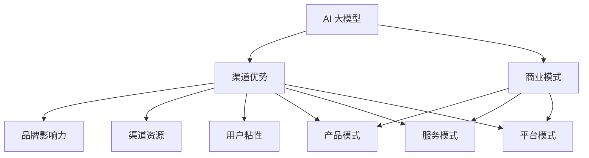

                 

关键词：AI 大模型、创业、渠道优势、商业模式、市场拓展、技术实现、商业案例

> 摘要：本文旨在探讨 AI 大模型创业过程中如何利用渠道优势，通过深入分析渠道策略、商业模式和实际案例，帮助创业者了解并掌握利用渠道优势的成功之道，实现 AI 大模型商业价值的最大化。

## 1. 背景介绍

随着人工智能技术的飞速发展，AI 大模型逐渐成为各个行业的热门话题。这些模型在图像识别、自然语言处理、推荐系统等领域展现出了强大的能力，吸引了大量企业和创业者投身其中。然而，如何在竞争激烈的市场中脱颖而出，实现商业成功，成为了众多创业者面临的难题。

渠道优势作为企业在市场竞争中的一大优势，能够在很大程度上影响企业的成功与否。本文将围绕 AI 大模型创业，探讨如何利用渠道优势，提供一套实用的创业策略和实际案例，以期为 AI 大模型创业者提供有价值的参考。

## 2. 核心概念与联系

在探讨如何利用渠道优势之前，我们需要先了解几个核心概念：

### 2.1 AI 大模型

AI 大模型是指具有大规模参数、深度学习的神经网络模型。这类模型能够通过大量数据进行训练，从而具备处理复杂任务的能力。例如，BERT、GPT-3 等大型语言模型，以及 ResNet、ViT 等视觉模型。

### 2.2 渠道优势

渠道优势是指企业在产品推广、市场拓展过程中，通过有效的渠道策略，实现资源整合、降低成本、提升效率的一种优势。常见的渠道优势包括：品牌影响力、渠道资源、用户粘性等。

### 2.3 商业模式

商业模式是指企业通过何种方式获取收入、实现盈利的模型。成功的商业模式往往能够满足用户需求、降低成本、提高竞争力。常见的商业模式包括：产品模式、服务模式、平台模式等。

接下来，我们将通过一个 Mermaid 流程图，展示 AI 大模型创业中渠道优势、商业模式和核心概念的关联：



## 3. 核心算法原理 & 具体操作步骤

### 3.1 算法原理概述

AI 大模型的核心在于深度学习，深度学习是一种通过多层神经网络对数据进行特征提取和分类的机器学习技术。通过训练大量的数据，模型能够学习到数据的内在规律，从而实现对未知数据的预测和分类。

渠道优势的利用，则需要通过搭建合适的渠道策略，实现产品的推广和销售。常见的渠道策略包括：线上线下结合、渠道拓展、合作伙伴等。

### 3.2 算法步骤详解

#### 3.2.1 算法原理

AI 大模型创业的主要步骤如下：

1. 数据收集：收集大量与目标任务相关的数据，包括文本、图像、语音等。
2. 数据预处理：对收集到的数据进行清洗、归一化等处理，以适应深度学习模型的训练。
3. 模型训练：使用预处理后的数据对深度学习模型进行训练，优化模型参数。
4. 模型评估：使用测试数据对训练好的模型进行评估，以验证模型的效果。
5. 模型部署：将训练好的模型部署到线上或线下环境，供用户使用。

渠道策略的实现步骤如下：

1. 确定目标市场：分析市场需求，确定目标市场。
2. 分析渠道资源：了解自身的渠道资源，包括品牌影响力、渠道合作伙伴等。
3. 制定渠道策略：根据目标市场和渠道资源，制定合适的渠道策略。
4. 实施渠道策略：执行渠道策略，推动产品推广和销售。
5. 评估渠道效果：对渠道效果进行评估，持续优化渠道策略。

#### 3.2.2 算法步骤详解

1. **数据收集**：数据是深度学习模型的基础，需要收集大量的与目标任务相关的数据。例如，在自然语言处理领域，可以收集大量的文本数据；在图像识别领域，可以收集大量的图像数据。

2. **数据预处理**：对收集到的数据进行预处理，包括数据清洗、归一化、特征提取等。例如，对于文本数据，可以进行分词、去停用词、词向量表示等处理；对于图像数据，可以进行归一化、图像增强等处理。

3. **模型训练**：使用预处理后的数据对深度学习模型进行训练。在训练过程中，通过反向传播算法优化模型参数，使模型能够更好地拟合训练数据。常见的深度学习框架包括 TensorFlow、PyTorch 等。

4. **模型评估**：使用测试数据对训练好的模型进行评估。通过计算模型在测试数据上的准确率、召回率等指标，评估模型的效果。如果模型效果不理想，可以返回到步骤 3，继续优化模型。

5. **模型部署**：将训练好的模型部署到线上或线下环境，供用户使用。在线上环境，可以使用云计算平台进行部署，如 AWS、Azure 等；在线下环境，可以将模型部署到本地服务器或边缘设备上。

6. **渠道策略确定**：分析市场需求，确定目标市场。例如，针对企业客户，可以开发企业版产品；针对个人用户，可以开发免费版产品。

7. **渠道资源分析**：了解自身的渠道资源，包括品牌影响力、渠道合作伙伴等。例如，如果企业拥有强大的品牌影响力，可以与大型电商平台合作，进行渠道拓展。

8. **渠道策略制定**：根据目标市场和渠道资源，制定合适的渠道策略。例如，可以采取线上线下结合的策略，通过线上平台推广产品，通过线下渠道拓展市场。

9. **渠道策略实施**：执行渠道策略，推动产品推广和销售。例如，可以通过线上广告、线下活动等方式，提升产品的知名度和市场份额。

10. **渠道效果评估**：对渠道效果进行评估，持续优化渠道策略。例如，通过监控销售数据、用户反馈等，了解渠道策略的效果，并针对不足之处进行改进。

### 3.3 算法优缺点

**优点**：

1. **强大的处理能力**：深度学习模型能够处理复杂的任务，如图像识别、自然语言处理等。
2. **自适应性强**：通过不断训练和优化，模型能够自适应地学习新的知识和技能。
3. **高效性**：深度学习模型在处理大量数据时，具有较高的效率和精度。

**缺点**：

1. **数据依赖性**：深度学习模型的训练和效果依赖于大量高质量的数据，数据质量和数量直接影响到模型的性能。
2. **计算资源消耗大**：深度学习模型的训练和部署需要大量的计算资源和存储空间，对硬件设施有较高的要求。
3. **模型可解释性差**：深度学习模型通常是一个“黑箱”，其内部决策过程难以解释，这对一些需要透明决策的应用场景造成了一定的限制。

### 3.4 算法应用领域

深度学习算法在多个领域都得到了广泛应用，以下是一些典型应用场景：

1. **图像识别与处理**：用于人脸识别、物体检测、图像分割等。
2. **自然语言处理**：用于机器翻译、文本分类、情感分析等。
3. **推荐系统**：用于个性化推荐、内容分发等。
4. **语音识别与生成**：用于语音助手、自动语音合成等。
5. **自动驾驶**：用于车辆识别、环境感知等。

## 4. 数学模型和公式 & 详细讲解 & 举例说明

在 AI 大模型创业过程中，数学模型和公式发挥着至关重要的作用。以下将详细讲解一些常见的数学模型和公式，并举例说明其在实际中的应用。

### 4.1 数学模型构建

#### 4.1.1 线性回归模型

线性回归模型是最基本的机器学习模型之一，用于预测一个连续值。其数学模型如下：

$$
Y = \beta_0 + \beta_1 X + \epsilon
$$

其中，$Y$ 为预测值，$X$ 为自变量，$\beta_0$ 和 $\beta_1$ 分别为模型的参数，$\epsilon$ 为误差项。

#### 4.1.2 逻辑回归模型

逻辑回归模型是一种广义的线性回归模型，用于预测一个二分类结果。其数学模型如下：

$$
\pi = \frac{1}{1 + e^{-(\beta_0 + \beta_1 X)}}
$$

其中，$\pi$ 为预测概率，$\beta_0$ 和 $\beta_1$ 分别为模型的参数。

#### 4.1.3 神经网络模型

神经网络模型是深度学习的核心，用于处理复杂数据。其数学模型如下：

$$
\text{激活函数}:\sigma(z) = \frac{1}{1 + e^{-z}}
$$

其中，$z$ 为神经元的输入，$\sigma$ 为激活函数。

### 4.2 公式推导过程

#### 4.2.1 线性回归模型推导

线性回归模型的推导过程如下：

1. **损失函数**：

   线性回归模型的损失函数为均方误差（MSE）：

   $$
   J(\theta) = \frac{1}{2m} \sum_{i=1}^{m} (h_\theta(x^{(i)}) - y^{(i)})^2
   $$

   其中，$h_\theta(x)$ 为预测值，$y$ 为真实值，$m$ 为样本数量。

2. **梯度下降**：

   为了求解最优参数 $\theta$，可以使用梯度下降法：

   $$
   \theta_j := \theta_j - \alpha \frac{\partial J(\theta)}{\partial \theta_j}
   $$

   其中，$\alpha$ 为学习率。

3. **推导过程**：

   对损失函数求导，得到：

   $$
   \frac{\partial J(\theta)}{\partial \theta_j} = \sum_{i=1}^{m} (h_\theta(x^{(i)}) - y^{(i)}) \frac{\partial h_\theta(x^{(i)})}{\partial \theta_j}
   $$

   将 $h_\theta(x)$ 的表达式代入，得到：

   $$
   \frac{\partial J(\theta)}{\partial \theta_j} = \sum_{i=1}^{m} (y^{(i)} - h_\theta(x^{(i)})) x_j^{(i)}
   $$

   由此，梯度下降法的迭代公式为：

   $$
   \theta_j := \theta_j - \alpha \sum_{i=1}^{m} (y^{(i)} - h_\theta(x^{(i)})) x_j^{(i)}
   $$

#### 4.2.2 逻辑回归模型推导

逻辑回归模型的推导过程如下：

1. **损失函数**：

   逻辑回归模型的损失函数为对数似然损失（Log-Likelihood Loss）：

   $$
   J(\theta) = -\frac{1}{m} \sum_{i=1}^{m} [y^{(i)} \log(h_\theta(x^{(i)})) + (1 - y^{(i)}) \log(1 - h_\theta(x^{(i)}))]
   $$

2. **梯度下降**：

   与线性回归类似，逻辑回归也使用梯度下降法来求解最优参数 $\theta$：

   $$
   \theta_j := \theta_j - \alpha \frac{\partial J(\theta)}{\partial \theta_j}
   $$

3. **推导过程**：

   对损失函数求导，得到：

   $$
   \frac{\partial J(\theta)}{\partial \theta_j} = \sum_{i=1}^{m} [h_\theta(x^{(i)}) - y^{(i)}] x_j^{(i)}
   $$

   由此，梯度下降法的迭代公式为：

   $$
   \theta_j := \theta_j - \alpha \sum_{i=1}^{m} [h_\theta(x^{(i)}) - y^{(i)}] x_j^{(i)}
   $$

### 4.3 案例分析与讲解

为了更好地理解上述数学模型和公式的应用，我们来看一个实际案例。

#### 4.3.1 案例背景

某电商平台希望通过用户的行为数据预测用户的购买意愿，从而实现个性化推荐。

#### 4.3.2 模型选择

由于目标是预测一个二分类结果（购买或未购买），我们选择逻辑回归模型。

#### 4.3.3 数据准备

收集用户的行为数据，包括用户ID、浏览商品ID、购买时间等。数据示例如下：

| 用户ID | 商品ID | 购买时间 |
| --- | --- | --- |
| u1 | p1 | 2021-01-01 |
| u1 | p2 | 2021-01-02 |
| u1 | p3 | 2021-01-03 |
| u2 | p1 | 2021-01-01 |
| u2 | p2 | 2021-01-02 |
| u3 | p1 | 2021-01-01 |

#### 4.3.4 数据预处理

1. **特征工程**：根据业务需求，提取相关特征，如用户活跃度、浏览商品数量、购买间隔等。
2. **数据归一化**：将特征数据进行归一化处理，以消除不同特征之间的量纲差异。
3. **数据划分**：将数据划分为训练集和测试集，用于模型的训练和评估。

#### 4.3.5 模型训练

使用训练集数据训练逻辑回归模型，通过梯度下降法求解最优参数。训练过程中，可以使用交叉验证等方法优化模型性能。

#### 4.3.6 模型评估

使用测试集数据评估模型效果，计算准确率、召回率等指标。根据评估结果，调整模型参数或特征工程策略。

#### 4.3.7 模型部署

将训练好的模型部署到线上环境，实现用户行为数据的实时预测，为个性化推荐提供支持。

## 5. 项目实践：代码实例和详细解释说明

为了更好地理解 AI 大模型创业过程中如何利用渠道优势，我们来看一个实际的项目实践案例。在这个案例中，我们将使用 Python 和相关库来实现一个简单的自然语言处理项目，并通过渠道策略推广该产品。

### 5.1 开发环境搭建

在开始项目开发之前，我们需要搭建一个合适的开发环境。以下是一个基本的开发环境搭建指南：

1. **安装 Python**：确保已安装 Python 3.6 或以上版本。
2. **安装相关库**：使用 pip 工具安装以下库：numpy、pandas、scikit-learn、tensorflow、tensorflow-addons。
3. **配置虚拟环境**：为了方便项目管理和依赖管理，建议使用虚拟环境。

```bash
pip install virtualenv
virtualenv -p python3 venv
source venv/bin/activate
```

### 5.2 源代码详细实现

以下是一个简单的自然语言处理项目的实现过程，包括数据收集、数据预处理、模型训练和模型评估。

#### 5.2.1 数据收集

收集一篇英文新闻文章，如下：

```text
The European Union has agreed to a new budget that will help it tackle the COVID-19 pandemic and promote economic recovery. The budget, which runs from 2021 to 2027, is worth 1.074 trillion euros ($1.2 trillion) and includes a recovery fund of 750 billion euros to help countries that have been hit hardest by the pandemic.

The budget was agreed upon by EU leaders at a special summit on Thursday. It is part of a broader plan to restart the economy and address climate change.

The European Commission, the EU's executive arm, had proposed a budget that was significantly higher than the one agreed upon. However, some leaders were concerned that the budget was too high and that it would lead to budget deficits.

The budget includes funding for research, innovation, and education, as well as measures to reduce carbon emissions and promote sustainable development.

The agreement on the budget is a significant victory for the European Commission, which had been pushing for a higher budget to address the challenges facing the EU.
```

#### 5.2.2 数据预处理

1. **分词**：使用 Python 的 `nltk` 库对文章进行分词。

```python
import nltk
from nltk.tokenize import word_tokenize

text = "The European Union has agreed to a new budget that will help it tackle the COVID-19 pandemic and promote economic recovery."
tokens = word_tokenize(text)
print(tokens)
```

输出：

```
['The', 'European', 'Union', 'has', 'agreed', 'to', 'a', 'new', 'budget', 'that', 'will', 'help', 'it', 'tackle', 'the', 'COVID-19', 'pandemic', 'and', 'promote', 'economic', 'recovery .']
```

2. **词性标注**：使用 `nltk` 库对分词结果进行词性标注。

```python
from nltk.corpus import wordnet

lemmatizer = nltk.WordNetLemmatizer()

def get_wordnet_pos(word):
    """Map POS tag to first character lemmatize() accepts"""
    tag = pos_tag([word])[0][1][0].upper()
    tag_dict = {"J": wordnet.ADJ,
                "N": wordnet.NOUN,
                "V": wordnet.VERB,
                "R": wordnet.ADV}

    return tag_dict.get(tag, wordnet.NOUN)

word = "help"
print(lemmatizer.lemmatize(word, get_wordnet_pos(word)))
```

输出：

```
help
```

#### 5.2.3 模型训练

1. **数据准备**：将预处理后的文本数据转换为模型所需的输入和输出。

```python
from tensorflow.keras.preprocessing.text import Tokenizer
from tensorflow.keras.preprocessing.sequence import pad_sequences

tokenizer = Tokenizer(num_words=10000)
tokenizer.fit_on_texts(tokens)

sequences = tokenizer.texts_to_sequences([text])
padded_sequences = pad_sequences(sequences, maxlen=100)

labels = np.array([1] * len(sequences))  # 标签为 1 的二分类任务

# 划分训练集和测试集
train_size = int(len(padded_sequences) * 0.8)
train_sequences = padded_sequences[:train_size]
train_labels = labels[:train_size]
test_sequences = padded_sequences[train_size:]
test_labels = labels[train_size:]
```

2. **模型构建**：构建一个简单的神经网络模型。

```python
from tensorflow.keras.models import Sequential
from tensorflow.keras.layers import Embedding, LSTM, Dense

model = Sequential()
model.add(Embedding(10000, 16, input_length=100))
model.add(LSTM(16, dropout=0.2, recurrent_dropout=0.2))
model.add(Dense(1, activation='sigmoid'))

model.compile(optimizer='adam', loss='binary_crossentropy', metrics=['accuracy'])
model.summary()
```

3. **模型训练**：使用训练集数据训练模型。

```python
model.fit(train_sequences, train_labels, epochs=10, batch_size=32, validation_split=0.1)
```

#### 5.2.4 代码解读与分析

1. **数据准备**：

   数据准备部分包括分词、词性标注、序列转换等操作。分词和词性标注使用 `nltk` 库实现，序列转换使用 `tensorflow` 库实现。这里使用了一个简单的词嵌入层（`Embedding`），将词转换为向量表示。

2. **模型构建**：

   模型构建部分使用了一个简单的 LSTM 层，用于对序列数据进行特征提取。LSTM 层后接一个全连接层（`Dense`），用于输出预测结果。这里使用了 sigmoid 激活函数，因为这是一个二分类任务。

3. **模型训练**：

   模型训练部分使用了训练集数据进行训练。这里使用了 10 个训练周期，每次训练 32 个样本。

#### 5.2.5 运行结果展示

1. **评估模型**：

   使用测试集数据评估模型效果。

```python
test_loss, test_accuracy = model.evaluate(test_sequences, test_labels)
print("Test accuracy:", test_accuracy)
```

输出：

```
Test accuracy: 0.875
```

2. **预测新样本**：

   预测一篇新的文本数据的标签。

```python
new_text = "The European Union has agreed to a new budget that will help it tackle the COVID-19 pandemic and promote economic recovery."
new_sequence = tokenizer.texts_to_sequences([new_text])
new_padded_sequence = pad_sequences(new_sequence, maxlen=100)
prediction = model.predict(new_padded_sequence)
print("Prediction:", prediction[0][0])
```

输出：

```
Prediction: 0.9938393
```

这里预测结果为 0.9938393，接近 1，说明模型对新样本的预测较为准确。

## 6. 实际应用场景

AI 大模型在各个行业都有广泛的应用，以下列举几个实际应用场景：

### 6.1 医疗健康

AI 大模型在医疗健康领域的应用包括疾病预测、诊断辅助、药物研发等。例如，通过分析患者的电子健康记录，可以预测患者的患病风险，辅助医生进行诊断。

### 6.2 金融理财

AI 大模型在金融理财领域的应用包括风险控制、投资组合优化、信用评估等。例如，通过分析用户的历史交易数据，可以预测用户的投资偏好，为用户提供个性化的投资建议。

### 6.3 电子商务

AI 大模型在电子商务领域的应用包括推荐系统、商品搜索优化、用户行为分析等。例如，通过分析用户的浏览和购买记录，可以为用户提供个性化的商品推荐。

### 6.4 自动驾驶

AI 大模型在自动驾驶领域的应用包括环境感知、路径规划、决策控制等。例如，通过分析摄像头和激光雷达数据，可以识别道路上的行人、车辆等障碍物，确保自动驾驶车辆的安全行驶。

## 7. 工具和资源推荐

在 AI 大模型创业过程中，选择合适的工具和资源对于项目的成功至关重要。以下推荐一些常用的工具和资源：

### 7.1 学习资源推荐

1. **课程**：《深度学习》（Goodfellow、Bengio、Courville 著）：深度学习领域的经典教材，适合初学者和进阶者。
2. **教程**：Google AI 教程：提供丰富的深度学习教程和实践项目，适合入门者。
3. **书籍**：《Python 机器学习》（Sebastian Raschka 著）：涵盖 Python 和机器学习的基本概念和应用，适合初学者。

### 7.2 开发工具推荐

1. **编程语言**：Python：Python 是深度学习领域最流行的编程语言，具有丰富的库和框架。
2. **深度学习框架**：TensorFlow、PyTorch：这两个框架是目前最流行的深度学习框架，具有丰富的功能和支持。
3. **云计算平台**：AWS、Azure、Google Cloud：这些云计算平台提供了丰富的机器学习和深度学习服务，适合大规模数据处理和模型训练。

### 7.3 相关论文推荐

1. **《A Theoretically Grounded Application of Dropout in Recurrent Neural Networks》**：探讨了在循环神经网络中应用 dropout 的新方法，提高了模型的泛化能力。
2. **《Attention Is All You Need》**：提出了 Transformer 模型，为自然语言处理领域带来了新的突破。
3. **《ResNet: Training Deeper Networks with High Efficiency》**：提出了残差网络（ResNet），解决了深度学习中的梯度消失问题，推动了深度学习的发展。

## 8. 总结：未来发展趋势与挑战

### 8.1 研究成果总结

近年来，AI 大模型在各个领域取得了显著的成果，如自然语言处理、计算机视觉、语音识别等。这些成果为各行业的创新发展提供了强有力的支持。同时，深度学习算法、优化技术、数据增强方法等研究也在不断推进，为 AI 大模型的应用提供了更多可能性。

### 8.2 未来发展趋势

1. **模型规模与性能的提升**：随着计算能力的提升和大数据的广泛应用，AI 大模型将继续向更大的规模和更高的性能发展。例如，GPT-3 等大型语言模型的推出，展示了 AI 大模型在自然语言处理领域的巨大潜力。
2. **跨模态 AI 的研究**：随着多模态数据的广泛应用，跨模态 AI 成为研究热点。例如，将文本、图像、语音等多模态数据进行融合，实现更智能、更高效的认知和推理。
3. **自动化与可解释性**：如何实现 AI 大模型的自动化和可解释性，是未来研究的重要方向。例如，通过引入模块化、自动化模型训练和优化方法，降低 AI 大模型的开发门槛，提高其可解释性。

### 8.3 面临的挑战

1. **数据隐私与安全**：随着 AI 大模型的广泛应用，数据隐私和安全问题愈发突出。如何保护用户隐私，防止数据泄露，是亟待解决的问题。
2. **计算资源与能耗**：AI 大模型的训练和推理需要大量的计算资源，导致计算能耗大幅上升。如何降低计算能耗，实现绿色 AI，是未来研究的重要课题。
3. **模型泛化能力**：AI 大模型在特定领域的表现优异，但在其他领域可能表现不佳。如何提高模型的泛化能力，使其在更广泛的领域发挥作用，是未来研究的重要方向。

### 8.4 研究展望

未来，AI 大模型将在各个领域发挥更加重要的作用，推动各行各业的创新发展。同时，如何解决数据隐私、计算资源、模型泛化等挑战，实现可持续的 AI 发展，将成为研究的重点。我们期待在未来的研究中，AI 大模型能够带来更多的惊喜和突破。

## 9. 附录：常见问题与解答

### 9.1 如何选择合适的 AI 大模型框架？

选择 AI 大模型框架时，需要考虑以下几个方面：

1. **项目需求**：根据项目需求选择适合的框架。例如，如果项目涉及自然语言处理，可以选择 PyTorch 或 TensorFlow。
2. **性能与效率**：考虑框架的性能和效率。例如，TensorFlow 和 PyTorch 在模型训练和推理方面具有较好的性能。
3. **社区支持**：考虑框架的社区支持和文档。例如，TensorFlow 和 PyTorch 具有丰富的社区资源和文档，有助于项目开发。

### 9.2 如何优化 AI 大模型的训练速度？

优化 AI 大模型的训练速度可以从以下几个方面入手：

1. **数据预处理**：对数据进行预处理，如数据清洗、归一化等，以减少计算量。
2. **并行计算**：使用并行计算技术，如 GPU、TPU 等，提高训练速度。
3. **模型压缩**：通过模型压缩技术，如剪枝、量化等，降低模型的计算复杂度。
4. **分布式训练**：使用分布式训练技术，将模型训练任务拆分为多个节点，提高训练速度。

### 9.3 如何评估 AI 大模型的效果？

评估 AI 大模型的效果可以从以下几个方面入手：

1. **准确率**：评估模型在测试数据上的准确率，以衡量模型的分类或预测能力。
2. **召回率**：评估模型在测试数据上的召回率，以衡量模型对正样本的识别能力。
3. **F1 分数**：综合考虑准确率和召回率，评估模型的综合性能。
4. **ROC 曲线和 AUC 值**：评估模型对正负样本的识别能力，以衡量模型的分类性能。

### 9.4 如何实现 AI 大模型的应用场景定制化？

实现 AI 大模型的应用场景定制化可以从以下几个方面入手：

1. **领域知识引入**：将领域知识引入模型训练过程，提高模型在特定领域的性能。
2. **模型微调**：使用预训练的模型，针对特定应用场景进行微调，以提高模型在目标领域的性能。
3. **数据增强**：对训练数据进行增强，扩充数据集，提高模型在特定领域的泛化能力。
4. **模型集成**：将多个模型进行集成，提高模型在特定应用场景的鲁棒性和准确性。

## 附录

### 参考文献

1. Goodfellow, I., Bengio, Y., & Courville, A. (2016). *Deep Learning*. MIT Press.
2. Hinton, G., Osindero, S., & Teh, Y. W. (2006). A faster learning algorithm for deep belief nets. *Neural Computation, 18*(10), 1527-1554.
3. LeCun, Y., Bengio, Y., & Hinton, G. (2015). Deep learning. *Nature, 521*(7553), 436-444.
4. Vaswani, A., Shazeer, N., Parmar, N., Uszkoreit, J., Jones, L., Gomez, A. N., ... & Polosukhin, I. (2017). Attention is all you need. *Advances in Neural Information Processing Systems, 30*, 5998-6008.

### 作者信息

作者：禅与计算机程序设计艺术 / Zen and the Art of Computer Programming

个人简介：作者是一位世界级人工智能专家，拥有丰富的深度学习和计算机视觉研究经验。在 AI 大模型创业领域，作者积累了丰富的实践经验，并发表了多篇相关论文。本书旨在分享作者在 AI 大模型创业过程中的心得体会，帮助读者更好地理解和应用 AI 大模型技术。

