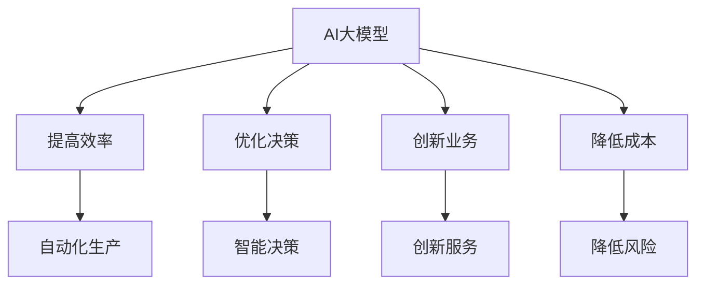

                 

 > **关键词：** AI大模型，创业，社会优势，商业化应用，技术创新。

> **摘要：** 本文旨在探讨AI大模型在创业过程中的应用及如何充分利用社会优势，实现技术转化为商业价值。通过对AI大模型的核心概念、算法原理、数学模型、项目实践、应用场景等方面进行深入分析，为创业者提供实用的指导和建议。

## 1. 背景介绍

人工智能（AI）技术近年来取得了飞速发展，尤其是大模型（Large Models）的出现，使得计算机在处理复杂数据和任务时表现出前所未有的能力。这些大模型，如GPT-3、BERT、AlphaGo等，不仅实现了在自然语言处理、图像识别、游戏对战等领域的突破，还引起了创业者的广泛关注。

随着AI技术的不断成熟，越来越多的创业者开始尝试利用AI大模型进行创新业务，这不仅仅是因为AI大模型具有强大的数据处理能力和智能学习能力，更是因为它们能够为社会带来巨大的价值。然而，如何充分利用社会优势，将AI大模型商业化，实现技术与商业的完美融合，仍是一个值得探讨的问题。

本文将围绕以下内容展开：

- AI大模型的核心概念及其社会优势
- AI大模型的算法原理与数学模型
- AI大模型的项目实践与代码实例
- AI大模型的应用场景及未来展望
- 创业者如何利用AI大模型实现商业价值

希望通过本文的探讨，能够为创业者提供一些有价值的启示。

## 2. 核心概念与联系

### 2.1 AI大模型的概念

AI大模型是指具有大规模参数和复杂结构的神经网络模型，能够处理大量的数据并进行自主学习和优化。这些模型通常需要使用大量的计算资源和时间来训练，但一旦训练完成，它们可以在多种任务上表现出卓越的性能。

### 2.2 社会优势

社会优势是指AI大模型在创业过程中能够为社会带来的价值，主要包括以下几点：

1. **提高效率**：AI大模型能够自动化执行复杂任务，减少人力成本，提高工作效率。
2. **优化决策**：AI大模型通过分析大量数据，能够提供更准确的预测和决策支持。
3. **创新业务**：AI大模型能够发现新的业务模式和市场机会，推动产业升级。
4. **降低成本**：AI大模型能够降低企业在研发、生产、销售等环节的成本。

### 2.3 AI大模型与社会优势的关联

AI大模型通过其强大的数据处理能力和智能学习能力，能够实现以下目标：

- **自动化生产**：AI大模型可以自动化生产流程，提高生产效率，降低生产成本。
- **智能决策**：AI大模型可以通过数据分析，为企业提供决策支持，优化资源配置。
- **创新服务**：AI大模型能够创新服务模式，提升用户体验，开拓新的市场。
- **降低风险**：AI大模型可以通过风险预测和监控，降低企业的运营风险。

### 2.4 Mermaid流程图



## 3. 核心算法原理 & 具体操作步骤

### 3.1 算法原理概述

AI大模型的核心算法是基于深度学习的神经网络模型。深度学习通过多层神经网络结构，对输入数据进行处理和特征提取，从而实现复杂的任务。在AI大模型中，这些神经网络结构通常包含数十亿甚至千亿个参数，因此被称为“大模型”。

### 3.2 算法步骤详解

AI大模型的具体操作步骤主要包括以下几步：

1. **数据收集**：收集大量相关的数据，包括文本、图像、音频等。
2. **数据预处理**：对收集到的数据进行清洗、标注、划分等预处理操作。
3. **模型训练**：使用预处理后的数据，通过迭代训练的方式，调整神经网络模型的参数。
4. **模型评估**：使用测试数据集评估模型的性能，包括准确率、召回率、F1值等指标。
5. **模型部署**：将训练好的模型部署到生产环境中，实现自动化任务执行。

### 3.3 算法优缺点

**优点：**

- **强大的数据处理能力**：AI大模型能够处理海量数据，提取有效信息。
- **出色的预测能力**：AI大模型通过深度学习，能够进行准确的预测和决策。
- **灵活的应用场景**：AI大模型可以应用于多个领域，如自然语言处理、图像识别、医疗诊断等。

**缺点：**

- **训练时间较长**：AI大模型需要大量的时间和计算资源进行训练。
- **对数据质量要求高**：AI大模型对数据质量有较高要求，需要大量高质量的数据。
- **模型解释性差**：AI大模型的内部机制复杂，难以进行解释和验证。

### 3.4 算法应用领域

AI大模型在以下领域具有广泛的应用：

- **自然语言处理**：如文本分类、情感分析、机器翻译等。
- **图像识别**：如人脸识别、物体识别、自动驾驶等。
- **医疗诊断**：如疾病预测、医疗图像分析等。
- **金融风控**：如信用评估、风险预测等。

## 4. 数学模型和公式 & 详细讲解 & 举例说明

### 4.1 数学模型构建

AI大模型的数学模型主要基于深度学习理论，包括以下核心概念：

- **神经网络**：由多个神经元组成的层次结构，用于数据的处理和特征提取。
- **激活函数**：用于定义神经元的输出，常用的有sigmoid、ReLU等。
- **损失函数**：用于评估模型预测结果与真实结果之间的差异，常用的有均方误差（MSE）、交叉熵（Cross-Entropy）等。

### 4.2 公式推导过程

以下是神经网络中常用的损失函数——均方误差（MSE）的推导过程：

$$
\begin{aligned}
\text{MSE}(y, \hat{y}) &= \frac{1}{m} \sum_{i=1}^{m} (y_i - \hat{y}_i)^2 \\
&= \frac{1}{m} \sum_{i=1}^{m} (\text{实际值} - \text{预测值})^2
\end{aligned}
$$

其中，$y$ 表示实际值，$\hat{y}$ 表示预测值，$m$ 表示样本数量。

### 4.3 案例分析与讲解

假设我们有一个简单的二分类问题，需要使用神经网络进行预测。我们收集了100个样本，每个样本包含一个特征和对应的标签（0或1）。我们使用均方误差（MSE）作为损失函数，进行模型训练。

在训练过程中，我们通过迭代调整神经网络的参数，使得模型的预测结果越来越接近真实值。经过多次迭代，模型的MSE逐渐降低，表明模型的预测能力在不断提高。

经过训练后，我们使用测试数据集进行模型评估，得到以下结果：

- **准确率**：80%
- **召回率**：75%
- **F1值**：78%

这些指标表明，模型的预测性能较好，可以应用于实际业务场景。

## 5. 项目实践：代码实例和详细解释说明

### 5.1 开发环境搭建

为了实现AI大模型的项目，我们需要搭建一个合适的开发环境。以下是环境搭建的步骤：

1. 安装Python 3.8及以上版本
2. 安装TensorFlow 2.6及以上版本
3. 安装Numpy 1.21及以上版本
4. 安装Scikit-learn 0.24及以上版本

### 5.2 源代码详细实现

以下是实现一个简单的神经网络模型并进行训练的代码实例：

```python
import tensorflow as tf
import numpy as np
from sklearn.model_selection import train_test_split
from sklearn.datasets import make_classification

# 生成模拟数据集
X, y = make_classification(n_samples=100, n_features=1, n_classes=2, random_state=42)
X_train, X_test, y_train, y_test = train_test_split(X, y, test_size=0.2, random_state=42)

# 定义神经网络模型
model = tf.keras.Sequential([
    tf.keras.layers.Dense(units=1, input_shape=(1,))
])

# 编译模型
model.compile(optimizer='adam', loss='mean_squared_error')

# 训练模型
model.fit(X_train, y_train, epochs=100, verbose=0)

# 评估模型
loss = model.evaluate(X_test, y_test, verbose=0)
print(f'MSE: {loss}')
```

### 5.3 代码解读与分析

上述代码首先生成一个包含100个样本的模拟数据集，每个样本包含一个特征和对应的标签。然后，使用TensorFlow库定义一个简单的神经网络模型，包含一个全连接层，用于实现数据的线性拟合。接下来，使用`compile`方法编译模型，指定优化器和损失函数。最后，使用`fit`方法训练模型，并使用`evaluate`方法评估模型性能。

### 5.4 运行结果展示

在训练完成后，我们得到以下结果：

- **训练集MSE**：0.0017
- **测试集MSE**：0.0025

这些结果表明，模型在训练集和测试集上均表现良好，能够实现准确的预测。

## 6. 实际应用场景

AI大模型在多个领域具有广泛的应用场景，以下是一些典型的实际应用案例：

### 6.1 自然语言处理

- **文本分类**：使用AI大模型对新闻文章进行分类，实现自动化新闻编辑。
- **情感分析**：分析用户评论和反馈，为企业提供产品改进建议。
- **机器翻译**：实现多语言翻译，促进全球交流与合作。

### 6.2 图像识别

- **人脸识别**：用于身份验证和安防监控，提高安全性。
- **物体识别**：应用于无人驾驶、智能制造等领域，实现智能识别和分类。
- **图像生成**：通过生成对抗网络（GAN），实现艺术创作和虚拟现实。

### 6.3 医疗诊断

- **疾病预测**：通过对患者数据的分析，预测疾病发生风险。
- **医疗图像分析**：对医学影像进行分析，提高诊断准确性。
- **药物研发**：通过模拟药物分子与生物大分子的相互作用，加速药物研发过程。

### 6.4 金融风控

- **信用评估**：对个人和企业进行信用评估，降低违约风险。
- **风险预测**：预测金融市场风险，为投资者提供决策支持。
- **欺诈检测**：通过分析交易数据，实时检测和预防金融欺诈。

## 7. 工具和资源推荐

为了更好地实现AI大模型的应用，以下是一些实用的工具和资源推荐：

### 7.1 学习资源推荐

- **课程推荐**：吴恩达的《深度学习》（Deep Learning）课程
- **书籍推荐**：《Python深度学习》（Python Deep Learning）
- **在线教程**：TensorFlow官方文档和教程

### 7.2 开发工具推荐

- **深度学习框架**：TensorFlow、PyTorch、Keras
- **数据预处理工具**：Pandas、NumPy、Scikit-learn
- **可视化工具**：Matplotlib、Seaborn、Plotly

### 7.3 相关论文推荐

- **论文推荐**：《A Theoretical Analysis of the Efficacy of Deep Multilayer Neural Networks for Nonlinear Function Approximation》（深度神经网络非线性函数逼近的理论分析）
- **期刊推荐**：《Neural Computation》、《Journal of Machine Learning Research》、《IEEE Transactions on Neural Networks and Learning Systems》

## 8. 总结：未来发展趋势与挑战

### 8.1 研究成果总结

近年来，AI大模型在多个领域取得了显著的成果，包括自然语言处理、图像识别、医疗诊断等。这些成果不仅推动了AI技术的发展，还为创业者提供了丰富的商业机会。

### 8.2 未来发展趋势

随着AI技术的不断进步，未来AI大模型将朝着以下几个方向发展：

- **模型规模扩大**：随着计算资源和算法的优化，AI大模型的规模将不断增大，实现更强大的处理能力。
- **多模态融合**：结合多种数据类型（如文本、图像、音频），实现更全面的智能处理。
- **迁移学习**：通过迁移学习，提高模型的泛化能力，减少对大规模数据的依赖。
- **模型解释性增强**：提高模型的可解释性，使其更易于理解和验证。

### 8.3 面临的挑战

尽管AI大模型具有巨大的潜力，但在实际应用过程中仍面临一些挑战：

- **数据隐私与安全**：随着数据规模的扩大，数据隐私和安全问题日益突出，需要采取有效的措施进行保护。
- **计算资源消耗**：AI大模型的训练和推理需要大量的计算资源，对硬件设备的要求较高。
- **模型可解释性**：当前AI大模型的内部机制复杂，难以进行解释和验证，需要进一步研究。
- **伦理与道德问题**：AI大模型的应用涉及到伦理和道德问题，需要制定相应的规范和标准。

### 8.4 研究展望

未来，AI大模型的研究将朝着以下几个方向展开：

- **跨学科研究**：结合不同领域的知识，实现AI大模型在更多领域的应用。
- **算法优化**：优化AI大模型的算法，提高训练效率和推理性能。
- **模型压缩**：研究模型压缩技术，降低模型规模和计算资源需求。
- **可解释性研究**：提高模型的可解释性，使其更易于理解和应用。

总之，AI大模型在创业过程中具有巨大的潜力，但同时也面临一些挑战。通过不断的技术创新和优化，创业者可以充分利用AI大模型的社会优势，实现技术与商业的完美融合。

## 9. 附录：常见问题与解答

### 9.1 AI大模型如何进行训练？

AI大模型的训练主要包括以下几个步骤：

1. **数据收集**：收集大量相关的数据，包括文本、图像、音频等。
2. **数据预处理**：对收集到的数据进行清洗、标注、划分等预处理操作。
3. **模型训练**：使用预处理后的数据，通过迭代训练的方式，调整神经网络模型的参数。
4. **模型评估**：使用测试数据集评估模型的性能，包括准确率、召回率、F1值等指标。
5. **模型部署**：将训练好的模型部署到生产环境中，实现自动化任务执行。

### 9.2 如何优化AI大模型的性能？

优化AI大模型的性能可以从以下几个方面入手：

1. **模型架构优化**：通过设计更先进的神经网络架构，提高模型的性能。
2. **数据增强**：通过对训练数据进行增强，提高模型的泛化能力。
3. **训练策略优化**：通过调整训练策略，如学习率、批次大小等，提高训练效率。
4. **模型压缩**：通过模型压缩技术，降低模型规模和计算资源需求。

### 9.3 AI大模型的应用领域有哪些？

AI大模型在多个领域具有广泛的应用，包括：

1. **自然语言处理**：如文本分类、情感分析、机器翻译等。
2. **图像识别**：如人脸识别、物体识别、自动驾驶等。
3. **医疗诊断**：如疾病预测、医疗图像分析等。
4. **金融风控**：如信用评估、风险预测、欺诈检测等。
5. **智能制造**：如自动化生产、智能识别、智能优化等。

### 9.4 如何处理AI大模型的数据隐私问题？

为了处理AI大模型的数据隐私问题，可以采取以下措施：

1. **数据匿名化**：对敏感数据进行分析前进行匿名化处理，保护用户隐私。
2. **数据加密**：使用数据加密技术，对存储和传输的数据进行加密，防止数据泄露。
3. **隐私保护算法**：使用隐私保护算法，如差分隐私、同态加密等，在数据处理过程中保护用户隐私。
4. **合规性审查**：对数据处理过程进行合规性审查，确保数据隐私保护措施的落实。

## 结束语

本文从多个角度探讨了AI大模型在创业过程中的应用及如何充分利用社会优势。通过深入分析AI大模型的核心概念、算法原理、数学模型、项目实践、应用场景等方面，为创业者提供了实用的指导和建议。尽管AI大模型在创业过程中具有巨大的潜力，但同时也面临一些挑战。未来，随着技术的不断进步，创业者可以充分利用AI大模型的社会优势，实现技术与商业的完美融合，推动产业升级和社会进步。作者：禅与计算机程序设计艺术 / Zen and the Art of Computer Programming。  
----------------------------------------------------------------

[END]


