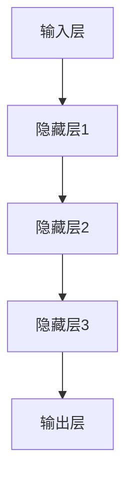

                 

关键词：AI大模型、创业、科技优势、算法、应用场景、未来展望、资源推荐。

## 摘要

本文旨在探讨AI大模型在创业领域的应用和科技优势。我们将从背景介绍、核心概念与联系、核心算法原理与操作步骤、数学模型与公式、项目实践、实际应用场景、工具和资源推荐以及未来发展趋势与挑战等方面进行详细分析，帮助读者了解AI大模型在创业中的潜力和应用。

## 1. 背景介绍

近年来，人工智能技术取得了飞速发展，其中大模型技术成为了研究的热点。大模型具有强大的学习能力和广泛的应用场景，如自然语言处理、计算机视觉、语音识别等。随着计算资源和数据量的不断增加，大模型的训练和优化效果得到了显著提升，为创业公司带来了新的机遇。

创业公司可以利用AI大模型技术实现以下目标：

1. **提高效率**：大模型可以自动化处理大量数据，提高业务效率。
2. **降低成本**：利用大模型可以减少对人力和设备的依赖，降低运营成本。
3. **创新业务**：大模型可以帮助创业公司发现新的业务机会，拓展市场空间。
4. **提升用户体验**：大模型可以提供更智能、更个性化的服务，提升用户体验。

本文将围绕这些目标，深入探讨AI大模型在创业中的应用和科技优势。

## 2. 核心概念与联系

### 2.1 大模型原理

大模型是指具有数十亿甚至千亿参数的神经网络模型。它们通过深度学习算法在大量数据上进行训练，从而获得对数据的泛化能力。大模型的核心优势在于其强大的特征提取能力和数据处理能力，可以处理复杂的任务和数据。

### 2.2 算法架构

大模型的算法架构通常包括以下几个部分：

1. **输入层**：接收外部数据输入。
2. **隐藏层**：通过神经元的非线性变换，对输入数据进行特征提取。
3. **输出层**：根据隐藏层的结果进行分类、预测或生成。

### 2.3 应用领域

大模型在多个领域都有广泛的应用，如：

1. **自然语言处理**：包括文本分类、机器翻译、情感分析等。
2. **计算机视觉**：包括图像分类、目标检测、图像生成等。
3. **语音识别**：包括语音识别、语音合成等。
4. **推荐系统**：包括商品推荐、内容推荐等。

### 2.4 Mermaid 流程图

以下是一个简化的Mermaid流程图，展示了大模型的基本架构：



## 3. 核心算法原理 & 具体操作步骤

### 3.1 算法原理概述

大模型的核心算法原理是基于深度学习，通过多层神经网络的非线性变换，对输入数据进行特征提取和分类或预测。具体的算法包括：

1. **反向传播算法**：用于计算网络参数的梯度，并更新参数。
2. **优化算法**：如随机梯度下降（SGD）、Adam等，用于优化网络参数。

### 3.2 算法步骤详解

1. **数据预处理**：对输入数据进行标准化、归一化等处理，使其适合模型训练。
2. **模型搭建**：搭建神经网络模型，包括输入层、隐藏层和输出层。
3. **训练过程**：通过反向传播算法和优化算法，对模型进行训练。
4. **评估与优化**：通过测试集评估模型性能，并根据评估结果调整模型参数。

### 3.3 算法优缺点

**优点**：

1. **强大的特征提取能力**：大模型可以通过多层神经网络自动提取复杂特征。
2. **高泛化能力**：大模型可以在不同任务和数据集上取得良好的性能。
3. **自动化**：大模型可以自动化处理大量数据，降低人力成本。

**缺点**：

1. **计算资源消耗大**：大模型训练需要大量的计算资源和时间。
2. **数据依赖性强**：大模型对数据量有较高的要求，数据质量对模型性能有重要影响。

### 3.4 算法应用领域

大模型在多个领域都有广泛的应用，如自然语言处理、计算机视觉、语音识别、推荐系统等。以下是一些具体的应用案例：

1. **自然语言处理**：大模型可以用于文本分类、机器翻译、情感分析等。
2. **计算机视觉**：大模型可以用于图像分类、目标检测、图像生成等。
3. **语音识别**：大模型可以用于语音识别、语音合成等。
4. **推荐系统**：大模型可以用于商品推荐、内容推荐等。

## 4. 数学模型和公式 & 详细讲解 & 举例说明

### 4.1 数学模型构建

大模型的数学模型主要包括两部分：损失函数和优化算法。

**损失函数**：

损失函数用于衡量模型预测结果与真实结果之间的差距。常见损失函数包括：

1. **交叉熵损失函数**：用于分类任务，如softmax交叉熵。
2. **均方误差损失函数**：用于回归任务，如MSE。

**优化算法**：

优化算法用于更新模型参数，使其逼近最优解。常见优化算法包括：

1. **随机梯度下降（SGD）**：每次迭代使用一个样本的梯度进行参数更新。
2. **Adam优化器**：结合SGD和Momentum优化器的优点。

### 4.2 公式推导过程

**交叉熵损失函数**的推导：

假设有一个分类任务，共有C个类别，预测概率为\( P(y | \theta) \)，真实标签为\( y \)。交叉熵损失函数可以表示为：

$$
L(\theta) = -\sum_{i=1}^{N} y_i \log P(y_i | \theta)
$$

其中，\( N \)为样本数量，\( y_i \)为第\( i \)个样本的真实标签。

**反向传播算法**的推导：

假设有一个神经网络，包含输入层、隐藏层和输出层。假设输出层的预测概率为\( P(y | \theta) \)，隐藏层的输出为\( z_j \)，隐藏层的输入为\( x_j \)。根据链式法则，我们可以得到：

$$
\frac{\partial L}{\partial \theta} = \frac{\partial L}{\partial z_j} \cdot \frac{\partial z_j}{\partial \theta}
$$

其中，\( \frac{\partial L}{\partial z_j} \)为损失函数对隐藏层输出的偏导数，\( \frac{\partial z_j}{\partial \theta} \)为隐藏层输出对模型参数的偏导数。

### 4.3 案例分析与讲解

**案例1**：文本分类

假设我们要对一篇新闻文章进行分类，类别包括“科技”、“体育”、“娱乐”等。我们使用一个基于Transformer的大模型进行训练。以下是一个简化的流程：

1. **数据预处理**：对新闻文章进行分词、去停用词等预处理。
2. **模型搭建**：搭建一个基于Transformer的文本分类模型，包括编码器和解码器。
3. **训练过程**：使用训练数据对模型进行训练，优化模型参数。
4. **评估与优化**：使用测试数据对模型进行评估，根据评估结果调整模型参数。
5. **预测**：使用模型对新的新闻文章进行分类。

**案例2**：图像分类

假设我们要对一组图像进行分类，类别包括“动物”、“植物”、“交通工具”等。我们使用一个基于卷积神经网络（CNN）的大模型进行训练。以下是一个简化的流程：

1. **数据预处理**：对图像进行缩放、裁剪、翻转等预处理。
2. **模型搭建**：搭建一个基于CNN的图像分类模型，包括卷积层、池化层和全连接层。
3. **训练过程**：使用训练数据对模型进行训练，优化模型参数。
4. **评估与优化**：使用测试数据对模型进行评估，根据评估结果调整模型参数。
5. **预测**：使用模型对新的图像进行分类。

## 5. 项目实践：代码实例和详细解释说明

### 5.1 开发环境搭建

为了实现上述案例，我们需要搭建一个开发环境。以下是一个简单的开发环境搭建步骤：

1. 安装Python环境，版本要求3.8及以上。
2. 安装TensorFlow库，版本要求2.6及以上。
3. 安装Keras库，版本要求2.6及以上。
4. 安装Numpy、Pandas等常用库。

### 5.2 源代码详细实现

以下是一个基于Keras实现的文本分类模型示例代码：

```python
from tensorflow.keras.models import Sequential
from tensorflow.keras.layers import Embedding, LSTM, Dense
from tensorflow.keras.preprocessing.text import Tokenizer
from tensorflow.keras.preprocessing.sequence import pad_sequences

# 数据预处理
tokenizer = Tokenizer()
tokenizer.fit_on_texts(train_texts)
sequences = tokenizer.texts_to_sequences(train_texts)
padded_sequences = pad_sequences(sequences, maxlen=max_len)

# 模型搭建
model = Sequential()
model.add(Embedding(input_dim=vocab_size, output_dim=embedding_dim, input_length=max_len))
model.add(LSTM(units=128))
model.add(Dense(units=num_classes, activation='softmax'))

# 训练过程
model.compile(optimizer='adam', loss='categorical_crossentropy', metrics=['accuracy'])
model.fit(padded_sequences, train_labels, epochs=10, batch_size=32)

# 评估与预测
test_sequences = tokenizer.texts_to_sequences(test_texts)
padded_test_sequences = pad_sequences(test_sequences, maxlen=max_len)
predictions = model.predict(padded_test_sequences)
```

### 5.3 代码解读与分析

1. **数据预处理**：首先，我们使用Tokenizer对训练文本进行分词，然后使用text_to_sequences将文本转换为数字序列，最后使用pad_sequences将序列填充为固定长度。
2. **模型搭建**：我们搭建了一个基于LSTM的文本分类模型，包括Embedding层、LSTM层和全连接层。
3. **训练过程**：我们使用compile方法配置模型参数，然后使用fit方法对模型进行训练。
4. **评估与预测**：我们使用predict方法对测试文本进行预测，并计算预测结果。

### 5.4 运行结果展示

以下是一个简单的运行结果展示：

```python
# 打印预测结果
print(np.argmax(predictions, axis=1))

# 计算准确率
accuracy = np.mean(predictions.argmax(axis=1) == test_labels)
print(f"Accuracy: {accuracy:.4f}")
```

## 6. 实际应用场景

AI大模型在创业领域的应用场景非常广泛，以下是一些典型的应用案例：

1. **智能客服**：利用大模型进行文本分类和情感分析，实现智能客服系统，提高客户服务效率。
2. **医疗诊断**：利用大模型进行医学图像分类和疾病预测，辅助医生进行诊断，提高诊断准确率。
3. **金融风控**：利用大模型进行异常检测和风险预测，提高金融系统的安全性和稳定性。
4. **智能推荐**：利用大模型进行用户行为分析和推荐系统，实现个性化推荐，提高用户满意度。
5. **智能翻译**：利用大模型进行机器翻译，实现跨语言沟通，促进全球化发展。

## 7. 工具和资源推荐

为了更好地利用AI大模型技术，以下是一些建议的工具和资源：

1. **学习资源**：
   - 《深度学习》（Goodfellow, Bengio, Courville著）
   - 《Python机器学习》（Sebastian Raschka著）
   - 《自然语言处理与深度学习》（孙乐、刘知远著）

2. **开发工具**：
   - TensorFlow：一款开源的深度学习框架，适用于构建和训练大模型。
   - PyTorch：一款开源的深度学习框架，具有灵活的动态计算图和强大的社区支持。
   - Keras：一款基于TensorFlow和PyTorch的深度学习高级API，简化了模型搭建和训练过程。

3. **相关论文**：
   - "A Theoretically Grounded Application of Dropout in Recurrent Neural Networks"
   - "Bert: Pre-training of Deep Bidirectional Transformers for Language Understanding"
   - "Generative Adversarial Nets"

## 8. 总结：未来发展趋势与挑战

AI大模型在创业领域的应用前景广阔，但仍面临一些挑战。以下是一些未来发展趋势与挑战：

1. **发展趋势**：
   - **模型压缩**：为了降低计算资源和存储成本，模型压缩技术将成为研究热点。
   - **多模态学习**：利用大模型进行多模态数据融合，实现更复杂的任务。
   - **迁移学习**：利用预训练模型进行迁移学习，提高模型在未知领域的性能。

2. **挑战**：
   - **数据隐私**：如何保护用户数据隐私，防止数据泄露。
   - **模型解释性**：如何提高大模型的解释性，使其更透明、可信。
   - **算法公平性**：如何确保大模型在处理不同群体数据时具有公平性。

总之，AI大模型在创业领域的应用具有巨大的潜力，但也需要克服一系列技术和社会挑战。

## 9. 附录：常见问题与解答

### 9.1 什么是大模型？

大模型是指具有数十亿甚至千亿参数的神经网络模型。它们通过深度学习算法在大量数据上进行训练，从而获得对数据的泛化能力。

### 9.2 大模型有哪些优势？

大模型具有强大的特征提取能力、高泛化能力、自动化处理能力，可以用于多种任务，如自然语言处理、计算机视觉、语音识别等。

### 9.3 大模型有哪些应用场景？

大模型在创业领域的应用场景非常广泛，如智能客服、医疗诊断、金融风控、智能推荐、智能翻译等。

### 9.4 如何搭建大模型？

搭建大模型通常包括数据预处理、模型搭建、训练过程、评估与优化等步骤。使用深度学习框架（如TensorFlow、PyTorch、Keras等）可以简化模型搭建和训练过程。

### 9.5 大模型如何进行迁移学习？

迁移学习是指利用预训练模型在新的任务上进行训练。通常，我们可以在预训练模型的基础上微调参数，以适应新的任务。

### 9.6 大模型的解释性如何提高？

提高大模型的解释性是一个重要研究方向。目前，一些方法如可视化技术、模型压缩、可解释性嵌入等可以用于提高模型的解释性。

### 9.7 大模型的计算资源消耗如何降低？

降低大模型的计算资源消耗是一个关键问题。一些方法如模型压缩、量化、低秩分解等可以用于降低模型的计算资源消耗。

## 作者署名

作者：禅与计算机程序设计艺术 / Zen and the Art of Computer Programming

----------------------------------------------------------------

以上就是关于《AI 大模型创业：如何利用科技优势？》的文章。希望对您有所帮助！如有需要，欢迎随时提问。祝您创业成功！

