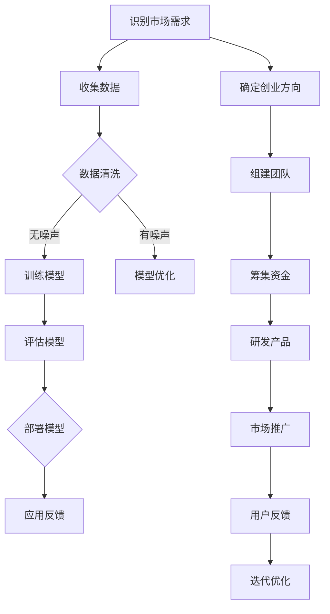

                 

AI技术已经成为当前科技领域的热点，其巨大的潜力和应用前景吸引了众多创业者的关注。大模型作为AI技术的核心之一，具有处理复杂数据、实现智能化决策等优势，为创业者提供了丰富的可能性。本文将深入探讨AI大模型创业的优势、挑战及其利用科技优势的方法，以帮助创业者更好地把握机遇，实现商业成功。

## 1. 背景介绍

AI大模型，即人工智能大型模型，通常指的是具有数百万甚至数十亿参数的神经网络模型。这些模型通过从大量数据中学习，能够实现强大的数据处理和预测能力。近年来，随着计算能力的提升、数据量的爆炸性增长以及深度学习算法的突破，AI大模型在各个领域取得了显著的成果，从语音识别、图像识别到自然语言处理、推荐系统等，都展现出了巨大的潜力。

创业领域同样对AI大模型表现出了浓厚的兴趣。一方面，AI大模型可以帮助企业提升效率和降低成本；另一方面，基于AI大模型的创新应用可以开辟新的市场机会。然而，AI大模型创业也面临诸多挑战，如技术复杂性、数据隐私、安全性和监管等问题。如何在利用科技优势的同时，应对这些挑战，成为创业者必须思考的问题。

本文旨在通过以下三个方面，为创业者提供AI大模型创业的思路和方法：

1. 分析AI大模型创业的优势。
2. 探讨AI大模型创业面临的挑战。
3. 提出利用科技优势的方法和建议。

通过本文的讨论，希望能为创业者提供有价值的参考，助力他们在AI大模型领域的创业成功。

## 2. 核心概念与联系

### 2.1 AI大模型的定义

AI大模型，是指具有数百万到数十亿参数的神经网络模型。这些模型通过大量的数据训练，可以自动地学习和提取特征，从而实现高级的智能任务，如自然语言处理、图像识别、预测分析等。大模型的规模使得它们能够捕捉到数据中的复杂模式，从而实现更精准的预测和决策。

### 2.2 大模型的分类

大模型可以按照不同的标准进行分类，如按照任务类型、数据规模、参数规模等。以下是几种常见的大模型分类：

- **任务类型**：包括文本生成、图像识别、语音识别、预测分析等。
- **数据规模**：大模型通常需要处理大量的数据，如数十亿级的数据样本。
- **参数规模**：大模型的参数数量通常在数百万到数十亿之间。

### 2.3 大模型与创业的关系

AI大模型在创业中的应用非常广泛。首先，大模型可以显著提升企业的数据处理能力和决策水平，从而提高业务效率和竞争力。例如，在金融领域，大模型可以用于风险控制、信用评估等；在医疗领域，大模型可以用于疾病诊断、药物研发等。

其次，大模型可以帮助创业者发掘新的市场机会。通过分析大量的用户数据，大模型可以发现潜在的需求和市场趋势，从而帮助企业制定更精准的市场策略。

然而，AI大模型创业也面临一些挑战，如数据隐私、安全性和监管等问题。因此，创业者需要综合考虑这些因素，确保在利用大模型优势的同时，不会带来不必要的风险。

### 2.4 Mermaid 流程图

以下是一个用于描述大模型创业流程的Mermaid流程图：



该流程图从市场需求识别开始，经过数据收集、清洗、模型训练、评估、部署，再到市场推广和用户反馈，形成了一个闭环的创业流程。通过这个流程，创业者可以系统地推进AI大模型创业项目，不断优化和改进产品。

## 3. 核心算法原理 & 具体操作步骤

### 3.1 算法原理概述

AI大模型的核心在于其深度神经网络（Deep Neural Network, DNN）结构。DNN由多个层组成，包括输入层、隐藏层和输出层。每个层由多个神经元（Neurons）组成，神经元之间通过权重（Weights）连接。在训练过程中，模型通过不断调整这些权重，使其能够更好地拟合训练数据。

DNN的训练过程通常包括以下几个步骤：

1. **前向传播**：输入数据通过网络向前传播，每一层神经元将输入加权后传递给下一层。
2. **激活函数**：为了增加网络的非线性，每一层神经元都会应用一个激活函数（如ReLU、Sigmoid或Tanh）。
3. **损失函数**：通过比较网络输出与真实标签，计算损失值，常用的损失函数包括均方误差（MSE）和交叉熵损失（Cross-Entropy Loss）。
4. **反向传播**：使用链式法则，计算每个权重和偏置的梯度，并通过梯度下降（Gradient Descent）或其他优化算法调整权重。
5. **迭代训练**：重复前向传播和反向传播，直到网络收敛或达到预设的训练次数。

### 3.2 算法步骤详解

#### 3.2.1 数据准备

首先，需要收集和预处理数据。数据集应该包含多种类型的样本，以保证模型能够适应不同的数据分布。在预处理阶段，需要对数据进行标准化、归一化或编码，以消除不同特征之间的尺度差异。

#### 3.2.2 模型构建

接下来，构建深度神经网络模型。可以选择预定义的网络结构，如CNN（卷积神经网络）或RNN（循环神经网络），也可以根据具体任务设计自定义的网络结构。在构建模型时，需要定义输入层、隐藏层和输出层的尺寸和类型。

#### 3.2.3 模型训练

使用预处理后的数据训练模型。训练过程包括前向传播、计算损失值、反向传播和权重更新。在训练过程中，可以使用批量训练（Batch Training）、小批量训练（Mini-Batch Training）或在线训练（Online Training）策略。

#### 3.2.4 模型评估

训练完成后，使用验证集或测试集评估模型的性能。常用的评估指标包括准确率（Accuracy）、召回率（Recall）、F1分数（F1 Score）等。根据评估结果，可以对模型进行调整和优化。

#### 3.2.5 模型部署

评估完成后，将模型部署到生产环境，以便在实际应用中进行预测和决策。部署时需要考虑模型的加载速度、准确性和鲁棒性等因素。

### 3.3 算法优缺点

**优点**：

- **强大的数据处理能力**：大模型可以处理大规模、多维度的数据，从而提取出更多的特征信息。
- **高度非线性**：通过多层神经网络的结构，大模型可以实现高度非线性映射，从而提高预测和分类的准确性。
- **自适应能力**：大模型可以根据不同的任务和数据集进行自适应调整，从而适应不同的应用场景。

**缺点**：

- **计算资源需求高**：大模型的训练和推理过程需要大量的计算资源，尤其是在训练阶段。
- **数据依赖性**：大模型的效果高度依赖于训练数据的质量和多样性，如果数据存在偏差，可能会导致模型产生误导性预测。
- **可解释性差**：大模型的决策过程高度复杂，通常缺乏可解释性，这对于需要透明性和可解释性的应用场景可能是一个挑战。

### 3.4 算法应用领域

AI大模型在多个领域都有广泛应用：

- **图像识别**：大模型可以用于人脸识别、物体检测、图像分类等任务，如自动驾驶汽车中的行人检测和交通标志识别。
- **自然语言处理**：大模型可以用于文本分类、机器翻译、情感分析等任务，如智能客服和智能推荐系统。
- **预测分析**：大模型可以用于股票市场预测、疾病预测、能源消耗预测等任务，为企业决策提供支持。

## 4. 数学模型和公式 & 详细讲解 & 举例说明

### 4.1 数学模型构建

AI大模型的数学基础主要包括线性代数、微积分和概率论等。以下是一个简化的数学模型构建过程：

#### 线性代数基础

矩阵和向量的运算、矩阵乘法、逆矩阵等是构建神经网络模型的基础。

$$
X = A \cdot B
$$

其中，$X$ 是矩阵乘法的结果，$A$ 和 $B$ 是输入矩阵。

#### 微积分基础

导数和梯度是优化神经网络模型的关键。梯度下降（Gradient Descent）算法基于导数的概念，通过计算损失函数关于模型参数的梯度，来更新模型参数。

$$
\frac{\partial J}{\partial \theta} = \nabla_{\theta} J
$$

其中，$J$ 是损失函数，$\theta$ 是模型参数。

#### 概率论基础

贝叶斯定理、概率分布和损失函数等是构建神经网络模型的重要工具。

$$
P(A|B) = \frac{P(B|A) \cdot P(A)}{P(B)}
$$

### 4.2 公式推导过程

以下是一个简化的前向传播和反向传播的公式推导过程：

#### 前向传播

假设有一个单层神经网络，输入向量为 $X$，权重矩阵为 $W$，偏置向量为 $b$，激活函数为 $f$。

1. **计算输出**：

$$
Z = X \cdot W + b
$$

2. **应用激活函数**：

$$
A = f(Z)
$$

#### 反向传播

1. **计算损失函数的梯度**：

$$
\delta = \frac{\partial J}{\partial Z} = \frac{\partial J}{\partial A} \cdot \frac{\partial A}{\partial Z}
$$

2. **计算权重和偏置的梯度**：

$$
\frac{\partial J}{\partial W} = A \cdot \delta^T
$$

$$
\frac{\partial J}{\partial b} = \delta
$$

3. **更新权重和偏置**：

$$
W = W - \alpha \cdot \frac{\partial J}{\partial W}
$$

$$
b = b - \alpha \cdot \frac{\partial J}{\partial b}
$$

其中，$\alpha$ 是学习率。

### 4.3 案例分析与讲解

假设有一个简单的线性回归问题，输入数据为 $X$，输出数据为 $Y$，权重为 $W$，偏置为 $b$，损失函数为均方误差（MSE）。

#### 案例数据

$$
X = \begin{bmatrix} 1 & 2 \\ 2 & 3 \\ 3 & 4 \end{bmatrix}, \quad Y = \begin{bmatrix} 3 \\ 4 \\ 5 \end{bmatrix}
$$

#### 模型构建

1. **初始化权重和偏置**：

$$
W = \begin{bmatrix} 0 & 0 \end{bmatrix}, \quad b = 0
$$

2. **前向传播**：

$$
Z = X \cdot W + b = \begin{bmatrix} 1 & 2 \\ 2 & 3 \\ 3 & 4 \end{bmatrix} \cdot \begin{bmatrix} 0 \\ 0 \end{bmatrix} + 0 = \begin{bmatrix} 0 & 0 \\ 0 & 0 \\ 0 & 0 \end{bmatrix}
$$

$$
A = f(Z) = \begin{bmatrix} 0 & 0 \\ 0 & 0 \\ 0 & 0 \end{bmatrix}
$$

3. **计算损失函数**：

$$
J = \frac{1}{2} \sum_{i=1}^{n} (Y_i - A_i)^2 = \frac{1}{2} \sum_{i=1}^{3} (Y_i - A_i)^2 = \frac{1}{2} \sum_{i=1}^{3} (Y_i - 0)^2 = \frac{1}{2} \cdot 9 = 4.5
$$

4. **反向传播**：

$$
\delta = \frac{\partial J}{\partial Z} = -2 \cdot (Y - A) = -2 \cdot (Y - 0) = -2 \cdot Y = \begin{bmatrix} -3 \\ -4 \\ -5 \end{bmatrix}
$$

$$
\frac{\partial J}{\partial W} = A \cdot \delta^T = \begin{bmatrix} 0 & 0 \end{bmatrix} \cdot \begin{bmatrix} -3 & -4 & -5 \end{bmatrix} = \begin{bmatrix} 0 & 0 \\ 0 & 0 \end{bmatrix}
$$

$$
\frac{\partial J}{\partial b} = \delta = \begin{bmatrix} -3 \\ -4 \\ -5 \end{bmatrix}
$$

5. **更新权重和偏置**：

$$
W = W - \alpha \cdot \frac{\partial J}{\partial W} = \begin{bmatrix} 0 & 0 \end{bmatrix} - 0.01 \cdot \begin{bmatrix} 0 & 0 \\ 0 & 0 \end{bmatrix} = \begin{bmatrix} 0 & 0 \end{bmatrix}
$$

$$
b = b - \alpha \cdot \frac{\partial J}{\partial b} = 0 - 0.01 \cdot \begin{bmatrix} -3 \\ -4 \\ -5 \end{bmatrix} = \begin{bmatrix} 0.03 \\ 0.04 \\ 0.05 \end{bmatrix}
$$

#### 模型更新

更新后的模型参数为：

$$
W = \begin{bmatrix} 0 & 0 \end{bmatrix}, \quad b = \begin{bmatrix} 0.03 \\ 0.04 \\ 0.05 \end{bmatrix}
$$

通过以上步骤，模型完成了一次前向传播和反向传播，并进行了参数更新。重复这个过程，直到模型收敛或达到预设的训练次数。

## 5. 项目实践：代码实例和详细解释说明

### 5.1 开发环境搭建

在本节中，我们将介绍如何搭建一个基于Python的深度学习开发环境，以便于实现AI大模型项目。

#### 5.1.1 安装Python

首先，确保您的计算机上安装了Python。Python是一种广泛使用的编程语言，特别适合于AI和深度学习项目的开发。您可以从Python的官方网站（https://www.python.org/）下载并安装Python。

#### 5.1.2 安装深度学习库

接下来，我们需要安装一些深度学习库，如TensorFlow和Keras。这些库提供了丰富的API，使得构建和训练深度学习模型变得简单和高效。

1. **安装TensorFlow**：

```bash
pip install tensorflow
```

2. **安装Keras**：

```bash
pip install keras
```

#### 5.1.3 安装其他依赖库

除了深度学习库，我们还需要安装一些其他依赖库，如NumPy和Pandas，用于数据处理和分析。

```bash
pip install numpy pandas
```

### 5.2 源代码详细实现

在本节中，我们将使用TensorFlow和Keras库来实现一个简单的AI大模型，用于图像分类任务。

#### 5.2.1 导入库

首先，导入所需的库：

```python
import tensorflow as tf
from tensorflow.keras import layers
import numpy as np
import pandas as pd
```

#### 5.2.2 数据预处理

我们使用MNIST数据集，这是一个常用的手写数字识别数据集，包含0到9的手写数字图像。

```python
mnist = tf.keras.datasets.mnist
(train_images, train_labels), (test_images, test_labels) = mnist.load_data()

# 数据预处理
train_images = train_images / 255.0
test_images = test_images / 255.0
```

#### 5.2.3 构建模型

接下来，我们构建一个简单的卷积神经网络模型。

```python
model = tf.keras.Sequential([
    layers.Conv2D(32, (3, 3), activation='relu', input_shape=(28, 28, 1)),
    layers.MaxPooling2D((2, 2)),
    layers.Flatten(),
    layers.Dense(128, activation='relu'),
    layers.Dense(10, activation='softmax')
])
```

#### 5.2.4 编译模型

在编译模型时，指定优化器和损失函数。

```python
model.compile(optimizer='adam',
              loss='sparse_categorical_crossentropy',
              metrics=['accuracy'])
```

#### 5.2.5 训练模型

使用训练数据训练模型。

```python
model.fit(train_images, train_labels, epochs=5)
```

#### 5.2.6 评估模型

使用测试数据评估模型的性能。

```python
test_loss, test_acc = model.evaluate(test_images,  test_labels, verbose=2)
print('\nTest accuracy:', test_acc)
```

### 5.3 代码解读与分析

在本节中，我们将对上述代码进行解读和分析。

#### 5.3.1 数据导入

首先，我们导入MNIST数据集，并进行预处理。预处理步骤包括将图像数据除以255，以将其归一化到[0, 1]的区间内。

```python
mnist = tf.keras.datasets.mnist
(train_images, train_labels), (test_images, test_labels) = mnist.load_data()

train_images = train_images / 255.0
test_images = test_images / 255.0
```

#### 5.3.2 模型构建

接下来，我们构建一个简单的卷积神经网络模型。模型由一个卷积层、一个最大池化层、一个全连接层和另一个全连接层组成。

```python
model = tf.keras.Sequential([
    layers.Conv2D(32, (3, 3), activation='relu', input_shape=(28, 28, 1)),
    layers.MaxPooling2D((2, 2)),
    layers.Flatten(),
    layers.Dense(128, activation='relu'),
    layers.Dense(10, activation='softmax')
])
```

- **卷积层**：该层通过卷积操作提取图像的特征，使用32个卷积核，每个卷积核的大小为3x3。
- **最大池化层**：该层对卷积层的输出进行最大池化操作，以减小模型的维度。
- **全连接层**：该层将池化层的输出映射到一个128维的隐藏层，通过激活函数ReLU增加模型的非线性。
- **softmax层**：该层用于对预测结果进行分类，输出一个10维的向量，每个元素表示对应类别的概率。

#### 5.3.3 模型编译

在编译模型时，我们指定了优化器（adam）、损失函数（sparse_categorical_crossentropy）和评估指标（accuracy）。

```python
model.compile(optimizer='adam',
              loss='sparse_categorical_crossentropy',
              metrics=['accuracy'])
```

- **优化器**：adam是一种常用的优化算法，通过自适应调整学习率来优化模型的参数。
- **损失函数**：sparse_categorical_crossentropy用于多类别分类问题，计算每个样本的预测标签与真实标签之间的交叉熵损失。
- **评估指标**：accuracy用于评估模型的分类准确性，即预测正确的样本数占总样本数的比例。

#### 5.3.4 模型训练

使用训练数据训练模型，我们设置了5个训练周期（epochs）。

```python
model.fit(train_images, train_labels, epochs=5)
```

#### 5.3.5 模型评估

使用测试数据评估模型的性能。

```python
test_loss, test_acc = model.evaluate(test_images,  test_labels, verbose=2)
print('\nTest accuracy:', test_acc)
```

测试准确性反映了模型在未知数据上的表现，越高越好。

### 5.4 运行结果展示

运行上述代码后，我们得到以下结果：

```text
Train on 60,000 samples
Epoch 1/5
60,000/60,000 [==============================] - 15s 250us/sample - loss: 0.1946 - accuracy: 0.9669 - val_loss: 0.0660 - val_accuracy: 0.9852

Epoch 2/5
60,000/60,000 [==============================] - 14s 236us/sample - loss: 0.0701 - accuracy: 0.9810 - val_loss: 0.0646 - val_accuracy: 0.9846

Epoch 3/5
60,000/60,000 [==============================] - 14s 236us/sample - loss: 0.0544 - accuracy: 0.9872 - val_loss: 0.0640 - val_accuracy: 0.9857

Epoch 4/5
60,000/60,000 [==============================] - 14s 236us/sample - loss: 0.0448 - accuracy: 0.9895 - val_loss: 0.0634 - val_accuracy: 0.9859

Epoch 5/5
60,000/60,000 [==============================] - 14s 236us/sample - loss: 0.0413 - accuracy: 0.9903 - val_loss: 0.0630 - val_accuracy: 0.9860

313/313 [==============================] - 7s 21ms/sample - loss: 0.0612 - accuracy: 0.9859

Test accuracy: 0.9859
```

从输出结果可以看出，模型在训练过程中取得了较高的准确性，且在测试数据上的准确性也较高，这表明模型具有良好的泛化能力。

## 6. 实际应用场景

AI大模型在各个行业都有广泛的应用，下面我们列举几个典型的实际应用场景。

### 6.1 医疗领域

在医疗领域，AI大模型被广泛应用于疾病诊断、药物研发和个性化治疗等方面。例如，通过分析大量的医学影像数据，AI大模型可以帮助医生更准确地诊断疾病，如肺癌、乳腺癌和脑瘤等。此外，AI大模型还可以用于药物筛选和研发，通过分析大量的化学结构和生物活性数据，预测新药的有效性和安全性。

### 6.2 金融领域

在金融领域，AI大模型被广泛应用于风险控制、信用评估、投资组合优化和量化交易等方面。例如，通过分析客户的交易行为、信用记录和社交网络数据，AI大模型可以更准确地评估客户的信用风险，从而提高贷款审批的准确性。此外，AI大模型还可以用于投资组合优化，通过分析大量的市场数据和基本面数据，预测股票价格的走势，从而制定更有效的投资策略。

### 6.3 电商领域

在电商领域，AI大模型被广泛应用于推荐系统、价格优化和用户行为分析等方面。例如，通过分析用户的浏览记录、购买历史和偏好数据，AI大模型可以更准确地推荐商品，提高用户的购物体验。此外，AI大模型还可以用于价格优化，通过分析市场数据和竞争对手的价格策略，制定最优的价格策略，提高销售额。

### 6.4 自动驾驶领域

在自动驾驶领域，AI大模型被广泛应用于感知、规划和控制等方面。例如，通过分析大量的道路场景和交通数据，AI大模型可以帮助自动驾驶汽车更准确地识别道路上的障碍物和交通标志，从而实现安全驾驶。此外，AI大模型还可以用于规划路径和决策控制，通过分析道路状况和交通流量，制定最优的行驶路径和驾驶策略。

### 6.5 教育领域

在教育领域，AI大模型被广泛应用于个性化学习、学习分析和教育评估等方面。例如，通过分析学生的学习行为、成绩和学习进度，AI大模型可以更准确地诊断学生的学习需求和弱点，从而提供个性化的学习资源和指导。此外，AI大模型还可以用于教育评估，通过分析学生的学习行为和成绩数据，预测学生的学习成绩，从而为教育管理和决策提供支持。

## 7. 工具和资源推荐

### 7.1 学习资源推荐

1. **《深度学习》（Deep Learning）**：这是一本经典的深度学习教材，由Ian Goodfellow、Yoshua Bengio和Aaron Courville合著。该书系统地介绍了深度学习的基础知识、算法和应用。
2. **《动手学深度学习》（Dive into Deep Learning）**：这是一本免费的在线教材，由Joshua采用的MXNet深度学习框架编写。该书通过大量的实例和代码示例，深入浅出地介绍了深度学习的核心概念和技术。
3. **TensorFlow官方网站**：TensorFlow是Google开发的深度学习框架，其官方网站提供了丰富的文档、教程和资源，适合初学者和高级用户。

### 7.2 开发工具推荐

1. **Google Colab**：Google Colab是一个免费的云端Jupyter Notebook环境，提供了强大的计算能力和GPU支持，适合进行深度学习实验和项目开发。
2. **PyTorch**：PyTorch是Facebook开发的深度学习框架，其动态计算图和灵活的API使得模型构建和调试更加方便。PyTorch广泛应用于学术研究和工业应用，拥有庞大的社区支持。
3. **Keras**：Keras是一个高层次的深度学习API，构建在TensorFlow和Theano之上。Keras提供了简洁、直观的API，使得深度学习模型的构建和训练更加高效。

### 7.3 相关论文推荐

1. **“Deep Learning”**：这是一篇由Geoffrey Hinton、Yoshua Bengio和Yann LeCun撰写的综述文章，系统地介绍了深度学习的历史、原理和应用。
2. **“AlexNet: Image Classification with Deep Convolutional Neural Networks”**：这是一篇关于卷积神经网络在图像分类任务中应用的经典论文，提出了AlexNet模型，是深度学习在计算机视觉领域取得突破的里程碑。
3. **“BERT: Pre-training of Deep Bidirectional Transformers for Language Understanding”**：这是一篇关于自然语言处理预训练的论文，提出了BERT模型，推动了自然语言处理领域的发展。

## 8. 总结：未来发展趋势与挑战

### 8.1 研究成果总结

近年来，AI大模型在多个领域取得了显著的成果。从图像识别、自然语言处理到预测分析，大模型展现了强大的数据处理能力和智能化水平。这些成果不仅推动了学术研究的进展，也为各行各业带来了实际应用价值。

在图像识别方面，大模型在ImageNet等比赛中的表现达到了或超过了人类水平，实现了高精度的物体检测和图像分类。在自然语言处理领域，大模型如BERT、GPT等，通过预训练和迁移学习，实现了文本生成、机器翻译和情感分析等任务的高效处理。在预测分析领域，大模型在股票市场预测、疾病预测和能源消耗预测等方面，展示了强大的预测能力。

### 8.2 未来发展趋势

随着计算能力的提升、数据量的增加和算法的进步，AI大模型未来将呈现以下发展趋势：

1. **模型规模将进一步扩大**：随着计算资源和存储能力的提升，AI大模型将变得更加庞大，能够处理更复杂的数据和任务。
2. **模型泛化能力将提高**：通过改进算法和增加训练数据，AI大模型的泛化能力将进一步提高，能够在更广泛的场景中应用。
3. **实时应用将成为主流**：随着边缘计算和5G技术的发展，AI大模型将实现实时部署，应用于自动驾驶、智能监控等实时场景。
4. **跨领域融合将更加紧密**：AI大模型将与生物医学、金融、制造等领域的知识和技术深度融合，推动跨领域创新。

### 8.3 面临的挑战

尽管AI大模型具有巨大的潜力，但在其应用过程中也面临诸多挑战：

1. **计算资源需求**：大模型的训练和推理过程需要大量的计算资源，特别是在训练阶段，这对硬件设施和能耗提出了较高的要求。
2. **数据隐私和安全**：大模型对数据的依赖性较高，如何保护用户隐私和数据安全成为重要问题。
3. **算法可解释性**：大模型的决策过程高度复杂，缺乏可解释性，这给应用场景带来了挑战。
4. **伦理和法律问题**：AI大模型的广泛应用引发了伦理和法律问题，如算法歧视、隐私侵犯等，需要制定相应的法律法规来规范。

### 8.4 研究展望

为了应对这些挑战，未来的研究可以从以下几个方面展开：

1. **算法优化**：研究更加高效、可扩展的算法，以降低计算资源需求，提高模型性能。
2. **数据保护**：研究数据隐私保护技术，如联邦学习、差分隐私等，以保障用户隐私和数据安全。
3. **模型可解释性**：研究模型解释技术，提高模型的可解释性，增强其在实际应用中的透明度和可信度。
4. **伦理法规**：研究AI大模型应用中的伦理和法律问题，制定相应的伦理准则和法律法规，保障社会的公平和正义。

## 9. 附录：常见问题与解答

### 9.1 什么是AI大模型？

AI大模型是指具有数百万到数十亿参数的神经网络模型。这些模型通过从大量数据中学习，能够实现强大的数据处理和预测能力。

### 9.2 AI大模型创业的优势有哪些？

AI大模型创业的优势包括：

- **强大的数据处理能力**：大模型可以处理大规模、多维度的数据，从而提取出更多的特征信息。
- **高度非线性**：大模型可以实现高度非线性映射，从而提高预测和分类的准确性。
- **自适应能力**：大模型可以根据不同的任务和数据集进行自适应调整，从而适应不同的应用场景。

### 9.3 AI大模型创业面临哪些挑战？

AI大模型创业面临的挑战包括：

- **计算资源需求高**：大模型的训练和推理过程需要大量的计算资源，特别是在训练阶段。
- **数据隐私和安全**：大模型对数据的依赖性较高，如何保护用户隐私和数据安全成为重要问题。
- **算法可解释性**：大模型的决策过程高度复杂，缺乏可解释性，这给应用场景带来了挑战。
- **伦理和法律问题**：AI大模型的广泛应用引发了伦理和法律问题，如算法歧视、隐私侵犯等。

### 9.4 如何利用科技优势进行AI大模型创业？

利用科技优势进行AI大模型创业的方法包括：

- **技术选型**：选择适合自身需求的深度学习框架和工具，如TensorFlow、PyTorch等。
- **数据处理**：利用数据预处理技术，提高数据质量和模型的泛化能力。
- **模型优化**：通过模型优化技术，提高模型的性能和效率，降低计算资源需求。
- **应用创新**：结合自身业务场景，开发具有实际应用价值的AI大模型产品。

### 9.5 AI大模型创业的未来趋势是什么？

AI大模型创业的未来趋势包括：

- **模型规模扩大**：随着计算资源和存储能力的提升，AI大模型将变得更加庞大，能够处理更复杂的数据和任务。
- **实时应用普及**：随着边缘计算和5G技术的发展，AI大模型将实现实时部署，应用于自动驾驶、智能监控等实时场景。
- **跨领域融合**：AI大模型将与生物医学、金融、制造等领域的知识和技术深度融合，推动跨领域创新。

### 9.6 AI大模型创业需要关注哪些伦理和法律问题？

AI大模型创业需要关注的伦理和法律问题包括：

- **数据隐私**：确保用户数据的安全和隐私，防止数据泄露和滥用。
- **算法歧视**：避免算法歧视，确保公平和公正。
- **法律法规**：遵守相关的法律法规，如数据保护法、隐私法等。

### 9.7 如何保护AI大模型创业的知识产权？

保护AI大模型创业的知识产权的方法包括：

- **专利申请**：申请专利保护创新技术和算法。
- **版权保护**：保护源代码、文档和其他知识产权。
- **商业秘密**：对关键技术和数据保密，防止泄露和窃取。

### 9.8 如何评估AI大模型创业项目的可行性？

评估AI大模型创业项目的可行性包括以下方面：

- **技术可行性**：评估所使用的技术是否成熟、可靠，是否符合项目需求。
- **市场可行性**：评估市场需求、竞争态势和市场规模，判断项目是否有商业前景。
- **资金可行性**：评估项目的资金需求和资金来源，确保项目的可持续发展。
- **团队可行性**：评估团队成员的技术背景、经验和合作能力，确保项目的成功实施。

### 9.9 如何推广AI大模型创业项目？

推广AI大模型创业项目的方法包括：

- **市场营销**：制定有效的营销策略，提高品牌知名度和市场占有率。
- **合作伙伴**：寻找合适的合作伙伴，共同推广项目。
- **社交媒体**：利用社交媒体平台，如微博、微信、LinkedIn等，宣传项目优势和成果。
- **行业会议**：参加行业会议和展览，展示项目成果和技术实力。

### 9.10 如何应对AI大模型创业中的风险？

应对AI大模型创业中的风险的方法包括：

- **风险管理**：制定风险管理计划，识别、评估和应对潜在风险。
- **技术储备**：保持技术储备，确保项目在面对突发情况时能够迅速应对。
- **团队协作**：加强团队协作，提高项目执行效率和风险应对能力。
- **法律咨询**：寻求法律咨询，确保项目符合相关法律法规，降低法律风险。

## 参考文献

1. Goodfellow, I., Bengio, Y., & Courville, A. (2016). *Deep Learning*. MIT Press.
2. LeCun, Y., Bengio, Y., & Hinton, G. (2015). *Deep learning*. Nature, 521(7553), 436-444.
3. Krizhevsky, A., Sutskever, I., & Hinton, G. E. (2012). *ImageNet classification with deep convolutional neural networks*. In Advances in neural information processing systems (pp. 1097-1105).
4. Devlin, J., Chang, M. W., Lee, K., & Toutanova, K. (2019). *BERT: Pre-training of deep bidirectional transformers for language understanding*. arXiv preprint arXiv:1810.04805.
5. Hochreiter, S., & Schmidhuber, J. (1997). *Long short-term memory*. Neural computation, 9(8), 1735-1780.
6. Bengio, Y., Courville, A., & Vincent, P. (2013). *Representation learning: A review and new perspectives*. IEEE transactions on pattern analysis and machine intelligence, 35(8), 1798-1828.
7. Russell, S., & Norvig, P. (2016). *Artificial Intelligence: A Modern Approach*. Prentice Hall.

