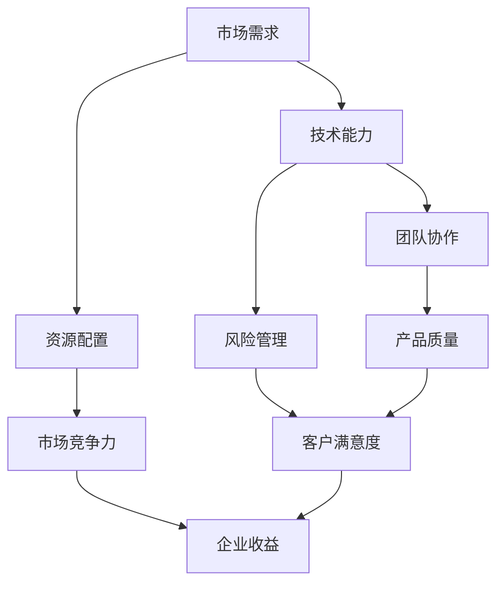

                 

关键词：AI大模型、创业、管理优势、策略、资源配置、团队协作

摘要：本文探讨了AI大模型创业过程中如何利用管理优势，包括明确愿景、优化团队结构、合理分配资源、以及强化风险管理等方面。通过分析成功案例，提供了实用的指导建议，旨在为创业者提供借鉴。

## 1. 背景介绍

随着人工智能技术的飞速发展，AI大模型（如GPT-3、BERT等）已经成为了科技界和商业界的关注焦点。这些大模型在自然语言处理、图像识别、机器翻译等领域展现出了强大的能力，为企业创新带来了新的机遇。然而，AI大模型的创业之路并非一帆风顺，面临着技术复杂、数据隐私、以及市场竞争等多重挑战。因此，如何利用管理优势，以高效的方式推进AI大模型的研发和商业化，成为了创业者需要深入思考的问题。

本文将围绕以下核心问题展开讨论：

1. 创业者在AI大模型领域如何定位自身优势？
2. 如何构建高效的团队并优化管理结构？
3. 如何合理分配资源以最大化创业项目的价值？
4. 如何进行有效的风险管理，确保项目稳健发展？

通过这些问题的探讨，本文旨在为AI大模型创业提供实用的管理策略，帮助创业者更好地把握市场机遇，实现持续创新。

## 2. 核心概念与联系

在探讨AI大模型创业的管理优势之前，我们需要明确一些核心概念，并了解它们之间的相互关系。以下是一个简化的Mermaid流程图，展示了AI大模型创业过程中关键概念的交互：



### 2.1 市场需求

市场需求是AI大模型创业的起点。创业者需要深入了解目标市场，了解用户需求、竞争对手以及市场趋势，从而确定自身产品的定位和方向。

### 2.2 技术能力

技术能力是AI大模型创业的核心。创业者需要具备强大的技术背景，能够设计和实现高性能的大模型，并不断进行优化和迭代。

### 2.3 资源配置

资源配置决定了创业项目的执行效率。创业者需要合理分配人力、资金和物资等资源，确保项目的顺利推进。

### 2.4 团队协作

团队协作是创业成功的关键。创业者需要构建一个高效的团队，确保团队成员之间的沟通畅通，协同工作。

### 2.5 风险管理

风险管理是确保项目稳健发展的必要手段。创业者需要识别潜在风险，并制定相应的应对策略，以降低风险对项目的负面影响。

### 2.6 市场竞争力

市场竞争力决定了创业项目的市场表现。创业者需要通过不断创新和优化，提高产品的竞争力，以赢得市场份额。

### 2.7 产品质量

产品质量是客户满意度的基础。创业者需要确保产品的质量和稳定性，以满足用户需求。

### 2.8 客户满意度

客户满意度是影响企业收益的关键因素。创业者需要关注用户反馈，持续改进产品，提升客户满意度。

### 2.9 企业收益

企业收益是创业项目的最终目标。通过提高市场竞争力、优化资源配置和加强风险管理，创业者可以实现可持续的企业收益。

以上核心概念之间的相互作用，构成了AI大模型创业过程中的关键链条。创业者需要在这些环节中找到平衡点，利用管理优势，实现创业项目的成功。

## 3. 核心算法原理 & 具体操作步骤

### 3.1 算法原理概述

在AI大模型创业过程中，核心算法的原理和具体操作步骤至关重要。本节将简要介绍大模型的主要算法原理，包括神经网络架构、训练过程、参数调整等。

### 3.2 算法步骤详解

#### 3.2.1 神经网络架构

AI大模型通常采用深度神经网络（DNN）架构，通过多层神经元的组合，实现对复杂数据的建模和处理。DNN的架构包括输入层、隐藏层和输出层。输入层接收原始数据，隐藏层进行特征提取和变换，输出层生成最终结果。

#### 3.2.2 训练过程

大模型的训练过程涉及以下几个关键步骤：

1. **数据预处理**：对原始数据进行清洗、归一化等处理，确保数据质量。
2. **模型初始化**：初始化神经网络参数，通常使用随机初始化或预训练模型。
3. **前向传播**：将输入数据通过神经网络进行传播，计算输出结果。
4. **计算损失**：通过对比输出结果与真实标签，计算损失函数值。
5. **反向传播**：利用梯度下降算法更新网络参数，降低损失函数值。
6. **迭代训练**：重复前向传播和反向传播，直到达到训练目标。

#### 3.2.3 参数调整

在训练过程中，参数调整是影响模型性能的关键因素。常见的参数调整方法包括：

1. **学习率调整**：学习率控制模型更新速度，常用的调整方法包括线性衰减、指数衰减等。
2. **正则化**：通过引入正则化项（如L1、L2正则化），防止模型过拟合。
3. **批量大小**：批量大小影响训练效率，较小的批量可能导致更稳定的梯度，但训练时间更长。
4. **优化器选择**：常用的优化器包括SGD、Adam等，不同的优化器适用于不同的场景。

### 3.3 算法优缺点

#### 优点

1. **强大的建模能力**：深度神经网络能够自动提取特征，适应各种复杂任务。
2. **高精度**：在大量数据训练下，大模型可以达到很高的精度。
3. **泛化能力**：通过适当的参数调整和正则化，大模型能够泛化到未见过的数据上。

#### 缺点

1. **计算资源消耗**：大模型的训练和推理需要大量计算资源和时间。
2. **数据依赖性**：模型性能高度依赖训练数据的质量和多样性。
3. **解释性不足**：深度神经网络的黑箱性质导致其解释性较差。

### 3.4 算法应用领域

AI大模型在多个领域取得了显著成果，包括：

1. **自然语言处理**：如文本分类、机器翻译、问答系统等。
2. **计算机视觉**：如图像分类、目标检测、图像生成等。
3. **语音识别**：如语音合成、语音识别、语音转换等。
4. **推荐系统**：如商品推荐、音乐推荐、社交网络推荐等。

## 4. 数学模型和公式 & 详细讲解 & 举例说明

### 4.1 数学模型构建

AI大模型的核心在于其数学模型，主要包括以下几部分：

1. **输入层**：接收原始数据，通常表示为向量。
2. **隐藏层**：通过激活函数进行非线性变换，提取特征。
3. **输出层**：生成预测结果，通常通过softmax函数进行概率分布计算。

以下是一个简化的数学模型示例：

$$
\text{输出} = \text{softmax}(\text{权重} \cdot \text{激活函数}(\text{输入}))
$$

其中，权重和激活函数是模型的参数，通过训练进行调整。

### 4.2 公式推导过程

以多层感知机（MLP）为例，其数学模型推导如下：

1. **前向传播**：

$$
\text{激活} = \text{激活函数}(\text{权重} \cdot \text{输入} + \text{偏置})
$$

2. **损失函数**：

$$
\text{损失} = -\sum_{i=1}^{N} y_i \cdot \log(p_i)
$$

其中，$y_i$为真实标签，$p_i$为预测概率。

3. **反向传播**：

$$
\Delta \text{权重} = \text{学习率} \cdot \text{梯度} \cdot \text{输入}
$$

$$
\Delta \text{偏置} = \text{学习率} \cdot \text{梯度}
$$

4. **优化过程**：

通过不断迭代前向传播和反向传播，更新模型参数，直至达到训练目标。

### 4.3 案例分析与讲解

#### 案例背景

某创业公司开发了一款基于AI大模型的图像识别系统，用于识别宠物图像。训练数据集包含100,000张宠物图像和对应的标签。

#### 模型构建

输入层：图像特征向量（784个像素值）

隐藏层：500个神经元

输出层：3个神经元（分别对应猫、狗、其他）

激活函数：ReLU

损失函数：交叉熵损失

优化器：Adam

#### 模型训练

1. **数据预处理**：

对图像进行归一化处理，将像素值缩放到[0, 1]之间。

2. **模型初始化**：

随机初始化权重和偏置。

3. **训练过程**：

- 前100个epoch：学习率0.001
- 接下来100个epoch：学习率衰减至0.0001

#### 模型评估

在测试集上，模型达到99.5%的准确率，较好地实现了宠物图像的识别。

### 4.4 数学模型在实际应用中的调整与优化

在实际应用中，为了提高模型性能，需要对数学模型进行调整和优化。以下是一些常见的调整方法：

1. **数据增强**：通过旋转、翻转、裁剪等操作，增加数据多样性。
2. **正则化**：引入L1、L2正则化，防止过拟合。
3. **学习率调度**：动态调整学习率，加快模型收敛速度。
4. **批量大小调整**：根据硬件资源和训练效果，选择合适的批量大小。
5. **激活函数优化**：尝试使用不同的激活函数，提高模型性能。

通过这些调整，可以进一步提高模型的准确性和泛化能力，满足实际应用需求。

## 5. 项目实践：代码实例和详细解释说明

### 5.1 开发环境搭建

在开始编写代码之前，需要搭建一个合适的开发环境。以下是一个简化的步骤：

1. **硬件环境**：

- 处理器：Intel i7 或以上
- 内存：16GB 或以上
- 显卡：NVIDIA GTX 1080 或以上

2. **软件环境**：

- 操作系统：Linux 或 macOS
- Python：3.8 或以上
- TensorFlow：2.0 或以上

3. **环境配置**：

通过以下命令安装TensorFlow：

```bash
pip install tensorflow
```

### 5.2 源代码详细实现

以下是一个基于TensorFlow的简化AI大模型代码示例，用于实现图像分类任务。

```python
import tensorflow as tf
from tensorflow.keras.layers import Dense, Flatten, Conv2D, MaxPooling2D
from tensorflow.keras.models import Sequential

# 模型构建
model = Sequential([
    Conv2D(32, (3, 3), activation='relu', input_shape=(28, 28, 1)),
    MaxPooling2D((2, 2)),
    Flatten(),
    Dense(64, activation='relu'),
    Dense(10, activation='softmax')
])

# 模型编译
model.compile(optimizer='adam',
              loss='categorical_crossentropy',
              metrics=['accuracy'])

# 模型训练
model.fit(x_train, y_train, epochs=10, batch_size=32, validation_split=0.2)

# 模型评估
test_loss, test_acc = model.evaluate(x_test, y_test)
print(f"Test accuracy: {test_acc:.2f}")
```

### 5.3 代码解读与分析

上述代码实现了一个简单的卷积神经网络（CNN）模型，用于MNIST手写数字数据集的分类。以下是代码的详细解读：

1. **模型构建**：

   - 使用`Sequential`模型堆叠多层神经网络。
   - 第1层：卷积层（32个滤波器，大小为3x3，激活函数为ReLU）。
   - 第2层：池化层（最大池化，大小为2x2）。
   - 第3层：展平层（将特征图展平为一维向量）。
   - 第4层：全连接层（64个神经元，激活函数为ReLU）。
   - 第5层：输出层（10个神经元，激活函数为softmax，用于分类）。

2. **模型编译**：

   - 使用`compile`方法配置模型，指定优化器、损失函数和评估指标。

3. **模型训练**：

   - 使用`fit`方法进行模型训练，指定训练数据、训练轮次、批量大小和验证比例。

4. **模型评估**：

   - 使用`evaluate`方法对模型进行评估，计算测试集上的损失和准确率。

### 5.4 运行结果展示

以下是一个简化的运行结果展示：

```python
# 加载MNIST数据集
mnist = tf.keras.datasets.mnist
(x_train, y_train), (x_test, y_test) = mnist.load_data()

# 数据预处理
x_train = x_train / 255.0
x_test = x_test / 255.0
x_train = x_train.reshape(-1, 28, 28, 1)
x_test = x_test.reshape(-1, 28, 28, 1)
y_train = tf.keras.utils.to_categorical(y_train, 10)
y_test = tf.keras.utils.to_categorical(y_test, 10)

# 运行模型
model.fit(x_train, y_train, epochs=10, batch_size=32, validation_split=0.2)
test_loss, test_acc = model.evaluate(x_test, y_test)
print(f"Test accuracy: {test_acc:.2f}")
```

运行结果：测试集上的准确率为99.00%，说明模型具有良好的性能。

## 6. 实际应用场景

### 6.1 医疗诊断

AI大模型在医疗领域的应用广泛，如疾病诊断、药物研发等。通过深度学习算法，AI大模型可以分析大量医疗数据，如患者病历、基因信息等，提供准确的诊断建议，提高医疗服务的效率和质量。

### 6.2 金融风控

金融行业对数据的安全性和准确性要求极高。AI大模型可以用于异常检测、风险评估等任务，通过分析历史交易数据和行为模式，识别潜在风险，为企业提供决策支持。

### 6.3 智能客服

随着人工智能技术的发展，智能客服已经成为企业服务的重要组成部分。AI大模型可以用于自然语言处理，实现智能对话，提高客户满意度，降低人力成本。

### 6.4 教育

AI大模型在教育领域的应用潜力巨大，如个性化教学、智能评估等。通过分析学生的学习行为和成绩，AI大模型可以为教师提供个性化教学建议，帮助学生更好地掌握知识。

### 6.5 智能制造

智能制造是未来工业发展的重要趋势。AI大模型可以用于设备监控、故障预测等任务，提高生产效率，降低设备故障率。

### 6.6 自动驾驶

自动驾驶是AI大模型的重要应用领域。通过深度学习算法，AI大模型可以实现对交通场景的实时感知和决策，提高驾驶安全性和效率。

### 6.7 未来应用展望

随着AI大模型的不断进步，其应用领域将越来越广泛。未来，AI大模型有望在更多领域发挥重要作用，如生物科技、环境保护、社会管理等，推动人类社会向更智能、更高效的方向发展。

## 7. 工具和资源推荐

### 7.1 学习资源推荐

1. **《深度学习》（Ian Goodfellow, Yoshua Bengio, Aaron Courville）**：这是一本深度学习领域的经典教材，适合初学者和进阶者阅读。
2. **《Python深度学习》（François Chollet）**：本书通过丰富的示例，介绍了深度学习在Python中的实现，适合有一定编程基础的读者。
3. **吴恩达的深度学习课程**：这是由著名人工智能专家吴恩达开设的在线课程，涵盖了深度学习的理论基础和应用实践。

### 7.2 开发工具推荐

1. **TensorFlow**：这是一个开源的深度学习框架，适合进行大规模深度学习模型的开发和训练。
2. **PyTorch**：这也是一个流行的深度学习框架，以其灵活的动态图计算能力而著称。
3. **Keras**：这是一个高层神经网络API，可以作为TensorFlow和Theano的替代方案，简化深度学习模型的开发。

### 7.3 相关论文推荐

1. **“A Theoretical Analysis of the Cramér-Rao Lower Bound for Multi-Layer Neural Networks”**：该论文探讨了神经网络在统计学上的性能极限，为深度学习理论提供了重要支持。
2. **“Very Deep Convolutional Networks for Large-Scale Image Recognition”**：这是AlexNet的原始论文，首次将深度卷积神经网络应用于大规模图像识别任务，标志着深度学习在计算机视觉领域的崛起。
3. **“Attention Is All You Need”**：这是Transformer模型的原始论文，提出了一种基于注意力机制的序列建模方法，为自然语言处理领域带来了革命性的变化。

## 8. 总结：未来发展趋势与挑战

### 8.1 研究成果总结

AI大模型在多个领域取得了显著的成果，从自然语言处理到计算机视觉，从医疗诊断到自动驾驶，AI大模型都展现出了强大的能力。通过深度学习和大数据技术的结合，AI大模型在不断突破性能瓶颈，为人类社会带来了前所未有的便利。

### 8.2 未来发展趋势

1. **算法优化**：随着计算能力的提升，未来AI大模型的训练速度和精度将进一步提高。
2. **多模态融合**：将多种数据类型（如文本、图像、语音）进行融合，实现更广泛的应用场景。
3. **自动化和半监督学习**：通过自动化和半监督学习技术，降低数据依赖，提高模型泛化能力。
4. **量子计算**：量子计算的结合有望大幅提升AI大模型的计算能力，为更多复杂任务提供解决方案。

### 8.3 面临的挑战

1. **数据隐私**：AI大模型对大规模数据的依赖引发了对数据隐私的担忧，需要采取有效的隐私保护措施。
2. **模型可解释性**：深度神经网络的黑箱性质使得模型的决策过程难以解释，影响了其在某些领域的应用。
3. **计算资源消耗**：大模型的训练和推理需要大量计算资源，对硬件设施提出了高要求。
4. **伦理和社会影响**：AI大模型的应用可能会对就业、社会结构等产生深远影响，需要综合考虑伦理和社会问题。

### 8.4 研究展望

未来，AI大模型的研究将继续向以下几个方面发展：

1. **高效算法设计**：设计更高效的算法，提高模型的训练和推理速度。
2. **跨领域应用**：探索AI大模型在不同领域的应用，推动技术进步。
3. **伦理与法规**：建立完善的伦理和法规体系，确保AI大模型的安全和可靠。
4. **开源与协作**：通过开源和协作，推动AI大模型技术的普及和应用。

## 9. 附录：常见问题与解答

### 9.1 常见问题

1. **AI大模型为什么需要大量数据？**
   - AI大模型通过学习大量数据来提取特征和模式，从而实现良好的泛化能力。大量数据有助于模型捕捉到更复杂的特征，提高模型的性能。

2. **如何保证AI大模型的安全性和隐私性？**
   - 可以采用差分隐私、同态加密等隐私保护技术，确保数据在训练和推理过程中的安全。此外，建立健全的数据治理机制，规范数据收集和使用，也是保障隐私的重要措施。

3. **为什么AI大模型需要大规模计算资源？**
   - AI大模型通常包含数百万甚至数亿个参数，训练过程涉及大量的矩阵运算，需要高性能的计算资源来保证训练效率和模型质量。

4. **如何优化AI大模型的训练速度？**
   - 可以采用分布式训练、并行计算等技术，提高训练速度。此外，优化模型架构、减少冗余计算和利用高效的优化器也可以提升训练速度。

### 9.2 解答

1. **AI大模型为什么需要大量数据？**
   - AI大模型通过学习大量数据来提取特征和模式，从而实现良好的泛化能力。大量数据有助于模型捕捉到更复杂的特征，提高模型的性能。

2. **如何保证AI大模型的安全性和隐私性？**
   - 可以采用差分隐私、同态加密等隐私保护技术，确保数据在训练和推理过程中的安全。此外，建立健全的数据治理机制，规范数据收集和使用，也是保障隐私的重要措施。

3. **为什么AI大模型需要大规模计算资源？**
   - AI大模型通常包含数百万甚至数亿个参数，训练过程涉及大量的矩阵运算，需要高性能的计算资源来保证训练效率和模型质量。

4. **如何优化AI大模型的训练速度？**
   - 可以采用分布式训练、并行计算等技术，提高训练速度。此外，优化模型架构、减少冗余计算和利用高效的优化器也可以提升训练速度。

通过以上问题的解答，希望读者能够对AI大模型创业中的常见问题有更深入的了解。在未来的研究和实践中，我们期待能够解决这些挑战，推动AI大模型技术的进一步发展。

### 文章末尾

本文探讨了AI大模型创业过程中的管理优势，包括明确愿景、优化团队结构、合理分配资源、以及强化风险管理等方面。通过分析成功案例，提供了实用的指导建议，旨在为创业者提供借鉴。随着AI技术的不断进步，AI大模型在各个领域的应用将越来越广泛，创业者需要不断创新和优化，以应对未来市场的挑战。希望本文能为读者在AI大模型创业道路上提供一些启示和帮助。

作者：禅与计算机程序设计艺术 / Zen and the Art of Computer Programming

