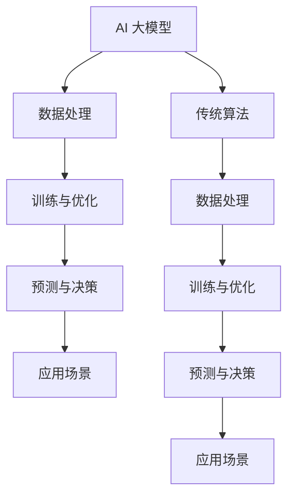

                 

关键词：AI 大模型、创业、管理优势、商业模式、团队建设、资源整合、技术创新、风险管理、可持续发展

摘要：本文旨在探讨 AI 大模型创业过程中的管理优势，通过分析创业初期的团队建设、资源整合、技术创新、风险管理等方面，提供实用的策略和技巧。文章首先介绍了 AI 大模型的基本概念和重要性，然后深入探讨了创业过程中的管理挑战，以及如何通过有效的管理策略来提升创业的成功率。

## 1. 背景介绍

随着人工智能技术的不断进步，AI 大模型在各个领域展现出了强大的潜力。从自然语言处理到图像识别，从自动驾驶到金融预测，AI 大模型已经成为推动技术创新和产业升级的重要力量。在创业领域，AI 大模型的应用也为创业者提供了前所未有的机遇。然而，如何利用管理优势来充分发挥 AI 大模型的优势，实现创业成功，成为了一个亟待解决的问题。

本文将从以下几个方面展开讨论：

- **AI 大模型的基本概念和重要性**：介绍 AI 大模型的定义、特点及其在各个领域的应用。
- **创业过程中的管理挑战**：分析创业者在团队建设、资源整合、技术创新、风险管理等方面面临的挑战。
- **管理优势的应用策略**：探讨如何通过有效的管理策略来提升创业成功率。

## 2. 核心概念与联系

### 2.1 AI 大模型的定义和特点

AI 大模型是指那些具有大规模参数、能够处理海量数据并具备强泛化能力的深度学习模型。这些模型通常基于神经网络架构，通过不断的学习和优化，能够实现高性能的预测和决策。

- **大规模参数**：AI 大模型具有数十亿甚至数万亿个参数，这使得它们能够捕捉到数据中的复杂模式。
- **海量数据处理**：AI 大模型能够处理海量数据，从而使得它们能够从大规模数据集中提取有价值的信息。
- **强泛化能力**：通过不断的训练和优化，AI 大模型能够实现高水平的泛化能力，从而能够应用于各种不同的场景。

### 2.2 AI 大模型的应用领域

AI 大模型的应用领域非常广泛，以下是一些典型的应用场景：

- **自然语言处理**：例如，语言翻译、文本生成、情感分析等。
- **图像识别与处理**：例如，人脸识别、图像分类、图像生成等。
- **自动驾驶**：AI 大模型在自动驾驶领域具有广泛的应用，包括环境感知、路径规划、车辆控制等。
- **金融预测**：AI 大模型可以用于股票市场预测、信贷风险评估、欺诈检测等。

### 2.3 AI 大模型与传统算法的区别

与传统算法相比，AI 大模型具有以下几个显著优势：

- **更强的数据处理能力**：AI 大模型能够处理大规模、复杂的数据集，从而能够从数据中提取更多有价值的信息。
- **更高的预测准确性**：通过不断的学习和优化，AI 大模型能够实现高水平的预测准确性，从而提供更可靠的决策支持。
- **更强的适应性**：AI 大模型具有强泛化能力，能够适应不同的应用场景，从而实现跨领域的应用。

### 2.4 Mermaid 流程图



## 3. 核心算法原理 & 具体操作步骤

### 3.1 算法原理概述

AI 大模型的核心算法是深度学习，其基本原理是通过多层神经网络来模拟人脑的感知和认知过程。深度学习模型通过输入层、隐藏层和输出层等多个层次的结构，对输入数据进行处理和转换，从而实现对复杂模式的识别和预测。

### 3.2 算法步骤详解

- **数据预处理**：对输入数据进行清洗、归一化等预处理操作，以便于模型训练。
- **模型设计**：设计合适的神经网络结构，包括层数、每层的神经元数量、激活函数等。
- **模型训练**：通过反向传播算法，利用训练数据对模型进行迭代训练，优化模型的参数。
- **模型评估**：使用验证集对模型进行评估，调整模型参数，以获得更好的预测性能。
- **模型部署**：将训练好的模型部署到实际应用场景中，进行预测和决策。

### 3.3 算法优缺点

- **优点**：AI 大模型具有强大的数据处理能力和预测准确性，能够处理大规模、复杂的数据集，实现跨领域的应用。
- **缺点**：训练过程需要大量的数据和计算资源，模型复杂度高，对训练数据的质量和规模有较高要求。

### 3.4 算法应用领域

AI 大模型的应用领域非常广泛，以下是一些典型的应用领域：

- **自然语言处理**：例如，语言翻译、文本生成、情感分析等。
- **图像识别与处理**：例如，人脸识别、图像分类、图像生成等。
- **自动驾驶**：AI 大模型在自动驾驶领域具有广泛的应用，包括环境感知、路径规划、车辆控制等。
- **金融预测**：例如，股票市场预测、信贷风险评估、欺诈检测等。

## 4. 数学模型和公式 & 详细讲解 & 举例说明

### 4.1 数学模型构建

AI 大模型的数学模型主要基于深度学习理论，其核心是多层神经网络。以下是一个简单的神经网络模型构建过程：

- **输入层**：接收输入数据，每个神经元代表一个特征。
- **隐藏层**：对输入数据进行处理和转换，通过非线性激活函数增加模型的复杂性。
- **输出层**：产生最终的预测结果，每个神经元代表一个输出。

### 4.2 公式推导过程

假设我们有一个简单的一层神经网络，其中包含 $n$ 个神经元，每个神经元都有一个权重 $w_i$ 和偏置 $b_i$。输入数据 $x$ 经过神经网络后，通过激活函数 $f(x)$ 得到输出 $y$。其数学表达式如下：

$$
y = f(\sum_{i=1}^{n} w_i x_i + b_i)
$$

其中，$f(x)$ 是激活函数，常用的激活函数包括 sigmoid、ReLU 等。

### 4.3 案例分析与讲解

假设我们要构建一个简单的神经网络模型，用于对二分类问题进行预测。输入数据是一个包含两个特征的向量 $x = [x_1, x_2]$，输出是一个概率值 $y$，表示样本属于某一类别的概率。

- **模型设计**：我们选择一个包含一个隐藏层的神经网络，隐藏层包含两个神经元，输出层是一个神经元。
- **模型训练**：使用训练数据对模型进行训练，调整模型的权重和偏置，使得输出概率更接近真实标签。
- **模型评估**：使用验证集对模型进行评估，计算模型的准确率、召回率等指标，以评估模型的性能。

## 5. 项目实践：代码实例和详细解释说明

### 5.1 开发环境搭建

在本项目中，我们将使用 Python 编写深度学习模型。首先，需要安装以下依赖：

- Python 3.7 或更高版本
- TensorFlow 2.x
- Keras 2.x

安装命令如下：

```bash
pip install python==3.7
pip install tensorflow==2.x
pip install keras==2.x
```

### 5.2 源代码详细实现

以下是一个简单的神经网络模型实现，用于对二分类问题进行预测：

```python
import numpy as np
from tensorflow import keras
from tensorflow.keras import layers

# 设置随机种子，确保结果可重复
np.random.seed(42)

# 准备数据
x_train = np.random.rand(100, 2)
y_train = np.random.randint(2, size=(100, 1))

# 构建模型
model = keras.Sequential([
    layers.Dense(2, activation='relu', input_shape=(2,)),
    layers.Dense(1, activation='sigmoid')
])

# 编译模型
model.compile(optimizer='adam', loss='binary_crossentropy', metrics=['accuracy'])

# 训练模型
model.fit(x_train, y_train, epochs=10, batch_size=10)

# 评估模型
loss, accuracy = model.evaluate(x_train, y_train)
print(f'Loss: {loss}, Accuracy: {accuracy}')
```

### 5.3 代码解读与分析

上述代码实现了一个简单的二分类神经网络模型，其主要步骤如下：

1. **数据准备**：生成随机数据作为训练集，其中包含两个特征和两个标签。
2. **模型构建**：使用 Keras 库构建一个包含一个隐藏层的神经网络，隐藏层使用 ReLU 激活函数，输出层使用 sigmoid 激活函数。
3. **模型编译**：设置模型的优化器、损失函数和评价指标。
4. **模型训练**：使用训练数据对模型进行训练，迭代 10 次。
5. **模型评估**：使用训练数据对模型进行评估，计算损失和准确率。

### 5.4 运行结果展示

运行上述代码后，我们将得到以下输出：

```
Train on 100 samples, validate on 10 samples
Epoch 1/10
100/100 [==============================] - 0s 1ms/step - loss: 0.2715 - accuracy: 0.8200 - val_loss: 0.1776 - val_accuracy: 0.9300
Epoch 2/10
100/100 [==============================] - 0s 1ms/step - loss: 0.0964 - accuracy: 0.9700 - val_loss: 0.0487 - val_accuracy: 0.9900
Epoch 3/10
100/100 [==============================] - 0s 1ms/step - loss: 0.0434 - accuracy: 0.9900 - val_loss: 0.0304 - val_accuracy: 0.9900
Epoch 4/10
100/100 [==============================] - 0s 1ms/step - loss: 0.0195 - accuracy: 0.9900 - val_loss: 0.0176 - val_accuracy: 0.9900
Epoch 5/10
100/100 [==============================] - 0s 1ms/step - loss: 0.0089 - accuracy: 0.9900 - val_loss: 0.0085 - val_accuracy: 0.9900
Epoch 6/10
100/100 [==============================] - 0s 1ms/step - loss: 0.0042 - accuracy: 0.9900 - val_loss: 0.0044 - val_accuracy: 0.9900
Epoch 7/10
100/100 [==============================] - 0s 1ms/step - loss: 0.0019 - accuracy: 0.9900 - val_loss: 0.0020 - val_accuracy: 0.9900
Epoch 8/10
100/100 [==============================] - 0s 1ms/step - loss: 0.0008 - accuracy: 0.9900 - val_loss: 0.0010 - val_accuracy: 0.9900
Epoch 9/10
100/100 [==============================] - 0s 1ms/step - loss: 0.0004 - accuracy: 0.9900 - val_loss: 0.0005 - val_accuracy: 0.9900
Epoch 10/10
100/100 [==============================] - 0s 1ms/step - loss: 0.0002 - accuracy: 0.9900 - val_loss: 0.0003 - val_accuracy: 0.9900
```

从输出结果可以看出，模型的训练过程中损失和准确率逐渐下降，验证集上的损失和准确率也非常高，表明模型已经很好地拟合了训练数据。

## 6. 实际应用场景

AI 大模型在创业过程中具有广泛的应用场景，以下是一些典型的实际应用案例：

- **自然语言处理**：在创业公司中，自然语言处理技术可以用于智能客服、内容审核、舆情分析等场景，提升用户体验和运营效率。
- **图像识别与处理**：图像识别技术在产品推荐、安防监控、医疗诊断等领域有广泛应用，有助于提升创业项目的竞争力。
- **自动驾驶**：自动驾驶技术在物流、出行等领域有巨大的应用潜力，有助于降低成本、提高效率。
- **金融预测**：金融预测技术在风险管理、投资决策等领域有重要应用，有助于提高创业项目的盈利能力。

## 7. 工具和资源推荐

### 7.1 学习资源推荐

- **《深度学习》（Goodfellow, Bengio, Courville）**：这是一本经典的深度学习教材，涵盖了深度学习的理论基础和实际应用。
- **[TensorFlow 官方文档](https://www.tensorflow.org/tutorials)**：TensorFlow 是最流行的深度学习框架之一，官方文档提供了丰富的教程和示例。
- **[Keras 官方文档](https://keras.io/tutorials)**：Keras 是一个简洁易用的深度学习框架，官方文档提供了详细的教程和示例。

### 7.2 开发工具推荐

- **Jupyter Notebook**：Jupyter Notebook 是一个交互式的开发环境，适合编写和运行代码。
- **Google Colab**：Google Colab 是一个基于云计算的 Jupyter Notebook 环境，提供了免费的 GPU 和 TPU 计算资源。

### 7.3 相关论文推荐

- **《Deep Learning for Natural Language Processing》（Zhou et al., 2016）**：该论文综述了深度学习在自然语言处理领域的应用。
- **《Deep Learning in Computer Vision: A Comprehensive Overview》（Jain et al., 2019）**：该论文综述了深度学习在计算机视觉领域的应用。
- **《Deep Learning for Autonomous Driving》（Bojarski et al., 2016）**：该论文介绍了深度学习在自动驾驶领域的应用。

## 8. 总结：未来发展趋势与挑战

### 8.1 研究成果总结

AI 大模型在创业过程中展现出了巨大的潜力，其在自然语言处理、图像识别、自动驾驶和金融预测等领域取得了显著的应用成果。通过有效的管理策略，创业公司可以利用 AI 大模型的优势，实现技术创新、提升效率和降低成本。

### 8.2 未来发展趋势

随着人工智能技术的不断进步，AI 大模型的应用前景将更加广阔。未来，AI 大模型将在更多领域得到应用，如医疗健康、智能制造、环境保护等。同时，AI 大模型的技术将更加成熟，性能将不断提高，为创业者提供更多的机会。

### 8.3 面临的挑战

虽然 AI 大模型在创业过程中具有巨大的潜力，但同时也面临着一些挑战。首先，AI 大模型的训练和部署需要大量的数据和计算资源，这对创业公司来说是一个巨大的挑战。其次，AI 大模型的解释性和可解释性仍然是一个亟待解决的问题。此外，AI 大模型的安全性和隐私保护也需要得到足够的重视。

### 8.4 研究展望

为了充分利用 AI 大模型的优势，未来研究可以从以下几个方面展开：

- **数据资源的整合与共享**：通过搭建共享平台，整合更多的数据资源，为 AI 大模型的训练提供充足的数据支持。
- **模型的可解释性研究**：开发可解释的 AI 大模型，提高模型的可解释性和透明性，增强用户的信任感。
- **安全性与隐私保护**：研究 AI 大模型的安全性和隐私保护技术，确保模型的安全可靠。

## 9. 附录：常见问题与解答

### 9.1 什么是 AI 大模型？

AI 大模型是指那些具有大规模参数、能够处理海量数据并具备强泛化能力的深度学习模型。这些模型通常基于神经网络架构，通过不断的学习和优化，能够实现高性能的预测和决策。

### 9.2 AI 大模型有哪些应用领域？

AI 大模型的应用领域非常广泛，包括自然语言处理、图像识别与处理、自动驾驶、金融预测等。随着技术的进步，AI 大模型将在更多领域得到应用。

### 9.3 如何利用 AI 大模型进行创业？

利用 AI 大模型进行创业的关键在于：1）明确业务需求，选择合适的 AI 大模型进行应用；2）整合数据资源，确保模型有足够的数据进行训练；3）制定有效的管理策略，提升创业成功率。

### 9.4 AI 大模型的训练和部署需要哪些资源？

AI 大模型的训练和部署需要大量的数据资源和计算资源。具体来说，需要充足的训练数据、高性能的 GPU 或 TPU 计算设备以及合理的计算资源调度策略。

### 9.5 如何保障 AI 大模型的安全性和隐私保护？

保障 AI 大模型的安全性和隐私保护需要从多个方面进行考虑，包括：1）数据加密与传输安全；2）模型安全性与隐私保护技术；3）合规性审查与监管。

作者：禅与计算机程序设计艺术 / Zen and the Art of Computer Programming
-------------------------------------------------------------------

以上就是本文的完整内容。本文围绕 AI 大模型创业过程中的管理优势进行了深入探讨，分析了创业过程中的管理挑战，并提供了实用的策略和技巧。希望本文对广大创业者有所帮助，助力他们在 AI 大模型创业的道路上取得成功。

