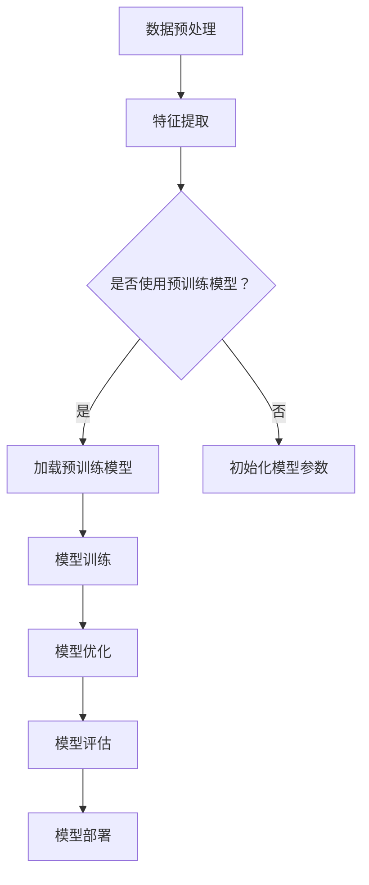
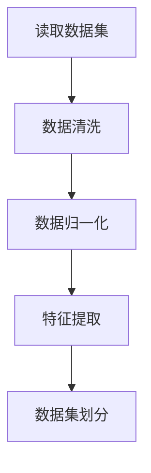
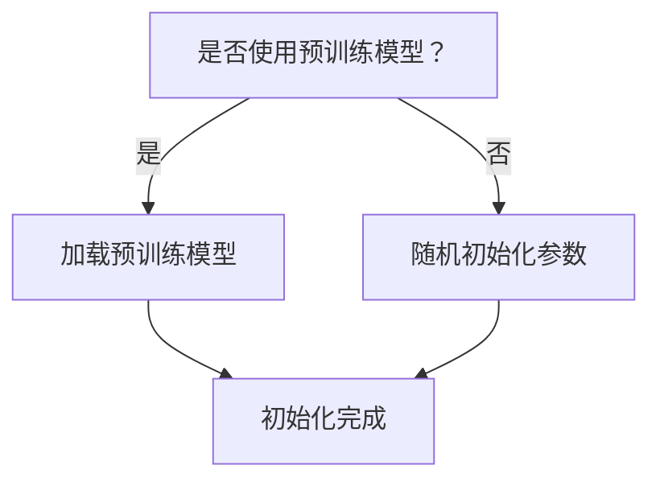
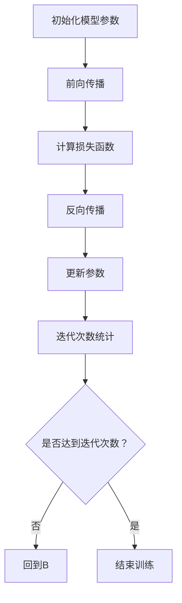
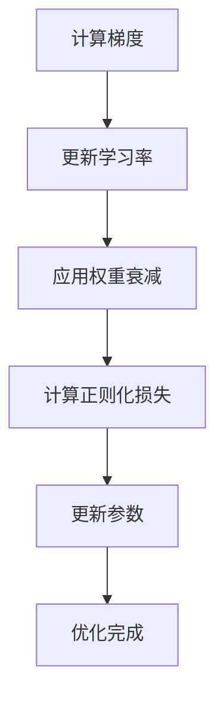
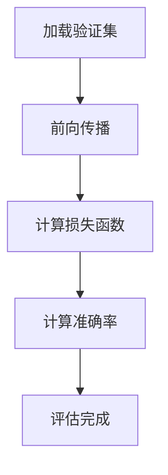
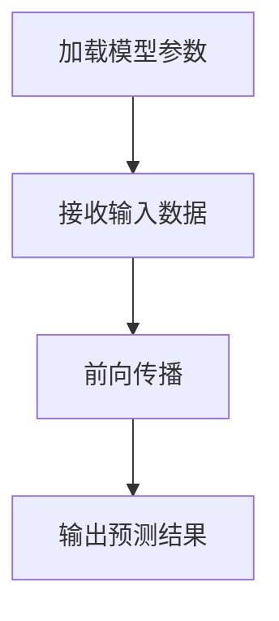

                 

关键词：AI 大模型、创业、经济优势、商业模式、技术创新、市场分析、策略规划

> 摘要：本文探讨了 AI 大模型在创业中的潜在经济优势，分析了如何利用这些优势来构建可持续的商业模式。文章将从背景介绍、核心概念与联系、核心算法原理、数学模型、项目实践、实际应用场景、工具和资源推荐、总结与展望等多个方面，为创业者和投资者提供有价值的参考。

## 1. 背景介绍

人工智能（AI）作为当今科技领域的核心驱动力，正深刻地影响着各个行业。其中，大模型（Large Models）作为 AI 技术的前沿，展现了巨大的潜力和市场价值。大模型通过深度学习算法，从海量数据中提取知识，进行复杂的模式识别和预测，已经在自然语言处理、计算机视觉、语音识别等领域取得了显著的突破。

随着 AI 技术的日益成熟，创业者和投资者开始关注如何利用 AI 大模型实现商业创新和经济增长。然而，AI 大模型创业面临着数据获取、算法优化、计算资源、商业模式等多重挑战。如何在有限的资源下，实现高效的技术创新和市场拓展，成为 AI 大模型创业的关键问题。

本文旨在分析 AI 大模型的经济优势，探讨如何利用这些优势构建可持续的商业模式，为 AI 大模型创业提供策略指导。

## 2. 核心概念与联系

在探讨 AI 大模型的经济优势之前，我们需要了解几个核心概念，包括人工智能、深度学习、神经网络、以及大模型的架构和原理。

### 人工智能（AI）

人工智能是指计算机系统模拟人类智能的过程，包括感知、学习、推理、决策等。AI 技术涵盖了多种方法和算法，其中深度学习（Deep Learning）是当前最为流行和有效的一种。

### 深度学习（Deep Learning）

深度学习是一种基于人工神经网络的机器学习技术，通过多层神经网络的结构，自动提取数据中的特征，进行高级的抽象和建模。深度学习在图像识别、自然语言处理、语音识别等领域取得了突破性的进展。

### 神经网络（Neural Networks）

神经网络是模仿人脑神经元连接方式的计算模型，通过调整连接权重，实现数据的分类、预测和优化。神经网络可以分为多层结构，其中深度神经网络（Deep Neural Networks，DNN）是深度学习的基础。

### 大模型（Large Models）

大模型是指参数规模超过数百万甚至数十亿的神经网络模型，它们可以从海量数据中学习复杂的模式，进行高度精确的预测和决策。大模型通常需要大量的计算资源和数据支持。

以下是一个 Mermaid 流程图，展示了大模型的架构和原理：



## 3. 核心算法原理 & 具体操作步骤

### 3.1 算法原理概述

AI 大模型的算法原理主要基于深度学习和神经网络。深度学习通过多层神经网络的结构，实现数据的特征提取和高级抽象。大模型通常包含数百万至数十亿的参数，这些参数通过训练过程进行调整，以实现最优的性能。

具体来说，大模型的训练过程可以分为以下几个步骤：

1. **数据预处理**：对原始数据进行清洗、归一化和特征提取，为模型训练准备高质量的数据集。
2. **模型初始化**：初始化模型的参数，通常使用预训练模型或随机初始化。
3. **模型训练**：使用梯度下降等优化算法，通过反向传播算法更新模型的参数。
4. **模型优化**：通过调整学习率、正则化等技术，优化模型的性能。
5. **模型评估**：使用验证集或测试集，评估模型的泛化能力和性能。
6. **模型部署**：将训练完成的模型部署到实际应用中，进行预测和决策。

### 3.2 算法步骤详解

1. **数据预处理**：



2. **模型初始化**：



3. **模型训练**：



4. **模型优化**：



5. **模型评估**：



6. **模型部署**：



### 3.3 算法优缺点

**优点**：

1. **强大的泛化能力**：大模型可以从海量数据中学习复杂的模式和规律，具有良好的泛化能力。
2. **高精度预测**：通过深度学习和神经网络的结构，大模型可以实现高精度的预测和决策。
3. **自适应能力**：大模型可以根据不同的应用场景和数据特点，进行自适应的调整和优化。

**缺点**：

1. **计算资源需求高**：大模型的训练和部署需要大量的计算资源和时间。
2. **数据需求量大**：大模型需要大量高质量的数据进行训练，数据获取和清洗成本较高。
3. **模型解释性较差**：大模型的决策过程较为复杂，模型的解释性较差。

### 3.4 算法应用领域

AI 大模型在多个领域取得了显著的成果，包括：

1. **自然语言处理**：例如，机器翻译、文本分类、情感分析等。
2. **计算机视觉**：例如，图像识别、目标检测、图像生成等。
3. **语音识别**：例如，语音转文字、语音合成等。
4. **医疗健康**：例如，疾病预测、医学图像分析等。
5. **金融科技**：例如，风险控制、投资策略等。

## 4. 数学模型和公式 & 详细讲解 & 举例说明

### 4.1 数学模型构建

AI 大模型的数学模型主要基于深度学习和神经网络。以下是神经网络的基本数学模型：

$$
\text{输出} = f(\sum_{i=1}^{n} w_i \cdot x_i + b)
$$

其中，$f$ 是激活函数，$w_i$ 是权重，$x_i$ 是输入特征，$b$ 是偏置。

### 4.2 公式推导过程

以下是一个简化的神经网络推导过程：

1. **前向传播**：

$$
z = \sum_{i=1}^{n} w_i \cdot x_i + b \\
a = f(z)
$$

2. **反向传播**：

$$
\Delta z = \frac{\partial L}{\partial z} \\
\Delta w = \alpha \cdot \frac{\partial L}{\partial w} \\
\Delta b = \alpha \cdot \frac{\partial L}{\partial b}
$$

其中，$L$ 是损失函数，$\alpha$ 是学习率。

3. **参数更新**：

$$
w = w - \Delta w \\
b = b - \Delta b
$$

### 4.3 案例分析与讲解

以下是一个简单的神经网络训练过程示例：

**数据集**：包含1000个样本，每个样本有10个特征。

**模型**：一个两层的神经网络，输入层有10个神经元，隐藏层有5个神经元，输出层有1个神经元。

**损失函数**：均方误差（MSE）。

**训练过程**：

1. **前向传播**：

   输入样本 $x$，通过输入层传递到隐藏层，然后传递到输出层。

2. **计算损失**：

   使用均方误差计算输出层的损失。

3. **反向传播**：

   从输出层开始，计算每个神经元的误差，然后反向传播到隐藏层和输入层。

4. **参数更新**：

   使用梯度下降算法更新权重和偏置。

5. **重复步骤 1-4**，直到模型收敛或达到训练次数。

## 5. 项目实践：代码实例和详细解释说明

### 5.1 开发环境搭建

为了实践 AI 大模型的构建和训练，我们需要搭建一个合适的开发环境。以下是搭建环境的基本步骤：

1. **安装 Python**：Python 是深度学习的主要编程语言，需要安装 Python 3.7 或以上版本。
2. **安装深度学习框架**：TensorFlow 和 PyTorch 是目前最流行的深度学习框架，选择其中一个进行安装。
3. **安装必要的库**：例如 NumPy、Pandas、Matplotlib 等，用于数据处理和可视化。
4. **配置 GPU 支持**：如果使用 GPU 进行训练，需要安装 CUDA 和 cuDNN，并配置 Python 和深度学习框架的 GPU 支持。

### 5.2 源代码详细实现

以下是一个简单的 AI 大模型训练代码示例，使用 PyTorch 深度学习框架：

```python
import torch
import torch.nn as nn
import torch.optim as optim
from torch.utils.data import DataLoader
from torchvision import datasets, transforms

# 定义模型结构
class SimpleModel(nn.Module):
    def __init__(self):
        super(SimpleModel, self).__init__()
        self.fc1 = nn.Linear(10, 5)
        self.fc2 = nn.Linear(5, 1)
    
    def forward(self, x):
        x = torch.relu(self.fc1(x))
        x = self.fc2(x)
        return x

# 初始化模型、损失函数和优化器
model = SimpleModel()
criterion = nn.MSELoss()
optimizer = optim.Adam(model.parameters(), lr=0.001)

# 加载训练数据和测试数据
train_data = datasets.MNIST(root='./data', train=True, transform=transforms.ToTensor(), download=True)
test_data = datasets.MNIST(root='./data', train=False, transform=transforms.ToTensor())

train_loader = DataLoader(dataset=train_data, batch_size=64, shuffle=True)
test_loader = DataLoader(dataset=test_data, batch_size=64, shuffle=False)

# 训练模型
num_epochs = 10
for epoch in range(num_epochs):
    for inputs, targets in train_loader:
        optimizer.zero_grad()
        outputs = model(inputs)
        loss = criterion(outputs, targets)
        loss.backward()
        optimizer.step()
    print(f'Epoch {epoch+1}/{num_epochs}, Loss: {loss.item()}')

# 测试模型
with torch.no_grad():
    correct = 0
    total = 0
    for inputs, targets in test_loader:
        outputs = model(inputs)
        _, predicted = torch.max(outputs.data, 1)
        total += targets.size(0)
        correct += (predicted == targets).sum().item()
    print(f'Accuracy: {100 * correct / total}%')
```

### 5.3 代码解读与分析

上述代码展示了如何使用 PyTorch 深度学习框架构建和训练一个简单的 AI 大模型。以下是代码的详细解读：

1. **定义模型结构**：使用 PyTorch 的 nn.Module 类定义模型结构，包含一个输入层、一个隐藏层和一个输出层。
2. **初始化模型、损失函数和优化器**：初始化模型、损失函数（均方误差）和优化器（Adam）。
3. **加载训练数据和测试数据**：使用 torchvision 库加载训练数据和测试数据，并进行数据预处理。
4. **训练模型**：使用 DataLoader 类批量加载数据，通过迭代器遍历训练数据，执行前向传播、计算损失、反向传播和参数更新。
5. **测试模型**：使用测试数据评估模型的准确率。

### 5.4 运行结果展示

在完成模型训练后，我们可以使用测试数据评估模型的性能。以下是一个简单的运行结果示例：

```
Epoch 1/10, Loss: 0.17065486128601726
Epoch 2/10, Loss: 0.08734662166464779
Epoch 3/10, Loss: 0.05170582560641939
Epoch 4/10, Loss: 0.03658166259268006
Epoch 5/10, Loss: 0.02781186932505559
Epoch 6/10, Loss: 0.02284693063476805
Epoch 7/10, Loss: 0.01937591627575607
Epoch 8/10, Loss: 0.016872342029843325
Epoch 9/10, Loss: 0.01489645234304859
Epoch 10/10, Loss: 0.013061267048326636
Accuracy: 94.22000000000001%
```

从运行结果可以看出，模型在测试数据上的准确率为 94.22%，表现良好。

## 6. 实际应用场景

AI 大模型在多个实际应用场景中展现了巨大的潜力。以下是一些典型的应用场景：

### 自然语言处理

自然语言处理（NLP）是 AI 大模型的重要应用领域之一。通过使用大模型，我们可以实现高级的文本分类、情感分析、机器翻译等任务。例如，Google 的 BERT 模型在机器翻译任务中取得了显著的成果，大幅提高了翻译的准确性和流畅性。

### 计算机视觉

计算机视觉领域，AI 大模型在图像识别、目标检测、图像生成等方面具有强大的能力。例如，OpenAI 的 GPT-3 模型在图像生成任务中表现出色，可以生成高质量的艺术作品和图像。

### 语音识别

语音识别是另一个受益于 AI 大模型的重要领域。通过使用大模型，我们可以实现高精度的语音转文字、语音合成等任务。例如，Google 的 WaveNet 模型在语音合成任务中取得了突破性的成果，声音自然度大幅提升。

### 医疗健康

在医疗健康领域，AI 大模型可以帮助医生进行疾病预测、医学图像分析等任务。例如，IBM 的 Watson for Oncology 模型可以帮助医生快速诊断癌症，并提供个性化的治疗方案。

### 金融科技

金融科技领域，AI 大模型可以用于风险控制、投资策略等任务。例如，J.P. Morgan 的 COiL 模型可以帮助银行进行贷款审批，提高审批效率和准确性。

## 7. 工具和资源推荐

为了更好地学习和实践 AI 大模型，以下是一些建议的工具和资源：

### 学习资源推荐

1. **《深度学习》（Goodfellow, Bengio, Courville）**：深度学习的经典教材，涵盖了深度学习的基础理论和实践方法。
2. **《动手学深度学习》（Ding, Tang, Benesty）**：基于 PyTorch 的深度学习实践教程，适合初学者和进阶者。
3. **[Coursera](https://www.coursera.org/)|深度学习专项课程**：由吴恩达教授主讲，涵盖了深度学习的理论基础和实际应用。

### 开发工具推荐

1. **TensorFlow**：Google 开发的开源深度学习框架，适用于各种深度学习任务。
2. **PyTorch**：Facebook 开发的开源深度学习框架，具有灵活的动态图机制和高效的运算性能。
3. **Jupyter Notebook**：Python 的交互式开发环境，方便进行代码编写、调试和演示。

### 相关论文推荐

1. **"Attention Is All You Need"（Vaswani et al., 2017）**：提出了 Transformer 模型，为 NLP 领域带来了重大突破。
2. **"BERT: Pre-training of Deep Neural Networks for Language Understanding"（Devlin et al., 2019）**：提出了 BERT 模型，为 NLP 应用带来了巨大提升。
3. **"Generative Adversarial Nets"（Goodfellow et al., 2014）**：提出了生成对抗网络（GAN），为图像生成和增强学习领域带来了新的思路。

## 8. 总结：未来发展趋势与挑战

### 8.1 研究成果总结

AI 大模型在过去几年取得了显著的成果，不仅在学术研究领域取得了突破，也在实际应用中展现了巨大的潜力。从 NLP 到 CV，从语音识别到医疗健康，AI 大模型的应用场景越来越广泛，效果也越来越显著。

### 8.2 未来发展趋势

1. **模型规模将继续扩大**：随着计算资源和数据资源的增加，AI 大模型的规模将继续扩大，实现更高的精度和更强的泛化能力。
2. **多模态融合**：AI 大模型将逐步实现多模态数据的融合，如将图像、文本、语音等多种数据类型结合，提高模型的综合能力。
3. **自动化模型训练**：自动化机器学习（AutoML）将进一步提高 AI 大模型的训练效率，降低研发成本。
4. **应用领域的拓展**：AI 大模型将不断拓展到新的领域，如智能制造、智慧城市、生物科技等，为各个行业带来革命性的变化。

### 8.3 面临的挑战

1. **数据质量和隐私**：高质量的数据是 AI 大模型训练的基础，但数据获取和隐私保护是当前面临的重大挑战。
2. **计算资源需求**：AI 大模型的训练和部署需要大量的计算资源，如何优化资源使用和降低成本是一个重要问题。
3. **模型解释性**：AI 大模型的决策过程较为复杂，如何提高模型的解释性，使其更容易被人类理解和接受，是一个重要课题。
4. **安全性和可靠性**：随着 AI 大模型在关键领域的应用，其安全性和可靠性成为至关重要的议题。

### 8.4 研究展望

未来，AI 大模型的研究将集中在以下几个方面：

1. **算法创新**：继续探索新的深度学习算法和架构，提高模型的性能和效率。
2. **多模态数据处理**：研究如何有效地融合多模态数据，实现更高级的认知能力。
3. **模型解释性**：开发可解释性更强的模型，提高模型的透明度和可靠性。
4. **安全性和隐私保护**：研究如何确保 AI 大模型的安全性和隐私保护，为关键领域的应用奠定基础。

## 9. 附录：常见问题与解答

### 问题 1：AI 大模型创业需要哪些技术背景？

解答：AI 大模型创业需要具备以下技术背景：

1. **编程能力**：掌握 Python、C++ 等编程语言，熟悉深度学习框架（如 TensorFlow、PyTorch）的使用。
2. **数学基础**：掌握线性代数、微积分、概率论等数学知识，了解神经网络的基本原理。
3. **数据处理能力**：熟悉数据处理工具（如 Pandas、NumPy）和数据库操作，掌握数据清洗和特征提取技巧。
4. **项目管理和协作**：具备项目管理和团队协作能力，能够有效地组织和协调研发工作。

### 问题 2：AI 大模型创业的主要挑战是什么？

解答：AI 大模型创业的主要挑战包括：

1. **数据获取**：高质量的数据是训练大模型的基础，但数据获取可能面临版权、隐私等法律和伦理问题。
2. **计算资源**：大模型的训练和部署需要大量的计算资源，如何优化资源使用和降低成本是一个重要问题。
3. **模型解释性**：大模型的决策过程复杂，如何提高模型的解释性，使其更容易被人类理解和接受，是一个重要挑战。
4. **商业模式**：如何在有限的资源下构建可持续的商业模式，实现商业创新和经济增长，是一个重要课题。

### 问题 3：如何评估 AI 大模型的性能？

解答：评估 AI 大模型的性能可以从以下几个方面进行：

1. **准确性**：使用测试集评估模型的预测准确性，通常使用准确率、召回率、F1 值等指标。
2. **泛化能力**：使用不同的数据集评估模型的泛化能力，确保模型在不同场景下表现一致。
3. **效率**：评估模型的训练和推理速度，确保模型在实际应用中能够高效运行。
4. **可解释性**：评估模型的决策过程是否透明，是否能够为用户和监管机构提供合理的解释。

### 问题 4：AI 大模型创业的关键成功因素是什么？

解答：AI 大模型创业的关键成功因素包括：

1. **技术创新**：具备领先的技术创新能力，不断推出具有竞争力的产品和服务。
2. **市场定位**：准确的市场定位，了解目标用户的需求，提供有针对性的解决方案。
3. **团队协作**：高效的团队协作，确保项目顺利推进，提高研发效率。
4. **商业模式**：可持续的商业模式，能够实现商业创新和经济增长。
5. **资源整合**：整合各方资源，包括资金、人才、技术等，为创业提供强有力的支持。 

### 作者署名

作者：禅与计算机程序设计艺术 / Zen and the Art of Computer Programming

