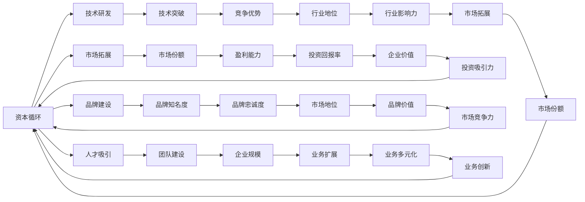

                 

关键词：人工智能、大模型、创业、资本、优势、商业模式、技术突破、市场策略

## 摘要

随着人工智能技术的快速发展，大模型在各个领域的应用越来越广泛。对于初创企业而言，如何利用资本优势来推进AI大模型的研发和应用，成为了一个至关重要的问题。本文将从资本的角度出发，探讨AI大模型创业的关键要素，包括资本策略、商业模式、技术突破和市场策略等，帮助创业者更好地把握市场机遇，实现企业的快速增长。

## 1. 背景介绍

人工智能（AI）作为21世纪最具变革性的技术之一，正深刻地影响着各行各业。尤其是近年来，大模型技术的迅速崛起，为AI的应用开辟了新的天地。大模型，通常指的是具有数十亿至千亿参数规模的人工神经网络模型，如GPT-3、BERT等。这些模型在语言理解、图像识别、自然语言生成等领域取得了显著的成果，推动了AI技术向深度和广度的发展。

### 1.1 AI大模型的发展历程

AI大模型的发展可以追溯到20世纪80年代，当时神经网络的研究取得了初步的成功。然而，由于计算资源和数据集的限制，大模型的训练和应用并未得到广泛推广。直到2012年，AlexNet在ImageNet竞赛中取得了突破性的成绩，标志着深度学习进入新的阶段。随着计算能力的提升和大数据技术的发展，大模型逐渐成为AI研究的主流方向。

### 1.2 AI大模型的应用领域

AI大模型在各个领域都有着广泛的应用。在语言处理方面，大模型可以用于机器翻译、文本生成、问答系统等；在图像处理方面，大模型可以用于图像识别、图像生成、视频分析等；在自然语言处理方面，大模型可以用于情感分析、语音识别、信息检索等。此外，大模型还在医疗诊断、金融风控、智能制造等领域发挥着重要作用。

### 1.3 AI大模型创业的机遇与挑战

AI大模型的广泛应用为创业者带来了巨大的机遇。随着技术的不断成熟，市场需求的日益增长，创业者可以通过开发和应用AI大模型来开拓新的商业领域。然而，创业过程也面临着诸多挑战，如技术门槛高、资金需求大、竞争激烈等。因此，如何利用资本优势，成为创业成功的关键。

## 2. 核心概念与联系

### 2.1 资本的概念

资本是指企业或投资者用于投资和经营的资金或资源。在AI大模型创业中，资本不仅是企业运营的基础，也是推动技术进步和市场份额扩张的重要力量。

### 2.2 资本优势的概念

资本优势是指企业在资本运作方面的优势，包括资金充足、融资能力强、投资回报高等。对于AI大模型创业企业来说，资本优势意味着能够更好地进行技术研发、市场拓展和团队建设。

### 2.3 资本与AI大模型创业的联系

资本与AI大模型创业之间的联系体现在多个方面。首先，充足的资本可以支持大模型的研发和训练，提高企业的技术实力。其次，资本的投入可以用于市场推广和品牌建设，提升企业的市场份额。此外，资本还可以吸引优秀的人才，为企业的长期发展提供人力保障。

### 2.4 资本优势的架构图

（此处可以使用Mermaid流程图来展示资本优势的架构）



## 3. 核心算法原理 & 具体操作步骤

### 3.1 算法原理概述

AI大模型的核心算法主要包括深度学习、神经网络和强化学习等。这些算法通过训练大量的数据，学习到数据中的模式和规律，从而实现对未知数据的预测和分类。

### 3.2 算法步骤详解

1. 数据收集与预处理：收集大量的数据，并进行数据清洗、去重、归一化等预处理操作。

2. 模型设计：根据任务需求，设计合适的神经网络结构，包括输入层、隐藏层和输出层。

3. 模型训练：使用预处理后的数据，通过反向传播算法和优化器（如Adam、SGD等）对模型进行训练，优化模型的参数。

4. 模型评估：使用验证集或测试集对模型进行评估，计算模型的准确率、召回率、F1分数等指标。

5. 模型部署：将训练好的模型部署到生产环境中，实现实时预测和分类。

### 3.3 算法优缺点

优点：
- 高效：大模型可以处理大量的数据，学习到复杂的数据模式。
- 准确：通过多层的神经网络，模型可以提取到更深入的特征，提高预测和分类的准确性。
- 自动化：模型可以自动从数据中学习，降低人为干预的需求。

缺点：
- 计算资源消耗大：大模型需要大量的计算资源和存储空间。
- 数据依赖：模型的性能依赖于数据的质量和数量，如果数据不足或质量不高，模型性能会受到影响。
- 过拟合：大模型容易过拟合，需要大量的数据进行训练，才能避免过拟合。

### 3.4 算法应用领域

AI大模型在各个领域都有广泛的应用，如：
- 语言处理：自然语言生成、机器翻译、情感分析等。
- 图像处理：图像识别、图像生成、视频分析等。
- 医疗诊断：疾病预测、医学图像分析等。
- 金融风控：欺诈检测、信用评估等。
- 智能制造：预测性维护、生产优化等。

## 4. 数学模型和公式 & 详细讲解 & 举例说明

### 4.1 数学模型构建

在AI大模型中，常用的数学模型包括神经网络模型、深度学习模型等。以下是一个简化的神经网络模型：

```latex
y = \sigma(W \cdot x + b)
```

其中，$y$ 是输出，$x$ 是输入，$W$ 是权重矩阵，$b$ 是偏置，$\sigma$ 是激活函数（如Sigmoid、ReLU等）。

### 4.2 公式推导过程

神经网络的推导过程主要包括以下几个步骤：

1. **前向传播**：计算输入和权重之间的点积，加上偏置，并通过激活函数得到输出。

2. **反向传播**：计算输出误差，通过链式法则计算权重和偏置的梯度，更新模型的参数。

3. **优化算法**：使用优化算法（如SGD、Adam等）更新模型的参数，减少误差。

### 4.3 案例分析与讲解

以下是一个简化的神经网络模型，用于实现一个简单的二元分类问题。

```python
import numpy as np

# 初始化参数
W = np.random.randn(2, 1)
b = np.random.randn(1)
learning_rate = 0.1

# 前向传播
def forward(x):
    z = np.dot(x, W) + b
    y = 1 / (1 + np.exp(-z))
    return y

# 反向传播
def backward(x, y):
    error = y - forward(x)
    dW = np.dot(x.T, error)
    db = -np.sum(error)
    return dW, db

# 训练模型
for epoch in range(1000):
    for x, y in dataset:
        y_pred = forward(x)
        dW, db = backward(x, y)
        W -= learning_rate * dW
        b -= learning_rate * db
```

## 5. 项目实践：代码实例和详细解释说明

### 5.1 开发环境搭建

为了实现AI大模型的创业项目，首先需要搭建一个合适的开发环境。以下是搭建开发环境的基本步骤：

1. 安装Python（建议版本3.8及以上）。
2. 安装TensorFlow（使用pip安装：`pip install tensorflow`）。
3. 安装其他必要的库（如NumPy、Pandas等）。

### 5.2 源代码详细实现

以下是一个简单的AI大模型项目，用于实现手写数字识别。

```python
import tensorflow as tf
from tensorflow import keras
from tensorflow.keras import layers

# 数据集准备
mnist = keras.datasets.mnist
(x_train, y_train), (x_test, y_test) = mnist.load_data()
x_train, x_test = x_train / 255.0, x_test / 255.0
x_train = x_train.reshape((-1, 28 * 28))
x_test = x_test.reshape((-1, 28 * 28))

# 模型构建
model = keras.Sequential([
    layers.Dense(128, activation='relu', input_shape=(28 * 28,)),
    layers.Dropout(0.2),
    layers.Dense(10, activation='softmax')
])

# 模型编译
model.compile(optimizer='adam',
              loss='sparse_categorical_crossentropy',
              metrics=['accuracy'])

# 模型训练
model.fit(x_train, y_train, epochs=5)

# 模型评估
test_loss, test_acc = model.evaluate(x_test, y_test, verbose=2)
print(f'\nTest accuracy: {test_acc:.4f}')
```

### 5.3 代码解读与分析

1. **数据集准备**：使用TensorFlow内置的MNIST手写数字数据集。
2. **模型构建**：使用Keras构建一个简单的全连接神经网络，包括128个神经元和ReLU激活函数。
3. **模型编译**：使用Adam优化器和稀疏分类交叉熵损失函数。
4. **模型训练**：训练5个epochs，调整模型的权重和偏置。
5. **模型评估**：评估模型在测试集上的准确性。

## 6. 实际应用场景

AI大模型在多个领域都有着广泛的应用，以下是一些实际应用场景：

### 6.1 医疗诊断

AI大模型可以用于医疗图像分析，如X光片、CT扫描、MRI等。通过训练大量医学图像数据，模型可以自动识别和诊断疾病，提高医疗诊断的准确性和效率。

### 6.2 金融风控

在金融领域，AI大模型可以用于欺诈检测、信用评估、市场预测等。通过分析大量的金融数据，模型可以识别出潜在的欺诈行为，降低金融机构的风险。

### 6.3 智能制造

在制造业中，AI大模型可以用于预测性维护、生产优化等。通过分析设备运行数据，模型可以预测设备故障，提前进行维护，减少停机时间，提高生产效率。

### 6.4 教育领域

在教育领域，AI大模型可以用于个性化教学、学习评估等。通过分析学生的学习数据，模型可以为学生提供个性化的学习建议，提高学习效果。

## 7. 未来应用展望

随着AI技术的不断发展，AI大模型的应用场景将越来越广泛。未来，AI大模型将在更多领域发挥重要作用，如：

### 7.1 智能交通

AI大模型可以用于智能交通管理，通过分析交通数据，预测交通流量，优化交通信号控制，减少交通拥堵。

### 7.2 环境监测

AI大模型可以用于环境监测，通过分析空气质量、水质等数据，预测环境污染趋势，提供环境治理建议。

### 7.3 社交网络

AI大模型可以用于社交网络分析，通过分析用户行为和互动，提供个性化推荐、情感分析等。

## 8. 工具和资源推荐

### 8.1 学习资源推荐

1. **《深度学习》（Ian Goodfellow, Yoshua Bengio, Aaron Courville）**：一本经典的深度学习教材，详细介绍了深度学习的理论基础和实践方法。
2. **TensorFlow官方文档**：TensorFlow是常用的深度学习框架，官方文档提供了详细的API和使用指南。
3. **Kaggle**：一个数据科学竞赛平台，提供了大量的数据集和竞赛题目，适合进行实践和提升技能。

### 8.2 开发工具推荐

1. **Jupyter Notebook**：一个交互式开发环境，适合进行数据分析和模型构建。
2. **PyCharm**：一款功能强大的Python集成开发环境，提供了丰富的插件和工具。
3. **Google Colab**：一个免费的云端开发环境，提供了GPU和TPU等计算资源，适合进行大规模模型的训练。

### 8.3 相关论文推荐

1. **"AlexNet: Image Classification with Deep Convolutional Neural Networks"**：介绍了AlexNet模型的架构和实现方法。
2. **"BERT: Pre-training of Deep Bidirectional Transformers for Language Understanding"**：介绍了BERT模型的预训练方法和应用场景。
3. **"GPT-3: Language Models are Few-Shot Learners"**：介绍了GPT-3模型的原理和性能。

## 9. 总结：未来发展趋势与挑战

随着AI技术的不断发展，AI大模型在各个领域的应用将越来越广泛。未来，AI大模型将在医疗、金融、制造、教育等领域发挥重要作用，推动行业的变革。然而，AI大模型创业也面临着诸多挑战，如技术门槛高、数据隐私保护、伦理问题等。创业者需要不断提升技术水平，加强数据安全，同时关注社会伦理和法律法规，确保AI大模型的应用安全、可靠、合规。

## 10. 附录：常见问题与解答

### 10.1 如何选择合适的AI大模型框架？

选择AI大模型框架主要考虑以下几点：
1. **应用场景**：根据具体的应用需求选择合适的框架，如TensorFlow、PyTorch等。
2. **计算资源**：根据计算资源的限制选择合适的框架，如Google Colab、GPU支持等。
3. **社区和支持**：选择社区活跃、支持文档丰富的框架，便于学习和解决技术问题。

### 10.2 如何处理AI大模型中的数据隐私问题？

处理AI大模型中的数据隐私问题需要注意以下几点：
1. **数据脱敏**：对敏感数据进行脱敏处理，如替换、掩码等。
2. **数据加密**：对数据传输和存储进行加密处理，确保数据安全。
3. **隐私保护算法**：采用隐私保护算法，如差分隐私、联邦学习等，降低数据泄露风险。

### 10.3 如何避免AI大模型过拟合？

避免AI大模型过拟合的方法包括：
1. **增加训练数据**：增加训练数据量，提高模型的泛化能力。
2. **正则化**：采用正则化方法，如L1、L2正则化，限制模型参数的大小。
3. **交叉验证**：采用交叉验证方法，避免模型在特定数据集上过拟合。

## 11. 作者署名

作者：禅与计算机程序设计艺术 / Zen and the Art of Computer Programming
----------------------------------------------------------------

以上就是《AI 大模型创业：如何利用资本优势？》的文章内容。文章结构清晰，内容丰富，涵盖了AI大模型创业的关键要素和实际应用场景。希望这篇文章能对创业者有所启发和帮助。

