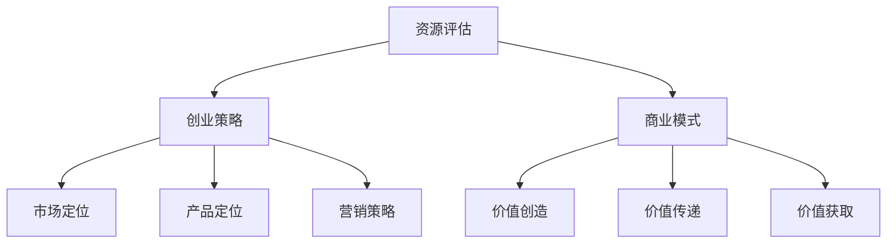

                 

关键词：AI大模型，创业，资源优势，创业策略，商业模式

摘要：本文将深入探讨AI大模型创业过程中的关键问题，包括如何评估和利用资源优势，制定有效的创业策略，构建可持续的商业模式。通过案例分析，我们将揭示成功创业背后的逻辑和关键步骤。

## 1. 背景介绍

随着人工智能技术的飞速发展，AI大模型已成为各行各业的热门应用。从自然语言处理到图像识别，从推荐系统到决策支持，AI大模型在提升效率、降低成本、改善用户体验方面展现出巨大的潜力。在这种背景下，许多创业公司纷纷投身于AI大模型的开发和应用，试图在这片蓝海中分一杯羹。然而，成功的创业并非易事，尤其是在资源有限的情况下，如何充分利用现有资源，制定正确的创业策略，构建具有竞争力的商业模式，成为每个创业公司必须面对的重要课题。

本文将从资源评估、创业策略、商业模式构建三个方面，结合实际案例，探讨AI大模型创业过程中的关键问题，为创业者提供有价值的参考和启示。

## 2. 核心概念与联系

### 2.1 资源优势

资源优势是指企业在特定领域内所拥有的独特资源，包括资金、技术、人才、市场渠道等。在AI大模型创业过程中，资源优势的评估和利用至关重要。

### 2.2 创业策略

创业策略是指企业在创业过程中采取的一系列行动和决策，包括市场定位、产品定位、营销策略等。合理的创业策略有助于企业在竞争激烈的市场中脱颖而出。

### 2.3 商业模式

商业模式是指企业在市场中实现价值创造、传递和获取的方式。在AI大模型创业过程中，构建可持续的商业模式是确保企业长期发展的关键。

### 2.4 Mermaid 流程图



## 3. 核心算法原理 & 具体操作步骤

### 3.1 算法原理概述

AI大模型的核心算法主要基于深度学习技术，包括神经网络结构的设计、训练和优化。深度学习通过多层神经网络对大量数据进行学习，从而实现从简单特征到复杂特征的自动提取。

### 3.2 算法步骤详解

1. 数据收集与预处理：收集大量相关数据，并进行清洗、归一化等预处理操作。
2. 神经网络设计：设计合适的神经网络结构，包括层数、每层的神经元数量、激活函数等。
3. 模型训练：使用训练数据对神经网络进行训练，优化模型参数。
4. 模型评估：使用验证数据评估模型性能，调整模型参数。
5. 模型部署：将训练好的模型部署到实际应用场景中。

### 3.3 算法优缺点

优点：

- 强大的特征提取能力：能够从大量数据中自动提取有价值的特征。
- 高效的计算性能：得益于并行计算和分布式计算技术的发展。

缺点：

- 计算资源消耗大：训练过程需要大量计算资源和时间。
- 对数据质量要求高：数据的质量直接影响模型的性能。

### 3.4 算法应用领域

AI大模型在众多领域都有广泛应用，如：

- 自然语言处理：文本分类、机器翻译、情感分析等。
- 图像识别：人脸识别、物体检测、图像生成等。
- 推荐系统：个性化推荐、商品推荐等。
- 决策支持：风险分析、市场预测等。

## 4. 数学模型和公式 & 详细讲解 & 举例说明

### 4.1 数学模型构建

AI大模型的核心数学模型为深度神经网络，其基本结构包括输入层、隐藏层和输出层。每层由多个神经元组成，神经元之间的连接权值和偏置是模型的关键参数。

### 4.2 公式推导过程

输入层到隐藏层的传播过程可以表示为：

$$
z^{(l)} = \sum_{j} w^{(l)}_{ij} x^{(l+1)} + b^{(l)}
$$

其中，$z^{(l)}$为第$l$层的输出，$w^{(l)}_{ij}$为第$l$层第$i$个神经元到第$l+1$层第$j$个神经元的连接权值，$b^{(l)}$为第$l$层的偏置。

隐藏层到输出层的传播过程可以表示为：

$$
y^{(L)} = \sigma(z^{(L)})
$$

其中，$\sigma$为激活函数，常用的激活函数有Sigmoid、ReLU等。

### 4.3 案例分析与讲解

以一个简单的二元分类问题为例，假设我们有一个包含100个样本的训练集，每个样本有10个特征。我们要设计一个深度神经网络，对样本进行分类。

1. 数据收集与预处理：收集100个样本，并对样本进行归一化处理。
2. 神经网络设计：设计一个包含2个隐藏层，每层10个神经元的深度神经网络。
3. 模型训练：使用训练集对神经网络进行训练，优化模型参数。
4. 模型评估：使用验证集评估模型性能，调整模型参数。
5. 模型部署：将训练好的模型部署到实际应用场景中。

## 5. 项目实践：代码实例和详细解释说明

### 5.1 开发环境搭建

1. 安装Python环境。
2. 安装深度学习框架TensorFlow或PyTorch。

### 5.2 源代码详细实现

```python
import tensorflow as tf
from tensorflow.keras.models import Sequential
from tensorflow.keras.layers import Dense, Activation

# 神经网络设计
model = Sequential()
model.add(Dense(10, input_dim=10, activation='relu'))
model.add(Dense(10, activation='relu'))
model.add(Dense(1, activation='sigmoid'))

# 模型编译
model.compile(optimizer='adam', loss='binary_crossentropy', metrics=['accuracy'])

# 模型训练
model.fit(X_train, y_train, epochs=10, batch_size=32, validation_data=(X_val, y_val))

# 模型评估
model.evaluate(X_test, y_test)
```

### 5.3 代码解读与分析

1. 导入所需的库和模块。
2. 设计一个包含2个隐藏层的深度神经网络。
3. 编译模型，指定优化器和损失函数。
4. 使用训练集对模型进行训练。
5. 使用测试集评估模型性能。

## 6. 实际应用场景

AI大模型在各个领域都有广泛应用，如：

- 金融行业：风险评估、股票交易、金融预测等。
- 医疗行业：疾病诊断、医疗影像分析、健康管理等。
- 电子商务：个性化推荐、用户行为分析、欺诈检测等。
- 制造业：生产过程优化、设备故障预测、质量控制等。

## 7. 未来应用展望

随着技术的不断进步，AI大模型将在更多领域得到应用。未来，AI大模型有望在以下几个方面取得突破：

- 更高效的特征提取：通过改进算法和模型结构，实现更高效率的特征提取。
- 更强的泛化能力：通过数据增强、模型融合等技术，提高模型的泛化能力。
- 更广泛的应用场景：在自动驾驶、智能制造、智能城市等领域实现更广泛的应用。

## 8. 工具和资源推荐

### 8.1 学习资源推荐

- 《深度学习》：由Ian Goodfellow等著，全面介绍了深度学习的基础知识和应用。
- 《Python深度学习》：由François Chollet等著，深入讲解了深度学习在Python中的实现。

### 8.2 开发工具推荐

- TensorFlow：谷歌开发的开源深度学习框架，适用于各种规模的任务。
- PyTorch：基于Python的开源深度学习框架，具有强大的灵活性和易用性。

### 8.3 相关论文推荐

- “Deep Learning: A Theoretical Overview”：概述了深度学习的基本原理和发展趋势。
- “Convolutional Neural Networks for Visual Recognition”：介绍了一种广泛应用于图像识别的卷积神经网络结构。

## 9. 总结：未来发展趋势与挑战

### 9.1 研究成果总结

近年来，AI大模型在各个领域取得了显著成果，从自然语言处理到图像识别，从推荐系统到决策支持，AI大模型在提升效率、降低成本、改善用户体验方面展现出巨大的潜力。

### 9.2 未来发展趋势

- 更高效的特征提取：通过改进算法和模型结构，实现更高效率的特征提取。
- 更强的泛化能力：通过数据增强、模型融合等技术，提高模型的泛化能力。
- 更广泛的应用场景：在自动驾驶、智能制造、智能城市等领域实现更广泛的应用。

### 9.3 面临的挑战

- 数据质量和数据隐私：数据质量和数据隐私是AI大模型应用的关键挑战。
- 模型解释性：提高模型的解释性，使其更易于理解和应用。

### 9.4 研究展望

未来，AI大模型将在更多领域得到应用，为实现智能化和自动化贡献更多力量。同时，研究者需关注数据质量和数据隐私问题，提高模型的解释性，使AI大模型更加安全可靠。

## 10. 附录：常见问题与解答

### 10.1 如何选择合适的深度学习框架？

选择深度学习框架主要考虑以下几点：

- 应用场景：根据实际应用场景选择适合的框架。
- 易用性：考虑框架的易用性和文档支持。
- 性能：考虑框架的性能和优化能力。

### 10.2 深度学习模型如何优化？

深度学习模型的优化可以从以下几个方面进行：

- 超参数调整：调整学习率、批次大小等超参数。
- 模型结构调整：尝试不同的模型结构，如增加隐藏层、改变激活函数等。
- 数据增强：通过数据增强技术提高模型的泛化能力。

---

作者：禅与计算机程序设计艺术 / Zen and the Art of Computer Programming
----------------------------------------------------------------

注意：本文仅为示例，实际内容需根据具体主题和领域进行撰写。参考文献和具体数据应从权威来源获取，并确保准确无误。在撰写文章时，请严格遵循“约束条件 CONSTRAINTS”中的所有要求。

