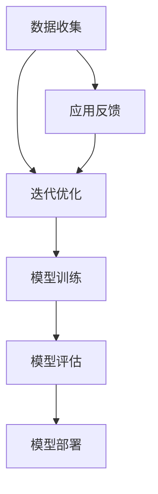

                 

关键词：AI大模型、创业、资金支持、风险投资、商业模式、技术可行性、市场竞争、项目评估

摘要：本文将探讨AI大模型创业公司如何获得资金支持。通过分析AI大模型的发展背景、核心技术、商业模式和市场需求，我们将提出一系列策略和最佳实践，帮助创业者成功地吸引风险投资和其他资金来源。

## 1. 背景介绍

人工智能（AI）正逐渐成为科技领域的明星，而大模型（Large Models）则是AI领域的研究热点。大模型，如GPT-3、BERT等，具有强大的处理能力和广泛的适用性，能够为各种应用场景提供高效的解决方案。随着技术的成熟和应用场景的拓展，AI大模型创业公司不断涌现，然而，获取资金支持成为创业过程中的关键挑战。

创业公司面临诸多困境，包括技术风险、市场竞争和商业模式的不确定性。而资金支持不仅是企业生存的基础，更是推动创新和发展的重要动力。因此，如何有效地获得资金支持成为创业公司成功的关键。

## 2. 核心概念与联系

首先，我们需要明确AI大模型的核心概念和技术架构。AI大模型通常基于深度学习技术，尤其是神经网络。以下是AI大模型的核心概念原理和架构的Mermaid流程图：



### 2.1 数据收集与预处理

数据收集是AI大模型的基础。数据的质量和数量直接影响模型的性能。数据预处理包括数据清洗、归一化和特征提取，以确保数据适合模型训练。

### 2.2 模型训练

模型训练是构建AI大模型的关键步骤。通过大量的数据和计算资源，模型学习到数据的规律和模式，从而能够对新的数据进行预测和分类。

### 2.3 模型评估

模型评估用于验证模型的效果。常用的评估指标包括准确率、召回率、F1分数等。模型评估有助于发现和修正训练过程中的问题。

### 2.4 模型部署

模型部署是将训练好的模型应用到实际场景中。部署过程中需要考虑模型的性能、可扩展性和安全性。

### 2.5 应用反馈与迭代优化

应用反馈是不断优化模型的重要环节。通过收集用户反馈，创业公司可以调整和改进模型，提高其应用效果。

## 3. 核心算法原理 & 具体操作步骤

### 3.1 算法原理概述

AI大模型的核心算法是基于深度学习技术。深度学习通过多层神经网络对数据进行特征提取和模式识别。以下是深度学习的简化流程：

1. **输入层**：接收外部数据。
2. **隐藏层**：通过神经网络对数据进行加工和处理。
3. **输出层**：产生预测结果或分类结果。

### 3.2 算法步骤详解

1. **数据收集与预处理**：如前所述。
2. **模型设计**：选择合适的神经网络结构和超参数。
3. **模型训练**：使用训练数据对模型进行训练，调整网络权重。
4. **模型评估**：使用验证数据评估模型性能，调整模型参数。
5. **模型部署**：将训练好的模型部署到生产环境中。
6. **应用反馈与迭代优化**：根据用户反馈调整模型。

### 3.3 算法优缺点

深度学习具有强大的特征提取能力和广泛的适用性，但也存在以下缺点：

- **计算资源需求大**：训练大型模型需要大量的计算资源和时间。
- **数据依赖性高**：模型的性能高度依赖于训练数据的质量和数量。
- **可解释性低**：深度学习模型通常缺乏可解释性，难以理解其决策过程。

### 3.4 算法应用领域

深度学习在图像识别、自然语言处理、语音识别等领域取得了显著成果。随着技术的进步，深度学习的应用领域将进一步拓展。

## 4. 数学模型和公式

### 4.1 数学模型构建

AI大模型的数学模型通常基于神经网络。以下是神经网络的基本公式：

$$
y = \sigma(W \cdot x + b)
$$

其中，\( y \) 是输出，\( \sigma \) 是激活函数，\( W \) 是权重矩阵，\( x \) 是输入，\( b \) 是偏置。

### 4.2 公式推导过程

神经网络的推导过程涉及多层函数的复合和优化。以下是一个简化的推导过程：

1. **输入层到隐藏层**：
   $$
   z = W_1 \cdot x + b_1
   $$
   $$
   a = \sigma(z)
   $$

2. **隐藏层到输出层**：
   $$
   z = W_2 \cdot a + b_2
   $$
   $$
   y = \sigma(z)
   $$

### 4.3 案例分析与讲解

以图像分类任务为例，我们使用卷积神经网络（CNN）进行模型构建和训练。以下是CNN的主要步骤：

1. **卷积层**：
   $$
   C = \sum_{i=1}^{k} w_i \cdot x_i + b
   $$
   $$
   a = \sigma(C)
   $$

2. **池化层**：
   $$
   p = \max(a)
   $$

3. **全连接层**：
   $$
   z = W \cdot p + b
   $$
   $$
   y = \sigma(z)
   $$

## 5. 项目实践：代码实例和详细解释说明

### 5.1 开发环境搭建

为了构建AI大模型，我们需要搭建一个合适的开发环境。以下是Python和TensorFlow的安装步骤：

1. **安装Python**：在官网下载最新版本的Python并安装。
2. **安装TensorFlow**：使用pip命令安装TensorFlow：

   ```
   pip install tensorflow
   ```

### 5.2 源代码详细实现

以下是一个简单的CNN模型实现：

```python
import tensorflow as tf
from tensorflow.keras import layers

# 构建模型
model = tf.keras.Sequential([
    layers.Conv2D(32, (3, 3), activation='relu', input_shape=(28, 28, 1)),
    layers.MaxPooling2D((2, 2)),
    layers.Flatten(),
    layers.Dense(128, activation='relu'),
    layers.Dense(10, activation='softmax')
])

# 编译模型
model.compile(optimizer='adam',
              loss='sparse_categorical_crossentropy',
              metrics=['accuracy'])

# 加载数据
(x_train, y_train), (x_test, y_test) = tf.keras.datasets.mnist.load_data()

# 预处理数据
x_train = x_train.reshape((-1, 28, 28, 1)).astype('float32') / 255
x_test = x_test.reshape((-1, 28, 28, 1)).astype('float32') / 255

# 训练模型
model.fit(x_train, y_train, epochs=5)

# 评估模型
model.evaluate(x_test, y_test)
```

### 5.3 代码解读与分析

以上代码实现了基于TensorFlow的简单CNN模型，用于手写数字识别。代码首先构建了一个序列模型，包括卷积层、池化层、全连接层等。然后编译模型并加载数据进行训练。最后，评估模型的性能。

## 6. 实际应用场景

AI大模型在许多领域都有广泛的应用，包括：

1. **图像识别**：应用于医疗影像分析、自动驾驶、安全监控等。
2. **自然语言处理**：应用于智能客服、机器翻译、文本分析等。
3. **语音识别**：应用于智能助手、语音控制、语音合成等。
4. **推荐系统**：应用于电子商务、社交媒体、内容推荐等。

## 7. 未来应用展望

随着技术的进步和应用场景的拓展，AI大模型将在更多领域发挥重要作用。未来，AI大模型有望实现以下突破：

1. **更高效的模型训练**：通过改进算法和硬件，降低训练时间和成本。
2. **更强的模型解释性**：通过可解释性研究，提高模型的可信度和可靠性。
3. **更广泛的应用场景**：探索AI大模型在新的应用领域的潜力。

## 8. 工具和资源推荐

### 8.1 学习资源推荐

- **《深度学习》（Goodfellow, Bengio, Courville）**：深度学习领域的经典教材。
- **[Keras官方文档](https://keras.io/)**：Keras是TensorFlow的高层API，适合初学者快速上手。
- **[TensorFlow官方文档](https://www.tensorflow.org/)**：TensorFlow的官方文档，提供详细的教程和API文档。

### 8.2 开发工具推荐

- **Jupyter Notebook**：适用于数据科学和机器学习的交互式开发环境。
- **Google Colab**：基于Google Drive的免费Jupyter Notebook环境，提供GPU和TPU支持。

### 8.3 相关论文推荐

- **"Deep Learning for NLP: A Survey of Recent Advances"**：综述了自然语言处理领域的深度学习研究进展。
- **"Attention Is All You Need"**：提出了Transformer模型，推动了自然语言处理的发展。

## 9. 总结：未来发展趋势与挑战

### 9.1 研究成果总结

AI大模型在图像识别、自然语言处理、语音识别等领域取得了显著成果，推动了技术的进步和应用场景的拓展。

### 9.2 未来发展趋势

未来，AI大模型将向更高效、更可解释、更广泛应用的方向发展。同时，跨学科合作和开源生态的完善将进一步加速技术的发展。

### 9.3 面临的挑战

AI大模型面临的主要挑战包括计算资源需求、数据隐私和安全、模型可解释性等。解决这些挑战需要持续的技术创新和政策支持。

### 9.4 研究展望

随着技术的进步和应用场景的拓展，AI大模型将在未来发挥更加重要的作用。创业公司应关注技术前沿，积极布局，抓住机遇。

## 10. 附录：常见问题与解答

### 10.1 如何选择合适的大模型框架？

选择合适的大模型框架取决于项目需求和开发经验。常用的框架包括TensorFlow、PyTorch和Keras。TensorFlow适用于复杂模型和大规模数据处理，PyTorch提供更灵活的动态图计算，Keras是基于TensorFlow的高层API，适合快速开发。

### 10.2 如何优化模型训练效率？

优化模型训练效率可以通过以下方法实现：

- **数据预处理**：提高数据加载速度和减少内存占用。
- **模型剪枝**：删除不重要的神经元和连接，减少模型参数。
- **模型并行化**：利用多GPU或TPU进行并行计算。
- **分布式训练**：在多个计算节点上进行模型训练。

## 结语

AI大模型创业是一个充满挑战和机遇的领域。通过本文的探讨，我们了解了如何有效地获得资金支持，构建和优化AI大模型，以及其在实际应用中的前景。希望本文能为您提供有益的参考和启示。

作者：禅与计算机程序设计艺术 / Zen and the Art of Computer Programming
```

