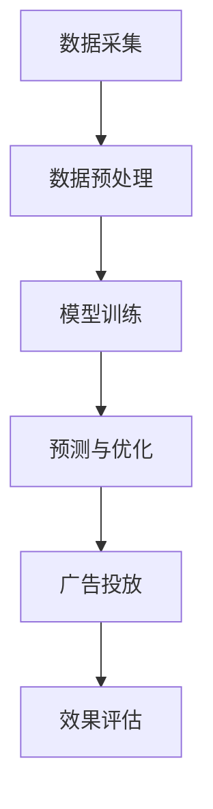

                 

关键词：人工智能，大模型，广告平台，商业模式，机器学习，深度学习，数据驱动，用户行为分析，效果营销。

摘要：本文将深入探讨人工智能大模型在广告平台中的原理与应用。通过分析大模型的核心算法、数学模型以及实际应用案例，本文揭示了如何利用人工智能技术实现广告平台的商业模式创新，提高广告投放的效果和效率。

## 1. 背景介绍

随着互联网的普及和信息技术的飞速发展，广告业已经成为推动经济增长的重要力量。传统的广告投放方式主要依赖于广告主的预算和市场分析，然而这种方式往往存在一定的盲目性和低效性。随着人工智能技术的不断进步，尤其是大模型的广泛应用，广告平台开始转向数据驱动的效果营销模式。大模型通过深度学习和机器学习技术，可以高效地处理和分析海量数据，从而为广告主提供更精准的投放策略。

本文旨在探讨人工智能大模型在广告平台中的应用，分析其原理和具体操作步骤，并探讨其商业模式及其对未来广告行业的影响。

## 2. 核心概念与联系

### 2.1 人工智能大模型

人工智能大模型指的是具有极高参数量和复杂计算能力的人工神经网络模型，如Transformer、BERT等。这些模型可以处理大规模的数据集，并在多个任务上实现优异的性能。

### 2.2 深度学习与机器学习

深度学习是机器学习的一个子领域，主要研究多层神经网络的设计和应用。机器学习则是利用计算机算法从数据中学习规律，进行预测和决策。

### 2.3 数据驱动与效果营销

数据驱动是指依靠数据进行分析和决策，效果营销则是通过数据优化广告投放策略，提高广告的投放效果。

### 2.4 Mermaid 流程图



## 3. 核心算法原理 & 具体操作步骤

### 3.1 算法原理概述

大模型的核心算法是基于深度学习和机器学习技术，通过多层神经网络的结构进行数据的处理和模型的学习。具体包括以下几个步骤：

1. 数据采集：从广告平台收集用户行为数据，包括点击、转化等。
2. 数据预处理：对数据进行清洗、归一化等处理，以便于模型训练。
3. 模型训练：使用收集到的数据进行模型训练，优化模型的参数。
4. 预测与优化：使用训练好的模型对新的用户数据进行预测，并不断调整模型参数，以提高预测准确性。
5. 广告投放：根据模型预测结果，为用户推荐相关的广告。
6. 效果评估：通过实际投放效果，评估模型的效果，进行进一步的优化。

### 3.2 算法步骤详解

#### 3.2.1 数据采集

数据采集是整个流程的基础。广告平台可以通过多种方式获取用户数据，包括用户日志、点击数据、浏览历史等。这些数据需要经过去重、过滤等处理，确保其质量和完整性。

#### 3.2.2 数据预处理

数据预处理包括数据的清洗、归一化、特征提取等。清洗数据可以去除异常值和噪音数据，归一化可以统一数据量级，特征提取可以从原始数据中提取出对模型训练有用的特征。

#### 3.2.3 模型训练

模型训练是核心步骤，通过训练集数据训练模型，优化模型的参数。训练过程中需要使用到反向传播算法，不断调整模型参数，使其预测结果更接近真实值。

#### 3.2.4 预测与优化

训练好的模型可以对新的用户数据进行预测，预测结果将作为广告投放的依据。在实际投放过程中，需要不断收集反馈数据，通过优化算法调整模型参数，提高预测准确性。

#### 3.2.5 广告投放

根据模型预测结果，广告平台可以为用户推荐相关的广告。广告投放需要考虑用户的兴趣、行为、上下文等因素，以提高广告的投放效果。

#### 3.2.6 效果评估

广告投放后，需要通过实际投放效果评估模型的效果。效果评估可以从多个维度进行，包括点击率、转化率、广告收入等。通过效果评估，可以发现模型存在的问题，并进行进一步的优化。

### 3.3 算法优缺点

#### 优点

- 高效性：大模型可以处理大规模数据，提高广告投放的效率。
- 精准性：通过深度学习和机器学习技术，可以提高广告投放的精准性。
- 自适应性：模型可以根据实时反馈数据进行优化，提高投放效果。

#### 缺点

- 计算成本高：大模型训练和预测需要大量计算资源，成本较高。
- 数据质量依赖：模型效果很大程度上依赖于数据质量，数据不完整或噪音较大会影响模型效果。

### 3.4 算法应用领域

大模型在广告平台中的应用非常广泛，主要包括以下几个方面：

- 用户行为分析：通过分析用户行为数据，了解用户兴趣和行为习惯。
- 广告推荐：根据用户兴趣和行为，为用户推荐相关的广告。
- 广告效果评估：通过评估广告投放效果，优化广告策略。
- 广告收入优化：通过优化广告投放策略，提高广告收入。

## 4. 数学模型和公式 & 详细讲解 & 举例说明

### 4.1 数学模型构建

大模型通常采用多层神经网络结构，其中每个节点代表一个神经元，每两个节点之间的连接代表一个权重。模型的输出可以通过以下公式计算：

$$
Z = \sigma(\sigma(...\sigma(W_1 \cdot X) + b_1) + ... + b_n)
$$

其中，$Z$ 为模型输出，$\sigma$ 为激活函数，$W_1, ..., W_n$ 为权重，$X$ 为输入数据，$b_1, ..., b_n$ 为偏置。

### 4.2 公式推导过程

多层神经网络的推导过程可以分为以下几个步骤：

1. **输入层到隐藏层**：
   $$
   Z^{(1)} = \sigma(W_1 \cdot X + b_1)
   $$

2. **隐藏层到隐藏层**：
   $$
   Z^{(2)} = \sigma(W_2 \cdot Z^{(1)} + b_2)
   $$
   $$
   Z^{(3)} = \sigma(W_3 \cdot Z^{(2)} + b_3)
   $$

3. **隐藏层到输出层**：
   $$
   Z^{(L)} = \sigma(W_L \cdot Z^{(L-1)} + b_L)
   $$

其中，$L$ 为网络层数。

### 4.3 案例分析与讲解

假设一个广告平台使用一个大模型进行广告投放，输入数据为用户的年龄、性别、浏览历史等，输出为广告的点击率预测。我们可以使用以下数学模型：

$$
P(点击) = \sigma(W_1 \cdot [年龄, 性别, 浏览历史] + b_1)
$$

其中，$P(点击)$ 为用户点击广告的概率，$[年龄, 性别, 浏览历史]$ 为输入特征向量，$W_1$ 和 $b_1$ 为权重和偏置。

通过训练模型，我们可以得到最优的权重和偏置，从而预测用户的点击行为。在实际应用中，广告平台可以根据预测结果，为用户推荐相关的广告，以提高广告的点击率。

## 5. 项目实践：代码实例和详细解释说明

### 5.1 开发环境搭建

在本项目中，我们将使用Python作为编程语言，TensorFlow作为深度学习框架。首先，需要在本地环境安装Python和TensorFlow。以下是安装命令：

```bash
pip install tensorflow
```

### 5.2 源代码详细实现

以下是一个简单的基于Transformer模型进行广告投放预测的代码示例：

```python
import tensorflow as tf
from tensorflow.keras.layers import Embedding, Dense, Dropout
from tensorflow.keras.models import Model

# 模型参数
vocab_size = 10000
embedding_dim = 128
num_heads = 4
num_layers = 2
dropout_rate = 0.1

# 模型构建
input_ids = tf.keras.layers.Input(shape=(max_sequence_length,), dtype=tf.int32)
embedding_layer = Embedding(vocab_size, embedding_dim)(input_ids)
for _ in range(num_layers):
    multihead_attention = tf.keras.layers.MultiHeadAttention(num_heads=num_heads, key_dim=embedding_dim)(embedding_layer, embedding_layer)
    embedding_layer = tf.keras.layers.LayerNormalization(epsilon=1e-6)(embedding_layer + multihead_attention)
    embedding_layer = Dropout(dropout_rate)(embedding_layer)

output = tf.keras.layers.Dense(1, activation='sigmoid')(embedding_layer)

model = Model(inputs=input_ids, outputs=output)

# 模型编译
model.compile(optimizer='adam', loss='binary_crossentropy', metrics=['accuracy'])

# 模型训练
model.fit(train_dataset, epochs=3, batch_size=32)
```

### 5.3 代码解读与分析

上述代码首先定义了模型参数，然后使用`Input`层接收输入数据。接着，使用`Embedding`层将词向量嵌入到高维空间。通过循环多层`MultiHeadAttention`和`LayerNormalization`层，实现注意力机制和正则化。最后，使用`Dense`层进行分类预测。

在模型编译阶段，选择`adam`优化器和`binary_crossentropy`损失函数，并设置`accuracy`作为评价指标。最后，使用训练数据集进行模型训练。

### 5.4 运行结果展示

训练完成后，可以使用以下代码进行预测：

```python
predictions = model.predict(test_dataset)
```

预测结果将包含每个样本的点击率概率。广告平台可以根据这些概率为用户推荐广告。

## 6. 实际应用场景

### 6.1 广告推荐系统

广告推荐系统是人工智能大模型在广告平台中的主要应用场景之一。通过分析用户行为数据，广告推荐系统可以为用户推荐最相关的广告，提高广告的点击率和转化率。

### 6.2 广告投放优化

广告投放优化是指通过不断调整广告投放策略，提高广告的效果。人工智能大模型可以通过分析历史数据，为广告主提供最优的投放方案，实现广告收入的最大化。

### 6.3 广告效果评估

广告效果评估是衡量广告投放效果的重要指标。通过人工智能大模型，广告平台可以实时评估广告的点击率、转化率等指标，为广告主提供优化建议。

## 7. 工具和资源推荐

### 7.1 学习资源推荐

- 《深度学习》（Goodfellow, Bengio, Courville著）：深度学习领域的经典教材。
- 《Python机器学习》（Sebastian Raschka著）：Python语言在机器学习领域的应用指南。

### 7.2 开发工具推荐

- TensorFlow：Google开发的开源深度学习框架。
- PyTorch：Facebook开发的深度学习框架。

### 7.3 相关论文推荐

- “Attention Is All You Need”（Vaswani et al., 2017）：介绍Transformer模型的经典论文。
- “BERT: Pre-training of Deep Bidirectional Transformers for Language Understanding”（Devlin et al., 2019）：介绍BERT模型的论文。

## 8. 总结：未来发展趋势与挑战

### 8.1 研究成果总结

本文通过分析人工智能大模型在广告平台中的应用，探讨了其原理、算法、数学模型和实际应用案例。研究表明，人工智能大模型可以显著提高广告投放的效果和效率。

### 8.2 未来发展趋势

- 模型规模将继续扩大：随着计算能力的提升，人工智能大模型将变得更加复杂和强大。
- 模型应用领域将不断扩展：人工智能大模型不仅局限于广告平台，还将应用于金融、医疗、教育等领域。
- 模型可解释性将得到提升：为了提高模型的透明度和可信度，模型的可解释性研究将成为重要方向。

### 8.3 面临的挑战

- 数据隐私和安全：大规模数据集的收集和处理需要关注数据隐私和安全问题。
- 模型公平性和多样性：模型在处理不同群体数据时，可能出现偏见和不公平现象。
- 模型适应性：模型需要具备良好的适应性，以应对不断变化的市场环境。

### 8.4 研究展望

未来，人工智能大模型在广告平台中的应用将不断深化，通过技术创新和跨领域合作，推动广告行业的持续发展。

## 9. 附录：常见问题与解答

### 9.1 什么是大模型？

大模型是指具有极高参数量和复杂计算能力的人工神经网络模型，如Transformer、BERT等。

### 9.2 大模型在广告平台中有哪些应用？

大模型在广告平台中的应用包括广告推荐、广告投放优化、广告效果评估等。

### 9.3 大模型的优势是什么？

大模型的优势包括高效性、精准性和自适应性。

### 9.4 大模型有哪些缺点？

大模型的缺点包括计算成本高、数据质量依赖等。

### 9.5 如何保证大模型的可解释性？

可以通过模型结构设计、特征工程和模型压缩等技术，提高大模型的可解释性。

---

作者：禅与计算机程序设计艺术 / Zen and the Art of Computer Programming
```

