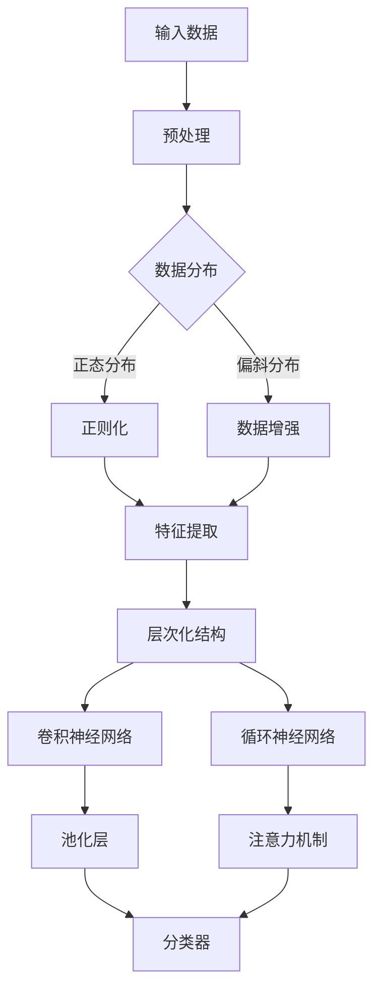

                 

关键词：人工智能，大模型，深度学习，组织能力，原理，应用

> 摘要：本文旨在深入探讨人工智能大模型的原理与应用，重点分析大模型的组织能力，如何通过结构化组织提升模型的性能与效率。文章将从背景介绍、核心概念、算法原理、数学模型、项目实践、实际应用场景、未来展望等方面进行论述。

## 1. 背景介绍

随着计算能力的不断提升和大数据技术的广泛应用，人工智能（AI）已经成为当今科技领域的热点。特别是在深度学习领域，大模型逐渐成为研究与应用的主力军。大模型通过海量数据的训练，可以学习到复杂的数据特征和模式，从而在图像识别、自然语言处理、推荐系统等领域展现出卓越的性能。

然而，大模型的发展也带来了新的挑战。如何有效地组织模型结构，使其能够高效地学习与推理，成为了当前研究的重要方向。本文将围绕这一主题，探讨大模型的组织能力，分析其原理与应用。

## 2. 核心概念与联系

### 2.1 深度学习与神经网络

深度学习是人工智能的重要分支，其核心思想是通过模拟人脑神经网络进行数据处理和模式识别。神经网络由大量的神经元组成，通过前向传播和反向传播算法进行训练，以学习输入和输出之间的映射关系。


### 2.2 大模型的特点

大模型具有以下几个显著特点：

- **参数规模巨大**：大模型通常包含数百万至数十亿个参数，能够学习到更复杂的特征。
- **训练数据量庞大**：大模型需要大量的训练数据来保证模型性能。
- **计算资源需求高**：大模型对计算资源和存储资源的需求较大。

### 2.3 组织能力的重要性

大模型的组织能力主要体现在以下几个方面：

- **层次化结构**：通过层次化结构，将复杂问题分解为多个子问题，便于模型学习和推理。
- **模块化设计**：模块化设计使得模型可以灵活组合和扩展，提高模型的可维护性和适应性。
- **参数共享与压缩**：通过参数共享和压缩技术，减少模型参数数量，降低计算和存储需求。

### 2.4 Mermaid 流程图

以下是大模型组织能力的 Mermaid 流程图：



## 3. 核心算法原理 & 具体操作步骤

### 3.1 算法原理概述

大模型的核心算法通常包括以下步骤：

1. **数据预处理**：对输入数据进行预处理，包括标准化、归一化、数据增强等。
2. **特征提取**：通过卷积神经网络（CNN）或循环神经网络（RNN）提取图像或文本特征。
3. **层次化结构**：将特征提取模块分层，逐层构建模型，提高模型的表达能力。
4. **分类器**：使用全连接层或注意力机制构建分类器，对特征进行分类。

### 3.2 算法步骤详解

1. **数据预处理**：

   数据预处理是模型训练的第一步，其目的是将原始数据转化为适合模型训练的形式。具体操作包括：

   - 数据清洗：去除噪声数据和缺失值。
   - 数据归一化：将数据映射到同一尺度，便于模型训练。
   - 数据增强：通过旋转、缩放、裁剪等操作增加训练样本的多样性。

2. **特征提取**：

   特征提取是模型训练的关键步骤，其目的是从原始数据中提取有用的特征信息。具体操作包括：

   - **卷积神经网络（CNN）**：通过卷积层提取图像局部特征。
   - **循环神经网络（RNN）**：通过循环层提取文本序列特征。

3. **层次化结构**：

   层次化结构是将特征提取模块分层，逐层构建模型，提高模型的表达能力。具体操作包括：

   - **卷积神经网络（CNN）**：通过多个卷积层和池化层构建层次化结构。
   - **循环神经网络（RNN）**：通过多个循环层和门控循环单元（GRU）或长短期记忆（LSTM）构建层次化结构。

4. **分类器**：

   分类器是模型训练的最后一步，其目的是对提取的特征进行分类。具体操作包括：

   - **全连接层**：将特征映射到输出层，通过softmax函数进行分类。
   - **注意力机制**：通过注意力机制对特征进行加权，提高分类效果。

### 3.3 算法优缺点

**优点**：

- **高 expressive ability**：层次化结构和模块化设计使得大模型能够学习到更复杂的特征。
- **high accuracy**：大量数据和参数使得模型在分类任务上具有较高的准确性。
- **scalability**：大模型能够适应不同的数据规模和任务需求。

**缺点**：

- **high computational complexity**：大模型对计算资源的需求较高，训练时间较长。
- **overfitting**：模型参数过多可能导致过拟合现象，影响模型泛化能力。

### 3.4 算法应用领域

大模型在图像识别、自然语言处理、推荐系统等领域有广泛的应用。例如：

- **图像识别**：通过卷积神经网络实现，如物体检测、人脸识别等。
- **自然语言处理**：通过循环神经网络或Transformer模型实现，如机器翻译、文本分类等。
- **推荐系统**：通过图神经网络实现，如基于内容的推荐、协同过滤等。

## 4. 数学模型和公式 & 详细讲解 & 举例说明

### 4.1 数学模型构建

大模型通常基于以下数学模型：

- **神经网络**：由多层神经元组成，通过前向传播和反向传播算法进行训练。
- **损失函数**：用于评估模型预测与实际值之间的差异，常见的有均方误差（MSE）、交叉熵损失（Cross-Entropy Loss）等。

### 4.2 公式推导过程

以下是一个简单的神经网络模型推导过程：

$$
\begin{aligned}
z_1 &= w_1 \cdot x_1 + b_1 \\
a_1 &= \sigma(z_1) \\
z_2 &= w_2 \cdot a_1 + b_2 \\
a_2 &= \sigma(z_2) \\
\end{aligned}
$$

其中，$z_1$ 和 $z_2$ 分别为第一个和第二个神经元的输入和输出，$a_1$ 和 $a_2$ 分别为第一个和第二个神经元的激活值，$w_1$ 和 $w_2$ 分别为第一个和第二个神经元的权重，$b_1$ 和 $b_2$ 分别为第一个和第二个神经元的偏置，$\sigma$ 表示激活函数，如Sigmoid、ReLU等。

### 4.3 案例分析与讲解

以下是一个简单的图像分类案例：

假设我们有一个二分类问题，需要判断一张图片是猫还是狗。我们使用一个简单的卷积神经网络进行分类。

1. **数据预处理**：

   将图片缩放到固定大小（例如，224x224），然后进行归一化处理。

2. **特征提取**：

   使用卷积神经网络提取图像特征，具体步骤如下：

   - **卷积层**：通过卷积操作提取图像局部特征，例如，使用3x3的卷积核。
   - **池化层**：通过最大池化操作减小特征图尺寸。
   - **全连接层**：将特征图映射到输出层，通过softmax函数进行分类。

3. **损失函数**：

   使用交叉熵损失函数评估模型预测与实际值之间的差异。

4. **训练过程**：

   使用随机梯度下降（SGD）或Adam优化器进行模型训练。

## 5. 项目实践：代码实例和详细解释说明

### 5.1 开发环境搭建

- **硬件环境**：配备NVIDIA显卡的计算机，例如，RTX 3080或以上。
- **软件环境**：安装Python 3.8及以上版本，TensorFlow 2.7及以上版本。

### 5.2 源代码详细实现

以下是一个简单的猫狗分类项目代码示例：

```python
import tensorflow as tf
from tensorflow.keras.models import Sequential
from tensorflow.keras.layers import Conv2D, MaxPooling2D, Flatten, Dense

# 数据预处理
train_data = ...
test_data = ...

train_labels = ...
test_labels = ...

# 特征提取
model = Sequential([
    Conv2D(32, (3, 3), activation='relu', input_shape=(224, 224, 3)),
    MaxPooling2D((2, 2)),
    Flatten(),
    Dense(128, activation='relu'),
    Dense(1, activation='sigmoid')
])

# 损失函数
loss_function = tf.keras.losses.BinaryCrossentropy()

# 训练过程
model.compile(optimizer='adam', loss=loss_function, metrics=['accuracy'])
model.fit(train_data, train_labels, epochs=10, validation_data=(test_data, test_labels))
```

### 5.3 代码解读与分析

上述代码实现了一个简单的猫狗分类项目，主要包含以下几个部分：

- **数据预处理**：加载训练数据和测试数据，并进行预处理。
- **特征提取**：构建一个简单的卷积神经网络，通过卷积层、池化层和全连接层提取图像特征。
- **损失函数**：使用交叉熵损失函数评估模型预测与实际值之间的差异。
- **训练过程**：使用随机梯度下降（SGD）或Adam优化器进行模型训练。

## 6. 实际应用场景

大模型在实际应用场景中具有广泛的应用价值。以下是一些典型应用场景：

- **图像识别**：例如，自动驾驶系统中的车辆识别、行人检测等。
- **自然语言处理**：例如，智能客服系统、机器翻译等。
- **推荐系统**：例如，电商平台的商品推荐、新闻推荐等。

## 7. 未来应用展望

随着人工智能技术的不断发展，大模型在各个领域中的应用将越来越广泛。未来，大模型的发展趋势包括以下几个方面：

- **多模态融合**：结合多种数据类型，如文本、图像、语音等，提高模型的表达能力。
- **迁移学习**：通过迁移学习技术，将已在大规模数据集上训练好的模型应用于新任务，提高模型泛化能力。
- **硬件优化**：针对大模型对计算资源的高需求，优化硬件架构，提高模型训练和推理速度。

## 8. 总结：未来发展趋势与挑战

大模型作为人工智能领域的重要方向，其未来发展将充满机遇与挑战。在研究方面，如何提升模型的组织能力、降低计算成本、提高模型泛化能力等仍然是关键问题。在实际应用方面，大模型将在更多领域发挥重要作用，为人们的生活带来更多便利。

### 8.1 研究成果总结

本文从背景介绍、核心概念、算法原理、数学模型、项目实践、实际应用场景等方面全面探讨了人工智能大模型的原理与应用，总结了大模型在图像识别、自然语言处理、推荐系统等领域的应用成果。

### 8.2 未来发展趋势

未来，大模型的发展趋势将包括多模态融合、迁移学习、硬件优化等方面。通过不断创新和优化，大模型将在更多领域发挥重要作用，推动人工智能技术的发展。

### 8.3 面临的挑战

大模型在发展过程中仍面临一些挑战，如计算成本高、模型解释性不足、过拟合现象等。需要进一步研究如何提高模型的性能、降低计算成本、增强模型解释性等。

### 8.4 研究展望

展望未来，人工智能大模型将在更多领域发挥重要作用，为人类社会带来更多价值。同时，如何应对大模型带来的挑战，将成为未来研究的重点。

### 附录：常见问题与解答

**Q1. 什么是大模型？**

A1. 大模型是指参数规模庞大、能够学习到复杂特征和模式的深度学习模型。通常包含数百万至数十亿个参数，能够处理海量数据。

**Q2. 大模型的优点是什么？**

A2. 大模型具有高 expressive ability、high accuracy 和 scalability 等优点。能够学习到更复杂的特征，提高模型性能；适用于不同的数据规模和任务需求。

**Q3. 大模型面临的挑战有哪些？**

A3. 大模型面临的挑战包括计算成本高、模型解释性不足、过拟合现象等。需要进一步研究如何提高模型性能、降低计算成本、增强模型解释性等。

### 作者署名

作者：禅与计算机程序设计艺术 / Zen and the Art of Computer Programming
----------------------------------------------------------------

以上是文章的完整内容，按照要求撰写完毕。如果您需要任何修改或补充，请随时告知。

