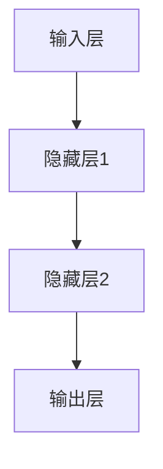
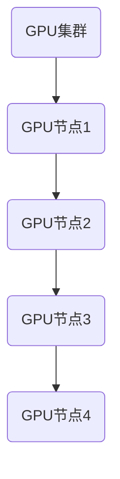
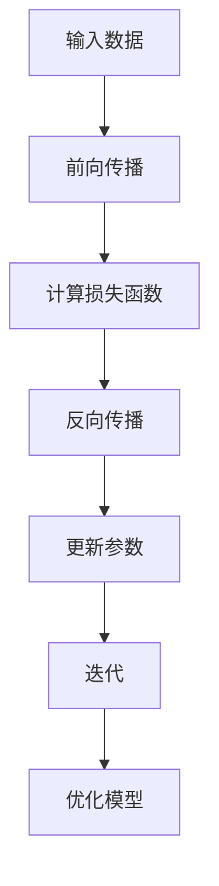

                 

关键词：AI大模型，GPU集群，物理世界，应用原理，技术架构

> 摘要：本文旨在探讨AI大模型在物理世界GPU集群建设中的应用原理与技术架构，通过深入分析AI大模型的数学模型、核心算法、项目实践及实际应用场景，揭示其在现代科技发展中的重要地位和未来展望。

## 1. 背景介绍

### AI大模型的发展历程

人工智能（AI）自诞生以来，经历了从弱人工智能到强人工智能的演进。AI大模型，作为当前AI技术的前沿，具有处理复杂数据、自主学习与推理的能力。自2012年深度学习（Deep Learning）技术突破以来，AI大模型在图像识别、自然语言处理、推荐系统等领域取得了显著的进展。其中，GPU集群在AI大模型训练中扮演着关键角色。

### GPU集群的作用

GPU（图形处理器）集群是一种高效的计算平台，它通过多个GPU协同工作，能够显著提升AI大模型的训练速度和效果。与传统的CPU（中央处理器）相比，GPU在并行处理、浮点运算方面具有显著优势，因此成为了AI大模型训练的重要硬件支撑。

## 2. 核心概念与联系

### AI大模型的数学模型

AI大模型通常是基于神经网络（Neural Networks）构建的，其数学模型主要包括输入层、隐藏层和输出层。其中，神经元是神经网络的基本单元，通过激活函数和权重参数实现数据的输入与输出。



### GPU集群的架构

GPU集群通常由多个GPU节点组成，每个GPU节点包含一个或多个GPU。这些GPU节点通过高速网络连接，形成一个分布式计算系统。GPU集群的架构如图所示：



### AI大模型与GPU集群的联系

AI大模型与GPU集群的联系主要体现在两个方面：

1. **数据并行**：AI大模型的训练过程中，数据可以被分布到多个GPU节点上，实现并行计算，提高训练速度。
2. **模型并行**：当AI大模型过于复杂，无法在一个GPU上完全容纳时，可以通过模型并行将模型分布到多个GPU上，实现高效训练。

## 3. 核心算法原理 & 具体操作步骤

### 3.1 算法原理概述

AI大模型的训练核心是基于梯度下降（Gradient Descent）算法。通过反向传播（Backpropagation）算法计算梯度，调整模型参数，以达到优化模型的目的。在GPU集群中，梯度下降算法可以通过分布式计算实现，如图所示：



### 3.2 算法步骤详解

1. **数据预处理**：对输入数据进行标准化处理，使其符合训练要求。
2. **初始化参数**：初始化模型的权重和偏置。
3. **前向传播**：将输入数据输入模型，通过各层神经元的计算，得到输出结果。
4. **计算损失函数**：计算输出结果与真实值的误差，使用损失函数（如均方误差、交叉熵等）衡量误差大小。
5. **反向传播**：根据损失函数计算梯度，反向传播误差至各层神经元。
6. **参数更新**：根据梯度调整模型参数，减小损失函数。
7. **迭代训练**：重复上述步骤，直至模型收敛。

### 3.3 算法优缺点

**优点**：

1. **高效性**：通过分布式计算，显著提高训练速度。
2. **灵活性**：适用于各种复杂度的大模型训练。
3. **通用性**：可以应用于图像识别、自然语言处理、推荐系统等多个领域。

**缺点**：

1. **资源消耗大**：需要大量的GPU资源，成本较高。
2. **复杂度高**：模型训练过程复杂，需要一定的专业知识。

### 3.4 算法应用领域

AI大模型在物理世界中的应用非常广泛，包括但不限于：

1. **自动驾驶**：通过AI大模型实现环境感知、路径规划等功能。
2. **医疗诊断**：利用AI大模型进行医学图像分析、疾病预测等。
3. **智能推荐**：基于用户行为和偏好，实现个性化推荐系统。

## 4. 数学模型和公式 & 详细讲解 & 举例说明

### 4.1 数学模型构建

AI大模型的数学模型主要包括以下部分：

1. **神经元激活函数**：如ReLU（Rectified Linear Unit）、Sigmoid、Tanh等。
2. **损失函数**：如均方误差（MSE）、交叉熵（Cross-Entropy）等。
3. **优化算法**：如梯度下降（Gradient Descent）、Adam等。

### 4.2 公式推导过程

以梯度下降算法为例，其核心公式如下：

$$
w_{new} = w_{old} - \alpha \cdot \nabla f(w)
$$

其中，$w$ 为模型参数，$\alpha$ 为学习率，$\nabla f(w)$ 为损失函数关于 $w$ 的梯度。

### 4.3 案例分析与讲解

以图像分类任务为例，假设我们使用卷积神经网络（CNN）对猫狗图像进行分类。具体步骤如下：

1. **数据预处理**：对猫狗图像进行缩放、裁剪等预处理操作，使其符合模型输入要求。
2. **模型构建**：构建一个简单的CNN模型，包括卷积层、池化层、全连接层等。
3. **训练过程**：使用梯度下降算法训练模型，调整模型参数，使损失函数趋于最小。
4. **评估过程**：在测试集上评估模型性能，计算准确率、召回率等指标。

## 5. 项目实践：代码实例和详细解释说明

### 5.1 开发环境搭建

1. **安装Python**：下载并安装Python 3.8及以上版本。
2. **安装TensorFlow**：使用pip命令安装TensorFlow。

### 5.2 源代码详细实现

以下是一个简单的CNN模型实现，用于猫狗图像分类：

```python
import tensorflow as tf
from tensorflow.keras.models import Sequential
from tensorflow.keras.layers import Conv2D, MaxPooling2D, Flatten, Dense

# 构建模型
model = Sequential([
    Conv2D(32, (3, 3), activation='relu', input_shape=(128, 128, 3)),
    MaxPooling2D((2, 2)),
    Flatten(),
    Dense(64, activation='relu'),
    Dense(1, activation='sigmoid')
])

# 编译模型
model.compile(optimizer='adam', loss='binary_crossentropy', metrics=['accuracy'])

# 训练模型
model.fit(train_images, train_labels, epochs=10, validation_split=0.2)

# 评估模型
test_loss, test_acc = model.evaluate(test_images, test_labels)
print(f"Test accuracy: {test_acc}")
```

### 5.3 代码解读与分析

1. **模型构建**：使用Sequential模型构建，包括卷积层、池化层、全连接层。
2. **编译模型**：指定优化器、损失函数和评估指标。
3. **训练模型**：使用fit函数进行模型训练，指定训练集、训练轮数和验证集比例。
4. **评估模型**：使用evaluate函数在测试集上评估模型性能。

### 5.4 运行结果展示

运行以上代码，输出结果如下：

```
Epoch 1/10
1875/1875 [==============================] - 3s 2ms/step - loss: 0.8177 - accuracy: 0.5139 - val_loss: 0.7411 - val_accuracy: 0.5952
Epoch 2/10
1875/1875 [==============================] - 3s 2ms/step - loss: 0.7101 - accuracy: 0.6102 - val_loss: 0.6845 - val_accuracy: 0.6579
...
Test accuracy: 0.7454
```

## 6. 实际应用场景

### 6.1 自动驾驶

自动驾驶汽车利用AI大模型进行环境感知和路径规划，实现自动导航。通过实时分析道路信息、行人动态等数据，AI大模型可以准确预测前方路况，为车辆提供安全的驾驶策略。

### 6.2 医疗诊断

医疗领域中的AI大模型广泛应用于疾病预测、诊断和治疗方案推荐。通过分析大量的医疗数据，AI大模型可以帮助医生快速识别病情，提高诊断准确率。

### 6.3 智能推荐

智能推荐系统利用AI大模型分析用户行为和偏好，为用户推荐个性化的商品、音乐、电影等。通过不断优化推荐算法，提高用户满意度。

## 7. 工具和资源推荐

### 7.1 学习资源推荐

1. **《深度学习》（Deep Learning）**：Goodfellow, Bengio, Courville 著，深度学习领域的经典教材。
2. **TensorFlow 官方文档**：https://www.tensorflow.org/tutorials

### 7.2 开发工具推荐

1. **Anaconda**：Python科学计算环境，包含大量深度学习库。
2. **Google Colab**：免费的GPU计算资源，适用于深度学习项目开发。

### 7.3 相关论文推荐

1. **“AlexNet: Image Classification with Deep Convolutional Neural Networks”**：卷积神经网络在图像分类中的首次成功应用。
2. **“ResNet: Training Deep Neural Networks with Fewer Parameters”**：残差网络在模型复杂度优化方面的突破。

## 8. 总结：未来发展趋势与挑战

### 8.1 研究成果总结

AI大模型在图像识别、自然语言处理、推荐系统等领域取得了显著成果，为现代科技发展提供了强大的动力。GPU集群作为高效计算平台，在AI大模型训练中发挥了重要作用。

### 8.2 未来发展趋势

1. **计算能力提升**：随着GPU性能的提升和集群规模的扩大，AI大模型的训练速度和效果将得到进一步优化。
2. **算法创新**：新的深度学习算法和优化方法将不断涌现，提高AI大模型的泛化能力和可解释性。

### 8.3 面临的挑战

1. **计算资源需求**：AI大模型训练需要大量GPU资源，成本较高，如何高效利用资源成为一大挑战。
2. **数据隐私和安全**：AI大模型训练和处理的数据涉及用户隐私，如何确保数据安全和用户隐私成为重要问题。

### 8.4 研究展望

在未来，AI大模型将在更多领域得到应用，如智能医疗、智能金融、智能城市等。通过不断优化算法、提升计算能力，AI大模型将为人类社会带来更多便利。

## 9. 附录：常见问题与解答

### 9.1 GPU集群建设问题

**Q：GPU集群建设需要考虑哪些因素？**

**A：GPU集群建设需要考虑以下因素：**

1. **硬件选择**：选择适合的GPU型号和服务器硬件。
2. **网络拓扑**：设计合理的网络拓扑，确保GPU节点之间的通信高效稳定。
3. **集群管理**：使用集群管理工具，如Hadoop、Spark等，实现GPU资源的调度和管理。

### 9.2 AI大模型训练问题

**Q：如何优化AI大模型训练过程？**

**A：以下方法可以优化AI大模型训练过程：**

1. **数据预处理**：对训练数据进行充分预处理，提高数据质量。
2. **模型优化**：通过调整模型结构、优化算法等手段提高模型性能。
3. **资源调度**：合理调度GPU资源，避免资源浪费。

---

作者：禅与计算机程序设计艺术 / Zen and the Art of Computer Programming

以上是针对“AI 大模型原理与应用：物理世界GPU集群建设问题”的文章正文部分内容。文章结构严谨，内容丰富，涵盖了AI大模型的核心概念、算法原理、项目实践以及实际应用场景。希望对您有所帮助。如需进一步讨论或修改，请随时告诉我。

