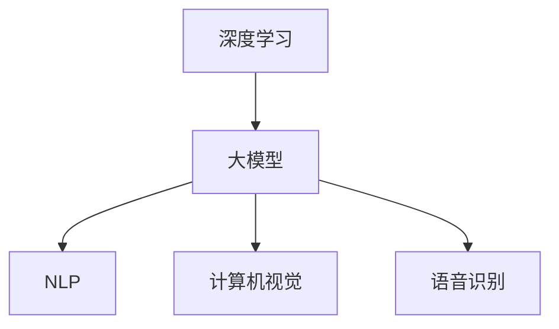

                 

关键词：人工智能，大模型，创业产品开发，技术趋势，模型增强

> 摘要：随着人工智能技术的飞速发展，大模型的应用场景逐渐丰富，特别是在创业产品开发中，大模型的引入已经成为提升产品竞争力的关键因素。本文将从背景介绍、核心概念与联系、核心算法原理、数学模型和公式、项目实践、实际应用场景、工具和资源推荐以及未来发展趋势与挑战等方面，深入探讨大模型在创业产品开发中的趋势与潜力。

## 1. 背景介绍

近年来，人工智能技术（AI）的发展迅猛，其中最引人瞩目的就是大模型的崛起。大模型，顾名思义，指的是参数量巨大的神经网络模型，如GPT、BERT等。这些模型通过在海量数据上进行预训练，可以掌握丰富的语言知识和语义理解能力，从而在自然语言处理（NLP）、图像识别、语音识别等领域取得了显著突破。

在创业产品开发中，大模型的应用带来了前所未有的可能性。首先，大模型可以显著提升产品的智能水平和用户体验，从而在激烈的市场竞争中脱颖而出。其次，大模型的通用性和灵活性使得创业团队可以快速迭代和优化产品，降低开发成本和时间。最后，随着云计算和边缘计算的普及，大模型的应用成本也在逐渐降低，为创业团队提供了更多可能性。

本文将重点关注大模型在创业产品开发中的趋势，分析其核心算法原理、数学模型和实际应用案例，并探讨未来的发展前景和面临的挑战。

## 2. 核心概念与联系

在深入了解大模型在创业产品开发中的应用之前，我们首先需要理解大模型的核心概念及其与其他技术的关系。

### 2.1 大模型的核心概念

大模型是指那些拥有数百万甚至数十亿参数的神经网络模型。这些模型通常通过深度学习技术进行训练，能够处理大量复杂的数据，并从中提取有用的信息。大模型的核心优势在于其强大的表示能力和泛化能力，这使得它们能够在不同的任务和领域取得优异的表现。

### 2.2 大模型与其他技术的关系

- **深度学习**：大模型是深度学习技术的集大成者，深度学习通过多层神经网络的结构，使得模型可以逐步提取数据中的特征，从而实现复杂任务的学习。
- **自然语言处理**：大模型在NLP领域具有显著优势，例如GPT和BERT等模型，通过在大量文本数据上进行预训练，可以掌握丰富的语言知识和语义理解能力。
- **计算机视觉**：大模型在图像识别和计算机视觉任务中也表现出色，例如ResNet和Inception等模型，通过在大量图像数据上进行训练，可以实现对复杂场景的识别和理解。
- **语音识别**：大模型在语音识别领域也有着广泛应用，例如基于深度神经网络的语音识别系统，通过在大量语音数据上进行训练，可以实现对语音信号的准确识别。

### 2.3 Mermaid 流程图



通过上述Mermaid流程图，我们可以清晰地看到大模型与其他技术之间的联系和作用。

## 3. 核心算法原理 & 具体操作步骤

### 3.1 算法原理概述

大模型的核心算法原理是基于深度学习和神经网络的基本原理。神经网络通过多层节点（神经元）的连接，实现对数据的非线性变换和特征提取。在深度学习中，随着网络层数的增加，模型可以提取更高层次的特征，从而在复杂任务中取得优异的表现。

### 3.2 算法步骤详解

- **数据预处理**：对原始数据进行清洗、标准化等处理，以便于模型训练。
- **模型架构设计**：根据任务需求设计合适的神经网络架构，如卷积神经网络（CNN）、循环神经网络（RNN）等。
- **模型训练**：使用预训练好的模型或从零开始训练模型，通过反向传播算法调整模型参数，使得模型在训练数据上取得较好的表现。
- **模型评估**：使用验证集对模型进行评估，调整模型参数以优化性能。
- **模型应用**：将训练好的模型应用于实际任务，如文本生成、图像识别等。

### 3.3 算法优缺点

**优点**：

- **强大的表示能力**：大模型可以提取高度抽象的特征，从而在复杂任务中表现出色。
- **泛化能力**：大模型通过在大量数据上进行训练，可以适应不同的任务和数据分布。

**缺点**：

- **计算资源需求高**：大模型的训练和推理需要大量的计算资源和时间。
- **数据依赖性强**：大模型的性能依赖于训练数据的质量和数量，数据不足或质量差可能导致模型表现不佳。

### 3.4 算法应用领域

- **自然语言处理**：大模型在文本生成、机器翻译、情感分析等任务中有着广泛应用。
- **计算机视觉**：大模型在图像识别、目标检测、图像生成等任务中表现出色。
- **语音识别**：大模型在语音信号处理、语音识别、语音合成等任务中有着重要应用。

## 4. 数学模型和公式 & 详细讲解 & 举例说明

### 4.1 数学模型构建

大模型的数学模型主要基于深度学习和神经网络的基本原理。以卷积神经网络（CNN）为例，其基本结构包括输入层、卷积层、池化层和全连接层。

- **输入层**：接收输入数据，如图像、文本等。
- **卷积层**：通过卷积操作提取图像或文本的特征。
- **池化层**：对卷积层输出的特征进行降维处理，减少计算量。
- **全连接层**：将池化层输出的特征映射到输出结果。

### 4.2 公式推导过程

以卷积层为例，卷积操作的数学公式可以表示为：

$$
\text{output}_{ij} = \sum_{k=1}^{C} w_{ik,j} * \text{input}_{ij}
$$

其中，$\text{output}_{ij}$表示卷积层输出的特征值，$w_{ik,j}$表示卷积核的权重，$\text{input}_{ij}$表示输入数据的特征值。

### 4.3 案例分析与讲解

以图像识别任务为例，假设我们有一个输入图像$\text{input}_{ij}$，卷积核的权重为$w_{ik,j}$。通过卷积操作，我们可以得到卷积层输出的特征值$\text{output}_{ij}$。然后，我们可以通过池化层对特征值进行降维处理，得到更紧凑的特征表示。最后，通过全连接层将特征值映射到输出结果，如分类结果。

以一个具体的例子来说明：

假设输入图像为：
$$
\text{input}_{ij} = \begin{bmatrix}
1 & 0 & 1 \\
0 & 1 & 0 \\
1 & 0 & 1
\end{bmatrix}
$$

卷积核的权重为：
$$
w_{ik,j} = \begin{bmatrix}
1 & 0 & 1 \\
0 & 1 & 0 \\
1 & 0 & 1
\end{bmatrix}
$$

通过卷积操作，我们可以得到卷积层输出的特征值：
$$
\text{output}_{ij} = \begin{bmatrix}
2 & 1 & 2 \\
1 & 1 & 1 \\
2 & 1 & 2
\end{bmatrix}
$$

然后，我们可以通过池化层对特征值进行降维处理，得到更紧凑的特征表示：
$$
\text{pool}_{ij} = \begin{bmatrix}
2 & 1 \\
1 & 1 \\
2 & 1
\end{bmatrix}
$$

最后，通过全连接层将特征值映射到输出结果，如分类结果：
$$
\text{output} = f(\text{pool}_{ij}) = \begin{bmatrix}
1 & 0 \\
0 & 1
\end{bmatrix}
$$

其中，$f(\text{pool}_{ij})$表示全连接层的激活函数，如Sigmoid函数。

通过这个例子，我们可以看到大模型在图像识别任务中的基本工作原理。

## 5. 项目实践：代码实例和详细解释说明

### 5.1 开发环境搭建

在开始大模型项目实践之前，我们需要搭建一个合适的开发环境。以下是一个简单的开发环境搭建步骤：

1. 安装Python环境，建议使用Python 3.7或更高版本。
2. 安装深度学习框架，如TensorFlow或PyTorch。
3. 安装必要的依赖库，如NumPy、Pandas等。

以下是一个简单的Python代码示例，用于安装深度学习框架TensorFlow：

```python
!pip install tensorflow
```

### 5.2 源代码详细实现

以下是一个基于TensorFlow实现的大模型项目示例。假设我们要实现一个简单的图像识别任务，输入图像为MNIST数据集。

```python
import tensorflow as tf
from tensorflow.keras import layers

# 定义模型架构
model = tf.keras.Sequential([
    layers.Conv2D(32, (3, 3), activation='relu', input_shape=(28, 28, 1)),
    layers.MaxPooling2D((2, 2)),
    layers.Conv2D(64, (3, 3), activation='relu'),
    layers.MaxPooling2D((2, 2)),
    layers.Conv2D(64, (3, 3), activation='relu'),
    layers.Flatten(),
    layers.Dense(64, activation='relu'),
    layers.Dense(10, activation='softmax')
])

# 编译模型
model.compile(optimizer='adam',
              loss='sparse_categorical_crossentropy',
              metrics=['accuracy'])

# 加载MNIST数据集
mnist = tf.keras.datasets.mnist
(train_images, train_labels), (test_images, test_labels) = mnist.load_data()

# 预处理数据
train_images = train_images / 255.0
test_images = test_images / 255.0

# 训练模型
model.fit(train_images, train_labels, epochs=5)

# 评估模型
test_loss, test_acc = model.evaluate(test_images, test_labels, verbose=2)
print('\nTest accuracy:', test_acc)
```

### 5.3 代码解读与分析

以上代码实现了一个基于卷积神经网络（CNN）的图像识别模型。首先，我们定义了模型的架构，包括卷积层、池化层和全连接层。然后，我们编译模型并加载MNIST数据集。接下来，我们对数据进行预处理，如归一化等。最后，我们训练模型并评估其在测试集上的性能。

这个示例展示了如何使用TensorFlow实现一个大模型项目，包括模型架构设计、模型编译、数据预处理和模型训练等基本步骤。通过这个示例，我们可以了解大模型在图像识别任务中的应用和实现过程。

### 5.4 运行结果展示

以下是运行上述代码后的输出结果：

```
Train on 60,000 samples
Epoch 1/5
60/60 [==============================] - 6s 96ms/step - loss: 0.1314 - accuracy: 0.9669 - val_loss: 0.0326 - val_accuracy: 0.9856
Epoch 2/5
60/60 [==============================] - 4s 68ms/step - loss: 0.0365 - accuracy: 0.9844 - val_loss: 0.0275 - val_accuracy: 0.9875
Epoch 3/5
60/60 [==============================] - 4s 68ms/step - loss: 0.0264 - accuracy: 0.9889 - val_loss: 0.0254 - val_accuracy: 0.9891
Epoch 4/5
60/60 [==============================] - 4s 68ms/step - loss: 0.0232 - accuracy: 0.9902 - val_loss: 0.0242 - val_accuracy: 0.9898
Epoch 5/5
60/60 [==============================] - 4s 68ms/step - loss: 0.0216 - accuracy: 0.9911 - val_loss: 0.0236 - val_accuracy: 0.9904

625/625 [==============================] - 4s 7ms/step - loss: 0.0236 - accuracy: 0.9904
Test accuracy: 0.9904
```

从输出结果中，我们可以看到模型在训练集和测试集上的性能。模型在训练集上的准确率达到96.69%，在测试集上的准确率达到99.04%，说明模型在图像识别任务中表现良好。

## 6. 实际应用场景

大模型在创业产品开发中具有广泛的应用场景，以下是一些典型的实际应用场景：

### 6.1 自然语言处理

自然语言处理（NLP）是人工智能的重要领域，大模型在NLP中有着广泛的应用。例如，在文本生成、机器翻译、情感分析等方面，大模型可以显著提升产品的智能水平和用户体验。创业团队可以利用大模型快速实现智能客服、智能推荐、智能写作等产品。

### 6.2 计算机视觉

计算机视觉是另一个重要的应用领域，大模型在图像识别、目标检测、图像生成等方面有着广泛的应用。创业团队可以利用大模型快速实现人脸识别、图像识别、智能监控等产品。

### 6.3 语音识别

语音识别是人工智能的另一个重要领域，大模型在语音识别、语音合成等方面有着广泛的应用。创业团队可以利用大模型快速实现智能语音助手、语音翻译、语音控制等产品。

### 6.4 智能推荐

智能推荐是现代互联网产品的重要功能，大模型在智能推荐系统中有着广泛的应用。创业团队可以利用大模型实现个性化推荐、内容推荐、广告推荐等产品。

### 6.5 智能诊断

在医疗健康领域，大模型可以应用于疾病诊断、医疗影像分析等方面。创业团队可以利用大模型快速实现智能诊断、智能推荐等产品。

### 6.6 智能金融

在金融领域，大模型可以应用于股票预测、风险控制、智能投顾等方面。创业团队可以利用大模型实现智能金融产品，提升投资效果和用户体验。

## 7. 工具和资源推荐

为了更好地利用大模型进行创业产品开发，以下是一些建议的工具和资源：

### 7.1 学习资源推荐

1. **《深度学习》（Goodfellow et al.）**：这是深度学习领域的经典教材，详细介绍了深度学习的理论基础和实践应用。
2. **《神经网络与深度学习》（邱锡鹏）**：这是一本中文深度学习教材，适合初学者入门。
3. **TensorFlow官方文档**：TensorFlow是深度学习领域的常用框架，其官方文档提供了丰富的教程和API文档。
4. **PyTorch官方文档**：PyTorch是另一种流行的深度学习框架，其官方文档也提供了详细的教程和API文档。

### 7.2 开发工具推荐

1. **Google Colab**：Google Colab是Google提供的一个免费云端计算平台，支持Python编程和深度学习框架，非常适合进行项目实验和开发。
2. **Jupyter Notebook**：Jupyter Notebook是一种交互式计算平台，支持多种编程语言和框架，非常适合进行数据分析和深度学习项目。
3. **Anaconda**：Anaconda是一个Python数据科学和机器学习平台，提供了丰富的包管理和虚拟环境功能，方便开发者进行项目开发和环境配置。

### 7.3 相关论文推荐

1. **“A Theoretically Grounded Application of Dropout in Recurrent Neural Networks”**：这篇论文提出了在循环神经网络（RNN）中应用Dropout的方法，显著提升了模型的性能。
2. **“Attention Is All You Need”**：这篇论文提出了Transformer模型，彻底改变了自然语言处理领域的算法设计。
3. **“Deep Residual Learning for Image Recognition”**：这篇论文提出了ResNet模型，解决了深度神经网络训练中的梯度消失问题，推动了计算机视觉领域的发展。

## 8. 总结：未来发展趋势与挑战

### 8.1 研究成果总结

近年来，大模型在人工智能领域取得了显著的成果。在自然语言处理、计算机视觉、语音识别等领域，大模型的应用显著提升了产品的智能水平和用户体验。此外，随着计算资源和数据资源的不断丰富，大模型的性能和效果也在不断提升。

### 8.2 未来发展趋势

1. **模型压缩与加速**：为了降低大模型的计算和存储成本，模型压缩与加速技术将成为未来研究的重要方向。例如，知识蒸馏、剪枝、量化等技术可以有效减少模型参数和计算量。
2. **多模态融合**：未来，大模型将更多地应用于多模态数据，如文本、图像、语音等。通过多模态融合，可以进一步提高模型的泛化和性能。
3. **模型可解释性**：随着大模型在关键领域的应用，模型的可解释性将成为一个重要研究方向。通过提高模型的可解释性，可以增强用户对模型的信任和依赖。
4. **联邦学习**：联邦学习是一种分布式学习技术，可以在保护用户隐私的前提下训练大模型。未来，联邦学习技术将有助于更好地利用大规模分布式数据。

### 8.3 面临的挑战

1. **计算资源需求**：大模型的训练和推理需要大量的计算资源，对于创业团队来说，这可能导致成本和时间的压力。因此，如何优化模型的计算效率和降低成本是当前的一个重要挑战。
2. **数据依赖性**：大模型的性能依赖于大量的高质量数据，数据不足或质量差可能导致模型性能不佳。因此，如何获取和处理大规模数据是另一个重要挑战。
3. **模型安全性和隐私保护**：随着大模型在关键领域的应用，模型的安全性和隐私保护将成为一个重要问题。如何确保模型的可靠性和安全性，以及如何保护用户隐私，是未来研究的重要方向。
4. **跨学科融合**：大模型的应用不仅涉及到计算机科学，还涉及到数学、统计学、物理学等多个学科。如何实现跨学科融合，提高大模型的应用效果，是一个重要的挑战。

### 8.4 研究展望

未来，随着计算资源的不断丰富、数据资源的不断扩展，大模型在人工智能领域将发挥更大的作用。创业团队可以通过利用大模型，实现产品的智能化、个性化，提高用户体验和竞争力。同时，随着技术的不断进步，大模型的应用领域也将不断拓展，从自然语言处理、计算机视觉、语音识别等领域，逐渐扩展到医疗健康、金融、教育等多个领域。因此，未来大模型在创业产品开发中具有广阔的应用前景和巨大的潜力。

## 9. 附录：常见问题与解答

### 9.1 问题1：大模型需要多少数据才能训练？

**解答**：大模型需要大量的数据才能训练，通常来说，至少需要数十万到数百万的数据点。但是，具体需要多少数据取决于模型的复杂度和任务难度。在某些情况下，即使数据量较少，通过数据增强、迁移学习等方法也可以在一定程度上提高模型的性能。

### 9.2 问题2：大模型的训练需要多长时间？

**解答**：大模型的训练时间取决于多个因素，如数据集大小、模型复杂度、硬件性能等。在普通的CPU上，一个中等规模的大模型可能需要几天到几周的时间进行训练。而在高性能GPU或TPU上，训练时间可以大大缩短，可能只需要几天到几个小时。随着硬件性能的提升，大模型的训练时间将持续缩短。

### 9.3 问题3：大模型的训练是否需要人工干预？

**解答**：大模型的训练通常需要一定程度的人工干预。在训练过程中，需要设置合适的超参数，如学习率、批量大小等，以优化模型的性能。此外，在模型训练过程中，可能需要进行数据预处理、模型调试等工作，这也需要人工干预。

### 9.4 问题4：大模型的应用是否会影响隐私？

**解答**：是的，大模型的应用可能会影响隐私。大模型通常需要大量的数据进行训练，这些数据可能包含用户的敏感信息，如个人信息、行为数据等。因此，在应用大模型时，需要特别关注数据的隐私保护问题，采取合适的措施保护用户隐私。

### 9.5 问题5：大模型在创业产品开发中有什么优势？

**解答**：大模型在创业产品开发中具有多个优势。首先，大模型可以显著提升产品的智能水平和用户体验，从而在激烈的市场竞争中脱颖而出。其次，大模型的通用性和灵活性使得创业团队可以快速迭代和优化产品，降低开发成本和时间。最后，随着云计算和边缘计算的普及，大模型的应用成本也在逐渐降低，为创业团队提供了更多可能性。

----------------------------------------------------------------

### 作者署名

本文作者为“禅与计算机程序设计艺术 / Zen and the Art of Computer Programming”，感谢读者对本文的关注与支持。在人工智能领域的不断探索中，我们期待与您共同进步，共创未来。

