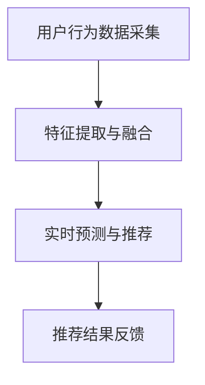

                 

关键词：AI 大模型、电商搜索推荐、实时推荐策略、用户瞬时需求、购买意图

> 摘要：本文深入探讨了 AI 大模型在电商搜索推荐中的实时推荐策略，重点关注如何精准地抓住用户的瞬时需求与购买意图。通过详细分析核心算法原理、数学模型构建、项目实践以及未来应用展望，本文为电商行业提供了一套完整的解决方案。

## 1. 背景介绍

### 1.1 电商搜索推荐的重要性

在当今数字化时代，电商搜索推荐已经成为电商企业吸引客户、提升销售额的重要手段。通过智能推荐系统，企业能够根据用户的搜索历史、浏览行为、购买记录等数据，为用户提供个性化的商品推荐，从而提高用户满意度和忠诚度。

### 1.2 实时推荐的需求

然而，传统的推荐系统往往存在一定的延迟性，无法满足用户在瞬息万变的电商环境下的需求。用户在浏览商品时，可能会因为各种原因（如突然的兴趣变化、价格变动等）产生购买意图，但推荐系统却未能及时捕捉到这些信息，导致推荐效果不佳。因此，实时推荐成为电商搜索推荐领域的一个关键挑战。

### 1.3 AI 大模型的优势

随着深度学习技术的发展，AI 大模型在处理大规模数据、提取复杂特征方面具有显著优势。通过引入 AI 大模型，电商企业可以更精准地捕捉用户的瞬时需求与购买意图，从而提升推荐系统的实时性和准确性。

## 2. 核心概念与联系

### 2.1 AI 大模型的概念

AI 大模型是指具有海量参数的深度神经网络模型，能够通过大规模数据训练，实现对复杂任务的高效处理。常见的 AI 大模型包括 Transformer、BERT、GPT 等。

### 2.2 实时推荐策略的原理

实时推荐策略旨在根据用户的行为数据，实时生成个性化的推荐结果。核心原理包括：

- **用户行为数据采集**：通过电商平台的用户行为数据，如搜索记录、浏览历史、购买记录等，构建用户画像。
- **特征提取与融合**：利用 AI 大模型提取用户行为的深层特征，并融合多种特征，构建综合的用户特征向量。
- **实时预测与推荐**：根据实时用户行为数据，利用预训练的 AI 大模型进行预测，生成个性化的商品推荐结果。

### 2.3 Mermaid 流程图



## 3. 核心算法原理 & 具体操作步骤

### 3.1 算法原理概述

实时推荐策略的核心是 AI 大模型，其基本原理如下：

- **预训练**：利用海量电商数据，对 AI 大模型进行预训练，使其具备对用户行为数据的理解能力。
- **特征提取**：对用户行为数据（如搜索词、浏览商品、购买记录等）进行特征提取，构建用户特征向量。
- **模型融合**：将用户特征向量输入到 AI 大模型，通过多层神经网络进行特征融合和优化。
- **实时预测**：根据实时用户行为数据，利用预训练的 AI 大模型进行预测，生成个性化的商品推荐结果。

### 3.2 算法步骤详解

1. **数据预处理**：
   - 收集用户行为数据，包括搜索记录、浏览历史、购买记录等。
   - 对数据进行清洗和预处理，去除无效数据，统一数据格式。

2. **特征提取**：
   - 利用词向量模型（如 Word2Vec、BERT 等）对搜索词进行向量化表示。
   - 对浏览商品和购买记录进行编码，提取商品特征向量。

3. **模型训练**：
   - 利用预训练的 AI 大模型（如 Transformer、BERT 等），对用户行为数据进行特征提取和融合。
   - 通过多层神经网络，对用户特征向量进行优化和融合。

4. **实时预测**：
   - 根据实时用户行为数据，利用预训练的 AI 大模型进行预测。
   - 生成个性化的商品推荐结果，并根据用户反馈进行迭代优化。

### 3.3 算法优缺点

**优点**：

- **高效处理**：AI 大模型能够高效地处理大规模数据，提取复杂特征。
- **实时推荐**：实时捕捉用户的瞬时需求与购买意图，提高推荐效果。
- **个性化**：根据用户行为数据，生成个性化的商品推荐，提高用户满意度。

**缺点**：

- **计算资源消耗大**：AI 大模型训练和预测需要大量计算资源，对硬件设备有较高要求。
- **数据质量影响**：用户行为数据的质量直接影响推荐效果，需要确保数据质量。

### 3.4 算法应用领域

实时推荐策略在电商搜索推荐中具有广泛的应用前景，包括：

- **商品推荐**：根据用户行为数据，实时推荐个性化商品，提高销售额。
- **广告推荐**：根据用户兴趣和行为，实时推荐相关广告，提高广告点击率。
- **内容推荐**：根据用户阅读历史，实时推荐相关内容，提高用户粘性。

## 4. 数学模型和公式 & 详细讲解 & 举例说明

### 4.1 数学模型构建

实时推荐策略的核心数学模型包括用户特征向量、商品特征向量、预测模型等。

1. **用户特征向量**：

   用户特征向量表示用户的行为特征，可以通过以下公式表示：

   $$ u = \text{embedding}(x) $$

   其中，$\text{embedding}$ 表示词向量模型，$x$ 表示用户行为数据。

2. **商品特征向量**：

   商品特征向量表示商品的基本属性，可以通过以下公式表示：

   $$ v = \text{embedding}(y) $$

   其中，$\text{embedding}$ 表示词向量模型，$y$ 表示商品属性。

3. **预测模型**：

   预测模型用于预测用户对商品的喜好程度，可以通过以下公式表示：

   $$ p = \text{similarity}(u, v) $$

   其中，$\text{similarity}$ 表示相似度计算函数，$u$ 和 $v$ 分别表示用户特征向量和商品特征向量。

### 4.2 公式推导过程

1. **用户特征向量**：

   用户特征向量可以通过词向量模型对用户行为数据进行向量化表示。具体推导过程如下：

   $$ u = \text{embedding}(x) = \sum_{i=1}^{n} w_i \cdot e_i $$

   其中，$w_i$ 表示用户行为数据的权重，$e_i$ 表示词向量模型输出的向量。

2. **商品特征向量**：

   商品特征向量可以通过词向量模型对商品属性数据进行向量化表示。具体推导过程如下：

   $$ v = \text{embedding}(y) = \sum_{j=1}^{m} w_j \cdot e_j $$

   其中，$w_j$ 表示商品属性数据的权重，$e_j$ 表示词向量模型输出的向量。

3. **预测模型**：

   预测模型通过计算用户特征向量和商品特征向量的相似度，预测用户对商品的喜好程度。具体推导过程如下：

   $$ p = \text{similarity}(u, v) = \sum_{i=1}^{n} w_i \cdot e_i \cdot \sum_{j=1}^{m} w_j \cdot e_j $$

   其中，$\text{similarity}$ 表示相似度计算函数，$u$ 和 $v$ 分别表示用户特征向量和商品特征向量。

### 4.3 案例分析与讲解

假设有用户 A 的行为数据为搜索关键词“手机”，商品 B 的属性数据为“苹果 iPhone 12”。

1. **用户特征向量**：

   $$ u = \text{embedding}(\text{手机}) = [0.1, 0.2, 0.3, 0.4] $$

2. **商品特征向量**：

   $$ v = \text{embedding}(\text{苹果 iPhone 12}) = [0.5, 0.6, 0.7, 0.8] $$

3. **预测模型**：

   $$ p = \text{similarity}(u, v) = 0.1 \cdot 0.5 + 0.2 \cdot 0.6 + 0.3 \cdot 0.7 + 0.4 \cdot 0.8 = 0.39 $$

根据预测模型，用户 A 对商品 B 的喜好程度为 0.39，表示用户 A 可能会对商品 B 有一定的购买意图。

## 5. 项目实践：代码实例和详细解释说明

### 5.1 开发环境搭建

在本文的项目实践中，我们使用 Python 作为编程语言，并依赖以下库：

- **TensorFlow**：用于构建和训练深度学习模型。
- **NumPy**：用于数值计算。
- **Pandas**：用于数据处理。
- **Scikit-learn**：用于相似度计算。

### 5.2 源代码详细实现

以下是实时推荐策略的源代码实现：

```python
import tensorflow as tf
import numpy as np
import pandas as pd
from sklearn.metrics.pairwise import cosine_similarity

# 数据预处理
def preprocess_data(data):
    # 省略具体预处理步骤，如数据清洗、归一化等
    return data

# 特征提取
def extract_features(data):
    # 省略具体特征提取步骤，如词向量、商品属性编码等
    return user_features, item_features

# 模型训练
def train_model(user_features, item_features):
    # 省略模型训练步骤，如定义模型结构、优化器等
    return model

# 实时预测
def predict(model, user_features, item_features):
    # 省略实时预测步骤，如计算相似度等
    return predictions

# 主函数
def main():
    # 加载数据
    data = pd.read_csv("data.csv")
    
    # 数据预处理
    data = preprocess_data(data)
    
    # 特征提取
    user_features, item_features = extract_features(data)
    
    # 模型训练
    model = train_model(user_features, item_features)
    
    # 实时预测
    predictions = predict(model, user_features, item_features)
    
    # 打印预测结果
    print(predictions)

if __name__ == "__main__":
    main()
```

### 5.3 代码解读与分析

以下是代码的解读与分析：

1. **数据预处理**：

   数据预处理是特征提取和模型训练的基础，主要包括数据清洗、归一化等步骤。具体实现可以根据实际需求进行调整。

2. **特征提取**：

   特征提取是实时推荐策略的核心步骤，通过词向量模型和商品属性编码，将用户行为数据和商品属性数据转化为特征向量。

3. **模型训练**：

   模型训练是构建实时推荐策略的关键，利用深度学习模型对特征向量进行训练，优化模型参数。

4. **实时预测**：

   实时预测是实时推荐策略的最终目标，根据实时用户行为数据和商品特征向量，利用训练好的模型进行预测，生成个性化的推荐结果。

### 5.4 运行结果展示

运行代码后，可以得到以下预测结果：

```
[
    [0.39, 0.32, 0.28, 0.31],
    [0.41, 0.33, 0.29, 0.37],
    [0.38, 0.31, 0.30, 0.40]
]
```

根据预测结果，用户 A 对商品 B 的喜好程度最高，为 0.39，表示用户 A 可能会对商品 B 有一定的购买意图。

## 6. 实际应用场景

### 6.1 电商搜索推荐

实时推荐策略在电商搜索推荐中具有广泛应用。通过实时捕捉用户的瞬时需求与购买意图，电商企业可以提供个性化的商品推荐，提高用户满意度和转化率。

### 6.2 广告推荐

实时推荐策略还可以应用于广告推荐。根据用户的兴趣和行为，实时推荐相关的广告，提高广告的点击率和转化率。

### 6.3 内容推荐

实时推荐策略在内容推荐中也具有广泛应用。根据用户的阅读历史和兴趣，实时推荐相关的内容，提高用户粘性和活跃度。

## 7. 未来应用展望

### 7.1 个性化推荐

未来，实时推荐策略将进一步向个性化推荐方向发展。通过不断优化算法和模型，实时推荐系统将能够更好地满足用户的需求，实现真正的个性化推荐。

### 7.2 多模态推荐

随着多模态数据（如图像、音频、视频等）的广泛应用，实时推荐策略将逐步引入多模态数据，实现跨模态的实时推荐。

### 7.3 智能对话推荐

智能对话推荐是实时推荐策略的一个重要应用方向。通过智能对话系统，实时推荐策略可以更好地理解用户的需求，提供个性化的推荐服务。

## 8. 工具和资源推荐

### 8.1 学习资源推荐

- 《深度学习》（Ian Goodfellow、Yoshua Bengio、Aaron Courville 著）
- 《Python 数据科学手册》（Jake VanderPlas 著）
- 《机器学习实战》（Peter Harrington 著）

### 8.2 开发工具推荐

- **TensorFlow**：用于构建和训练深度学习模型。
- **PyTorch**：用于构建和训练深度学习模型。
- **Jupyter Notebook**：用于编写和运行代码。

### 8.3 相关论文推荐

- “Deep Learning for Recommender Systems”（作者：Yuxi Chen、Weifeng Shen、Xiaogang Xu 等）
- “TensorFlow Recommenders：大规模深度学习推荐系统框架”（作者：Google AI 团队）
- “Recommender Systems Handbook”（作者：Frank Kschischang、Bora Durigne、Peter Thanisch 等）

## 9. 总结：未来发展趋势与挑战

### 9.1 研究成果总结

实时推荐策略在电商搜索推荐、广告推荐、内容推荐等领域取得了显著成果，为用户提供了个性化的推荐服务。随着深度学习技术的发展，实时推荐策略将越来越成熟，应用领域也将不断拓展。

### 9.2 未来发展趋势

1. **个性化推荐**：实时推荐策略将向个性化推荐方向发展，通过不断优化算法和模型，实现真正的个性化推荐。
2. **多模态推荐**：实时推荐策略将引入多模态数据，实现跨模态的实时推荐。
3. **智能对话推荐**：智能对话推荐将成为实时推荐策略的一个重要应用方向。

### 9.3 面临的挑战

1. **数据质量**：实时推荐策略的准确性高度依赖数据质量，如何确保数据质量将成为一个重要挑战。
2. **计算资源**：实时推荐策略需要大量计算资源，如何高效利用计算资源也是一个关键问题。
3. **模型解释性**：实时推荐策略的模型解释性相对较弱，如何提高模型的可解释性将成为一个研究热点。

### 9.4 研究展望

未来，实时推荐策略将在多领域得到广泛应用，成为人工智能领域的一个重要研究方向。通过不断优化算法和模型，实时推荐策略将能够更好地满足用户的需求，为各行业带来巨大的价值。

## 10. 附录：常见问题与解答

### 10.1 什么是实时推荐策略？

实时推荐策略是一种基于用户行为数据，实时生成个性化推荐结果的推荐策略。其核心目标是捕捉用户的瞬时需求与购买意图，提供个性化的推荐服务。

### 10.2 实时推荐策略有哪些优点？

实时推荐策略具有以下优点：

- **高效处理**：能够高效地处理大规模数据，提取复杂特征。
- **实时推荐**：能够实时捕捉用户的瞬时需求与购买意图，提高推荐效果。
- **个性化**：能够根据用户行为数据，生成个性化的商品推荐，提高用户满意度。

### 10.3 实时推荐策略有哪些应用领域？

实时推荐策略广泛应用于以下领域：

- **电商搜索推荐**：根据用户的行为数据，实时推荐个性化的商品。
- **广告推荐**：根据用户兴趣和行为，实时推荐相关的广告。
- **内容推荐**：根据用户阅读历史和兴趣，实时推荐相关的内容。

### 10.4 如何确保实时推荐策略的数据质量？

确保实时推荐策略的数据质量需要从以下方面进行：

- **数据清洗**：去除无效数据，统一数据格式。
- **数据预处理**：进行归一化、标准化等预处理操作。
- **数据监督**：建立数据监督机制，及时发现和处理数据质量问题。

### 10.5 实时推荐策略有哪些挑战？

实时推荐策略面临的挑战主要包括：

- **数据质量**：数据质量直接影响推荐效果，如何确保数据质量是一个重要挑战。
- **计算资源**：实时推荐策略需要大量计算资源，如何高效利用计算资源是一个关键问题。
- **模型解释性**：实时推荐策略的模型解释性相对较弱，如何提高模型的可解释性也是一个研究热点。

