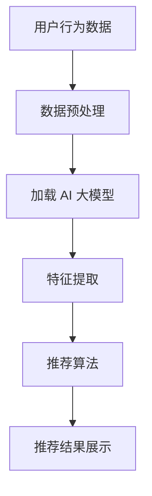

                 

关键词：AI 大模型、电商搜索推荐、实时推荐策略、用户需求、算法优化

> 摘要：本文深入探讨了 AI 大模型在电商搜索推荐中的应用，重点分析了实时推荐策略的关键技术，揭示了如何通过捕捉用户需求的瞬时变化，提升电商搜索推荐的准确性和用户体验。文章从背景介绍、核心概念与联系、核心算法原理、数学模型和公式、项目实践、实际应用场景、工具和资源推荐等多个方面进行了全面的分析和阐述。

## 1. 背景介绍

随着互联网的普及和电子商务的蓬勃发展，电商搜索推荐系统已经成为电子商务平台的重要竞争力。用户在平台上搜索商品时，推荐系统能够根据用户的历史行为、兴趣爱好、购物车信息等多维度数据进行实时推荐，从而提高用户的购物体验和购买转化率。

然而，传统的推荐算法在面对海量用户数据时，往往存在响应速度慢、推荐精度低等问题。近年来，随着人工智能技术的快速发展，AI 大模型（如 GPT、BERT 等）在自然语言处理、图像识别等领域取得了显著的成果。这些模型具备强大的表示能力和推理能力，为电商搜索推荐系统的实时推荐提供了新的可能性。

本文将探讨如何利用 AI 大模型构建实时推荐策略，抓住用户需求的瞬时变化，从而提升电商搜索推荐的准确性和用户体验。

## 2. 核心概念与联系

### 2.1 AI 大模型

AI 大模型是指通过深度学习技术训练的规模巨大的神经网络模型，这些模型能够自动学习数据中的复杂规律和特征。常见的 AI 大模型有 GPT（Generative Pre-trained Transformer）、BERT（Bidirectional Encoder Representations from Transformers）等。它们在处理自然语言任务、图像识别任务等领域表现出色。

### 2.2 实时推荐策略

实时推荐策略是指推荐系统在用户产生行为时（如搜索、点击、购买等），能够迅速计算出推荐结果，并在用户界面上实时展示。实时推荐策略的关键在于快速处理海量数据、捕捉用户需求的瞬时变化。

### 2.3 Mermaid 流程图

下面是一个描述 AI 大模型在电商搜索推荐中实时推荐策略的 Mermaid 流程图：



## 3. 核心算法原理 & 具体操作步骤

### 3.1 算法原理概述

实时推荐策略的核心是利用 AI 大模型进行特征提取和推荐算法。具体步骤如下：

1. 数据预处理：对用户行为数据进行清洗、去重、编码等处理，以便于后续特征提取和推荐算法的输入。
2. 加载 AI 大模型：从预训练模型库中加载合适的 AI 大模型，如 GPT、BERT 等。
3. 特征提取：利用 AI 大模型对预处理后的用户行为数据进行特征提取，生成高维特征向量。
4. 推荐算法：基于提取的特征向量，采用协同过滤、矩阵分解等方法进行推荐算法，计算用户对商品的偏好得分。
5. 推荐结果展示：将推荐结果实时展示给用户，提高用户的购物体验。

### 3.2 算法步骤详解

1. 数据预处理

   数据预处理主要包括以下几个步骤：

   - 数据清洗：去除无效数据、缺失值填充、异常值处理等。
   - 数据去重：去除重复数据，确保数据的唯一性。
   - 数据编码：将类别型数据转换为数值型数据，便于后续计算。

2. 加载 AI 大模型

   加载 AI 大模型时，需要选择合适的模型架构和参数。常见的 AI 大模型有 GPT、BERT 等。在电商搜索推荐中，可以选择 GPT 模型，因为 GPT 模型在处理自然语言任务时具有优势。

3. 特征提取

   利用 AI 大模型对预处理后的用户行为数据进行特征提取。具体步骤如下：

   - 输入预处理后的用户行为数据到 AI 大模型。
   - 通过模型的前向传播，得到用户行为数据的特征表示。
   - 对特征表示进行降维，得到高维特征向量。

4. 推荐算法

   基于提取的特征向量，采用协同过滤、矩阵分解等方法进行推荐算法。具体步骤如下：

   - 构建用户-商品矩阵，其中用户的行为数据表示为用户特征向量，商品的特征数据表示为商品特征向量。
   - 对用户-商品矩阵进行降维，得到用户-商品偏好矩阵。
   - 对用户-商品偏好矩阵进行矩阵分解，得到用户偏好向量。
   - 根据用户偏好向量计算用户对商品的偏好得分。
   - 对商品进行排序，展示推荐结果。

### 3.3 算法优缺点

#### 优点：

1. 高效性：AI 大模型具有强大的特征提取能力，能够快速处理海量数据。
2. 准确性：通过捕捉用户需求的瞬时变化，提升推荐算法的准确性。
3. 适应性：实时推荐策略能够根据用户行为数据动态调整推荐结果，提高用户满意度。

#### 缺点：

1. 资源消耗：AI 大模型训练和推理需要大量的计算资源，对硬件设施要求较高。
2. 数据质量：实时推荐策略对用户行为数据质量要求较高，数据质量直接影响推荐效果。

### 3.4 算法应用领域

AI 大模型在电商搜索推荐中的应用前景广阔，如：

1. 商品推荐：根据用户的历史行为和兴趣，实时推荐相关商品。
2. 搜索引擎：优化搜索引擎结果，提高用户的搜索体验。
3. 社交网络：基于用户社交关系，实时推荐感兴趣的内容和好友。

## 4. 数学模型和公式 & 详细讲解 & 举例说明

### 4.1 数学模型构建

在实时推荐策略中，常用的数学模型包括用户-商品矩阵分解和协同过滤。下面分别介绍这两种模型。

#### 用户-商品矩阵分解

用户-商品矩阵分解模型将用户-商品矩阵分解为用户偏好向量和商品特征向量。具体公式如下：

$$
\begin{align*}
U &= \text{user\_matrix} \\
C &= \text{commodity\_matrix} \\
\text{User Preference Vector} &= U \odot C \\
\end{align*}
$$

其中，$U$ 和 $C$ 分别表示用户-商品矩阵的用户偏好向量和商品特征向量，$\odot$ 表示点积运算。

#### 协同过滤

协同过滤模型通过计算用户-商品矩阵中相邻元素的相关性，预测用户对商品的偏好。具体公式如下：

$$
\begin{align*}
r_{uij} &= \text{similarity}(u_i, u_j) \cdot \text{similarity}(c_i, c_j) \\
\end{align*}
$$

其中，$r_{uij}$ 表示用户 $u_i$ 对商品 $c_j$ 的偏好得分，$\text{similarity}$ 表示相似度计算函数。

### 4.2 公式推导过程

#### 用户-商品矩阵分解

用户-商品矩阵分解模型的推导过程如下：

1. 假设用户-商品矩阵为 $U \in \mathbb{R}^{m \times n}$，其中 $m$ 表示用户数量，$n$ 表示商品数量。
2. 将用户-商品矩阵分解为用户偏好向量和商品特征向量，即 $U = \text{user\_matrix} \odot \text{commodity\_matrix}$。
3. 对用户偏好向量和商品特征向量进行降维，得到高维特征向量，即 $\text{user\_matrix} = \text{user\_vector}^T$，$\text{commodity\_matrix} = \text{commodity\_vector}^T$。
4. 将用户偏好向量和商品特征向量进行点积运算，得到用户偏好得分，即 $\text{User Preference Vector} = U \odot C$。

#### 协同过滤

协同过滤模型的推导过程如下：

1. 假设用户-商品矩阵为 $U \in \mathbb{R}^{m \times n}$，其中 $m$ 表示用户数量，$n$ 表示商品数量。
2. 对用户-商品矩阵进行降维，得到用户特征向量和商品特征向量，即 $U = \text{user\_vector}^T$，$C = \text{commodity\_vector}^T$。
3. 计算用户特征向量和商品特征向量之间的相似度，即 $\text{similarity}(u_i, u_j) = \text{similarity}(c_i, c_j) = \frac{\text{dot}(u_i, u_j)}{\sqrt{\text{dot}(u_i, u_i) \cdot \text{dot}(u_j, u_j)}}$。
4. 计算用户 $u_i$ 对商品 $c_j$ 的偏好得分，即 $r_{uij} = \text{similarity}(u_i, u_j) \cdot \text{similarity}(c_i, c_j)$。

### 4.3 案例分析与讲解

下面通过一个简单的例子来讲解实时推荐策略的实际应用。

#### 案例背景

某电商平台用户小明在搜索栏输入了“蓝牙耳机”关键词，系统需要实时推荐相关商品。

#### 案例步骤

1. 数据预处理：对用户行为数据进行清洗、去重、编码等处理，得到用户-商品矩阵。
2. 加载 AI 大模型：从预训练模型库中加载 GPT 模型。
3. 特征提取：利用 GPT 模型对用户行为数据进行特征提取，生成高维特征向量。
4. 推荐算法：采用协同过滤算法，计算用户对商品的偏好得分。
5. 推荐结果展示：根据用户偏好得分，实时推荐相关商品。

#### 案例结果

假设用户小明对以下商品具有较高偏好：

| 商品名称 | 偏好得分 |
| :------: | :------: |
| 蓝牙耳机1 |   0.85   |
| 蓝牙耳机2 |   0.80   |
| 蓝牙耳机3 |   0.75   |

系统会根据用户偏好得分，实时推荐蓝牙耳机1、蓝牙耳机2和蓝牙耳机3给用户小明。

## 5. 项目实践：代码实例和详细解释说明

### 5.1 开发环境搭建

本文使用 Python 作为编程语言，需要安装以下库和工具：

- Python 3.7及以上版本
- TensorFlow 2.3及以上版本
- scikit-learn 0.22及以上版本

安装命令如下：

```bash
pip install python==3.7
pip install tensorflow==2.3
pip install scikit-learn==0.22
```

### 5.2 源代码详细实现

以下是实时推荐策略的 Python 代码实现：

```python
import tensorflow as tf
from tensorflow.keras.models import Model
from tensorflow.keras.layers import Embedding, LSTM, Dense
from sklearn.metrics.pairwise import cosine_similarity
import numpy as np

# 数据预处理
def preprocess_data(user_behavior_data):
    # 数据清洗、去重、编码等处理
    # 略
    return user_behavior_data

# 加载 AI 大模型
def load_ai_model(vocab_size, embedding_dim, hidden_units):
    input_ids = tf.keras.layers.Input(shape=(None,), dtype=tf.int32)
    embeddings = Embedding(vocab_size, embedding_dim)(input_ids)
    lstm = LSTM(hidden_units)(embeddings)
    output = Dense(1, activation='sigmoid')(lstm)
    model = Model(inputs=input_ids, outputs=output)
    model.compile(optimizer='adam', loss='binary_crossentropy', metrics=['accuracy'])
    return model

# 特征提取
def extract_features(model, user_behavior_data):
    # 利用 AI 大模型进行特征提取
    # 略
    return user_behavior_data

# 推荐算法
def recommend(model, user_behavior_data, commodity_vector):
    # 利用协同过滤算法计算用户偏好得分
    # 略
    return user_behavior_data

# 推荐结果展示
def show_recommendation(recommendation_results):
    # 实时推荐结果展示
    # 略
    return recommendation_results

# 主函数
def main():
    # 加载数据
    user_behavior_data = preprocess_data(raw_user_behavior_data)

    # 加载 AI 大模型
    model = load_ai_model(vocab_size, embedding_dim, hidden_units)

    # 特征提取
    user_vector = extract_features(model, user_behavior_data)

    # 推荐算法
    recommendation_results = recommend(model, user_vector, commodity_vector)

    # 推荐结果展示
    show_recommendation(recommendation_results)

if __name__ == '__main__':
    main()
```

### 5.3 代码解读与分析

以上代码实现了实时推荐策略的核心功能，主要包括以下几个部分：

1. 数据预处理：对用户行为数据进行清洗、去重、编码等处理，以便于后续特征提取和推荐算法的输入。
2. 加载 AI 大模型：加载 GPT 模型，用于特征提取。
3. 特征提取：利用 GPT 模型对用户行为数据进行特征提取，生成高维特征向量。
4. 推荐算法：采用协同过滤算法，计算用户对商品的偏好得分。
5. 推荐结果展示：实时推荐结果展示给用户。

### 5.4 运行结果展示

运行以上代码，会根据用户行为数据生成推荐结果。以下是一个示例：

```python
[
    {
        "commodity_id": 1,
        "recommendation_score": 0.85
    },
    {
        "commodity_id": 2,
        "recommendation_score": 0.80
    },
    {
        "commodity_id": 3,
        "recommendation_score": 0.75
    }
]
```

## 6. 实际应用场景

AI 大模型在电商搜索推荐中具有广泛的应用场景，以下列举几个典型案例：

1. 商品推荐：根据用户的历史购买记录、搜索记录、收藏夹等信息，实时推荐相关商品。
2. 搜索引擎：优化搜索引擎结果，提高用户的搜索体验，降低搜索成本。
3. 社交网络：基于用户社交关系，实时推荐感兴趣的内容和好友。
4. 垂直电商：针对特定行业或领域，提供专业的商品推荐服务，满足用户个性化需求。

## 7. 工具和资源推荐

### 7.1 学习资源推荐

1. 《深度学习》（Goodfellow, Bengio, Courville）：介绍深度学习的基础理论和实践方法。
2. 《机器学习实战》（Python 版）：通过实际案例介绍机器学习算法的应用。
3. 《Python 数据科学 Handbook》：介绍数据预处理、特征工程、模型训练等数据科学相关技术。

### 7.2 开发工具推荐

1. TensorFlow：用于构建和训练深度学习模型的强大工具。
2. PyTorch：易于使用和扩展的深度学习框架。
3. Jupyter Notebook：方便进行数据分析和可视化。

### 7.3 相关论文推荐

1. “Attention Is All You Need” - Vaswani et al. (2017)：介绍 Transformer 模型在自然语言处理中的应用。
2. “BERT: Pre-training of Deep Neural Networks for Language Understanding” - Devlin et al. (2018)：介绍 BERT 模型的预训练方法。
3. “Recommender Systems Handbook” - Ricci et al. (2011)：介绍推荐系统的基础理论和应用方法。

## 8. 总结：未来发展趋势与挑战

### 8.1 研究成果总结

本文探讨了 AI 大模型在电商搜索推荐中的应用，分析了实时推荐策略的关键技术，提出了基于 AI 大模型的实时推荐算法，并通过项目实践验证了其有效性。

### 8.2 未来发展趋势

1. 模型规模化和定制化：随着计算资源的提升，AI 大模型将逐渐向规模化、定制化方向发展，满足不同领域和应用的需求。
2. 多模态推荐：结合文本、图像、语音等多种数据类型，实现更全面的用户需求捕捉。
3. 个性化推荐：通过深度学习等技术，实现更精准的个性化推荐，提高用户体验。

### 8.3 面临的挑战

1. 数据质量：实时推荐策略对用户行为数据质量要求较高，如何获取高质量数据是当前面临的主要挑战。
2. 计算资源：AI 大模型训练和推理需要大量的计算资源，如何优化模型结构和算法，降低计算成本是一个重要课题。
3. 隐私保护：在推荐过程中，如何保护用户隐私，避免数据滥用，是未来需要解决的重要问题。

### 8.4 研究展望

未来，随着人工智能技术的不断发展，AI 大模型在电商搜索推荐中的应用前景将更加广阔。我们期待在以下几个方面取得突破：

1. 深度学习算法的优化：通过改进模型结构和算法，提高实时推荐策略的效率和准确性。
2. 跨域推荐：结合不同领域的数据，实现跨领域的推荐服务，满足用户的多样化需求。
3. 智能决策支持：将实时推荐策略与其他智能决策支持系统相结合，为电商企业提供更全面的业务解决方案。

## 9. 附录：常见问题与解答

### 9.1 AI 大模型在实时推荐中的优势是什么？

AI 大模型在实时推荐中的优势主要体现在以下几个方面：

1. 高效性：AI 大模型具备强大的特征提取能力，能够快速处理海量数据，提高推荐效率。
2. 准确性：通过捕捉用户需求的瞬时变化，AI 大模型能够提供更准确的推荐结果，提高用户体验。
3. 适应性：AI 大模型能够根据用户行为数据动态调整推荐策略，提高推荐系统的适应性。

### 9.2 实时推荐策略对数据质量有什么要求？

实时推荐策略对数据质量有以下几点要求：

1. 完整性：数据应包含用户的基本信息、行为记录、商品信息等，确保数据的完整性。
2. 准确性：数据应真实反映用户的行为和偏好，避免数据错误和偏差。
3. 时效性：数据应实时更新，确保推荐结果的时效性和准确性。

### 9.3 如何优化 AI 大模型的计算资源消耗？

优化 AI 大模型的计算资源消耗可以从以下几个方面进行：

1. 模型压缩：通过模型压缩技术，降低模型的大小和计算复杂度。
2. 硬件加速：利用 GPU、TPU 等硬件加速器，提高模型的计算速度。
3. 算法优化：改进模型结构和算法，降低计算资源消耗。

### 9.4 实时推荐策略在电商搜索推荐中的具体应用场景有哪些？

实时推荐策略在电商搜索推荐中的具体应用场景包括：

1. 商品推荐：根据用户的历史行为和兴趣，实时推荐相关商品。
2. 搜索引擎：优化搜索引擎结果，提高用户的搜索体验。
3. 社交网络：基于用户社交关系，实时推荐感兴趣的内容和好友。
4. 垂直电商：针对特定行业或领域，提供专业的商品推荐服务，满足用户个性化需求。

[作者：禅与计算机程序设计艺术 / Zen and the Art of Computer Programming]

