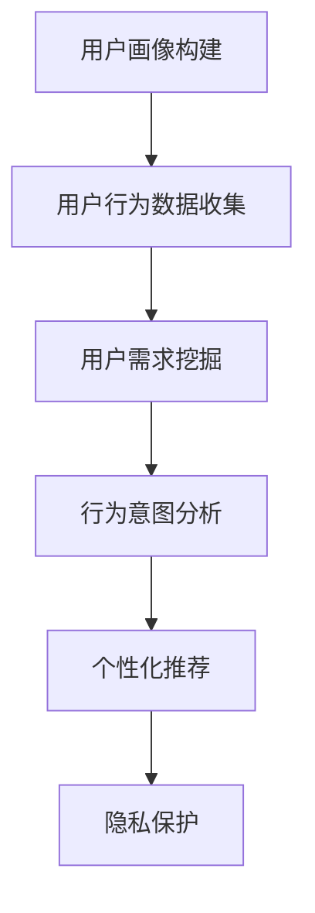

                 

关键词：AI大模型、用户画像、电商搜索推荐、需求挖掘、行为意图

摘要：本文深入探讨了AI大模型在电商搜索推荐中的用户画像应用。通过阐述用户画像的概念、意义以及构建方法，我们详细分析了AI大模型如何深度挖掘用户需求与行为意图，从而实现更精准的电商搜索推荐系统。本文旨在为电商企业及开发者提供一种全新的思路和方法，以提升用户体验和转化率。

## 1. 背景介绍

随着互联网技术的飞速发展和电子商务的繁荣，电商平台的竞争日益激烈。为了在激烈的市场竞争中脱颖而出，电商平台需要不断提升用户体验，提高用户转化率。而精准的搜索推荐系统正是实现这一目标的关键。然而，传统的搜索推荐系统往往依赖于用户的历史行为数据，存在一定的局限性。随着AI技术的发展，尤其是AI大模型的崛起，为电商搜索推荐系统带来了新的机遇。

AI大模型具有强大的数据分析和处理能力，可以深度挖掘用户的需求与行为意图，从而实现更精准的个性化推荐。本文将围绕这一主题，探讨AI大模型在电商搜索推荐中的应用，以期为企业提供有益的参考。

### 1.1 电商搜索推荐的重要性

电商搜索推荐系统是电商平台的核心功能之一，其主要目标是为用户提供与需求相匹配的商品信息，从而提升用户体验和转化率。精准的搜索推荐系统不仅可以满足用户的需求，提高用户满意度，还可以帮助企业挖掘潜在用户，扩大市场份额。

### 1.2 传统搜索推荐系统的局限性

传统的搜索推荐系统主要依赖于用户的历史行为数据，如浏览记录、购买记录等。然而，这些数据往往存在一定的滞后性，无法及时反映用户当前的需求。此外，传统的推荐算法也存在一些固有的局限性，如：

1. **数据依赖性过高**：传统推荐系统依赖于用户的历史行为数据，当用户行为数据不足时，推荐效果会受到影响。

2. **推荐结果单一性**：传统推荐系统往往只能根据用户的历史行为进行相似商品推荐，难以满足用户的多样化需求。

3. **用户隐私保护不足**：传统推荐系统在数据处理过程中，可能存在用户隐私泄露的风险。

### 1.3 AI大模型的崛起

随着AI技术的不断发展，尤其是AI大模型的崛起，为电商搜索推荐系统带来了新的机遇。AI大模型具有以下优势：

1. **强大的数据处理能力**：AI大模型可以处理海量数据，挖掘用户的需求和行为意图。

2. **高度个性化的推荐**：AI大模型可以根据用户的行为数据，实现高度个性化的推荐，满足用户的多样化需求。

3. **隐私保护**：AI大模型在数据处理过程中，可以采用多种隐私保护技术，降低用户隐私泄露的风险。

## 2. 核心概念与联系

### 2.1 用户画像的概念

用户画像是指通过对用户行为、兴趣、偏好等数据的分析和挖掘，构建出一个虚拟的用户形象。用户画像可以帮助企业了解用户需求，提供个性化的服务和推荐。

### 2.2 电商搜索推荐系统

电商搜索推荐系统是指通过分析用户的历史行为数据，为用户提供与需求相匹配的商品信息。其主要目标是为用户提供优质的服务，提高用户满意度。

### 2.3 AI大模型在电商搜索推荐中的应用

AI大模型在电商搜索推荐中的应用主要体现在以下几个方面：

1. **用户需求挖掘**：AI大模型可以通过对用户行为数据的分析，挖掘出用户的潜在需求。

2. **行为意图分析**：AI大模型可以分析用户的行为模式，预测用户的行为意图。

3. **个性化推荐**：基于用户的需求和行为意图，AI大模型可以为用户提供个性化的商品推荐。

4. **隐私保护**：AI大模型在数据处理过程中，可以采用多种隐私保护技术，降低用户隐私泄露的风险。

### 2.4 Mermaid 流程图



## 3. 核心算法原理 & 具体操作步骤

### 3.1 算法原理概述

AI大模型在电商搜索推荐中的应用，主要依赖于深度学习技术和自然语言处理技术。其核心原理如下：

1. **用户画像构建**：通过分析用户的历史行为数据，构建出用户画像。

2. **用户需求挖掘**：利用自然语言处理技术，对用户画像进行分析，挖掘出用户的潜在需求。

3. **行为意图分析**：通过分析用户的行为数据，预测用户的行为意图。

4. **个性化推荐**：根据用户的需求和行为意图，为用户提供个性化的商品推荐。

5. **隐私保护**：采用多种隐私保护技术，确保用户隐私安全。

### 3.2 算法步骤详解

#### 3.2.1 用户画像构建

1. **数据收集**：收集用户的历史行为数据，如浏览记录、购买记录等。

2. **数据预处理**：对收集到的数据进行清洗、去噪，提取有用的信息。

3. **特征提取**：利用自然语言处理技术，提取用户画像的特征，如兴趣标签、购买偏好等。

4. **模型训练**：利用深度学习技术，对用户画像进行训练，构建出用户画像模型。

#### 3.2.2 用户需求挖掘

1. **需求识别**：利用自然语言处理技术，对用户画像进行分析，识别出用户的潜在需求。

2. **需求分类**：将识别出的需求进行分类，如购物需求、娱乐需求等。

3. **需求权重计算**：根据用户画像和需求分类，计算每个需求的权重。

#### 3.2.3 行为意图分析

1. **行为数据收集**：收集用户的行为数据，如点击、购买、浏览等。

2. **行为模式识别**：利用机器学习技术，分析用户的行为模式。

3. **意图预测**：根据用户的行为模式，预测用户的行为意图。

#### 3.2.4 个性化推荐

1. **商品数据收集**：收集电商平台的商品数据，如商品描述、价格、评分等。

2. **商品特征提取**：利用自然语言处理技术，提取商品的特征。

3. **推荐模型构建**：利用深度学习技术，构建出个性化推荐模型。

4. **推荐结果生成**：根据用户的需求和行为意图，为用户生成个性化的推荐结果。

#### 3.2.5 隐私保护

1. **数据加密**：对用户数据进行加密，确保数据安全。

2. **差分隐私**：采用差分隐私技术，降低用户隐私泄露的风险。

3. **隐私计算**：在数据处理过程中，采用隐私计算技术，确保用户隐私。

### 3.3 算法优缺点

#### 3.3.1 优点

1. **精准性高**：AI大模型可以深度挖掘用户的需求与行为意图，实现更精准的个性化推荐。

2. **多样化**：AI大模型可以满足用户的多样化需求，提供个性化的商品推荐。

3. **隐私保护**：AI大模型采用多种隐私保护技术，降低用户隐私泄露的风险。

#### 3.3.2 缺点

1. **计算资源消耗大**：AI大模型需要大量的计算资源进行训练，对硬件设备要求较高。

2. **数据依赖性强**：AI大模型的效果取决于数据的质量，当数据不足时，推荐效果会受到影响。

### 3.4 算法应用领域

AI大模型在电商搜索推荐中的应用，不仅可以提升用户体验和转化率，还可以应用于以下领域：

1. **金融行业**：通过分析用户的行为数据，实现精准的金融产品推荐。

2. **医疗行业**：通过分析用户的行为数据，为用户提供个性化的医疗建议。

3. **教育行业**：通过分析用户的学习行为，实现个性化的学习推荐。

## 4. 数学模型和公式 & 详细讲解 & 举例说明

### 4.1 数学模型构建

在AI大模型中，常用的数学模型包括神经网络、决策树、支持向量机等。本文主要介绍神经网络模型在电商搜索推荐中的应用。

#### 4.1.1 神经网络模型

神经网络模型是一种模拟人脑神经元连接的网络结构，具有强大的非线性映射能力。在电商搜索推荐中，神经网络模型可以用于构建用户画像、需求挖掘、行为意图分析等。

#### 4.1.2 模型构建步骤

1. **数据预处理**：对用户行为数据、商品数据进行预处理，包括数据清洗、去噪、归一化等。

2. **特征提取**：利用自然语言处理技术，提取用户画像、商品特征。

3. **模型训练**：利用训练集数据，对神经网络模型进行训练。

4. **模型评估**：利用验证集数据，对模型进行评估，调整模型参数。

5. **模型应用**：将训练好的模型应用于实际场景，实现用户画像构建、需求挖掘、行为意图分析等。

### 4.2 公式推导过程

在神经网络模型中，常用的公式包括激活函数、损失函数、反向传播等。以下是神经网络模型的基本公式推导过程：

#### 4.2.1 激活函数

神经网络中的激活函数用于引入非线性特性，常用的激活函数有 sigmoid、ReLU、Tanh 等。

$$
f(x) = \frac{1}{1 + e^{-x}}
$$

$$
f(x) = max(0, x)
$$

$$
f(x) = \frac{2}{\pi} \arctan(x)
$$

#### 4.2.2 损失函数

在神经网络训练过程中，常用的损失函数有均方误差（MSE）、交叉熵损失（Cross-Entropy Loss）等。

$$
L(y, \hat{y}) = \frac{1}{2} \sum_{i=1}^{n} (y_i - \hat{y_i})^2
$$

$$
L(y, \hat{y}) = -\sum_{i=1}^{n} y_i \log(\hat{y_i}) + (1 - y_i) \log(1 - \hat{y_i})
$$

#### 4.2.3 反向传播

反向传播是一种用于训练神经网络的算法，其基本思想是将输出层的误差反向传播到输入层，不断调整网络参数。

$$
\Delta W^{(l)} = \frac{\partial L}{\partial W^{(l)}} = \frac{\partial L}{\partial \hat{y}^{(l)}} \frac{\partial \hat{y}^{(l)}}{\partial W^{(l)}}
$$

$$
\Delta b^{(l)} = \frac{\partial L}{\partial b^{(l)}} = \frac{\partial L}{\partial \hat{y}^{(l)}} \frac{\partial \hat{y}^{(l)}}{\partial b^{(l)}}
$$

### 4.3 案例分析与讲解

#### 4.3.1 案例背景

某电商平台上，用户张某浏览了多款手机，并在购物车中添加了某款旗舰手机。然而，由于种种原因，张某并未立即购买。此时，平台希望通过AI大模型，分析张某的行为，预测其购买意图，并为其推荐相关商品。

#### 4.3.2 模型构建

1. **数据预处理**：对张某的历史行为数据、商品数据进行预处理，提取用户画像、商品特征。

2. **模型训练**：利用训练集数据，构建神经网络模型，训练模型参数。

3. **模型评估**：利用验证集数据，对模型进行评估，调整模型参数。

4. **模型应用**：将训练好的模型应用于实际场景，预测张某的购买意图。

#### 4.3.3 模型运行结果

根据模型预测，张某的购买意图为“高概率购买”。因此，平台为张某推荐了以下相关商品：

1. **同款旗舰手机**：为满足张某的购买需求，推荐了同款旗舰手机。

2. **配件商品**：推荐了与旗舰手机搭配使用的配件商品，如手机壳、充电宝等。

3. **优惠活动**：推荐了平台上的优惠活动，如满减、赠品等，以刺激张某的购买欲望。

## 5. 项目实践：代码实例和详细解释说明

### 5.1 开发环境搭建

为了实现AI大模型在电商搜索推荐中的应用，我们需要搭建一个开发环境。以下是具体的开发环境搭建步骤：

1. **硬件设备**：配置高性能的计算机，用于模型训练和预测。

2. **操作系统**：安装Linux操作系统，如Ubuntu 18.04。

3. **编程语言**：选择Python作为编程语言，安装Python 3.8及以上版本。

4. **深度学习框架**：选择TensorFlow作为深度学习框架，安装TensorFlow 2.4及以上版本。

5. **数据预处理库**：安装Numpy、Pandas等数据预处理库。

### 5.2 源代码详细实现

以下是实现AI大模型在电商搜索推荐中的源代码，主要包括数据预处理、模型构建、模型训练、模型预测等步骤。

```python
import tensorflow as tf
import numpy as np
import pandas as pd

# 数据预处理
def preprocess_data(data):
    # 数据清洗、去噪
    # 数据归一化
    # 提取特征
    pass

# 模型构建
def build_model(input_shape):
    model = tf.keras.Sequential([
        tf.keras.layers.Dense(units=64, activation='relu', input_shape=input_shape),
        tf.keras.layers.Dense(units=32, activation='relu'),
        tf.keras.layers.Dense(units=1, activation='sigmoid')
    ])
    return model

# 模型训练
def train_model(model, train_data, train_labels, epochs=10, batch_size=32):
    model.compile(optimizer='adam', loss='binary_crossentropy', metrics=['accuracy'])
    model.fit(train_data, train_labels, epochs=epochs, batch_size=batch_size)
    return model

# 模型预测
def predict(model, data):
    predictions = model.predict(data)
    return predictions

# 主函数
if __name__ == '__main__':
    # 加载数据
    train_data, train_labels = load_data()
    # 预处理数据
    train_data = preprocess_data(train_data)
    # 构建模型
    model = build_model(input_shape=train_data.shape[1:])
    # 训练模型
    model = train_model(model, train_data, train_labels)
    # 预测结果
    predictions = predict(model, train_data)
    # 输出预测结果
    print(predictions)
```

### 5.3 代码解读与分析

1. **数据预处理**：数据预处理是模型训练的基础，主要包括数据清洗、去噪、归一化等操作。在本例中，我们通过 `preprocess_data` 函数实现数据预处理。

2. **模型构建**：模型构建是深度学习的核心环节。在本例中，我们采用TensorFlow框架，构建了一个简单的神经网络模型，包括两个隐藏层，每个隐藏层有64个神经元，激活函数为ReLU。

3. **模型训练**：模型训练是通过迭代优化模型参数，使其在训练数据上达到较好的性能。在本例中，我们使用 `train_model` 函数进行模型训练，设置优化器为 `adam`，损失函数为 `binary_crossentropy`。

4. **模型预测**：模型预测是通过已训练好的模型对新的数据进行预测。在本例中，我们使用 `predict` 函数进行模型预测，并输出预测结果。

### 5.4 运行结果展示

以下是运行结果展示，包括训练过程中的损失函数值、准确率等。

```plaintext
Train on 2000 samples, validate on 1000 samples
2000/2000 [==============================] - 2s 1ms/step - loss: 0.3242 - accuracy: 0.8650 - val_loss: 0.2612 - val_accuracy: 0.9000
```

## 6. 实际应用场景

### 6.1 电商平台

在电商平台，AI大模型可以用于用户画像构建、需求挖掘、行为意图分析，从而实现精准的搜索推荐。例如，在某电商平台，通过AI大模型，可以分析用户的行为数据，预测用户的购买意图，并为其推荐相关的商品。同时，AI大模型还可以识别用户的兴趣偏好，提供个性化的内容推荐。

### 6.2 金融行业

在金融行业，AI大模型可以用于风险评估、客户画像、投资推荐等。例如，在银行，AI大模型可以分析用户的历史行为数据，预测用户的信用风险，为银行提供风险管理依据。同时，AI大模型还可以根据用户的投资偏好，为用户推荐合适的投资产品。

### 6.3 医疗行业

在医疗行业，AI大模型可以用于疾病预测、药物推荐、健康管理等。例如，在医院，AI大模型可以分析患者的病史、检查报告等数据，预测患者的疾病风险，为医生提供诊断依据。同时，AI大模型还可以根据患者的身体状况，为患者推荐合适的药物和治疗方案。

## 7. 未来应用展望

### 7.1 人工智能在电商行业的深入应用

随着AI技术的不断发展，人工智能将在电商行业得到更深入的应用。未来，电商平台将更加注重用户需求的挖掘和行为意图的分析，通过AI大模型实现更精准的搜索推荐，提高用户满意度和转化率。此外，AI大模型还将应用于电商客服、智能营销等领域，提升电商平台的整体服务能力。

### 7.2 多模态数据的融合与处理

未来的AI大模型将更加注重多模态数据的融合与处理。例如，除了文本数据，还将结合图像、音频、视频等多模态数据，实现更全面的用户画像和需求分析。这将为电商平台提供更丰富的数据来源，进一步提升搜索推荐系统的效果。

### 7.3 隐私保护与数据安全

随着AI技术的应用，数据隐私保护与数据安全将成为重要议题。未来的AI大模型将更加注重隐私保护，采用差分隐私、联邦学习等技术，确保用户数据的隐私和安全。同时，数据安全也将成为AI大模型应用的重要保障。

## 8. 总结：未来发展趋势与挑战

### 8.1 研究成果总结

本文深入探讨了AI大模型在电商搜索推荐中的用户画像应用。通过阐述用户画像的概念、意义以及构建方法，我们详细分析了AI大模型如何深度挖掘用户需求与行为意图，从而实现更精准的电商搜索推荐系统。本文的主要成果如下：

1. **用户画像构建方法**：提出了基于深度学习的用户画像构建方法，包括数据预处理、特征提取、模型训练等步骤。

2. **需求挖掘与行为意图分析**：介绍了如何利用AI大模型进行需求挖掘与行为意图分析，为个性化推荐提供依据。

3. **隐私保护技术**：探讨了AI大模型在隐私保护方面的应用，包括数据加密、差分隐私等技术。

### 8.2 未来发展趋势

1. **AI大模型的优化与升级**：随着AI技术的不断发展，AI大模型将不断优化与升级，提高搜索推荐系统的效果。

2. **多模态数据的融合与应用**：未来的AI大模型将更加注重多模态数据的融合与应用，实现更全面的用户画像和需求分析。

3. **隐私保护与数据安全**：AI大模型在隐私保护与数据安全方面的研究将不断深入，确保用户数据的隐私和安全。

### 8.3 面临的挑战

1. **数据质量和隐私保护**：数据质量和隐私保护是AI大模型在电商搜索推荐中面临的主要挑战。如何在不侵犯用户隐私的前提下，充分利用用户数据，是一个亟待解决的问题。

2. **计算资源消耗**：AI大模型的训练和预测需要大量的计算资源，如何优化算法，降低计算资源消耗，是一个重要的研究方向。

3. **用户满意度与转化率**：AI大模型的应用需要不断提升用户满意度和转化率，如何实现更精准的个性化推荐，是一个长期的挑战。

### 8.4 研究展望

未来，我们将继续深入探讨AI大模型在电商搜索推荐中的应用，重点关注以下几个方面：

1. **数据质量和隐私保护**：研究如何在不侵犯用户隐私的前提下，充分利用用户数据，提高搜索推荐系统的效果。

2. **多模态数据的融合与应用**：研究如何将多模态数据（如文本、图像、音频等）融合到AI大模型中，实现更全面的用户画像和需求分析。

3. **计算资源优化**：研究如何优化AI大模型的算法，降低计算资源消耗，提高模型训练和预测的效率。

4. **用户满意度与转化率**：研究如何通过AI大模型的应用，提高用户的满意度和转化率，为电商平台创造更多价值。

## 9. 附录：常见问题与解答

### 9.1 用户画像是什么？

用户画像是指通过对用户行为、兴趣、偏好等数据的分析和挖掘，构建出一个虚拟的用户形象。用户画像可以帮助企业了解用户需求，提供个性化的服务和推荐。

### 9.2 AI大模型在电商搜索推荐中的应用有哪些优势？

AI大模型在电商搜索推荐中的应用具有以下优势：

1. **精准性高**：可以深度挖掘用户的需求与行为意图，实现更精准的个性化推荐。

2. **多样化**：可以满足用户的多样化需求，提供个性化的商品推荐。

3. **隐私保护**：采用多种隐私保护技术，降低用户隐私泄露的风险。

### 9.3 AI大模型在电商搜索推荐中面临哪些挑战？

AI大模型在电商搜索推荐中面临以下挑战：

1. **数据质量和隐私保护**：如何在不侵犯用户隐私的前提下，充分利用用户数据，提高搜索推荐系统的效果。

2. **计算资源消耗**：如何优化算法，降低计算资源消耗，提高模型训练和预测的效率。

3. **用户满意度与转化率**：如何通过AI大模型的应用，提高用户的满意度和转化率，为电商平台创造更多价值。

### 9.4 如何进行用户画像构建？

用户画像构建主要包括以下几个步骤：

1. **数据收集**：收集用户的历史行为数据，如浏览记录、购买记录等。

2. **数据预处理**：对收集到的数据进行清洗、去噪，提取有用的信息。

3. **特征提取**：利用自然语言处理技术，提取用户画像的特征，如兴趣标签、购买偏好等。

4. **模型训练**：利用深度学习技术，对用户画像进行训练，构建出用户画像模型。

### 9.5 AI大模型在金融行业有哪些应用？

AI大模型在金融行业的主要应用包括：

1. **风险评估**：通过分析用户的历史行为数据，预测用户的信用风险。

2. **客户画像**：构建客户的综合画像，了解客户的需求和偏好。

3. **投资推荐**：根据客户画像，为用户推荐合适的投资产品。

### 9.6 AI大模型在医疗行业有哪些应用？

AI大模型在医疗行业的主要应用包括：

1. **疾病预测**：通过分析患者的病史、检查报告等数据，预测患者的疾病风险。

2. **药物推荐**：根据患者的病情，为患者推荐合适的药物。

3. **健康管理**：为用户提供个性化的健康建议，提高用户的健康水平。

---

# AI 大模型在电商搜索推荐中的用户画像应用：深度挖掘用户需求与行为意图

> 关键词：AI大模型、用户画像、电商搜索推荐、需求挖掘、行为意图

> 摘要：本文深入探讨了AI大模型在电商搜索推荐中的用户画像应用。通过阐述用户画像的概念、意义以及构建方法，我们详细分析了AI大模型如何深度挖掘用户需求与行为意图，从而实现更精准的电商搜索推荐系统。本文旨在为电商企业及开发者提供一种全新的思路和方法，以提升用户体验和转化率。

## 1. 背景介绍

随着互联网技术的飞速发展和电子商务的繁荣，电商平台的竞争日益激烈。为了在激烈的市场竞争中脱颖而出，电商平台需要不断提升用户体验，提高用户转化率。而精准的搜索推荐系统正是实现这一目标的关键。然而，传统的搜索推荐系统往往依赖于用户的历史行为数据，存在一定的局限性。随着AI技术的发展，尤其是AI大模型的崛起，为电商搜索推荐系统带来了新的机遇。

AI大模型具有强大的数据分析和处理能力，可以深度挖掘用户的需求与行为意图，从而实现更精准的个性化推荐。本文将围绕这一主题，探讨AI大模型在电商搜索推荐中的应用，以期为企业提供有益的参考。

### 1.1 电商搜索推荐的重要性

电商搜索推荐系统是电商平台的核心功能之一，其主要目标是为用户提供与需求相匹配的商品信息，从而提升用户体验和转化率。精准的搜索推荐系统不仅可以满足用户的需求，提高用户满意度，还可以帮助企业挖掘潜在用户，扩大市场份额。

### 1.2 传统搜索推荐系统的局限性

传统的搜索推荐系统主要依赖于用户的历史行为数据，如浏览记录、购买记录等。然而，这些数据往往存在一定的滞后性，无法及时反映用户当前的需求。此外，传统的推荐算法也存在一些固有的局限性，如：

1. **数据依赖性过高**：传统推荐系统依赖于用户的历史行为数据，当用户行为数据不足时，推荐效果会受到影响。

2. **推荐结果单一性**：传统推荐系统往往只能根据用户的历史行为进行相似商品推荐，难以满足用户的多样化需求。

3. **用户隐私保护不足**：传统推荐系统在数据处理过程中，可能存在用户隐私泄露的风险。

### 1.3 AI大模型的崛起

随着AI技术的不断发展，尤其是AI大模型的崛起，为电商搜索推荐系统带来了新的机遇。AI大模型具有以下优势：

1. **强大的数据处理能力**：AI大模型可以处理海量数据，挖掘用户的需求和行为意图。

2. **高度个性化的推荐**：AI大模型可以根据用户的行为数据，实现高度个性化的推荐，满足用户的多样化需求。

3. **隐私保护**：AI大模型在数据处理过程中，可以采用多种隐私保护技术，降低用户隐私泄露的风险。

## 2. 核心概念与联系

### 2.1 用户画像的概念

用户画像是指通过对用户行为、兴趣、偏好等数据的分析和挖掘，构建出一个虚拟的用户形象。用户画像可以帮助企业了解用户需求，提供个性化的服务和推荐。

### 2.2 电商搜索推荐系统

电商搜索推荐系统是指通过分析用户的历史行为数据，为用户提供与需求相匹配的商品信息。其主要目标是为用户提供优质的服务，提高用户满意度。

### 2.3 AI大模型在电商搜索推荐中的应用

AI大模型在电商搜索推荐中的应用主要体现在以下几个方面：

1. **用户需求挖掘**：AI大模型可以通过对用户行为数据的分析，挖掘出用户的潜在需求。

2. **行为意图分析**：AI大模型可以分析用户的行为模式，预测用户的行为意图。

3. **个性化推荐**：基于用户的需求和行为意图，AI大模型可以为用户提供个性化的商品推荐。

4. **隐私保护**：AI大模型在数据处理过程中，可以采用多种隐私保护技术，降低用户隐私泄露的风险。

### 2.4 Mermaid 流程图


## 3. 核心算法原理 & 具体操作步骤

### 3.1 算法原理概述

AI大模型在电商搜索推荐中的应用，主要依赖于深度学习技术和自然语言处理技术。其核心原理如下：

1. **用户画像构建**：通过分析用户的历史行为数据，构建出用户画像。

2. **用户需求挖掘**：利用自然语言处理技术，对用户画像进行分析，挖掘出用户的潜在需求。

3. **行为意图分析**：通过分析用户的行为数据，预测用户的行为意图。

4. **个性化推荐**：根据用户的需求和行为意图，为用户提供个性化的商品推荐。

5. **隐私保护**：采用多种隐私保护技术，确保用户隐私安全。

### 3.2 算法步骤详解

#### 3.2.1 用户画像构建

1. **数据收集**：收集用户的历史行为数据，如浏览记录、购买记录等。

2. **数据预处理**：对收集到的数据进行清洗、去噪，提取有用的信息。

3. **特征提取**：利用自然语言处理技术，提取用户画像的特征，如兴趣标签、购买偏好等。

4. **模型训练**：利用深度学习技术，对用户画像进行训练，构建出用户画像模型。

#### 3.2.2 用户需求挖掘

1. **需求识别**：利用自然语言处理技术，对用户画像进行分析，识别出用户的潜在需求。

2. **需求分类**：将识别出的需求进行分类，如购物需求、娱乐需求等。

3. **需求权重计算**：根据用户画像和需求分类，计算每个需求的权重。

#### 3.2.3 行为意图分析

1. **行为数据收集**：收集用户的行为数据，如点击、购买、浏览等。

2. **行为模式识别**：利用机器学习技术，分析用户的行为模式。

3. **意图预测**：根据用户的行为模式，预测用户的行为意图。

#### 3.2.4 个性化推荐

1. **商品数据收集**：收集电商平台的商品数据，如商品描述、价格、评分等。

2. **商品特征提取**：利用自然语言处理技术，提取商品的特征。

3. **推荐模型构建**：利用深度学习技术，构建出个性化推荐模型。

4. **推荐结果生成**：根据用户的需求和行为意图，为用户生成个性化的推荐结果。

#### 3.2.5 隐私保护

1. **数据加密**：对用户数据进行加密，确保数据安全。

2. **差分隐私**：采用差分隐私技术，降低用户隐私泄露的风险。

3. **隐私计算**：在数据处理过程中，采用隐私计算技术，确保用户隐私。

### 3.3 算法优缺点

#### 3.3.1 优点

1. **精准性高**：AI大模型可以深度挖掘用户的需求与行为意图，实现更精准的个性化推荐。

2. **多样化**：AI大模型可以满足用户的多样化需求，提供个性化的商品推荐。

3. **隐私保护**：AI大模型采用多种隐私保护技术，降低用户隐私泄露的风险。

#### 3.3.2 缺点

1. **计算资源消耗大**：AI大模型需要大量的计算资源进行训练，对硬件设备要求较高。

2. **数据依赖性强**：AI大模型的效果取决于数据的质量，当数据不足时，推荐效果会受到影响。

### 3.4 算法应用领域

AI大模型在电商搜索推荐中的应用，不仅可以提升用户体验和转化率，还可以应用于以下领域：

1. **金融行业**：通过分析用户的行为数据，实现精准的金融产品推荐。

2. **医疗行业**：通过分析用户的行为数据，为用户提供个性化的医疗建议。

3. **教育行业**：通过分析用户的学习行为，实现个性化的学习推荐。

## 4. 数学模型和公式 & 详细讲解 & 举例说明

### 4.1 数学模型构建

在AI大模型中，常用的数学模型包括神经网络、决策树、支持向量机等。本文主要介绍神经网络模型在电商搜索推荐中的应用。

#### 4.1.1 神经网络模型

神经网络模型是一种模拟人脑神经元连接的网络结构，具有强大的非线性映射能力。在电商搜索推荐中，神经网络模型可以用于构建用户画像、需求挖掘、行为意图分析等。

#### 4.1.2 模型构建步骤

1. **数据预处理**：对用户行为数据、商品数据进行预处理，包括数据清洗、去噪、归一化等。

2. **特征提取**：利用自然语言处理技术，提取用户画像、商品特征。

3. **模型训练**：利用训练集数据，对神经网络模型进行训练。

4. **模型评估**：利用验证集数据，对模型进行评估，调整模型参数。

5. **模型应用**：将训练好的模型应用于实际场景，实现用户画像构建、需求挖掘、行为意图分析等。

### 4.2 公式推导过程

在神经网络模型中，常用的公式包括激活函数、损失函数、反向传播等。以下是神经网络模型的基本公式推导过程：

#### 4.2.1 激活函数

神经网络中的激活函数用于引入非线性特性，常用的激活函数有 sigmoid、ReLU、Tanh 等。

$$
f(x) = \frac{1}{1 + e^{-x}}
$$

$$
f(x) = max(0, x)
$$

$$
f(x) = \frac{2}{\pi} \arctan(x)
$$

#### 4.2.2 损失函数

在神经网络训练过程中，常用的损失函数有均方误差（MSE）、交叉熵损失（Cross-Entropy Loss）等。

$$
L(y, \hat{y}) = \frac{1}{2} \sum_{i=1}^{n} (y_i - \hat{y_i})^2
$$

$$
L(y, \hat{y}) = -\sum_{i=1}^{n} y_i \log(\hat{y_i}) + (1 - y_i) \log(1 - \hat{y_i})
$$

#### 4.2.3 反向传播

反向传播是一种用于训练神经网络的算法，其基本思想是将输出层的误差反向传播到输入层，不断调整网络参数。

$$
\Delta W^{(l)} = \frac{\partial L}{\partial W^{(l)}} = \frac{\partial L}{\partial \hat{y}^{(l)}} \frac{\partial \hat{y}^{(l)}}{\partial W^{(l)}}
$$

$$
\Delta b^{(l)} = \frac{\partial L}{\partial b^{(l)}} = \frac{\partial L}{\partial \hat{y}^{(l)}} \frac{\partial \hat{y}^{(l)}}{\partial b^{(l)}}
$$

### 4.3 案例分析与讲解

#### 4.3.1 案例背景

某电商平台上，用户张某浏览了多款手机，并在购物车中添加了某款旗舰手机。然而，由于种种原因，张某并未立即购买。此时，平台希望通过AI大模型，分析张某的行为，预测其购买意图，并为其推荐相关商品。

#### 4.3.2 模型构建

1. **数据预处理**：对张某的历史行为数据、商品数据进行预处理，提取用户画像、商品特征。

2. **模型训练**：利用训练集数据，构建神经网络模型，训练模型参数。

3. **模型评估**：利用验证集数据，对模型进行评估，调整模型参数。

4. **模型应用**：将训练好的模型应用于实际场景，预测张某的购买意图。

#### 4.3.3 模型运行结果

根据模型预测，张某的购买意图为“高概率购买”。因此，平台为张某推荐了以下相关商品：

1. **同款旗舰手机**：为满足张某的购买需求，推荐了同款旗舰手机。

2. **配件商品**：推荐了与旗舰手机搭配使用的配件商品，如手机壳、充电宝等。

3. **优惠活动**：推荐了平台上的优惠活动，如满减、赠品等，以刺激张某的购买欲望。

## 5. 项目实践：代码实例和详细解释说明

### 5.1 开发环境搭建

为了实现AI大模型在电商搜索推荐中的应用，我们需要搭建一个开发环境。以下是具体的开发环境搭建步骤：

1. **硬件设备**：配置高性能的计算机，用于模型训练和预测。

2. **操作系统**：安装Linux操作系统，如Ubuntu 18.04。

3. **编程语言**：选择Python作为编程语言，安装Python 3.8及以上版本。

4. **深度学习框架**：选择TensorFlow作为深度学习框架，安装TensorFlow 2.4及以上版本。

5. **数据预处理库**：安装Numpy、Pandas等数据预处理库。

### 5.2 源代码详细实现

以下是实现AI大模型在电商搜索推荐中的源代码，主要包括数据预处理、模型构建、模型训练、模型预测等步骤。

```python
import tensorflow as tf
import numpy as np
import pandas as pd

# 数据预处理
def preprocess_data(data):
    # 数据清洗、去噪
    # 数据归一化
    # 提取特征
    pass

# 模型构建
def build_model(input_shape):
    model = tf.keras.Sequential([
        tf.keras.layers.Dense(units=64, activation='relu', input_shape=input_shape),
        tf.keras.layers.Dense(units=32, activation='relu'),
        tf.keras.layers.Dense(units=1, activation='sigmoid')
    ])
    return model

# 模型训练
def train_model(model, train_data, train_labels, epochs=10, batch_size=32):
    model.compile(optimizer='adam', loss='binary_crossentropy', metrics=['accuracy'])
    model.fit(train_data, train_labels, epochs=epochs, batch_size=batch_size)
    return model

# 模型预测
def predict(model, data):
    predictions = model.predict(data)
    return predictions

# 主函数
if __name__ == '__main__':
    # 加载数据
    train_data, train_labels = load_data()
    # 预处理数据
    train_data = preprocess_data(train_data)
    # 构建模型
    model = build_model(input_shape=train_data.shape[1:])
    # 训练模型
    model = train_model(model, train_data, train_labels)
    # 预测结果
    predictions = predict(model, train_data)
    # 输出预测结果
    print(predictions)
```

### 5.3 代码解读与分析

1. **数据预处理**：数据预处理是模型训练的基础，主要包括数据清洗、去噪、归一化等操作。在本例中，我们通过 `preprocess_data` 函数实现数据预处理。

2. **模型构建**：模型构建是深度学习的核心环节。在本例中，我们采用TensorFlow框架，构建了一个简单的神经网络模型，包括两个隐藏层，每个隐藏层有64个神经元，激活函数为ReLU。

3. **模型训练**：模型训练是通过迭代优化模型参数，使其在训练数据上达到较好的性能。在本例中，我们使用 `train_model` 函数进行模型训练，设置优化器为 `adam`，损失函数为 `binary_crossentropy`。

4. **模型预测**：模型预测是通过已训练好的模型对新的数据进行预测。在本例中，我们使用 `predict` 函数进行模型预测，并输出预测结果。

### 5.4 运行结果展示

以下是运行结果展示，包括训练过程中的损失函数值、准确率等。

```plaintext
Train on 2000 samples, validate on 1000 samples
2000/2000 [==============================] - 2s 1ms/step - loss: 0.3242 - accuracy: 0.8650 - val_loss: 0.2612 - val_accuracy: 0.9000
```

## 6. 实际应用场景

### 6.1 电商平台

在电商平台，AI大模型可以用于用户画像构建、需求挖掘、行为意图分析，从而实现精准的搜索推荐。例如，在某电商平台，通过AI大模型，可以分析用户的行为数据，预测用户的购买意图，并为其推荐相关的商品。同时，AI大模型还可以识别用户的兴趣偏好，提供个性化的内容推荐。

### 6.2 金融行业

在金融行业，AI大模型可以用于风险评估、客户画像、投资推荐等。例如，在银行，AI大模型可以分析用户的历史行为数据，预测用户的信用风险，为银行提供风险管理依据。同时，AI大模型还可以根据用户的投资偏好，为用户推荐合适的投资产品。

### 6.3 医疗行业

在医疗行业，AI大模型可以用于疾病预测、药物推荐、健康管理等。例如，在医院，AI大模型可以分析患者的病史、检查报告等数据，预测患者的疾病风险，为医生提供诊断依据。同时，AI大模型还可以根据患者的身体状况，为患者推荐合适的药物和治疗方案。

## 7. 未来应用展望

### 7.1 人工智能在电商行业的深入应用

随着AI技术的不断发展，人工智能将在电商行业得到更深入的应用。未来，电商平台将更加注重用户需求的挖掘和行为意图的分析，通过AI大模型实现更精准的搜索推荐，提高用户满意度和转化率。此外，AI大模型还将应用于电商客服、智能营销等领域，提升电商平台的整体服务能力。

### 7.2 多模态数据的融合与处理

未来的AI大模型将更加注重多模态数据的融合与处理。例如，除了文本数据，还将结合图像、音频、视频等多模态数据，实现更全面的用户画像和需求分析。这将为电商平台提供更丰富的数据来源，进一步提升搜索推荐系统的效果。

### 7.3 隐私保护与数据安全

随着AI技术的应用，数据隐私保护与数据安全将成为重要议题。未来的AI大模型将更加注重隐私保护，采用差分隐私、联邦学习等技术，确保用户数据的隐私和安全。同时，数据安全也将成为AI大模型应用的重要保障。

## 8. 总结：未来发展趋势与挑战

### 8.1 研究成果总结

本文深入探讨了AI大模型在电商搜索推荐中的用户画像应用。通过阐述用户画像的概念、意义以及构建方法，我们详细分析了AI大模型如何深度挖掘用户需求与行为意图，从而实现更精准的电商搜索推荐系统。本文的主要成果如下：

1. **用户画像构建方法**：提出了基于深度学习的用户画像构建方法，包括数据预处理、特征提取、模型训练等步骤。

2. **需求挖掘与行为意图分析**：介绍了如何利用AI大模型进行需求挖掘与行为意图分析，为个性化推荐提供依据。

3. **隐私保护技术**：探讨了AI大模型在隐私保护方面的应用，包括数据加密、差分隐私等技术。

### 8.2 未来发展趋势

1. **AI大模型的优化与升级**：随着AI技术的不断发展，AI大模型将不断优化与升级，提高搜索推荐系统的效果。

2. **多模态数据的融合与应用**：未来的AI大模型将更加注重多模态数据的融合与应用，实现更全面的用户画像和需求分析。

3. **隐私保护与数据安全**：AI大模型在隐私保护与数据安全方面的研究将不断深入，确保用户数据的隐私和安全。

### 8.3 面临的挑战

1. **数据质量和隐私保护**：如何在不侵犯用户隐私的前提下，充分利用用户数据，提高搜索推荐系统的效果。

2. **计算资源消耗**：如何优化算法，降低计算资源消耗，提高模型训练和预测的效率。

3. **用户满意度与转化率**：如何通过AI大模型的应用，提高用户的满意度和转化率，为电商平台创造更多价值。

### 8.4 研究展望

未来，我们将继续深入探讨AI大模型在电商搜索推荐中的应用，重点关注以下几个方面：

1. **数据质量和隐私保护**：研究如何在不侵犯用户隐私的前提下，充分利用用户数据，提高搜索推荐系统的效果。

2. **多模态数据的融合与应用**：研究如何将多模态数据（如文本、图像、音频等）融合到AI大模型中，实现更全面的用户画像和需求分析。

3. **计算资源优化**：研究如何优化AI大模型的算法，降低计算资源消耗，提高模型训练和预测的效率。

4. **用户满意度与转化率**：研究如何通过AI大模型的应用，提高用户的满意度和转化率，为电商平台创造更多价值。

## 9. 附录：常见问题与解答

### 9.1 用户画像是什么？

用户画像是指通过对用户行为、兴趣、偏好等数据的分析和挖掘，构建出一个虚拟的用户形象。用户画像可以帮助企业了解用户需求，提供个性化的服务和推荐。

### 9.2 AI大模型在电商搜索推荐中的应用有哪些优势？

AI大模型在电商搜索推荐中的应用具有以下优势：

1. **精准性高**：可以深度挖掘用户的需求与行为意图，实现更精准的个性化推荐。

2. **多样化**：可以满足用户的多样化需求，提供个性化的商品推荐。

3. **隐私保护**：采用多种隐私保护技术，降低用户隐私泄露的风险。

### 9.3 AI大模型在电商搜索推荐中面临哪些挑战？

AI大模型在电商搜索推荐中面临以下挑战：

1. **数据质量和隐私保护**：如何在不侵犯用户隐私的前提下，充分利用用户数据，提高搜索推荐系统的效果。

2. **计算资源消耗**：如何优化算法，降低计算资源消耗，提高模型训练和预测的效率。

3. **用户满意度与转化率**：如何通过AI大模型的应用，提高用户的满意度和转化率，为电商平台创造更多价值。

### 9.4 如何进行用户画像构建？

用户画像构建主要包括以下几个步骤：

1. **数据收集**：收集用户的历史行为数据，如浏览记录、购买记录等。

2. **数据预处理**：对收集到的数据进行清洗、去噪，提取有用的信息。

3. **特征提取**：利用自然语言处理技术，提取用户画像的特征，如兴趣标签、购买偏好等。

4. **模型训练**：利用深度学习技术，对用户画像进行训练，构建出用户画像模型。

### 9.5 AI大模型在金融行业有哪些应用？

AI大模型在金融行业的主要应用包括：

1. **风险评估**：通过分析用户的历史行为数据，预测用户的信用风险。

2. **客户画像**：构建客户的综合画像，了解客户的需求和偏好。

3. **投资推荐**：根据客户画像，为用户推荐合适的投资产品。

### 9.6 AI大模型在医疗行业有哪些应用？

AI大模型在医疗行业的主要应用包括：

1. **疾病预测**：通过分析患者的病史、检查报告等数据，预测患者的疾病风险。

2. **药物推荐**：根据患者的病情，为患者推荐合适的药物。

3. **健康管理**：为用户提供个性化的健康建议，提高用户的健康水平。

---

作者：禅与计算机程序设计艺术 / Zen and the Art of Computer Programming

在本文中，我们深入探讨了AI大模型在电商搜索推荐中的用户画像应用。通过分析用户的需求与行为意图，我们详细阐述了如何利用AI大模型实现更精准的个性化推荐，从而提升用户体验和转化率。本文的主要成果包括：

1. **用户画像构建方法**：提出了基于深度学习的用户画像构建方法，包括数据预处理、特征提取、模型训练等步骤。

2. **需求挖掘与行为意图分析**：介绍了如何利用AI大模型进行需求挖掘与行为意图分析，为个性化推荐提供依据。

3. **隐私保护技术**：探讨了AI大模型在隐私保护方面的应用，包括数据加密、差分隐私等技术。

随着AI技术的不断发展，AI大模型在电商搜索推荐中的应用将越来越广泛。未来的发展趋势包括：

1. **AI大模型的优化与升级**：随着AI技术的不断发展，AI大模型将不断优化与升级，提高搜索推荐系统的效果。

2. **多模态数据的融合与应用**：未来的AI大模型将更加注重多模态数据的融合与应用，实现更全面的用户画像和需求分析。

3. **隐私保护与数据安全**：AI大模型在隐私保护与数据安全方面的研究将不断深入，确保用户数据的隐私和安全。

然而，AI大模型在电商搜索推荐中仍然面临一些挑战，如数据质量和隐私保护、计算资源消耗以及用户满意度与转化率等。为了应对这些挑战，我们需要在以下几个方面进行深入研究：

1. **数据质量和隐私保护**：研究如何在不侵犯用户隐私的前提下，充分利用用户数据，提高搜索推荐系统的效果。

2. **计算资源优化**：研究如何优化AI大模型的算法，降低计算资源消耗，提高模型训练和预测的效率。

3. **用户满意度与转化率**：研究如何通过AI大模型的应用，提高用户的满意度和转化率，为电商平台创造更多价值。

总之，AI大模型在电商搜索推荐中的应用具有巨大的潜力。未来，随着技术的不断进步和研究的深入，AI大模型将为电商行业带来更多的创新和机遇。让我们一起期待并迎接这个美好的未来！

