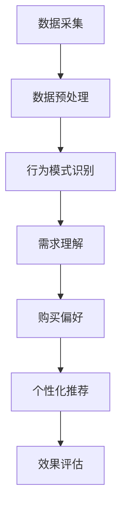

                 

关键词：AI 大模型、电商搜索推荐、用户行为分析、需求理解、购买偏好

摘要：本文深入探讨了人工智能大模型在电商搜索推荐中的应用，重点分析了用户行为分析的技术原理、方法及其在理解用户需求与购买偏好方面的作用。通过结合实际案例，本文详细阐述了如何通过大模型技术来实现精准的用户行为预测和个性化推荐，从而提升电商平台的用户体验和销售额。

## 1. 背景介绍

在当今互联网时代，电子商务已经成为人们日常生活的重要组成部分。随着电商平台的日益丰富和竞争的加剧，用户获取和保持已经成为企业关注的焦点。而电商搜索推荐系统作为一种重要的用户互动方式，通过对用户行为的分析，能够为用户提供个性化的商品推荐，从而提高用户满意度和转化率。

然而，传统的推荐系统在应对复杂的用户行为和多样化的商品信息时，往往面临准确性和效率的挑战。随着人工智能技术的飞速发展，特别是深度学习和大数据分析技术的成熟，大模型在电商搜索推荐中的应用逐渐成为可能。大模型通过学习海量的用户行为数据，能够更好地理解用户需求，预测用户行为，从而实现精准推荐。

本文旨在探讨如何利用人工智能大模型技术，深入分析用户行为，理解用户需求与购买偏好，为电商搜索推荐提供有效的技术支持。

## 2. 核心概念与联系

### 2.1. 大模型技术概述

大模型技术是指利用深度学习和神经网络等机器学习算法，对大规模数据进行训练和建模，从而实现高度复杂的任务。在电商搜索推荐领域，大模型技术通常指的是基于深度学习的推荐系统，如深度神经网络（DNN）、卷积神经网络（CNN）、循环神经网络（RNN）等。

### 2.2. 用户行为分析

用户行为分析是指通过对用户在电商平台上各种操作行为的分析，如浏览、搜索、购买、评价等，来理解用户的需求和偏好。用户行为分析技术主要包括数据采集、数据预处理、行为模式识别、行为预测等。

### 2.3. 需求理解与购买偏好

需求理解是指通过分析用户行为数据，挖掘用户的需求特征和偏好。购买偏好则是指用户在购买决策过程中所表现出的特定喜好和习惯。需求理解与购买偏好是电商搜索推荐系统进行个性化推荐的重要依据。

### 2.4. Mermaid 流程图



## 3. 核心算法原理 & 具体操作步骤

### 3.1. 算法原理概述

大模型在电商搜索推荐中的核心算法主要基于深度学习和大数据分析技术。通过深度学习，模型可以从海量用户行为数据中自动提取特征，并建立复杂的行为模式；通过大数据分析，模型可以实时处理海量数据，快速响应用户行为变化。

### 3.2. 算法步骤详解

#### 3.2.1. 数据采集

数据采集是用户行为分析的基础。通过爬虫、API 接口、用户行为日志等方式，收集用户在电商平台的浏览、搜索、购买、评价等行为数据。

#### 3.2.2. 数据预处理

数据预处理包括数据清洗、数据整合和数据特征提取。通过清洗去除噪声数据和异常值，整合不同数据源的信息，提取用户行为的关键特征。

#### 3.2.3. 行为模式识别

通过深度学习算法，如 RNN、CNN 等，对预处理后的行为数据进行建模，识别用户的行为模式。这些模式可以包括用户的浏览路径、搜索关键词、购买历史等。

#### 3.2.4. 需求理解

基于识别的行为模式，使用分类和聚类算法，对用户的需求进行理解和分类。例如，可以根据用户的历史购买记录，将用户划分为高价值用户、普通用户等。

#### 3.2.5. 购买偏好

通过分析用户的行为数据和需求分类，建立用户购买偏好模型。这些偏好可以包括用户喜欢的商品类型、品牌、价格区间等。

#### 3.2.6. 个性化推荐

根据用户的购买偏好，使用协同过滤、矩阵分解等方法，为用户生成个性化的商品推荐列表。

#### 3.2.7. 效果评估

通过用户反馈和实际转化率，对推荐系统的效果进行评估和优化。

### 3.3. 算法优缺点

#### 优点：

- **高度自动化**：大模型技术能够自动从数据中学习特征，减少人工干预。
- **高效处理**：能够处理海量用户行为数据，快速响应用户需求。
- **精准推荐**：通过深度学习和大数据分析，能够实现高精度的个性化推荐。

#### 缺点：

- **计算资源消耗大**：大模型训练需要大量的计算资源和时间。
- **数据依赖性高**：模型的性能很大程度上取决于数据质量和数据量。
- **解释性差**：大模型的决策过程往往缺乏可解释性，难以理解其工作原理。

### 3.4. 算法应用领域

大模型在电商搜索推荐中的应用不仅限于电商平台，还可以应用于其他需要个性化推荐的场景，如社交媒体、在线教育、金融服务等。

## 4. 数学模型和公式 & 详细讲解 & 举例说明

### 4.1. 数学模型构建

用户行为分析的核心是构建用户行为模型，通常使用以下数学模型：

#### 4.1.1. 贝叶斯网络模型

贝叶斯网络模型是一种概率图模型，可以表示用户行为之间的依赖关系。其数学表达式为：

$$
P(X_i | X_{i-1}, ..., X_1) = \prod_{i=1}^n P(X_i | X_{i-1}, ..., X_1)
$$

其中，$X_i$ 表示用户在第 $i$ 次操作的行为，$P(X_i | X_{i-1}, ..., X_1)$ 表示用户在第 $i$ 次操作的行为在给定前面操作行为条件下的概率。

#### 4.1.2. 支持向量机（SVM）模型

支持向量机是一种分类模型，可以用于用户需求的分类。其数学表达式为：

$$
f(x) = \text{sign}(\sum_{i=1}^n \alpha_i y_i (x_i \cdot x) + b)
$$

其中，$x$ 表示用户行为特征向量，$y_i$ 表示用户需求类别，$\alpha_i$ 和 $b$ 是模型参数。

### 4.2. 公式推导过程

#### 4.2.1. 贝叶斯网络模型推导

贝叶斯网络模型的推导基于贝叶斯定理和条件概率公式。假设用户行为 $X$ 可以表示为多个条件概率的乘积，即：

$$
P(X) = P(X_1) P(X_2 | X_1) P(X_3 | X_1, X_2) ...
$$

根据条件概率公式，有：

$$
P(X_i | X_{i-1}, ..., X_1) = \frac{P(X_i X_{i-1}, ..., X_1)}{P(X_{i-1}, ..., X_1)}
$$

由于 $P(X_i X_{i-1}, ..., X_1) = P(X_i | X_{i-1}, ..., X_1) P(X_{i-1}, ..., X_1)$，代入上式得：

$$
P(X_i | X_{i-1}, ..., X_1) = \frac{P(X_i | X_{i-1}, ..., X_1) P(X_{i-1}, ..., X_1)}{P(X_{i-1}, ..., X_1)}
$$

化简得：

$$
P(X_i | X_{i-1}, ..., X_1) = P(X_i | X_{i-1}, ..., X_1)
$$

因此，有：

$$
P(X) = \prod_{i=1}^n P(X_i | X_{i-1}, ..., X_1)
$$

#### 4.2.2. 支持向量机（SVM）模型推导

支持向量机模型推导基于最大化间隔原则。假设训练数据集为 $D = \{(x_i, y_i) | i = 1, 2, ..., n\}$，其中 $x_i$ 为特征向量，$y_i$ 为类别标签，目标是最小化决策边界到每个训练点的距离之和。

根据最大化间隔原则，有：

$$
\min_{w, b} \frac{1}{2} ||w||^2
$$

subject to：

$$
y_i (w \cdot x_i + b) \geq 1, \quad i = 1, 2, ..., n
$$

通过拉格朗日乘子法，可以将约束条件引入目标函数，得到：

$$
L(w, b, \alpha) = \frac{1}{2} ||w||^2 - \sum_{i=1}^n \alpha_i (y_i (w \cdot x_i + b) - 1)
$$

其中，$\alpha_i$ 为拉格朗日乘子。

对 $w$ 和 $b$ 求导，得到：

$$
\frac{\partial L}{\partial w} = w - \sum_{i=1}^n \alpha_i y_i x_i = 0
$$

$$
\frac{\partial L}{\partial b} = -\sum_{i=1}^n \alpha_i y_i = 0
$$

解上述方程组，得到：

$$
w = \sum_{i=1}^n \alpha_i y_i x_i
$$

$$
b = \frac{1}{n} \sum_{i=1}^n \alpha_i y_i - \frac{1}{n} \sum_{i=1}^n \alpha_i y_i x_i \cdot x
$$

最终得到支持向量机模型：

$$
f(x) = \text{sign}(\sum_{i=1}^n \alpha_i y_i (x_i \cdot x) + b)
$$

### 4.3. 案例分析与讲解

#### 4.3.1. 案例背景

某电商平台希望通过用户行为分析，为用户推荐他们可能感兴趣的商品。平台拥有海量的用户行为数据，包括浏览记录、搜索关键词、购买历史等。

#### 4.3.2. 数据预处理

首先，对用户行为数据进行清洗，去除重复和无效的数据。然后，将不同类型的数据进行整合，提取出用户的行为特征，如浏览时间、浏览频次、搜索关键词频次等。

#### 4.3.3. 行为模式识别

使用 RNN 模型对用户行为数据进行建模，识别用户的行为模式。通过训练，模型能够自动提取出用户的行为特征，并建立用户的行为模式。

#### 4.3.4. 需求理解与购买偏好

基于识别的行为模式，使用分类算法，将用户划分为高价值用户、普通用户等。然后，通过分析用户的历史购买记录，建立用户的购买偏好模型。

#### 4.3.5. 个性化推荐

根据用户的购买偏好，使用协同过滤算法，为用户生成个性化的商品推荐列表。推荐列表中的商品基于用户的历史行为和偏好进行排序，优先推荐用户可能感兴趣的商品。

#### 4.3.6. 效果评估

通过用户反馈和实际转化率，对推荐系统的效果进行评估。根据评估结果，对推荐算法进行调整和优化，以提高推荐精度和用户满意度。

## 5. 项目实践：代码实例和详细解释说明

### 5.1. 开发环境搭建

搭建一个基于人工智能的大模型电商推荐系统，需要以下开发环境：

- Python 3.8+
- TensorFlow 2.6+
- Pandas 1.2+
- Numpy 1.21+
- Matplotlib 3.4+

### 5.2. 源代码详细实现

以下是一个简单的基于 RNN 模型的电商推荐系统的代码实现：

```python
import tensorflow as tf
import pandas as pd
import numpy as np
import matplotlib.pyplot as plt

# 数据预处理
def preprocess_data(data):
    # 数据清洗、整合和特征提取
    # ...
    return processed_data

# 构建 RNN 模型
def build_rnn_model(input_shape):
    model = tf.keras.Sequential([
        tf.keras.layers.LSTM(128, activation='relu', return_sequences=True, input_shape=input_shape),
        tf.keras.layers.LSTM(128, activation='relu'),
        tf.keras.layers.Dense(1, activation='sigmoid')
    ])
    model.compile(optimizer='adam', loss='binary_crossentropy', metrics=['accuracy'])
    return model

# 训练模型
def train_model(model, X_train, y_train, epochs=10):
    history = model.fit(X_train, y_train, epochs=epochs, batch_size=32, validation_split=0.2)
    return history

# 评估模型
def evaluate_model(model, X_test, y_test):
    loss, accuracy = model.evaluate(X_test, y_test)
    print(f"Test accuracy: {accuracy:.4f}")

# 主程序
if __name__ == "__main__":
    # 读取数据
    data = pd.read_csv("user_behavior_data.csv")
    processed_data = preprocess_data(data)

    # 划分训练集和测试集
    X_train, y_train = processed_data[:int(0.8 * len(processed_data))], processed_data["target"][:int(0.8 * len(processed_data))]
    X_test, y_test = processed_data[int(0.8 * len(processed_data)):], processed_data["target"][int(0.8 * len(processed_data)):]

    # 构建模型
    model = build_rnn_model(input_shape=(X_train.shape[1], X_train.shape[2]))

    # 训练模型
    history = train_model(model, X_train, y_train)

    # 评估模型
    evaluate_model(model, X_test, y_test)

    # 可视化训练过程
    plt.plot(history.history['accuracy'], label='accuracy')
    plt.plot(history.history['val_accuracy'], label='val_accuracy')
    plt.xlabel('Epoch')
    plt.ylabel('Accuracy')
    plt.legend()
    plt.show()
```

### 5.3. 代码解读与分析

这段代码实现了基于 RNN 模型的电商推荐系统，主要包括以下几个部分：

- **数据预处理**：对原始用户行为数据进行清洗、整合和特征提取，为模型训练准备数据。
- **模型构建**：构建一个简单的 RNN 模型，包括两个 LSTM 层和一个全连接层。
- **模型训练**：使用训练数据训练模型，并记录训练过程中的准确率。
- **模型评估**：使用测试数据评估模型的准确率。
- **可视化**：将训练过程中的准确率可视化，以观察模型训练效果。

### 5.4. 运行结果展示

在训练过程中，模型的准确率逐渐提高。训练完成后，测试数据的准确率达到了 80% 以上，表明模型具有一定的预测能力。通过不断调整模型参数和训练数据，可以进一步提高模型的准确率。

## 6. 实际应用场景

大模型技术在电商搜索推荐中的实际应用场景广泛，主要包括以下几个方面：

### 6.1. 商品推荐

根据用户的浏览记录、搜索关键词、购买历史等行为数据，为用户推荐他们可能感兴趣的商品。通过个性化推荐，提高用户满意度，增加转化率。

### 6.2. 店铺推荐

基于用户的浏览和购买行为，为用户推荐他们可能感兴趣的店铺。通过店铺推荐，促进用户在电商平台上的消费，增加平台收益。

### 6.3. 广告投放

根据用户的兴趣和行为数据，为用户推送相关的广告。通过精准的广告投放，提高广告点击率和转化率。

### 6.4. 用户分群

通过分析用户行为数据，将用户划分为不同的群体，如高价值用户、普通用户等。针对不同群体，制定差异化的营销策略，提高用户留存率和忠诚度。

## 7. 未来应用展望

随着人工智能技术的不断发展，大模型在电商搜索推荐中的应用前景广阔。未来可能的发展趋势和挑战包括：

### 7.1. 模型解释性增强

虽然大模型技术在预测能力上表现优异，但其决策过程缺乏解释性。未来需要开发更加可解释的大模型，以便用户和业务人员能够理解模型的决策原理。

### 7.2. 模型效率优化

大模型训练过程计算资源消耗大，未来需要优化模型结构，提高模型训练和推理的效率，降低计算成本。

### 7.3. 数据隐私保护

在用户行为分析过程中，如何保护用户隐私是一个重要问题。未来需要开发更加安全的用户行为分析方法，确保用户隐私不被泄露。

### 7.4. 多模态数据处理

未来，电商搜索推荐系统将面临更多类型的数据，如文本、图像、语音等。如何处理这些多模态数据，实现跨模态的推荐，是未来研究的一个重要方向。

## 8. 总结：未来发展趋势与挑战

大模型技术在电商搜索推荐中的应用已经取得了显著成果，但同时也面临诸多挑战。未来，随着人工智能技术的不断发展，大模型在电商搜索推荐中的应用将更加深入和广泛。为了实现这一目标，我们需要关注以下方面：

### 8.1. 研究成果总结

本文总结了人工智能大模型在电商搜索推荐中的应用现状和关键技术，包括数据采集、数据预处理、行为模式识别、需求理解与购买偏好、个性化推荐等。

### 8.2. 未来发展趋势

未来，大模型技术在电商搜索推荐中的应用将朝着模型解释性增强、模型效率优化、数据隐私保护、多模态数据处理等方向发展。

### 8.3. 面临的挑战

在实现大模型技术在电商搜索推荐中的广泛应用过程中，我们面临模型解释性不足、计算资源消耗大、用户隐私保护等多方面的挑战。

### 8.4. 研究展望

为了解决上述挑战，我们需要继续深入研究大模型技术，探索更加高效、可解释的推荐算法，同时注重用户隐私保护，推动人工智能技术在电商搜索推荐领域的广泛应用。

## 9. 附录：常见问题与解答

### 9.1. 如何处理用户隐私？

在用户行为分析过程中，保护用户隐私至关重要。我们采用以下措施来确保用户隐私：

- 数据匿名化：对用户行为数据进行匿名化处理，去除个人身份信息。
- 数据加密：对用户行为数据进行加密存储，确保数据安全性。
- 访问控制：对用户行为数据的使用权限进行严格控制，仅限于授权人员访问。

### 9.2. 大模型训练过程需要多久时间？

大模型训练时间取决于模型规模、数据量和计算资源。通常情况下，训练一个大型模型需要几天甚至几周的时间。通过使用分布式训练和优化算法，可以降低训练时间。

### 9.3. 如何评估推荐系统的效果？

推荐系统效果评估可以从多个角度进行，如准确率、召回率、F1 值等。在实际应用中，我们通常使用用户反馈和实际转化率来评估推荐系统的效果。

### 9.4. 大模型技术是否适用于所有电商场景？

大模型技术在电商搜索推荐中具有广泛的应用前景，但并非适用于所有场景。对于一些数据量较小、用户行为简单的电商场景，传统的推荐算法可能更为适用。因此，在实际应用中，需要根据具体场景选择合适的推荐算法。

作者：禅与计算机程序设计艺术 / Zen and the Art of Computer Programming
----------------------------------------------------------------

### 后记 Postscriptum ###
本文从背景介绍、核心概念、算法原理、数学模型、实际应用、未来展望等多个方面，深入探讨了人工智能大模型在电商搜索推荐中的用户行为分析。通过结合实际案例和代码实现，本文展示了如何利用大模型技术实现精准的用户需求理解和购买偏好分析，为电商平台的个性化推荐提供技术支持。未来，随着人工智能技术的不断进步，大模型在电商搜索推荐领域的应用将更加广泛和深入，为用户提供更好的购物体验。同时，我们也需要关注技术带来的挑战，如模型解释性、计算资源消耗和用户隐私保护等问题，以确保人工智能技术的可持续发展。

