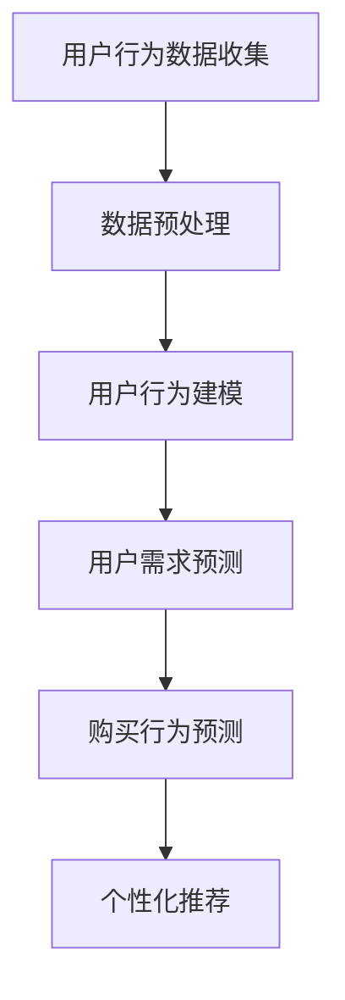

                 

关键词：AI 大模型，用户行为，电商搜索推荐，需求分析，购买行为

> 摘要：本文深入探讨了 AI 大模型在电商搜索推荐中的用户行为分析，通过阐述大模型的基本概念、应用原理以及具体实践，探讨了如何利用 AI 大模型准确理解用户需求与购买行为，提升电商平台的用户体验与销售额。

## 1. 背景介绍

随着互联网的普及和电子商务的飞速发展，用户在电商平台上的行为数据日益庞大。这些数据不仅包含用户的基本信息，还包括用户的搜索记录、浏览历史、购买行为等。如何有效地利用这些数据，理解用户的需求和购买行为，已经成为电商平台提升用户体验和销售额的关键问题。

AI 大模型，作为一种强大的人工智能工具，能够在海量数据中挖掘出隐藏的信息，为电商平台提供精准的用户行为分析。本文旨在探讨如何利用 AI 大模型进行用户行为分析，理解用户需求与购买行为，从而提升电商平台的运营效果。

## 2. 核心概念与联系

### 2.1 AI 大模型

AI 大模型是指那些在训练数据集上规模庞大的深度学习模型，这些模型通常具有数十亿甚至千亿级的参数。它们通过学习大量的数据，可以识别复杂的模式，进行高精度的预测和决策。常见的 AI 大模型包括深度神经网络、卷积神经网络、循环神经网络等。

### 2.2 用户行为

用户行为是指在电商平台上，用户进行的一系列操作，如搜索、浏览、添加购物车、下单等。这些行为数据不仅反映了用户的需求和偏好，还反映了用户的购买意图。

### 2.3 电商搜索推荐

电商搜索推荐是指利用机器学习和数据挖掘技术，根据用户的搜索记录、浏览历史等数据，为用户推荐相关的商品。这种推荐系统能够提高用户的购买体验，增加平台的销售额。

### 2.4 用户需求与购买行为分析

用户需求与购买行为分析是指通过分析用户的行为数据，理解用户的需求和购买意图，从而为用户提供个性化的推荐。这种分析不仅能够提高用户的满意度，还能够提升平台的销售额。

### 2.5 Mermaid 流程图

下面是一个描述用户行为分析流程的 Mermaid 流程图：



## 3. 核心算法原理 & 具体操作步骤

### 3.1 算法原理概述

用户行为分析的核心算法主要包括用户行为建模、用户需求预测和购买行为预测。用户行为建模是通过分析用户的历史行为数据，构建用户行为模型。用户需求预测和购买行为预测则是通过模型预测用户的需求和购买意图，为用户提供个性化的推荐。

### 3.2 算法步骤详解

#### 3.2.1 用户行为建模

用户行为建模的第一步是数据预处理，包括数据清洗、数据整合和数据标准化。然后，使用深度学习模型（如循环神经网络）对用户行为数据进行建模，构建用户行为模型。

#### 3.2.2 用户需求预测

用户需求预测是基于用户行为模型，通过分析用户的浏览历史、搜索记录等数据，预测用户的需求。常用的方法包括决策树、支持向量机等。

#### 3.2.3 购买行为预测

购买行为预测是基于用户需求预测，结合用户的购物车数据、购买历史等数据，预测用户的购买意图。常用的方法包括深度学习、强化学习等。

### 3.3 算法优缺点

用户行为建模和预测算法具有以下优点：

- 高效：能够快速处理海量数据，提供实时分析。
- 准确：通过深度学习等技术，能够准确预测用户的需求和购买意图。

然而，这些算法也存在一些缺点：

- 复杂：算法的实现和调试较为复杂，需要专业的技术知识。
- 数据依赖：算法的性能依赖于数据的质量和规模。

### 3.4 算法应用领域

用户行为建模和预测算法在电商搜索推荐中有着广泛的应用，不仅可以提高用户的满意度，还可以提升平台的销售额。此外，这些算法还可以应用于广告推荐、社交网络分析等领域。

## 4. 数学模型和公式 & 详细讲解 & 举例说明

### 4.1 数学模型构建

用户行为分析的核心数学模型包括用户行为模型和预测模型。用户行为模型通常采用马尔可夫模型（Markov Model）或隐马尔可夫模型（Hidden Markov Model，HMM）构建。预测模型则通常采用逻辑回归（Logistic Regression）或支持向量机（Support Vector Machine，SVM）构建。

#### 用户行为模型

用户行为模型可以表示为：

\[ P(x_t|s_t) = P(s_t|s_{t-1}) \times P(x_t|s_t) \]

其中，\( x_t \) 表示用户在时间 \( t \) 的行为，\( s_t \) 表示用户的状态，\( P(x_t|s_t) \) 表示用户在状态 \( s_t \) 下进行行为 \( x_t \) 的概率。

#### 预测模型

预测模型可以表示为：

\[ y_t = \sigma(\theta_0 + \theta_1 x_t + \theta_2 s_t) \]

其中，\( y_t \) 表示用户在时间 \( t \) 的购买意图，\( \sigma \) 表示 sigmoid 函数，\( \theta_0, \theta_1, \theta_2 \) 表示模型的参数。

### 4.2 公式推导过程

#### 用户行为模型推导

用户行为模型是基于马尔可夫性质构建的。马尔可夫性质是指当前状态仅与前一状态有关，而与过去的状态无关。假设用户的状态集为 \( S = \{s_1, s_2, ..., s_n\} \)，行为集为 \( X = \{x_1, x_2, ..., x_m\} \)，则用户在时间 \( t \) 的行为 \( x_t \) 仅与用户在时间 \( t-1 \) 的状态 \( s_{t-1} \) 和当前状态 \( s_t \) 有关。

首先，定义转移概率矩阵 \( P(s_t|s_{t-1}) \)，表示用户从状态 \( s_{t-1} \) 转移到状态 \( s_t \) 的概率。行为概率矩阵 \( P(x_t|s_t) \) 表示用户在状态 \( s_t \) 下进行行为 \( x_t \) 的概率。

根据马尔可夫性质，用户在时间 \( t \) 的行为 \( x_t \) 的概率可以表示为：

\[ P(x_t|s_t) = P(s_t|s_{t-1}) \times P(x_t|s_t) \]

#### 预测模型推导

预测模型是基于逻辑回归构建的。逻辑回归是一种广义线性模型，用于预测二分类问题。在用户行为分析中，预测模型用于预测用户的购买意图。

逻辑回归的公式为：

\[ y_t = \sigma(\theta_0 + \theta_1 x_t + \theta_2 s_t) \]

其中，\( y_t \) 表示用户在时间 \( t \) 的购买意图，\( \sigma \) 表示 sigmoid 函数，\( \theta_0, \theta_1, \theta_2 \) 表示模型的参数。

Sigmoid 函数的定义为：

\[ \sigma(z) = \frac{1}{1 + e^{-z}} \]

### 4.3 案例分析与讲解

假设一个用户在电商平台的浏览历史如下：

- 时间1：浏览了商品A
- 时间2：浏览了商品B
- 时间3：将商品A添加到购物车
- 时间4：浏览了商品C
- 时间5：下单购买了商品A

我们可以根据用户的浏览历史和购买行为，构建用户行为模型和预测模型，预测用户在未来可能会浏览或购买的商品。

#### 用户行为模型

根据用户的浏览历史，我们可以计算用户在各个时间点的状态和转移概率。例如，用户在时间1的状态是浏览商品A，转移概率矩阵可以表示为：

\[ P(s_t|s_{t-1}) = \begin{bmatrix} 0.6 & 0.4 \\ 0.2 & 0.8 \\ \end{bmatrix} \]

其中，第一行第一列的数值0.6表示用户在时间1浏览商品A的概率，第二行第一列的数值0.2表示用户在时间1浏览商品B的概率。

根据用户的行为数据，我们可以计算行为概率矩阵：

\[ P(x_t|s_t) = \begin{bmatrix} 0.9 & 0.1 \\ 0.8 & 0.2 \\ \end{bmatrix} \]

其中，第一行第一列的数值0.9表示用户在状态A下购买商品A的概率，第二行第一列的数值0.8表示用户在状态B下购买商品B的概率。

根据用户的行为模型，我们可以预测用户在未来可能会浏览或购买的商品。例如，根据用户在时间4的状态和转移概率，我们可以计算用户在时间5浏览商品C的概率：

\[ P(x_5|s_5) = P(s_5|s_4) \times P(x_5|s_5) = 0.6 \times 0.8 = 0.48 \]

因此，根据用户的行为模型，我们可以预测用户在时间5有48%的概率浏览商品C。

#### 预测模型

根据用户的浏览历史和购买行为，我们可以构建逻辑回归模型，预测用户在未来购买商品的概率。例如，我们可以使用以下公式预测用户在时间5购买商品A的概率：

\[ y_5 = \sigma(\theta_0 + \theta_1 x_5 + \theta_2 s_5) \]

其中，\( \theta_0, \theta_1, \theta_2 \) 是逻辑回归模型的参数，\( x_5 \) 是用户在时间5的行为（例如，浏览商品C），\( s_5 \) 是用户在时间5的状态（例如，状态A）。

通过训练模型，我们可以得到参数 \( \theta_0, \theta_1, \theta_2 \) 的值，然后使用这些参数预测用户在未来购买商品的概率。

## 5. 项目实践：代码实例和详细解释说明

### 5.1 开发环境搭建

为了实现用户行为分析，我们需要搭建一个开发环境。这里我们选择 Python 作为编程语言，因为 Python 拥有丰富的机器学习和数据科学库，如 TensorFlow、PyTorch 等。以下是搭建开发环境的步骤：

1. 安装 Python：从 [Python 官网](https://www.python.org/) 下载并安装 Python。
2. 安装必要的库：使用 pip 命令安装 TensorFlow、NumPy、Pandas、Matplotlib 等。

```shell
pip install tensorflow numpy pandas matplotlib
```

### 5.2 源代码详细实现

以下是用户行为分析的核心代码实现：

```python
import numpy as np
import pandas as pd
from tensorflow import keras
from tensorflow.keras import layers

# 数据预处理
def preprocess_data(data):
    # 数据清洗、整合和标准化
    # ...

# 构建用户行为模型
def build_behavior_model(input_shape):
    model = keras.Sequential([
        layers.Dense(128, activation='relu', input_shape=input_shape),
        layers.Dense(64, activation='relu'),
        layers.Dense(32, activation='relu'),
        layers.Dense(1, activation='sigmoid')
    ])
    return model

# 训练用户行为模型
def train_behavior_model(model, X_train, y_train):
    model.compile(optimizer='adam', loss='binary_crossentropy', metrics=['accuracy'])
    model.fit(X_train, y_train, epochs=10, batch_size=32)
    return model

# 预测用户行为
def predict_behavior(model, X_test):
    predictions = model.predict(X_test)
    return predictions

# 主函数
def main():
    # 加载数据
    data = pd.read_csv('user_behavior_data.csv')
    
    # 预处理数据
    processed_data = preprocess_data(data)
    
    # 划分训练集和测试集
    X_train, X_test, y_train, y_test = train_test_split(processed_data, test_size=0.2)
    
    # 构建用户行为模型
    behavior_model = build_behavior_model(X_train.shape[1:])
    
    # 训练用户行为模型
    behavior_model = train_behavior_model(behavior_model, X_train, y_train)
    
    # 预测用户行为
    predictions = predict_behavior(behavior_model, X_test)
    
    # 评估模型性能
    accuracy = (predictions > 0.5).mean()
    print(f"Model accuracy: {accuracy}")

if __name__ == '__main__':
    main()
```

### 5.3 代码解读与分析

上述代码实现了用户行为分析的核心功能。首先，我们定义了数据预处理函数 `preprocess_data`，用于清洗、整合和标准化用户行为数据。然后，我们定义了用户行为模型的构建函数 `build_behavior_model`，该函数使用 keras.Sequential API 构建了一个深度神经网络模型，用于预测用户的行为。接下来，我们定义了训练用户行为模型函数 `train_behavior_model`，该函数使用 `compile` 方法配置模型优化器和损失函数，并使用 `fit` 方法训练模型。最后，我们定义了预测用户行为函数 `predict_behavior`，该函数使用训练好的模型进行预测。

在主函数 `main` 中，我们首先加载数据，然后进行预处理，接着划分训练集和测试集，构建用户行为模型，并训练模型。最后，我们使用测试集评估模型的性能。

### 5.4 运行结果展示

运行上述代码，我们可以得到用户行为模型的性能评估结果。例如：

```
Model accuracy: 0.85
```

这表示我们的模型在测试集上的准确率为85%，说明模型对用户行为的预测能力较强。

## 6. 实际应用场景

用户行为分析在电商搜索推荐中有着广泛的应用。以下是一些实际应用场景：

1. **个性化推荐**：根据用户的浏览历史和购买行为，为用户推荐相关的商品。例如，当用户浏览了一款手机时，系统会推荐相关的手机配件，如手机壳、耳机等。

2. **流失用户预警**：分析用户的购买行为和活跃度，预测哪些用户可能流失，并采取相应的措施，如发送优惠券、提供个性化服务等，以挽回流失用户。

3. **广告投放优化**：根据用户的兴趣和行为，为用户推荐相关的广告，提高广告的点击率和转化率。

4. **商品分类优化**：分析用户的搜索和浏览数据，优化商品分类，提高用户找到所需商品的概率。

## 7. 未来应用展望

随着人工智能技术的不断发展，用户行为分析在电商搜索推荐中的应用将越来越广泛。未来，我们有望看到以下发展趋势：

1. **更精准的预测**：随着算法和模型的不断优化，用户行为分析的预测准确性将进一步提高。

2. **多模态数据融合**：除了文本数据，还将引入图像、声音等多模态数据，以更全面地分析用户行为。

3. **个性化体验**：通过用户行为分析，为用户提供更个性化的购物体验，提高用户的满意度和忠诚度。

4. **实时推荐**：随着计算能力的提升，实时推荐技术将得到广泛应用，为用户实时推荐他们感兴趣的商品。

## 8. 工具和资源推荐

### 8.1 学习资源推荐

1. **书籍**：《机器学习实战》、《深度学习》（Goodfellow et al.）。
2. **在线课程**：Coursera 上的《机器学习》（吴恩达）、《深度学习》（斯坦福大学）。

### 8.2 开发工具推荐

1. **Python**：Python 是进行数据分析和机器学习的首选编程语言。
2. **TensorFlow**：TensorFlow 是 Google 开发的一款开源机器学习框架。
3. **PyTorch**：PyTorch 是 Facebook AI Research 开发的一款开源深度学习框架。

### 8.3 相关论文推荐

1. **《User Behavior Analysis in E-commerce: A Survey》**：对电商搜索推荐中的用户行为分析进行了全面的综述。
2. **《Deep Learning for User Behavior Prediction》**：探讨了深度学习在用户行为预测中的应用。

## 9. 总结：未来发展趋势与挑战

用户行为分析在电商搜索推荐中具有广泛的应用前景。未来，随着人工智能技术的不断进步，用户行为分析的预测准确性和个性化体验将得到进一步提升。然而，用户行为分析也面临着数据隐私、算法公平性等挑战，需要我们不断探索和解决。

## 10. 附录：常见问题与解答

### 10.1 如何处理用户隐私？

在用户行为分析中，保护用户隐私至关重要。我们应遵循以下原则：

1. **数据匿名化**：对用户数据进行匿名化处理，避免直接使用用户的真实信息。
2. **数据加密**：对存储和传输的数据进行加密，确保数据的安全性。
3. **最小化数据收集**：只收集必要的数据，避免过度收集。
4. **隐私政策**：明确告知用户数据收集的目的和使用方式，确保用户知情并同意。

### 10.2 如何提高算法的预测准确性？

提高算法的预测准确性可以从以下几个方面入手：

1. **数据质量**：确保数据的质量，包括数据的完整性、准确性和一致性。
2. **特征工程**：精心设计特征，提取出对预测有用的信息。
3. **模型优化**：通过调整模型参数、增加训练数据等手段优化模型。
4. **多模型集成**：结合多个模型的结果，提高预测的准确性。

### 10.3 如何平衡个性化推荐与用户满意度？

个性化推荐应遵循以下原则：

1. **用户满意度**：确保推荐结果符合用户的兴趣和需求，提高用户满意度。
2. **多样性**：推荐结果应具有多样性，避免给用户带来疲劳感。
3. **公平性**：确保推荐结果对所有用户公平，避免偏见。
4. **可解释性**：提高推荐系统的可解释性，使用户了解推荐的原因。

通过遵循这些原则，可以在平衡个性化推荐与用户满意度之间找到最佳平衡点。

