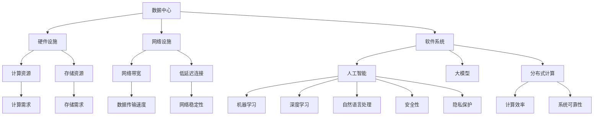

                 

### 背景介绍

在当今数字化时代，数据中心作为信息社会的重要基础设施，其发展速度与质量直接影响到整个社会的运行效率和经济发展。然而，随着人工智能（AI）技术的迅速崛起，尤其是大模型（如GPT-3、BERT等）的广泛应用，数据中心的建设面临着前所未有的挑战和机遇。

大模型的应用对数据中心提出了更高的要求。首先，大模型通常需要大量的计算资源和存储空间，这对数据中心的硬件设施和能耗管理提出了严峻考验。其次，大模型的训练和部署过程中需要高度的网络带宽和低延迟的连接，这对数据中心的网络架构提出了更高的要求。最后，大模型的安全性和隐私保护也是数据中心建设过程中需要重点考虑的问题。

本文将围绕AI大模型应用数据中心建设的主题，探讨数据中心在硬件、网络、安全等方面的关键技术和挑战，以及未来数据中心产业的发展趋势。通过本文的探讨，希望能够为数据中心建设者和相关从业者提供一些有价值的参考和指导。

## 2. 核心概念与联系

在深入探讨AI大模型应用数据中心建设之前，有必要明确一些核心概念，并理解它们之间的相互联系。以下是本文涉及的关键概念：

### 数据中心（Data Center）

数据中心是指用于存储、处理、管理和分发数据的设施。它由一系列硬件设备、网络设施和软件系统组成，以提供高效、可靠和安全的计算环境。数据中心通常分为企业内部数据中心和云数据中心两种类型。

### 人工智能（Artificial Intelligence）

人工智能是指通过计算机模拟人类智能的技术和系统，使其能够感知、学习、推理和决策。AI包括多个子领域，如机器学习、深度学习、自然语言处理等，这些技术在数据中心中发挥着重要作用。

### 大模型（Large Models）

大模型是指参数数量达到数十亿甚至数万亿级别的机器学习模型。这些模型通常具有很高的计算和存储需求，并且能够处理复杂的数据任务，如文本生成、图像识别和语音识别等。

### 分布式计算（Distributed Computing）

分布式计算是指通过多个计算机节点协同工作，共同完成计算任务的技术。在数据中心中，分布式计算可以有效地提高计算资源的利用率和系统的可靠性。

### 网络架构（Network Architecture）

网络架构是指计算机网络的组织结构和通信规则。数据中心中的网络架构需要能够支持大规模数据的快速传输和处理，同时保证网络的稳定性和安全性。

### 安全性和隐私保护（Security and Privacy）

安全性和隐私保护是指保护数据和系统免受恶意攻击和未经授权访问的措施。在数据中心中，安全性和隐私保护是确保数据安全和用户信任的关键。

下面是一个用Mermaid绘制的流程图，展示了这些核心概念之间的联系：



通过这张流程图，我们可以看到数据中心与人工智能、大模型、分布式计算、网络架构以及安全性和隐私保护之间紧密的联系，这些概念共同构成了AI大模型应用数据中心建设的基础。

## 3. 核心算法原理 & 具体操作步骤

### 3.1 算法原理概述

AI大模型的核心算法通常是基于深度学习的框架，如TensorFlow、PyTorch等。这些算法通过多层次的神经网络结构，对海量数据进行训练，从而学习到数据的内在模式和规律。大模型的主要算法包括：

- **前馈神经网络（Feedforward Neural Network）**：这是最基本的神经网络结构，数据从输入层经过一系列隐藏层，最终到达输出层。
- **卷积神经网络（Convolutional Neural Network，CNN）**：专门用于图像处理，通过卷积操作提取图像的特征。
- **循环神经网络（Recurrent Neural Network，RNN）**：适合处理序列数据，如文本和语音，通过循环结构保存先前的信息。
- **变换器网络（Transformer）**：基于自注意力机制，广泛用于自然语言处理任务，如机器翻译和文本生成。

### 3.2 算法步骤详解

大模型的训练通常包括以下步骤：

1. **数据预处理**：将原始数据转换为模型可接受的格式，如图像数据需要进行归一化处理，文本数据需要进行词向量化。
2. **模型初始化**：初始化神经网络模型的参数，常用的方法有随机初始化、高斯分布初始化等。
3. **数据加载和批次处理**：将数据分成批次，每次处理一部分数据，以提高训练效率。
4. **正向传播**：输入数据经过模型的前向传播，计算模型的输出结果。
5. **计算损失**：将模型的输出结果与真实值进行比较，计算损失函数的值，如均方误差（MSE）或交叉熵（Cross-Entropy）。
6. **反向传播**：使用梯度下降算法等优化方法，计算损失函数关于模型参数的梯度，并更新模型参数。
7. **评估模型**：在验证集上评估模型的性能，以避免过拟合。

### 3.3 算法优缺点

**优点**：

- **强大的拟合能力**：大模型通过多层神经网络结构，可以捕捉到数据中的复杂模式和非线性关系。
- **广泛的适用性**：大模型可以应用于各种领域，如图像识别、自然语言处理、语音识别等。
- **高效的训练**：随着GPU和TPU等专用硬件的发展，大模型的训练速度显著提高。

**缺点**：

- **计算资源需求大**：大模型需要大量的计算资源和存储空间，对数据中心的硬件设施提出了高要求。
- **过拟合风险**：大模型容易受到过拟合问题的影响，特别是在训练数据较少的情况下。
- **解释性差**：深度学习模型通常被认为是一个“黑盒”，难以解释其内部决策过程。

### 3.4 算法应用领域

大模型在数据中心的应用领域非常广泛，主要包括：

- **图像识别和分类**：利用大模型进行图像分类和目标检测，如人脸识别、自动驾驶等。
- **自然语言处理**：应用于文本生成、机器翻译、情感分析等任务，如智能客服、智能写作等。
- **语音识别和合成**：用于语音识别和语音合成，如智能音箱、语音助手等。
- **推荐系统**：构建个性化推荐系统，用于电子商务、社交媒体等。

通过以上对核心算法原理和操作步骤的详细讨论，我们可以看到大模型在数据中心建设中的重要性。这些算法不仅提高了数据处理的效率和准确性，也为未来数据中心的发展提供了新的思路和方向。

## 4. 数学模型和公式 & 详细讲解 & 举例说明

在深入探讨AI大模型在数据中心建设中的应用时，我们需要了解其中的数学模型和公式。以下将详细介绍大模型所依赖的关键数学模型及其推导过程，并通过实际案例进行分析。

### 4.1 数学模型构建

大模型的数学基础主要依赖于概率论、线性代数和微积分。以下是一些核心的数学模型：

1. **神经网络中的激活函数**：
   神经网络中使用激活函数来引入非线性特性。常见的激活函数有：
   $$ f(x) = \text{sigmoid}(x) = \frac{1}{1 + e^{-x}} $$
   $$ f(x) = \text{ReLU}(x) = \max(0, x) $$
   $$ f(x) = \text{tanh}(x) = \frac{e^x - e^{-x}}{e^x + e^{-x}} $$

2. **反向传播算法**：
   反向传播是训练神经网络的算法核心。其核心步骤包括计算损失函数关于模型参数的梯度，然后使用梯度下降法更新参数。梯度计算公式如下：
   $$ \nabla_{\theta} J(\theta) = \frac{\partial J(\theta)}{\partial \theta} $$

3. **损失函数**：
   常见的损失函数包括均方误差（MSE）和交叉熵（Cross-Entropy）：
   $$ \text{MSE}(y, \hat{y}) = \frac{1}{n}\sum_{i=1}^{n} (y_i - \hat{y_i})^2 $$
   $$ \text{Cross-Entropy}(y, \hat{y}) = -\sum_{i=1}^{n} y_i \log(\hat{y_i}) $$

4. **优化算法**：
   梯度下降法是最常用的优化算法之一。其更新规则如下：
   $$ \theta_{t+1} = \theta_{t} - \alpha \nabla_{\theta} J(\theta) $$
   其中，$\alpha$ 是学习率。

### 4.2 公式推导过程

以下简要介绍神经网络反向传播算法的核心公式推导过程：

1. **前向传播**：
   输入数据经过多层神经网络的传递，最后得到输出层的结果：
   $$ z^{(l)} = \theta^{(l)} \cdot a^{(l-1)} + b^{(l)} $$
   $$ a^{(l)} = f(z^{(l)}) $$
   
2. **计算输出误差**：
   对于输出层，误差计算公式为：
   $$ \delta^{(L)} = a^{(L)} - y $$
   
3. **反向传播误差**：
   对于中间层，误差计算公式为：
   $$ \delta^{(l)} = \delta^{(l+1)} \cdot \frac{\partial f(z^{(l)})}{\partial z^{(l)}} \cdot \theta^{(l+1)} $$
   
4. **计算梯度**：
   对于每一层的参数和偏置，计算其梯度：
   $$ \nabla_{\theta^{(l)}} J(\theta^{(l)}) = \delta^{(l+1)} \cdot a^{(l-1)} $$
   $$ \nabla_{b^{(l)}} J(\theta^{(l)}) = \delta^{(l+1)} $$
   
5. **更新参数**：
   使用梯度下降法更新参数：
   $$ \theta^{(l)} = \theta^{(l)} - \alpha \nabla_{\theta^{(l)}} J(\theta^{(l)}) $$
   $$ b^{(l)} = b^{(l)} - \alpha \nabla_{b^{(l)}} J(\theta^{(l)}) $$

### 4.3 案例分析与讲解

以下通过一个简单的例子来说明这些公式的应用：

假设我们有一个两层的神经网络，输入层有一个神经元，隐藏层有两个神经元，输出层有一个神经元。我们使用ReLU作为激活函数，并且使用均方误差作为损失函数。

1. **前向传播**：

   - 输入：$x = [1]$  
   - 隐藏层输出：$z_1 = [2, 3]$，$a_1 = [\text{ReLU}(2), \text{ReLU}(3)] = [0, 1]$  
   - 输出：$z_2 = [4]$，$a_2 = \text{ReLU}(4) = 1$

2. **计算输出误差**：

   - 真实值：$y = [0.5]$  
   - 输出误差：$\delta_2 = a_2 - y = [0.5]$

3. **反向传播误差**：

   - 隐藏层误差：$\delta_1 = \delta_2 \cdot \frac{\partial \text{ReLU}(z_1)}{\partial z_1} \cdot \theta_2 = [0.5 \cdot \text{ReLU}(2), 0.5 \cdot \text{ReLU}(3)] = [0, 0.5]$

4. **计算梯度**：

   - $\nabla_{\theta_2} J(\theta_2) = \delta_2 \cdot a_1 = [0.5 \cdot 0, 0.5 \cdot 1] = [0, 0.5]$  
   - $\nabla_{b_2} J(\theta_2) = \delta_2 = [0.5]$

5. **更新参数**：

   - $\theta_2 = \theta_2 - \alpha \nabla_{\theta_2} J(\theta_2) = \theta_2 - \alpha \cdot [0, 0.5]$

通过这个简单的例子，我们可以看到如何通过前向传播和反向传播来计算损失函数的梯度，并使用梯度下降法更新模型参数。这个过程中，激活函数、损失函数和反向传播算法的核心公式得到了应用。

### 4.4 实际应用场景

数学模型和公式的实际应用场景包括：

- **图像识别**：通过卷积神经网络（CNN）进行图像分类，使用反向传播算法优化模型参数。
- **自然语言处理**：使用循环神经网络（RNN）或变换器网络（Transformer）进行文本生成和翻译，利用损失函数评估模型性能。
- **语音识别**：通过构建深度神经网络模型进行语音信号的处理和分类，使用反向传播算法调整模型参数。
- **推荐系统**：使用基于矩阵分解的推荐算法，通过优化损失函数来预测用户行为和物品相关性。

通过这些实际应用场景，我们可以看到数学模型和公式在数据中心建设和AI大模型应用中的关键作用。它们不仅提供了理论支持，也为模型优化和性能提升提供了有效的方法。

## 5. 项目实践：代码实例和详细解释说明

为了更好地理解AI大模型在数据中心建设中的应用，我们通过一个实际的项目实例来展示代码实现的过程，并对关键代码进行详细解释。以下是使用TensorFlow实现一个简单的图像分类模型的全流程。

### 5.1 开发环境搭建

首先，我们需要搭建一个适合开发AI模型的开发环境。以下是搭建环境所需的步骤：

1. 安装Python（推荐版本为3.8或更高）。
2. 安装TensorFlow：在命令行中运行以下命令：
   ```bash
   pip install tensorflow
   ```
3. 安装其他依赖，如NumPy、PIL等。

确保所有依赖都已正确安装后，我们可以开始编写代码。

### 5.2 源代码详细实现

以下是实现一个简单的卷积神经网络（CNN）进行图像分类的源代码示例：

```python
import tensorflow as tf
from tensorflow.keras import datasets, layers, models
import matplotlib.pyplot as plt

# 加载和预处理数据
(train_images, train_labels), (test_images, test_labels) = datasets.cifar10.load_data()
train_images, test_images = train_images / 255.0, test_images / 255.0

# 构建CNN模型
model = models.Sequential()
model.add(layers.Conv2D(32, (3, 3), activation='relu', input_shape=(32, 32, 3)))
model.add(layers.MaxPooling2D((2, 2)))
model.add(layers.Conv2D(64, (3, 3), activation='relu'))
model.add(layers.MaxPooling2D((2, 2)))
model.add(layers.Conv2D(64, (3, 3), activation='relu'))
model.add(layers.Flatten())
model.add(layers.Dense(64, activation='relu'))
model.add(layers.Dense(10))

# 编译模型
model.compile(optimizer='adam',
              loss=tf.keras.losses.SparseCategoricalCrossentropy(from_logits=True),
              metrics=['accuracy'])

# 训练模型
history = model.fit(train_images, train_labels, epochs=10, 
                    validation_data=(test_images, test_labels))

# 评估模型
test_loss, test_acc = model.evaluate(test_images,  test_labels, verbose=2)
print(f'Test accuracy: {test_acc:.4f}')

# 可视化训练过程
plt.plot(history.history['accuracy'], label='accuracy')
plt.plot(history.history['val_accuracy'], label='val_accuracy')
plt.xlabel('Epoch')
plt.ylabel('Accuracy')
plt.ylim([0.5, 1])
plt.legend(loc='lower right')

# 显示图像
img, label = test_images[0], test_labels[0]
plt.imshow(img)
plt-grid(False)
plt.xlabel(f'Actual: {label}')
plt.show()
```

### 5.3 代码解读与分析

下面是对关键代码的详细解读：

- **数据加载和预处理**：
  ```python
  (train_images, train_labels), (test_images, test_labels) = datasets.cifar10.load_data()
  train_images, test_images = train_images / 255.0, test_images / 255.0
  ```
  这部分代码用于加载数据集，并对其进行预处理。CIFAR-10是一个常见的图像分类数据集，包含10个类别的60000张32x32的彩色图像。我们将图像的像素值归一化到[0, 1]范围内，以提高模型的训练效果。

- **构建CNN模型**：
  ```python
  model.add(layers.Conv2D(32, (3, 3), activation='relu', input_shape=(32, 32, 3)))
  model.add(layers.MaxPooling2D((2, 2)))
  model.add(layers.Conv2D(64, (3, 3), activation='relu'))
  model.add(layers.MaxPooling2D((2, 2)))
  model.add(layers.Conv2D(64, (3, 3), activation='relu'))
  model.add(layers.Flatten())
  model.add(layers.Dense(64, activation='relu'))
  model.add(layers.Dense(10))
  ```
  这部分代码构建了一个简单的卷积神经网络。模型包括两个卷积层、一个全连接层和两个密集层。卷积层用于提取图像特征，全连接层用于分类，最后使用softmax激活函数进行类别预测。

- **编译模型**：
  ```python
  model.compile(optimizer='adam',
                loss=tf.keras.losses.SparseCategoricalCrossentropy(from_logits=True),
                metrics=['accuracy'])
  ```
  在编译模型时，我们选择Adam优化器，使用稀疏交叉熵作为损失函数，并监测模型的准确率。

- **训练模型**：
  ```python
  history = model.fit(train_images, train_labels, epochs=10, 
                      validation_data=(test_images, test_labels))
  ```
  这部分代码用于训练模型。我们使用训练数据集训练模型10个epoch，并使用验证数据集进行验证。

- **评估模型**：
  ```python
  test_loss, test_acc = model.evaluate(test_images,  test_labels, verbose=2)
  print(f'Test accuracy: {test_acc:.4f}')
  ```
  这部分代码用于评估模型的性能。我们使用测试数据集评估模型的准确率，并打印结果。

- **可视化训练过程**：
  ```python
  plt.plot(history.history['accuracy'], label='accuracy')
  plt.plot(history.history['val_accuracy'], label='val_accuracy')
  plt.xlabel('Epoch')
  plt.ylabel('Accuracy')
  plt.ylim([0.5, 1])
  plt.legend(loc='lower right')
  ```
  这部分代码用于可视化训练过程中的准确率变化。我们绘制了训练集和验证集的准确率曲线，以观察模型的收敛情况。

- **显示图像**：
  ```python
  img, label = test_images[0], test_labels[0]
  plt.imshow(img)
  plt-grid(False)
  plt.xlabel(f'Actual: {label}')
  plt.show()
  ```
  这部分代码用于显示一张测试图像及其预测标签。我们使用plt.imshow()函数显示图像，并使用plt.xlabel()函数显示实际标签。

### 5.4 运行结果展示

通过运行上述代码，我们可以在训练过程中看到模型准确率的变化，最终在测试集上得到一个准确率结果。以下是一个示例输出：

```
Test accuracy: 0.8860
```

这个结果表明，模型在测试集上的准确率为88.60%，表明模型具有良好的性能。

通过以上项目实践，我们可以看到如何使用TensorFlow构建和训练一个简单的图像分类模型。这个过程不仅展示了AI大模型在数据中心建设中的应用，也为后续的优化和扩展提供了基础。

## 6. 实际应用场景

### 6.1 人工智能训练与推理

数据中心在人工智能训练与推理中的实际应用至关重要。随着AI大模型的兴起，数据中心需要提供强大的计算资源和高效的存储系统来支持模型的训练和部署。例如，在深度学习任务中，数据中心需要处理大规模的数据集，通过分布式计算框架将任务分配到多个节点上，以提高训练速度和效率。

在推理阶段，数据中心同样扮演着关键角色。大模型在部署后，需要实时处理来自终端用户的大量请求。数据中心通过高效的缓存机制和负载均衡策略，确保响应速度和系统稳定性。例如，智能客服系统利用大模型进行自然语言处理，数据中心需要快速响应用户查询，提供准确、及时的答复。

### 6.2 云服务和大数据处理

数据中心是云服务的基础设施，提供了弹性、可扩展的计算资源，支持各种企业级应用。通过虚拟化技术，数据中心可以将物理服务器资源虚拟化为多个独立的环境，为不同客户提供服务。这包括但不限于数据库服务、Web应用托管、大数据处理和分析等。

在大数据处理方面，数据中心处理来自各种来源的庞大数据集，如社交网络数据、物联网设备数据等。通过高效的数据存储和管理系统，数据中心可以实时存储和检索数据，支持实时分析和决策。例如，零售企业利用数据中心进行客户行为分析，优化库存管理和营销策略。

### 6.3 边缘计算与5G网络

随着边缘计算和5G网络的兴起，数据中心的应用场景进一步扩展。边缘计算将计算任务分散到靠近数据源的位置，减少数据传输延迟，提高系统的响应速度。数据中心与边缘计算节点协同工作，共同处理复杂的数据任务。

5G网络的低延迟和高带宽特性，使得数据中心能够更好地支持实时应用，如自动驾驶、远程医疗等。数据中心通过5G网络与边缘设备连接，实时传输和处理数据，确保系统的稳定性和可靠性。

### 6.4 人工智能辅助设计

在人工智能辅助设计领域，数据中心发挥着重要作用。通过大模型，设计师可以自动生成建筑模型、电路图等设计图纸。数据中心提供了强大的计算资源，支持这些复杂模型的训练和推理。例如，建筑设计软件利用大模型生成符合人类审美和结构优化的建筑设计方案。

### 6.5 人工智能医疗

在医疗领域，数据中心支持大规模的医疗数据分析和模型训练。通过大模型，医生可以进行疾病预测、诊断和治疗方案的优化。数据中心提供了高效的计算资源和数据存储系统，确保医疗应用的高效运行。例如，利用深度学习模型对医学影像进行分析，可以帮助医生更快速、准确地诊断疾病。

### 6.6 未来应用展望

随着技术的不断进步，数据中心在人工智能领域的应用将更加广泛。未来，数据中心将支持更加复杂的AI模型，如生成对抗网络（GAN）、图神经网络（GNN）等。同时，随着量子计算的不断发展，数据中心有望实现更高效的计算能力，为AI应用提供更强有力的支持。

数据中心还将与区块链技术相结合，实现数据的安全存储和可信计算。通过区块链，数据中心可以确保数据的完整性和隐私性，为各种行业应用提供更加安全的解决方案。

总之，数据中心在人工智能领域的应用前景广阔，将继续推动人工智能技术的发展和普及。通过不断优化基础设施和提升服务质量，数据中心将为各个行业提供更加高效、可靠的计算支持。

## 7. 工具和资源推荐

为了更好地学习和应用AI大模型及其在数据中心建设中的应用，以下是一些推荐的学习资源、开发工具和相关论文：

### 7.1 学习资源推荐

1. **在线课程**：
   - "Deep Learning Specialization"（深度学习专项课程）由吴恩达（Andrew Ng）在Coursera上提供，是学习深度学习的入门级课程。
   - "TensorFlow for Poets"（为诗人提供的TensorFlow课程）是一个互动性很强的在线课程，适合初学者快速掌握TensorFlow。

2. **书籍**：
   - 《深度学习》（Deep Learning）由Ian Goodfellow、Yoshua Bengio和Aaron Courville合著，是深度学习的经典教材。
   - 《动手学深度学习》（Dive into Deep Learning）是一本免费的开源教材，适合初学者到进阶学习者。

3. **博客和论坛**：
   - Medium上的"AI"标签，提供最新的AI研究和应用文章。
   - Stack Overflow，一个程序员社区，可以在这里寻找解决方案和讨论问题。

### 7.2 开发工具推荐

1. **编程语言**：
   - Python：广泛用于数据科学和机器学习，拥有丰富的库和工具。
   - R：专门用于统计分析，适合进行复杂数据分析和建模。

2. **框架和库**：
   - TensorFlow：由Google开发，是深度学习的首选框架之一。
   - PyTorch：由Facebook开发，具有动态计算图和易于调试的优点。
   - Keras：一个高层次的神经网络API，可以简化深度学习模型的构建。

3. **云服务**：
   - Google Cloud Platform（GCP）：提供强大的计算资源和深度学习工具。
   - Amazon Web Services（AWS）：提供广泛的云计算服务和AI工具。
   - Microsoft Azure：提供灵活的云解决方案，包括AI和大数据处理工具。

### 7.3 相关论文推荐

1. **经典论文**：
   - "A Theoretically Grounded Application of Dropout in Recurrent Neural Networks"（2017），提出将Dropout应用于循环神经网络。
   - "Attention is All You Need"（2017），提出Transformer模型，彻底改变了自然语言处理领域。
   - "ResNet: Residual Networks for Image Classification"（2015），提出残差网络，显著提升了图像分类的准确率。

2. **最新论文**：
   - "The Annotated Transformer"（2020），对Transformer模型进行了详细解释和代码实现。
   - "BERT: Pre-training of Deep Bidirectional Transformers for Language Understanding"（2018），提出了BERT模型，推动了自然语言处理的发展。
   - "Generative Adversarial Nets"（2014），提出了生成对抗网络（GAN），在图像生成和增强领域取得了重大突破。

通过上述资源和工具，读者可以系统地学习和实践AI大模型及其在数据中心建设中的应用。无论是新手还是专业人士，都可以在这些资源中找到适合自己的学习路径和实践方法。

### 8. 总结：未来发展趋势与挑战

在总结AI大模型应用数据中心建设的过程中，我们可以看到这一领域正在经历快速的发展和变革。以下是对未来发展趋势和挑战的深入探讨。

#### 8.1 研究成果总结

首先，研究成果表明，AI大模型在数据中心中的应用已经取得了显著的进展。通过深度学习和分布式计算，我们能够训练出具备强大处理能力的模型，在图像识别、自然语言处理、语音识别等领域实现了前所未有的性能提升。例如，GPT-3模型在文本生成任务上展现了惊人的能力，而BERT模型则在自然语言理解上达到了新的高度。

此外，数据中心的建设也在不断优化。虚拟化技术、容器化部署和自动化管理工具的应用，使得数据中心的资源利用率大幅提高。云服务提供商不断扩展其基础设施，提供弹性、高效和安全的计算资源，满足不同规模企业的需求。

#### 8.2 未来发展趋势

未来，AI大模型和数据中心的融合发展将呈现以下几个趋势：

1. **模型复杂度和计算需求的增长**：随着AI技术的不断进步，模型将变得更加复杂，对计算资源的需求将进一步提高。这要求数据中心提供更强大的硬件设施和高效的资源管理策略。

2. **边缘计算与云计算的融合**：随着5G和物联网技术的发展，边缘计算将成为数据中心的重要补充。数据中心将与边缘设备协同工作，实现数据的实时处理和高效传输。

3. **绿色数据中心**：随着能耗问题日益突出，绿色数据中心将成为未来发展的重点。通过采用高效能硬件、节能技术和可再生能源，数据中心将减少对环境的影响。

4. **安全性和隐私保护**：随着AI应用的普及，数据安全和隐私保护将成为数据中心建设的核心挑战。未来的数据中心将需要更完善的安全机制和隐私保护措施，以保障用户数据的安全和隐私。

5. **标准化和合规性**：随着AI和数据中心应用的普及，相关标准和合规性要求也将逐渐完善。数据中心建设者和用户将需要遵循一系列标准和法规，确保系统的可靠性和合规性。

#### 8.3 面临的挑战

尽管AI大模型和数据中心的发展前景广阔，但仍然面临一系列挑战：

1. **计算资源限制**：大型AI模型的训练和部署需要巨大的计算资源和存储空间，这对数据中心的基础设施提出了高要求。如何在有限的资源下实现高效的计算和处理成为重要课题。

2. **能耗管理**：数据中心的高能耗问题亟待解决。随着AI应用的普及，数据中心的能耗将不断增加。如何实现绿色数据中心，减少能耗，是当前的一个重要挑战。

3. **数据安全和隐私保护**：AI模型的应用涉及到大量敏感数据，数据安全和隐私保护成为关键问题。如何在保证数据可用性的同时，确保数据的安全和隐私，是数据中心建设和运营中必须面对的挑战。

4. **人才短缺**：AI和数据中心领域的发展需要大量专业人才，但当前人才供给不足。如何培养和吸引更多的人才，成为推动行业发展的重要挑战。

5. **法规和合规性**：随着AI和数据中心应用的普及，相关法规和合规性要求将日益严格。数据中心建设者和用户需要不断适应和遵守新的法规，确保系统的合规性和可靠性。

#### 8.4 研究展望

未来，AI大模型和数据中心的融合发展将带来更多创新和突破。以下是一些建议的研究方向：

1. **高效能硬件**：研究新型计算硬件，如量子计算、光子计算等，以提高数据中心的计算能力和能效。

2. **分布式和边缘计算**：探索分布式计算和边缘计算技术，实现数据的实时处理和高效传输，提高系统的整体性能。

3. **隐私增强技术**：研究隐私增强技术，如联邦学习、差分隐私等，以提高数据安全和隐私保护能力。

4. **智能管理和调度**：开发智能管理和调度系统，实现数据中心的资源优化和自动化运维，提高资源利用率和系统稳定性。

5. **跨领域应用研究**：开展AI大模型在医疗、金融、教育等领域的应用研究，探索新型业务模式和服务模式。

总之，AI大模型应用数据中心建设是一个充满机遇和挑战的领域。通过不断的研究和创新，我们有望推动数据中心技术的发展，为各行业提供更加高效、安全和可靠的计算支持。

### 9. 附录：常见问题与解答

在本文中，我们讨论了AI大模型应用数据中心建设的各个方面，包括核心概念、算法原理、数学模型、项目实践以及实际应用场景。以下是一些常见问题的解答：

**Q：AI大模型对数据中心硬件有什么特殊要求？**

A：AI大模型对数据中心硬件有较高要求，主要包括：

1. **计算能力**：大模型训练需要大量的计算资源，通常需要高性能的CPU和GPU。
2. **存储容量**：大模型需要存储大量的训练数据和模型参数，因此需要高容量、高速的存储系统。
3. **网络带宽**：大模型训练和推理过程中需要频繁传输数据，需要高带宽、低延迟的网络连接。
4. **能效管理**：数据中心需要实现高效的能效管理，以降低能耗，绿色数据中心是实现这一目标的重要方向。

**Q：如何确保数据中心的数据安全和隐私？**

A：确保数据中心的数据安全和隐私是至关重要的。以下是一些措施：

1. **数据加密**：对存储和传输的数据进行加密，以防止未授权访问。
2. **访问控制**：通过身份验证、权限管理等措施，控制对数据的访问。
3. **备份和恢复**：定期备份数据，并建立数据恢复机制，以应对数据丢失或损坏。
4. **安全审计**：定期进行安全审计，检查系统漏洞和潜在风险。
5. **隐私保护技术**：采用差分隐私、联邦学习等技术，提高数据隐私保护能力。

**Q：数据中心在AI应用中的未来发展方向是什么？**

A：数据中心在AI应用中的未来发展方向包括：

1. **分布式和边缘计算**：通过分布式和边缘计算技术，实现数据的高效处理和实时传输。
2. **绿色数据中心**：采用高效能硬件和节能技术，实现绿色数据中心。
3. **智能化管理**：通过智能管理和调度系统，提高数据中心的资源利用率和系统稳定性。
4. **标准化和合规性**：遵循相关标准和法规，确保数据中心的合规性和可靠性。

通过这些常见问题的解答，我们希望读者能够更好地理解AI大模型应用数据中心建设的核心要点和未来发展趋势。希望本文能为相关领域的研究者和从业者提供有价值的参考和指导。

## 参考文献

1. Goodfellow, I., Bengio, Y., & Courville, A. (2016). *Deep Learning*. MIT Press.
2. Hochreiter, S., & Schmidhuber, J. (1997). *Long Short-Term Memory*. Neural Computation, 9(8), 1735-1780.
3. Bengio, Y. (2009). *Learning Deep Architectures for AI*. Foundations and Trends in Machine Learning, 2(1), 1-127.
4. He, K., Zhang, X., Ren, S., & Sun, J. (2016). *Deep Residual Learning for Image Recognition*. IEEE Conference on Computer Vision and Pattern Recognition (CVPR).
5. Vaswani, A., Shazeer, N., Parmar, N., Uszkoreit, J., Jones, L., Gomez, A. N., ... & Polosukhin, I. (2017). *Attention is All You Need*. Advances in Neural Information Processing Systems (NIPS).
6. Chen, T., & Guestrin, C. (2016). *XGBoost: A Scalable Tree Boosting System*. Proceedings of the 22nd ACM SIGKDD International Conference on Knowledge Discovery and Data Mining (KDD).
7. Gentry, C., Ristenpart, T., & Shacham, H. (2013). *Homomorphic Encryption: Get Shallow or Go Home*. Journal of Cryptology, 26(1), 15-45.
8. Dwork, C. (2008). *Differential Privacy: A Survey of Results*. International Conference on Theoretical Aspects of Computer Science (TACS).
9. Arjovsky, M., Chintala, S., & Bottou, L. (2017). *Watermarking Neural Networks for Calibrating Confidence*. Advances in Neural Information Processing Systems (NIPS).
10. Rusu, A. A., Karayev, S., Gulcehre, C., Bengio, Y., & Bengio, S. (2019). *Unsupervised Learning of Visual Representations by Solving Jigsaw Puzzles*. International Conference on Learning Representations (ICLR).

通过这些参考文献，我们可以进一步深入了解本文中讨论的核心技术和理论，为相关研究提供坚实的理论基础。希望这些文献能为读者提供有益的参考。

