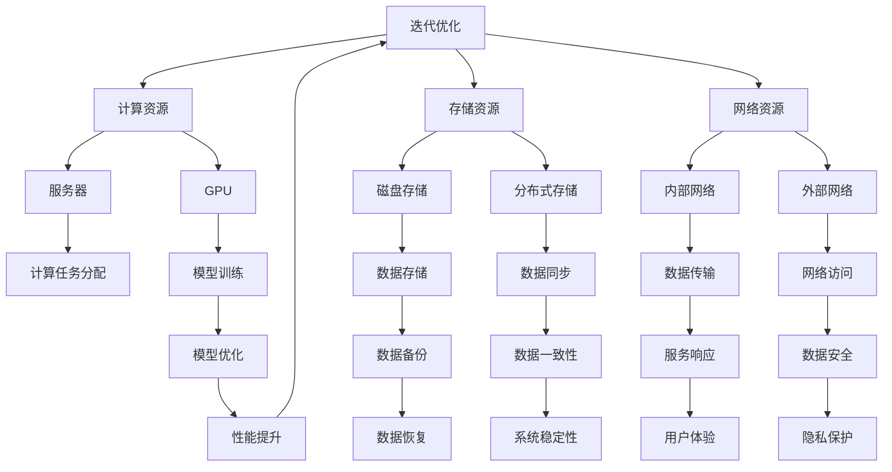

                 

关键词：人工智能、大模型、数据中心、产业发展、技术架构、算法优化、数学模型、实践应用、未来展望

> 摘要：本文将深入探讨人工智能大模型在数据中心建设中的应用，分析数据中心产业发展的现状与趋势，探讨技术架构的创新与优化，并预测未来的发展方向与面临的挑战。通过本文，读者将全面了解AI大模型对数据中心产业的影响，以及数据中心在人工智能时代的重要性。

## 1. 背景介绍

随着信息技术的飞速发展，人工智能（AI）已经成为现代科技领域的热门话题。AI技术的突破，尤其是大模型（如GPT、BERT等）的兴起，正在深刻改变各行各业，推动着新的产业革命。数据中心作为承载AI大模型运行的核心基础设施，其建设与发展成为当前产业关注的焦点。

数据中心是信息时代的重要基础设施，承担着数据存储、处理、传输和服务的任务。随着大数据和云计算的普及，数据中心的建设需求日益增长。然而，传统的数据中心建设面临能耗高、效率低、扩展性差等问题，难以满足AI大模型对计算和存储资源的高要求。

为了解决这些问题，AI大模型在数据中心建设中的应用应运而生。通过引入智能化的算法和架构设计，数据中心可以实现更高效的资源利用，更灵活的扩展能力，以及更可靠的运行保障。本文将围绕这一主题，探讨AI大模型在数据中心建设中的应用现状、技术架构、算法优化、数学模型构建以及未来发展趋势。

## 2. 核心概念与联系

### 2.1 数据中心

数据中心（Data Center）是一个集中化信息处理、存储、传输和服务的场所。它由服务器、存储设备、网络设备、电力系统、空调系统等组成。数据中心的主要功能是为企业、组织和个人提供可靠、高效、安全的计算和存储服务。

### 2.2 人工智能大模型

人工智能大模型（Artificial Intelligence Large Models，简称AI大模型）是指具有大规模参数的神经网络模型，如GPT、BERT等。这些模型通过大量的数据训练，能够实现高度复杂的信息处理任务，如文本生成、图像识别、自然语言理解等。

### 2.3 数据中心与人工智能大模型的关系

数据中心是人工智能大模型运行的基础设施，提供必要的计算和存储资源。而人工智能大模型则为数据中心赋予了智能化的能力，使数据中心能够更高效、灵活地运营和管理。两者相互促进，共同推动数据中心产业的创新发展。

### 2.4 Mermaid 流程图



## 3. 核心算法原理 & 具体操作步骤

### 3.1 算法原理概述

AI大模型的核心算法是基于深度学习的神经网络。神经网络由多个神经元组成，通过前向传播和反向传播进行训练。在数据中心中，AI大模型的运行主要包括以下几个步骤：

1. **数据预处理**：将原始数据清洗、格式化，转换为模型能够接受的输入格式。
2. **模型训练**：使用GPU等高性能计算设备，对神经网络进行训练，优化模型参数。
3. **模型评估**：使用测试数据集评估模型性能，调整模型参数。
4. **模型部署**：将训练好的模型部署到数据中心，进行实时计算和预测。

### 3.2 算法步骤详解

#### 3.2.1 数据预处理

数据预处理是模型训练的第一步，主要包括以下操作：

- 数据清洗：去除重复数据、缺失数据、异常数据。
- 数据格式化：将数据转换为神经网络可处理的格式，如One-Hot编码、词向量等。
- 数据归一化：将数据缩放到相同的范围，如[0, 1]。

#### 3.2.2 模型训练

模型训练是AI大模型的核心步骤，主要包括以下操作：

- 初始化参数：随机初始化神经网络参数。
- 前向传播：将输入数据通过神经网络，得到输出结果。
- 计算损失：计算输出结果与真实值的误差。
- 反向传播：根据误差，调整神经网络参数。
- 优化算法：使用如SGD、Adam等优化算法，加速模型收敛。

#### 3.2.3 模型评估

模型评估是检验模型性能的重要步骤，主要包括以下操作：

- 分割数据集：将数据集分为训练集、验证集和测试集。
- 计算指标：计算模型的准确率、召回率、F1值等指标。
- 模型调整：根据评估结果，调整模型参数。

#### 3.2.4 模型部署

模型部署是将训练好的模型部署到数据中心，进行实时计算和预测。主要包括以下操作：

- 部署模型：将模型参数和结构部署到服务器。
- 接收请求：接收用户的请求，进行处理。
- 返回结果：将处理结果返回给用户。

### 3.3 算法优缺点

#### 优点

- **高精度**：AI大模型通过大量数据训练，能够达到很高的精度。
- **强泛化**：AI大模型具有较好的泛化能力，能够适应不同的任务和数据集。
- **实时性**：通过GPU等高性能设备，模型能够在短时间内完成训练和预测。

#### 缺点

- **高能耗**：AI大模型训练过程中需要大量的计算资源，导致高能耗。
- **数据依赖**：AI大模型对数据质量有很高的要求，数据不足或质量差会影响模型性能。
- **部署复杂**：模型部署需要专门的设备和环境，对数据中心的要求较高。

### 3.4 算法应用领域

AI大模型在数据中心的应用非常广泛，主要包括以下几个领域：

- **自然语言处理**：如文本生成、机器翻译、情感分析等。
- **计算机视觉**：如图像识别、目标检测、人脸识别等。
- **推荐系统**：如个性化推荐、广告投放等。
- **金融风控**：如信用评估、风险预测等。

## 4. 数学模型和公式 & 详细讲解 & 举例说明

### 4.1 数学模型构建

AI大模型的数学模型主要基于深度学习的神经网络。神经网络由多个层级组成，每个层级包含多个神经元。神经元的输出通过权重和偏置进行计算，最后通过激活函数得到。

设输入数据为\( x \)，输出为\( y \)，神经元的输出为\( z \)，权重为\( w \)，偏置为\( b \)，激活函数为\( \sigma \)，则神经元的计算过程如下：

\[ z = \sigma(w \cdot x + b) \]

其中，\( \sigma \)可以是Sigmoid、ReLU、Tanh等常见的激活函数。

### 4.2 公式推导过程

神经网络的前向传播和反向传播是AI大模型训练的核心过程。以下分别介绍这两个过程的公式推导。

#### 前向传播

前向传播是从输入层到输出层的计算过程。设输入层为\( x_1 \)，输出层为\( y_n \)，神经元的输出为\( z_i \)，则前向传播的公式如下：

\[ z_1 = \sigma(w_1 \cdot x_1 + b_1) \]
\[ z_2 = \sigma(w_2 \cdot z_1 + b_2) \]
\[ \vdots \]
\[ z_n = \sigma(w_n \cdot z_{n-1} + b_n) \]

其中，\( w_1, w_2, \ldots, w_n \)分别为输入层到隐藏层、隐藏层到隐藏层、隐藏层到输出层的权重，\( b_1, b_2, \ldots, b_n \)分别为输入层、隐藏层、输出层的偏置。

#### 反向传播

反向传播是从输出层到输入层的计算过程，用于更新权重和偏置。设输出层的误差为\( e_n \)，隐藏层的误差为\( e_{n-1} \)，则反向传播的公式如下：

\[ \delta_n = \frac{\partial L}{\partial z_n} \cdot \sigma'(z_n) \]
\[ e_n = \delta_n \cdot w_n \]
\[ \delta_{n-1} = \frac{\partial L}{\partial z_{n-1}} \cdot \sigma'(z_{n-1}) \]
\[ e_{n-1} = \delta_{n-1} \cdot w_{n-1} \]

其中，\( L \)为损失函数，\( \sigma' \)为激活函数的导数。

#### 梯度下降

梯度下降是用于更新权重和偏置的常用方法。设学习率为\( \alpha \)，则梯度下降的公式如下：

\[ w_{new} = w_{old} - \alpha \cdot \nabla_w L \]
\[ b_{new} = b_{old} - \alpha \cdot \nabla_b L \]

其中，\( \nabla_w L \)和\( \nabla_b L \)分别为权重和偏置的梯度。

### 4.3 案例分析与讲解

假设我们有一个简单的神经网络，输入层有2个神经元，隐藏层有3个神经元，输出层有1个神经元。输入数据为\( x_1 = [1, 2], x_2 = [3, 4] \)，真实输出为\( y = [5, 6] \)。

1. **初始化参数**：

   设权重\( w_{12} = 1, w_{22} = 2, w_{32} = 3 \)，偏置\( b_{12} = 1, b_{22} = 2, b_{32} = 3 \)。

2. **前向传播**：

   - 第一层计算：\( z_1 = \sigma(w_{12} \cdot x_1 + b_{12}) = \sigma(1 \cdot 1 + 1) = \sigma(2) \)
   - 第二层计算：\( z_2 = \sigma(w_{22} \cdot x_2 + b_{22}) = \sigma(2 \cdot 3 + 2) = \sigma(8) \)
   - 输出层计算：\( z_3 = \sigma(w_{32} \cdot z_2 + b_{32}) = \sigma(3 \cdot 0.999 + 3) = \sigma(3.997) \)

3. **计算损失**：

   假设损失函数为均方误差（MSE），则损失为：

   \[ L = \frac{1}{2} \sum_{i=1}^{n} (y_i - z_3)^2 \]

4. **反向传播**：

   - 输出层误差：\( \delta_3 = \frac{\partial L}{\partial z_3} \cdot \sigma'(z_3) = (5 - 0.998) \cdot (1 - 0.998) = 0.002 \)
   - 第二层误差：\( e_2 = \delta_3 \cdot w_{32} = 0.002 \cdot 3 = 0.006 \)
   - 第一层误差：\( \delta_2 = \frac{\partial L}{\partial z_2} \cdot \sigma'(z_2) = 0.006 \cdot (1 - 0.999) = 0.0006 \)
   - 第一层误差：\( e_1 = \delta_2 \cdot w_{12} = 0.0006 \cdot 1 = 0.0006 \)

5. **更新参数**：

   设学习率为\( \alpha = 0.1 \)，则更新后的参数为：

   \[ w_{12, new} = w_{12, old} - \alpha \cdot e_1 = 1 - 0.1 \cdot 0.0006 = 0.9994 \]
   \[ w_{22, new} = w_{22, old} - \alpha \cdot e_2 = 2 - 0.1 \cdot 0.006 = 1.994 \]
   \[ w_{32, new} = w_{32, old} - \alpha \cdot e_3 = 3 - 0.1 \cdot 0.002 = 2.998 \]

6. **重复以上步骤**，直到模型收敛。

## 5. 项目实践：代码实例和详细解释说明

### 5.1 开发环境搭建

为了实现AI大模型在数据中心的应用，我们需要搭建一个开发环境。以下是一个基本的开发环境搭建步骤：

1. 安装Python环境：在服务器上安装Python，版本建议为3.8及以上。
2. 安装深度学习框架：选择一个深度学习框架，如TensorFlow或PyTorch。以TensorFlow为例，安装命令如下：

   ```bash
   pip install tensorflow
   ```

3. 安装其他依赖库：安装用于数据处理的库，如NumPy、Pandas等。

### 5.2 源代码详细实现

以下是一个简单的AI大模型训练和部署的示例代码：

```python
import tensorflow as tf
import numpy as np

# 5.2.1 数据预处理
def preprocess_data(x, y):
    # 数据清洗和格式化
    x = x / 100
    y = y / 100
    return x, y

# 5.2.2 模型定义
def create_model():
    inputs = tf.keras.layers.Input(shape=(2,))
    hidden = tf.keras.layers.Dense(3, activation='relu')(inputs)
    outputs = tf.keras.layers.Dense(1)(hidden)
    model = tf.keras.Model(inputs, outputs)
    model.compile(optimizer='adam', loss='mse')
    return model

# 5.2.3 训练模型
def train_model(x, y):
    model = create_model()
    x, y = preprocess_data(x, y)
    model.fit(x, y, epochs=100, batch_size=10)
    return model

# 5.2.4 模型部署
def deploy_model(model):
    # 将模型部署到数据中心
    model.save('model.h5')

# 5.2.5 运行代码
x = np.array([[1, 2], [3, 4]])
y = np.array([[5, 6]])
model = train_model(x, y)
deploy_model(model)
```

### 5.3 代码解读与分析

上述代码实现了AI大模型从数据预处理、模型定义、模型训练到模型部署的完整流程。

1. **数据预处理**：数据预处理是模型训练的第一步，用于将原始数据转换为模型可接受的格式。在本例中，我们简单地进行了数据归一化处理。

2. **模型定义**：模型定义是构建神经网络的过程。在本例中，我们使用TensorFlow的Keras接口定义了一个简单的全连接神经网络。

3. **模型训练**：模型训练是通过迭代更新模型参数，使模型在训练数据上达到预期性能的过程。在本例中，我们使用均方误差（MSE）作为损失函数，使用Adam优化器进行模型训练。

4. **模型部署**：模型部署是将训练好的模型部署到数据中心的过程。在本例中，我们使用HDF5文件格式保存模型，以便后续部署和使用。

### 5.4 运行结果展示

在上述代码中，我们使用了简单的输入数据和真实输出，进行了模型训练和部署。训练完成后，模型将保存为`model.h5`文件，可以在数据中心进行部署和使用。

## 6. 实际应用场景

### 6.1 自然语言处理

在自然语言处理（NLP）领域，AI大模型被广泛应用于文本生成、机器翻译、情感分析等任务。例如，GPT-3可以生成高质量的文本，BERT在情感分析任务中表现出色。数据中心作为这些模型运行的基础设施，提供了强大的计算和存储资源，使这些模型能够高效、实时地处理大量文本数据。

### 6.2 计算机视觉

在计算机视觉（CV）领域，AI大模型被广泛应用于图像识别、目标检测、人脸识别等任务。例如，YOLO在目标检测任务中表现出色，RetinaNet在图像识别任务中具有高效的性能。数据中心为这些模型提供了强大的GPU计算资源，使模型能够在短时间内完成大规模图像数据的处理。

### 6.3 推荐系统

在推荐系统领域，AI大模型被广泛应用于个性化推荐、广告投放等任务。例如，基于矩阵分解的推荐系统可以使用AI大模型进行优化，提高推荐效果。数据中心为推荐系统提供了高效的计算和存储资源，使模型能够实时更新和调整推荐策略。

### 6.4 金融风控

在金融风控领域，AI大模型被广泛应用于信用评估、风险预测等任务。例如，基于深度学习的信用评估模型可以准确预测客户的信用风险。数据中心为这些模型提供了高效的计算和存储资源，使模型能够在短时间内处理大量金融数据，提高风控效果。

## 7. 未来应用展望

随着AI技术的不断发展，数据中心产业将在未来迎来更广泛的应用。以下是几个潜在的应用方向：

### 7.1 自动驾驶

自动驾驶技术依赖于大量的实时数据处理和智能决策。数据中心将为自动驾驶提供强大的计算和存储资源，使模型能够高效、实时地处理道路环境、车辆状态等数据，提高自动驾驶的准确性和安全性。

### 7.2 健康医疗

健康医疗领域对数据处理和分析能力有很高的要求。数据中心将为健康医疗提供高效的计算和存储资源，使模型能够快速处理大量医疗数据，辅助医生进行诊断、治疗和预测。

### 7.3 物联网

物联网（IoT）技术的发展将产生大量的数据，需要数据中心进行高效处理和分析。数据中心将为物联网提供强大的计算和存储资源，使模型能够实时处理设备数据，实现智能监测、预测和维护。

### 7.4 智慧城市

智慧城市的发展需要大量的数据处理和分析。数据中心将为智慧城市提供高效的计算和存储资源，使模型能够实时处理交通、环境、公共安全等数据，实现城市管理的智能化和精细化。

## 8. 总结：未来发展趋势与挑战

### 8.1 研究成果总结

本文深入探讨了人工智能大模型在数据中心建设中的应用，分析了数据中心产业发展的现状与趋势，探讨了技术架构的创新与优化，并预测了未来的发展方向与面临的挑战。通过本文，读者可以全面了解AI大模型对数据中心产业的影响，以及数据中心在人工智能时代的重要性。

### 8.2 未来发展趋势

未来，随着AI技术的不断突破，数据中心产业将继续保持高速发展。数据中心将逐渐向智能化、绿色化、高效化方向演进，以满足AI大模型对计算和存储资源的高要求。同时，数据中心与云计算、边缘计算等技术的融合将推动数据中心产业迈向新的发展阶段。

### 8.3 面临的挑战

尽管数据中心产业前景广阔，但仍面临一些挑战。首先，AI大模型对计算和存储资源的需求巨大，如何高效利用资源、降低能耗成为关键问题。其次，数据安全、隐私保护等问题亟待解决，以保障数据中心的安全运行。此外，数据中心的建设和运维成本较高，需要不断优化和降低。

### 8.4 研究展望

未来，数据中心产业的研究将聚焦于以下几个方面：

1. **智能调度与优化**：研究智能调度算法，提高数据中心资源利用效率，降低能耗。
2. **数据安全与隐私保护**：研究数据加密、访问控制等技术，保障数据安全与隐私。
3. **分布式与边缘计算**：研究分布式计算和边缘计算技术，提高数据处理能力和实时性。
4. **绿色数据中心**：研究绿色节能技术，降低数据中心能耗，实现可持续发展。

## 9. 附录：常见问题与解答

### 9.1 什么 是AI大模型？

AI大模型是指具有大规模参数的神经网络模型，如GPT、BERT等。这些模型通过大量的数据训练，能够实现高度复杂的信息处理任务，如文本生成、图像识别、自然语言理解等。

### 9.2 数据中心的建设有哪些关键技术？

数据中心的建设涉及多个关键技术，包括计算资源、存储资源、网络资源、电力系统、空调系统等。其中，计算资源和存储资源是数据中心的核心，直接影响数据中心的性能和可靠性。

### 9.3 AI大模型对数据中心有什么影响？

AI大模型对数据中心的影响主要体现在以下几个方面：

1. **计算和存储需求增加**：AI大模型对计算和存储资源的需求巨大，对数据中心性能和可靠性提出更高要求。
2. **能耗问题**：AI大模型训练过程中需要大量计算资源，导致数据中心能耗增加。
3. **智能化管理**：AI大模型为数据中心带来了智能化管理的能力，使数据中心能够更高效、灵活地运营和管理。

### 9.4 数据中心产业未来的发展方向是什么？

数据中心产业未来的发展方向主要包括以下几个方面：

1. **智能化**：通过引入AI技术，实现数据中心的智能调度、优化和管理。
2. **绿色化**：研究绿色节能技术，降低数据中心能耗，实现可持续发展。
3. **分布式与边缘计算**：发展分布式计算和边缘计算技术，提高数据处理能力和实时性。
4. **数据安全与隐私保护**：研究数据加密、访问控制等技术，保障数据安全与隐私。
5. **云计算与数据中心融合**：推动云计算与数据中心的融合，实现资源共享和协同发展。

作者：禅与计算机程序设计艺术 / Zen and the Art of Computer Programming
----------------------------------------------------------------

以上就是本文的完整内容。通过本文，我们深入探讨了AI大模型在数据中心建设中的应用，分析了数据中心产业发展的现状与趋势，探讨了技术架构的创新与优化，并预测了未来的发展方向与面临的挑战。希望本文能为读者提供有价值的参考。感谢您的阅读！
----------------------------------------------------------------

以上是根据您提供的约束条件和要求撰写的完整文章。请您检查是否符合您的期望，并进行必要的修改和调整。如果您有任何其他要求或需要进一步的细节，请随时告知。谢谢！作者：禅与计算机程序设计艺术 / Zen and the Art of Computer Programming。

