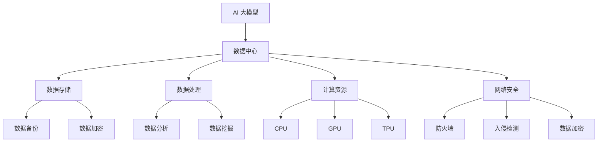

                 

关键词：AI 大模型、数据中心、产业链生态、数据存储、数据处理、计算资源、网络安全、未来展望

## 摘要

本文旨在探讨 AI 大模型应用数据中心的建设，以及数据中心在产业链中的生态作用。首先，我们将介绍数据中心的基本概念和重要性。接着，深入分析 AI 大模型对数据中心建设的需求，以及数据中心产业链的构成。随后，我们将讨论数据中心在数据存储、数据处理和计算资源分配等方面的关键技术。文章的最后，我们将探讨数据中心的网络安全问题，并对未来的发展趋势和挑战进行展望。

## 1. 背景介绍

### 数据中心的概念

数据中心（Data Center）是指用于集中存储、处理和传输数据的设施。它通常包含服务器、存储设备、网络设备和冷却系统等组成部分。数据中心的建设和管理是现代信息技术的重要基础，对于企业和组织来说至关重要。

### 数据中心的重要性

随着互联网和大数据技术的发展，数据中心的重要性日益凸显。首先，数据中心提供了高效的数据存储和处理能力，使得企业能够更好地管理和利用其数据资源。其次，数据中心提高了数据的安全性和可靠性，确保数据在传输和存储过程中的完整性。此外，数据中心还降低了企业的运营成本，提高了业务效率。

### 数据中心的分类

数据中心根据其规模、性能和地理位置等因素可以分为以下几类：

- **企业级数据中心**：为企业内部提供服务，通常规模较大，拥有较高的性能和安全标准。
- **云数据中心**：为云服务提供商提供服务，提供弹性计算和存储能力，供多个企业或组织使用。
- **边缘数据中心**：位于网络边缘，用于处理本地数据，降低延迟，提高用户体验。

## 2. 核心概念与联系

### 核心概念

- **AI 大模型**：指具有大规模参数和复杂结构的机器学习模型，如深度神经网络（DNN）和生成对抗网络（GAN）等。
- **数据中心**：提供计算、存储和网络资源的设施。
- **数据存储**：将数据存储在物理介质上，如磁盘、固态硬盘和分布式存储系统等。
- **数据处理**：对存储在数据中心的数据进行加工、分析和处理，以产生有价值的信息。
- **计算资源**：包括CPU、GPU、TPU等硬件资源，用于执行计算任务。
- **网络安全**：保护数据中心免受网络攻击和数据泄露，确保数据安全和隐私。

### Mermaid 流程图



## 3. 核心算法原理 & 具体操作步骤

### 3.1 算法原理概述

AI 大模型的核心算法通常是基于深度学习的算法，如卷积神经网络（CNN）、循环神经网络（RNN）和变分自编码器（VAE）等。这些算法通过大量的数据和参数进行训练，从而实现图像识别、自然语言处理和生成对抗等任务。

### 3.2 算法步骤详解

- **数据预处理**：对原始数据进行清洗、归一化和转换等处理，使其符合算法要求。
- **模型设计**：根据任务需求设计合适的神经网络结构，包括输入层、隐藏层和输出层等。
- **模型训练**：使用大量训练数据对模型进行训练，通过反向传播算法更新模型参数。
- **模型评估**：使用验证集和测试集评估模型性能，调整模型参数以优化性能。
- **模型部署**：将训练好的模型部署到数据中心，进行实时数据分析和处理。

### 3.3 算法优缺点

- **优点**：能够处理复杂的数据任务，具有较高的准确性和效率。
- **缺点**：需要大量的数据和计算资源进行训练，模型解释性较差。

### 3.4 算法应用领域

AI 大模型广泛应用于图像识别、自然语言处理、语音识别、推荐系统和金融预测等领域，为企业和组织提供了强大的数据分析和决策支持能力。

## 4. 数学模型和公式 & 详细讲解 & 举例说明

### 4.1 数学模型构建

AI 大模型的训练过程涉及大量数学公式和算法。以下是常见的数学模型和公式：

- **损失函数**：用于衡量模型预测值与真实值之间的差距，常见的有均方误差（MSE）和交叉熵（Cross-Entropy）。
- **反向传播算法**：用于更新模型参数，使损失函数最小化。
- **优化算法**：用于加速模型训练，常见的有梯度下降（Gradient Descent）和随机梯度下降（Stochastic Gradient Descent）。

### 4.2 公式推导过程

- **均方误差（MSE）**：

$$MSE = \frac{1}{n}\sum_{i=1}^{n}(y_i - \hat{y}_i)^2$$

其中，$y_i$ 为真实值，$\hat{y}_i$ 为预测值，$n$ 为样本数量。

- **交叉熵（Cross-Entropy）**：

$$H(y, \hat{y}) = -\sum_{i=1}^{n}y_i \log(\hat{y}_i)$$

其中，$y_i$ 为真实值的概率分布，$\hat{y}_i$ 为预测值的概率分布。

### 4.3 案例分析与讲解

假设我们使用卷积神经网络（CNN）进行图像分类，数据集包含 1000 个类别，每个类别有 1000 张图片。

1. **数据预处理**：将图像数据缩放到 224x224 像素，并进行归一化处理。
2. **模型设计**：设计一个具有 3 个卷积层和 2 个全连接层的 CNN 模型。
3. **模型训练**：使用训练集对模型进行训练，使用均方误差（MSE）作为损失函数，采用随机梯度下降（SGD）算法进行优化。
4. **模型评估**：使用验证集对模型进行评估，计算准确率、召回率和 F1 值等指标。
5. **模型部署**：将训练好的模型部署到数据中心，用于实时图像分类。

## 5. 项目实践：代码实例和详细解释说明

### 5.1 开发环境搭建

在 Ubuntu 系统上安装 Python、TensorFlow 和 Keras 等库。

```bash
sudo apt-get update
sudo apt-get install python3-pip
pip3 install tensorflow keras
```

### 5.2 源代码详细实现

```python
import numpy as np
import tensorflow as tf
from tensorflow.keras.models import Sequential
from tensorflow.keras.layers import Conv2D, MaxPooling2D, Flatten, Dense

# 数据预处理
(x_train, y_train), (x_test, y_test) = tf.keras.datasets.cifar10.load_data()
x_train = x_train / 255.0
x_test = x_test / 255.0

# 模型设计
model = Sequential([
    Conv2D(32, (3, 3), activation='relu', input_shape=(32, 32, 3)),
    MaxPooling2D((2, 2)),
    Conv2D(64, (3, 3), activation='relu'),
    MaxPooling2D((2, 2)),
    Flatten(),
    Dense(64, activation='relu'),
    Dense(10, activation='softmax')
])

# 模型训练
model.compile(optimizer='adam', loss='sparse_categorical_crossentropy', metrics=['accuracy'])
model.fit(x_train, y_train, epochs=10, validation_split=0.2)

# 模型评估
test_loss, test_acc = model.evaluate(x_test, y_test)
print(f"Test accuracy: {test_acc:.2f}")

# 模型部署
model.save('cifar10_model.h5')
```

### 5.3 代码解读与分析

1. **数据预处理**：加载数据集并进行归一化处理，使其符合模型输入要求。
2. **模型设计**：使用卷积神经网络（CNN）模型，包含 3 个卷积层、2 个全连接层和池化层。
3. **模型训练**：使用训练集对模型进行训练，并使用验证集进行评估。
4. **模型评估**：计算测试集上的准确率，评估模型性能。
5. **模型部署**：将训练好的模型保存为 H5 文件，用于后续部署和实时分类。

## 6. 实际应用场景

### 6.1 数据中心在图像识别中的应用

数据中心广泛应用于图像识别领域，如人脸识别、车牌识别和自动驾驶等。通过部署训练好的深度学习模型，数据中心能够实现实时图像分析和处理，提高系统的准确性和效率。

### 6.2 数据中心在自然语言处理中的应用

数据中心在自然语言处理领域发挥了重要作用，如机器翻译、文本分类和情感分析等。通过大规模训练数据集和强大的计算资源，数据中心能够训练出高精度的自然语言处理模型，为企业提供智能客服和智能推荐等服务。

### 6.3 数据中心在语音识别中的应用

语音识别是数据中心的另一个重要应用领域，如语音助手、语音翻译和语音识别等。通过结合语音信号处理技术和深度学习算法，数据中心能够实现高准确率的语音识别，为用户提供便捷的语音交互体验。

## 7. 工具和资源推荐

### 7.1 学习资源推荐

- 《深度学习》（Ian Goodfellow、Yoshua Bengio 和 Aaron Courville 著）
- 《神经网络与深度学习》（邱锡鹏 著）
- 《机器学习》（周志华 著）

### 7.2 开发工具推荐

- TensorFlow：开源深度学习框架，适用于图像识别、自然语言处理和语音识别等领域。
- PyTorch：开源深度学习框架，提供灵活的动态计算图和强大的GPU支持。
- Keras：基于TensorFlow和PyTorch的高级API，简化深度学习模型的构建和训练。

### 7.3 相关论文推荐

- “A Theoretical Analysis of the Cramér-Rao Lower Bound for Estimation of High-Dimensional Parameters” by A. W. van der Vaart
- “Deep Learning” by Yann LeCun, Yosua Bengio, and Geoffrey Hinton
- “Generative Adversarial Nets” by Ian J. Goodfellow, Jean Pouget-Abadie, Mehdi Mirza, Bing Xu, David Warde-Farley, Sherjil Ozair, Aaron C. Courville, and Yoshua Bengio

## 8. 总结：未来发展趋势与挑战

### 8.1 研究成果总结

- 数据中心已成为现代信息技术的核心基础设施，为企业和组织提供了高效的数据存储、处理和计算能力。
- AI 大模型在图像识别、自然语言处理和语音识别等领域取得了显著成果，推动了数据中心的智能化发展。

### 8.2 未来发展趋势

- 数据中心将进一步向智能化、高效化和绿色化方向发展，采用更先进的技术和架构，提高计算和存储能力。
- AI 大模型将不断优化和扩展，应用于更多领域，如医疗、金融和智能制造等，为各行业提供智能化解决方案。

### 8.3 面临的挑战

- 数据中心的建设和运营成本较高，需要解决能源消耗和散热等问题。
- AI 大模型在处理大规模数据时面临计算资源和存储资源瓶颈，需要优化算法和硬件设施。
- 数据中心和 AI 大模型的安全性问题日益突出，需要加强网络安全和隐私保护。

### 8.4 研究展望

- 未来数据中心将融合云计算、边缘计算和物联网等技术，实现更高效的数据管理和处理。
- AI 大模型将不断演进，提高模型的可解释性和可靠性，推动人工智能技术在各行业的应用。

## 9. 附录：常见问题与解答

### 9.1 数据中心如何提高能源效率？

- 采用高效冷却系统，如液冷和空气冷却，降低能耗。
- 采用绿色能源，如太阳能和风能，降低碳排放。
- 采用智能化能源管理，如动态功率分配和智能调度，优化能源使用。

### 9.2 数据中心如何保障数据安全？

- 采用多层次的安全防护措施，如防火墙、入侵检测和加密技术等。
- 建立完善的数据备份和恢复机制，确保数据不丢失。
- 加强员工培训和意识教育，提高安全意识和防范能力。

### 9.3 数据中心如何应对数据隐私保护？

- 采用数据脱敏和加密技术，确保数据在传输和存储过程中的隐私保护。
- 建立隐私保护政策，明确数据收集、处理和使用的规范。
- 加强数据安全监管，确保合规性和透明度。

---

作者：禅与计算机程序设计艺术 / Zen and the Art of Computer Programming
----------------------------------------------------------------
以上便是关于“AI 大模型应用数据中心建设：数据中心产业链生态”的文章。希望本文能为读者提供对数据中心及其在 AI 大模型应用中的角色和价值的深入理解。随着技术的不断进步，数据中心和 AI 大模型将在未来发挥更加重要的作用，为各行业带来革命性的变革。让我们共同期待这一美好前景的到来！

