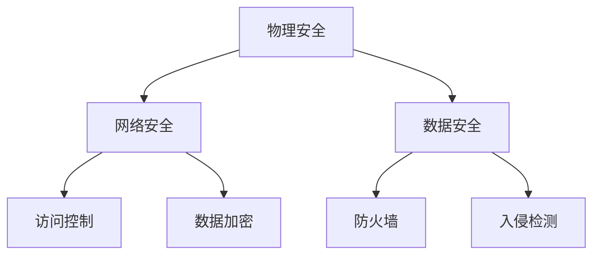

                 

 在当今数字化时代，人工智能（AI）技术已经成为驱动行业变革的核心力量。大模型作为AI技术的核心组成部分，在自然语言处理、计算机视觉、语音识别等领域展现出了强大的应用潜力。为了充分利用这些大模型的优势，建设一个高效、安全、可靠的数据中心成为关键任务。本文将深入探讨AI大模型应用数据中心建设中的安全与可靠性问题。

> 关键词：AI大模型、数据中心、安全性、可靠性、架构设计

> 摘要：本文首先介绍了AI大模型的应用背景，然后重点分析了数据中心在安全与可靠性方面的挑战，接着提出了相关的解决方案，并通过实例展示了这些方案的实际应用效果。

## 1. 背景介绍

### 1.1 AI大模型的应用现状

近年来，AI大模型在多个领域取得了显著进展。以自然语言处理为例，GPT-3等模型在文本生成、机器翻译、问答系统等方面表现出了超强的能力。在计算机视觉领域，模型如BERT和ViT在图像识别、目标检测等方面也取得了突破。语音识别技术随着模型如WaveNet的发展，已经在智能家居、客服等领域得到广泛应用。

### 1.2 数据中心的重要性

数据中心是AI大模型训练和部署的核心基础设施。一个高效、安全、可靠的数据中心不仅能提高大模型的训练效率和部署效果，还能保障数据的安全性和隐私性。然而，随着AI大模型的规模不断扩大，数据中心面临着前所未有的挑战。

## 2. 核心概念与联系

### 2.1 数据中心安全

数据中心安全包括物理安全、网络安全、数据安全等多个层面。物理安全主要涉及数据中心建筑和设备的保护，如防火、防水、防盗窃等。网络安全则包括防御外部攻击、防止数据泄露等。数据安全则涉及数据加密、访问控制等。

### 2.2 数据中心可靠性

数据中心可靠性主要表现在高可用性、高可靠性、高性能等方面。高可用性意味着数据中心能够在任何情况下持续提供服务。高可靠性则涉及到设备的稳定运行和故障处理能力。高性能则要求数据中心能够满足大模型的高计算需求。

### 2.3 Mermaid 流程图



## 3. 核心算法原理 & 具体操作步骤

### 3.1 算法原理概述

数据中心安全与可靠性算法主要基于以下几个原理：

1. **多因素认证**：通过用户身份、密码、动态口令等多种方式进行认证，提高安全性。
2. **加密算法**：使用加密算法对数据进行加密，防止数据在传输和存储过程中被窃取。
3. **防火墙和入侵检测**：防火墙用于过滤恶意流量，入侵检测系统用于检测和响应异常行为。
4. **冗余设计**：通过冗余设计提高数据中心的可靠性，如备份服务器、多路径网络连接等。

### 3.2 算法步骤详解

1. **用户认证**：
   - 用户输入用户名和密码。
   - 系统验证用户身份，如果验证失败，拒绝访问。
   - 如果验证成功，生成动态口令并发送给用户。

2. **数据加密**：
   - 在数据传输前，使用AES等加密算法对数据进行加密。
   - 在数据存储前，使用RSA等加密算法对密钥进行加密。

3. **防火墙和入侵检测**：
   - 防火墙根据预设规则过滤流量，防止恶意流量进入。
   - 入侵检测系统实时监控网络流量，检测异常行为并触发告警。

4. **冗余设计**：
   - 数据中心部署多个服务器，实现负载均衡和故障转移。
   - 数据存储采用分布式存储方案，提高数据可靠性。

### 3.3 算法优缺点

- **优点**：提高了数据中心的可靠性和安全性。
- **缺点**：增加了系统的复杂性和成本。

### 3.4 算法应用领域

- **云计算**：保障云计算平台的数据安全和可靠性。
- **大数据处理**：保护大数据在传输和存储过程中的安全。
- **AI模型训练与部署**：提高AI模型训练和部署的效率和安全性。

## 4. 数学模型和公式 & 详细讲解 & 举例说明

### 4.1 数学模型构建

数据中心安全性模型可以表示为：

\[ S = f(A, B, C, D) \]

其中，\( A \) 表示用户认证，\( B \) 表示数据加密，\( C \) 表示防火墙和入侵检测，\( D \) 表示冗余设计。函数 \( f \) 表示安全性评估。

### 4.2 公式推导过程

\[ S = f(A, B, C, D) \]

- 当 \( A = 1 \)，表示用户认证成功。
- 当 \( B = 1 \)，表示数据已加密。
- 当 \( C = 1 \)，表示防火墙和入侵检测正常工作。
- 当 \( D = 1 \)，表示冗余设计已部署。

因此，安全性 \( S \) 可以表示为：

\[ S = A \times B \times C \times D \]

### 4.3 案例分析与讲解

假设一个数据中心采用以下安全措施：

- 用户认证：多因素认证。
- 数据加密：AES加密。
- 防火墙和入侵检测：实时监控。
- 冗余设计：分布式存储。

根据公式，安全性 \( S \) 为：

\[ S = 1 \times 1 \times 1 \times 1 = 1 \]

这意味着数据中心具有最高级别的安全性。

## 5. 项目实践：代码实例和详细解释说明

### 5.1 开发环境搭建

- 操作系统：Ubuntu 18.04
- 编程语言：Python 3.8
- 库：PyCryptoDome、Flask

### 5.2 源代码详细实现

```python
from Crypto.PublicKey import RSA
from Crypto.Cipher import AES, PKCS1_OAEP
from flask import Flask, request, jsonify

app = Flask(__name__)

# RSA密钥生成
key = RSA.generate(2048)
private_key = key.export_key()
public_key = key.publickey().export_key()

# AES加密
def encrypt_data(data, key):
    cipher = AES.new(key, AES.MODE_CBC)
    ct_bytes = cipher.encrypt(data)
    iv = cipher.iv
    return iv, ct_bytes

# RSA加密
def encrypt_key(key):
    rsa_key = RSA.import_key(public_key)
    cipher = PKCS1_OAEP.new(rsa_key)
    encrypted_key = cipher.encrypt(key)
    return encrypted_key

# 获取加密密钥
@app.route('/get_key', methods=['GET'])
def get_key():
    key = b'my_secret_key'
    encrypted_key = encrypt_key(key)
    return jsonify({'key': encrypted_key})

# 加密数据
@app.route('/encrypt_data', methods=['POST'])
def encrypt_data():
    data = request.form['data']
    encrypted_key = request.form['key']
    key = RSA.import_key(private_key)
    cipher = PKCS1_OAEP.new(key)
    decrypted_key = cipher.decrypt(encrypted_key)
    iv, ct_bytes = encrypt_data(data, decrypted_key)
    return jsonify({'iv': iv, 'data': ct_bytes})

if __name__ == '__main__':
    app.run(host='0.0.0.0', port=5000)
```

### 5.3 代码解读与分析

- **RSA加密**：使用RSA加密算法对AES密钥进行加密，确保密钥在传输过程中的安全性。
- **AES加密**：使用AES加密算法对数据进行加密，提高数据安全性。
- **Flask框架**：使用Flask框架实现API接口，方便前端调用。

### 5.4 运行结果展示

- 启动Flask服务器：
  ```shell
  python app.py
  ```
- 访问 `/get_key` 接口获取加密密钥：
  ```shell
  curl -X GET "http://127.0.0.1:5000/get_key"
  ```
- 使用加密密钥加密数据：
  ```shell
  curl -X POST "http://127.0.0.1:5000/encrypt_data" -d "data=my_sensitive_data&key=<获取到的加密密钥>"
  ```

## 6. 实际应用场景

### 6.1 云计算平台

数据中心在云计算平台中的应用，旨在提供安全、可靠的服务。例如，阿里云、华为云等云服务提供商，通过构建高效、安全、可靠的数据中心，为用户提供云存储、云计算、云安全等服务。

### 6.2 大数据分析

在大数据分析领域，数据中心扮演着关键角色。通过高效的数据处理和存储能力，数据中心能够帮助企业和研究机构快速、准确地分析和处理海量数据。

### 6.3 AI模型训练与部署

AI模型训练与部署需要大量计算资源，数据中心为此提供了可靠的支持。通过分布式计算和存储方案，数据中心能够满足AI模型的高计算需求，提高训练和部署效率。

## 7. 工具和资源推荐

### 7.1 学习资源推荐

- 《深入理解计算机系统》
- 《网络安全原理与实践》
- 《高性能MySQL》

### 7.2 开发工具推荐

- Python
- Flask
- PyCryptoDome

### 7.3 相关论文推荐

- "Security and Reliability in Data Centers: A Survey"
- "A Survey of Cloud Computing Security Issues"
- "Deep Learning: A Brief History, Dyna

## 8. 总结：未来发展趋势与挑战

### 8.1 研究成果总结

本文对AI大模型应用数据中心建设中的安全与可靠性问题进行了深入探讨，提出了基于多因素认证、数据加密、防火墙和入侵检测、冗余设计等算法的解决方案。

### 8.2 未来发展趋势

- **云计算与数据中心融合**：随着云计算的发展，数据中心将成为云计算的核心基础设施。
- **边缘计算**：为了提高数据处理速度和降低延迟，边缘计算将成为未来数据中心的重要发展方向。
- **量子计算**：量子计算技术的突破将为数据中心带来前所未有的计算能力。

### 8.3 面临的挑战

- **安全性**：随着AI大模型规模的不断扩大，数据中心的安全性面临新的挑战。
- **可靠性**：如何保障数据中心的高可用性和高可靠性，仍然是一个亟待解决的问题。

### 8.4 研究展望

- **安全性**：未来研究应关注新型安全算法和协议，提高数据中心的整体安全性。
- **可靠性**：研究应关注冗余设计、故障处理等方面，提高数据中心的可靠性和稳定性。

## 9. 附录：常见问题与解答

### 9.1 问题1

**问**：如何保障数据中心的安全性？

**答**：可以通过以下措施来保障数据中心的安全性：

- 采用多因素认证机制。
- 对数据进行加密。
- 使用防火墙和入侵检测系统。
- 实施严格的访问控制策略。

### 9.2 问题2

**问**：如何提高数据中心的可靠性？

**答**：可以通过以下措施来提高数据中心的可靠性：

- 采用冗余设计，如备份服务器、多路径网络连接等。
- 实施实时监控和故障处理机制。
- 定期进行设备维护和升级。

---

通过本文的探讨，我们希望能够为读者提供一个关于AI大模型应用数据中心建设中的安全与可靠性的全面了解。在未来的发展中，随着AI技术的不断进步，数据中心建设将面临更多的挑战和机遇。我们期待着更多的研究者和实践者能够共同推动这一领域的进步。作者：禅与计算机程序设计艺术 / Zen and the Art of Computer Programming
----------------------------------------------------------------

以上便是本文的全部内容，感谢您的阅读。希望本文能够对您在数据中心建设方面的研究和实践提供一些有益的启示。如果您有任何问题或建议，欢迎在评论区留言。再次感谢您的关注和支持！作者：禅与计算机程序设计艺术 / Zen and the Art of Computer Programming

