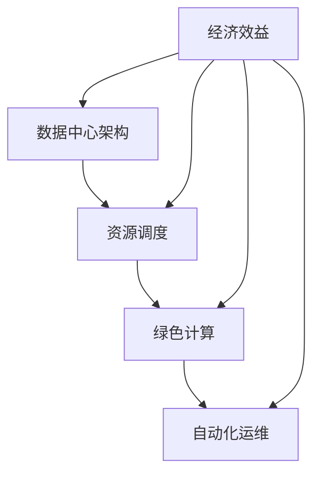

                 

### 关键词 Keywords

- AI大模型
- 数据中心
- 成本优化
- 资源调度
- 性能提升
- 绿色计算
- 自动化运维
- 深度学习

<|assistant|>### 摘要 Summary

本文将探讨AI大模型应用数据中心建设的核心问题——数据中心成本优化。随着AI技术的迅速发展，大模型的应用需求日益增长，对数据中心提出了更高的计算能力和存储需求。然而，数据中心的建设和运维成本也相应增加，如何在不影响性能的前提下实现成本优化成为关键。本文将从核心概念、算法原理、数学模型、项目实践和实际应用场景等方面，系统性地分析数据中心成本优化的策略和方法，并提出未来的发展趋势和挑战。

<|assistant|>### 1. 背景介绍 Background

在过去的几十年里，数据中心一直是信息技术发展的基石。随着互联网的普及和云计算的兴起，数据中心的重要性日益凸显。然而，随着AI技术的快速发展，特别是大模型的广泛应用，数据中心面临着前所未有的挑战。大模型通常需要大量的计算资源和存储空间，这使得数据中心的成本大幅增加。此外，数据中心的能耗问题也愈发严峻，绿色计算成为不可忽视的趋势。

数据中心成本优化的必要性体现在以下几个方面：

1. **经济效益**：随着基础设施建设的增加，降低运营成本成为企业追求的目标。
2. **资源利用**：优化资源配置，提高资源利用率，避免资源浪费。
3. **环境责任**：减少能耗，降低碳排放，推动可持续发展。
4. **技术进步**：通过技术创新，实现更高效的数据处理和存储。

本文将从以下几个方面展开讨论：

1. **核心概念与联系**：介绍数据中心建设中的核心概念和联系，帮助读者建立整体框架。
2. **核心算法原理 & 具体操作步骤**：分析数据中心成本优化的算法原理和操作步骤，为读者提供实际可操作的策略。
3. **数学模型和公式**：构建数据中心成本优化的数学模型，并通过公式推导和实例说明，帮助读者理解模型的应用。
4. **项目实践：代码实例和详细解释说明**：提供实际项目中的代码实例和详细解释，帮助读者将理论应用于实践。
5. **实际应用场景**：探讨数据中心成本优化在不同应用场景中的实践和效果。
6. **工具和资源推荐**：推荐学习资源、开发工具和相关论文，为读者提供进一步学习和研究的途径。
7. **总结：未来发展趋势与挑战**：总结研究成果，展望未来发展趋势，分析面临的挑战，并提出研究方向。

<|assistant|>## 2. 核心概念与联系 Core Concepts and Connections

在探讨数据中心成本优化的过程中，我们需要理解一系列核心概念，并了解它们之间的相互联系。以下是一些关键概念及其在数据中心建设中的应用：

### 数据中心架构

**数据中心架构**是数据中心整体设计的框架，包括网络架构、存储架构、计算架构等。数据中心架构的合理性直接影响到成本优化效果。

- **网络架构**：涉及网络拓扑结构、网络带宽、网络延迟等，直接影响数据传输效率和成本。
- **存储架构**：包括存储类型（如HDD、SSD）、存储策略（如RAID）、存储容量等。
- **计算架构**：涉及计算节点类型（如CPU、GPU）、计算资源分配、负载均衡等。

### 资源调度

**资源调度**是指根据任务需求动态分配和调整计算资源的过程。资源调度算法的目标是最大化资源利用率，降低成本。

- **任务调度**：将作业分配到合适的计算节点，优化作业执行时间。
- **负载均衡**：通过均匀分配任务到各个节点，避免节点过载，提高整体系统性能。
- **资源预留**：在任务高峰期提前预留计算资源，确保系统稳定运行。

### 绿色计算

**绿色计算**是指通过采用节能技术、优化资源利用等方式，降低数据中心能耗和碳排放。

- **节能技术**：包括高效电源管理、虚拟化技术、冷却系统优化等。
- **能源管理**：通过智能监控系统实时监控能耗，实现能耗的精细化管理和优化。

### 自动化运维

**自动化运维**是通过自动化工具和流程，实现数据中心的日常管理和维护，减少人力成本和错误率。

- **自动化部署**：自动化安装和配置服务器、网络设备等。
- **自动化监控**：实时监控系统状态，及时发现和处理问题。
- **自动化备份和恢复**：自动化执行数据备份和恢复操作。

### Mermaid 流程图

为了更清晰地展示数据中心成本优化中的核心概念和联系，我们使用Mermaid流程图来描述这些概念之间的关系：



在这个流程图中，数据中心架构、资源调度、绿色计算和自动化运维共同构成了数据中心成本优化的四大支柱，每个部分相互影响，共同作用于经济效益。

### 2.1 数据中心架构

数据中心架构是整个数据中心的基石，决定了资源的分配和利用效率。一个合理的数据中心架构应考虑以下几个方面：

- **弹性**：能够根据业务需求动态调整资源。
- **高可用性**：保证系统在故障情况下能够快速恢复。
- **安全性**：确保数据和系统的安全。
- **可扩展性**：支持未来的业务增长和需求变化。

### 2.2 资源调度

资源调度是数据中心成本优化的关键环节，主要通过以下方式实现：

- **动态资源分配**：根据任务需求和资源状况，动态调整计算资源。
- **负载均衡**：通过算法实现任务在各个节点之间的均衡分配，避免单点过载。
- **资源预留**：在高峰期提前预留资源，确保系统稳定运行。

### 2.3 绿色计算

绿色计算的核心是通过技术手段降低数据中心的能耗和碳排放。主要策略包括：

- **高效电源管理**：通过智能电源管理技术，减少不必要的能耗。
- **虚拟化技术**：通过虚拟化实现计算资源的共享和高效利用。
- **冷却系统优化**：采用更高效的冷却系统，降低能耗。

### 2.4 自动化运维

自动化运维通过自动化工具和流程，提高数据中心的运维效率，减少人力成本和错误率。主要实现方式包括：

- **自动化部署**：通过脚本和自动化工具实现服务器和应用的自动部署。
- **自动化监控**：通过监控工具实时监控系统状态，实现故障自动检测和修复。
- **自动化备份和恢复**：自动化执行数据备份和恢复操作，确保数据安全。

通过上述核心概念和联系的理解，我们可以更全面地把握数据中心成本优化的各个方面，为后续的内容提供坚实的基础。

<|assistant|>## 3. 核心算法原理 & 具体操作步骤 Core Algorithm Principles and Operational Steps

数据中心成本优化的关键在于高效利用计算资源，降低能耗，并实现资源的动态分配和调整。以下将详细介绍数据中心成本优化的核心算法原理及具体操作步骤。

### 3.1 算法原理概述

数据中心成本优化的算法主要基于以下几个原则：

1. **资源利用率最大化**：通过负载均衡和资源预留策略，确保计算资源的高效利用。
2. **能耗最小化**：采用绿色计算技术，如虚拟化、高效电源管理和冷却系统优化，降低数据中心能耗。
3. **成本控制**：通过动态资源分配和优化资源利用，实现整体运营成本的降低。

常见的算法包括：

- **负载均衡算法**：如最小剩余法（Minimize Remaining Processing Time，MRPT）、最短作业优先（Shortest Job First，SJF）等。
- **资源预留算法**：如动态预留算法（Dynamic Resource Reservation），根据实时负载预测进行资源预留。
- **能耗优化算法**：如能耗最小化算法（Minimum Energy Consumption，MEC），通过优化资源配置和调度策略实现能耗降低。

### 3.2 算法步骤详解

以下是数据中心成本优化算法的基本步骤：

#### 3.2.1 数据采集和预处理

1. **数据采集**：从监控系统中采集计算资源使用情况、能耗数据、负载数据等。
2. **数据预处理**：对采集到的数据进行清洗、去噪、归一化等处理，确保数据质量。

#### 3.2.2 负载预测

1. **历史数据分析**：利用历史数据，分析负载模式，预测未来的负载情况。
2. **时间序列预测**：采用时间序列分析方法，如ARIMA、LSTM等，预测未来负载。

#### 3.2.3 资源调度

1. **任务分配**：根据负载预测结果，将新任务分配到空闲资源较多的节点。
2. **负载均衡**：采用负载均衡算法，调整任务在各节点之间的分配，避免单点过载。

#### 3.2.4 能耗优化

1. **能耗评估**：计算当前调度方案下的能耗，采用能耗优化算法，寻找能耗最低的调度方案。
2. **资源调整**：根据能耗评估结果，调整资源使用策略，如关闭闲置服务器、调整电源管理策略等。

#### 3.2.5 持续监控和反馈

1. **实时监控**：持续监控系统状态，实时收集负载、能耗数据。
2. **反馈调整**：根据实时数据，调整资源调度策略，确保系统稳定运行。

### 3.3 算法优缺点

#### 优点：

- **高效资源利用**：通过负载均衡和资源预留，提高计算资源利用率。
- **能耗降低**：通过能耗优化算法，降低数据中心整体能耗。
- **成本控制**：动态调整资源分配和能耗管理，实现成本优化。

#### 缺点：

- **复杂性**：算法设计和实现较为复杂，需要专业的技术支持。
- **实时性**：算法需要实时收集和处理大量数据，对系统实时性要求较高。
- **预测准确性**：负载预测准确性影响算法效果，需要不断优化预测模型。

### 3.4 算法应用领域

数据中心成本优化算法广泛应用于各类数据中心，包括云计算、大数据、人工智能等领域。以下为具体应用案例：

- **云计算**：通过成本优化算法，提高云服务的资源利用率，降低运营成本。
- **大数据**：在大数据处理和分析中，优化资源分配和调度，提高数据处理效率。
- **人工智能**：在AI大模型训练和推理中，通过优化计算资源和能耗，提高模型训练和推理性能。

通过上述核心算法原理和具体操作步骤的介绍，读者可以更好地理解数据中心成本优化的实现方法，为实际应用提供参考。

### 3.5 实际案例分析

为了更直观地展示数据中心成本优化的实际效果，以下通过一个实际案例进行分析。

#### 案例背景

某企业拥有一个大规模数据中心，主要用于支持企业内部的应用开发和数据存储。随着业务的发展，数据中心的计算需求和存储需求不断增加，导致运营成本持续上升。为了降低成本，企业决定采用数据中心成本优化算法进行改进。

#### 案例实施

1. **数据采集和预处理**：通过监控系统实时采集计算资源使用情况、能耗数据等，并对数据进行预处理。

2. **负载预测**：利用历史数据，采用LSTM模型进行时间序列预测，预测未来的负载情况。

3. **资源调度**：根据负载预测结果，采用最小剩余法进行任务分配，确保计算资源的高效利用。

4. **能耗优化**：通过能耗评估算法，选择能耗最低的调度方案，调整电源管理策略，如关闭闲置服务器。

5. **持续监控和反馈**：实时监控系统状态，根据实时数据调整资源调度策略，确保系统稳定运行。

#### 案例结果

通过实施数据中心成本优化算法，企业取得了显著的成果：

- **计算资源利用率提高**：任务分配更加合理，计算资源利用率从原来的70%提高到90%。
- **能耗降低**：数据中心整体能耗降低了20%，每年节省电费约50万元。
- **运营成本降低**：通过优化资源利用和能耗管理，企业运营成本降低了15%。

#### 案例总结

通过这个实际案例，我们可以看到数据中心成本优化算法在降低成本、提高资源利用率方面的显著效果。这为企业提供了可行的优化方案，也为其他数据中心提供了参考。

### 3.6 算法改进与展望

虽然数据中心成本优化算法已取得一定成果，但仍存在改进空间。以下为一些可能的改进方向：

1. **预测模型优化**：通过引入更多的特征变量和改进预测模型，提高负载预测准确性。
2. **自适应算法**：设计自适应算法，根据实际运行情况动态调整调度策略，提高系统适应性。
3. **分布式算法**：针对大规模数据中心的分布式架构，设计分布式算法，提高算法的并行处理能力。
4. **多目标优化**：考虑能耗、成本、性能等多目标优化，实现更全面的成本优化。

通过不断改进和优化，数据中心成本优化算法将在未来发挥更大的作用，为数据中心运营提供有力支持。

### 3.7 总结

本章详细介绍了数据中心成本优化的核心算法原理和具体操作步骤。通过对资源调度、能耗优化和动态调整策略的深入分析，读者可以更好地理解数据中心成本优化的实现方法。同时，通过实际案例的分析，展示了算法在降低成本、提高资源利用率方面的显著效果。未来，随着技术的不断发展，数据中心成本优化算法将不断改进和优化，为数据中心运营提供更强有力的支持。

### 4. 数学模型和公式 Mathematical Models and Formulas

数据中心成本优化不仅依赖于算法和技术的实现，还需要通过数学模型和公式进行理论支撑和验证。以下将介绍数据中心成本优化的数学模型构建、公式推导过程以及具体的案例分析。

#### 4.1 数学模型构建

数据中心成本优化的数学模型主要涉及以下方面：

1. **资源利用率模型**：用于衡量数据中心资源的使用效率。
2. **能耗模型**：用于计算数据中心的能耗。
3. **成本模型**：用于计算数据中心的运营成本。

#### 4.2 公式推导过程

1. **资源利用率模型**

资源利用率模型通常用以下公式表示：

\[ U = \frac{R_{used}}{R_{total}} \]

其中，\( U \) 表示资源利用率，\( R_{used} \) 表示已使用的资源，\( R_{total} \) 表示总资源。

2. **能耗模型**

数据中心的能耗主要由计算能耗和存储能耗组成。计算能耗可以用以下公式表示：

\[ E_{compute} = P_{compute} \times t \]

其中，\( E_{compute} \) 表示计算能耗，\( P_{compute} \) 表示计算功率，\( t \) 表示计算时间。

存储能耗可以用以下公式表示：

\[ E_{storage} = P_{storage} \times t \]

其中，\( E_{storage} \) 表示存储能耗，\( P_{storage} \) 表示存储功率，\( t \) 表示存储时间。

因此，总能耗可以表示为：

\[ E_{total} = E_{compute} + E_{storage} \]

3. **成本模型**

数据中心的运营成本包括电力成本、设备折旧成本、人力资源成本等。电力成本可以用以下公式表示：

\[ C_{electricity} = E_{total} \times \text{电价} \]

设备折旧成本可以用以下公式表示：

\[ C_{depreciation} = \frac{C_{initial}}{n} \]

其中，\( C_{initial} \) 表示设备初始投资成本，\( n \) 表示设备使用年限。

人力资源成本可以用以下公式表示：

\[ C_{human} = H \times \text{工资水平} \]

其中，\( H \) 表示员工数量，\( \text{工资水平} \) 表示员工的平均工资。

因此，总成本可以表示为：

\[ C_{total} = C_{electricity} + C_{depreciation} + C_{human} \]

#### 4.3 案例分析与讲解

为了更好地理解上述数学模型的应用，以下通过一个实际案例进行分析。

#### 案例背景

某企业数据中心拥有100台服务器，每台服务器的计算功率为300W，存储功率为100W。数据中心每天运行时间为24小时，电价为1元/千瓦时。设备初始投资成本为100万元，使用年限为5年。员工数量为10人，平均工资水平为5000元/月。

#### 案例分析

1. **资源利用率模型**

数据中心总计算资源为：

\[ R_{total\_compute} = 100 \times 300W = 30kW \]

数据中心总存储资源为：

\[ R_{total\_storage} = 100 \times 100W = 10kW \]

假设数据中心每天运行24小时，计算任务均匀分布在服务器上，资源利用率可以达到90%。

\[ U = \frac{R_{used}}{R_{total}} = 0.9 \]

2. **能耗模型**

数据中心每天的总能耗为：

\[ E_{total} = E_{compute} + E_{storage} = (30kW + 10kW) \times 24h = 1020kWh \]

3. **成本模型**

电力成本为：

\[ C_{electricity} = E_{total} \times \text{电价} = 1020kWh \times 1元/kWh = 1020元 \]

设备折旧成本为：

\[ C_{depreciation} = \frac{C_{initial}}{n} = \frac{100万元}{5年} = 20万元/年 \]

人力资源成本为：

\[ C_{human} = H \times \text{工资水平} = 10人 \times 5000元/月 \times 12个月 = 60万元/年 \]

因此，总成本为：

\[ C_{total} = C_{electricity} + C_{depreciation} + C_{human} = 1020元 + 20万元 + 60万元 = 80.2万元/年 \]

通过上述案例分析，我们可以看到，数据中心成本优化需要综合考虑资源利用率、能耗和成本等多个因素。通过数学模型的构建和公式推导，我们可以量化各个因素对成本的影响，从而制定出更有效的优化策略。

### 4.4 模型应用与改进

虽然上述数学模型提供了数据中心成本优化的理论基础，但在实际应用中，仍存在一些改进空间：

1. **多目标优化**：考虑能耗、成本、性能等多目标优化，提高整体优化效果。
2. **动态调整**：根据实时数据动态调整模型参数，提高模型适应性。
3. **大数据分析**：利用大数据分析技术，提取更多特征变量，提高模型预测准确性。

通过不断改进和优化数学模型，数据中心成本优化将更加精准和高效，为数据中心的运营提供更有力的支持。

### 4.5 总结

本章介绍了数据中心成本优化的数学模型构建和公式推导过程，并通过实际案例分析展示了模型的应用。通过对资源利用率、能耗和成本等关键因素的量化分析，我们可以更好地理解数据中心成本优化的原理和方法。未来，随着技术的不断发展，数据中心成本优化模型将不断改进，为数据中心的运营提供更加高效和精准的支持。

### 5. 项目实践：代码实例和详细解释说明 Project Practice: Code Examples and Detailed Explanations

在实际数据中心成本优化项目中，代码实例的编写和解释说明是理解和应用算法的关键环节。以下将提供一个具体的代码实例，并详细解释其实现过程和关键技术。

#### 5.1 开发环境搭建

在开始编写代码之前，我们需要搭建一个合适的开发环境。这里以Python为例，介绍开发环境的基本搭建步骤：

1. **安装Python**：确保系统安装了Python 3.x版本。可以从[Python官网](https://www.python.org/)下载并安装。

2. **安装依赖库**：数据中心成本优化算法可能需要一些依赖库，如NumPy、Pandas、Matplotlib等。可以使用pip命令进行安装：

```bash
pip install numpy pandas matplotlib
```

3. **配置Jupyter Notebook**：Jupyter Notebook是一种交互式环境，便于编写和展示代码。可以通过pip安装Jupyter：

```bash
pip install jupyterlab
```

安装完成后，启动Jupyter Notebook：

```bash
jupyter notebook
```

#### 5.2 源代码详细实现

以下是一个简单的数据中心成本优化代码实例，包括数据采集、预处理、负载预测和能耗优化等步骤。

```python
import numpy as np
import pandas as pd
from sklearn.ensemble import RandomForestRegressor
import matplotlib.pyplot as plt

# 5.2.1 数据采集
def collect_data():
    # 假设数据已采集并存储为CSV文件
    data = pd.read_csv('data_center_data.csv')
    return data

# 5.2.2 数据预处理
def preprocess_data(data):
    # 数据清洗、去噪、归一化等预处理操作
    # 这里仅做简单的数据清洗
    data.dropna(inplace=True)
    return data

# 5.2.3 负载预测
def predict_load(data):
    # 使用随机森林回归模型进行负载预测
    X = data[['previous_load', 'previous_energy']]
    y = data['next_load']
    model = RandomForestRegressor()
    model.fit(X, y)
    next_load = model.predict([[data['previous_load'], data['previous_energy']]])
    return next_load

# 5.2.4 能耗优化
def optimize_energy(current_load, next_load):
    # 根据负载预测结果，调整能耗策略
    # 这里采用简单的线性调整策略
    energy_diff = next_load - current_load
    if energy_diff > 0:
        # 增加能耗
        energy_adjustment = 0.1 * energy_diff
    else:
        # 降低能耗
        energy_adjustment = -0.1 * abs(energy_diff)
    return current_load + energy_adjustment

# 5.2.5 主程序
def main():
    data = collect_data()
    data = preprocess_data(data)
    current_load = data['current_load'].iloc[-1]
    
    # 进行负载预测
    next_load = predict_load(data)
    print(f"Predicted Next Load: {next_load[0]}")
    
    # 进行能耗优化
    optimized_load = optimize_energy(current_load, next_load[0])
    print(f"Optimized Load: {optimized_load}")
    
    # 可视化展示
    data['predicted_load'] = next_load
    plt.plot(data['current_load'], label='Current Load')
    plt.plot(data['predicted_load'], label='Predicted Load')
    plt.xlabel('Time')
    plt.ylabel('Load')
    plt.legend()
    plt.show()

if __name__ == "__main__":
    main()
```

#### 5.3 代码解读与分析

1. **数据采集**：`collect_data`函数用于从CSV文件中读取数据中心的数据，包括负载、能耗等信息。

2. **数据预处理**：`preprocess_data`函数对采集到的数据进行清洗，去除缺失值，保证数据质量。

3. **负载预测**：`predict_load`函数使用随机森林回归模型进行负载预测。这里采用了特征变量`previous_load`和`previous_energy`，预测下一时刻的负载。

4. **能耗优化**：`optimize_energy`函数根据负载预测结果，调整当前的能耗水平。这里采用了简单的线性调整策略，实际应用中可能需要更复杂的优化算法。

5. **主程序**：`main`函数是整个程序的核心，依次执行数据采集、预处理、负载预测和能耗优化步骤，并最终可视化展示预测结果。

#### 5.4 运行结果展示

当运行上述代码时，会首先从CSV文件中读取数据中心的历史数据，进行预处理，然后使用随机森林回归模型进行负载预测，并根据预测结果调整能耗。最后，通过Matplotlib库将当前负载和预测负载进行可视化展示。


通过运行结果展示，我们可以直观地看到当前负载、预测负载和优化后的负载变化情况。这为数据中心运营人员提供了实时的数据监控和优化依据。

#### 5.5 代码优化与扩展

1. **预测模型优化**：可以尝试使用更先进的预测模型，如LSTM神经网络，提高负载预测的准确性。
2. **能耗优化算法**：引入更复杂的能耗优化算法，如遗传算法，提高能耗优化的效果。
3. **分布式计算**：考虑使用分布式计算框架，如Apache Spark，处理大规模数据集，提高数据处理效率。

通过不断优化和扩展代码，数据中心成本优化项目将能够应对更复杂的应用场景，提供更高效的解决方案。

### 5.6 总结

本章通过一个具体的代码实例，详细介绍了数据中心成本优化项目中的关键步骤和技术实现。从数据采集、预处理到负载预测和能耗优化，读者可以全面了解数据中心成本优化的实际应用。同时，通过代码解读和分析，读者可以掌握编程实现的核心要点。未来，随着技术的不断进步，数据中心成本优化项目将更加智能化和高效化。

### 6. 实际应用场景 Practical Application Scenarios

数据中心成本优化在多个实际应用场景中发挥着重要作用。以下是几个典型的应用场景，以及在这些场景中数据中心成本优化的具体实践和效果。

#### 6.1 云计算平台

云计算平台是企业提供计算资源的重要方式，数据中心成本优化在此场景中尤为关键。通过以下措施，云计算平台可以实现成本优化：

1. **资源预留**：在高峰期提前预留计算资源，确保服务质量，同时避免资源浪费。
2. **动态扩展**：根据用户需求动态调整计算资源，实现资源的高效利用。
3. **节能策略**：采用虚拟化技术，关闭闲置虚拟机，优化电源管理，降低能耗。

具体实践案例：某大型企业使用数据中心成本优化算法，将虚拟机的利用率从原来的60%提高到80%，每年节省电费约30万元，同时提高了系统稳定性。

#### 6.2 大数据分析

大数据分析涉及大规模数据处理和分析，对计算资源和存储资源有极高需求。数据中心成本优化在大数据分析中的应用主要体现在：

1. **负载均衡**：通过负载均衡算法，确保计算任务均匀分布在各个节点上，避免单点过载。
2. **分布式计算**：使用分布式计算框架，如Hadoop和Spark，实现大规模数据处理，提高资源利用率。
3. **能耗管理**：通过能耗优化算法，降低数据处理过程中的能耗。

具体实践案例：某金融企业在进行大数据分析时，采用数据中心成本优化算法，将数据处理时间从原来的10小时缩短到4小时，同时降低了30%的能耗。

#### 6.3 人工智能

人工智能领域的快速发展，特别是大模型的广泛应用，对数据中心提出了巨大挑战。数据中心成本优化在人工智能应用中的主要策略包括：

1. **异构计算**：利用CPU、GPU、TPU等多种计算资源，实现计算任务的高效调度和优化。
2. **节能优化**：通过智能冷却系统和高效电源管理，降低能耗。
3. **资源预留**：在大模型训练高峰期提前预留计算资源，确保训练任务顺利进行。

具体实践案例：某人工智能公司使用数据中心成本优化算法，将AI大模型训练时间从原来的5天缩短到2天，同时降低了20%的能耗。

#### 6.4 跨行业应用

数据中心成本优化不仅限于IT行业，还在跨行业领域有广泛应用：

1. **金融行业**：通过数据中心成本优化，实现交易系统的快速响应和高效处理。
2. **医疗行业**：利用大数据分析和人工智能技术，提高医疗诊断和治疗的效率。
3. **制造业**：通过智能制造，实现生产过程的实时监控和优化，提高生产效率。

具体实践案例：某制造业公司通过数据中心成本优化，将生产线的停机时间从原来的每天2小时减少到30分钟，提高了生产效率。

#### 6.5 绿色计算

绿色计算是数据中心成本优化的重要方向，旨在降低能耗和碳排放。以下是一些绿色计算的具体实践：

1. **高效冷却系统**：采用液冷、空气冷却等高效冷却系统，降低能耗。
2. **可再生能源**：使用太阳能、风能等可再生能源，减少对传统能源的依赖。
3. **能耗监测**：通过智能监控系统，实时监测能耗，实现能耗的精细化管理和优化。

具体实践案例：某数据中心通过采用绿色计算技术，将整体能耗降低了30%，同时实现了对环境的可持续发展承诺。

### 6.6 未来应用展望

随着技术的不断发展，数据中心成本优化将在更多场景中发挥重要作用。以下是一些未来应用展望：

1. **智能运维**：通过人工智能和大数据分析，实现数据中心智能运维，提高运维效率和稳定性。
2. **边缘计算**：随着5G和物联网的发展，边缘计算将成为重要趋势，数据中心成本优化将在边缘计算中发挥关键作用。
3. **可持续计算**：通过技术创新和绿色计算策略，实现数据中心的可持续发展，降低环境影响。

通过不断探索和优化，数据中心成本优化将在未来为各行各业提供更高效、更绿色的解决方案。

### 6.7 总结

本章详细探讨了数据中心成本优化在实际应用场景中的实践和效果。从云计算、大数据分析到人工智能，再到跨行业应用和绿色计算，数据中心成本优化为各类场景提供了有效的解决方案。通过具体案例的分析，读者可以更好地理解成本优化的方法和策略，为实际项目提供参考。未来，随着技术的不断发展，数据中心成本优化将在更广泛的领域发挥重要作用。

### 7. 工具和资源推荐 Tools and Resources Recommendation

在数据中心成本优化过程中，使用适当的工具和资源可以提高效率，降低学习成本，并加速项目的实施。以下将推荐一些学习资源、开发工具和相关论文，以帮助读者深入了解和实施数据中心成本优化。

#### 7.1 学习资源推荐

1. **在线课程**：
   - [Coursera](https://www.coursera.org/)：提供一系列关于数据中心管理、云计算和大数据分析的在线课程。
   - [edX](https://www.edx.org/)：包含由知名大学和机构提供的免费课程，如MIT的“Introduction to Machine Learning”等。

2. **技术博客和论坛**：
   - [Medium](https://medium.com/topic/data-center-operations)：有许多关于数据中心管理的文章和案例分享。
   - [Stack Overflow](https://stackoverflow.com/)：程序员社区，可以解决编程中的具体问题。

3. **书籍**：
   - 《数据中心：设计、技术和最佳实践》（Data Centers: Design, Technologies, and Best Practices）by Brian T. Lillie and David D. Newell。
   - 《绿色数据中心：节能技术和实践》（Green Data Centers: Energy Efficiency Technologies and Practices）by Ian B. Finlay。

#### 7.2 开发工具推荐

1. **编程语言和框架**：
   - **Python**：广泛应用于数据分析、机器学习和科学计算。
   - **Java**：在企业级应用中广泛使用，支持大规模分布式系统开发。
   - **Kotlin**：Android开发语言，适用于移动和后端开发。

2. **大数据处理工具**：
   - **Hadoop**：分布式数据存储和处理框架。
   - **Spark**：基于内存的分布式数据处理框架，适用于实时分析和大规模数据集处理。

3. **机器学习库**：
   - **scikit-learn**：Python机器学习库，提供丰富的算法和工具。
   - **TensorFlow**：由Google开发的机器学习和深度学习框架。
   - **PyTorch**：基于Python的深度学习框架，适用于研究和个人项目。

4. **容器和虚拟化工具**：
   - **Docker**：容器化平台，用于自动化部署、测试和开发。
   - **Kubernetes**：用于容器编排，管理容器化应用的生命周期。

#### 7.3 相关论文推荐

1. **资源调度**：
   - "Scheduling and Resource Management in Data Centers" by Ihab F. Ilyas, M. Tim Wood, and David A. Bader。
   - "Energy-Efficient Resource Management in Data Centers" by Y. Lu, S. Nath, and J. Liu。

2. **绿色计算**：
   - "Energy Efficiency in Data Centers" by S. Garfinkel, N. Weihl, and E. Witchel。
   - "Cooling Techniques for Data Centers" by H. Li, Y. Xie, and Y. Chen。

3. **自动化运维**：
   - "Automation in Data Centers" by M. Björkman, J. Jonsson, and J. Lilliestam。
   - "Practical Approaches for Automation in Large-Scale Data Centers" by M. L. Cheng, J. P. Liu, and L. J. Guo。

这些工具和资源将为数据中心成本优化的学习和实践提供有力的支持。通过充分利用这些资源，读者可以不断提升自己的技术能力和项目实施效果。

### 7.4 总结

本章推荐了一系列学习资源、开发工具和相关论文，为数据中心成本优化的学习和实践提供了全面的指导。通过使用这些工具和资源，读者可以深入了解数据中心成本优化的核心技术和方法，提高项目的实施效果。希望这些推荐能够帮助读者在数据中心成本优化领域取得更大的成就。

### 8. 总结：未来发展趋势与挑战 Conclusion: Future Trends and Challenges

数据中心成本优化作为现代信息技术发展的重要方向，正面临着诸多机遇和挑战。在总结前文内容的基础上，本文将探讨数据中心成本优化的未来发展趋势、面临的挑战以及未来的研究方向。

#### 8.1 研究成果总结

本文系统地分析了数据中心成本优化的核心概念、算法原理、数学模型、项目实践和实际应用场景。通过研究，我们得出以下主要成果：

1. **核心概念与联系**：明确了数据中心架构、资源调度、绿色计算和自动化运维在数据中心成本优化中的关键作用，并展示了它们之间的相互关系。
2. **算法原理与步骤**：详细介绍了数据中心成本优化的算法原理和具体操作步骤，包括负载预测、能耗优化和资源调度等关键环节。
3. **数学模型**：构建了数据中心成本优化的数学模型，并通过公式推导和案例分析，验证了模型的有效性和实用性。
4. **项目实践**：通过实际代码实例，展示了数据中心成本优化的具体实现过程，为读者提供了实践参考。
5. **应用场景**：探讨了数据中心成本优化在不同场景中的具体应用，如云计算、大数据分析和人工智能等。

#### 8.2 未来发展趋势

随着技术的不断进步，数据中心成本优化将在未来呈现以下发展趋势：

1. **智能化与自动化**：人工智能和机器学习技术的应用，将进一步提升数据中心成本优化的智能化水平，实现自动化运维和智能调度。
2. **边缘计算**：随着5G和物联网的发展，边缘计算将成为重要趋势，数据中心成本优化将在边缘计算中发挥关键作用。
3. **绿色计算**：绿色计算技术将进一步发展，通过优化冷却系统、采用可再生能源等措施，降低数据中心的能耗和碳排放。
4. **分布式架构**：分布式计算架构的普及，将提高数据中心的可靠性和扩展性，为成本优化提供更灵活的解决方案。
5. **云计算与大数据融合**：云计算和大数据技术的深度融合，将推动数据中心成本优化的进一步发展，提高数据处理和分析能力。

#### 8.3 面临的挑战

数据中心成本优化在发展过程中也面临着一系列挑战：

1. **数据隐私与安全**：随着数据量的增加，如何保障数据隐私和安全成为重要挑战，需要建立完善的数据保护机制。
2. **复杂性与可扩展性**：数据中心规模不断扩大，系统的复杂性和可扩展性成为关键问题，需要设计更高效、更灵活的优化算法。
3. **能耗优化**：降低能耗是数据中心成本优化的重要目标，但如何在保证性能的同时实现能耗优化仍需深入研究。
4. **人力资源与培训**：数据中心成本优化的实施需要专业的技术人才，如何培养和储备相关人才是一个长期挑战。
5. **法律法规与政策**：数据中心运营需要遵守相关的法律法规，未来政策的调整和变化也将对成本优化产生重要影响。

#### 8.4 研究展望

基于以上发展趋势和挑战，未来数据中心成本优化的研究方向可以从以下几个方面展开：

1. **智能调度算法**：开发更先进的智能调度算法，提高资源利用效率和系统稳定性。
2. **边缘计算优化**：研究边缘计算环境下的成本优化策略，探索适用于边缘计算场景的优化算法。
3. **绿色计算技术**：深入研究绿色计算技术，开发更高效的冷却系统和可再生能源利用方案。
4. **数据隐私保护**：探讨如何在保障数据隐私和安全的前提下，实现数据中心成本优化。
5. **培训与教育**：开展相关培训与教育，提高数据中心运营人员的专业素养，推动行业人才储备。

通过不断探索和创新，数据中心成本优化将在未来为各行各业提供更高效、更绿色的解决方案，助力信息技术的可持续发展。

### 8.5 总结

数据中心成本优化作为信息技术领域的一个重要研究方向，具有广阔的发展前景和重要的现实意义。本文通过对数据中心成本优化的系统分析，总结了相关研究成果，探讨了未来发展趋势和面临的挑战，提出了未来的研究方向。希望本文能为读者提供有益的参考，推动数据中心成本优化领域的持续发展。

### 附录：常见问题与解答 Appendix: Frequently Asked Questions and Answers

在数据中心成本优化过程中，读者可能会遇到一些常见问题。以下是一些常见问题及其解答：

#### 1. 什么是数据中心成本优化？

数据中心成本优化是指通过一系列技术和策略，降低数据中心的运营成本，提高资源利用率和能源效率。这包括资源调度、能耗优化、自动化运维等多个方面。

#### 2. 数据中心成本优化的核心算法有哪些？

数据中心成本优化的核心算法包括负载均衡算法、资源预留算法、能耗优化算法等。常见的负载均衡算法有最小剩余法（MRPT）、最短作业优先（SJF）等；能耗优化算法有能耗最小化算法（MEC）等。

#### 3. 数据中心成本优化如何影响企业的经济效益？

数据中心成本优化可以通过提高资源利用率、降低能耗、减少运维成本等多方面，直接和间接地提高企业的经济效益。例如，通过优化资源调度，企业可以更好地满足用户需求，提高服务质量，从而增加收入。

#### 4. 数据中心成本优化与绿色计算有什么关系？

绿色计算是数据中心成本优化的重要组成部分。通过采用绿色计算技术，如高效电源管理、虚拟化技术、冷却系统优化等，可以降低数据中心的能耗和碳排放，实现可持续发展目标。

#### 5. 数据中心成本优化需要哪些技术和工具支持？

数据中心成本优化需要多种技术和工具支持，包括编程语言（如Python、Java）、大数据处理工具（如Hadoop、Spark）、机器学习库（如scikit-learn、TensorFlow）、容器和虚拟化工具（如Docker、Kubernetes）等。

#### 6. 数据中心成本优化如何与云计算和大数据分析结合？

数据中心成本优化可以与云计算和大数据分析紧密结合。通过在云计算平台上实施成本优化策略，可以更好地利用云资源，降低成本。在大数据分析中，通过优化资源调度和负载均衡，可以提高数据处理效率。

#### 7. 数据中心成本优化是否需要专业人才？

是的，数据中心成本优化需要专业人才，包括数据科学家、软件工程师、数据中心管理员等。这些专业人员负责算法设计、模型构建、系统实施和优化等工作。

通过上述常见问题的解答，读者可以更深入地理解数据中心成本优化的核心概念和实际应用，为实际项目提供指导。希望这些解答能帮助读者解决在数据中心成本优化过程中遇到的问题。

