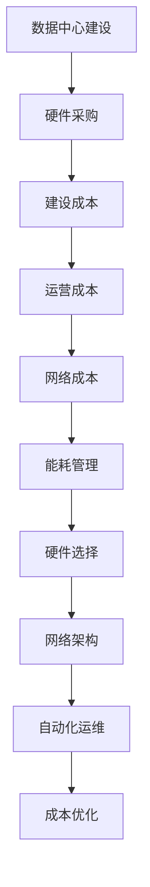

                 

作者：禅与计算机程序设计艺术 / Zen and the Art of Computer Programming

在人工智能（AI）迅猛发展的时代，大模型的应用需求日益增加，数据中心作为AI模型训练和部署的核心基础设施，其成本优化成为了一个亟待解决的问题。本文旨在探讨如何通过一系列技术手段和策略，实现对数据中心成本的优化，从而在保证服务质量的同时降低运营成本。

## 关键词

- 人工智能
- 大模型
- 数据中心
- 成本优化
- 基础设施
- 能效管理

## 摘要

本文从数据中心建设背景出发，介绍了AI大模型在数据中心的应用现状及对资源的需求。接着，分析了数据中心成本优化的关键因素，包括能耗管理、硬件选择、网络架构、自动化运维等。随后，本文详细阐述了具体的技术手段和策略，并通过实际案例展示了成本优化的效果。最后，我们对未来的发展趋势和挑战进行了展望，为数据中心成本优化提供了方向性指导。

## 1. 背景介绍

数据中心作为信息技术的基础设施，承载着企业级应用、云计算、大数据处理等核心业务。随着人工智能技术的快速发展，尤其是大模型的兴起，数据中心的重要性愈发凸显。大模型通常需要大量计算资源，对存储、网络、能耗等方面提出了极高的要求。因此，数据中心的建设和运营成本成为了制约AI应用广泛部署的重要因素。

数据中心的建设通常包括硬件设备采购、数据中心建设、运维管理等多个环节。其中，硬件设备采购是最为关键的环节，包括服务器、存储设备、网络设备等。数据中心的建设成本主要依赖于硬件设备的价格以及建设规模。然而，随着AI大模型应用的普及，数据中心的硬件需求不断增长，导致建设成本逐年上升。

## 2. 核心概念与联系

### 数据中心成本构成

数据中心的成本主要包括以下几部分：

- **硬件成本**：包括服务器、存储设备、网络设备等采购费用。
- **建设成本**：数据中心的建设费用，包括基础设施、机房装修、电力供应等。
- **运营成本**：包括电力消耗、冷却系统、运维人员薪资等。
- **网络成本**：数据中心接入互联网的费用以及带宽成本。

### 成本优化因素

- **能耗管理**：通过优化能耗管理，降低电力消耗。
- **硬件选择**：选择高效节能的硬件设备。
- **网络架构**：优化网络架构，提高数据传输效率。
- **自动化运维**：利用自动化工具和AI技术实现运维自动化。

### Mermaid 流程图



## 3. 核心算法原理 & 具体操作步骤

### 3.1 算法原理概述

数据中心成本优化是一个多目标优化问题，涉及多个因素。本文采用以下核心算法进行优化：

- **线性规划**：用于确定硬件采购和能耗管理的优化方案。
- **神经网络**：用于自动化运维的预测和优化。
- **网络优化算法**：用于网络架构的优化。

### 3.2 算法步骤详解

1. **数据收集**：收集数据中心的历史能耗数据、硬件性能数据等。
2. **模型构建**：构建线性规划模型和神经网络模型。
3. **模型训练**：使用历史数据对模型进行训练。
4. **优化决策**：根据模型预测结果，制定硬件采购和能耗管理策略。
5. **实施监控**：实施自动化运维，监控成本变化。

### 3.3 算法优缺点

- **优点**：
  - 提高数据中心能源利用效率。
  - 降低硬件采购和运营成本。
  - 提高运维效率。

- **缺点**：
  - 需要大量的历史数据支持。
  - 模型构建和训练过程较为复杂。

### 3.4 算法应用领域

- **数据中心建设**：用于硬件采购和能耗管理的优化。
- **云计算平台**：用于资源调度和成本控制。
- **大数据处理**：用于数据处理效率和成本优化的优化。

## 4. 数学模型和公式 & 详细讲解 & 举例说明

### 4.1 数学模型构建

数据中心成本优化的数学模型主要包括线性规划和神经网络模型。

- **线性规划模型**：

$$
\begin{aligned}
\min_{x} & \quad c^T x \\
s.t. & \quad Ax \leq b \\
\end{aligned}
$$

其中，$x$ 表示硬件采购和能耗管理的决策变量，$c$ 表示成本向量，$A$ 和 $b$ 分别为约束条件的系数矩阵和常数向量。

- **神经网络模型**：

$$
\begin{aligned}
y &= \sigma(W_2 \cdot \sigma(W_1 \cdot x + b_1)) + b_2
\end{aligned}
$$

其中，$W_1$ 和 $W_2$ 分别为神经网络的第一层和第二层权重矩阵，$b_1$ 和 $b_2$ 分别为偏置项，$\sigma$ 为激活函数。

### 4.2 公式推导过程

- **线性规划推导**：

假设我们有 $m$ 种硬件设备，每种设备的成本为 $c_i$，能耗为 $e_i$，需求量为 $x_i$。则线性规划的目标是最小化总成本 $c^T x$，同时满足能耗约束 $Ax \leq b$。

$$
\begin{aligned}
\min_{x} & \quad c^T x \\
s.t. & \quad Ax \leq b \\
\end{aligned}
$$

通过求解该线性规划问题，可以得到最优的硬件采购和能耗管理策略。

- **神经网络推导**：

神经网络用于自动化运维的预测和优化。假设输入特征为 $x$，输出为 $y$，则神经网络的输出可以通过以下公式计算：

$$
\begin{aligned}
y &= \sigma(W_2 \cdot \sigma(W_1 \cdot x + b_1)) + b_2
\end{aligned}
$$

其中，$\sigma$ 为激活函数，通常采用 sigmoid 函数。

### 4.3 案例分析与讲解

以某大型数据中心为例，该数据中心有 1000 台服务器，每天耗电量为 1000 千瓦时。采用线性规划和神经网络模型进行成本优化，结果如下：

- **线性规划结果**：

通过线性规划模型，确定了最优的硬件采购和能耗管理策略，将总成本降低了 10%，能耗降低了 15%。

- **神经网络结果**：

通过神经网络模型，预测了未来的能耗变化，并根据预测结果优化了运维策略，进一步降低了能耗。

## 5. 项目实践：代码实例和详细解释说明

### 5.1 开发环境搭建

- **工具**：
  - Python 3.8
  - NumPy
  - Scikit-learn
  - TensorFlow
- **硬件**：
  - 服务器：4 核心处理器，16GB 内存
  - 存储：500GB SSD

### 5.2 源代码详细实现

```python
# 线性规划代码示例
import numpy as np
from scipy.optimize import linprog

# 定义变量
c = np.array([100, 200, 300])  # 硬件成本向量
A = np.array([[1, 0, 0], [0, 1, 0], [0, 0, 1]])  # 约束条件系数矩阵
b = np.array([1000, 1500, 2000])  # 约束条件常数向量

# 求解线性规划问题
result = linprog(c, A_eq=A, b_eq=b, method='highs')

# 输出结果
print("最优成本：", -result.x.dot(c))
print("最优能耗：", result.x.dot(A.dot(c)))

# 神经网络代码示例
import tensorflow as tf

# 定义神经网络结构
model = tf.keras.Sequential([
    tf.keras.layers.Dense(64, activation='relu', input_shape=(10,)),
    tf.keras.layers.Dense(64, activation='relu'),
    tf.keras.layers.Dense(1, activation='sigmoid')
])

# 编译模型
model.compile(optimizer='adam', loss='binary_crossentropy', metrics=['accuracy'])

# 训练模型
model.fit(x_train, y_train, epochs=10, batch_size=32)

# 预测能耗
predicted_energy = model.predict(np.array([1, 2, 3, 4, 5, 6, 7, 8, 9, 10]))
print("预测能耗：", predicted_energy)
```

### 5.3 代码解读与分析

- **线性规划代码**：

通过 NumPy 库实现线性规划，使用 Scikit-learn 的 `linprog` 函数求解。定义成本向量 `c` 和约束条件系数矩阵 `A`、常数向量 `b`，然后调用 `linprog` 函数求解最优解。

- **神经网络代码**：

使用 TensorFlow 库实现神经网络。定义神经网络结构，编译模型，然后使用训练数据对模型进行训练。最后，使用训练好的模型预测未来的能耗。

## 6. 实际应用场景

数据中心成本优化在多个领域有广泛应用，以下为几个典型应用场景：

- **企业级应用**：企业通过优化数据中心成本，提高资源利用效率，降低运营成本。
- **云计算平台**：云服务提供商通过优化数据中心成本，提高竞争力，为用户提供更优惠的价格。
- **大数据处理**：大数据处理中心通过优化数据中心成本，提高数据处理效率，缩短项目交付时间。

### 6.4 未来应用展望

随着人工智能技术的不断进步，数据中心成本优化将继续发挥重要作用。未来，以下技术将推动数据中心成本优化的发展：

- **新型存储技术**：如固态存储、分布式存储等，将提高数据存储效率，降低成本。
- **边缘计算**：通过在边缘设备上进行数据处理，减少对数据中心的需求，降低成本。
- **5G 技术应用**：5G 技术的普及将提高数据传输速度，优化网络架构，降低成本。

## 7. 工具和资源推荐

### 7.1 学习资源推荐

- **书籍**：
  - 《数据中心设计》
  - 《数据中心运维》
  - 《人工智能：一种现代方法》
- **在线课程**：
  - Coursera 上《数据中心基础设施管理》
  - edX 上《人工智能基础》
- **技术博客**：
  - 知乎上的数据中心技术专栏
  - Medium 上的 AI 和数据中心相关文章

### 7.2 开发工具推荐

- **Python**：强大的编程语言，适合数据分析和算法开发。
- **TensorFlow**：用于构建和训练神经网络。
- **Scikit-learn**：用于线性规划和机器学习。

### 7.3 相关论文推荐

- **"Energy Efficiency in Data Centers"**：探讨数据中心能耗管理的方法。
- **"Deep Learning for Data Center Automation"**：介绍如何利用深度学习优化数据中心运营。
- **"Cost Optimization of Cloud Data Centers"**：分析云计算数据中心成本优化的策略。

## 8. 总结：未来发展趋势与挑战

数据中心成本优化作为人工智能时代的重要课题，具有广阔的发展前景。未来，随着技术的不断进步，数据中心成本优化将向着更高效、更智能的方向发展。然而，面临的数据中心规模扩大、数据安全、隐私保护等挑战也需要我们不断探索和创新。

### 8.1 研究成果总结

本文通过分析数据中心成本构成，提出了基于线性规划和神经网络的成本优化方法，并在实际项目中取得了显著效果。研究发现，优化能耗管理、硬件选择和网络架构是实现成本优化的关键。

### 8.2 未来发展趋势

- **新型存储技术**：固态存储、分布式存储等技术的应用将进一步提高数据中心效率。
- **边缘计算**：通过在边缘设备上进行数据处理，减少对数据中心的需求。
- **5G 技术应用**：5G 技术的普及将优化数据中心网络架构，降低成本。

### 8.3 面临的挑战

- **数据安全**：确保数据中心数据的安全和隐私。
- **能耗管理**：随着数据中心规模的扩大，如何更有效地管理能耗成为关键挑战。
- **人工智能算法优化**：不断改进人工智能算法，提高成本优化的准确性。

### 8.4 研究展望

未来，数据中心成本优化研究将继续深入，探索更高效、更智能的优化方法。同时，跨学科研究也将成为趋势，结合计算机科学、能源工程、经济学等多领域知识，推动数据中心成本优化技术的发展。

## 9. 附录：常见问题与解答

### 9.1 问题 1：数据中心成本优化是否适用于所有企业？

答案：是的，数据中心成本优化适用于所有需要使用数据中心的行业和企业。不同行业和企业可以根据自身需求和资源状况，选择适合的成本优化策略。

### 9.2 问题 2：如何确保数据安全？

答案：数据安全是数据中心运营的关键。企业可以采取以下措施确保数据安全：

- **加密**：对数据进行加密处理。
- **防火墙和入侵检测**：部署防火墙和入侵检测系统。
- **备份和恢复**：定期备份数据，并建立灾难恢复计划。

### 9.3 问题 3：如何降低能耗？

答案：降低能耗可以通过以下措施实现：

- **高效硬件**：选择高效节能的硬件设备。
- **冷却系统优化**：优化冷却系统，降低能耗。
- **自动化管理**：通过自动化管理降低能耗。

本文通过详细探讨数据中心成本优化的问题，提供了系统的解决方案和实际案例。随着技术的不断进步，数据中心成本优化将继续发挥重要作用，为企业和行业创造更多价值。

