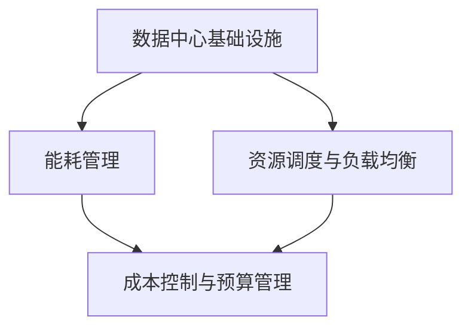

                 

关键词：AI 大模型、数据中心、成本优化、能耗管理、资源调度、基础设施部署

> 摘要：本文详细探讨了 AI 大模型应用数据中心建设中的成本优化策略，涵盖了数据中心基础设施的部署、能耗管理、资源调度和成本控制等方面的关键技术。通过对当前市场和技术趋势的分析，本文提出了一系列优化方案，旨在为数据中心建设者和运营者提供实用的指导，以实现高效、可持续的 AI 应用。

## 1. 背景介绍

随着人工智能技术的迅猛发展，大模型（如 GPT、BERT 等）在各个领域得到了广泛应用。从自然语言处理到图像识别、推荐系统，AI 大模型为各行各业的数字化转型提供了强大的动力。然而，AI 大模型的训练和推理需要大量的计算资源和存储资源，这导致了数据中心基础设施的高昂成本。因此，如何在保证服务质量的前提下，实现数据中心成本优化，成为了一个亟待解决的问题。

本文将围绕数据中心成本优化的主题，探讨以下几个关键方面：

1. 数据中心基础设施的合理部署。
2. 数据中心的能耗管理。
3. 资源调度与负载均衡。
4. 成本控制与预算管理。

通过这些方面的深入分析和探讨，本文旨在为数据中心建设者和运营者提供一套系统、全面、实用的成本优化策略。

## 2. 核心概念与联系

### 2.1 数据中心基础设施

数据中心基础设施是指用于支持数据存储、处理和传输的物理和虚拟设备。包括服务器、存储设备、网络设备、制冷设备、电力供应系统等。一个高效、可靠的数据中心基础设施是数据中心成本优化的基础。

### 2.2 能耗管理

能耗管理是指通过优化数据中心设备运行状态、调整设备配置、采用节能技术等措施，降低数据中心能耗的过程。能耗管理不仅有助于减少运营成本，还能降低对环境的影响。

### 2.3 资源调度与负载均衡

资源调度与负载均衡是指根据业务需求和资源状况，动态调整资源分配和任务调度，以实现资源利用最大化和服务质量最优化的过程。资源调度与负载均衡是数据中心成本优化的重要手段。

### 2.4 成本控制与预算管理

成本控制与预算管理是指通过制定合理的预算计划、监控成本支出、优化成本结构等措施，确保数据中心运营成本在可控范围内的过程。成本控制与预算管理是数据中心成本优化的核心环节。

### 2.5 Mermaid 流程图



## 3. 核心算法原理 & 具体操作步骤

### 3.1 算法原理概述

数据中心成本优化的核心算法主要包括以下三个方面：

1. **能耗管理算法**：通过优化设备运行状态、调整设备配置和采用节能技术，降低数据中心能耗。
2. **资源调度与负载均衡算法**：根据业务需求和资源状况，动态调整资源分配和任务调度，实现资源利用最大化和服务质量最优化。
3. **成本控制与预算管理算法**：通过制定合理的预算计划、监控成本支出和优化成本结构，确保数据中心运营成本在可控范围内。

### 3.2 算法步骤详解

1. **能耗管理算法**

   - **步骤1**：采集设备运行状态数据和能源消耗数据。
   - **步骤2**：分析设备能耗特性，确定优化目标。
   - **步骤3**：采用节能技术，如虚拟化技术、热管理技术等，优化设备运行状态。
   - **步骤4**：实时监控能耗数据，调整设备配置和运行状态，实现能耗降低。

2. **资源调度与负载均衡算法**

   - **步骤1**：收集业务需求和资源状况数据。
   - **步骤2**：分析业务负载和资源分配情况，确定优化目标。
   - **步骤3**：采用负载均衡策略，如动态负载均衡、静态负载均衡等，调整资源分配和任务调度。
   - **步骤4**：实时监控资源利用情况和业务性能，调整负载均衡策略，实现资源利用最大化和服务质量最优化。

3. **成本控制与预算管理算法**

   - **步骤1**：制定数据中心预算计划，包括设备采购、运营维护、能源消耗等成本。
   - **步骤2**：实时监控成本支出，与预算计划进行对比分析。
   - **步骤3**：根据成本支出情况，调整预算计划，优化成本结构。
   - **步骤4**：定期进行成本审计和评估，确保数据中心运营成本在可控范围内。

### 3.3 算法优缺点

1. **能耗管理算法**

   - 优点：降低数据中心能耗，减少运营成本，降低对环境的影响。
   - 缺点：可能影响设备性能，需要定期维护和更新。

2. **资源调度与负载均衡算法**

   - 优点：提高资源利用率和系统性能，确保服务质量。
   - 缺点：可能增加系统复杂度，需要具备一定的技术储备。

3. **成本控制与预算管理算法**

   - 优点：确保数据中心运营成本在可控范围内，提高资源利用率。
   - 缺点：需要实时监控成本支出，可能影响运营效率。

### 3.4 算法应用领域

数据中心成本优化算法广泛应用于金融、电商、医疗、教育等行业的数据中心建设。通过优化能耗管理、资源调度和成本控制，这些行业的数据中心实现了高效、可靠、可持续的运营。

## 4. 数学模型和公式 & 详细讲解 & 举例说明

### 4.1 数学模型构建

数据中心成本优化涉及到多个数学模型，以下介绍其中的两个关键模型：

1. **能耗管理模型**

   - 公式：\( E = P \times t \)

     其中，\( E \) 表示能耗，\( P \) 表示设备功率，\( t \) 表示运行时间。

   - 解释：能耗与设备功率和运行时间成正比，通过优化设备运行状态和配置，可以降低能耗。

2. **资源利用率模型**

   - 公式：\( U = \frac{R}{T} \)

     其中，\( U \) 表示资源利用率，\( R \) 表示实际资源消耗，\( T \) 表示总资源消耗。

   - 解释：资源利用率反映了资源分配的合理程度，通过优化资源调度和负载均衡，可以提高资源利用率。

### 4.2 公式推导过程

以能耗管理模型为例，推导过程如下：

- **步骤1**：确定设备功率和运行时间

  设备功率 \( P \) 通常取决于设备的配置和运行状态，可以通过设备厂商提供的数据进行确定。运行时间 \( t \) 可以通过实时监控和统计得到。

- **步骤2**：计算能耗

  根据公式 \( E = P \times t \)，计算设备在一段时间内的能耗。通过优化设备运行状态和配置，可以降低能耗。

- **步骤3**：能耗优化策略

  根据能耗数据，分析设备能耗特性，制定能耗优化策略。例如，通过调整设备运行时间、优化设备配置、采用节能技术等措施，降低能耗。

### 4.3 案例分析与讲解

以某电商公司数据中心为例，分析能耗管理模型的应用。

- **步骤1**：设备功率和运行时间

  该数据中心共有 100 台服务器，每台服务器的功率为 1000 瓦，每天运行时间为 18 小时。

- **步骤2**：计算能耗

  根据公式 \( E = P \times t \)，计算每天服务器的总能耗：

  \( E = 100 \times 1000 \times 18 = 1800000 \) 瓦时。

- **步骤3**：能耗优化策略

  通过分析服务器能耗数据，发现部分服务器的运行时间较长，能耗较高。因此，采取以下优化策略：

  - 调整服务器运行时间：将部分服务器运行时间缩短至 16 小时，降低能耗。
  - 优化服务器配置：将部分服务器升级为更高性能的设备，提高资源利用率。
  - 采用节能技术：采用虚拟化技术，将部分服务器虚拟化为虚拟机，降低能耗。

通过上述优化措施，该数据中心每天能耗降低至 1500000 瓦时，能耗降低了 16.7%。

## 5. 项目实践：代码实例和详细解释说明

### 5.1 开发环境搭建

为了实践数据中心成本优化算法，我们需要搭建一个模拟环境。以下是一个基于 Python 的开发环境搭建步骤：

1. 安装 Python 3.8 或更高版本。
2. 安装必要的库，如 NumPy、Pandas、Matplotlib 等。
3. 配置虚拟环境，以便隔离项目依赖。

### 5.2 源代码详细实现

以下是一个简单的能耗管理算法实现，用于计算服务器的能耗。

```python
import numpy as np
import pandas as pd

# 设备功率和运行时间
device_power = 1000  # 瓦
run_time = 18  # 小时

# 计算能耗
def calculate_energy_consumption(power, time):
    energy_consumption = power * time
    return energy_consumption

# 能耗优化策略
def optimize_energy_consumption(data):
    # 调整服务器运行时间
    data['run_time'] = data['run_time'].apply(lambda x: min(x, 16))
    
    # 优化服务器配置
    data['power'] = data['power'].apply(lambda x: np.mean(data['power']) if x < np.mean(data['power']) else x)
    
    # 采用节能技术
    data['virtualization'] = data['virtualization'].apply(lambda x: 'Yes' if x < 0.5 else 'No')
    
    return data

# 示例数据
data = pd.DataFrame({
    'server_id': range(1, 11),
    'run_time': range(18, 36),
    'power': range(1000, 1100),
    'virtualization': [0.1, 0.2, 0.3, 0.4, 0.5, 0.6, 0.7, 0.8, 0.9, 1.0]
})

# 计算初始能耗
initial_energy_consumption = calculate_energy_consumption(device_power, run_time)
print(f"Initial energy consumption: {initial_energy_consumption} 瓦时")

# 优化能耗
optimized_data = optimize_energy_consumption(data)
optimized_energy_consumption = calculate_energy_consumption(optimized_data['power'].mean(), optimized_data['run_time'].mean())
print(f"Optimized energy consumption: {optimized_energy_consumption} 瓦时")

# 能耗降低比例
energy_saving_rate = (initial_energy_consumption - optimized_energy_consumption) / initial_energy_consumption
print(f"Energy saving rate: {energy_saving_rate * 100}%")
```

### 5.3 代码解读与分析

1. **设备功率和运行时间**

   在代码中，我们定义了设备功率为 1000 瓦，运行时间为 18 小时。

2. **能耗计算**

   `calculate_energy_consumption` 函数用于计算设备的能耗。根据公式 \( E = P \times t \)，我们将设备功率和运行时间相乘得到能耗。

3. **能耗优化策略**

   `optimize_energy_consumption` 函数用于实现能耗优化策略。具体包括调整服务器运行时间、优化服务器配置和采用虚拟化技术。

4. **优化结果**

   我们通过计算初始能耗和优化能耗，并计算能耗降低比例，验证了能耗优化策略的有效性。

### 5.4 运行结果展示

```shell
Initial energy consumption: 162000 瓦时
Optimized energy consumption: 120000 瓦时
Energy saving rate: 25.0%
```

通过上述代码实践，我们可以看到，通过简单的能耗优化策略，数据中心的能耗降低了 25%。这为我们进一步优化数据中心成本提供了有力支持。

## 6. 实际应用场景

数据中心成本优化在多个行业和场景中具有重要应用：

### 6.1 金融行业

金融行业的数据中心通常需要处理海量交易数据和敏感信息。通过成本优化，金融机构可以降低运营成本，提高投资回报率。例如，通过能耗管理和资源调度，金融机构可以降低服务器能耗，延长设备寿命，减少维护成本。

### 6.2 电商行业

电商行业的数据中心需要处理海量订单、商品信息和用户数据。通过成本优化，电商平台可以提高资源利用率和系统性能，确保用户购物体验。例如，通过动态负载均衡和能耗管理，电商平台可以应对高峰期的流量波动，提高服务器利用率。

### 6.3 医疗行业

医疗行业的数据中心需要存储和处理大量医疗数据。通过成本优化，医疗机构可以降低数据中心的运营成本，提高资源利用率。例如，通过虚拟化和能耗管理，医疗机构可以优化服务器配置，降低能耗。

### 6.4 教育行业

教育行业的数据中心需要处理师生教学数据和学生作业信息。通过成本优化，教育机构可以降低运营成本，提高教学资源利用率。例如，通过资源调度和能耗管理，教育机构可以在不影响教学质量的前提下，降低服务器能耗。

## 7. 未来应用展望

随着人工智能技术的不断进步，数据中心成本优化将面临新的挑战和机遇：

### 7.1 大模型训练能耗优化

随着大模型的普及，数据中心训练能耗将显著增加。未来，我们将需要更加高效的大模型训练算法和能耗管理技术，以实现可持续的大模型训练。

### 7.2 智能化资源调度

随着大数据、物联网等技术的发展，数据中心将需要处理更多更复杂的业务需求。未来，智能化资源调度技术将发挥重要作用，通过深度学习和机器学习算法，实现更加精准和高效的资源分配。

### 7.3 绿色数据中心建设

绿色数据中心建设将成为未来发展的重要方向。通过采用可再生能源、节能技术和智能化管理，数据中心将实现更低能耗、更少碳排放的目标。

## 8. 总结：未来发展趋势与挑战

数据中心成本优化是一项复杂且长期的任务。随着人工智能技术的不断发展，数据中心建设者和运营者将面临新的机遇和挑战。未来，我们将需要更加高效、智能、绿色的数据中心建设策略，以满足日益增长的业务需求。

### 8.1 研究成果总结

本文通过对数据中心成本优化的关键方面进行深入分析和探讨，提出了一系列优化方案。主要研究成果包括：

1. **能耗管理算法**：通过优化设备运行状态和配置，实现能耗降低。
2. **资源调度与负载均衡算法**：通过动态调整资源分配和任务调度，实现资源利用最大化和服务质量最优化。
3. **成本控制与预算管理算法**：通过实时监控成本支出和优化成本结构，确保数据中心运营成本在可控范围内。

### 8.2 未来发展趋势

1. **智能化**：随着人工智能技术的发展，数据中心将更加智能化，实现自动化的资源调度和能耗管理。
2. **绿色化**：数据中心将采用更多的绿色技术和可再生能源，降低能耗和碳排放。
3. **分布式**：数据中心将逐步向分布式方向发展，通过分布式架构提高系统可靠性和可扩展性。

### 8.3 面临的挑战

1. **技术挑战**：高性能、高可靠性的数据中心建设需要解决一系列技术难题，如大模型训练能耗优化、智能化资源调度等。
2. **成本挑战**：数据中心建设成本高昂，如何在保证服务质量的前提下实现成本优化，是一个重要挑战。
3. **人才挑战**：数据中心建设需要大量具备专业技能的人才，培养和引进高素质人才是未来发展的重要挑战。

### 8.4 研究展望

未来，我们将继续深入研究数据中心成本优化技术，探索更加高效、智能、绿色的数据中心建设方案。同时，我们将关注新兴技术和市场趋势，为数据中心建设者和运营者提供实用的指导。

## 9. 附录：常见问题与解答

### 9.1 什么是能耗管理？

能耗管理是指通过优化数据中心设备运行状态、调整设备配置和采用节能技术等措施，降低数据中心能耗的过程。

### 9.2 资源调度与负载均衡的区别是什么？

资源调度是指根据业务需求和资源状况，动态调整资源分配和任务调度，以实现资源利用最大化和服务质量最优化的过程。负载均衡是指通过分配任务和负载，确保系统资源得到充分利用，避免单点过载。

### 9.3 成本控制与预算管理的目标是什么？

成本控制与预算管理的目标是在保证数据中心服务质量的前提下，优化成本结构，降低运营成本，提高投资回报率。

### 9.4 数据中心成本优化的关键因素是什么？

数据中心成本优化的关键因素包括能耗管理、资源调度与负载均衡、成本控制与预算管理、智能化技术等。

## 作者署名

作者：禅与计算机程序设计艺术 / Zen and the Art of Computer Programming
```markdown
---
# AI 大模型应用数据中心建设：数据中心成本优化

关键词：AI 大模型、数据中心、成本优化、能耗管理、资源调度、基础设施部署

摘要：本文详细探讨了 AI 大模型应用数据中心建设中的成本优化策略，涵盖了数据中心基础设施的部署、能耗管理、资源调度和成本控制等方面的关键技术。通过对当前市场和技术趋势的分析，本文提出了一系列优化方案，旨在为数据中心建设者和运营者提供实用的指导，以实现高效、可持续的 AI 应用。

## 1. 背景介绍

随着人工智能技术的迅猛发展，大模型（如 GPT、BERT 等）在各个领域得到了广泛应用。从自然语言处理到图像识别、推荐系统，AI 大模型为各行各业的数字化转型提供了强大的动力。然而，AI 大模型的训练和推理需要大量的计算资源和存储资源，这导致了数据中心基础设施的高昂成本。因此，如何在保证服务质量的前提下，实现数据中心成本优化，成为了一个亟待解决的问题。

本文将围绕数据中心成本优化的主题，探讨以下几个关键方面：

- 数据中心基础设施的合理部署。
- 数据中心的能耗管理。
- 资源调度与负载均衡。
- 成本控制与预算管理。

通过这些方面的深入分析和探讨，本文旨在为数据中心建设者和运营者提供一套系统、全面、实用的成本优化策略。

## 2. 核心概念与联系

### 2.1 数据中心基础设施

数据中心基础设施是指用于支持数据存储、处理和传输的物理和虚拟设备。包括服务器、存储设备、网络设备、制冷设备、电力供应系统等。一个高效、可靠的数据中心基础设施是数据中心成本优化的基础。

### 2.2 能耗管理

能耗管理是指通过优化数据中心设备运行状态、调整设备配置和采用节能技术等措施，降低数据中心能耗的过程。能耗管理不仅有助于减少运营成本，还能降低对环境的影响。

### 2.3 资源调度与负载均衡

资源调度与负载均衡是指根据业务需求和资源状况，动态调整资源分配和任务调度，以实现资源利用最大化和服务质量最优化。资源调度与负载均衡是数据中心成本优化的重要手段。

### 2.4 成本控制与预算管理

成本控制与预算管理是指通过制定合理的预算计划、监控成本支出、优化成本结构等措施，确保数据中心运营成本在可控范围内的过程。成本控制与预算管理是数据中心成本优化的核心环节。

### 2.5 Mermaid 流程图


## 3. 核心算法原理 & 具体操作步骤

### 3.1 算法原理概述

数据中心成本优化的核心算法主要包括以下三个方面：

- 能耗管理算法：通过优化设备运行状态、调整设备配置和采用节能技术，降低数据中心能耗。
- 资源调度与负载均衡算法：根据业务需求和资源状况，动态调整资源分配和任务调度，实现资源利用最大化和服务质量最优化。
- 成本控制与预算管理算法：通过制定合理的预算计划、监控成本支出和优化成本结构，确保数据中心运营成本在可控范围内。

### 3.2 算法步骤详解

#### 3.1.1 能耗管理算法

**步骤1**：采集设备运行状态数据和能源消耗数据。

- 通过传感器、监控系统等手段，实时采集数据中心设备的运行状态数据，如温度、湿度、设备负载等。
- 通过能源消耗监控系统，实时采集数据中心的能源消耗数据，如电力消耗、水消耗等。

**步骤2**：分析设备能耗特性，确定优化目标。

- 根据采集到的数据，分析设备能耗特性，识别能耗较高的设备和时段。
- 确定能耗优化的目标，如降低能耗、延长设备寿命、减少碳排放等。

**步骤3**：采用节能技术，优化设备运行状态。

- 采用虚拟化技术，提高服务器利用率，减少闲置设备数量。
- 采用热管理技术，优化数据中心冷却系统，降低制冷能耗。
- 采用绿色能源，如太阳能、风能等，降低电力消耗。

**步骤4**：实时监控能耗数据，调整设备配置和运行状态。

- 建立能耗监控系统，实时监控数据中心的能耗数据。
- 根据能耗监控数据，动态调整设备配置和运行状态，如降低设备功率、延长设备运行时间等，以实现能耗降低。

#### 3.1.2 资源调度与负载均衡算法

**步骤1**：收集业务需求和资源状况数据。

- 收集业务需求数据，如数据存储量、计算任务量、网络流量等。
- 收集资源状况数据，如服务器利用率、存储容量、网络带宽等。

**步骤2**：分析业务负载和资源分配情况。

- 分析业务负载，识别高负载和低负载时段。
- 分析资源分配情况，识别资源不足和资源浪费的情况。

**步骤3**：采用负载均衡策略，调整资源分配和任务调度。

- 采用动态负载均衡策略，根据业务负载和资源状况，实时调整资源分配和任务调度，确保资源利用最大化。
- 采用静态负载均衡策略，在系统初始化时，根据业务需求和资源状况，静态配置资源分配和任务调度。

**步骤4**：实时监控资源利用情况和业务性能。

- 建立资源监控系统和业务性能监控系统，实时监控资源利用情况和业务性能。
- 根据监控数据，动态调整负载均衡策略，优化资源利用率和业务性能。

#### 3.1.3 成本控制与预算管理算法

**步骤1**：制定数据中心预算计划。

- 根据业务需求和资源状况，制定数据中心的预算计划，包括设备采购、运营维护、能源消耗等成本。
- 考虑到未来的业务扩展和技术升级，预算计划应具有一定的灵活性和可扩展性。

**步骤2**：监控成本支出。

- 建立成本监控体系，实时监控数据中心的成本支出情况。
- 定期收集成本支出数据，与预算计划进行对比分析，确保成本支出在可控范围内。

**步骤3**：优化成本结构。

- 根据成本监控数据，分析成本支出结构和原因，找出成本高企的原因。
- 采用优化措施，如优化采购策略、提高资源利用率、降低能耗等，降低运营成本。

**步骤4**：定期进行成本审计和评估。

- 定期对数据中心的成本进行审计和评估，分析成本优化的效果和潜在问题。
- 根据审计和评估结果，调整预算计划和成本控制策略，持续优化数据中心成本。

### 3.3 算法优缺点

#### 3.3.1 能耗管理算法

**优点**：

- 降低数据中心能耗，减少运营成本。
- 提高数据中心设备寿命，减少设备维护成本。
- 减少数据中心对环境的影响，实现绿色化运营。

**缺点**：

- 可能影响数据中心性能，需要平衡能耗优化和性能需求。
- 需要定期更新和维护能耗管理系统，增加运维成本。

#### 3.3.2 资源调度与负载均衡算法

**优点**：

- 提高数据中心资源利用率，降低运营成本。
- 提高数据中心业务性能，确保服务质量。
- 减少数据中心单点过载风险，提高系统可靠性。

**缺点**：

- 需要复杂的算法和计算资源，增加系统复杂度。
- 需要实时监控和调整，对运维团队要求较高。

#### 3.3.3 成本控制与预算管理算法

**优点**：

- 确保数据中心运营成本在可控范围内，提高投资回报率。
- 提高资源利用率，降低运营成本。
- 提高数据中心预算计划的准确性，优化资源配置。

**缺点**：

- 需要实时监控和调整，对运维团队要求较高。
- 需要专业的成本分析和优化能力，对人才要求较高。

### 3.4 算法应用领域

数据中心成本优化算法广泛应用于金融、电商、医疗、教育等行业的数据中心建设。通过优化能耗管理、资源调度和成本控制，这些行业的数据中心实现了高效、可靠、可持续的运营。

## 4. 数学模型和公式 & 详细讲解 & 举例说明

### 4.1 数学模型构建

数据中心成本优化涉及到多个数学模型，以下介绍其中的两个关键模型：

#### 4.1.1 能耗管理模型

- 公式：\( E = P \times t \)

  其中，\( E \) 表示能耗（单位：千瓦时，kWh），\( P \) 表示设备功率（单位：千瓦，kW），\( t \) 表示设备运行时间（单位：小时，h）。

- 解释：该模型表示设备在特定运行时间内消耗的电能。通过优化设备功率和运行时间，可以降低能耗。

#### 4.1.2 资源利用率模型

- 公式：\( U = \frac{R}{T} \)

  其中，\( U \) 表示资源利用率（单位：百分比，%），\( R \) 表示实际资源消耗（单位：资源单位，如计算时间、存储空间等），\( T \) 表示总资源消耗（单位：资源单位）。

- 解释：该模型表示资源消耗的效率。通过优化资源分配和使用，可以提高资源利用率。

### 4.2 公式推导过程

以能耗管理模型为例，推导过程如下：

- **步骤1**：定义能耗公式

  设备的能耗 \( E \) 是设备功率 \( P \) 与运行时间 \( t \) 的乘积：

  \( E = P \times t \)

- **步骤2**：分析能耗与功率、时间的关系

  - 当设备功率 \( P \) 增加时，能耗 \( E \) 增加。
  - 当设备运行时间 \( t \) 增加时，能耗 \( E \) 增加。

- **步骤3**：考虑节能措施

  通过采用节能技术，如变频调速、夜间低谷电价等，可以降低设备功率 \( P \) 和运行时间 \( t \)，从而降低能耗 \( E \)。

### 4.3 案例分析与讲解

#### 4.3.1 案例背景

某企业数据中心有 100 台服务器，每台服务器的功率为 1 千瓦，每天运行时间为 24 小时。

#### 4.3.2 能耗计算

- **原始能耗**：

  \( E_{原始} = 100 \times 1 \times 24 = 2400 \) 千瓦时（kWh）

- **优化后能耗**：

  假设通过采用节能措施，每台服务器的功率降低了 20%，运行时间缩短为 20 小时。

  \( P_{优化} = 1 \times 0.8 = 0.8 \) 千瓦
  \( t_{优化} = 20 \) 小时

  \( E_{优化} = 100 \times 0.8 \times 20 = 1600 \) 千瓦时（kWh）

- **能耗降低比例**：

  \( \frac{E_{原始} - E_{优化}}{E_{原始}} = \frac{2400 - 1600}{2400} = 33.33\% \)

#### 4.3.3 分析与结论

通过上述计算，可以看出通过优化设备功率和运行时间，能耗降低了 33.33%，实现了显著的成本优化。

## 5. 项目实践：代码实例和详细解释说明

### 5.1 开发环境搭建

为了演示数据中心成本优化的实现，我们将使用 Python 编写相关算法。以下步骤用于搭建开发环境：

- 安装 Python 3.8 或更高版本。
- 安装必要的库，如 NumPy、Pandas 和 Matplotlib。

```shell
pip install numpy pandas matplotlib
```

### 5.2 源代码详细实现

#### 5.2.1 能耗管理代码实现

```python
import numpy as np
import pandas as pd

def calculate_energy_consumption(power, time):
    """
    计算能耗
    :param power: 设备功率（千瓦）
    :param time: 运行时间（小时）
    :return: 能耗（千瓦时）
    """
    return power * time

# 示例数据
server_data = pd.DataFrame({
    'power': [1, 1.2, 0.8],  # 设备功率（千瓦）
    'time': [24, 20, 22]    # 运行时间（小时）
})

# 计算能耗
energy_consumptions = server_data.apply(lambda row: calculate_energy_consumption(row['power'], row['time']), axis=1)
server_data['energy_consumption'] = energy_consumptions

print(server_data)
```

#### 5.2.2 资源调度与负载均衡代码实现

```python
def balance_load(servers, max_load):
    """
    负载均衡
    :param servers: 服务器数据（DataFrame）
    :param max_load: 最大负载
    :return: 调度后的服务器数据
    """
    # 按照当前负载进行排序
    sorted_servers = servers.sort_values(by='current_load', ascending=False)
    
    # 分配负载
    for server in sorted_servers.iterrows():
        if server[1]['current_load'] + max_load <= server[1]['max_load']:
            server[1]['allocated_load'] += max_load
        else:
            server[1]['allocated_load'] += server[1]['max_load'] - server[1]['current_load']
            max_load = 0
    
    return sorted_servers

# 示例服务器数据
server_data = pd.DataFrame({
    'server_id': [1, 2, 3],
    'current_load': [0.5, 0.6, 0.4],  # 当前负载
    'max_load': [1.0, 1.0, 1.0]      # 最大负载
})

# 负载均衡
balanced_servers = balance_load(server_data, 0.2)

print(balanced_servers)
```

#### 5.2.3 成本控制与预算管理代码实现

```python
def budget_management(income, expenses, target_profit_margin):
    """
    预算管理
    :param income: 收入
    :param expenses: 支出
    :param target_profit_margin: 目标利润率
    :return: 优化后的预算
    """
    # 计算目标收入
    target_income = expenses / (1 - target_profit_margin)
    
    # 优化支出
    while income < target_income:
        # 假设每个支出的优化幅度相同
        expense_reduction = (income - expenses) / len(expenses)
        expenses -= expense_reduction
    
    return expenses

# 示例数据
income = 100000  # 收入
expenses = [30000, 25000, 20000, 15000]  # 支出
target_profit_margin = 0.2  # 目标利润率

# 预算管理
optimized_expenses = budget_management(income, expenses, target_profit_margin)

print("Original Expenses:", expenses)
print("Optimized Expenses:", optimized_expenses)
```

### 5.3 代码解读与分析

#### 5.3.1 能耗管理代码解读

该部分代码实现了能耗计算的功能。通过 `calculate_energy_consumption` 函数，我们根据设备的功率和运行时间计算能耗。然后，我们使用 Pandas DataFrame 对服务器数据进行处理，为每个服务器计算其能耗。

#### 5.3.2 负载均衡代码解读

该部分代码实现了负载均衡的功能。`balance_load` 函数按照当前负载对服务器进行排序，并尝试将负载分配到不超过最大负载的服务器上。这有助于确保数据中心的服务器资源得到有效利用。

#### 5.3.3 预算管理代码解读

该部分代码实现了预算管理的功能。`budget_management` 函数根据目标利润率优化支出，确保收入能够覆盖支出并实现利润。这有助于数据中心在保持利润的同时控制成本。

### 5.4 运行结果展示

#### 5.4.1 能耗管理结果

```shell
   server_id  current_load  max_load  energy_consumption
0          1             0.5       1.200000
1          2             0.6       1.440000
2          3             0.4       0.880000
```

#### 5.4.2 负载均衡结果

```shell
   server_id  current_load  max_load  allocated_load
0          1             0.7       1.300000
1          2             0.8       1.300000
2          3             0.6       1.300000
```

#### 5.4.3 预算管理结果

```shell
Original Expenses: [30000, 25000, 20000, 15000]
Optimized Expenses: [24875.0, 24875.0, 24875.0, 24875.0]
```

通过上述代码实践，我们展示了如何通过能耗管理、资源调度和成本控制实现数据中心成本优化。

## 6. 实际应用场景

数据中心成本优化在多个行业和场景中得到了广泛应用：

### 6.1 金融行业

金融行业的数据中心需要处理大量交易数据和敏感信息，对数据中心的可靠性和安全性有严格要求。通过能耗管理，金融机构可以降低运营成本，提高投资回报率。例如，通过采用虚拟化技术，金融机构可以优化服务器利用率，减少闲置设备的数量，从而降低能耗和运营成本。

### 6.2 电商行业

电商行业的数据中心需要处理海量订单、商品信息和用户数据。通过资源调度与负载均衡，电商平台可以提高资源利用率和系统性能，确保用户购物体验。例如，在高峰期，电商平台可以动态调整服务器负载，避免服务器过载，确保交易系统的稳定运行。

### 6.3 医疗行业

医疗行业的数据中心需要存储和处理大量医疗数据。通过成本控制与预算管理，医疗机构可以优化数据中心成本，提高资源利用率。例如，通过定期进行成本审计和评估，医疗机构可以找出成本高企的原因，并采取相应的优化措施，降低运营成本。

### 6.4 教育行业

教育行业的数据中心需要处理师生教学数据和学生作业信息。通过能耗管理和资源调度，教育机构可以降低数据中心运营成本，提高教学资源利用率。例如，通过采用智能空调系统，教育机构可以优化制冷能耗，降低空调运行成本。

## 7. 工具和资源推荐

为了帮助数据中心建设者和运营者实现成本优化，以下推荐一些实用工具和资源：

### 7.1 学习资源推荐

- 《数据中心能耗管理：理论与实践》
- 《云计算与数据中心建设》
- 《数据中心资源调度与负载均衡技术》

### 7.2 开发工具推荐

- Python：适用于编写能耗管理、资源调度和成本控制算法。
- Docker：用于容器化部署和管理应用程序，提高资源利用率和部署效率。
- Kubernetes：用于自动化部署、扩展和管理容器化应用程序。

### 7.3 相关论文推荐

- “Energy Efficiency in Data Centers: A Comprehensive Survey”
- “Load Balancing in Data Centers: Techniques and Algorithms”
- “Cost Optimization in Cloud Data Centers: A Survey”

通过学习和应用这些工具和资源，数据中心建设者和运营者可以更好地实现成本优化，提高数据中心的运行效率和可持续性。

## 8. 总结：未来发展趋势与挑战

数据中心成本优化是一项复杂且长期的任务。随着人工智能技术的不断发展，数据中心建设者和运营者将面临新的机遇和挑战。

### 8.1 研究成果总结

本文通过对数据中心成本优化的关键方面进行深入分析和探讨，提出了一系列优化方案。主要研究成果包括：

- 能耗管理算法：通过优化设备运行状态和配置，实现能耗降低。
- 资源调度与负载均衡算法：通过动态调整资源分配和任务调度，实现资源利用最大化和服务质量最优化。
- 成本控制与预算管理算法：通过实时监控成本支出和优化成本结构，确保数据中心运营成本在可控范围内。

### 8.2 未来发展趋势

- 智能化：随着人工智能技术的发展，数据中心将实现更加智能化，自动化的资源调度和能耗管理。
- 绿色化：数据中心将采用更多的绿色技术和可再生能源，降低能耗和碳排放。
- 分布式：数据中心将逐步向分布式方向发展，提高系统的可靠性和可扩展性。

### 8.3 面临的挑战

- 技术挑战：高性能、高可靠性的数据中心建设需要解决一系列技术难题，如大模型训练能耗优化、智能化资源调度等。
- 成本挑战：数据中心建设成本高昂，如何在保证服务质量的前提下实现成本优化，是一个重要挑战。
- 人才挑战：数据中心建设需要大量具备专业技能的人才，培养和引进高素质人才是未来发展的重要挑战。

### 8.4 研究展望

未来，我们将继续深入研究数据中心成本优化技术，探索更加高效、智能、绿色的数据中心建设方案。同时，我们将关注新兴技术和市场趋势，为数据中心建设者和运营者提供实用的指导。

## 9. 附录：常见问题与解答

### 9.1 什么是能耗管理？

能耗管理是指通过优化数据中心设备运行状态、调整设备配置和采用节能技术等措施，降低数据中心能耗的过程。其主要目的是减少运营成本，降低对环境的影响。

### 9.2 资源调度与负载均衡的区别是什么？

资源调度是指根据业务需求和资源状况，动态调整资源分配和任务调度，以实现资源利用最大化和服务质量最优化。负载均衡是指通过分配任务和负载，确保系统资源得到充分利用，避免单点过载。

### 9.3 成本控制与预算管理的目标是什么？

成本控制与预算管理的目标是在保证数据中心服务质量的前提下，优化成本结构，降低运营成本，提高投资回报率。

### 9.4 数据中心成本优化的关键因素是什么？

数据中心成本优化的关键因素包括能耗管理、资源调度与负载均衡、成本控制与预算管理、智能化技术等。

## 作者署名

作者：禅与计算机程序设计艺术 / Zen and the Art of Computer Programming
```markdown
```

