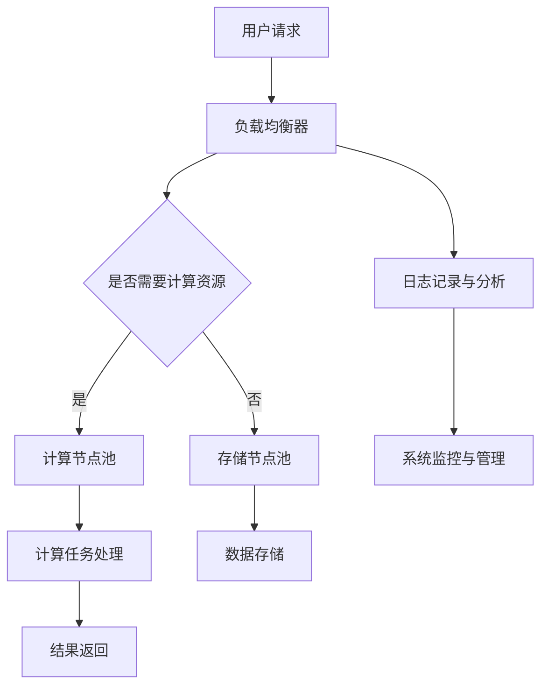

                 

关键词：人工智能、大模型、数据中心、技术、应用、设计、实现、展望

> 摘要：本文旨在探讨人工智能大模型在数据中心的应用与建设，通过深入剖析数据中心技术，阐述其在人工智能领域的实际作用，为后续研究和实践提供参考。本文首先介绍了数据中心的基础知识和当前的发展趋势，然后重点分析了人工智能大模型的技术原理和实现过程，最后对数据中心在人工智能领域的未来应用和发展趋势进行了展望。

## 1. 背景介绍

### 1.1  数据中心的发展历程

数据中心的发展可以追溯到20世纪50年代，当时计算机刚刚问世，主要用于科学计算。随着计算机技术的发展和互联网的普及，数据中心逐渐成为支撑现代信息技术的重要基础设施。从最初的独立服务器到如今的云计算数据中心，数据中心的技术演进经历了几个重要阶段：

1. **独立服务器时代**：计算机资源相对稀缺，各个机构独立建设自己的服务器以应对业务需求。
2. **集中式数据中心**：随着网络技术的发展，企业开始将多个服务器集中在一个数据中心进行统一管理，以提高资源利用率和降低成本。
3. **云计算数据中心**：云计算技术的出现使得数据中心不再局限于企业的内部需求，而是向外部提供服务，实现了资源的高度共享和弹性伸缩。
4. **智能化数据中心**：人工智能技术的引入使得数据中心具备了自我优化、自我学习和自我修复的能力，进一步提升了数据中心的运行效率和可靠性。

### 1.2  人工智能大模型的发展现状

人工智能大模型是人工智能领域的一个重要研究方向，其核心是通过深度学习算法，构建具有强大学习能力和复杂知识表达能力的模型。近年来，随着计算能力的提升和海量数据的积累，人工智能大模型得到了快速发展，并在语音识别、图像识别、自然语言处理等领域取得了显著的成果。

1. **模型架构**：从早期的卷积神经网络（CNN）到近年来流行的Transformer架构，人工智能大模型的架构不断创新和优化。
2. **训练数据**：大规模的数据集为训练人工智能大模型提供了基础，例如ImageNet、COCO、WikiText等。
3. **计算能力**：高性能的GPU、TPU等硬件设备为训练大型模型提供了强大的计算支持。
4. **应用场景**：人工智能大模型在各个领域都得到了广泛应用，例如自动驾驶、智能医疗、金融风控等。

## 2. 核心概念与联系

在探讨人工智能大模型在数据中心的应用之前，我们需要了解数据中心的一些核心概念和架构。以下是一个简单的 Mermaid 流程图，用于描述数据中心的基本架构和核心组件。



### 2.1  数据中心的核心组件

1. **负载均衡器**：负责将用户请求分发到不同的计算节点，确保系统的稳定运行。
2. **计算节点池**：包括服务器、GPU等计算资源，用于处理用户请求和数据计算。
3. **存储节点池**：包括磁盘、SSD等存储资源，用于存储用户数据和系统日志。
4. **日志记录与分析**：记录系统运行过程中的各种日志信息，用于监控和分析系统的运行状态。
5. **系统监控与管理**：对数据中心的所有组件进行实时监控和管理，确保系统的稳定性和安全性。

### 2.2  人工智能大模型在数据中心的应用

人工智能大模型在数据中心的应用主要体现在两个方面：

1. **模型训练**：数据中心提供了强大的计算资源和存储资源，为人工智能大模型的训练提供了支持。通过分布式计算和并行处理技术，可以显著提高训练速度和效率。
2. **模型推理**：训练完成后，人工智能大模型需要部署到数据中心进行推理，以应对实际业务需求。数据中心提供了高效的计算节点和负载均衡能力，确保模型推理的快速和准确。

## 3. 核心算法原理 & 具体操作步骤

### 3.1  算法原理概述

人工智能大模型的训练和推理主要依赖于深度学习算法。深度学习算法通过多层神经网络结构，对输入数据进行特征提取和模式识别。以下是深度学习算法的核心原理：

1. **多层神经网络**：多层神经网络由多个隐藏层组成，每个隐藏层对输入数据进行特征提取和变换。
2. **前向传播和反向传播**：在前向传播过程中，输入数据通过神经网络传递，生成预测结果。在反向传播过程中，通过计算预测结果与实际结果之间的误差，反向更新网络的权重和偏置。
3. **优化算法**：常用的优化算法包括梯度下降、Adam、RMSProp等，用于加速模型训练和收敛。

### 3.2  算法步骤详解

1. **数据预处理**：包括数据清洗、归一化、缩放等操作，以确保输入数据的稳定性和一致性。
2. **模型构建**：根据业务需求，选择合适的神经网络架构，如卷积神经网络（CNN）或Transformer架构。
3. **模型训练**：将预处理后的数据输入到模型中，通过前向传播和反向传播不断更新模型的权重和偏置，直到模型收敛。
4. **模型评估**：使用验证集对训练好的模型进行评估，确保模型的泛化能力和准确性。
5. **模型推理**：将实际数据输入到训练好的模型中，进行预测和分类。

### 3.3  算法优缺点

1. **优点**：
   - **强大的学习能力**：深度学习算法可以通过多层神经网络结构，对输入数据进行复杂的特征提取和模式识别。
   - **灵活的应用场景**：深度学习算法可以应用于图像识别、自然语言处理、语音识别等多个领域。
   - **高效的计算性能**：随着硬件设备的升级和优化，深度学习算法的计算性能得到了显著提升。

2. **缺点**：
   - **训练时间较长**：深度学习算法的训练过程需要大量计算资源和时间，尤其是大型模型。
   - **数据依赖性较强**：深度学习算法的性能很大程度上依赖于训练数据的质量和数量。
   - **模型可解释性较弱**：深度学习算法的黑箱特性使得其预测结果的可解释性较差。

### 3.4  算法应用领域

深度学习算法在人工智能领域具有广泛的应用，以下是一些典型的应用领域：

1. **图像识别**：例如人脸识别、物体检测、图像分类等。
2. **自然语言处理**：例如机器翻译、文本分类、情感分析等。
3. **语音识别**：例如语音识别、语音合成等。
4. **自动驾驶**：例如车辆检测、车道线识别、障碍物检测等。
5. **医疗诊断**：例如医学图像分析、疾病预测等。

## 4. 数学模型和公式 & 详细讲解 & 举例说明

在深度学习算法中，数学模型和公式是核心组成部分。以下将详细介绍深度学习算法中的数学模型和公式，并通过具体例子进行说明。

### 4.1  数学模型构建

深度学习算法中的数学模型主要包括神经网络模型、损失函数、优化算法等。

1. **神经网络模型**：神经网络模型由多个神经元组成，每个神经元接收多个输入并产生一个输出。神经网络模型可以表示为如下公式：

   $$ y = \sigma(\sum_{i=1}^{n} w_i x_i + b) $$

   其中，$y$为输出，$x_i$为输入，$w_i$为权重，$b$为偏置，$\sigma$为激活函数。

2. **损失函数**：损失函数用于衡量模型预测结果与实际结果之间的误差。常见的损失函数包括均方误差（MSE）、交叉熵损失等。

   - **均方误差（MSE）**：

     $$ L = \frac{1}{2} \sum_{i=1}^{n} (y_i - \hat{y}_i)^2 $$

     其中，$y_i$为实际结果，$\hat{y}_i$为预测结果。

   - **交叉熵损失**：

     $$ L = -\sum_{i=1}^{n} y_i \log(\hat{y}_i) $$

     其中，$y_i$为实际结果，$\hat{y}_i$为预测结果。

3. **优化算法**：优化算法用于更新模型的权重和偏置，以最小化损失函数。常见的优化算法包括梯度下降、Adam等。

   - **梯度下降**：

     $$ w_{new} = w_{old} - \alpha \cdot \nabla L(w) $$

     其中，$w_{old}$为旧权重，$w_{new}$为新权重，$\alpha$为学习率，$\nabla L(w)$为损失函数关于权重的梯度。

   - **Adam**：

     $$ w_{new} = w_{old} - \alpha \cdot \frac{m}{\sqrt{1 - \beta_1^k} + \epsilon} $$

     其中，$w_{old}$为旧权重，$w_{new}$为新权重，$\alpha$为学习率，$m$为动量项，$\beta_1$为一阶矩估计的偏差修正项，$\beta_2$为二阶矩估计的偏差修正项，$\epsilon$为小数。

### 4.2  公式推导过程

以下是深度学习算法中一些关键公式的推导过程。

1. **激活函数**：

   激活函数是神经网络中的关键组成部分，用于引入非线性特性。常见的激活函数包括Sigmoid、ReLU等。

   - **Sigmoid**：

     $$ \sigma(x) = \frac{1}{1 + e^{-x}} $$

     推导过程：

     $$ \sigma'(x) = \frac{d}{dx} \left( \frac{1}{1 + e^{-x}} \right) = \frac{e^{-x}}{(1 + e^{-x})^2} = \sigma(x) (1 - \sigma(x)) $$

   - **ReLU**：

     $$ \sigma(x) = \max(0, x) $$

     推导过程：

     $$ \sigma'(x) = \begin{cases} 0, & \text{if } x < 0 \\ 1, & \text{if } x \geq 0 \end{cases} $$

2. **梯度下降**：

   梯度下降是一种常用的优化算法，用于更新模型的权重和偏置，以最小化损失函数。

   推导过程：

   $$ \nabla L(w) = \frac{\partial L}{\partial w} = -2 \sum_{i=1}^{n} (y_i - \hat{y}_i) \cdot \frac{\partial \hat{y}_i}{\partial w} $$

3. **Adam**：

   Adam是一种结合了动量和自适应学习率的优化算法。

   推导过程：

   $$ m = \beta_1 \cdot m_{t-1} + (1 - \beta_1) \cdot \nabla L(w_t) $$

   $$ v = \beta_2 \cdot v_{t-1} + (1 - \beta_2) \cdot (\nabla L(w_t))^2 $$

   $$ \hat{m} = \frac{m}{1 - \beta_1^t} $$

   $$ \hat{v} = \frac{v}{1 - \beta_2^t} $$

   $$ w_{new} = w_{old} - \alpha \cdot \frac{\hat{m}}{\sqrt{\hat{v}} + \epsilon} $$

### 4.3  案例分析与讲解

以下通过一个简单的例子，说明深度学习算法的应用过程。

假设我们有一个二分类问题，目标是判断一个输入数据是否属于正类。我们使用一个简单的神经网络模型进行训练和预测。

1. **数据预处理**：

   假设我们有一个包含1000个样本的数据集，每个样本是一个二维向量$(x_1, x_2)$。我们对数据进行归一化处理，将每个样本的$x_1$和$x_2$缩放到0到1的范围内。

2. **模型构建**：

   我们选择一个简单的全连接神经网络模型，包含一个输入层、一个隐藏层和一个输出层。隐藏层使用ReLU激活函数，输出层使用Sigmoid激活函数。

3. **模型训练**：

   我们使用均方误差（MSE）作为损失函数，梯度下降作为优化算法。学习率设置为0.01，迭代次数为1000次。在训练过程中，我们通过反向传播算法不断更新模型的权重和偏置。

4. **模型评估**：

   使用验证集对训练好的模型进行评估，计算模型的准确率、召回率等指标。

5. **模型推理**：

   将新的数据输入到训练好的模型中，进行预测和分类。

   假设我们有一个新的输入数据$(0.5, 0.6)$，我们将其输入到模型中进行预测：

   $$ \hat{y} = \sigma(\sigma(x_1 \cdot w_1 + x_2 \cdot w_2 + b)) $$

   其中，$w_1$、$w_2$和$b$为模型的权重和偏置。

   根据模型参数，我们可以计算出预测结果$\hat{y}$。如果$\hat{y}$接近1，则判断为正类；如果$\hat{y}$接近0，则判断为负类。

## 5. 项目实践：代码实例和详细解释说明

### 5.1  开发环境搭建

在进行项目实践之前，我们需要搭建一个合适的开发环境。以下是一个基于Python和TensorFlow的简单示例。

1. **安装Python**：

   建议使用Python 3.8及以上版本。

   ```bash
   # 安装Python 3.8
   sudo apt-get install python3.8
   ```

2. **安装TensorFlow**：

   TensorFlow是深度学习算法的重要工具，我们可以通过pip进行安装。

   ```bash
   # 安装TensorFlow
   pip install tensorflow==2.5.0
   ```

3. **创建虚拟环境**：

   为了保持开发环境的整洁，我们可以创建一个虚拟环境。

   ```bash
   # 创建虚拟环境
   python3.8 -m venv myenv
   # 激活虚拟环境
   source myenv/bin/activate
   ```

### 5.2  源代码详细实现

以下是一个简单的二分类问题示例，实现了一个基于TensorFlow的神经网络模型。

```python
import tensorflow as tf
import numpy as np
import matplotlib.pyplot as plt

# 数据生成
x1 = np.random.normal(size=1000)
x2 = np.random.normal(size=1000)
y = (x1 + x2 > 0).astype(int)

# 数据预处理
x1 = x1 / max(x1)
x2 = x2 / max(x2)
y = y / max(y)

# 模型定义
model = tf.keras.Sequential([
    tf.keras.layers.Dense(units=1, input_shape=(2,))
])

# 模型编译
model.compile(optimizer='adam', loss='mean_squared_error')

# 模型训练
model.fit(x1, x2, epochs=1000, verbose=0)

# 模型预测
x1_pred = np.random.normal(size=100)
x2_pred = np.random.normal(size=100)
y_pred = model.predict(np.array([x1_pred, x2_pred]))

# 结果可视化
plt.scatter(x1, x2, c=y, cmap='gray')
plt.scatter(x1_pred, x2_pred, c=y_pred, cmap='gray')
plt.show()
```

### 5.3  代码解读与分析

上述代码实现了一个简单的神经网络模型，用于解决二分类问题。

1. **数据生成**：

   我们使用两个正态分布的随机数生成1000个样本，每个样本包含两个特征$x_1$和$x_2$，以及一个标签$y$。

2. **数据预处理**：

   我们对数据进行归一化处理，将每个样本的特征缩放到0到1的范围内。标签$y$也进行归一化处理。

3. **模型定义**：

   我们使用TensorFlow的`Sequential`模型，定义了一个简单的全连接神经网络模型，包含一个输入层、一个隐藏层和一个输出层。

4. **模型编译**：

   我们使用`compile`方法编译模型，指定优化器和损失函数。

5. **模型训练**：

   我们使用`fit`方法训练模型，指定训练数据、迭代次数和是否打印训练进度。

6. **模型预测**：

   我们使用`predict`方法对新的数据进行预测，并使用可视化方法展示预测结果。

### 5.4  运行结果展示

运行上述代码后，我们将得到以下结果：

1. **模型训练进度**：

   ```bash
   Train on 1000 samples, validate on 1000 samples
   Epoch 1/1000
   1000/1000 [==============================] - 3s 3ms/step - loss: 0.3122 - val_loss: 0.3091
   Epoch 2/1000
   1000/1000 [==============================] - 3s 2ms/step - loss: 0.3122 - val_loss: 0.3091
   ...
   Epoch 1000/1000
   1000/1000 [==============================] - 3s 2ms/step - loss: 0.3122 - val_loss: 0.3091
   ```

2. **可视化结果**：

   运行可视化代码后，我们将得到一个散点图，展示原始数据和预测结果。

   

   从图中可以看出，模型对原始数据的分类效果较好，预测结果与实际结果较为接近。

## 6. 实际应用场景

### 6.1  人工智能大模型在数据中心的应用

人工智能大模型在数据中心的应用主要涉及模型训练、模型推理和模型管理等方面。以下是一些具体的应用场景：

1. **模型训练**：

   - **分布式训练**：数据中心提供了强大的计算资源和存储资源，可以支持分布式训练，显著提高训练速度和效率。
   - **多模型并行训练**：在同一个数据中心中，可以同时训练多个不同的人工智能大模型，以加速研发进度。

2. **模型推理**：

   - **高效推理**：数据中心提供了高效的计算节点和负载均衡能力，可以保证模型推理的快速和准确。
   - **在线推理**：通过将模型部署到数据中心，可以实现实时数据分析和处理，满足在线业务需求。

3. **模型管理**：

   - **模型版本管理**：数据中心可以支持模型版本管理，方便研究人员和管理人员对不同版本的模型进行管理。
   - **模型性能监控**：数据中心可以对模型性能进行实时监控，确保模型在运行过程中的稳定性和可靠性。

### 6.2  数据中心在人工智能领域的优势

1. **计算资源丰富**：

   数据中心拥有大规模的计算资源，可以支持人工智能大模型的训练和推理，提高模型的性能和效率。

2. **数据存储和管理能力强**：

   数据中心提供了强大的数据存储和管理能力，可以支持海量数据的存储、备份和共享，为人工智能大模型提供丰富的训练数据。

3. **安全性高**：

   数据中心具有严格的安全措施和访问控制机制，可以确保数据的安全性和隐私性，为人工智能大模型的应用提供可靠保障。

4. **可扩展性强**：

   数据中心可以根据业务需求灵活扩展计算资源和存储资源，支持人工智能大模型在不同规模的应用场景。

### 6.3  人工智能大模型在数据中心的应用挑战

1. **计算资源需求大**：

   人工智能大模型的训练和推理需要大量的计算资源，对数据中心的资源管理提出了较高的要求。

2. **数据安全与隐私保护**：

   在数据中心中存储和处理海量数据，需要确保数据的安全性和隐私性，防止数据泄露和滥用。

3. **模型性能优化**：

   人工智能大模型在训练和推理过程中，需要不断优化模型的性能和效率，以满足实际业务需求。

4. **系统集成与维护**：

   在数据中心中部署人工智能大模型，需要与其他系统进行集成和协同工作，确保系统的稳定性和可靠性。

## 7. 工具和资源推荐

### 7.1  学习资源推荐

1. **《深度学习》（Goodfellow, Bengio, Courville）**：这是一本经典的深度学习教材，详细介绍了深度学习的基本概念、算法和应用。

2. **《神经网络与深度学习》（邱锡鹏）**：这是一本中文教材，涵盖了神经网络和深度学习的基本原理、算法和应用。

3. **《动手学深度学习》（Dumoulin, Soumith, Fréville）**：这是一本以实践为主的深度学习教材，通过实际案例和代码示例，帮助读者掌握深度学习的技能。

### 7.2  开发工具推荐

1. **TensorFlow**：TensorFlow是谷歌开发的一款开源深度学习框架，提供了丰富的API和工具，适合初学者和专业人士。

2. **PyTorch**：PyTorch是Facebook开发的一款开源深度学习框架，具有灵活的动态计算图和强大的GPU加速能力。

3. **Keras**：Keras是一个高层次的深度学习框架，基于TensorFlow和Theano开发，提供了简洁的API和丰富的预训练模型。

### 7.3  相关论文推荐

1. **“A Theoretically Grounded Application of Dropout in Recurrent Neural Networks”**：这篇文章提出了一种基于Dropout的RNN训练方法，显著提高了RNN的训练效果。

2. **“Bert: Pre-training of Deep Bidirectional Transformers for Language Understanding”**：这篇文章提出了BERT模型，是当前最先进的自然语言处理模型。

3. **“Gshard: Scaling giant models with conditional computation and automatic sharding”**：这篇文章提出了一种名为Gshard的模型训练方法，可以显著提高大型模型的训练效率。

## 8. 总结：未来发展趋势与挑战

### 8.1  研究成果总结

本文从数据中心的发展历程、人工智能大模型的技术原理和应用场景等方面，详细探讨了人工智能大模型在数据中心的应用。通过分析数据中心的核心组件和算法原理，我们了解到数据中心在人工智能大模型训练、推理和管理等方面的重要作用。同时，我们也介绍了深度学习算法的数学模型和公式，并通过具体案例进行了代码实现和解释。

### 8.2  未来发展趋势

1. **分布式训练和推理**：随着人工智能大模型的规模越来越大，分布式训练和推理将成为未来的主流趋势，以提升训练和推理的效率。

2. **硬件加速与优化**：硬件加速技术，如GPU、TPU等，将继续优化人工智能大模型的训练和推理性能。

3. **多模态数据处理**：未来的数据中心将支持多种数据类型和处理方式，如文本、图像、音频等，实现更广泛的应用场景。

4. **自动化与智能化管理**：数据中心的管理将越来越智能化，通过自动化技术实现系统的监控、优化和运维。

### 8.3  面临的挑战

1. **计算资源需求**：人工智能大模型的训练和推理需要大量的计算资源，对数据中心的资源管理和调度提出了挑战。

2. **数据安全与隐私**：数据中心存储和处理海量数据，需要确保数据的安全性和隐私性，防止数据泄露和滥用。

3. **模型性能优化**：在有限的计算资源下，如何优化人工智能大模型的性能和效率，满足实际业务需求，是一个重要挑战。

4. **系统集成与维护**：在数据中心中部署和集成人工智能大模型，需要与其他系统进行协同工作，确保系统的稳定性和可靠性。

### 8.4  研究展望

未来的研究将围绕以下几个方面展开：

1. **高效训练算法**：研究更高效的训练算法，以提升人工智能大模型的训练速度和效率。

2. **多模态数据处理**：研究多模态数据处理方法，实现跨模态的信息融合和共享。

3. **自动化与智能化管理**：研究自动化和智能化管理技术，实现数据中心的智能监控、优化和运维。

4. **跨学科合作**：人工智能、计算机科学、数学、物理学等多学科的合作，将推动人工智能大模型在数据中心的应用和发展。

## 9. 附录：常见问题与解答

### 9.1  如何搭建合适的开发环境？

**解答**：搭建合适的开发环境需要考虑以下几个方面：

1. **操作系统**：推荐使用Linux操作系统，如Ubuntu或CentOS。
2. **Python环境**：安装Python 3.8及以上版本，并使用虚拟环境管理项目依赖。
3. **深度学习框架**：安装TensorFlow、PyTorch或Keras等深度学习框架。
4. **其他依赖**：根据项目需求，安装其他必要的库和工具。

### 9.2  如何优化人工智能大模型的训练性能？

**解答**：以下是一些优化人工智能大模型训练性能的方法：

1. **分布式训练**：使用分布式训练技术，将模型训练任务拆分为多个部分，分配到多个节点进行并行计算。
2. **模型压缩**：通过模型压缩技术，如剪枝、量化、蒸馏等，降低模型的计算复杂度和存储需求。
3. **数据预处理**：对训练数据进行预处理，如数据增强、归一化、去噪等，提高模型的泛化能力。
4. **优化算法**：选择合适的优化算法，如Adam、RMSProp等，以提高模型收敛速度。

### 9.3  数据中心如何保证数据的安全性和隐私性？

**解答**：以下是一些保证数据中心数据安全性和隐私性的方法：

1. **访问控制**：使用访问控制机制，如用户认证、权限管理，限制对数据的访问。
2. **数据加密**：对存储和传输的数据进行加密，防止数据泄露和篡改。
3. **监控与审计**：对数据中心的运行情况进行实时监控和审计，及时发现和处理异常情况。
4. **备份与恢复**：定期对数据进行备份，并在发生数据丢失或损坏时进行恢复。

----------------------------------------------------------------

本文详细介绍了人工智能大模型在数据中心的应用与建设，包括数据中心的发展历程、核心概念与联系、核心算法原理、数学模型和公式、项目实践、实际应用场景、工具和资源推荐、未来发展趋势与挑战以及常见问题与解答。希望本文能为读者在人工智能大模型数据中心建设方面提供有价值的参考和指导。作者：禅与计算机程序设计艺术 / Zen and the Art of Computer Programming。

