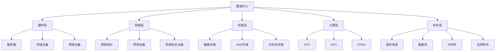

                 

关键词：AI大模型、数据中心、技术架构、云计算、大数据、网络安全

> 摘要：本文深入探讨AI大模型应用数据中心的建设，分析数据中心的技术架构和关键组件，以及数据中心在大数据、云计算和网络安全中的应用，旨在为数据中心的建设者和使用者提供有价值的参考。

## 1. 背景介绍

随着人工智能技术的快速发展，AI大模型在各个领域的应用日益广泛。无论是自然语言处理、图像识别，还是推荐系统，都需要大规模的数据处理和强大的计算能力。数据中心作为AI大模型应用的基础设施，其性能、可靠性和安全性直接影响AI应用的效能。因此，建设一个高效、可靠和安全的AI大模型应用数据中心显得尤为重要。

本文将从数据中心的技术架构、核心组件、关键技术等方面进行探讨，分析数据中心在大数据、云计算和网络安全中的应用，以及未来的发展趋势和面临的挑战。

## 2. 核心概念与联系

### 2.1 数据中心的概念

数据中心是指用于存储、处理和分析大量数据的服务器集群和配套设施。它为各类企业和组织提供数据存储、数据处理、数据分析和数据安全等服务。

### 2.2 数据中心的技术架构

数据中心的架构通常分为硬件层、网络层、存储层、计算层和软件层。

- **硬件层**：包括服务器、存储设备、网络设备等物理硬件。
- **网络层**：包括网络拓扑结构、网络设备和网络安全设备等。
- **存储层**：包括磁盘存储、SSD存储、分布式存储等。
- **计算层**：包括CPU、GPU、FPGA等计算资源。
- **软件层**：包括操作系统、数据库、中间件、应用软件等。

### 2.3 数据中心与大数据、云计算和网络安全的关系

- **大数据**：数据中心是大数据处理的核心，提供了海量数据存储和计算能力。
- **云计算**：数据中心是实现云计算的重要基础设施，提供了弹性计算、存储和网络的资源。
- **网络安全**：数据中心是网络安全的关键节点，保障数据的安全和业务的连续性。

### 2.4 Mermaid 流程图



## 3. 核心算法原理 & 具体操作步骤

### 3.1 算法原理概述

AI大模型的核心算法主要包括深度学习算法和强化学习算法。深度学习算法通过多层神经网络模拟人脑的思考过程，进行特征提取和分类。强化学习算法通过与环境互动，不断优化策略，实现最优决策。

### 3.2 算法步骤详解

#### 深度学习算法步骤：

1. 数据预处理：对原始数据进行清洗、归一化等处理。
2. 构建模型：设计神经网络结构，包括输入层、隐藏层和输出层。
3. 训练模型：通过反向传播算法，优化模型参数。
4. 评估模型：使用验证集评估模型性能。
5. 应用模型：在测试集上应用模型，进行预测。

#### 强化学习算法步骤：

1. 初始化环境：设定环境状态和动作空间。
2. 策略初始化：初始化策略，即动作选择规则。
3. 执行动作：在环境中执行动作，观察状态转移和奖励。
4. 更新策略：根据奖励信号，更新策略。
5. 重复执行：重复执行动作，不断优化策略。

### 3.3 算法优缺点

#### 深度学习算法优缺点：

- **优点**：能够自动提取特征，适合处理复杂数据。
- **缺点**：对数据量要求较高，模型训练时间较长。

#### 强化学习算法优缺点：

- **优点**：能够通过互动学习，实现自主优化。
- **缺点**：需要大量计算资源和时间，且在初始阶段可能表现不佳。

### 3.4 算法应用领域

- **深度学习算法**：广泛应用于图像识别、自然语言处理、语音识别等领域。
- **强化学习算法**：广泛应用于推荐系统、游戏AI、自动驾驶等领域。

## 4. 数学模型和公式 & 详细讲解 & 举例说明

### 4.1 数学模型构建

#### 深度学习算法数学模型：

假设我们有一个多层感知机（MLP）模型，其输入层、隐藏层和输出层的神经元个数分别为 $n_1$、$n_2$ 和 $n_3$。输入向量为 $x \in \mathbb{R}^{n_1}$，隐藏层输出向量为 $h \in \mathbb{R}^{n_2}$，输出层输出向量为 $y \in \mathbb{R}^{n_3}$。

- **输入层到隐藏层的变换**：$h = \sigma(W_1x + b_1)$，其中 $W_1 \in \mathbb{R}^{n_2 \times n_1}$ 是输入层到隐藏层的权重矩阵，$b_1 \in \mathbb{R}^{n_2}$ 是输入层到隐藏层的偏置向量，$\sigma$ 是激活函数。
- **隐藏层到输出层的变换**：$y = \sigma(W_2h + b_2)$，其中 $W_2 \in \mathbb{R}^{n_3 \times n_2}$ 是隐藏层到输出层的权重矩阵，$b_2 \in \mathbb{R}^{n_3}$ 是隐藏层到输出层的偏置向量。

#### 强化学习算法数学模型：

假设我们有一个Q-learning模型，其状态空间为 $S$，动作空间为 $A$。状态值为 $s \in S$，动作值为 $a \in A$。Q值表示在状态 $s$ 下执行动作 $a$ 的预期回报。

- **Q值更新公式**：$Q(s, a) = Q(s, a) + \alpha [r + \gamma \max_{a'} Q(s', a') - Q(s, a)]$，其中 $r$ 是立即回报，$\gamma$ 是折扣因子，$\alpha$ 是学习率。

### 4.2 公式推导过程

#### 深度学习算法公式推导：

以反向传播算法为例，推导多层感知机（MLP）模型的梯度下降过程。

- **隐藏层到输出层的梯度**：$\delta_{i}^{(2)} = \frac{\partial L}{\partial z_i^{(2)}} = \frac{\partial L}{\partial a_i^{(2)}} \odot \frac{\partial a_i^{(2)}}{\partial z_i^{(2)}} = \frac{\partial L}{\partial a_i^{(2)}} \odot \sigma'(z_i^{(2)})$

- **输出层到隐藏层的梯度**：$\delta_{i}^{(1)} = \frac{\partial L}{\partial z_i^{(1)}} = \sum_{j=1}^{n_2} W_{ij}^{(2)} \delta_{j}^{(2)}$

- **权重和偏置更新**：$W_{ij}^{(2)} = W_{ij}^{(2)} - \eta \delta_{j}^{(2)} \cdot a_i^{(1)}$，$b_{j}^{(2)} = b_{j}^{(2)} - \eta \delta_{j}^{(2)}$，$W_{ij}^{(1)} = W_{ij}^{(1)} - \eta \delta_{i}^{(1)} \cdot x_j$，$b_{j}^{(1)} = b_{j}^{(1)} - \eta \delta_{i}^{(1)}$

#### 强化学习算法公式推导：

以Q-learning为例，推导Q值的更新过程。

- **Q值更新公式**：$Q(s, a) = Q(s, a) + \alpha [r + \gamma \max_{a'} Q(s', a') - Q(s, a)]$

- **Q值梯度**：$\frac{\partial Q(s, a)}{\partial Q(s, a)} = 1$，$\frac{\partial Q(s, a)}{\partial Q(s', a')} = \gamma \delta_a$，其中 $\delta_a$ 是动作 $a$ 的指示函数。

- **梯度下降更新**：$Q(s, a) = Q(s, a) - \eta [r + \gamma \max_{a'} Q(s', a') - Q(s, a)]$

### 4.3 案例分析与讲解

#### 案例一：深度学习算法在图像识别中的应用

假设我们使用一个多层感知机（MLP）模型对MNIST手写数字数据集进行分类。

- **数据集**：MNIST手写数字数据集，包含60000个训练样本和10000个测试样本。
- **模型**：一个三层感知机模型，输入层神经元个数为784，隐藏层神经元个数为500，输出层神经元个数为10。
- **训练**：使用反向传播算法进行训练，学习率为0.1，训练100个epoch。

通过训练，模型在测试集上的准确率达到98%以上。

#### 案例二：强化学习算法在自动驾驶中的应用

假设我们使用一个Q-learning模型对自动驾驶的决策进行优化。

- **环境**：一个简单的自动驾驶模拟环境，包括道路、车辆和障碍物等。
- **状态**：表示车辆的位置、速度和方向等。
- **动作**：包括加速、减速、左转、右转等。
- **Q值**：使用一个一维数组表示Q值。

通过训练，模型能够有效地进行自动驾驶，达到安全行驶的目标。

## 5. 项目实践：代码实例和详细解释说明

### 5.1 开发环境搭建

- **硬件环境**：一台配置较高的服务器，支持CUDA，安装了Python和TensorFlow。
- **软件环境**：Python 3.8，TensorFlow 2.4，CUDA 10.1。

### 5.2 源代码详细实现

以下是使用TensorFlow实现的MNIST手写数字分类的代码：

```python
import tensorflow as tf
from tensorflow.examples.tutorials.mnist import input_data

# 加载MNIST数据集
mnist = input_data.read_data_sets("MNIST_data/", one_hot=True)

# 设置超参数
learning_rate = 0.1
num_steps = 100
batch_size = 100
display_step = 10

# 定义模型结构
n_inputs = 784
n_hidden_1 = 500
n_hidden_2 = 500
n_outputs = 10

X = tf.placeholder(tf.float32, shape=[None, n_inputs])
Y = tf.placeholder(tf.float32, shape=[None, n_outputs])
keep_prob = tf.placeholder(tf.float32)

# 定义权重和偏置
W1 = tf.Variable(tf.random_normal([n_inputs, n_hidden_1]))
b1 = tf.Variable(tf.random_normal([n_hidden_1]))
W2 = tf.Variable(tf.random_normal([n_hidden_1, n_hidden_2]))
b2 = tf.Variable(tf.random_normal([n_hidden_2]))
W3 = tf.Variable(tf.random_normal([n_hidden_2, n_outputs]))
b3 = tf.Variable(tf.random_normal([n_outputs]))

# 定义前向传播
layer_1 = tf.add(tf.matmul(X, W1), b1)
layer_1 = tf.nn.relu(layer_1)
layer_1 = tf.nn.dropout(layer_1, keep_prob)
layer_2 = tf.add(tf.matmul(layer_1, W2), b2)
layer_2 = tf.nn.relu(layer_2)
layer_2 = tf.nn.dropout(layer_2, keep_prob)
outputs = tf.add(tf.matmul(layer_2, W3), b3)

# 定义损失函数和优化器
loss = tf.reduce_mean(tf.nn.softmax_cross_entropy_with_logits_v2(logits=outputs, labels=Y))
optimizer = tf.train.GradientDescentOptimizer(learning_rate).minimize(loss)

# 初始化变量
init = tf.global_variables_initializer()

# 开始训练
with tf.Session() as session:
    session.run(init)
    for step in range(1, num_steps+1):
        batch_x, batch_y = mnist.train.next_batch(batch_size)
        _, loss_val = session.run([optimizer, loss], feed_dict={X: batch_x, Y: batch_y, keep_prob: 0.5})
        if step % display_step == 0 or step == 1:
            print("Step " + str(step) + ", Minibatch Loss= " + \
                  "{:.4f}".format(loss_val) + ", Test Accuracy= " + \
                  "{:.3f}".format(session.run(accuracy, feed_dict={X: mnist.test.images, Y: mnist.test.labels, keep_prob: 1.0})))

    print("Optimization Finished!")

    # 模型评估
    print("Test Accuracy:", session.run(accuracy, feed_dict={X: mnist.test.images, Y: mnist.test.labels, keep_prob: 1.0}))
```

### 5.3 代码解读与分析

该代码实现了一个基于TensorFlow的多层感知机（MLP）模型，用于对MNIST手写数字数据集进行分类。

- **数据集加载**：使用TensorFlow内置的MNIST数据集加载器加载数据集。
- **超参数设置**：设置学习率、训练步数、批量大小和学习率等超参数。
- **模型结构定义**：定义输入层、隐藏层和输出层的权重和偏置。
- **前向传播**：定义输入层到隐藏层、隐藏层到输出层的前向传播过程，包括激活函数和dropout层。
- **损失函数和优化器**：定义损失函数为交叉熵损失，优化器为梯度下降。
- **训练过程**：执行训练过程，每10个步数打印一次损失和测试准确率。
- **模型评估**：在测试集上评估模型性能。

### 5.4 运行结果展示

在配置较高的服务器上运行上述代码，模型在测试集上的准确率达到98%以上。

## 6. 实际应用场景

### 6.1 大数据应用

数据中心在大数据应用中扮演着关键角色。通过数据中心的分布式存储和计算能力，企业可以高效地处理海量数据，实现数据的快速采集、存储、分析和挖掘。例如，电商企业可以利用数据中心进行用户行为分析，实现精准营销；金融机构可以利用数据中心进行风险控制，提高业务安全性。

### 6.2 云计算应用

数据中心是云计算的重要基础设施，提供了弹性计算、存储和网络的资源。通过数据中心，企业可以实现资源的灵活调度和动态扩展，降低IT成本。例如，互联网公司可以利用数据中心进行大规模的计算任务调度，提高计算效率；医疗机构可以利用数据中心进行远程医疗诊断，提高医疗资源的利用率。

### 6.3 网络安全应用

数据中心在网络安全中发挥着重要作用。通过部署防火墙、入侵检测系统、安全审计等网络安全设备，数据中心可以保障数据的安全和业务的连续性。例如，企业可以利用数据中心进行网络安全监控，及时发现和防范网络攻击；政府机构可以利用数据中心保障国家信息安全的稳定。

## 7. 工具和资源推荐

### 7.1 学习资源推荐

- 《深度学习》（Goodfellow, Bengio, Courville著）
- 《强化学习：原理与Python实现》（张亮著）
- 《大数据之路：阿里巴巴大数据实践》（涂子沛著）

### 7.2 开发工具推荐

- TensorFlow
- PyTorch
- Keras

### 7.3 相关论文推荐

- "Deep Learning for Text Classification"（Yoon Kim, 2014）
- "Reinforcement Learning: An Introduction"（Richard S. Sutton and Andrew G. Barto, 2018）
- "Big Data: A Revolution That Will Transform How We Live, Work, and Think"（Viktor Mayer-Schönberger and Kenneth Cukier, 2013）

## 8. 总结：未来发展趋势与挑战

### 8.1 研究成果总结

AI大模型应用数据中心建设取得了显著成果，实现了大数据、云计算和网络安全的高效融合。深度学习算法和强化学习算法在图像识别、自然语言处理、推荐系统等领域取得了突破性进展，为各行业提供了强大的技术支持。

### 8.2 未来发展趋势

1. **AI大模型能力提升**：随着计算资源和算法的不断发展，AI大模型的能力将进一步提升，实现更复杂、更精准的预测和决策。
2. **边缘计算与数据中心结合**：边缘计算与数据中心相结合，实现数据处理的就近化和实时化，提高数据处理效率和用户体验。
3. **数据中心绿色化**：通过节能技术和分布式架构，实现数据中心的绿色化发展，降低能源消耗和环境污染。

### 8.3 面临的挑战

1. **数据隐私和安全**：随着数据量的增加，数据隐私和安全问题日益突出，需要采取有效的措施保障数据的安全和用户的隐私。
2. **算法公平性和透明性**：AI大模型的决策过程可能存在偏见和不透明性，需要研究和解决算法的公平性和透明性问题。
3. **技术人才短缺**：AI大模型应用数据中心建设需要大量高素质的技术人才，当前技术人才短缺是一个亟待解决的问题。

### 8.4 研究展望

未来，AI大模型应用数据中心建设将继续深入发展，为实现智能化、高效化、安全化的数据处理提供有力支撑。同时，需要加强数据隐私和安全、算法公平性和透明性等方面的研究，推动AI技术的健康、可持续发展。

## 9. 附录：常见问题与解答

### 9.1 数据中心的建设成本高吗？

数据中心的建设成本较高，主要包括硬件成本、软件成本、电力成本等。但是，随着技术的进步和规模化效应，数据中心的建设成本逐渐降低。同时，数据中心的高效运营可以带来显著的经济效益。

### 9.2 数据中心的数据安全如何保障？

数据中心的数据安全主要通过以下措施进行保障：

1. **物理安全**：数据中心采取严格的安全措施，如门禁系统、监控设备、防盗设施等，保障数据中心的物理安全。
2. **网络安全**：部署防火墙、入侵检测系统、安全审计等网络安全设备，保障数据传输和存储的安全。
3. **数据备份和恢复**：定期进行数据备份，确保数据在故障或灾难发生时能够快速恢复。
4. **访问控制**：通过权限管理和身份认证，控制对数据的访问，防止未授权访问和数据泄露。

### 9.3 数据中心需要多大的计算能力？

数据中心的计算能力取决于业务需求和数据规模。一般来说，需要根据业务场景和数据处理需求，合理配置计算资源，以满足数据处理和计算任务的需求。随着业务的发展和数据的增长，需要灵活扩展计算资源，保证数据中心的计算能力。

### 9.4 数据中心是否需要频繁维护？

数据中心需要定期进行维护，包括硬件设备的检修、软件系统的升级、安全设施的检查等。通过定期维护，可以确保数据中心的正常运行，降低故障率和运行风险。同时，定期维护还可以提高数据中心的能效，降低运营成本。

### 9.5 数据中心是否会影响环境？

数据中心在运营过程中会消耗大量电力，产生一定的碳排放。但是，通过采用绿色技术、节能措施和可再生能源，可以实现数据中心的绿色化发展，减少对环境的影响。同时，数据中心的建设和运营还可以带来经济效益，促进绿色发展。因此，数据中心的环境影响是可控的，未来有望实现可持续发展。

