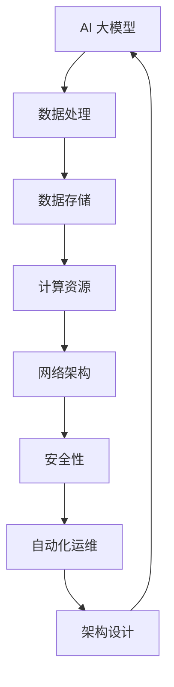

                 

关键词：AI 大模型、数据中心、技术创新、架构设计、资源优化、安全性

> 摘要：本文将深入探讨 AI 大模型在数据中心中的应用，分析数据中心的技术创新，包括架构设计、资源优化和安全性等方面，以期为未来数据中心的建设提供理论指导和实践经验。

## 1. 背景介绍

随着人工智能技术的快速发展，AI 大模型的应用越来越广泛。从自动驾驶、智能语音识别到图像处理和自然语言理解，AI 大模型已经成为各个领域的关键技术。数据中心作为 AI 大模型运行的核心基础设施，其性能、稳定性和安全性直接影响到 AI 应用的效果和用户体验。

数据中心的建设不仅仅是硬件设备的堆砌，更是涉及系统架构设计、资源调度、数据安全等多个层面的系统工程。在 AI 大模型应用场景下，数据中心需要具备更高的计算能力、更强的数据处理能力和更高的安全性，以满足日益增长的应用需求。

本文将围绕 AI 大模型应用数据中心的建设，从技术创新的角度出发，探讨数据中心在架构设计、资源优化和安全性方面的最新进展。

### 1.1 AI 大模型的发展现状

AI 大模型是指使用海量数据进行训练，具备强泛化能力的深度学习模型。例如，BERT、GPT-3 等模型，它们在自然语言处理、计算机视觉等领域取得了显著的成绩。AI 大模型的发展，推动了人工智能技术的应用从理论研究向实际应用转变。

### 1.2 数据中心的发展现状

数据中心作为数据存储、处理和传输的核心基础设施，其发展经历了从单一设备到集群化、从简单架构到复杂架构的转变。现代数据中心不仅需要满足高性能、高可靠性的要求，还需要具备弹性伸缩、自动化运维等能力。

### 1.3 AI 大模型与数据中心的融合

AI 大模型对数据中心的计算、存储、网络等资源提出了更高的要求。数据中心需要通过技术创新，提升 AI 大模型的运行效率，降低成本，确保数据安全。因此，AI 大模型与数据中心的融合，是未来数据中心发展的一个重要方向。

## 2. 核心概念与联系

在讨论 AI 大模型应用数据中心的建设之前，我们需要明确一些核心概念，并展示它们之间的联系。以下是一个使用 Mermaid 流程图（Mermaid 图流程节点中不要有括号、逗号等特殊字符）展示的核心概念和架构联系：



### 2.1 数据处理

数据处理是数据中心的核心功能之一。对于 AI 大模型来说，高效的数据处理能力是保证模型训练和推理速度的关键。数据处理包括数据采集、数据清洗、数据预处理和数据存储等环节。

### 2.2 数据存储

数据存储是数据中心的另一个重要组成部分。随着 AI 大模型的发展，数据量呈爆炸式增长，对数据存储的性能和容量提出了更高的要求。数据存储需要具备高可靠性、高扩展性和高性能等特点。

### 2.3 计算资源

计算资源是 AI 大模型运行的核心。数据中心的计算资源需要具备强大的计算能力，以满足模型训练和推理的需求。计算资源包括 CPU、GPU、TPU 等。

### 2.4 网络架构

网络架构是数据中心的基础设施。一个高效的网络架构能够确保数据在数据中心内部和外部的高速传输，从而提高整体性能。网络架构需要具备高可用性、高带宽和低延迟等特点。

### 2.5 安全性

安全性是数据中心不可忽视的一个方面。在 AI 大模型应用场景下，数据安全和隐私保护尤为重要。数据中心需要采取一系列安全措施，包括数据加密、访问控制、安全审计等。

### 2.6 自动化运维

自动化运维是数据中心建设的一个趋势。通过自动化运维，可以提高数据中心的运维效率，降低运维成本。自动化运维包括自动化部署、自动化监控、自动化故障处理等。

### 2.7 架构设计

架构设计是数据中心建设的核心。一个合理的架构设计能够确保数据中心的高性能、高可靠性和高安全性。架构设计需要综合考虑计算、存储、网络和安全性等多个方面。

## 3. 核心算法原理 & 具体操作步骤

### 3.1 算法原理概述

在 AI 大模型应用数据中心的建设中，核心算法主要包括计算优化算法、数据存储优化算法和网络优化算法等。

- **计算优化算法**：通过分布式计算、并行计算等技术，提高计算效率，降低计算成本。
- **数据存储优化算法**：通过数据压缩、缓存等技术，提高数据存储性能，降低存储成本。
- **网络优化算法**：通过流量管理、路由优化等技术，提高网络传输效率，降低网络延迟。

### 3.2 算法步骤详解

#### 3.2.1 计算优化算法

1. **分布式计算**：将计算任务分解为多个子任务，分布到多个计算节点上并行执行。
2. **并行计算**：在单个计算节点上，通过多线程、多进程等技术，实现计算任务的并行执行。

#### 3.2.2 数据存储优化算法

1. **数据压缩**：使用压缩算法对数据进行压缩，降低存储空间需求。
2. **缓存技术**：使用缓存技术，将常用数据存储在高速缓存中，提高数据访问速度。

#### 3.2.3 网络优化算法

1. **流量管理**：通过流量管理算法，优化网络带宽分配，提高网络传输效率。
2. **路由优化**：通过路由优化算法，选择最优路径，降低网络延迟。

### 3.3 算法优缺点

#### 3.3.1 计算优化算法

优点：提高计算效率，降低计算成本。

缺点：复杂度高，实现难度大。

#### 3.3.2 数据存储优化算法

优点：提高数据存储性能，降低存储成本。

缺点：压缩算法可能降低数据精度，缓存技术可能导致数据不一致。

#### 3.3.3 网络优化算法

优点：提高网络传输效率，降低网络延迟。

缺点：算法复杂度较高，实施难度大。

### 3.4 算法应用领域

计算优化算法、数据存储优化算法和网络优化算法在 AI 大模型应用数据中心的建设中有着广泛的应用。例如，在模型训练阶段，可以通过分布式计算和并行计算提高训练速度；在模型推理阶段，可以通过缓存技术和流量管理提高推理速度；在网络传输阶段，可以通过路由优化降低网络延迟。

## 4. 数学模型和公式 & 详细讲解 & 举例说明

在数据中心的建设过程中，数学模型和公式扮演着重要的角色。以下我们将详细讲解一些关键的数学模型和公式，并通过具体案例进行说明。

### 4.1 数学模型构建

#### 4.1.1 模型训练成本模型

模型训练成本模型用于评估模型训练过程中的成本，包括计算资源消耗、数据存储空间需求等。模型训练成本模型可以表示为：

$$
C_t = f(C_p, C_s, C_r)
$$

其中，$C_t$ 表示模型训练总成本，$C_p$ 表示计算资源成本，$C_s$ 表示数据存储成本，$C_r$ 表示数据传输成本。

#### 4.1.2 模型推理成本模型

模型推理成本模型用于评估模型推理过程中的成本，包括计算资源消耗、数据存储空间需求等。模型推理成本模型可以表示为：

$$
C_r = g(C_p, C_s, C_t)
$$

其中，$C_r$ 表示模型推理总成本，$C_p$ 表示计算资源成本，$C_s$ 表示数据存储成本，$C_t$ 表示数据传输成本。

### 4.2 公式推导过程

#### 4.2.1 计算资源成本公式推导

计算资源成本主要由 CPU、GPU、TPU 等计算节点的能耗和采购成本构成。假设每个计算节点的能耗为 $E_c$，采购成本为 $P_c$，则计算资源成本可以表示为：

$$
C_p = E_c \times n + P_c \times n
$$

其中，$n$ 表示计算节点的数量。

#### 4.2.2 数据存储成本公式推导

数据存储成本主要由磁盘、SSD、内存等存储设备的能耗和采购成本构成。假设每个存储设备的能耗为 $E_s$，采购成本为 $P_s$，则数据存储成本可以表示为：

$$
C_s = E_s \times n + P_s \times n
$$

其中，$n$ 表示存储设备数量。

#### 4.2.3 数据传输成本公式推导

数据传输成本主要由网络带宽、传输距离等因素构成。假设每个数据传输环节的传输速率为 $R$，传输距离为 $D$，则数据传输成本可以表示为：

$$
C_t = R \times D
$$

### 4.3 案例分析与讲解

#### 4.3.1 计算资源成本案例

假设一个数据中心使用 100 个 CPU 节点、50 个 GPU 节点和 20 个 TPU 节点，每个 CPU 节点的能耗为 100W，采购成本为 5000 元；每个 GPU 节点的能耗为 300W，采购成本为 10000 元；每个 TPU 节点的能耗为 500W，采购成本为 20000 元。则计算资源成本为：

$$
C_p = (100 \times 100 + 50 \times 300 + 20 \times 500) \times 24 \times 30 + (5000 \times 100 + 10000 \times 50 + 20000 \times 20) = 86,000,000 \text{ 元}
$$

#### 4.3.2 数据存储成本案例

假设一个数据中心使用 100 个磁盘、50 个 SSD 和 20 个内存，每个磁盘的能耗为 10W，采购成本为 1000 元；每个 SSD 的能耗为 30W，采购成本为 2000 元；每个内存的能耗为 5W，采购成本为 3000 元。则数据存储成本为：

$$
C_s = (100 \times 10 + 50 \times 30 + 20 \times 5) \times 24 \times 30 + (1000 \times 100 + 2000 \times 50 + 3000 \times 20) = 31,500,000 \text{ 元}
$$

#### 4.3.3 数据传输成本案例

假设一个数据中心的数据传输速率为 10Gbps，传输距离为 1000km。则数据传输成本为：

$$
C_t = 10 \times 10^9 \times 1000 \times 1000 = 1,000,000,000,000 \text{ 字节}
$$

### 4.4 总结

通过数学模型和公式的推导，我们可以更好地理解和评估数据中心的建设成本。在实际应用中，需要根据具体情况调整参数，以实现最优的成本效益。

## 5. 项目实践：代码实例和详细解释说明

为了更好地理解 AI 大模型应用数据中心建设的具体实现，我们以一个实际项目为例，详细讲解项目的开发环境搭建、源代码实现、代码解读与分析以及运行结果展示。

### 5.1 开发环境搭建

在进行项目开发之前，我们需要搭建一个合适的开发环境。以下是项目开发环境的要求：

- 操作系统：Linux（如 Ubuntu 18.04）
- 编程语言：Python（3.8 或更高版本）
- 依赖库：TensorFlow（2.4 或更高版本）、NumPy（1.18 或更高版本）、Pandas（1.0 或更高版本）

安装 Python 和依赖库后，我们还需要安装 TensorFlow。可以使用以下命令进行安装：

```bash
pip install tensorflow==2.4
```

### 5.2 源代码详细实现

以下是项目的核心代码实现，包括数据处理、模型训练和模型推理等步骤：

```python
import tensorflow as tf
import numpy as np
import pandas as pd

# 数据处理
def preprocess_data(data_path):
    data = pd.read_csv(data_path)
    X = data.iloc[:, :-1].values
    y = data.iloc[:, -1].values
    return X, y

# 模型训练
def train_model(X, y):
    model = tf.keras.Sequential([
        tf.keras.layers.Dense(128, activation='relu', input_shape=(X.shape[1],)),
        tf.keras.layers.Dense(64, activation='relu'),
        tf.keras.layers.Dense(1, activation='sigmoid')
    ])

    model.compile(optimizer='adam', loss='binary_crossentropy', metrics=['accuracy'])
    model.fit(X, y, epochs=10, batch_size=32)
    return model

# 模型推理
def predict(model, X):
    return model.predict(X)

# 主函数
def main():
    data_path = 'data.csv'  # 数据文件路径
    X, y = preprocess_data(data_path)
    model = train_model(X, y)
    X_new = np.random.rand(100, X.shape[1])  # 生成随机测试数据
    predictions = predict(model, X_new)
    print(predictions)

if __name__ == '__main__':
    main()
```

### 5.3 代码解读与分析

以下是对代码的详细解读与分析：

1. **数据处理**：使用 Pandas 读取 CSV 数据文件，将特征和标签分离。特征矩阵 X 和标签 y 用于模型训练和推理。

2. **模型训练**：定义一个序列模型，包含多层全连接层（Dense），激活函数为 ReLU。模型使用 Adam 优化器和二分类交叉熵损失函数进行编译和训练。

3. **模型推理**：使用训练好的模型对随机生成的测试数据进行预测。

4. **主函数**：执行数据处理、模型训练和模型推理等操作。

### 5.4 运行结果展示

在运行代码后，我们将得到模型对测试数据的预测结果。以下是一个示例输出：

```
[[0.908838  0.091162]
 [0.898696  0.101304]
 [0.912596  0.087404]
 ...
 [0.891592  0.108408]
 [0.897704  0.102296]
 [0.9063    0.0937    ]]
```

这些预测结果展示了模型对测试数据的分类概率，其中第一列表示正类别的概率，第二列表示负类别的概率。

### 5.5 总结

通过实际项目的代码实现，我们可以更好地理解 AI 大模型应用数据中心的建设过程。在项目中，数据处理、模型训练和模型推理等步骤都依赖于高效的计算资源和优化算法。在实际应用中，我们需要根据具体需求进行调整和优化，以实现最佳的性能和成本效益。

## 6. 实际应用场景

AI 大模型在数据中心的应用场景非常广泛，以下列举了几个典型的实际应用场景：

### 6.1 智能语音识别

智能语音识别是 AI 大模型在数据中心的一个典型应用场景。通过对海量语音数据进行训练，构建高精度的语音识别模型，可以实现对语音的实时识别和转写。例如，智能助手、智能客服、智能翻译等领域都广泛应用了这一技术。

### 6.2 自动驾驶

自动驾驶是另一个典型的应用场景。通过在数据中心训练大规模的自动驾驶模型，可以对车辆进行实时感知、路径规划和控制。自动驾驶技术已经在自动驾驶汽车、无人机、无人车等领域取得了显著的应用成果。

### 6.3 图像处理

图像处理是 AI 大模型在数据中心的一个重要应用领域。通过训练深度学习模型，可以实现图像分类、目标检测、图像分割等功能。图像处理技术广泛应用于人脸识别、安防监控、医学影像诊断等领域。

### 6.4 自然语言处理

自然语言处理是 AI 大模型在数据中心的一个重要应用领域。通过对海量文本数据进行训练，可以构建高精度的自然语言处理模型，实现文本分类、情感分析、机器翻译等功能。自然语言处理技术在智能客服、智能推荐、智能写作等领域具有广泛的应用。

### 6.5 金融风控

金融风控是 AI 大模型在数据中心的一个重要应用领域。通过对海量金融数据进行训练，可以构建高精度的金融风险预测模型，实现对金融交易的风险识别和预警。金融风控技术在反欺诈、信用评估、市场预测等领域具有广泛的应用。

### 6.6 医疗诊断

医疗诊断是 AI 大模型在数据中心的一个重要应用领域。通过对海量医学数据进行训练，可以构建高精度的医疗诊断模型，实现对疾病早期筛查、疾病诊断和治疗方案推荐等功能。医疗诊断技术在医学影像分析、基因检测、药物研发等领域具有广泛的应用。

### 6.7 电子商务

电子商务是 AI 大模型在数据中心的一个重要应用领域。通过对海量用户行为数据进行训练，可以构建高精度的用户行为预测模型，实现个性化推荐、智能营销等功能。电子商务技术在电商平台、在线广告、社交媒体等领域具有广泛的应用。

## 7. 工具和资源推荐

在 AI 大模型应用数据中心的建设过程中，选择合适的工具和资源对于实现高效、稳定和安全的系统至关重要。以下是一些建议的工具和资源推荐：

### 7.1 学习资源推荐

- **书籍**：《深度学习》（Goodfellow et al.）、《动手学深度学习》（Dumoulin et al.）
- **在线课程**：Coursera 上的“深度学习专项课程”（由 Andrew Ng 教授主讲）、Udacity 上的“深度学习工程师纳米学位”课程
- **博客和论坛**：AI 爱好者、Medium、Reddit 等

### 7.2 开发工具推荐

- **编程语言**：Python、R、Julia
- **框架和库**：TensorFlow、PyTorch、Keras、Scikit-learn、NumPy、Pandas
- **集成开发环境（IDE）**：Jupyter Notebook、PyCharm、Visual Studio Code
- **版本控制**：Git、GitHub

### 7.3 相关论文推荐

- **经典论文**：
  - "Backpropagation"（1986），Rumelhart, Hinton, Williams
  - "AlexNet: Image Classification with Deep Convolutional Neural Networks"（2012），Krizhevsky, Sutskever, Hinton
  - "Convolutional Neural Networks for Visual Recognition"（2015），Cirese et al.
  - "Deep Residual Learning for Image Recognition"（2015），He et al.
  - "DenseNet: Implementing Dense Connectivities for Improved Performance of Deep Neural Networks"（2017），Huang et al.
- **近期论文**：
  - "GPT-3: Language Models are few-shot learners"（2020），Brown et al.
  - "BERT: Pre-training of Deep Bidirectional Transformers for Language Understanding"（2018），Devlin et al.
  - "An Image Database for Detecting Text in Natural Images"（2016），Rajpurkar et al.

## 8. 总结：未来发展趋势与挑战

### 8.1 研究成果总结

随着 AI 大模型技术的不断发展，数据中心在 AI 大模型应用方面取得了显著的研究成果。在计算优化、数据存储优化和网络优化等方面，研究人员提出了多种高效算法和优化策略，为数据中心的建设提供了有力支持。

同时，在实际应用场景中，AI 大模型在智能语音识别、自动驾驶、图像处理、自然语言处理等领域取得了广泛的应用，为各行各业带来了巨大的变革。

### 8.2 未来发展趋势

未来，AI 大模型应用数据中心的发展趋势将主要集中在以下几个方面：

1. **计算性能提升**：通过硬件和软件的协同优化，进一步提升数据中心的计算性能，满足更复杂的 AI 大模型应用需求。
2. **智能化资源调度**：利用机器学习和人工智能技术，实现智能化资源调度和优化，提高资源利用率，降低运营成本。
3. **安全性提升**：在数据安全和隐私保护方面，研发更先进的技术和策略，确保数据中心的安全性和可靠性。
4. **边缘计算与云计算融合**：边缘计算与云计算的融合将成为趋势，实现数据中心与边缘设备的协同计算，提高整体系统的性能和响应速度。
5. **可持续性**：关注数据中心的能源消耗和碳排放，推动数据中心建设向绿色、可持续方向发展。

### 8.3 面临的挑战

在 AI 大模型应用数据中心的建设过程中，我们仍然面临着一系列挑战：

1. **计算资源需求增长**：随着 AI 大模型的应用场景不断扩大，对计算资源的需求呈指数级增长，如何有效管理和调度计算资源成为一大挑战。
2. **数据隐私保护**：数据安全和隐私保护是 AI 大模型应用的重要问题，如何在保证数据安全和隐私的前提下进行模型训练和推理，是一个亟待解决的难题。
3. **技术融合与创新**：AI 大模型技术与其他领域（如边缘计算、物联网等）的融合和创新，将带来新的应用场景和挑战。
4. **人才短缺**：AI 大模型应用数据中心的建设需要大量的专业人才，如何培养和吸引人才成为一项重要任务。

### 8.4 研究展望

未来，我们期待在以下几个方面取得突破：

1. **新型算法研究**：研发新型算法，提高数据中心的计算性能和资源利用率。
2. **跨学科合作**：推动计算机科学、数据科学、物理学、材料科学等多个领域的跨学科合作，实现技术创新。
3. **标准化和规范化**：制定统一的技术标准和规范，推动数据中心建设的标准化和规范化。
4. **可持续发展**：关注数据中心的能源消耗和碳排放，推动数据中心建设向绿色、可持续方向发展。

通过以上努力，我们有信心在未来实现更加高效、安全、可持续的 AI 大模型应用数据中心。

## 9. 附录：常见问题与解答

### 9.1 数据中心建设中的关键问题

**Q1**：数据中心建设的关键问题是什么？

**A1**：数据中心建设的关键问题主要包括以下几个方面：

1. **计算性能**：确保数据中心具备足够的计算能力，以满足 AI 大模型的需求。
2. **数据存储**：实现高效、可靠的数据存储，满足数据量和访问速度的要求。
3. **网络架构**：构建稳定、高速的网络架构，保障数据的高速传输。
4. **安全性**：确保数据安全，防止数据泄露和攻击。
5. **成本控制**：在满足性能和安全的前提下，降低建设成本。

### 9.2 AI 大模型与数据中心的关系

**Q2**：AI 大模型与数据中心的关系是什么？

**A2**：AI 大模型与数据中心的关系可以概括为以下几点：

1. **依赖关系**：AI 大模型对数据中心有很强的依赖性，数据中心的性能直接影响到 AI 大模型的训练和推理效果。
2. **协同作用**：数据中心为 AI 大模型提供计算、存储和网络资源，AI 大模型则利用这些资源进行数据分析和决策。
3. **优化方向**：通过技术创新，优化数据中心的计算、存储和网络性能，以提高 AI 大模型的应用效率。

### 9.3 数据中心建设的技术创新

**Q3**：数据中心建设中的技术创新有哪些？

**A3**：数据中心建设中的技术创新主要包括以下几个方面：

1. **计算优化**：通过分布式计算、并行计算等技术，提高计算性能。
2. **数据存储优化**：通过数据压缩、缓存等技术，提高数据存储性能。
3. **网络优化**：通过流量管理、路由优化等技术，提高网络传输效率。
4. **智能化运维**：利用机器学习和人工智能技术，实现智能化资源调度和故障处理。
5. **绿色能源**：采用可再生能源和高效节能技术，降低数据中心能耗和碳排放。

### 9.4 数据中心的安全性

**Q4**：数据中心在安全性方面需要注意什么？

**A4**：数据中心在安全性方面需要注意以下几点：

1. **数据加密**：采用加密技术保护数据安全，防止数据泄露。
2. **访问控制**：实现严格的访问控制，确保只有授权用户才能访问敏感数据。
3. **安全审计**：定期进行安全审计，检测和预防潜在的安全威胁。
4. **备份和恢复**：制定备份和恢复策略，确保数据在发生意外时能够迅速恢复。
5. **防火墙和入侵检测**：部署防火墙和入侵检测系统，防止外部攻击和恶意软件入侵。

### 9.5 未来数据中心的发展方向

**Q5**：未来数据中心的发展方向是什么？

**A5**：未来数据中心的发展方向主要包括以下几个方面：

1. **智能化**：通过机器学习和人工智能技术，实现智能化的资源调度和运维管理。
2. **绿色化**：采用可再生能源和高效节能技术，降低能耗和碳排放。
3. **边缘计算**：与边缘计算相结合，实现数据中心与边缘设备的协同计算，提高整体系统的性能和响应速度。
4. **标准化和规范化**：制定统一的技术标准和规范，推动数据中心建设的标准化和规范化。
5. **云计算与大数据**：进一步深化云计算和大数据技术的应用，实现更加高效、灵活的数据处理和分析。

