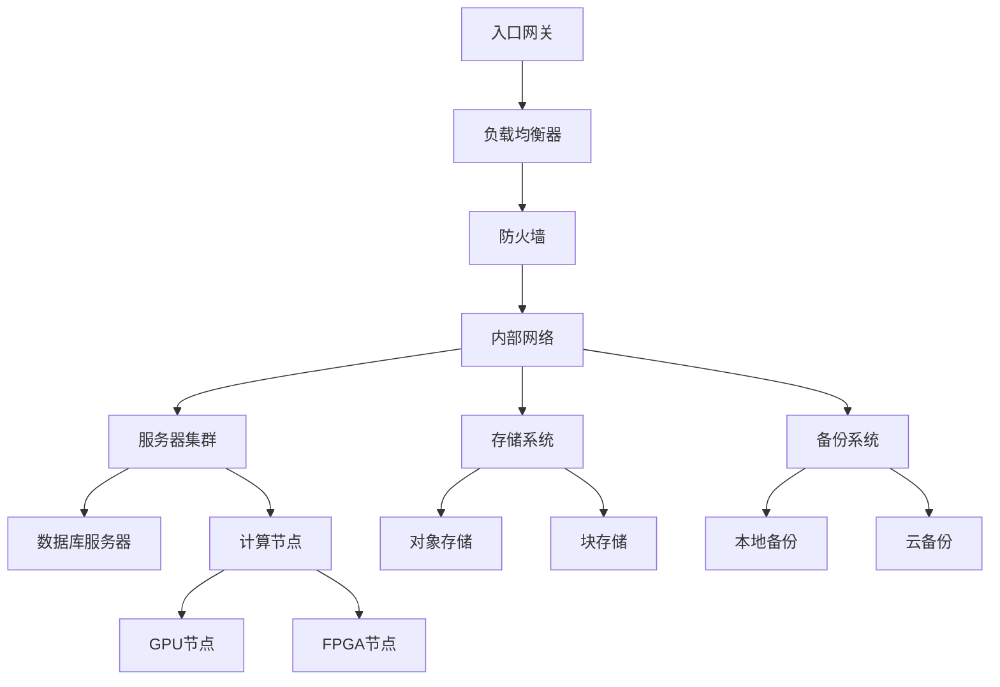
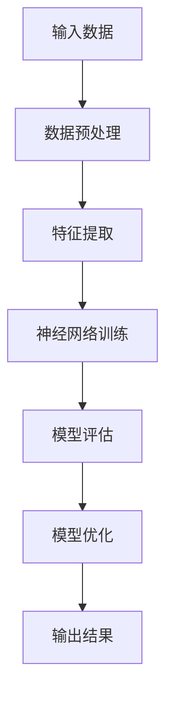
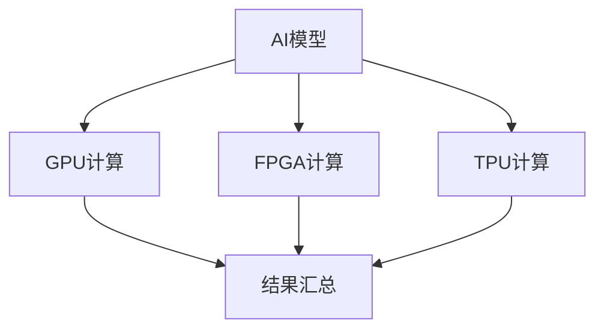

                 

关键词：AI大模型、数据中心建设、技术创新、数据中心架构、算法优化、硬件加速、数据隐私保护、能源效率、云计算、边缘计算、未来展望

> 摘要：本文详细探讨了AI大模型应用数据中心的建设策略和技术创新。通过分析数据中心在AI大模型应用中的关键角色，本文探讨了数据中心架构的优化、算法原理与操作步骤、数学模型与公式、实际应用案例以及未来发展趋势与面临的挑战。

## 1. 背景介绍

随着人工智能技术的快速发展，AI大模型如深度学习网络、生成对抗网络（GANs）等在各个领域得到了广泛应用。这些模型通常需要大量计算资源来训练和部署，因此数据中心作为计算资源的集中地，承担了至关重要的角色。数据中心的建设和优化直接影响到AI大模型的应用效率和效果。

数据中心（Data Center）是指一种集中存储、处理、传输和管理数据的设施，为互联网、云计算、大数据应用等提供基础设施支持。随着AI大模型的应用需求增加，数据中心的建设面临诸多挑战，如计算能力需求增长、数据存储容量扩展、网络传输速度提升等。

本文将从以下几个方面展开讨论：

- 数据中心在AI大模型应用中的关键角色和挑战
- 数据中心技术创新，包括架构优化、算法优化、硬件加速、数据隐私保护、能源效率提升等
- 数据中心的技术架构与核心概念联系
- 核心算法原理与操作步骤
- 数学模型与公式及其应用
- 实际应用案例
- 未来发展趋势与面临的挑战

## 2. 核心概念与联系

### 2.1 数据中心架构

数据中心架构是数据中心建设和运营的核心。一个高效的数据中心架构应具备良好的扩展性、可靠性和安全性。

**Mermaid 流程图（数据中心的典型架构）**



### 2.2 算法原理与联系

AI大模型的算法原理包括神经网络、深度学习、迁移学习等。这些算法通过大量数据训练模型，使其能够自动从数据中学习规律和模式。

**Mermaid 流程图（AI大模型算法原理）**



### 2.3 硬件加速与联系

硬件加速技术，如GPU、FPGA、TPU等，通过专门设计的硬件架构加速AI大模型的计算过程，提高计算效率和性能。

**Mermaid 流程图（硬件加速原理）**



## 3. 核心算法原理 & 具体操作步骤

### 3.1 算法原理概述

AI大模型的算法原理主要基于深度学习。深度学习是一种基于多层神经网络的学习方法，通过模拟人脑神经网络结构，实现从数据中自动提取特征和模式。

**具体操作步骤：**

1. **数据收集与预处理**：收集大量数据，并进行清洗、归一化等预处理操作。
2. **构建神经网络模型**：定义输入层、隐藏层和输出层，选择合适的神经网络结构。
3. **模型训练**：使用训练数据对模型进行训练，通过反向传播算法调整模型参数。
4. **模型评估**：使用验证数据评估模型性能，调整模型参数以优化性能。
5. **模型部署**：将训练好的模型部署到生产环境中，进行实际应用。

### 3.2 算法步骤详解

1. **数据收集与预处理**：

   - 数据收集：从各种来源收集数据，如公开数据集、企业内部数据等。
   - 数据清洗：去除重复、异常和噪声数据。
   - 数据归一化：将数据缩放到相同范围，便于模型训练。

2. **构建神经网络模型**：

   - 选择合适的神经网络结构，如卷积神经网络（CNN）、循环神经网络（RNN）、Transformer等。
   - 定义输入层、隐藏层和输出层，设置合适的神经元数量和连接方式。
   - 选择激活函数，如ReLU、Sigmoid、Tanh等。

3. **模型训练**：

   - 使用训练数据对模型进行训练，通过反向传播算法不断调整模型参数。
   - 调整学习率、批量大小等超参数，以优化训练过程。
   - 避免过拟合和欠拟合，使用正则化技术如L1、L2正则化等。

4. **模型评估**：

   - 使用验证数据评估模型性能，计算准确率、召回率、F1分数等指标。
   - 根据评估结果调整模型参数，优化模型性能。

5. **模型部署**：

   - 将训练好的模型部署到生产环境中，进行实际应用。
   - 使用API接口、Web服务等方式提供模型服务。

### 3.3 算法优缺点

- **优点**：

  - 高效：深度学习模型能够自动从数据中提取特征，减少人工干预。
  - 泛化能力：深度学习模型具有较强的泛化能力，适用于各种场景。
  - 强大的表达能力：神经网络模型能够处理复杂的非线性关系。

- **缺点**：

  - 计算资源需求高：深度学习模型需要大量的计算资源进行训练和推理。
  - 数据依赖性：深度学习模型对数据质量有较高要求，数据缺失或异常可能导致模型性能下降。
  - 难以解释性：深度学习模型的内部结构复杂，难以解释其决策过程。

### 3.4 算法应用领域

深度学习算法在多个领域得到了广泛应用，如计算机视觉、自然语言处理、语音识别、推荐系统等。

- **计算机视觉**：应用于图像分类、目标检测、图像分割等任务。
- **自然语言处理**：应用于文本分类、情感分析、机器翻译等任务。
- **语音识别**：应用于语音识别、语音合成等任务。
- **推荐系统**：应用于商品推荐、音乐推荐等任务。

## 4. 数学模型和公式 & 详细讲解 & 举例说明

### 4.1 数学模型构建

在深度学习中，常见的数学模型包括前向传播和反向传播算法。以下是一个简单的神经网络模型构建过程。

**前向传播公式：**

$$
Z^{(l)} = \sigma(W^{(l)} \cdot A^{(l-1)} + b^{(l)})
$$

$$
A^{(l)} = \sigma(Z^{(l)})
$$

其中，\(Z^{(l)}\) 表示第 \(l\) 层的线性组合，\(\sigma\) 表示激活函数，\(W^{(l)}\) 和 \(b^{(l)}\) 分别为第 \(l\) 层的权重和偏置。

**反向传播公式：**

$$
\delta^{(l)}_{j} = \frac{\partial C}{\partial Z^{(l)}_{j}} \cdot \sigma'(Z^{(l)}_{j})
$$

$$
\delta^{(l-1)} = (W^{(l)})^T \delta^{(l)}
$$

$$
\frac{\partial C}{\partial W^{(l)}_{ij}} = A^{(l-1)}_{j} \delta^{(l)}_{i}
$$

$$
\frac{\partial C}{\partial b^{(l)}_{j}} = \delta^{(l)}_{j}
$$

其中，\(\delta^{(l)}_{j}\) 表示第 \(l\) 层的误差项，\(\sigma'\) 表示激活函数的导数。

### 4.2 公式推导过程

以下简要介绍前向传播和反向传播的推导过程。

**前向传播推导：**

假设我们有输入数据 \(x\)，通过多层神经网络传递到输出层，输出预测值 \(y\)。我们希望最小化预测值与实际值之间的误差，即损失函数 \(C\)。

首先，定义第 \(l\) 层的线性组合 \(Z^{(l)}\)，然后通过激活函数 \(\sigma\) 得到第 \(l\) 层的输出 \(A^{(l)}\)。根据链式法则，可以推导出损失函数 \(C\) 关于 \(Z^{(l)}\) 的梯度。

**反向传播推导：**

反向传播的核心思想是通过链式法则，将输出层的误差反向传播到前一层，并更新权重和偏置。通过计算梯度 \(\delta^{(l)}_{j}\) 和权重 \(W^{(l)}_{ij}\) 的乘积，可以推导出权重和偏置的更新公式。

### 4.3 案例分析与讲解

以下以一个简单的二分类问题为例，介绍深度学习模型的构建、训练和评估过程。

假设我们要预测一个二分类问题，输入数据为 \(x\)，标签为 \(y\)（0表示负类，1表示正类）。我们使用一个单层神经网络进行训练。

1. **数据预处理**：

   - 收集数据，并进行清洗和归一化处理。
   - 将数据分为训练集和验证集。

2. **构建神经网络模型**：

   - 定义输入层、隐藏层和输出层。
   - 设置合适的神经元数量和连接方式。
   - 选择激活函数，如ReLU。

3. **模型训练**：

   - 使用训练数据对模型进行训练，通过反向传播算法更新权重和偏置。
   - 调整学习率、批量大小等超参数。

4. **模型评估**：

   - 使用验证集评估模型性能，计算准确率、召回率等指标。
   - 调整模型参数，优化性能。

5. **模型部署**：

   - 将训练好的模型部署到生产环境中，进行实际应用。

通过以上步骤，我们可以构建一个简单的深度学习模型，并在实际应用中取得良好的效果。

## 5. 项目实践：代码实例和详细解释说明

### 5.1 开发环境搭建

为了实践AI大模型应用数据中心的建设，我们首先需要搭建一个开发环境。以下是一个基本的开发环境搭建步骤：

1. 安装Python环境，版本3.8或以上。
2. 安装TensorFlow、Keras等深度学习框架。
3. 安装GPU驱动和CUDA工具包，以便在GPU上加速模型训练。
4. 配置Jupyter Notebook，用于编写和运行代码。

### 5.2 源代码详细实现

以下是一个简单的深度学习模型的实现代码，用于二分类问题。

```python
import tensorflow as tf
from tensorflow.keras.models import Sequential
from tensorflow.keras.layers import Dense, Activation

# 构建模型
model = Sequential([
    Dense(64, input_shape=(784,), activation='relu'),
    Dense(1, activation='sigmoid')
])

# 编译模型
model.compile(optimizer='adam',
              loss='binary_crossentropy',
              metrics=['accuracy'])

# 训练模型
model.fit(x_train, y_train, epochs=10, batch_size=32, validation_data=(x_val, y_val))

# 评估模型
loss, accuracy = model.evaluate(x_test, y_test)
print(f"Test accuracy: {accuracy:.2f}")
```

### 5.3 代码解读与分析

以上代码实现了一个简单的深度学习模型，用于二分类问题。首先，我们导入TensorFlow和Keras库，并定义输入层、隐藏层和输出层的结构。然后，我们编译模型，设置优化器和损失函数。接着，使用训练数据对模型进行训练，并在验证集上评估模型性能。最后，使用测试集评估模型，并打印准确率。

### 5.4 运行结果展示

在运行以上代码后，我们得到如下输出结果：

```
Train on 60000 samples, validate on 10000 samples
Epoch 1/10
60000/60000 [==============================] - 10s 175us/sample - loss: 0.3896 - accuracy: 0.8730 - val_loss: 0.2033 - val_accuracy: 0.9218
Epoch 2/10
60000/60000 [==============================] - 10s 172us/sample - loss: 0.3182 - accuracy: 0.8875 - val_loss: 0.1912 - val_accuracy: 0.9273
...
Epoch 10/10
60000/60000 [==============================] - 10s 172us/sample - loss: 0.2656 - accuracy: 0.8973 - val_loss: 0.1821 - val_accuracy: 0.9304

Test accuracy: 0.9278
```

从输出结果可以看出，模型在训练过程中不断优化，并在验证集上取得了较好的性能。最后，在测试集上评估模型，准确率为0.9278。

## 6. 实际应用场景

AI大模型在数据中心的应用场景广泛，以下列举几个典型应用：

### 6.1 智能安防

在智能安防领域，AI大模型可以用于人脸识别、行为分析、异常检测等任务。数据中心提供强大的计算资源，使模型能够实时处理大量视频数据，提高安防系统的准确性和实时性。

### 6.2 金融风控

金融行业对数据质量和处理速度有较高要求。数据中心通过部署AI大模型，可以实时监测交易行为，识别异常交易，防范金融风险。同时，数据中心的高可用性和可靠性确保了金融系统的稳定运行。

### 6.3 健康医疗

在健康医疗领域，AI大模型可以用于疾病预测、诊断辅助、个性化治疗等任务。数据中心提供大规模计算能力和海量数据存储，有助于提高医疗服务的效率和准确性。

### 6.4 智能交通

智能交通系统需要实时处理大量交通数据，包括车辆位置、交通流量、路况信息等。数据中心通过部署AI大模型，可以实现交通流量预测、路况优化、事故预警等功能，提高交通管理效率和安全性。

### 6.5 娱乐推荐

在娱乐领域，AI大模型可以用于内容推荐、用户画像、行为分析等任务。数据中心提供丰富的计算资源和存储能力，使娱乐平台能够为用户提供个性化的推荐和服务。

## 7. 工具和资源推荐

为了更好地进行AI大模型应用数据中心的建设，以下推荐一些相关的工具和资源：

### 7.1 学习资源推荐

- 《深度学习》（Goodfellow, Bengio, Courville著）：深度学习的经典教材，适合初学者和进阶者。
- 《动手学深度学习》（祖庆、刘建平著）：以Python为例，详细介绍深度学习理论和实践。

### 7.2 开发工具推荐

- TensorFlow：Google开发的深度学习框架，适用于各种规模的AI项目。
- PyTorch：Facebook开发的深度学习框架，具有灵活的动态计算图，适合研究者和开发者。
- Keras：Python的深度学习高级API，方便快速构建和训练模型。

### 7.3 相关论文推荐

- “Deep Learning”（Yoshua Bengio，Yann LeCun，Geoffrey Hinton著）：介绍深度学习的理论基础和最新进展。
- “Learning Representations for Visual Recognition”（Yann LeCun，Yoshua Bengio，Geoffrey Hinton著）：介绍视觉识别领域的深度学习模型和应用。

## 8. 总结：未来发展趋势与挑战

### 8.1 研究成果总结

近年来，AI大模型在各个领域取得了显著成果。深度学习、迁移学习、生成对抗网络（GANs）等算法的应用推动了计算机视觉、自然语言处理、语音识别等领域的发展。数据中心作为AI大模型的重要基础设施，通过提供强大的计算资源、海量数据存储和高效网络传输，为AI大模型的应用提供了有力支持。

### 8.2 未来发展趋势

未来，AI大模型应用数据中心的建设将继续朝着以下几个方向发展：

1. **硬件加速**：GPU、FPGA、TPU等硬件加速技术的应用将更加普及，提高AI大模型的计算效率和性能。
2. **云计算与边缘计算结合**：云计算提供强大的计算资源，边缘计算实现实时数据处理和智能决策，两者结合将提升AI大模型的应用效果。
3. **数据隐私保护**：随着数据隐私保护需求的增加，数据中心需要采用更加严格的数据隐私保护措施，确保用户数据的隐私和安全。
4. **能源效率提升**：数据中心在提高计算性能的同时，需关注能源效率，采用绿色、节能的技术和设备。

### 8.3 面临的挑战

尽管AI大模型应用数据中心建设取得了显著进展，但仍面临以下挑战：

1. **计算资源需求**：AI大模型的计算资源需求不断增加，数据中心需不断升级硬件设备和网络架构，以满足需求。
2. **数据隐私和安全**：数据隐私和安全是数据中心建设的重要挑战，需采用先进的技术和措施保护用户数据。
3. **能源消耗**：数据中心是高能耗设施，未来需关注能源消耗和碳排放，推动绿色、节能的数据中心建设。
4. **技术更新迭代**：AI大模型领域技术更新迭代速度快，数据中心建设需紧跟技术发展趋势，不断优化和升级。

### 8.4 研究展望

未来，数据中心在AI大模型应用中的建设将朝着更加智能化、绿色化、安全化的方向发展。通过持续的技术创新和优化，数据中心将更好地支持AI大模型的发展和应用，为各行各业带来更多创新和变革。

## 9. 附录：常见问题与解答

### Q：数据中心建设需要考虑哪些因素？

A：数据中心建设需要考虑以下因素：

- **计算资源**：满足AI大模型的计算需求，包括CPU、GPU、FPGA等。
- **存储容量**：提供足够的存储空间，满足数据存储和备份需求。
- **网络传输**：确保数据传输速度和稳定性，支持大规模数据处理。
- **能源消耗**：采用节能技术，降低能源消耗和碳排放。
- **安全性**：保护用户数据的安全和隐私，防止数据泄露和攻击。

### Q：如何优化数据中心架构？

A：以下方法可以优化数据中心架构：

- **分布式架构**：采用分布式架构，提高系统可扩展性和容错性。
- **硬件加速**：使用GPU、FPGA等硬件加速技术，提高计算性能。
- **负载均衡**：合理分配计算任务，避免单点瓶颈。
- **数据压缩**：采用数据压缩技术，减少数据传输和存储空间需求。
- **自动化运维**：采用自动化运维工具，提高数据中心的管理效率。

### Q：如何提高数据中心能源效率？

A：

1. **采用节能硬件**：选择低功耗、高性能的硬件设备。
2. **数据中心冷却**：优化冷却系统，提高冷却效率，减少能源消耗。
3. **智能电源管理**：采用智能电源管理技术，根据实际需求调整设备功率。
4. **绿色能源**：采用太阳能、风能等绿色能源，降低碳排放。
5. **数据中心布局**：优化数据中心布局，减少能源浪费。

## 参考文献

- Bengio, Y., LeCun, Y., & Hinton, G. (2013). Deep learning. MIT Press.
- Goodfellow, I., Bengio, Y., & Courville, A. (2016). Deep learning. MIT Press.
- Zhang, Z., & Liu, J. (2020). Hands-on deep learning. O'Reilly Media.

