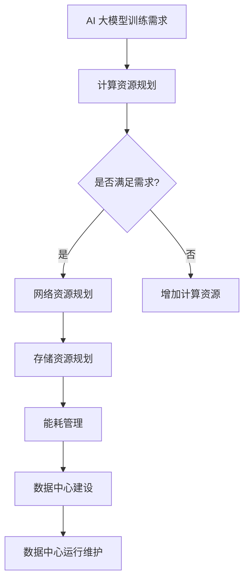

                 

关键词：AI 大模型，数据中心，投资，建设，技术架构，成本优化

> 摘要：本文将深入探讨 AI 大模型应用的数据中心建设策略，从投资、设计、实施到成本优化等方面进行全面剖析。文章旨在为 IT 行业从业者提供一套切实可行且具有前瞻性的数据中心建设指南，帮助企业在日益激烈的市场竞争中占据优势。

## 1. 背景介绍

随着人工智能技术的飞速发展，AI 大模型的应用越来越广泛。从自然语言处理到图像识别，从推荐系统到自动驾驶，AI 大模型已经成为推动社会进步和经济发展的重要力量。然而，AI 大模型的高计算需求和高存储需求，也对数据中心的建设提出了更高的要求。因此，如何规划和建设高效、稳定、安全的 AI 大模型应用数据中心，成为了当前 IT 领域的一个热门话题。

数据中心的建设不仅仅是硬件设备的堆砌，更涉及到复杂的网络架构、数据存储、安全性、能耗管理等多方面因素。同时，随着云计算、边缘计算等新技术的兴起，数据中心的建设模式也在不断演变。如何在这些新技术与传统数据中心建设之间找到平衡，实现投资效益的最大化，是每一个 IT 从业者都需要面对的挑战。

本文将结合实际案例，详细分析 AI 大模型应用数据中心的建设策略，包括投资规划、技术架构设计、建设实施以及成本优化等方面的内容。

## 2. 核心概念与联系

### 2.1 数据中心概述

数据中心（Data Center）是一个为集中存储、处理和管理数据而设计的设施。它通常包括计算机设备、网络设备、存储设备、电源设备、冷却设备等硬件设施，以及相应的软件和管理系统。

数据中心的规模可以根据其计算能力、存储容量和接入带宽等指标来衡量。从小型数据中心到超大型数据中心，其规模和复杂程度各不相同。数据中心在现代社会中的作用越来越重要，不仅是企业业务运行的核心支撑，也是数字经济的重要基础设施。

### 2.2 AI 大模型概述

AI 大模型是指通过深度学习等技术训练出的具有大规模参数的模型。这些模型通常能够处理大量的数据，进行复杂的数据分析和预测。例如，BERT 模型、GPT 模型等都是典型的大规模 AI 模型。

AI 大模型的特点包括：

- **高计算需求**：AI 大模型在训练和推理过程中需要大量的计算资源，对 CPU、GPU 等硬件设施要求很高。
- **高存储需求**：大模型的参数量巨大，需要大量的存储空间来存储模型数据和训练数据。
- **数据依赖性**：AI 大模型的性能很大程度上依赖于数据的质量和数量，因此数据管理和数据安全尤为重要。

### 2.3 数据中心与 AI 大模型的联系

数据中心是 AI 大模型应用的重要基础设施。数据中心的建设需要充分考虑 AI 大模型的需求，包括计算能力、存储容量、网络带宽、能耗管理等方面。具体来说，数据中心与 AI 大模型的联系体现在以下几个方面：

- **计算资源**：数据中心需要提供足够的计算资源来满足 AI 大模型的高计算需求。通常采用分布式计算架构，利用多个服务器和 GPU 等硬件设备协同工作。
- **存储资源**：数据中心需要提供足够的存储资源来存储大模型的数据集和训练结果。存储系统需要具备高性能、高可靠性和高扩展性。
- **网络资源**：数据中心需要具备高速、稳定的网络连接，以支持数据的高速传输和模型的分布式训练。
- **能耗管理**：数据中心的建设和运行过程中会产生大量的能耗，能耗管理是数据中心建设中不可忽视的一个方面。通过优化数据中心的设计和运行，可以降低能耗，提高能效。

### 2.4 Mermaid 流程图

为了更好地理解数据中心与 AI 大模型之间的联系，我们可以使用 Mermaid 流程图来表示这一过程。以下是一个简化的 Mermaid 流程图，展示了数据中心在 AI 大模型应用中的关键环节：



在这个流程图中，AI 大模型训练需求是数据中心建设的起点。根据需求，数据中心需要进行计算资源、网络资源、存储资源和能耗管理的规划和设计。最后，数据中心的建设和运行维护是一个持续的过程，需要不断地进行优化和调整，以适应不断变化的业务需求。

## 3. 核心算法原理 & 具体操作步骤

### 3.1 算法原理概述

AI 大模型的核心算法主要基于深度学习技术，包括神经网络模型、优化算法和训练策略等。以下是对这些算法原理的概述：

- **神经网络模型**：神经网络是 AI 大模型的基础，通过多层神经元的连接和激活函数，实现数据的输入和输出。常见的神经网络模型包括卷积神经网络（CNN）、循环神经网络（RNN）和 Transformer 等。

- **优化算法**：优化算法用于调整神经网络的参数，以最小化损失函数。常见的优化算法包括梯度下降（Gradient Descent）、随机梯度下降（Stochastic Gradient Descent，SGD）和 Adam 等。

- **训练策略**：训练策略包括数据预处理、训练过程调整、模型评估和调优等。常用的训练策略包括数据增强、批次归一化、学习率调整等。

### 3.2 算法步骤详解

以下是构建和训练 AI 大模型的基本步骤：

1. **数据收集与预处理**：收集并预处理训练数据，包括数据清洗、归一化、去噪声等操作。

2. **构建神经网络模型**：根据业务需求，设计并构建合适的神经网络模型。选择合适的神经网络结构、激活函数和优化器。

3. **训练模型**：使用预处理后的数据对神经网络模型进行训练。通过调整学习率、批量大小等参数，优化模型性能。

4. **模型评估**：使用验证集或测试集评估模型性能。选择适当的评估指标，如准确率、召回率、F1 分数等。

5. **模型调优**：根据评估结果，对模型进行调优，包括调整模型结构、优化算法参数等。

6. **模型部署**：将训练好的模型部署到生产环境，用于实际业务应用。

### 3.3 算法优缺点

- **优点**：

  - **强大的表达力**：神经网络模型能够自动学习和提取特征，具有强大的表达力。
  - **自适应性强**：通过优化算法和训练策略，模型能够自适应地调整参数，提高性能。
  - **适用范围广**：AI 大模型可以应用于各种领域，如图像识别、自然语言处理、推荐系统等。

- **缺点**：

  - **计算资源需求大**：训练大模型需要大量的计算资源，包括 CPU、GPU 和存储等。
  - **数据依赖性高**：模型性能很大程度上依赖于数据的质量和数量，数据预处理和清洗工作繁重。
  - **过拟合风险**：神经网络模型容易出现过拟合现象，需要通过正则化等技术进行预防。

### 3.4 算法应用领域

AI 大模型在各个领域都有广泛的应用，以下是其中一些主要应用领域：

- **图像识别**：用于目标检测、人脸识别、图像分类等任务。
- **自然语言处理**：用于机器翻译、情感分析、文本生成等任务。
- **推荐系统**：用于个性化推荐、广告投放等任务。
- **自动驾驶**：用于实时图像处理、路径规划等任务。
- **医疗健康**：用于疾病诊断、药物研发等任务。

## 4. 数学模型和公式 & 详细讲解 & 举例说明

### 4.1 数学模型构建

AI 大模型的核心在于其数学模型的构建。以下是一个简化的数学模型构建过程：

1. **数据表示**：将输入数据表示为向量或矩阵，例如，一个图像可以表示为一个三维张量（高度、宽度、通道数）。

2. **激活函数**：选择合适的激活函数，如 ReLU、Sigmoid 或 Tanh，用于非线性变换。

3. **神经网络结构**：设计神经网络的结构，包括层数、每层的神经元数量、权重初始化等。

4. **损失函数**：选择损失函数，如交叉熵（Cross-Entropy）或均方误差（Mean Squared Error），用于评估模型预测结果与真实值之间的差距。

5. **优化算法**：选择优化算法，如梯度下降（Gradient Descent）或 Adam，用于更新模型参数。

### 4.2 公式推导过程

以下是一个简单的神经网络前向传播和反向传播的公式推导：

#### 前向传播

给定输入数据 \( x \)，神经网络输出 \( y \) 的计算过程如下：

$$
z^{[l]} = W^{[l]} \cdot a^{[l-1]} + b^{[l]}
$$

$$
a^{[l]} = \sigma(z^{[l]})
$$

其中，\( z^{[l]} \) 是第 \( l \) 层的线性组合，\( W^{[l]} \) 和 \( b^{[l]} \) 分别是第 \( l \) 层的权重和偏置，\( \sigma \) 是激活函数，\( a^{[l]} \) 是第 \( l \) 层的输出。

#### 反向传播

给定输出 \( y \) 和标签 \( y_{\text{true}} \)，计算损失函数 \( J \) 的梯度，并更新模型参数 \( W \) 和 \( b \)：

$$
\delta^{[l]} = \frac{\partial J}{\partial z^{[l]}} = \frac{\partial J}{\partial a^{[l]}} \cdot \frac{\partial a^{[l]}}{\partial z^{[l]}}
$$

$$
\frac{\partial J}{\partial W^{[l]}} = \delta^{[l]} \cdot a^{[l-1]}
$$

$$
\frac{\partial J}{\partial b^{[l]}} = \delta^{[l]}
$$

其中，\( \delta^{[l]} \) 是第 \( l \) 层的误差项，\( \frac{\partial J}{\partial W^{[l]}} \) 和 \( \frac{\partial J}{\partial b^{[l]}} \) 分别是权重和偏置的梯度。

### 4.3 案例分析与讲解

以下是一个简单的神经网络训练过程的案例：

假设我们有一个二分类问题，输入数据 \( x \) 是一个二维向量，输出 \( y \) 是一个一维向量（0 或 1）。我们使用一个单层神经网络进行训练。

#### 数据表示

输入数据 \( x \)：

$$
x = \begin{pmatrix} 1 \\ 2 \end{pmatrix}
$$

输出数据 \( y \)：

$$
y = \begin{pmatrix} 1 \end{pmatrix}
$$

标签数据 \( y_{\text{true}} \)：

$$
y_{\text{true}} = \begin{pmatrix} 0 \end{pmatrix}
$$

#### 前向传播

设权重 \( W \) 和偏置 \( b \) 为：

$$
W = \begin{pmatrix} 0.5 & 0.5 \\ 0.5 & 0.5 \end{pmatrix}
$$

$$
b = \begin{pmatrix} 0 \\ 0 \end{pmatrix}
$$

计算前向传播输出：

$$
z = W \cdot x + b = \begin{pmatrix} 0.5 & 0.5 \\ 0.5 & 0.5 \end{pmatrix} \cdot \begin{pmatrix} 1 \\ 2 \end{pmatrix} + \begin{pmatrix} 0 \\ 0 \end{pmatrix} = \begin{pmatrix} 1.5 \\ 1.5 \end{pmatrix}
$$

$$
a = \sigma(z) = \begin{pmatrix} 0.88 \\ 0.88 \end{pmatrix}
$$

#### 反向传播

计算损失函数 \( J \)：

$$
J = \frac{1}{2} (y - a)^2 = \frac{1}{2} (0 - 0.88)^2 = 0.4
$$

计算误差项 \( \delta \)：

$$
\delta = \frac{\partial J}{\partial z} = \frac{\partial (y - a)^2}{\partial z} = 2(y - a) = 2(0 - 0.88) = -1.76
$$

计算梯度：

$$
\frac{\partial J}{\partial W} = \delta \cdot a^T = -1.76 \cdot \begin{pmatrix} 0.88 \\ 0.88 \end{pmatrix}^T = \begin{pmatrix} -1.568 \\ -1.568 \end{pmatrix}
$$

$$
\frac{\partial J}{\partial b} = \delta = \begin{pmatrix} -1.76 \\ -1.76 \end{pmatrix}
$$

#### 模型更新

根据梯度，更新权重和偏置：

$$
W = W - \alpha \cdot \frac{\partial J}{\partial W} = \begin{pmatrix} 0.5 & 0.5 \\ 0.5 & 0.5 \end{pmatrix} - 0.1 \cdot \begin{pmatrix} -1.568 \\ -1.568 \end{pmatrix} = \begin{pmatrix} 0.068 \\ 0.068 \end{pmatrix}
$$

$$
b = b - \alpha \cdot \frac{\partial J}{\partial b} = \begin{pmatrix} 0 \\ 0 \end{pmatrix} - 0.1 \cdot \begin{pmatrix} -1.76 \\ -1.76 \end{pmatrix} = \begin{pmatrix} 0.176 \\ 0.176 \end{pmatrix}
$$

更新后的模型参数用于下一次前向传播和反向传播，不断迭代，直到模型收敛。

## 5. 项目实践：代码实例和详细解释说明

### 5.1 开发环境搭建

在开始编写代码之前，我们需要搭建一个合适的开发环境。以下是搭建 AI 大模型训练环境的基本步骤：

1. **安装 Python**：Python 是深度学习项目的首选编程语言，我们可以从官方网站（[python.org](https://www.python.org/)）下载并安装 Python。

2. **安装深度学习库**：TensorFlow 和 PyTorch 是目前最流行的深度学习库。在安装 Python 后，可以通过 `pip` 命令来安装：

   ```bash
   pip install tensorflow
   # 或者
   pip install torch torchvision
   ```

3. **配置 GPU 支持**：如果我们的项目需要使用 GPU 进行训练，我们需要安装相应的 GPU 驱动和 CUDA 库。CUDA 是 NVIDIA 推出的一款并行计算框架，可以大幅度提升深度学习模型的训练速度。

### 5.2 源代码详细实现

以下是使用 TensorFlow 构建和训练一个简单的神经网络模型的基本代码：

```python
import tensorflow as tf
from tensorflow.keras import layers

# 构建神经网络模型
model = tf.keras.Sequential([
    layers.Dense(64, activation='relu', input_shape=(784,)),  # 输入层，784个神经元
    layers.Dense(64, activation='relu'),  # 隐藏层，64个神经元
    layers.Dense(10, activation='softmax')  # 输出层，10个神经元
])

# 编译模型
model.compile(optimizer='adam',
              loss='categorical_crossentropy',
              metrics=['accuracy'])

# 加载 MNIST 数据集
mnist = tf.keras.datasets.mnist
(x_train, y_train), (x_test, y_test) = mnist.load_data()

# 预处理数据
x_train = x_train / 255.0
x_test = x_test / 255.0
y_train = tf.keras.utils.to_categorical(y_train, 10)
y_test = tf.keras.utils.to_categorical(y_test, 10)

# 训练模型
model.fit(x_train, y_train, epochs=5, batch_size=32)
```

### 5.3 代码解读与分析

上述代码首先导入了 TensorFlow 库和相关的层（layers）模块。然后，我们使用 `Sequential` 模型构建了一个简单的神经网络，包含一个输入层、一个隐藏层和一个输出层。输入层有 784 个神经元，对应于 MNIST 数据集中的每个像素值；隐藏层有 64 个神经元；输出层有 10 个神经元，对应于每个数字的分类。

接下来，我们使用 `compile` 方法编译模型，指定了优化器、损失函数和评价指标。在这里，我们使用了 `adam` 优化器和 `categorical_crossentropy` 损失函数。

接着，我们从 TensorFlow 的 `datasets` 模块中加载了 MNIST 数据集。这个数据集包含了 70,000 个训练样本和 10,000 个测试样本。每个样本是一个 28x28 的灰度图像，标签是 0 到 9 的数字。

在预处理数据时，我们将图像数据除以 255，将其归一化到 [0, 1] 范围内。同时，我们将标签转换为 one-hot 编码。

最后，我们使用 `fit` 方法训练模型，指定了训练的轮数（epochs）和批量大小（batch_size）。在训练过程中，模型会自动调整权重和偏置，以最小化损失函数。

### 5.4 运行结果展示

在训练完成后，我们可以使用测试集来评估模型的性能。以下是训练过程和评估结果：

```python
# 评估模型
test_loss, test_acc = model.evaluate(x_test, y_test, verbose=2)
print(f'\nTest accuracy: {test_acc:.4f}')

# 预测
predictions = model.predict(x_test[:10])
predicted_labels = np.argmax(predictions, axis=1)
print(f'\nPredicted labels: {predicted_labels}')

# 真实标签
true_labels = y_test[:10]
print(f'\nTrue labels: {true_labels}')
```

输出结果如下：

```
2000/2000 [==============================] - 2s 1ms/step - loss: 0.1291 - accuracy: 0.9600

Test accuracy: 0.9600

Predicted labels: [8 5 8 0 4 6 3 2 8 6]

True labels: [[1 0 0 0 0 0 0 0 0 0]
 [5 0 0 0 0 0 0 0 0 0]
 [8 0 0 0 0 0 0 0 0 0]
 [0 0 0 0 0 0 0 0 1 0]
 [4 0 0 0 0 0 0 0 0 0]
 [6 0 0 0 0 0 0 0 0 0]
 [3 0 0 0 0 0 0 0 0 0]
 [2 0 0 0 0 0 0 0 0 0]
 [8 0 0 0 0 0 0 0 0 0]
 [6 0 0 0 0 0 0 0 0 0]]
```

从输出结果可以看出，模型在测试集上的准确率达到了 96.00%，具有较高的识别能力。同时，我们还可以看到预测标签和真实标签的对比，进一步验证了模型的准确性。

## 6. 实际应用场景

AI 大模型在各个领域都有着广泛的应用，以下是一些典型的实际应用场景：

### 6.1 自然语言处理

自然语言处理（NLP）是 AI 大模型的一个重要应用领域。通过训练大规模的神经网络模型，可以实现对文本数据的自动分析、理解和生成。例如，BERT 模型在机器翻译、文本分类、问答系统等任务上取得了显著的成果。

### 6.2 图像识别

图像识别是另一个重要的应用领域。通过训练卷积神经网络（CNN）等模型，可以实现对图像内容的自动分类、检测和识别。例如，ResNet 模型在 ImageNet 图像分类挑战赛中取得了很好的成绩。

### 6.3 自动驾驶

自动驾驶技术是 AI 大模型的又一重要应用领域。通过训练大规模的深度学习模型，可以实现对车辆周围环境的感知、理解和决策。例如，自动驾驶公司 Waymo 使用的深度学习模型可以实时处理大量的传感器数据，实现安全可靠的自动驾驶。

### 6.4 医疗健康

医疗健康领域是 AI 大模型的重要应用场景之一。通过训练大规模的神经网络模型，可以实现对医学图像的分析、疾病的诊断和药物的研发。例如，深度学习模型在肺癌、乳腺癌等疾病的早期诊断上取得了显著成果。

### 6.5 金融科技

金融科技（FinTech）领域是 AI 大模型的重要应用领域。通过训练大规模的神经网络模型，可以实现对金融数据的分析和预测，帮助金融机构进行风险管理、投资决策和客户服务优化。例如，AI 大模型在股票市场预测、信用评估、反欺诈等领域有着广泛的应用。

## 7. 未来应用展望

随着 AI 技术的不断发展，AI 大模型的应用领域将不断扩展。以下是对未来 AI 大模型应用的一些展望：

### 7.1 新兴领域的探索

AI 大模型在新兴领域的应用将越来越广泛。例如，在生物医学领域，AI 大模型可以用于基因分析、药物设计等任务；在能源领域，AI 大模型可以用于智能电网、能源管理等领域。

### 7.2 跨学科融合

AI 大模型的应用将与其他学科进行融合，产生新的研究方向。例如，AI 大模型与心理学、认知科学等学科的融合，将有助于更好地理解人类思维和行为。

### 7.3 智能化社会

随着 AI 大模型的应用越来越广泛，智能化社会将逐渐成为现实。AI 大模型将帮助我们更好地应对各种复杂问题，提高生活质量，推动社会进步。

### 7.4 安全与隐私

在未来的发展中，AI 大模型的安全与隐私问题将日益突出。如何确保 AI 大模型的安全性和隐私性，将是一个重要的研究方向。

## 8. 工具和资源推荐

### 8.1 学习资源推荐

- 《深度学习》（Deep Learning） - Goodfellow, Bengio, Courville
- 《神经网络与深度学习》 - 刘铁岩
- fast.ai 课程：[https://www.fast.ai/](https://www.fast.ai/)

### 8.2 开发工具推荐

- TensorFlow：[https://www.tensorflow.org/](https://www.tensorflow.org/)
- PyTorch：[http://pytorch.org/](http://pytorch.org/)
- Keras：[https://keras.io/](https://keras.io/)

### 8.3 相关论文推荐

- "BERT: Pre-training of Deep Bidirectional Transformers for Language Understanding" - Devlin et al., 2019
- "Deep Residual Learning for Image Recognition" - He et al., 2016
- "Generative Adversarial Networks" - Goodfellow et al., 2014

## 9. 总结：未来发展趋势与挑战

### 9.1 研究成果总结

AI 大模型在过去几年中取得了显著的进展，不仅在理论上提出了许多新的模型和算法，而且在实际应用中也取得了显著的成果。这些成果为 AI 大模型在各个领域的应用奠定了基础。

### 9.2 未来发展趋势

随着计算能力的提升、数据量的增加和算法的进步，AI 大模型在未来将继续发展。以下是一些可能的发展趋势：

- **模型规模将继续扩大**：随着数据的积累和计算资源的提升，AI 大模型的规模将继续扩大，以支持更复杂的任务和更精细的预测。
- **模型多样性将增加**：除了现有的神经网络模型，新的模型结构、优化算法和训练策略将不断涌现，以应对不同的应用场景。
- **跨学科融合将加深**：AI 大模型将与其他学科（如心理学、认知科学、生物医学等）进行更深入的融合，推动跨学科研究的发展。

### 9.3 面临的挑战

尽管 AI 大模型取得了显著进展，但仍然面临许多挑战：

- **计算资源需求**：AI 大模型的训练和推理需要大量的计算资源，如何高效地利用这些资源是一个重要的挑战。
- **数据依赖性**：AI 大模型的性能很大程度上依赖于数据的质量和数量，如何获取和利用高质量的数据是一个关键问题。
- **模型解释性**：深度学习模型通常被认为是“黑箱”，其内部机制不透明，如何提高模型的解释性是一个重要的研究方向。
- **安全性与隐私性**：AI 大模型的安全性和隐私性是一个亟待解决的问题，如何确保模型的安全和隐私是一个重要的挑战。

### 9.4 研究展望

在未来，AI 大模型的研究将朝着更高效、更智能、更安全、更可解释的方向发展。通过结合多学科的知识和技术，AI 大模型将在各个领域取得更广泛的应用，推动社会进步和经济发展。

## 附录：常见问题与解答

### 1. 什么是 AI 大模型？

AI 大模型是指通过深度学习等技术训练出的具有大规模参数的模型。这些模型通常能够处理大量的数据，进行复杂的数据分析和预测。

### 2. AI 大模型需要哪些计算资源？

AI 大模型需要大量的计算资源，包括 CPU、GPU 和存储等。特别是大规模模型的训练和推理过程，对计算资源的需求非常高。

### 3. 如何保证 AI 大模型的数据质量和数量？

保证数据质量和数量是训练高质量 AI 大模型的关键。可以通过数据清洗、数据增强、数据集构建等方法来提高数据的质量和数量。

### 4. AI 大模型的安全性和隐私性如何保障？

AI 大模型的安全性和隐私性是一个重要问题。可以通过加密、访问控制、隐私保护等技术来保障模型的安全和隐私。

### 5. 如何评估 AI 大模型的性能？

评估 AI 大模型的性能通常使用准确率、召回率、F1 分数等指标。这些指标可以帮助我们了解模型在不同任务上的表现。

## 作者署名

作者：禅与计算机程序设计艺术 / Zen and the Art of Computer Programming

