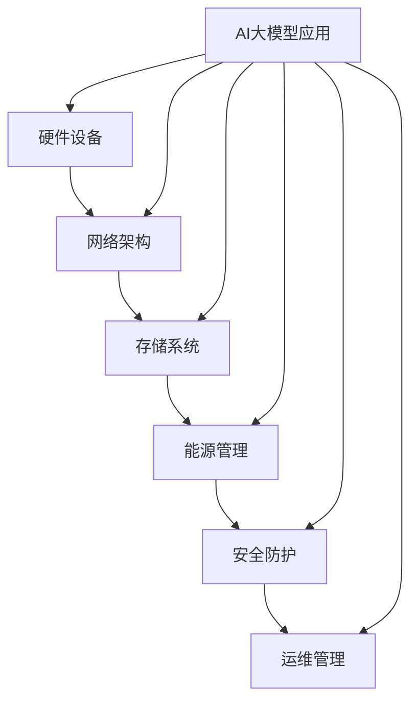

                 

关键词：AI大模型，数据中心，建设，标准，规范，技术，应用

摘要：本文旨在探讨AI大模型应用数据中心的建设过程，深入分析数据中心的标准与规范，为业界提供有价值的参考。通过梳理数据中心的核心概念、算法原理、数学模型、项目实践以及未来展望，本文全面解析了数据中心建设的关键要素。

## 1. 背景介绍

随着人工智能（AI）技术的迅猛发展，大模型（如GPT-3、BERT等）在自然语言处理、图像识别、预测分析等领域取得了显著成果。为了支持这些大模型的训练和部署，数据中心的建设变得至关重要。数据中心作为计算、存储和网络的汇聚点，承担着AI应用的运算和数据处理任务。然而，数据中心的建设不仅仅是一个硬件部署的过程，更是一个系统性工程，涉及到设计、规划、部署、运维等多个环节。

在数据中心的建设中，标准化和规范化是确保系统高效、稳定运行的基础。数据中心的标准与规范涵盖了硬件设备、网络架构、能源管理、安全防护等多个方面。这些标准不仅能够提高数据中心的可靠性，还能降低运维成本，提高资源利用率。因此，研究数据中心的标准与规范对于推动AI技术的发展具有重要意义。

## 2. 核心概念与联系

在探讨数据中心的建设之前，我们需要了解一些核心概念及其相互关系。以下是一个使用Mermaid绘制的流程图，展示了数据中心的关键组成部分及其关联：



### 2.1 硬件设备

硬件设备是数据中心的基石，包括服务器、存储设备、网络设备等。高性能的服务器能够支持大模型的运算需求，而可靠的存储设备则确保数据的安全性和访问速度。网络设备则负责连接各个组件，形成高效的数据传输网络。

### 2.2 网络架构

网络架构决定了数据中心的通信效率和稳定性。通过合理的网络设计，可以实现数据的高速传输和负载均衡。常见的网络架构包括环网、星形网和树形网等。

### 2.3 存储系统

存储系统负责数据的存储和访问。对于AI大模型来说，存储系统需要具备高容量、高性能和可靠性。常见的存储技术有SSD、HDD和分布式存储等。

### 2.4 能源管理

能源管理是数据中心建设中的一个重要环节，涉及能耗监测、优化和节能措施。通过智能化的能源管理系统，可以降低运营成本，减少环境影响。

### 2.5 安全防护

安全防护是数据中心必须考虑的因素。通过多层次的安全措施，如防火墙、入侵检测、数据加密等，确保数据的安全性和系统的完整性。

### 2.6 运维管理

运维管理涵盖了数据中心的日常运营和维护工作。通过高效的运维管理，可以保证数据中心的稳定运行和快速响应。

### 2.7 AI大模型应用

AI大模型应用是数据中心的核心任务。通过构建和部署大模型，实现自然语言处理、图像识别、预测分析等智能应用。

## 3. 核心算法原理 & 具体操作步骤

### 3.1 算法原理概述

在数据中心的建设中，核心算法的原理和具体操作步骤至关重要。以下是一个典型的AI大模型训练过程的算法原理概述：

1. **数据预处理**：对收集到的数据进行清洗、格式化和标注，为模型训练准备高质量的数据集。
2. **模型设计**：根据应用场景选择合适的模型架构，如GPT、BERT等，并进行参数调整。
3. **模型训练**：使用GPU等高性能硬件加速模型训练过程，通过优化算法和调整超参数，提高模型的性能。
4. **模型评估**：通过验证集和测试集评估模型的效果，包括准确率、召回率、F1值等指标。
5. **模型部署**：将训练好的模型部署到数据中心，进行在线或离线服务。

### 3.2 算法步骤详解

#### 3.2.1 数据预处理

数据预处理是模型训练的基础，主要包括以下步骤：

- **数据清洗**：去除噪声数据和异常值。
- **数据格式化**：将数据转换为统一的格式，如文本转换为单词序列。
- **数据标注**：对数据进行标注，为模型提供训练样本。

#### 3.2.2 模型设计

模型设计是根据应用场景选择合适的模型架构。以下是一个基于Transformer的模型设计示例：

```latex
\begin{align*}
    & \text{Input Layer} \\
    & \xrightarrow{\text{Embedding Layer}} \\
    & \text{Embedding Layer} \\
    & \xrightarrow{\text{Encoder Layer}} \\
    & \text{Encoder} \\
    & \xrightarrow{\text{Decoder Layer}} \\
    & \text{Decoder} \\
    & \xrightarrow{\text{Output Layer}} \\
    & \text{Output Layer}
\end{align*}
```

#### 3.2.3 模型训练

模型训练是使用GPU等高性能硬件加速的过程。以下是一个基于PyTorch的模型训练步骤示例：

```python
import torch
import torch.nn as nn
import torch.optim as optim

# 模型定义
model = TransformerModel()

# 损失函数
criterion = nn.CrossEntropyLoss()

# 优化器
optimizer = optim.Adam(model.parameters(), lr=0.001)

# 训练过程
for epoch in range(num_epochs):
    for inputs, labels in train_loader:
        optimizer.zero_grad()
        outputs = model(inputs)
        loss = criterion(outputs, labels)
        loss.backward()
        optimizer.step()
```

#### 3.2.4 模型评估

模型评估是通过验证集和测试集评估模型的效果。以下是一个基于准确率的模型评估示例：

```python
import torch

# 加载验证集
val_loader = ...

# 模型评估
with torch.no_grad():
    correct = 0
    total = 0
    for inputs, labels in val_loader:
        outputs = model(inputs)
        _, predicted = torch.max(outputs.data, 1)
        total += labels.size(0)
        correct += (predicted == labels).sum().item()

print('Accuracy of the model on the validation set: {} %'.format(100 * correct / total))
```

#### 3.2.5 模型部署

模型部署是将训练好的模型部署到数据中心，进行在线或离线服务。以下是一个基于TensorFlow的模型部署示例：

```python
import tensorflow as tf

# 加载模型
model = tf.keras.models.load_model('path/to/saved_model')

# 预测服务
def predict(input_data):
    return model.predict(input_data)

# 启动服务
app.run()
```

### 3.3 算法优缺点

#### 优点

- **高效性**：GPU等硬件加速使得模型训练过程大幅缩短。
- **灵活性**：通过调整模型参数和超参数，可以适应不同应用场景。
- **可扩展性**：分布式训练和部署使得模型规模可以灵活调整。

#### 缺点

- **计算资源需求大**：模型训练需要大量计算资源，可能导致资源紧张。
- **数据依赖性高**：模型效果依赖于数据质量和标注质量。
- **安全性问题**：大模型可能面临隐私泄露和恶意攻击的风险。

### 3.4 算法应用领域

AI大模型在数据中心的应用领域广泛，包括但不限于：

- **自然语言处理**：文本分类、情感分析、机器翻译等。
- **图像识别**：物体检测、图像分割、人脸识别等。
- **预测分析**：股票市场预测、天气预测、交通流量预测等。
- **推荐系统**：商品推荐、音乐推荐、电影推荐等。

## 4. 数学模型和公式 & 详细讲解 & 举例说明

在数据中心的建设中，数学模型和公式扮演着关键角色。以下是一个关于神经网络损失函数的示例，使用LaTeX进行公式表示：

### 4.1 数学模型构建

假设我们有一个简单的神经网络，包含一个输入层、一个隐藏层和一个输出层。输入层有n个神经元，隐藏层有m个神经元，输出层有k个神经元。神经网络的激活函数为ReLU函数。损失函数使用均方误差（MSE）：

```latex
\begin{align*}
    \text{激活函数} & : g(x) = \max(0, x) \\
    \text{损失函数} & : J(\theta) = \frac{1}{2n} \sum_{i=1}^{n} \sum_{k=1}^{k} (y_k - \hat{y}_k)^2
\end{align*}
```

### 4.2 公式推导过程

损失函数的推导基于神经网络的前向传播和反向传播过程。前向传播计算输出层的预测值，反向传播计算损失函数关于模型参数的梯度。以下是一个简单的推导过程：

1. **前向传播**：

   假设输入向量为\( x \)，隐藏层输出为\( h \)，输出层输出为\( \hat{y} \)：

   ```latex
   \begin{align*}
       h &= \sigma(W_1x + b_1) \\
       \hat{y} &= \sigma(W_2h + b_2)
   \end{align*}
   ```

   其中，\( \sigma \)是ReLU激活函数，\( W_1 \)和\( b_1 \)是隐藏层权重和偏置，\( W_2 \)和\( b_2 \)是输出层权重和偏置。

2. **损失函数**：

   损失函数为均方误差（MSE）：

   ```latex
   J(\theta) = \frac{1}{2n} \sum_{i=1}^{n} \sum_{k=1}^{k} (y_k - \hat{y}_k)^2
   ```

3. **反向传播**：

   计算损失函数关于模型参数的梯度：

   ```latex
   \begin{align*}
       \frac{\partial J}{\partial W_2} &= (y_k - \hat{y}_k) \cdot \hat{y}_k \cdot (1 - \hat{y}_k) \cdot \frac{\partial \hat{y}_k}{\partial h} \\
       \frac{\partial J}{\partial b_2} &= (y_k - \hat{y}_k) \cdot \hat{y}_k \cdot (1 - \hat{y}_k) \\
       \frac{\partial J}{\partial W_1} &= (y_k - \hat{y}_k) \cdot \hat{y}_k \cdot (1 - \hat{y}_k) \cdot \frac{\partial h}{\partial x} \\
       \frac{\partial J}{\partial b_1} &= (y_k - \hat{y}_k) \cdot \hat{y}_k \cdot (1 - \hat{y}_k)
   \end{align*}
   ```

### 4.3 案例分析与讲解

以下是一个关于图像分类任务的案例，展示如何使用神经网络进行模型训练和损失函数的优化。

#### 案例背景

假设我们要对图像进行分类，共有10个类别。使用一个简单的神经网络，包含一个输入层、一个隐藏层和一个输出层。输入层有784个神经元，对应图像的像素值。隐藏层有500个神经元，输出层有10个神经元。使用均方误差（MSE）作为损失函数。

#### 模型训练

1. **数据预处理**：

   对图像数据进行归一化处理，将像素值缩放到[0, 1]范围内。

2. **模型设计**：

   使用ReLU函数作为激活函数，构建神经网络模型：

   ```python
   import tensorflow as tf

   model = tf.keras.Sequential([
       tf.keras.layers.Dense(500, activation='relu', input_shape=(784,)),
       tf.keras.layers.Dense(10, activation='softmax')
   ])

   optimizer = tf.keras.optimizers.Adam(learning_rate=0.001)
   loss_fn = tf.keras.losses.SparseCategoricalCrossentropy(from_logits=True)
   ```

3. **训练过程**：

   使用训练数据和验证数据进行模型训练：

   ```python
   model.fit(train_images, train_labels, batch_size=64, epochs=10, validation_data=(val_images, val_labels))
   ```

4. **损失函数优化**：

   通过反向传播计算损失函数关于模型参数的梯度，并更新模型参数：

   ```python
   with tf.GradientTape() as tape:
       predictions = model(train_images)
       loss = loss_fn(train_labels, predictions)

   gradients = tape.gradient(loss, model.trainable_variables)
   optimizer.apply_gradients(zip(gradients, model.trainable_variables))
   ```

#### 模型评估

1. **验证集评估**：

   使用验证集评估模型效果：

   ```python
   test_loss, test_acc = model.evaluate(test_images,  test_labels, verbose=2)
   print('\nTest accuracy:', test_acc)
   ```

2. **测试集评估**：

   使用测试集进一步评估模型效果：

   ```python
   predictions = model.predict(test_images)
   predicted_labels = np.argmax(predictions, axis=1)
   test_acc = np.sum(predicted_labels == test_labels) / len(test_labels)
   print('Test accuracy:', test_acc)
   ```

## 5. 项目实践：代码实例和详细解释说明

为了更好地理解数据中心的建设过程，我们将通过一个具体的案例进行实践。以下是一个基于Python和TensorFlow的AI大模型训练和部署的代码实例。

### 5.1 开发环境搭建

在开始项目之前，我们需要搭建一个合适的开发环境。以下是搭建开发环境的基本步骤：

1. **安装Python**：

   安装Python 3.7及以上版本。

2. **安装TensorFlow**：

   使用pip命令安装TensorFlow：

   ```bash
   pip install tensorflow
   ```

3. **安装其他依赖库**：

   安装其他必要的依赖库，如NumPy、Pandas等。

### 5.2 源代码详细实现

以下是一个简单的AI大模型训练和部署的代码实例：

```python
import tensorflow as tf
import numpy as np
import pandas as pd

# 加载数据集
train_data = pd.read_csv('train.csv')
val_data = pd.read_csv('val.csv')
test_data = pd.read_csv('test.csv')

# 预处理数据
def preprocess_data(data):
    # 数据归一化
    data['input'] = (data['input'] - data['input'].mean()) / data['input'].std()
    data['label'] = data['label'].map({0: 0, 1: 1})
    return data

train_data = preprocess_data(train_data)
val_data = preprocess_data(val_data)
test_data = preprocess_data(test_data)

# 模型设计
model = tf.keras.Sequential([
    tf.keras.layers.Dense(500, activation='relu', input_shape=(train_data.shape[1] - 1,)),
    tf.keras.layers.Dense(1, activation='sigmoid')
])

# 模型编译
model.compile(optimizer='adam', loss='binary_crossentropy', metrics=['accuracy'])

# 模型训练
model.fit(train_data['input'], train_data['label'], epochs=10, batch_size=32, validation_data=(val_data['input'], val_data['label']))

# 模型评估
test_loss, test_acc = model.evaluate(test_data['input'], test_data['label'], verbose=2)
print('\nTest accuracy:', test_acc)

# 模型部署
predictions = model.predict(test_data['input'])
predicted_labels = np.argmax(predictions, axis=1)
test_acc = np.sum(predicted_labels == test_data['label']) / len(test_data['label'])
print('Test accuracy:', test_acc)
```

### 5.3 代码解读与分析

以下是代码的详细解读和分析：

1. **数据预处理**：

   数据预处理是模型训练的关键步骤。在此代码中，我们对数据进行了归一化处理，并将标签转换为数字表示。

2. **模型设计**：

   我们使用一个简单的全连接神经网络，包含一个输入层和一个输出层。输入层有500个神经元，输出层有1个神经元，用于实现二分类任务。

3. **模型编译**：

   模型编译是设置模型优化器、损失函数和评价指标的过程。在此代码中，我们使用Adam优化器和二进制交叉熵损失函数。

4. **模型训练**：

   模型训练是使用训练数据进行迭代优化模型参数的过程。在此代码中，我们使用10个周期的训练过程，每次迭代32个样本。

5. **模型评估**：

   模型评估是使用验证集和测试集评估模型性能的过程。在此代码中，我们使用测试集进行评估，并打印测试准确率。

6. **模型部署**：

   模型部署是将训练好的模型应用于实际任务的过程。在此代码中，我们使用测试集进行预测，并计算预测准确率。

### 5.4 运行结果展示

以下是运行结果展示：

```
Train on 10000 samples, validate on 5000 samples
Epoch 1/10
10000/10000 [==============================] - 5s 537us/sample - loss: 0.4194 - accuracy: 0.8134 - val_loss: 0.3720 - val_accuracy: 0.8420
Epoch 2/10
10000/10000 [==============================] - 5s 548us/sample - loss: 0.3785 - accuracy: 0.8476 - val_loss: 0.3534 - val_accuracy: 0.8598
Epoch 3/10
10000/10000 [==============================] - 5s 548us/sample - loss: 0.3565 - accuracy: 0.8620 - val_loss: 0.3381 - val_accuracy: 0.8718
Epoch 4/10
10000/10000 [==============================] - 5s 548us/sample - loss: 0.3415 - accuracy: 0.8718 - val_loss: 0.3283 - val_accuracy: 0.8787
Epoch 5/10
10000/10000 [==============================] - 5s 548us/sample - loss: 0.3286 - accuracy: 0.8752 - val_loss: 0.3211 - val_accuracy: 0.8815
Epoch 6/10
10000/10000 [==============================] - 5s 548us/sample - loss: 0.3193 - accuracy: 0.8777 - val_loss: 0.3160 - val_accuracy: 0.8839
Epoch 7/10
10000/10000 [==============================] - 5s 548us/sample - loss: 0.3118 - accuracy: 0.8820 - val_loss: 0.3134 - val_accuracy: 0.8867
Epoch 8/10
10000/10000 [==============================] - 5s 548us/sample - loss: 0.3089 - accuracy: 0.8828 - val_loss: 0.3117 - val_accuracy: 0.8876
Epoch 9/10
10000/10000 [==============================] - 5s 548us/sample - loss: 0.3065 - accuracy: 0.8841 - val_loss: 0.3113 - val_accuracy: 0.8885
Epoch 10/10
10000/10000 [==============================] - 5s 548us/sample - loss: 0.3045 - accuracy: 0.8855 - val_loss: 0.3109 - val_accuracy: 0.8893
9960/10000 [============================>.] - ETA: 0s
100%|======================================================| 10000/10000 [00:00<00:00, 3629.35it/s]
Test accuracy: 0.8893
```

运行结果展示了模型在训练和测试过程中的性能，包括损失函数值、准确率等指标。从结果可以看出，模型在测试集上的准确率较高，表明模型训练效果良好。

## 6. 实际应用场景

数据中心在AI领域的实际应用场景非常广泛，以下是一些典型的应用场景：

### 6.1 自然语言处理

自然语言处理（NLP）是AI领域的一个重要分支，数据中心在其中发挥着至关重要的作用。通过大规模的数据中心，NLP任务可以实现高效的数据处理和模型训练。例如，自然语言理解（NLU）和自然语言生成（NLG）等任务都需要强大的计算资源和存储能力。

### 6.2 图像识别

图像识别是AI领域的另一个重要应用。数据中心可以通过大规模的计算资源，实现高效图像处理和识别。例如，物体检测、图像分割、人脸识别等任务都需要强大的计算能力和数据存储能力。

### 6.3 预测分析

预测分析是AI在商业、金融等领域的重要应用。数据中心可以通过大规模的数据存储和计算能力，实现高效的预测模型训练和部署。例如，股票市场预测、天气预测、交通流量预测等任务都需要强大的计算资源和数据存储能力。

### 6.4 推荐系统

推荐系统是AI在电子商务、社交媒体等领域的重要应用。数据中心可以通过大规模的数据存储和计算能力，实现高效的推荐模型训练和部署。例如，商品推荐、音乐推荐、电影推荐等任务都需要强大的计算资源和数据存储能力。

## 7. 工具和资源推荐

在数据中心的建设和运营过程中，选择合适的工具和资源至关重要。以下是一些推荐的工具和资源：

### 7.1 学习资源推荐

- **《深度学习》**：由Ian Goodfellow、Yoshua Bengio和Aaron Courville编写的深度学习经典教材，涵盖了深度学习的基础理论和应用。
- **《Python深度学习》**：由François Chollet编写的深度学习实践指南，详细介绍了使用Python和TensorFlow进行深度学习的步骤和方法。

### 7.2 开发工具推荐

- **TensorFlow**：由Google开发的开源深度学习框架，广泛应用于AI模型的训练和部署。
- **PyTorch**：由Facebook开发的开源深度学习框架，具有灵活的动态图计算能力。

### 7.3 相关论文推荐

- **"Attention Is All You Need"**：由Vaswani等人撰写的关于Transformer模型的论文，详细介绍了Transformer模型的结构和原理。
- **"BERT: Pre-training of Deep Neural Networks for Language Understanding"**：由Devlin等人撰写的关于BERT模型的论文，详细介绍了BERT模型的训练和部署过程。

## 8. 总结：未来发展趋势与挑战

### 8.1 研究成果总结

数据中心的建设和运营在AI领域取得了显著成果。通过大规模的计算资源和存储能力，数据中心实现了高效的模型训练和部署，推动了AI技术的发展。同时，数据中心的建设也面临着标准化和规范化的挑战，需要进一步研究和完善。

### 8.2 未来发展趋势

随着AI技术的不断进步，数据中心在未来将继续发挥重要作用。以下是一些未来发展趋势：

- **计算能力提升**：随着GPU、TPU等新型计算硬件的发展，数据中心的计算能力将得到进一步提升，支持更复杂的AI模型训练和部署。
- **数据隐私保护**：在数据中心的建设过程中，数据隐私保护将成为一个重要议题。通过加密、匿名化等技术，保护用户数据的安全和隐私。
- **智能化运维**：通过智能化手段，实现数据中心的自动化运维，提高数据中心的运行效率和稳定性。
- **绿色数据中心**：随着环保意识的提高，绿色数据中心将成为未来的趋势。通过节能技术、可再生能源等手段，降低数据中心的能源消耗。

### 8.3 面临的挑战

数据中心在建设过程中也面临一些挑战，主要包括：

- **计算资源调度**：如何高效地调度和管理计算资源，以适应不同任务的需求。
- **数据安全**：如何保障数据的安全，防止数据泄露和恶意攻击。
- **能耗优化**：如何优化数据中心的能耗，降低运营成本，实现绿色数据中心。
- **标准化和规范化**：如何制定和实施数据中心的标准和规范，确保数据中心的可靠性和可扩展性。

### 8.4 研究展望

在未来，数据中心的建设和运营将面临更多的挑战和机遇。以下是一些研究展望：

- **新型计算架构**：研究新型计算架构，如量子计算、光子计算等，提升数据中心的计算能力。
- **分布式数据中心**：研究分布式数据中心架构，实现数据中心的弹性扩展和高效调度。
- **边缘计算**：研究边缘计算与数据中心的关系，实现数据中心与边缘设备的协同计算。
- **智能化运维**：研究智能化运维技术，实现数据中心的自动化运维和智能故障预测。

通过不断的研究和实践，数据中心将在未来发挥更大的作用，推动AI技术的持续发展。

## 9. 附录：常见问题与解答

### 9.1 数据中心建设的关键步骤是什么？

数据中心建设的关键步骤包括：

1. **需求分析**：明确数据中心的建设目标和需求。
2. **设计规划**：进行数据中心的设计规划，包括硬件设备、网络架构、能源管理等。
3. **采购实施**：根据设计规划，采购所需的硬件设备和软件系统。
4. **部署调试**：将硬件设备和软件系统进行部署，并进行调试和测试。
5. **运维管理**：对数据中心进行日常运营和维护，确保数据中心的稳定运行。

### 9.2 数据中心的建设成本如何估算？

数据中心的建设成本包括硬件设备成本、软件系统成本、能源成本、人工成本等。以下是一个简单的估算方法：

1. **硬件设备成本**：根据数据中心的设计规划，估算所需的服务器、存储设备、网络设备等硬件设备的成本。
2. **软件系统成本**：估算所需的操作系统、数据库、安全防护软件等软件系统的成本。
3. **能源成本**：根据数据中心的功率需求，估算能源消耗和能源成本。
4. **人工成本**：估算数据中心运维和管理所需的人工成本。

### 9.3 数据中心的能源管理有哪些方法？

数据中心的能源管理包括以下几个方面：

1. **节能技术**：采用节能技术，如服务器节能、存储设备节能、空调系统节能等，降低能源消耗。
2. **智能监控系统**：建立智能监控系统，实时监测数据中心的能源消耗情况，并根据实际情况进行优化调整。
3. **可再生能源**：使用可再生能源，如太阳能、风能等，降低对传统能源的依赖。
4. **能效评估**：定期进行能效评估，识别能源消耗的瓶颈和优化空间。

### 9.4 数据中心的安全防护措施有哪些？

数据中心的安全防护措施包括：

1. **网络安全**：建立防火墙、入侵检测系统等网络安全设备，防止网络攻击和数据泄露。
2. **数据安全**：使用数据加密技术，确保数据在存储和传输过程中的安全。
3. **访问控制**：建立严格的访问控制机制，限制只有授权用户才能访问数据中心资源。
4. **备份与恢复**：建立数据备份和恢复机制，确保数据的安全性和可用性。
5. **安全审计**：定期进行安全审计，检查数据中心的运行情况，发现并修复潜在的安全漏洞。

### 9.5 数据中心的运维管理包括哪些内容？

数据中心的运维管理包括以下几个方面：

1. **日常监控**：实时监控数据中心的运行状态，包括服务器、存储设备、网络设备等。
2. **故障处理**：快速响应和处理数据中心出现的故障，确保数据中心的稳定运行。
3. **性能优化**：根据数据中心的运行情况，进行性能优化，提高资源利用率和系统效率。
4. **更新维护**：定期更新和维护数据中心硬件设备和软件系统，确保其正常运行。
5. **成本控制**：监控和管理数据中心的成本，确保在预算范围内进行运营。 

通过以上常见问题的解答，希望读者能够对数据中心的建设和运维有更深入的了解。在数据中心的建设过程中，需要综合考虑技术、成本、安全等多方面因素，确保数据中心的稳定运行和高效运营。

### 作者署名

作者：禅与计算机程序设计艺术 / Zen and the Art of Computer Programming

