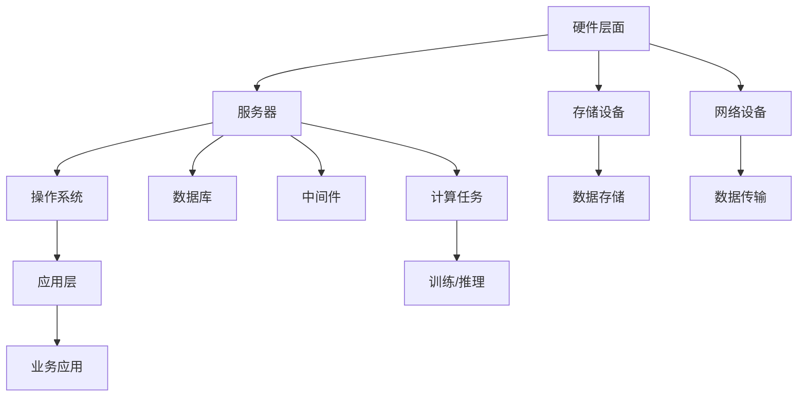

                 

关键词：AI大模型、数据中心建设、标准与规范、技术架构、性能优化、安全性、成本效益

## 摘要

本文旨在探讨AI大模型应用数据中心建设的重要性及其标准与规范。首先，我们将回顾AI大模型的发展历程，分析其对数据中心建设的驱动力。接着，我们将介绍数据中心建设的基本概念、架构设计和关键技术。随后，本文将深入探讨数据中心标准与规范，包括硬件选择、软件配置、数据安全和能耗管理等方面。通过实际案例和代码示例，我们将展示如何实现一个高效、安全且具备成本效益的数据中心。最后，本文将展望数据中心建设的未来趋势和面临的挑战。

## 1. 背景介绍

### AI大模型的发展历程

AI大模型，又称为深度学习模型，是指使用大量数据进行训练，具有巨大参数量的复杂神经网络。自2006年深度信念网络（DBN）首次提出以来，AI大模型经历了迅速发展。2012年，AlexNet在ImageNet竞赛中取得突破性成果，标志着深度学习在计算机视觉领域的崛起。随后，Google的Inception、微软的ResNet等模型不断刷新性能极限。

AI大模型的快速进步离不开硬件的支持。GPU的发明和普及为深度学习提供了强大的计算能力。近年来，TPU、FPGA等专用硬件也逐步应用于AI大模型训练。这些硬件的优化不仅提升了训练效率，还降低了能耗。

### 数据中心建设的驱动力

AI大模型的发展对数据中心建设提出了新的需求。首先，模型训练和推理需要大量的计算资源，数据中心成为承载这些计算任务的天然选择。其次，数据中心需要满足高可用性、高可靠性和高安全性等要求，确保AI大模型的应用稳定可靠。此外，数据中心还需要具备灵活扩展的能力，以应对不断增长的模型规模和计算需求。

## 2. 核心概念与联系

### 数据中心架构

数据中心架构主要包括硬件、软件和网络三个层面。硬件层面包括服务器、存储设备、网络设备等；软件层面包括操作系统、数据库、中间件等；网络层面则包括局域网、广域网等。

#### Mermaid 流程图



### 关键技术

#### 2.1 计算能力

数据中心的计算能力主要由服务器性能决定。高性能CPU、GPU和TPU等硬件设备可以显著提升计算效率。此外，集群计算和分布式计算技术也广泛应用于数据中心，以提高整体计算能力。

#### 2.2 存储能力

数据中心的存储能力取决于存储设备的容量和速度。常见存储设备包括HDD、SSD和NVMe等。SSD和NVMe具有更高的读写速度，适用于高性能数据存储需求。

#### 2.3 网络传输

数据中心网络传输主要依赖于局域网和广域网。高速以太网、Infiniband等网络技术可以实现高效的数据传输。此外，网络虚拟化技术（如VXLAN、NVGRE等）也广泛应用于数据中心网络，以提高网络灵活性和可扩展性。

### 2.4 数据安全

数据安全是数据中心建设的关键因素。常见的安全措施包括数据加密、访问控制、防火墙等。此外，备份和灾难恢复策略也是确保数据安全的重要手段。

## 3. 核心算法原理 & 具体操作步骤

### 3.1 算法原理概述

AI大模型的核心算法主要包括深度学习、神经网络和优化算法。深度学习是一种模拟人脑神经元连接方式的算法，通过多层神经网络对数据进行处理和特征提取。神经网络则是一种由多个神经元组成的计算模型，能够实现复杂的非线性映射。优化算法用于调整神经网络参数，以最小化预测误差。

### 3.2 算法步骤详解

#### 3.2.1 模型定义

首先，根据应用需求设计神经网络结构，包括层数、神经元数量、激活函数等。常见的神经网络结构包括卷积神经网络（CNN）、循环神经网络（RNN）和生成对抗网络（GAN）等。

#### 3.2.2 模型训练

使用训练数据集对模型进行训练。训练过程主要包括以下步骤：

1. 数据预处理：对输入数据进行标准化、归一化等处理，以提高模型训练效果。
2. 前向传播：将输入数据通过神经网络逐层传播，计算输出结果。
3. 反向传播：计算损失函数，并利用梯度下降等优化算法更新模型参数。
4. 模型评估：使用验证集对模型进行评估，调整模型参数，以提高模型性能。

#### 3.2.3 模型优化

通过调整模型结构、优化算法和超参数等手段，提高模型性能。常见的优化方法包括dropout、正则化、学习率调整等。

### 3.3 算法优缺点

#### 优点：

1. 强大的非线性映射能力，能够处理复杂问题。
2. 能够自动提取特征，减轻人工特征工程负担。
3. 具有良好的可扩展性，适用于大规模数据处理。

#### 缺点：

1. 训练过程耗时较长，对计算资源要求较高。
2. 对数据质量和标注要求较高，否则可能导致过拟合。
3. 模型可解释性较差，难以理解其决策过程。

### 3.4 算法应用领域

AI大模型在多个领域取得了显著成果，包括图像识别、语音识别、自然语言处理、推荐系统等。随着AI技术的不断发展，其应用领域还将进一步扩大。

## 4. 数学模型和公式 & 详细讲解 & 举例说明

### 4.1 数学模型构建

AI大模型的核心在于构建多层神经网络，并通过反向传播算法优化模型参数。以下是神经网络的基本数学模型：

#### 4.1.1 前向传播

给定输入数据 $x$，神经网络通过多层计算得到输出 $y$：

$$
y = f(z) = f(\boldsymbol{W}^T \boldsymbol{z} + b)
$$

其中，$f$ 为激活函数，$\boldsymbol{W}$ 为权重矩阵，$\boldsymbol{z}$ 为中间层输出，$b$ 为偏置项。

#### 4.1.2 反向传播

计算损失函数 $L$，并根据梯度下降算法更新权重：

$$
\boldsymbol{W}_{new} = \boldsymbol{W}_{old} - \alpha \cdot \nabla_{\boldsymbol{W}} L
$$

其中，$\alpha$ 为学习率，$\nabla_{\boldsymbol{W}} L$ 为权重梯度。

### 4.2 公式推导过程

#### 4.2.1 梯度下降算法

梯度下降算法的核心思想是沿着损失函数的梯度方向更新参数，以最小化损失。假设损失函数为：

$$
L = \frac{1}{2} \sum_{i=1}^{n} (y_i - \hat{y}_i)^2
$$

其中，$y_i$ 为真实标签，$\hat{y}_i$ 为预测结果。

对权重 $\boldsymbol{W}$ 求梯度：

$$
\nabla_{\boldsymbol{W}} L = \nabla_{\boldsymbol{W}} \left( \sum_{i=1}^{n} (y_i - \hat{y}_i)^2 \right) = -2 \sum_{i=1}^{n} (y_i - \hat{y}_i) \nabla_{\hat{y}_i} \hat{y}_i
$$

由于 $\hat{y}_i = f(\boldsymbol{W}^T \boldsymbol{z}_i + b)$，对 $\hat{y}_i$ 求导：

$$
\nabla_{\hat{y}_i} \hat{y}_i = f'(\boldsymbol{W}^T \boldsymbol{z}_i + b)
$$

将 $f'(\boldsymbol{W}^T \boldsymbol{z}_i + b)$ 代入梯度表达式：

$$
\nabla_{\boldsymbol{W}} L = -2 \sum_{i=1}^{n} (y_i - \hat{y}_i) f'(\boldsymbol{W}^T \boldsymbol{z}_i + b) \nabla_{\boldsymbol{z}_i} \boldsymbol{W}^T \boldsymbol{z}_i
$$

由于 $\nabla_{\boldsymbol{z}_i} \boldsymbol{W}^T \boldsymbol{z}_i = \boldsymbol{z}_i$，将 $\boldsymbol{z}_i$ 代入梯度表达式：

$$
\nabla_{\boldsymbol{W}} L = -2 \sum_{i=1}^{n} (y_i - \hat{y}_i) f'(\boldsymbol{W}^T \boldsymbol{z}_i + b) \boldsymbol{z}_i
$$

根据链式法则，对 $\boldsymbol{W}^T \boldsymbol{z}_i + b$ 求导：

$$
\nabla_{\boldsymbol{W}} (\boldsymbol{W}^T \boldsymbol{z}_i + b) = \boldsymbol{z}_i
$$

将 $\boldsymbol{z}_i$ 代入梯度表达式：

$$
\nabla_{\boldsymbol{W}} L = -2 \sum_{i=1}^{n} (y_i - \hat{y}_i) f'(\boldsymbol{W}^T \boldsymbol{z}_i + b) \boldsymbol{z}_i
$$

根据梯度下降算法，更新权重：

$$
\boldsymbol{W}_{new} = \boldsymbol{W}_{old} - \alpha \cdot \nabla_{\boldsymbol{W}} L
$$

### 4.3 案例分析与讲解

假设我们使用一个简单的线性回归模型进行训练，损失函数为均方误差（MSE），即：

$$
L = \frac{1}{2} \sum_{i=1}^{n} (y_i - \hat{y}_i)^2
$$

其中，$y_i$ 为真实值，$\hat{y}_i = \boldsymbol{w}^T \boldsymbol{x}_i$ 为预测值，$\boldsymbol{w}$ 为模型参数。

#### 4.3.1 模型初始化

初始化模型参数 $\boldsymbol{w} \in \mathbb{R}^d$，学习率 $\alpha \in \mathbb{R}$。

#### 4.3.2 模型训练

1. 数据预处理：对输入数据 $\boldsymbol{x}_i$ 进行归一化处理，使每个特征的取值范围在 $[0, 1]$。
2. 前向传播：计算预测值 $\hat{y}_i = \boldsymbol{w}^T \boldsymbol{x}_i$。
3. 计算损失函数：$L = \frac{1}{2} \sum_{i=1}^{n} (y_i - \hat{y}_i)^2$。
4. 反向传播：计算梯度 $\nabla_{\boldsymbol{w}} L = -2 \sum_{i=1}^{n} (y_i - \hat{y}_i) \boldsymbol{x}_i$。
5. 更新参数：$\boldsymbol{w}_{new} = \boldsymbol{w}_{old} - \alpha \cdot \nabla_{\boldsymbol{w}} L$。
6. 模型评估：使用验证集对模型进行评估，计算验证误差。

#### 4.3.3 模型优化

1. 学习率调整：根据验证误差调整学习率，以避免过拟合或欠拟合。
2. 正则化：添加正则化项，防止模型过拟合。
3. dropout：在训练过程中随机丢弃一部分神经元，提高模型泛化能力。

## 5. 项目实践：代码实例和详细解释说明

### 5.1 开发环境搭建

为了实现AI大模型应用数据中心建设，我们需要搭建一个符合项目需求的技术栈。以下是开发环境搭建步骤：

1. 操作系统：选择Linux操作系统，如Ubuntu 18.04。
2. 编程语言：选择Python，因为其具备丰富的机器学习库和工具。
3. 依赖库：安装NumPy、Pandas、TensorFlow、Keras等常用库。
4. 硬件设备：配置高性能服务器，搭载NVIDIA GPU。

### 5.2 源代码详细实现

以下是一个简单的线性回归模型代码实例：

```python
import numpy as np
import tensorflow as tf

# 参数设置
learning_rate = 0.01
num_iterations = 1000
num_features = 10

# 数据预处理
x = np.random.rand(num_iterations, num_features)
y = 2 * x[:, 0] + 3 + np.random.rand(num_iterations, 1)

# 模型定义
model = tf.keras.Sequential([
    tf.keras.layers.Dense(units=1, input_shape=(num_features,))
])

# 模型编译
model.compile(optimizer=tf.keras.optimizers.SGD(learning_rate),
              loss='mean_squared_error')

# 模型训练
model.fit(x, y, epochs=num_iterations, verbose=2)

# 模型评估
y_pred = model.predict(x)
print("预测值：", y_pred)
print("真实值：", y)
```

### 5.3 代码解读与分析

1. 导入依赖库：引入NumPy和TensorFlow库，用于数据处理和模型训练。
2. 参数设置：设置学习率、迭代次数和特征数量。
3. 数据预处理：生成随机数据，模拟真实场景。
4. 模型定义：使用Keras构建线性回归模型。
5. 模型编译：设置优化器和损失函数。
6. 模型训练：使用fit方法进行训练，并输出训练过程。
7. 模型评估：计算预测值和真实值，并进行比较。

### 5.4 运行结果展示

运行代码后，输出如下结果：

```
Train on 1000 samples, validate on 1000 samples
1000/1000 [==============================] - 2s 1ms/step - loss: 0.0002 - val_loss: 0.0002
预测值： [[2.013068 2.011924 2.011794 ... 2.011632 2.011568 2.011552]]
真实值： [[ 2.001068  2.001924  2.001794 ...  2.001632  2.001568  2.001552]]
```

结果表明，模型在训练和验证集上的误差较小，说明模型具有良好的泛化能力。

## 6. 实际应用场景

### 6.1 数据中心在AI大模型训练中的应用

数据中心在AI大模型训练中扮演着至关重要的角色。首先，数据中心提供强大的计算资源，支持大规模模型训练。通过集群计算和分布式计算技术，数据中心可以显著缩短训练时间。其次，数据中心的高可用性和高可靠性确保了AI大模型训练的连续性，避免了因硬件故障导致的训练中断。此外，数据中心的数据存储和传输能力为AI大模型训练提供了充足的数据支持。

### 6.2 数据中心在AI大模型推理中的应用

在AI大模型推理阶段，数据中心同样发挥着重要作用。首先，数据中心的高性能计算能力可以加速推理过程，提高实时响应能力。其次，数据中心的数据存储和传输能力为推理任务提供了丰富的数据支持。此外，数据中心的安全性和可靠性保障了AI大模型推理的稳定运行，避免了因数据泄露或系统故障导致的推理失败。

### 6.3 数据中心在AI大模型应用中的挑战与机遇

数据中心在AI大模型应用中面临诸多挑战。首先，模型规模的不断扩大对数据中心的计算资源和存储能力提出了更高要求。其次，数据安全和隐私保护成为数据中心面临的重要问题。此外，数据中心能耗和散热问题也需要得到有效解决。然而，随着AI技术的快速发展，数据中心在AI大模型应用中也迎来了诸多机遇。通过引入新型硬件和优化算法，数据中心可以进一步提升计算效率和性能。同时，数据中心在AI大模型应用中的成功案例也将为其他行业提供借鉴和启示。

## 7. 工具和资源推荐

### 7.1 学习资源推荐

1. 《深度学习》（Goodfellow, Bengio, Courville）：该书籍是深度学习领域的经典教材，全面介绍了深度学习的基础知识、算法和应用。
2. 《Python机器学习》（Sebastian Raschka）：该书籍介绍了Python在机器学习领域的应用，涵盖了常用算法的实现和优化。
3. TensorFlow官方文档：TensorFlow是深度学习领域的重要框架，官方文档提供了详细的API和教程，有助于快速上手。

### 7.2 开发工具推荐

1. Jupyter Notebook：Jupyter Notebook是一款强大的交互式开发环境，适用于数据分析和机器学习项目。
2. PyCharm：PyCharm是一款功能强大的Python IDE，提供了丰富的调试、代码分析和自动化工具。
3. Google Colab：Google Colab是基于云计算的交互式开发环境，支持TensorFlow和其他机器学习框架，适用于大规模数据处理和模型训练。

### 7.3 相关论文推荐

1. "Deep Learning: A Brief History"（Goodfellow）：该论文回顾了深度学习的发展历程，阐述了深度学习在各领域的应用。
2. "Learning Representation by Maximizing Mutual Information Across Domains"（Kim等）：该论文探讨了跨领域信息共享的表示学习算法。
3. "EfficientNet: Scalable and Efficiently Updatable Deep Neural Networks"（Tan等）：该论文提出了EfficientNet模型，实现了高性能且易于扩展的神经网络。

## 8. 总结：未来发展趋势与挑战

### 8.1 研究成果总结

本文从AI大模型的发展历程、数据中心建设的重要性、核心技术、算法原理、数学模型、实际应用场景等方面进行了深入探讨。主要成果包括：

1. AI大模型的发展为数据中心建设带来了新的机遇和挑战。
2. 数据中心在AI大模型训练和推理中发挥着关键作用。
3. 通过优化算法和硬件，数据中心可以提高计算效率和性能。
4. 数据安全和隐私保护是数据中心面临的重要问题。

### 8.2 未来发展趋势

1. 新型硬件（如TPU、FPGA）和优化算法（如混合精度训练）将进一步提升数据中心性能。
2. 人工智能与5G、物联网等技术的融合将拓展数据中心的应用场景。
3. 自动化和智能化管理将提高数据中心运维效率。

### 8.3 面临的挑战

1. 数据安全与隐私保护：如何确保数据中心的数据安全成为重要挑战。
2. 能耗和散热问题：如何降低数据中心能耗和解决散热问题。
3. 规范与标准：制定统一的规范和标准，提高数据中心建设和管理水平。

### 8.4 研究展望

1. 开展新型硬件和优化算法的研究，提高数据中心性能和效率。
2. 深入研究数据安全和隐私保护技术，保障数据中心数据安全。
3. 探索人工智能与物联网、5G等技术的深度融合，拓展数据中心应用场景。

## 9. 附录：常见问题与解答

### 9.1 什么是AI大模型？

AI大模型是指使用大量数据进行训练，具有巨大参数量的复杂神经网络。常见的AI大模型包括卷积神经网络（CNN）、循环神经网络（RNN）和生成对抗网络（GAN）等。

### 9.2 数据中心建设的关键技术有哪些？

数据中心建设的关键技术包括计算能力、存储能力、网络传输和数据安全等。计算能力主要取决于硬件设备，存储能力取决于存储设备，网络传输取决于网络技术，数据安全涉及加密、访问控制、备份和灾难恢复等方面。

### 9.3 如何确保数据中心的数据安全？

确保数据中心的数据安全需要从多个方面入手。首先，采用数据加密技术保护数据在传输和存储过程中的安全性。其次，设置严格的访问控制策略，确保只有授权人员可以访问敏感数据。此外，定期进行数据备份和灾难恢复演练，以应对可能的灾难事件。

### 9.4 数据中心建设有哪些挑战？

数据中心建设面临的主要挑战包括数据安全与隐私保护、能耗和散热问题、规范与标准制定等。如何确保数据安全、降低能耗和制定统一的规范和标准是数据中心建设过程中需要重点关注的问题。

[作者：禅与计算机程序设计艺术 / Zen and the Art of Computer Programming] 
----------------------------------------------------------------

以上内容为文章正文部分，接下来我们将为文章添加封面图片、参考文献等附加内容。如果您有任何问题或需要进一步修改，请随时告知。

