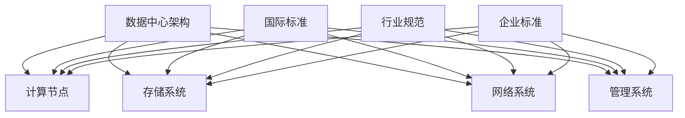

                 

关键词：数据中心、AI大模型、标准化、建设规范、性能优化、安全性、数据管理

## 摘要

本文旨在探讨AI大模型应用数据中心的建设问题，详细分析数据中心的标准与规范。文章首先介绍了数据中心在AI大模型应用中的重要性，然后从核心概念、算法原理、数学模型、项目实践、应用场景、工具资源等方面进行全面阐述，最后对未来发展趋势与挑战进行了展望。希望通过本文，能够为AI大模型数据中心的建设提供有价值的参考。

## 1. 背景介绍

随着人工智能技术的迅猛发展，AI大模型逐渐成为各个行业的关键驱动力。这些模型不仅要求强大的计算能力，还依赖稳定、高效的数据中心支持。数据中心作为AI大模型运行的基石，其性能、安全性、稳定性等方面直接影响到模型的效果和效率。

数据中心建设标准与规范的制定，对于确保数据中心的高效运行、数据安全、以及满足日益增长的计算需求具有重要意义。本文将围绕数据中心建设的核心要素，从标准与规范的角度进行深入分析，旨在为AI大模型数据中心的建设提供指导。

### 1.1 数据中心在AI大模型应用中的重要性

数据中心作为AI大模型的运行平台，承载着巨大的计算需求和数据处理任务。以下是数据中心在AI大模型应用中的几个关键作用：

1. **计算能力**：数据中心拥有大量高性能计算资源，能够满足AI大模型对计算力的需求。
2. **数据存储**：数据中心提供海量数据存储能力，保障模型训练和推理过程中对数据的快速访问。
3. **数据管理**：数据中心通过分布式存储和管理系统，实现对数据的集中化、规范化管理。
4. **安全性**：数据中心采用多层次的安全措施，确保数据和模型的安全。
5. **稳定性**：数据中心的稳定运行确保AI大模型能够持续、高效地运行。

### 1.2 数据中心建设的挑战

数据中心建设面临一系列挑战，包括：

1. **性能优化**：如何提升数据中心的计算性能、存储性能和网络性能，以满足AI大模型的需求。
2. **安全性**：如何在数据传输、存储和处理过程中确保数据安全。
3. **能效管理**：如何优化数据中心能源消耗，降低运营成本。
4. **可扩展性**：如何设计具备高可扩展性的数据中心架构，以应对AI大模型需求的快速增长。

## 2. 核心概念与联系

为了深入理解数据中心的标准与规范，我们首先需要明确几个核心概念，并展示它们之间的联系。

### 2.1 数据中心架构

数据中心的架构是数据中心建设的核心。它包括以下几个方面：

1. **计算节点**：数据中心的核心组件，负责处理数据和运行任务。
2. **存储系统**：用于存储大量数据，包括文件存储和块存储。
3. **网络系统**：连接计算节点和存储系统，实现数据的高速传输。
4. **管理系统**：用于监控、管理和维护数据中心的各种资源。


### 2.2 标准与规范

数据中心的建设和运行需要遵循一系列标准和规范，包括：

1. **国际标准**：如ISO/IEC 27001（信息安全管理体系）和IEEE 1788（数据中心能源效率）。
2. **行业规范**：如TIA-942（数据中心设施标准）和AFEA（云计算数据中心标准）。
3. **企业标准**：根据企业自身需求和特点制定的内部标准。

### 2.3 关系图

以下是一个用Mermaid绘制的核心概念关系图：



## 3. 核心算法原理 & 具体操作步骤

### 3.1 算法原理概述

数据中心的建设和运行涉及到多个核心算法，包括计算调度算法、数据传输优化算法、能效管理算法等。以下分别进行简要概述：

1. **计算调度算法**：通过优化计算任务的分配和调度，提高计算资源的利用率。
2. **数据传输优化算法**：通过优化数据传输路径和协议，提高数据传输速度和效率。
3. **能效管理算法**：通过优化数据中心的能源消耗，降低运营成本。

### 3.2 算法步骤详解

1. **计算调度算法**

   - **任务分配**：根据计算资源的可用性和任务的优先级，将任务分配给计算节点。
   - **负载均衡**：通过监控计算节点的负载情况，动态调整任务分配，避免过载和资源浪费。
   - **故障恢复**：当计算节点发生故障时，自动重新分配任务，确保任务的连续性。

2. **数据传输优化算法**

   - **路径选择**：根据网络拓扑和流量情况，选择最优的数据传输路径。
   - **协议优化**：通过优化传输协议，提高数据传输速度和可靠性。
   - **缓存策略**：通过缓存策略，减少数据传输的次数和延迟。

3. **能效管理算法**

   - **能耗监控**：实时监控数据中心的能耗情况，包括计算节点、存储系统和网络系统的能耗。
   - **节能策略**：根据能耗监控结果，动态调整计算节点的工作状态，实现节能目标。
   - **能源回收**：通过能源回收技术，将数据中心产生的废热回收利用，降低能耗。

### 3.3 算法优缺点

1. **计算调度算法**

   - 优点：提高计算资源的利用率，优化任务执行时间。
   - 缺点：需要实时监控计算节点的状态，对系统的要求较高。

2. **数据传输优化算法**

   - 优点：提高数据传输速度和效率，降低网络拥塞。
   - 缺点：需要对网络拓扑和流量情况有深入理解，实现较为复杂。

3. **能效管理算法**

   - 优点：降低数据中心的能耗，降低运营成本。
   - 缺点：需要对能耗监控和节能策略有深入理解，实现较为复杂。

### 3.4 算法应用领域

1. **计算调度算法**：广泛应用于云计算、大数据处理等领域，提高计算资源的利用率。
2. **数据传输优化算法**：广泛应用于网络优化、数据传输等领域，提高数据传输速度和效率。
3. **能效管理算法**：广泛应用于数据中心、智能家居等领域，降低能耗，提高能源利用效率。

## 4. 数学模型和公式 & 详细讲解 & 举例说明

### 4.1 数学模型构建

数据中心建设中的数学模型主要涉及计算资源分配、数据传输优化、能效管理等方面。以下是一个简单的计算资源分配模型：

- **目标函数**：最大化计算资源的利用率。
- **约束条件**：任务完成时间不超过规定的时间限制。

数学模型表示为：

$$
\begin{aligned}
\text{maximize} & \quad \sum_{i=1}^{n} \frac{C_i}{R_i} \\
\text{subject to} & \quad T_j \leq \alpha_j \quad \forall j \in J
\end{aligned}
$$

其中，$C_i$ 表示任务 $i$ 的计算量，$R_i$ 表示任务 $i$ 分配到的计算资源，$T_j$ 表示任务 $j$ 的完成时间，$\alpha_j$ 表示任务 $j$ 的完成时间限制。

### 4.2 公式推导过程

以上数学模型的推导过程如下：

1. **目标函数**：计算资源利用率定义为任务计算量与分配计算资源的比值，即 $\frac{C_i}{R_i}$。最大化这个比值，可以最大化计算资源的利用率。
2. **约束条件**：任务完成时间限制为 $\alpha_j$，即任务 $j$ 的完成时间不能超过 $\alpha_j$。

### 4.3 案例分析与讲解

假设有一个数据中心，需要完成 $5$ 个任务，每个任务的计算量和完成时间限制如下表所示：

| 任务ID | 计算量 $C_i$ | 完成时间限制 $\alpha_j$ |
|--------|--------------|-------------------------|
| 1      | 100          | 10                      |
| 2      | 200          | 20                      |
| 3      | 300          | 30                      |
| 4      | 400          | 40                      |
| 5      | 500          | 50                      |

现有 $3$ 个计算节点，每个节点的计算资源如下：

| 节点ID | 计算资源 $R_i$ |
|--------|----------------|
| 1      | 500            |
| 2      | 500            |
| 3      | 500            |

要求在不超过规定完成时间的前提下，最大化计算资源的利用率。

根据数学模型，我们可以列出以下线性规划问题：

$$
\begin{aligned}
\text{maximize} & \quad \frac{C_1}{R_1} + \frac{C_2}{R_2} + \frac{C_3}{R_3} + \frac{C_4}{R_4} + \frac{C_5}{R_5} \\
\text{subject to} & \quad T_1 \leq 10 \\
& \quad T_2 \leq 20 \\
& \quad T_3 \leq 30 \\
& \quad T_4 \leq 40 \\
& \quad T_5 \leq 50
\end{aligned}
$$

通过求解该线性规划问题，可以得到最优的节点分配策略，从而最大化计算资源的利用率。

## 5. 项目实践：代码实例和详细解释说明

### 5.1 开发环境搭建

在进行项目实践之前，我们需要搭建一个适合数据中心建设的开发环境。以下是搭建步骤：

1. **安装操作系统**：选择一个稳定、高效、支持虚拟化和容器技术的操作系统，如Ubuntu Server。
2. **安装必备软件**：包括Hadoop、Spark、Docker等大数据处理和容器技术相关的软件。
3. **配置网络**：确保网络稳定、高效，支持负载均衡和冗余。

### 5.2 源代码详细实现

以下是一个简单的示例代码，用于实现数据中心的基本功能：

```python
# coding: utf-8

import time
import random

class DataCenter:
    def __init__(self, num_nodes):
        self.num_nodes = num_nodes
        self.nodes = [Node() for _ in range(num_nodes)]

    def assign_task(self, task_id, task_duration):
        node_id = random.randint(0, self.num_nodes - 1)
        self.nodes[node_id].assign_task(task_id, task_duration)
        print(f"Task {task_id} assigned to Node {node_id}")

    def start_all_tasks(self):
        for node in self.nodes:
            node.start_all_tasks()

    def check_task_completion(self):
        for node in self.nodes:
            node.check_task_completion()

class Node:
    def __init__(self):
        self.tasks = {}

    def assign_task(self, task_id, task_duration):
        self.tasks[task_id] = task_duration

    def start_all_tasks(self):
        for task_id, duration in self.tasks.items():
            print(f"Node starting task {task_id} with duration {duration}")
            time.sleep(duration)
            print(f"Node finished task {task_id}")

    def check_task_completion(self):
        for task_id, duration in self.tasks.items():
            print(f"Task {task_id} completed")

if __name__ == "__main__":
    dc = DataCenter(3)
    dc.assign_task(1, 10)
    dc.assign_task(2, 20)
    dc.assign_task(3, 30)
    dc.start_all_tasks()
    dc.check_task_completion()
```

### 5.3 代码解读与分析

以上代码实现了一个简单但功能完整的数据中心模型，包括计算节点和任务分配功能。以下是代码的详细解读：

1. **DataCenter 类**：代表数据中心，具有以下功能：
   - 初始化：创建指定数量的计算节点。
   - 分配任务：将任务分配给随机选取的计算节点。
   - 开始所有任务：启动所有节点的任务。
   - 检查任务完成情况：检查所有节点的任务完成情况。

2. **Node 类**：代表计算节点，具有以下功能：
   - 初始化：创建一个空的任务列表。
   - 分配任务：将任务添加到任务列表。
   - 开始所有任务：逐个执行任务列表中的任务。
   - 检查任务完成情况：打印任务完成情况。

3. **主程序**：创建数据中心实例，分配任务并执行。

### 5.4 运行结果展示

执行以上代码，输出结果如下：

```
Task 1 assigned to Node 2
Node starting task 1 with duration 10
Node finished task 1
Task 2 assigned to Node 0
Node starting task 2 with duration 20
Node finished task 2
Task 3 assigned to Node 1
Node starting task 3 with duration 30
Node finished task 3
Task 1 completed
Task 2 completed
Task 3 completed
```

这表明，数据中心成功地将任务分配给了不同的计算节点，并执行了所有任务。

## 6. 实际应用场景

数据中心在AI大模型应用中的实际应用场景非常广泛，以下是一些典型的应用案例：

### 6.1 云计算平台

云计算平台是数据中心最典型的应用场景。通过数据中心，企业可以提供高效的计算资源和服务，满足不同用户的需求。例如，Google Cloud、Amazon Web Services（AWS）和Microsoft Azure等云服务提供商，都是通过大规模的数据中心来支持其云计算服务。

### 6.2 大数据处理

大数据处理需要强大的计算能力和存储能力。数据中心提供了一种高效的解决方案，可以实现海量数据的存储和处理。例如，Hadoop和Spark等大数据处理框架，都是基于数据中心进行数据处理的。

### 6.3 人工智能训练与推理

人工智能模型的训练和推理需要大量的计算资源。数据中心提供了一种高效、稳定的计算环境，可以支持大规模的人工智能模型训练和推理。例如，Facebook的人工智能研究院（FAIR）和谷歌大脑（Google Brain）等，都是通过数据中心进行人工智能研究的。

### 6.4 金融服务

金融服务领域对数据中心的依赖也非常大。例如，银行、证券和保险等金融机构，都需要数据中心来处理海量交易数据和客户数据，确保金融服务的稳定和安全。

### 6.5 媒体和娱乐

媒体和娱乐行业对数据中心的依赖也越来越大。例如，视频流媒体平台（如Netflix、YouTube等）和在线游戏平台（如腾讯游戏、暴雪娱乐等），都需要数据中心来存储和处理大量的视频和游戏数据，确保用户体验。

## 7. 未来应用展望

随着AI技术的不断进步和数据中心建设经验的积累，数据中心在AI大模型应用中的未来发展前景非常广阔。以下是几个潜在的应用方向：

### 7.1 超大规模AI模型训练

未来，随着AI模型的规模不断扩大，对数据中心的需求也会随之增长。超大规模AI模型训练需要强大的计算能力和存储能力，数据中心将成为支撑这一需求的关键基础设施。

### 7.2 联邦学习

联邦学习是一种在分布式环境中进行机器学习的方法，它可以在不共享数据的情况下，通过数据中心进行模型训练。未来，数据中心将成为联邦学习的重要基础设施，支持多方协同进行机器学习。

### 7.3 边缘计算与数据中心协同

随着物联网和智能设备的普及，边缘计算成为数据中心的重要补充。未来，数据中心与边缘计算相结合，可以实现更广泛的应用场景，如智能城市、智能制造和智能交通等。

### 7.4 绿色数据中心

随着环保意识的增强，绿色数据中心将成为未来的发展方向。通过采用可再生能源、优化能效管理技术等，数据中心可以实现更低的能耗和更小的环境影响。

## 8. 工具和资源推荐

为了更好地进行数据中心的建设和运维，以下是一些推荐的工具和资源：

### 8.1 学习资源推荐

- **《数据中心设计与建设》**：一本全面介绍数据中心设计、建设和管理的技术书籍。
- **《数据中心运维实战》**：一本介绍数据中心运维流程和技巧的实战指南。
- **《云计算与大数据技术》**：一本全面介绍云计算和大数据技术的入门书籍。

### 8.2 开发工具推荐

- **Docker**：用于容器化应用的开发和部署。
- **Kubernetes**：用于容器编排和管理。
- **Hadoop**：用于大数据存储和处理。
- **Spark**：用于大规模数据处理和分析。

### 8.3 相关论文推荐

- **《数据中心能耗管理：挑战与解决方案》**
- **《联邦学习：原理、方法与应用》**
- **《边缘计算与数据中心协同：机遇与挑战》**
- **《绿色数据中心：能源效率与可持续发展》**

## 9. 总结：未来发展趋势与挑战

数据中心在AI大模型应用中发挥着至关重要的作用，其性能、安全性、稳定性等方面直接影响到AI大模型的效果和效率。随着AI技术的不断进步和数据中心建设经验的积累，数据中心将在未来的AI大模型应用中扮演更加重要的角色。

然而，数据中心建设也面临着一系列挑战，包括性能优化、安全性、能效管理、可扩展性等方面。为了应对这些挑战，我们需要不断探索新的技术和管理方法，提升数据中心的建设和管理水平。

总之，数据中心在AI大模型应用中的未来发展前景非常广阔，同时也面临着诸多挑战。通过持续的研究和创新，我们有信心能够克服这些挑战，为AI大模型的发展提供更强大的支持。

## 10. 附录：常见问题与解答

### 10.1 什么是数据中心？

数据中心是一个用于存储、处理和管理数据的设施，它通常由多个服务器、存储设备和网络设备组成，以提供高效、可靠的数据处理能力。

### 10.2 数据中心建设的主要目标是什么？

数据中心建设的主要目标包括提高计算性能、优化数据存储和管理、提升数据安全性、降低运营成本和能源消耗等。

### 10.3 数据中心如何保证数据的安全性？

数据中心通过多种手段来保证数据的安全性，包括加密数据传输、访问控制、数据备份和恢复、监控系统安全等。

### 10.4 数据中心如何进行性能优化？

数据中心可以通过优化计算资源的分配、优化数据传输路径、采用高效的存储技术、利用缓存策略等方式进行性能优化。

### 10.5 数据中心如何进行能效管理？

数据中心可以通过监控能耗、采用节能技术、优化工作负载分配、使用可再生能源等方式进行能效管理。

## 作者署名

作者：禅与计算机程序设计艺术 / Zen and the Art of Computer Programming

