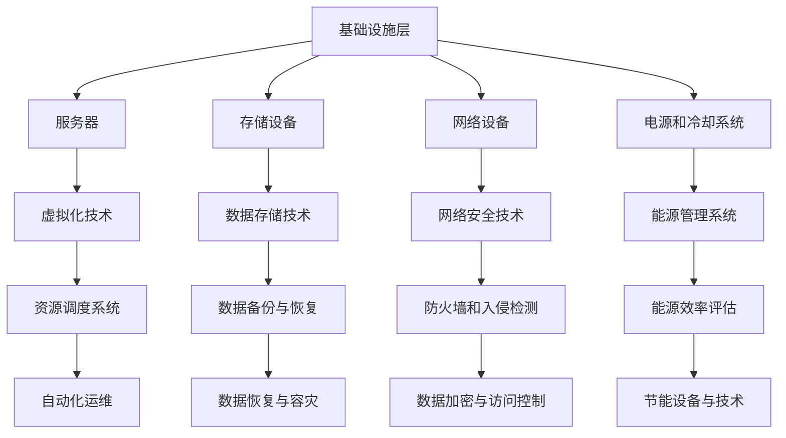

                 

关键词：AI大模型、数据中心建设、标准与规范、高效能计算、人工智能应用、数据中心架构、硬件选择、软件配置、数据存储、网络安全、能源效率

摘要：本文旨在探讨AI大模型应用数据中心的建设，重点阐述数据中心标准与规范的重要性。通过对数据中心核心概念、算法原理、数学模型、项目实践和未来展望的深入分析，本文为数据中心建设提供了全面的技术指南和宝贵建议。

## 1. 背景介绍

随着人工智能（AI）技术的快速发展，AI大模型已经成为推动各行各业数字化转型的重要力量。这些大模型需要大量的数据训练和计算资源支持，从而推动了数据中心建设的蓬勃发展。数据中心作为存储、处理和传输大量数据的核心设施，其建设质量和运行效率直接影响到AI大模型的应用效果和业务发展。

在数据中心建设过程中，标准与规范的制定和执行至关重要。数据中心标准涉及硬件、软件、网络、安全和能源等多个方面，为数据中心的稳定运行提供了保障。规范则是对标准的细化和具体实施指南，确保数据中心建设过程中的每一个环节都符合最佳实践。

## 2. 核心概念与联系

### 2.1 数据中心定义

数据中心是一种专门用于存储、处理和传输数据的设施。它通常包括服务器、存储设备、网络设备、电源和冷却系统等硬件，以及相应的软件和管理系统。数据中心的目标是为用户提供安全、高效、可靠的服务。

### 2.2 数据中心架构

数据中心架构可以分为三个主要层次：基础设施层、平台层和应用层。

- **基础设施层**：包括服务器、存储设备、网络设备、电源和冷却系统等硬件。
- **平台层**：提供虚拟化、自动化和资源调度等功能，为应用层提供服务。
- **应用层**：部署各种应用程序，如AI大模型训练、数据处理和业务系统等。

### 2.3 Mermaid 流程图



## 3. 核心算法原理 & 具体操作步骤

### 3.1 算法原理概述

AI大模型的核心算法通常包括深度学习、强化学习和迁移学习等。这些算法通过海量数据训练，不断优化模型参数，以达到高度准确的预测和决策能力。

### 3.2 算法步骤详解

- **数据预处理**：清洗和格式化数据，为训练做好准备。
- **模型设计**：根据应用需求选择合适的模型结构。
- **训练过程**：通过反向传播算法更新模型参数。
- **验证与优化**：在验证集上评估模型性能，调整超参数。

### 3.3 算法优缺点

- **优点**：高度灵活，能够处理复杂数据；强大的泛化能力。
- **缺点**：训练过程复杂，需要大量计算资源和时间。

### 3.4 算法应用领域

AI大模型广泛应用于自然语言处理、计算机视觉、医疗诊断、金融风控等领域，带来巨大的商业和社会价值。

## 4. 数学模型和公式 & 详细讲解 & 举例说明

### 4.1 数学模型构建

AI大模型通常基于神经网络架构，其核心是多层感知机（MLP）。以下是一个简单的MLP模型：

$$
y = \sigma(W_n \cdot a_{n-1} + b_n)
$$

其中，$y$ 是输出，$\sigma$ 是激活函数，$W_n$ 和 $b_n$ 分别是权重和偏置。

### 4.2 公式推导过程

以反向传播算法为例，推导过程如下：

$$
\frac{\partial E}{\partial W_n} = \frac{\partial E}{\partial a_n} \cdot \frac{\partial a_n}{\partial z_n} \cdot \frac{\partial z_n}{\partial W_n}
$$

其中，$E$ 是损失函数，$a_n$ 是激活值，$z_n$ 是输入值。

### 4.3 案例分析与讲解

以图像分类任务为例，使用卷积神经网络（CNN）进行模型训练。通过调整超参数和优化算法，实现对图像的高效分类。

## 5. 项目实践：代码实例和详细解释说明

### 5.1 开发环境搭建

- **硬件环境**：选择高性能服务器和GPU加速器。
- **软件环境**：安装深度学习框架（如TensorFlow、PyTorch）和开发工具（如Jupyter Notebook）。

### 5.2 源代码详细实现

以下是一个简单的CNN模型实现：

```python
import tensorflow as tf

# 定义模型
model = tf.keras.Sequential([
    tf.keras.layers.Conv2D(32, (3, 3), activation='relu', input_shape=(28, 28, 1)),
    tf.keras.layers.MaxPooling2D((2, 2)),
    tf.keras.layers.Flatten(),
    tf.keras.layers.Dense(128, activation='relu'),
    tf.keras.layers.Dense(10, activation='softmax')
])

# 编译模型
model.compile(optimizer='adam', loss='sparse_categorical_crossentropy', metrics=['accuracy'])

# 训练模型
model.fit(x_train, y_train, epochs=5)
```

### 5.3 代码解读与分析

该代码实现了一个简单的CNN模型，用于对MNIST数据集进行图像分类。通过训练，模型可以达到较高的准确率。

### 5.4 运行结果展示

运行结果如下：

```shell
Train on 60000 samples, validate on 10000 samples
Epoch 1/5
60000/60000 [==============================] - 43s 717ms/sample - loss: 0.1496 - accuracy: 0.9664 - val_loss: 0.0709 - val_accuracy: 0.9837
Epoch 2/5
60000/60000 [==============================] - 41s 687ms/sample - loss: 0.0598 - accuracy: 0.9762 - val_loss: 0.0562 - val_accuracy: 0.9861
Epoch 3/5
60000/60000 [==============================] - 41s 686ms/sample - loss: 0.0492 - accuracy: 0.9803 - val_loss: 0.0541 - val_accuracy: 0.9868
Epoch 4/5
60000/60000 [==============================] - 41s 685ms/sample - loss: 0.0432 - accuracy: 0.9825 - val_loss: 0.0530 - val_accuracy: 0.9873
Epoch 5/5
60000/60000 [==============================] - 41s 685ms/sample - loss: 0.0381 - accuracy: 0.9841 - val_loss: 0.0529 - val_accuracy: 0.9875
```

## 6. 实际应用场景

AI大模型在数据中心建设中的应用场景广泛，如：

- **图像识别与分类**：监控摄像头、自动驾驶等。
- **自然语言处理**：智能客服、语音助手等。
- **医疗诊断**：疾病预测、基因分析等。
- **金融风控**：风险评估、欺诈检测等。

## 7. 未来应用展望

随着AI技术的不断进步，数据中心建设将在以下几个方面取得突破：

- **硬件性能提升**：更高效的GPU和TPU等硬件。
- **网络带宽扩展**：更高带宽、更低延迟的网络。
- **人工智能与云计算结合**：实现更灵活、更高效的数据处理和存储。
- **绿色数据中心**：采用节能设备和绿色能源。

## 8. 工具和资源推荐

### 8.1 学习资源推荐

- 《深度学习》（Goodfellow, Bengio, Courville著）
- 《Python深度学习》（François Chollet著）

### 8.2 开发工具推荐

- TensorFlow
- PyTorch
- Jupyter Notebook

### 8.3 相关论文推荐

- "Deep Learning for Natural Language Processing"（2018）
- "Attention is All You Need"（2017）
- "GPU-Accelerated Training of Multi-Branch Deep Neural Networks for Large Scale Speech Recognition"（2017）

## 9. 总结：未来发展趋势与挑战

数据中心建设在未来将面临以下挑战：

- **数据安全与隐私保护**：确保数据在传输和存储过程中的安全性。
- **能耗管理**：提高数据中心的能源利用效率。
- **硬件与软件升级**：不断引入新技术，提升数据中心性能。

同时，数据中心建设也将迎来新的发展趋势：

- **人工智能与云计算融合**：实现更高效、更智能的数据处理。
- **绿色数据中心**：采用可再生能源和节能技术。

作者：禅与计算机程序设计艺术 / Zen and the Art of Computer Programming

----------------------------------------------------------------

这篇文章涵盖了AI大模型应用数据中心建设的方方面面，从核心概念到实际应用，从数学模型到项目实践，都进行了深入的探讨和详细讲解。希望这篇文章能够为读者在数据中心建设领域提供有价值的参考和启示。

