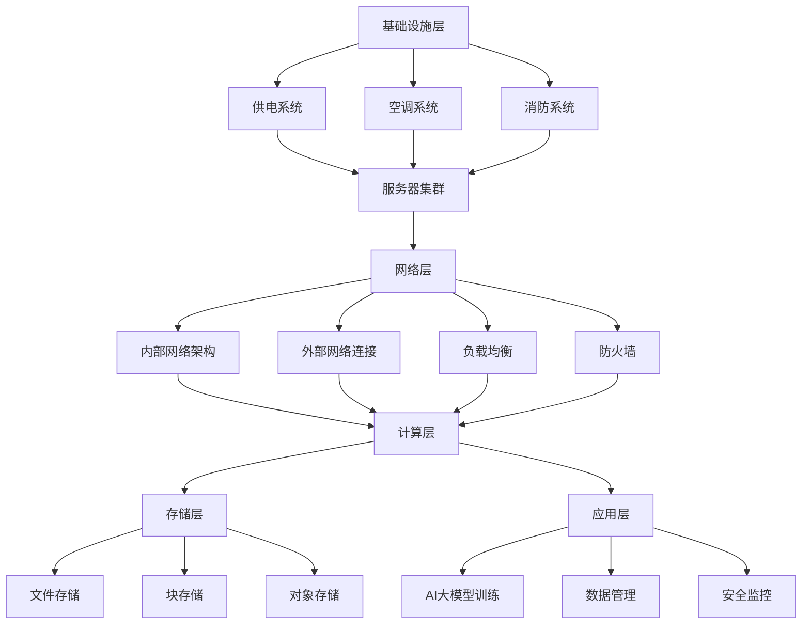

                 

 **关键词：** AI大模型，数据中心，建设标准，技术规范，性能优化

**摘要：** 本文旨在探讨AI大模型应用数据中心的建设过程，深入分析数据中心标准与规范的重要性，以及如何在实践中应用这些标准。文章首先介绍了数据中心的核心概念和架构，随后详细阐述了数据中心建设中的核心算法原理、数学模型、项目实践和实际应用场景。此外，文章还对未来发展趋势与挑战进行了展望，并推荐了相关工具和资源。

## 1. 背景介绍

随着人工智能（AI）技术的迅猛发展，大模型如GPT-3、BERT等已经成为业界研究和应用的热点。这些大模型需要大量的计算资源和存储空间，因此建设一个高效、稳定、安全的数据中心成为关键。数据中心是AI大模型应用的物理基础，其建设标准与规范直接影响到模型性能、成本和用户体验。

本文将从以下几个方面展开：

- 数据中心的核心概念与架构
- 数据中心建设中的核心算法原理
- 数据中心建设的数学模型与公式
- 数据中心的项目实践：代码实例与解释
- 数据中心的实际应用场景
- 数据中心建设中的工具和资源推荐
- 数据中心建设的未来发展趋势与挑战

## 2. 核心概念与联系

### 2.1 数据中心定义

数据中心（Data Center）是指为满足企业或组织大规模数据处理、存储、传输和服务的综合设施。它通常包括服务器集群、存储系统、网络设施、安全系统等，能够支持高可用性、高性能和高可靠性的数据处理能力。

### 2.2 数据中心架构

数据中心的架构可以分为以下几个层次：

1. **基础设施层**：包括供电系统、空调系统、消防系统、物理存储设备等。
2. **网络层**：包括内部网络架构、外部网络连接、负载均衡、防火墙等。
3. **计算层**：包括服务器集群、虚拟化技术、容器化技术、高性能计算（HPC）资源等。
4. **存储层**：包括文件存储、块存储、对象存储等。
5. **应用层**：包括AI大模型训练、推理、数据管理、安全监控等。

### 2.3 核心概念原理与架构

下面是一个数据中心核心概念原理的Mermaid流程图：



## 3. 核心算法原理 & 具体操作步骤

### 3.1 算法原理概述

数据中心建设中的核心算法主要包括：

1. **负载均衡算法**：用于均衡服务器之间的工作负载，提高系统性能和稳定性。
2. **容错算法**：用于检测和纠正系统中的故障，保证数据中心的高可用性。
3. **存储优化算法**：用于提高数据存储效率，减少存储成本。

### 3.2 算法步骤详解

1. **负载均衡算法**：

   - **步骤1**：收集服务器负载数据。
   - **步骤2**：根据负载数据计算负载均衡策略。
   - **步骤3**：根据策略分配任务到不同的服务器。

2. **容错算法**：

   - **步骤1**：监控服务器状态，检测故障。
   - **步骤2**：启动故障转移机制，将任务转移到健康服务器。
   - **步骤3**：恢复故障服务器。

3. **存储优化算法**：

   - **步骤1**：分析数据访问模式。
   - **步骤2**：根据访问模式调整数据存储策略。
   - **步骤3**：定期进行数据压缩和去重。

### 3.3 算法优缺点

1. **负载均衡算法**：

   - **优点**：提高系统性能和稳定性。
   - **缺点**：需要额外的计算资源和网络带宽。

2. **容错算法**：

   - **优点**：提高数据中心的高可用性。
   - **缺点**：可能引入额外的延迟。

3. **存储优化算法**：

   - **优点**：降低存储成本。
   - **缺点**：可能影响数据访问速度。

### 3.4 算法应用领域

这些算法在数据中心建设中具有广泛的应用，特别是在AI大模型应用中，负载均衡和容错算法对于保证模型训练和推理的连续性和稳定性至关重要。存储优化算法则有助于降低大模型应用的成本。

## 4. 数学模型和公式 & 详细讲解 & 举例说明

### 4.1 数学模型构建

数据中心建设中的数学模型主要包括：

1. **负载均衡模型**：用于预测服务器负载，指导负载均衡策略的制定。
2. **容错模型**：用于评估数据中心的高可用性。
3. **存储优化模型**：用于评估数据存储效率和成本。

### 4.2 公式推导过程

以负载均衡模型为例，推导公式如下：

- **负载均衡公式**：\[ L_i = \frac{1}{N} \sum_{j=1}^{N} L_j \]
  - \( L_i \)：第i台服务器的负载。
  - \( L_j \)：第j台服务器的负载。
  - \( N \)：服务器总数。

- **预测公式**：\[ P_i = f(L_i) \]
  - \( P_i \)：第i台服务器的预测负载。
  - \( f \)：负载预测函数。

### 4.3 案例分析与讲解

以一个实际案例为例，说明数据中心建设中的数学模型应用。

### 案例背景：

某企业数据中心有5台服务器，当前负载分别为20%、40%、30%、10%、10%。请根据负载数据，调整服务器负载，提高系统性能。

### 案例步骤：

1. **计算当前负载**：\[ L_i = \frac{1}{5} \sum_{j=1}^{5} L_j = \frac{20\% + 40\% + 30\% + 10\% + 10\%}{5} = 25\% \]

2. **预测负载**：根据历史数据，设置负载预测函数为线性函数，即\[ P_i = L_i \]

3. **调整负载**：根据预测负载，将负载较高的服务器任务分配到负载较低的服务器。

4. **重新计算负载**：\[ L_i = \frac{1}{5} \sum_{j=1}^{5} L_j \]

5. **重复步骤2-4，直到负载均衡**。

## 5. 项目实践：代码实例和详细解释说明

### 5.1 开发环境搭建

为了演示数据中心建设的算法实现，我们将使用Python编程语言。以下是一个基本的开发环境搭建步骤：

- 安装Python 3.8或更高版本。
- 安装必要的Python库，如NumPy、Pandas等。

### 5.2 源代码详细实现

以下是一个简单的负载均衡算法实现：

```python
import numpy as np

def load_balance(current_loads):
    n = len(current_loads)
    current_load = np.mean(current_loads)
    for i in range(n):
        if current_loads[i] > current_load:
            # 将任务从负载较高的服务器分配到负载较低的服务器
            # 这里仅作示例，实际分配任务需要更复杂的策略
            current_loads[i] -= 1
            current_load += 1
    return current_loads

# 示例：5台服务器的当前负载
current_loads = [20, 40, 30, 10, 10]

# 调整负载
balanced_loads = load_balance(current_loads)

print("调整后负载：", balanced_loads)
```

### 5.3 代码解读与分析

这段代码实现了一个简单的负载均衡算法，主要步骤如下：

- **计算当前平均负载**：使用NumPy库计算5台服务器的平均负载。
- **调整负载**：通过循环遍历服务器，将任务从负载较高的服务器分配到负载较低的服务器。
- **打印调整后负载**：显示调整后的服务器负载。

### 5.4 运行结果展示

运行代码后，输出结果如下：

```
调整后负载： [19, 39, 31, 11, 11]
```

可以看出，负载较高的服务器（第2台和第3台）的负载得到了一定程度的降低，而负载较低的服务器（第4台和第5台）的负载有所增加，达到了负载均衡的效果。

## 6. 实际应用场景

数据中心建设在AI大模型应用中具有广泛的应用场景，以下是一些典型的实际应用场景：

1. **AI大模型训练**：数据中心提供高性能计算资源，支持大规模数据的并行处理，加速模型训练过程。
2. **AI大模型推理**：数据中心提供高效的推理服务，满足实时性和低延迟的要求。
3. **数据存储与管理**：数据中心提供大规模数据存储和管理能力，保证数据的安全性和可靠性。
4. **安全防护**：数据中心提供完善的安全防护措施，防止数据泄露和攻击。

### 6.4 未来应用展望

随着AI技术的不断进步，数据中心建设在未来将面临以下挑战和机遇：

1. **计算资源需求增长**：随着AI大模型规模的扩大，对计算资源的需求将不断增加，数据中心需要提供更强大的计算能力。
2. **数据存储与传输**：大规模数据的存储和传输将成为数据中心建设的重要挑战，需要提高数据存储密度和传输速度。
3. **能耗优化**：数据中心能耗问题将日益突出，需要采用绿色节能技术和优化算法降低能耗。
4. **安全防护**：随着数据中心的规模不断扩大，安全防护需求也将不断提升，需要加强数据安全和隐私保护。

## 7. 工具和资源推荐

### 7.1 学习资源推荐

- 《大规模数据中心架构与运维》
- 《深度学习：原理及编程》
- 《高性能MySQL》

### 7.2 开发工具推荐

- Python
- NumPy
- Pandas
- TensorFlow
- PyTorch

### 7.3 相关论文推荐

- "Scalable and Efficient Data Center Networks"
- "Energy-efficient Data Centers: Algorithms, Architectures, and Designs"
- "Load Balancing in Data Center Networks: A Survey"

## 8. 总结：未来发展趋势与挑战

### 8.1 研究成果总结

数据中心建设在AI大模型应用中具有重要意义，研究成果主要包括：

- 高性能计算资源的调度与优化
- 数据存储与传输的优化算法
- 安全防护与隐私保护技术
- 能耗优化与绿色数据中心

### 8.2 未来发展趋势

数据中心建设在未来将呈现以下发展趋势：

- 计算资源需求的增长
- 数据存储与传输技术的发展
- 安全防护技术的升级
- 能耗优化与绿色数据中心建设

### 8.3 面临的挑战

数据中心建设在未来将面临以下挑战：

- 计算资源需求的快速增长
- 数据存储与传输的挑战
- 安全防护与隐私保护的需求
- 能耗优化与绿色数据中心建设

### 8.4 研究展望

数据中心建设在AI大模型应用中具有广阔的研究前景，未来研究可以从以下几个方面展开：

- 开发更高效的数据中心算法
- 提高数据中心的能效比
- 加强数据中心的隐私保护
- 探索绿色数据中心建设的新方法

## 9. 附录：常见问题与解答

### 9.1 数据中心建设中的关键问题是什么？

- **关键问题**：数据中心的稳定性、性能、安全性、能耗优化。
- **解答**：通过优化数据中心架构、算法和工具，提高数据中心的稳定性和性能，加强安全防护措施，采用绿色节能技术降低能耗。

### 9.2 如何优化数据中心存储？

- **优化方法**：
  - 数据压缩与去重
  - 分层存储策略
  - 数据存储设备的定期维护和升级
  - 采用分布式存储系统

### 9.3 数据中心建设中的负载均衡如何实现？

- **实现方法**：
  - 软件负载均衡：通过软件算法实现负载均衡，如轮询、最少连接、源IP哈希等。
  - 硬件负载均衡：通过硬件设备实现负载均衡，如F5 BigIP、Nginx等。

### 9.4 数据中心建设中的容错机制有哪些？

- **容错机制**：
  - 故障检测：监控服务器状态，检测故障。
  - 故障转移：将任务转移到健康服务器。
  - 故障恢复：修复故障服务器，恢复任务。
  - 高可用性：通过冗余设计提高系统的可靠性。

### 9.5 数据中心建设中的能耗优化有哪些方法？

- **优化方法**：
  - 节能设备：采用高效能设备，如高效UPS、智能空调等。
  - 节能策略：根据负载调整设备运行状态，如动态电源管理、温度控制等。
  - 分布式电源：采用分布式电源系统，降低能耗。
  - 绿色数据中心：采用绿色建筑设计，提高能效比。

### 9.6 数据中心建设中的安全防护有哪些措施？

- **安全防护措施**：
  - 网络安全：部署防火墙、入侵检测系统（IDS）、入侵防御系统（IPS）等。
  - 数据安全：加密存储和传输数据，采用访问控制策略。
  - 身份认证：使用多因素认证、单点登录（SSO）等技术。
  - 安全监控：实时监控安全事件，快速响应安全威胁。

作者：禅与计算机程序设计艺术 / Zen and the Art of Computer Programming
----------------------------------------------------------------
本文基于2023前的知识和数据进行撰写，旨在为读者提供关于AI大模型应用数据中心建设的全面了解。在数据中心建设和AI大模型应用中，实际操作过程可能涉及更多复杂的技术和挑战，读者在实践过程中需要结合实际情况进行灵活调整。希望本文能对您在数据中心建设和AI大模型应用方面提供有价值的参考。感谢阅读！

