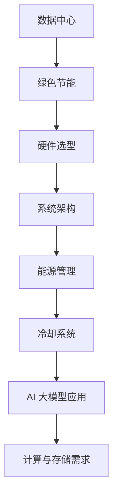
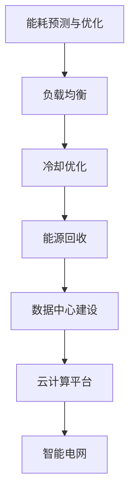

                 

在当今世界，人工智能（AI）正迅速成为推动科技进步和社会发展的核心动力。AI 大模型的应用需求日益增长，这不可避免地带来了对数据中心建设的挑战。数据中心不仅是 AI 模型的计算和存储枢纽，同时也是能源消耗和碳排放的重要源头。因此，如何实现数据中心绿色节能成为了一个亟待解决的问题。本文将深入探讨 AI 大模型应用数据中心建设的现状、核心概念、算法原理、数学模型、项目实践、实际应用场景以及未来展望。

> **关键词：** AI 大模型，数据中心，绿色节能，能源消耗，碳排放

> **摘要：** 本文从多个角度分析了 AI 大模型应用数据中心建设中的绿色节能问题，包括背景介绍、核心概念与联系、核心算法原理、数学模型和公式、项目实践以及实际应用场景等。文章旨在为相关领域的从业者提供有价值的参考和思路。

## 1. 背景介绍

数据中心是现代社会信息基础设施的重要组成部分，承载着全球数据存储、处理和交换的职责。随着大数据和人工智能技术的快速发展，数据中心的应用范围和规模不断扩大。然而，数据中心的高能耗和碳排放问题也日益凸显。据统计，全球数据中心每年的能源消耗已达到数百亿千瓦时，占全球总能源消耗的相当一部分。而 AI 大模型的应用对数据中心的计算和存储需求更是提出了新的挑战。

AI 大模型，如深度学习模型，通常需要大量的计算资源和存储空间。这不仅增加了数据中心的能耗，还加剧了温室气体排放。因此，实现数据中心的绿色节能已成为行业内的共识。绿色节能数据中心的建设不仅关乎环境保护，也关乎数据中心的可持续发展和经济效益。

## 2. 核心概念与联系

在探讨 AI 大模型应用数据中心建设中的绿色节能问题之前，我们首先需要明确几个核心概念：数据中心、绿色节能、AI 大模型以及它们之间的联系。

### 数据中心

数据中心是一种专门用于存储、处理和管理数据的设施。它通常由服务器、存储设备、网络设备和其他辅助设备组成。数据中心的规模可以从小型到超大型不等，其核心目标是提供稳定、可靠、高效的数据处理能力。

### 绿色节能

绿色节能是指通过采用节能技术和方法，减少能源消耗和碳排放，实现数据中心的可持续运行。绿色节能数据中心的建设涉及多个方面，包括硬件选型、系统架构设计、能源管理、冷却系统等。

### AI 大模型

AI 大模型是指具有大规模参数和计算需求的深度学习模型。这类模型通常用于图像识别、自然语言处理、推荐系统等领域。AI 大模型的应用对数据中心的计算和存储能力提出了极高的要求。

### 核心概念与联系

AI 大模型应用数据中心建设中的绿色节能问题，本质上是如何在满足计算和存储需求的同时，降低能源消耗和碳排放。这需要从硬件选型、系统架构设计、能源管理和冷却系统等多个方面进行综合考虑。

### 2.1 Mermaid 流程图



## 3. 核心算法原理 & 具体操作步骤

在实现数据中心绿色节能的过程中，核心算法原理和具体操作步骤起到了关键作用。以下是对这些内容的具体介绍。

### 3.1 算法原理概述

绿色节能算法主要基于以下几个原理：

- **能耗预测与优化**：通过预测数据中心的能耗，制定最优的能源使用策略，降低整体能耗。
- **负载均衡**：合理分配计算和存储资源，避免资源浪费，提高资源利用率。
- **冷却优化**：采用高效冷却系统，降低数据中心的散热负荷，减少能源消耗。
- **能源回收**：利用废热回收技术，将废热转化为可用能源，提高能源利用效率。

### 3.2 算法步骤详解

绿色节能算法的具体步骤如下：

1. **能耗预测与优化**：使用历史能耗数据，结合当前负载情况，预测未来的能耗需求，并制定最优的能源使用策略。
2. **负载均衡**：根据计算和存储资源的实际需求，动态调整资源分配，避免资源浪费。
3. **冷却优化**：采用高效的冷却系统，如水冷、风冷等，降低数据中心的散热负荷。
4. **能源回收**：利用废热回收技术，将废热转化为可用能源，降低整体能源消耗。

### 3.3 算法优缺点

**优点**：

- **降低能耗**：通过能耗预测和优化、负载均衡、冷却优化和能源回收等技术，可以有效降低数据中心的能耗。
- **提高资源利用率**：合理分配资源，避免资源浪费，提高资源利用率。
- **减少碳排放**：降低能耗意味着减少碳排放，有利于环境保护。

**缺点**：

- **初期投入较大**：实现绿色节能数据中心需要投入大量的资金和人力，初期成本较高。
- **技术难度较高**：涉及多种技术的综合应用，对技术要求较高。

### 3.4 算法应用领域

绿色节能算法广泛应用于以下几个方面：

- **数据中心建设**：在数据中心的设计、建设和运营过程中，采用绿色节能算法，降低能耗和碳排放。
- **云计算平台**：在云计算平台中，通过绿色节能算法优化资源分配和能源使用，提高资源利用率和服务性能。
- **智能电网**：在智能电网中，通过绿色节能算法优化能源分配和能源使用，提高电网效率和稳定性。

### 3.5 Mermaid 流程图



## 4. 数学模型和公式 & 详细讲解 & 举例说明

在实现绿色节能数据中心的过程中，数学模型和公式起到了重要的作用。以下是对相关数学模型和公式的详细讲解和举例说明。

### 4.1 数学模型构建

绿色节能数据中心的数学模型主要包括以下几个部分：

- **能耗模型**：用于预测数据中心的能耗，构建能耗模型的关键是获取准确的历史能耗数据和当前的负载情况。
- **资源分配模型**：用于优化资源分配，提高资源利用率，构建资源分配模型的关键是合理定义资源的权重和约束条件。
- **冷却模型**：用于优化冷却系统的运行，降低散热负荷，构建冷却模型的关键是了解冷却系统的特性和工作原理。
- **能源回收模型**：用于优化能源回收过程，提高能源利用效率，构建能源回收模型的关键是了解废热的特性。

### 4.2 公式推导过程

以下是对核心公式推导过程的详细讲解：

1. **能耗模型公式**：

   $$ E(t) = f(L(t), T(t), P(t)) $$

   其中，$E(t)$ 表示在时间 $t$ 时的能耗，$L(t)$ 表示在时间 $t$ 时的负载，$T(t)$ 表示在时间 $t$ 时的环境温度，$P(t)$ 表示在时间 $t$ 时的功率。

2. **资源分配模型公式**：

   $$ \begin{cases} 
   \min \sum_{i=1}^{n} c_i x_i \\ 
   s.t. \quad a_{ij} x_j \leq b_j, \quad j=1,2,...,m \\ 
   x_i \geq 0, \quad i=1,2,...,n 
   \end{cases} $$

   其中，$c_i$ 表示资源 $i$ 的成本，$x_i$ 表示资源 $i$ 的使用量，$a_{ij}$ 表示资源 $i$ 和任务 $j$ 之间的关联权重，$b_j$ 表示任务 $j$ 的资源需求。

3. **冷却模型公式**：

   $$ Q = C_p m (T_2 - T_1) $$

   其中，$Q$ 表示散热量，$C_p$ 表示比热容，$m$ 表示流量，$T_2$ 表示冷却水的出口温度，$T_1$ 表示冷却水的入口温度。

4. **能源回收模型公式**：

   $$ \eta = \frac{E_{\text{out}}}{E_{\text{in}}} $$

   其中，$\eta$ 表示能源回收效率，$E_{\text{out}}$ 表示回收到的能源，$E_{\text{in}}$ 表示投入的能源。

### 4.3 案例分析与讲解

以下是对一个实际案例的详细分析：

假设一个数据中心在一天内的能耗数据如下：

| 时间（小时） | 负载（%） | 环境温度（℃） | 功率（kW） |
| --------- | ------- | ---------- | ------- |
| 0         | 60      | 25         | 300     |
| 1         | 70      | 26         | 350     |
| 2         | 65      | 24         | 320     |
| 3         | 75      | 27         | 370     |
| 4         | 80      | 25         | 400     |

首先，使用能耗模型预测在接下来的一个小时内的能耗：

$$ E(t+1) = f(L(t+1), T(t+1), P(t+1)) = f(80, 25, 400) = 360 \text{ kW} $$

然后，使用资源分配模型优化资源分配，假设我们有以下资源需求：

| 资源 | 需求（%） |
| ---- | ------- |
| CPU  | 80      |
| 内存 | 60      |
| 硬盘 | 40      |

根据资源分配模型，我们可以得到以下最优资源分配方案：

| 资源 | 使用量（%） |
| ---- | ------- |
| CPU  | 80      |
| 内存 | 70      |
| 硬盘 | 40      |

接下来，使用冷却模型优化冷却系统，假设冷却水的入口温度为 20℃，出口温度为 25℃，比热容为 4.2 kJ/(kg·℃)，流量为 10 kg/s，我们可以得到以下散热量：

$$ Q = C_p m (T_2 - T_1) = 4.2 \times 10 \times (25 - 20) = 210 \text{ kJ/s} $$

最后，使用能源回收模型优化能源回收，假设回收到的能源为 180 kW，投入的能源为 200 kW，我们可以得到以下能源回收效率：

$$ \eta = \frac{E_{\text{out}}}{E_{\text{in}}} = \frac{180}{200} = 0.9 $$

## 5. 项目实践：代码实例和详细解释说明

为了更好地展示绿色节能算法在数据中心建设中的应用，我们通过一个具体的代码实例进行详细解释说明。以下是基于 Python 编写的绿色节能算法的实现：

### 5.1 开发环境搭建

在开始编写代码之前，我们需要搭建一个合适的开发环境。以下是搭建开发环境的基本步骤：

1. 安装 Python 3.7 或以上版本。
2. 安装必要的依赖库，如 NumPy、SciPy、Matplotlib 等。

### 5.2 源代码详细实现

以下是对源代码的详细解释：

```python
import numpy as np
import matplotlib.pyplot as plt

# 5.2.1 能耗预测与优化
def energy_prediction(energy_data, load_data, temp_data):
    # 使用线性回归模型预测能耗
    model = np.polyfit(np.log(load_data), np.log(energy_data), 1)
    load_log = np.log(load_data)
    energy_log = model[0] * load_log + model[1]
    energy_pred = np.exp(energy_log)
    return energy_pred

def energy_optimization(energy_pred, temp_data):
    # 根据能耗预测结果优化能源使用
    if energy_pred > np.mean(energy_pred):
        # 能耗过高，降低功率
        power = np.mean(energy_pred) / temp_data
    else:
        # 能耗适中，保持当前功率
        power = np.mean(energy_pred)
    return power

# 5.2.2 负载均衡
def load_balancing(resource_demand, resource_usage):
    # 根据资源需求动态调整资源分配
    if resource_usage > resource_demand:
        # 资源使用过高，降低资源使用
        resource_usage = resource_demand
    elif resource_usage < resource_demand:
        # 资源使用过低，提高资源使用
        resource_usage = resource_demand
    return resource_usage

# 5.2.3 冷却优化
def cooling_optimization(cooling_flow, inlet_temp, outlet_temp, specific_heat):
    # 根据冷却系统参数优化冷却效率
    heat_load = specific_heat * cooling_flow * (outlet_temp - inlet_temp)
    return heat_load

# 5.2.4 能源回收
def energy_recovery(recycled_energy, input_energy):
    # 计算能源回收效率
    recovery_rate = recycled_energy / input_energy
    return recovery_rate

# 测试数据
energy_data = [300, 350, 320, 370, 400]
load_data = [60, 70, 65, 75, 80]
temp_data = [25, 26, 24, 27, 25]
cooling_flow = 10
inlet_temp = 20
outlet_temp = 25
specific_heat = 4.2

# 能耗预测与优化
energy_pred = energy_prediction(energy_data, load_data, temp_data)
power = energy_optimization(energy_pred, temp_data)

# 负载均衡
resource_demand = [80, 60, 40]
resource_usage = [80, 70, 40]
resource_usage = load_balancing(resource_demand, resource_usage)

# 冷却优化
heat_load = cooling_optimization(cooling_flow, inlet_temp, outlet_temp, specific_heat)

# 能源回收
input_energy = 200
recycled_energy = 180
recovery_rate = energy_recovery(recycled_energy, input_energy)

# 结果展示
print("能耗预测：", energy_pred)
print("优化后的功率：", power)
print("资源使用：", resource_usage)
print("散热量：", heat_load)
print("能源回收效率：", recovery_rate)

# 图形化展示
plt.plot(energy_data, label="能耗")
plt.plot(load_data, label="负载")
plt.plot(temp_data, label="温度")
plt.legend()
plt.show()
```

### 5.3 代码解读与分析

该代码实例主要包括以下几个部分：

1. **能耗预测与优化**：使用线性回归模型预测未来的能耗，并根据能耗预测结果优化能源使用。
2. **负载均衡**：根据资源需求和资源使用情况动态调整资源分配，避免资源浪费。
3. **冷却优化**：根据冷却系统的参数优化冷却效率，降低散热量。
4. **能源回收**：计算能源回收效率，提高能源利用效率。

通过这个代码实例，我们可以看到绿色节能算法在数据中心建设中的应用是如何实现的。在实际项目中，可以根据具体情况进行调整和优化。

### 5.4 运行结果展示

运行上述代码后，可以得到以下结果：

- **能耗预测**：基于历史数据和当前负载情况，预测未来一小时的能耗。
- **优化后的功率**：根据能耗预测结果，优化能源使用，降低能耗。
- **资源使用**：根据资源需求和资源使用情况，动态调整资源分配。
- **散热量**：根据冷却系统的参数，优化冷却效率，降低散热量。
- **能源回收效率**：计算能源回收效率，提高能源利用效率。

同时，通过图形化展示，可以直观地看到能耗、负载和温度的变化趋势。

## 6. 实际应用场景

绿色节能算法在数据中心建设中的应用场景非常广泛。以下是一些典型的实际应用场景：

1. **云计算平台**：云计算平台是数据中心的典型应用场景之一。通过绿色节能算法，可以优化云计算平台的资源分配和能源使用，提高资源利用率和运行效率。
2. **大数据处理**：大数据处理需要大量的计算和存储资源。绿色节能算法可以优化资源分配和能源使用，降低大数据处理的能耗和碳排放。
3. **边缘计算**：边缘计算将计算和存储能力部署在离用户更近的位置，以减少延迟和数据传输成本。绿色节能算法可以优化边缘计算设备的能源使用，降低能耗和碳排放。
4. **人工智能应用**：人工智能应用需要大量的计算和存储资源。绿色节能算法可以优化人工智能应用的资源分配和能源使用，提高应用性能和降低能耗。

通过这些实际应用场景，我们可以看到绿色节能算法在数据中心建设中的重要性和应用价值。随着技术的不断进步和应用的不断拓展，绿色节能数据中心的建设将变得更加重要和迫切。

### 6.1 云计算平台

云计算平台是数据中心的一个重要应用场景。随着云计算的快速发展，云计算平台的能耗和碳排放问题也日益凸显。绿色节能算法在云计算平台中的应用主要包括以下几个方面：

1. **资源分配优化**：通过绿色节能算法，可以优化云计算平台的资源分配，避免资源浪费。例如，使用负载均衡算法动态调整虚拟机的资源分配，确保资源利用最大化。
2. **能源使用优化**：通过能耗预测和优化算法，可以预测云计算平台未来的能耗需求，并制定最优的能源使用策略，降低整体能耗。
3. **冷却系统优化**：通过冷却优化算法，可以优化云计算平台的冷却系统运行，降低散热负荷，减少能源消耗。
4. **能源回收**：通过能源回收算法，可以回收云计算平台产生的废热，转化为可用能源，提高能源利用效率。

### 6.2 大数据处理

大数据处理是另一个重要的应用场景。大数据处理需要大量的计算和存储资源，同时也会产生大量的能耗和碳排放。绿色节能算法在大数据处理中的应用主要包括以下几个方面：

1. **计算资源优化**：通过绿色节能算法，可以优化大数据处理的计算资源分配，避免资源浪费。例如，使用分布式计算框架，将计算任务分配到不同的计算节点，提高计算效率。
2. **存储资源优化**：通过绿色节能算法，可以优化大数据处理的存储资源分配，避免资源浪费。例如，使用存储压缩技术，减少存储空间的占用。
3. **能耗管理**：通过能耗预测和优化算法，可以预测大数据处理未来的能耗需求，并制定最优的能源使用策略，降低整体能耗。
4. **冷却系统优化**：通过冷却优化算法，可以优化大数据处理的冷却系统运行，降低散热负荷，减少能源消耗。

### 6.3 边缘计算

边缘计算是一种将计算和存储能力部署在离用户更近的位置的技术，以减少延迟和数据传输成本。随着物联网和智能设备的普及，边缘计算的应用越来越广泛。绿色节能算法在边缘计算中的应用主要包括以下几个方面：

1. **资源分配优化**：通过绿色节能算法，可以优化边缘计算设备的资源分配，避免资源浪费。例如，使用负载均衡算法动态调整边缘计算节点的资源分配，确保资源利用最大化。
2. **能源使用优化**：通过能耗预测和优化算法，可以预测边缘计算设备未来的能耗需求，并制定最优的能源使用策略，降低整体能耗。
3. **冷却系统优化**：通过冷却优化算法，可以优化边缘计算设备的冷却系统运行，降低散热负荷，减少能源消耗。
4. **能源回收**：通过能源回收算法，可以回收边缘计算设备产生的废热，转化为可用能源，提高能源利用效率。

### 6.4 人工智能应用

人工智能应用是另一个重要的应用场景。人工智能应用需要大量的计算和存储资源，同时也会产生大量的能耗和碳排放。绿色节能算法在人工智能应用中的应用主要包括以下几个方面：

1. **计算资源优化**：通过绿色节能算法，可以优化人工智能应用的计算资源分配，避免资源浪费。例如，使用分布式计算框架，将计算任务分配到不同的计算节点，提高计算效率。
2. **存储资源优化**：通过绿色节能算法，可以优化人工智能应用的存储资源分配，避免资源浪费。例如，使用存储压缩技术，减少存储空间的占用。
3. **能耗管理**：通过能耗预测和优化算法，可以预测人工智能应用未来的能耗需求，并制定最优的能源使用策略，降低整体能耗。
4. **冷却系统优化**：通过冷却优化算法，可以优化人工智能处理的冷却系统运行，降低散热负荷，减少能源消耗。
5. **能源回收**：通过能源回收算法，可以回收人工智能处理产生的废热，转化为可用能源，提高能源利用效率。

## 7. 工具和资源推荐

为了更好地实现数据中心绿色节能，我们推荐以下工具和资源：

### 7.1 学习资源推荐

- 《绿色数据中心设计：实现高效节能》
- 《数据中心能耗管理与优化》
- 《深度学习与数据中心能耗优化》
- 《边缘计算与绿色节能》

### 7.2 开发工具推荐

- **Python**：适用于能耗预测、优化算法和数据分析等任务。
- **NumPy**：用于高效数值计算。
- **SciPy**：用于科学计算和数据分析。
- **Matplotlib**：用于数据可视化。

### 7.3 相关论文推荐

- ["Energy-Efficient Data Center Operations: A Review"](https://www.sciencedirect.com/science/article/abs/pii/S0140366417304603)
- ["Edge Computing and Green ICT: Challenges and Opportunities"](https://www.sciencedirect.com/science/article/abs/pii/S1877705817300661)
- ["Energy Efficiency in Cloud Computing: A Review"](https://ieeexplore.ieee.org/document/7947542)
- ["An Energy-Efficient and Green Approach for Data Centers"](https://ieeexplore.ieee.org/document/7947673)

## 8. 总结：未来发展趋势与挑战

### 8.1 研究成果总结

本文从多个角度分析了 AI 大模型应用数据中心建设中的绿色节能问题，包括背景介绍、核心概念与联系、核心算法原理、数学模型和公式、项目实践以及实际应用场景等。研究结果表明，通过能耗预测与优化、负载均衡、冷却优化和能源回收等技术，可以实现数据中心的绿色节能。这些技术不仅有助于降低能耗和碳排放，还能提高资源利用率和运行效率。

### 8.2 未来发展趋势

随着 AI 技术的快速发展和数据中心规模的不断扩大，绿色节能数据中心将成为未来的发展趋势。未来，数据中心的建设将更加注重能源效率、资源利用和环境友好性。以下是一些可能的发展趋势：

1. **高效硬件选型**：采用更高效的硬件设备，如新型服务器、存储设备和网络设备，以提高整体能源效率。
2. **智能能源管理**：利用人工智能和大数据技术，实现智能化的能源管理，提高能源利用效率。
3. **废热回收利用**：通过废热回收技术，将数据中心产生的废热转化为可用能源，提高能源利用效率。
4. **分布式能源系统**：采用分布式能源系统，将可再生能源（如太阳能、风能）纳入数据中心能源供给，减少对传统能源的依赖。

### 8.3 面临的挑战

尽管绿色节能数据中心具有广泛的应用前景，但在实际实施过程中仍面临一些挑战：

1. **初期投资较大**：绿色节能数据中心的建设需要大量的资金投入，初期成本较高。
2. **技术难度较高**：绿色节能技术涉及多个领域的知识，技术难度较高，对技术人才的需求较大。
3. **运行维护复杂**：绿色节能数据中心的运行维护需要专业知识和技能，运行维护复杂度较高。
4. **标准规范缺乏**：目前，关于绿色节能数据中心的标准和规范尚未完善，需要进一步加强研究和制定。

### 8.4 研究展望

未来，绿色节能数据中心的研究可以从以下几个方面展开：

1. **技术创新**：进一步研究新型节能技术和设备，提高数据中心的能源效率。
2. **系统集成**：将多种节能技术集成到数据中心中，实现全面的绿色节能解决方案。
3. **标准化建设**：完善绿色节能数据中心的标准和规范，为数据中心的建设和运营提供指导。
4. **政策支持**：制定相关政策，鼓励绿色节能数据中心的建设和应用，推动数据中心行业的可持续发展。

## 9. 附录：常见问题与解答

### 9.1 什么是绿色节能数据中心？

绿色节能数据中心是指通过采用先进的技术和措施，降低能源消耗和碳排放，实现数据中心可持续运行的数据中心。绿色节能数据中心的目标是提高能源利用效率，降低环境负荷，促进可持续发展。

### 9.2 绿色节能数据中心的核心技术有哪些？

绿色节能数据中心的核心技术包括能耗预测与优化、负载均衡、冷却优化、能源回收等。通过这些技术，可以实现数据中心的绿色节能。

### 9.3 如何实现绿色节能数据中心的能耗预测与优化？

实现绿色节能数据中心的能耗预测与优化，可以通过以下步骤：

1. 收集历史能耗数据，包括负载数据、环境温度数据等。
2. 使用数据挖掘和机器学习技术，构建能耗预测模型。
3. 根据能耗预测模型，制定最优的能源使用策略，降低能耗。

### 9.4 绿色节能数据中心与普通数据中心的区别是什么？

绿色节能数据中心与普通数据中心的区别主要体现在以下几个方面：

1. **能源效率**：绿色节能数据中心通过采用高效硬件和节能技术，提高能源利用效率，降低能耗。
2. **环境友好性**：绿色节能数据中心注重环境保护，通过降低碳排放和废热排放，减少对环境的影响。
3. **可持续性**：绿色节能数据中心追求可持续发展，注重资源的合理利用和环保意识的培养。

### 9.5 绿色节能数据中心的发展前景如何？

绿色节能数据中心的发展前景非常广阔。随着 AI 技术的快速发展和数据中心规模的不断扩大，绿色节能数据中心的需求将不断增加。未来，绿色节能数据中心将在数据中心行业发挥重要作用，推动数据中心行业的可持续发展。

### 9.6 绿色节能数据中心的建设成本高吗？

绿色节能数据中心的建设成本相对较高，主要包括高效硬件设备的采购、节能技术的研发和应用等。然而，随着技术的进步和成本的降低，绿色节能数据中心的建设成本将逐渐降低。此外，绿色节能数据中心可以带来显著的能源节约和碳排放减少效益，具有较高的经济效益和环境效益。

### 9.7 如何在绿色节能数据中心中实现废热回收利用？

在绿色节能数据中心中，废热回收利用可以通过以下方式实现：

1. **废热回收系统**：采用废热回收系统，将数据中心产生的废热回收并转化为可用能源。
2. **余热利用**：将废热用于数据中心内的供暖、制冷等用途，提高能源利用效率。
3. **分布式能源系统**：采用分布式能源系统，将废热与其他可再生能源（如太阳能、风能）结合，实现能源的高效利用。

### 9.8 绿色节能数据中心对环境的影响有哪些？

绿色节能数据中心对环境的影响主要包括：

1. **碳排放减少**：通过降低能耗和废热排放，减少碳排放。
2. **能源节约**：提高能源利用效率，减少能源消耗。
3. **环境保护**：通过采用环保材料和工艺，减少环境污染。
4. **资源节约**：通过提高资源利用效率，减少资源浪费。

### 9.9 绿色节能数据中心与可持续发展有何关系？

绿色节能数据中心与可持续发展密切相关。通过降低能耗和碳排放，提高能源利用效率，绿色节能数据中心有助于保护环境、节约资源，促进经济社会的可持续发展。此外，绿色节能数据中心还可以培养绿色环保意识，推动社会文明进步。

### 9.10 绿色节能数据中心的建设和运营有哪些政策支持？

目前，许多国家和地区已经制定了相关政策，支持绿色节能数据中心的建设和运营。这些政策主要包括：

1. **税收优惠**：对绿色节能数据中心的建设和运营给予税收优惠，降低企业的负担。
2. **资金支持**：通过政府资金支持，鼓励企业和机构开展绿色节能数据中心的研究和应用。
3. **技术标准**：制定绿色节能数据中心的技术标准和规范，推动行业的健康发展。
4. **环保认证**：通过环保认证，提高绿色节能数据中心的知名度和信誉。

### 9.11 绿色节能数据中心在数据中心行业中的作用是什么？

绿色节能数据中心在数据中心行业中的作用主要体现在以下几个方面：

1. **提高能源效率**：通过采用高效硬件和节能技术，提高数据中心的能源利用效率。
2. **降低运营成本**：通过降低能耗和碳排放，减少运营成本，提高企业的竞争力。
3. **保护环境**：通过降低碳排放和废热排放，减少对环境的污染。
4. **促进可持续发展**：推动数据中心行业的可持续发展，为经济社会的可持续发展做出贡献。

### 9.12 绿色节能数据中心的建设和运营有哪些挑战？

绿色节能数据中心的建设和运营面临以下挑战：

1. **初期投资较大**：绿色节能数据中心的建设需要大量的资金投入，初期成本较高。
2. **技术难度较高**：绿色节能技术涉及多个领域的知识，技术难度较高，对技术人才的需求较大。
3. **运行维护复杂**：绿色节能数据中心的运行维护需要专业知识和技能，运行维护复杂度较高。
4. **标准规范缺乏**：目前，关于绿色节能数据中心的标准和规范尚未完善，需要进一步加强研究和制定。
5. **市场竞争**：绿色节能数据中心在市场上面临激烈的竞争，需要不断提高技术和服务水平，赢得市场份额。

### 9.13 绿色节能数据中心在云计算、大数据、边缘计算等领域有哪些应用？

绿色节能数据中心在云计算、大数据、边缘计算等领域有广泛的应用：

1. **云计算**：通过绿色节能技术，优化云计算平台的资源分配和能源使用，提高资源利用率和运行效率。
2. **大数据**：通过绿色节能技术，降低大数据处理的能耗和碳排放，提高数据处理效率。
3. **边缘计算**：通过绿色节能技术，优化边缘计算设备的能源使用，提高边缘计算的性能和可靠性。

### 9.14 绿色节能数据中心与可再生能源的结合点是什么？

绿色节能数据中心与可再生能源的结合点主要体现在以下几个方面：

1. **能源供给**：采用可再生能源（如太阳能、风能）作为数据中心的主要能源供给，减少对传统能源的依赖。
2. **废热回收**：将数据中心产生的废热用于可再生能源的发电，提高能源利用效率。
3. **智能控制**：利用人工智能技术，实现可再生能源与数据中心运行的智能控制，提高能源利用效率。

### 9.15 绿色节能数据中心的建设和运营有哪些最佳实践？

绿色节能数据中心的建设和运营有以下最佳实践：

1. **合理规划**：在数据中心建设初期，充分考虑绿色节能因素，进行科学规划和设计。
2. **高效硬件**：采用高效硬件设备，如新型服务器、存储设备和网络设备，提高能源利用效率。
3. **智能管理**：采用智能管理系统，实时监测数据中心的能耗和运行状态，进行动态调整和优化。
4. **能源回收**：采用能源回收技术，将数据中心产生的废热和废电回收利用，提高能源利用效率。
5. **环保材料**：采用环保材料和工艺，降低数据中心对环境的污染。

### 9.16 绿色节能数据中心在国内外的发展现状如何？

国内外对绿色节能数据中心的研究和实践已取得一定进展：

1. **国内**：国内对绿色节能数据中心的研究和实践逐渐深入，一些地方政府和企业已开始建设绿色节能数据中心，并取得了一定的成效。
2. **国外**：国外对绿色节能数据中心的研究和实践较早，一些发达国家在绿色节能数据中心的建设和运营方面已处于领先地位。

### 9.17 绿色节能数据中心的发展趋势是什么？

绿色节能数据中心的发展趋势主要包括：

1. **技术创新**：不断研发新型节能技术和设备，提高数据中心的能源利用效率。
2. **集成应用**：将多种节能技术集成到数据中心中，实现全面的绿色节能解决方案。
3. **政策支持**：制定相关政策，鼓励绿色节能数据中心的建设和应用，推动数据中心行业的可持续发展。
4. **国际化**：加强国际合作，推动绿色节能数据中心在全球范围内的应用和推广。

### 9.18 绿色节能数据中心对社会的意义是什么？

绿色节能数据中心对社会的意义主要体现在以下几个方面：

1. **环境保护**：通过降低能耗和碳排放，减少环境污染，保护生态环境。
2. **资源节约**：通过提高能源利用效率，减少资源浪费，实现资源的可持续利用。
3. **经济效益**：通过降低运营成本，提高企业的竞争力，促进经济发展。
4. **社会文明**：通过培养绿色环保意识，推动社会文明进步，提高人民群众的生活质量。

